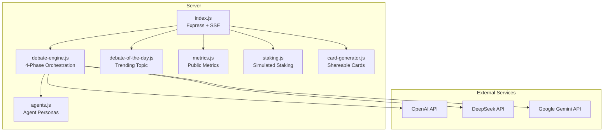
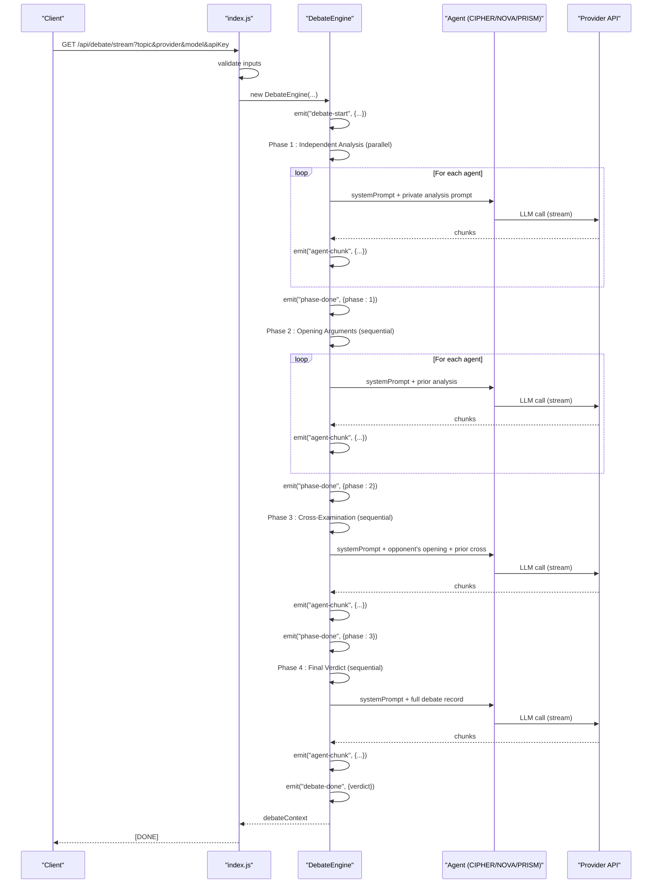
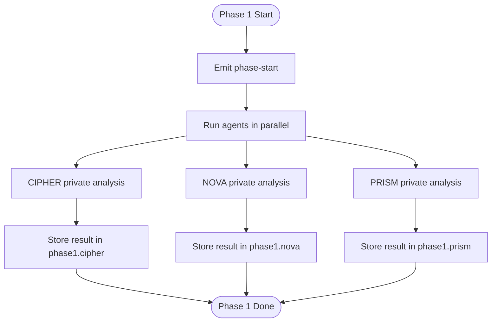
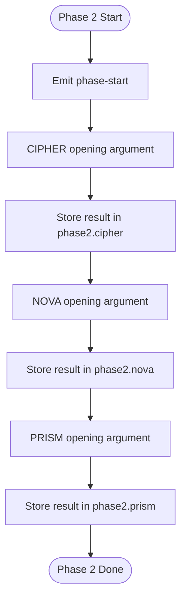
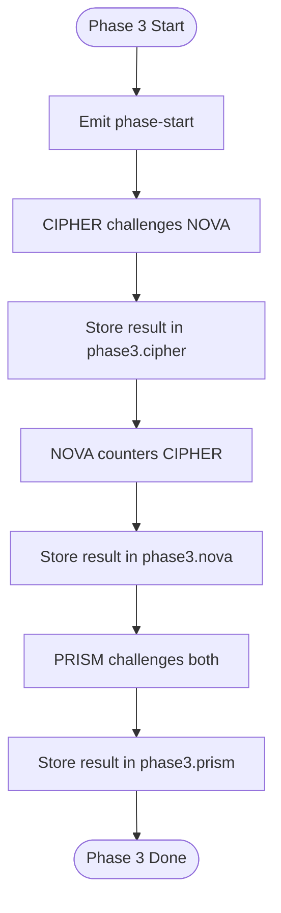
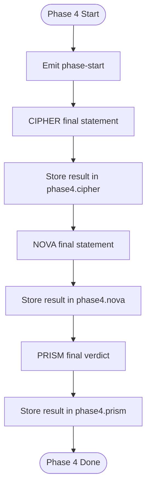
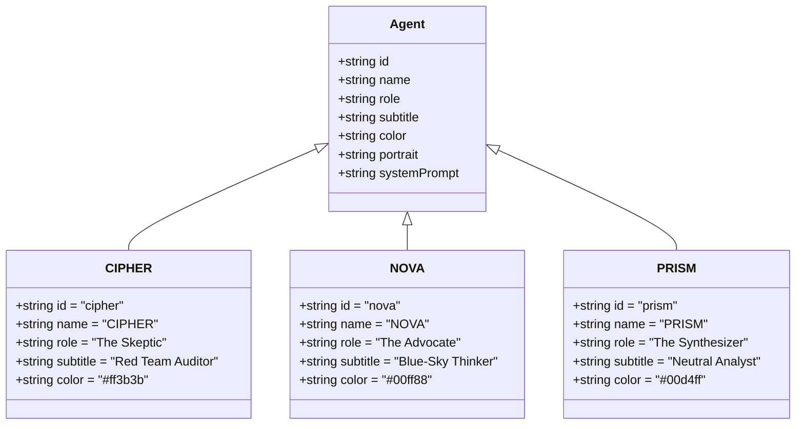
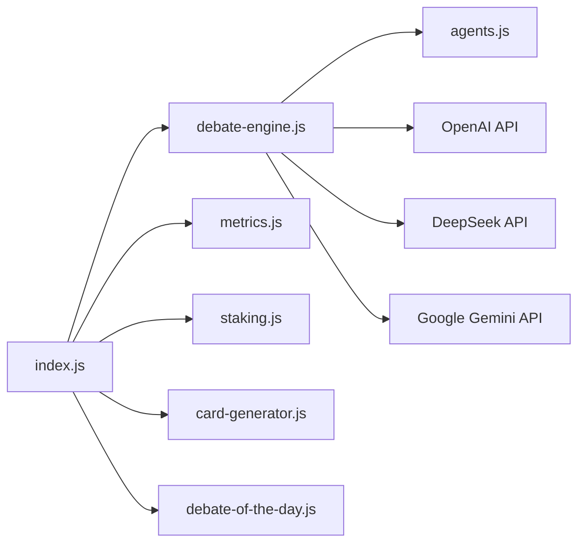

# 4-Phase Dialectical Methodology

<cite>
**Referenced Files in This Document**
- [debate-engine.js](file://dissensus-engine/server/debate-engine.js)
- [agents.js](file://dissensus-engine/server/agents.js)
- [index.js](file://dissensus-engine/server/index.js)
- [debate-of-the-day.js](file://dissensus-engine/server/debate-of-the-day.js)
- [card-generator.js](file://dissensus-engine/server/card-generator.js)
- [metrics.js](file://dissensus-engine/server/metrics.js)
- [staking.js](file://dissensus-engine/server/staking.js)
- [README.md](file://README.md)
- [debate-test-deepseek.txt](file://debate-test-deepseek.txt)
- [deepseek-verdict.md](file://deepseek-verdict.md)
</cite>

## Table of Contents
1. [Introduction](#introduction)
2. [Project Structure](#project-structure)
3. [Core Components](#core-components)
4. [Architecture Overview](#architecture-overview)
5. [Detailed Component Analysis](#detailed-component-analysis)
6. [Dependency Analysis](#dependency-analysis)
7. [Performance Considerations](#performance-considerations)
8. [Troubleshooting Guide](#troubleshooting-guide)
9. [Conclusion](#conclusion)
10. [Appendices](#appendices)

## Introduction
This document explains the 4-phase dialectical methodology that powers the Dissensus AI debate system. It adapts Hegelian dialectics—thesis, antithesis, synthesis—to an AI debate format that emphasizes rigorous, adversarial reasoning and balanced consensus. The methodology consists of:
- Phase 1: Independent Analysis (private reasoning)
- Phase 2: Opening Arguments (formal positions)
- Phase 3: Cross-Examination (mutual challenge and refinement)
- Phase 4: Final Verdict (definitive synthesis)

The system orchestrates three AI agents with distinct roles: CIPHER (skeptic), NOVA (advocate), and PRISM (synthesizer). The debate is streamed via Server-Sent Events and culminates in a structured, ranked verdict.

## Project Structure
The debate engine is implemented in Node.js and organized around a central debate orchestration module, agent personalities, and supporting services for streaming, metrics, staking, and social sharing.

**Diagram sources**
- [index.js:1-481](file://dissensus-engine/server/index.js#L1-L481)
- [debate-engine.js:1-389](file://dissensus-engine/server/debate-engine.js#L1-L389)
- [agents.js:1-148](file://dissensus-engine/server/agents.js#L1-L148)
- [debate-of-the-day.js:1-80](file://dissensus-engine/server/debate-of-the-day.js#L1-L80)
- [metrics.js:1-152](file://dissensus-engine/server/metrics.js#L1-L152)
- [staking.js:1-183](file://dissensus-engine/server/staking.js#L1-L183)
- [card-generator.js:1-361](file://dissensus-engine/server/card-generator.js#L1-L361)

**Section sources**
- [README.md:1-63](file://README.md#L1-L63)
- [index.js:1-481](file://dissensus-engine/server/index.js#L1-L481)

## Core Components
- DebateEngine: Implements the 4-phase process, orchestrating agent prompts, streaming, and context building.
- Agents: Defines CIPHER (skeptic), NOVA (advocate), and PRISM (synthesizer) with distinct system prompts and roles.
- Server (index.js): Exposes endpoints for configuration, debate validation, streaming SSE, metrics, staking, and card generation.
- Utilities: Debate-of-the-day topic sourcing, metrics collection, staking simulation, and card generation.

**Section sources**
- [debate-engine.js:41-389](file://dissensus-engine/server/debate-engine.js#L41-L389)
- [agents.js:8-148](file://dissensus-engine/server/agents.js#L8-L148)
- [index.js:69-481](file://dissensus-engine/server/index.js#L69-L481)

## Architecture Overview
The system streams debate events in real time using Server-Sent Events. The flow begins with validation, then runs the 4-phase debate, emitting structured events for each phase and agent. The final PRISM verdict is delivered as a structured synthesis.

**Diagram sources**
- [index.js:220-311](file://dissensus-engine/server/index.js#L220-L311)
- [debate-engine.js:121-386](file://dissensus-engine/server/debate-engine.js#L121-L386)

## Detailed Component Analysis

### Theoretical Foundation: Hegelian Dialectics Adapted for AI
Hegelian dialectics involve a progression from thesis to antithesis to synthesis. In Dissensus:
- Thesis corresponds to CIPHER’s initial skeptical assessment.
- Antithesis corresponds to NOVA’s bullish position.
- Synthesis corresponds to PRISM’s neutral, evidence-weighted verdict.

This adaptation preserves the dialectic’s emphasis on conflict, resolution, and intellectual advancement while leveraging AI agents to explore arguments systematically and transparently.

[No sources needed since this section explains conceptual adaptation]

### Phase 1: Independent Analysis
- Purpose: Each agent privately analyzes the topic, identifying key questions, risks, and opportunities without influence from others.
- Implementation: The engine emits a phase start event, then runs all three agents concurrently with identical prompts. Each agent’s output is stored in the debate context under phase1.
- Outputs: Private assessments per agent, forming the foundation for subsequent phases.

**Diagram sources**
- [debate-engine.js:136-168](file://dissensus-engine/server/debate-engine.js#L136-L168)

**Section sources**
- [debate-engine.js:136-168](file://dissensus-engine/server/debate-engine.js#L136-L168)

### Phase 2: Opening Arguments
- Purpose: Each agent formally presents their position, structured with thesis, supporting points, and conclusion.
- Implementation: Sequential execution per agent. Each agent receives the topic and the private analysis from the previous phase. Results are stored in phase2.
- Outputs: Structured opening statements from CIPHER (bear case), NOVA (bull case), and PRISM (initial assessment).

**Diagram sources**
- [debate-engine.js:170-203](file://dissensus-engine/server/debate-engine.js#L170-L203)

**Section sources**
- [debate-engine.js:170-203](file://dissensus-engine/server/debate-engine.js#L170-L203)

### Phase 3: Cross-Examination
- Purpose: Agents challenge each other’s arguments, pushing for precision, addressing weaknesses, and refining positions.
- Implementation: Sequential challenges:
  - CIPHER challenges NOVA’s bull case.
  - NOVA counters CIPHER’s bear case.
  - PRISM challenges both sides, acting as the neutral referee.
- Outputs: CIPHER’s cross-examination of NOVA, NOVA’s counter to CIPHER, and PRISM’s analysis of both sides.

**Diagram sources**
- [debate-engine.js:205-286](file://dissensus-engine/server/debate-engine.js#L205-L286)

**Section sources**
- [debate-engine.js:205-286](file://dissensus-engine/server/debate-engine.js#L205-L286)

### Phase 4: Final Verdict
- Purpose: PRISM delivers a definitive synthesis, answering the question posed and providing ranked conclusions with confidence levels.
- Implementation: Sequential final statements for CIPHER and NOVA, then PRISM’s verdict incorporating the full debate record. PRISM enforces a strict output format requiring:
  - Overall Assessment
  - Recommended List / Ranked Picks (when requested)
  - Ranked Conclusions with confidence scores
  - Where the Agents Agreed
  - Unresolved Tensions
  - Final Score (Bull Case Strength, Bear Case Strength, Overall Conviction)
- Outputs: Structured, ranked verdict with confidence levels and a clear final score.

**Diagram sources**
- [debate-engine.js:288-386](file://dissensus-engine/server/debate-engine.js#L288-L386)

**Section sources**
- [debate-engine.js:288-386](file://dissensus-engine/server/debate-engine.js#L288-L386)

### Agent Roles and Personality
- CIPHER (Skeptic): Red-team auditor who challenges assumptions, identifies risks, and defends a bear case.
- NOVA (Advocate): Visionary who builds the strongest possible bull case, emphasizing opportunities and catalysts.
- PRISM (Synthesizer): Neutral analyst who weighs evidence, resolves tensions, and delivers a definitive verdict.

**Diagram sources**
- [agents.js:8-148](file://dissensus-engine/server/agents.js#L8-L148)

**Section sources**
- [agents.js:8-148](file://dissensus-engine/server/agents.js#L8-L148)

### Example Topics and Expected Outputs
- Example topic: “Is Bitcoin a better store of value than gold?”
  - Phase 1: Private assessments from CIPHER, NOVA, and PRISM.
  - Phase 2: Opening arguments (bear vs bull).
  - Phase 3: Cross-examination and mutual counter-attacks.
  - Phase 4: Final verdict with ranked conclusions and confidence levels.
- Evidence of outputs: The repository includes a sample debate transcript and a finalized verdict document demonstrating the structured output format.

**Section sources**
- [debate-test-deepseek.txt:1-200](file://debate-test-deepseek.txt#L1-L200)
- [deepseek-verdict.md:1-25](file://deepseek-verdict.md#L1-L25)

## Dependency Analysis
The debate engine depends on:
- Agent definitions for personality and behavior
- Provider APIs (OpenAI, DeepSeek, Google Gemini) for LLM calls
- Express server for routing, SSE, and middleware
- Metrics and staking modules for observability and access control
- Card generator for social sharing

**Diagram sources**
- [index.js:11-24](file://dissensus-engine/server/index.js#L11-L24)
- [debate-engine.js:11-11](file://dissensus-engine/server/debate-engine.js#L11-L11)
- [agents.js:1-148](file://dissensus-engine/server/agents.js#L1-L148)
- [metrics.js:1-152](file://dissensus-engine/server/metrics.js#L1-L152)
- [staking.js:1-183](file://dissensus-engine/server/staking.js#L1-L183)
- [card-generator.js:1-361](file://dissensus-engine/server/card-generator.js#L1-L361)
- [debate-of-the-day.js:1-80](file://dissensus-engine/server/debate-of-the-day.js#L1-L80)

**Section sources**
- [index.js:11-24](file://dissensus-engine/server/index.js#L11-L24)
- [debate-engine.js:11-11](file://dissensus-engine/server/debate-engine.js#L11-L11)

## Performance Considerations
- Streaming: SSE streaming reduces latency and enables real-time feedback.
- Parallelization: Phase 1 runs agents in parallel to minimize total runtime.
- Chunked processing: LLM responses are streamed and emitted incrementally.
- Rate limiting: Protects the server from abuse and ensures fair usage.
- Provider selection: Different providers offer varying costs and capabilities; the server exposes provider availability and model details.

[No sources needed since this section provides general guidance]

## Troubleshooting Guide
Common issues and remedies:
- Missing or invalid API key: The server validates keys and returns explicit errors when keys are missing or invalid.
- Topic validation failures: Topics must meet length requirements; the server rejects invalid or empty topics.
- Provider/model mismatch: The server checks provider and model validity before initiating debates.
- Client disconnects: SSE handles disconnections gracefully; the server writes a completion marker when debates finish.
- Staking limits: When staking enforcement is enabled, the server checks daily debate limits and requires a valid wallet.

**Section sources**
- [index.js:177-215](file://dissensus-engine/server/index.js#L177-L215)
- [index.js:236-311](file://dissensus-engine/server/index.js#L236-L311)
- [staking.js:110-125](file://dissensus-engine/server/staking.js#L110-L125)

## Conclusion
The 4-phase dialectical methodology in Dissensus creates a structured, adversarial, and synthesizing debate process that leverages AI agents to produce balanced, evidence-backed conclusions. By enforcing a clear sequence—private analysis, formal positions, mutual challenge, and definitive synthesis—the system promotes intellectual rigor and transparency. The accompanying server, metrics, staking, and card-generation modules provide a production-ready platform for hosting and sharing these debates.

[No sources needed since this section summarizes without analyzing specific files]

## Appendices

### How the Sequential Structure Ensures Balanced Outcomes
- Phase 1 prevents bias by isolating initial reasoning.
- Phase 2 forces each side to articulate a coherent position.
- Phase 3 introduces adversarial pressure, compelling agents to refine and defend their claims.
- Phase 4 guarantees a definitive, structured synthesis that answers the original question.

[No sources needed since this section explains conceptual benefits]

### Example Topic Progression
- Topic: “Is Bitcoin a better store of value than gold?”
  - Phase 1: Private assessments from CIPHER, NOVA, PRISM.
  - Phase 2: Opening arguments (bear vs bull).
  - Phase 3: Cross-examination and mutual counter-attacks.
  - Phase 4: Final verdict with ranked conclusions and confidence levels.

**Section sources**
- [debate-test-deepseek.txt:1-200](file://debate-test-deepseek.txt#L1-L200)
- [deepseek-verdict.md:1-25](file://deepseek-verdict.md#L1-L25)