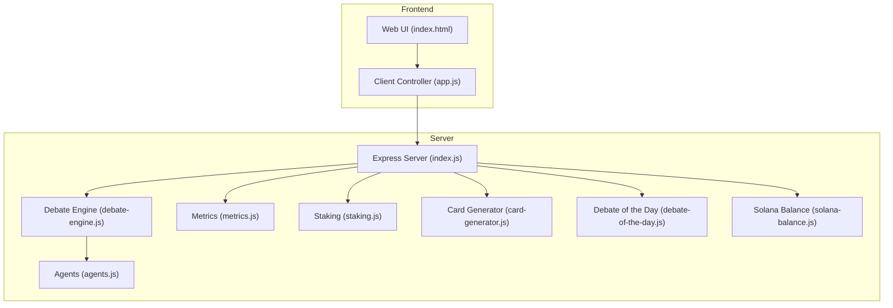
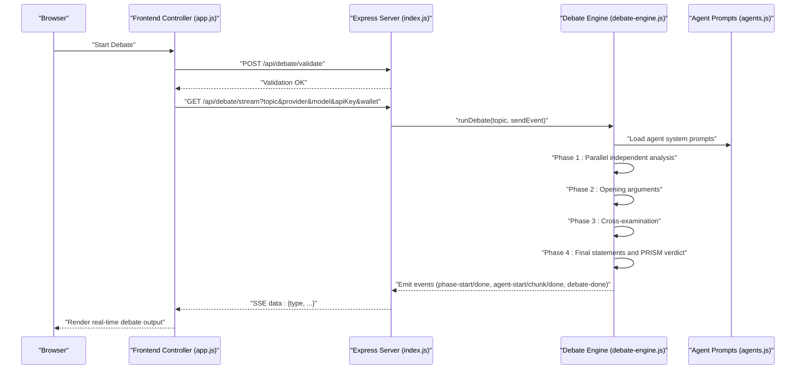
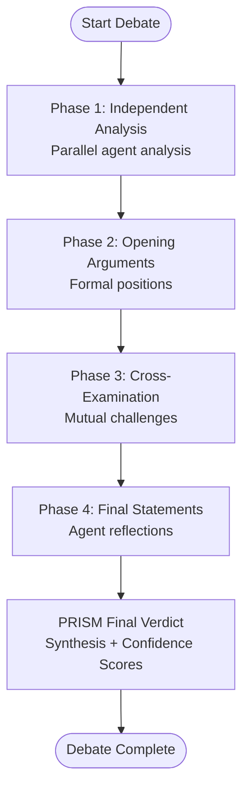
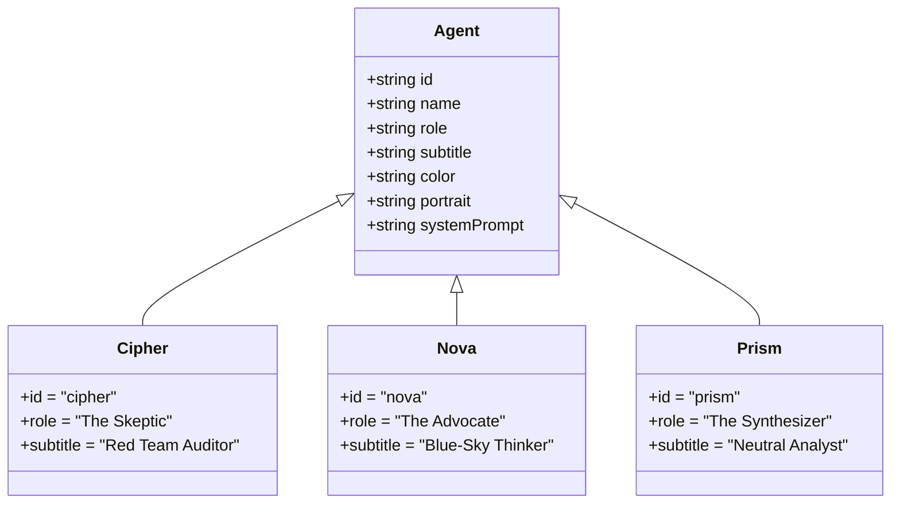
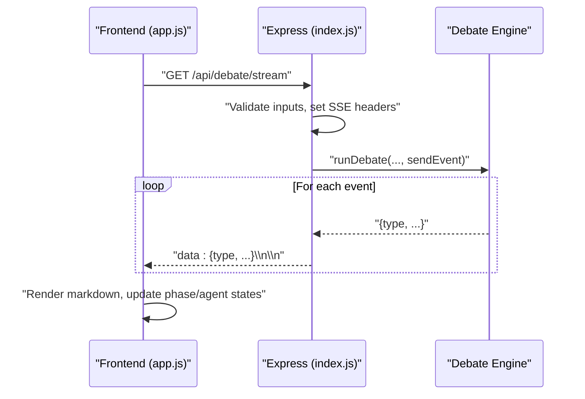
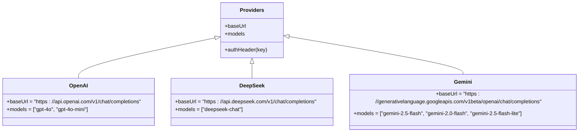
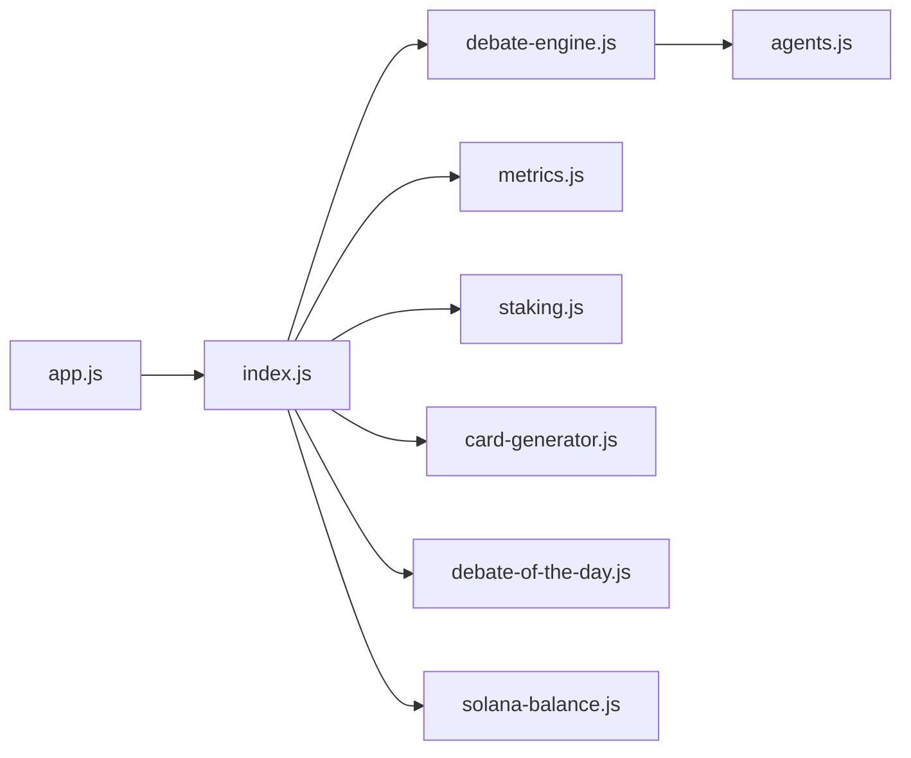

# AI Debate Engine

<cite>
**Referenced Files in This Document**
- [debate-engine.js](file://dissensus-engine/server/debate-engine.js)
- [agents.js](file://dissensus-engine/server/agents.js)
- [index.js](file://dissensus-engine/server/index.js)
- [app.js](file://dissensus-engine/public/js/app.js)
- [card-generator.js](file://dissensus-engine/server/card-generator.js)
- [metrics.js](file://dissensus-engine/server/metrics.js)
- [staking.js](file://dissensus-engine/server/staking.js)
- [debate-of-the-day.js](file://dissensus-engine/server/debate-of-the-day.js)
- [solana-balance.js](file://dissensus-engine/server/solana-balance.js)
- [README.md](file://dissensus-engine/README.md)
- [package.json](file://dissensus-engine/package.json)
- [QUICK-REFERENCE.md](file://dissensus-engine/docs/QUICK-REFERENCE.md)
</cite>

## Update Summary
**Changes Made**
- Updated timeout system documentation to reflect new 90-second per-call AbortController-based timeout
- Updated token limit documentation to reflect reduced maximum tokens from 1500 to 1000
- Updated performance considerations section with new timeout and token limit information
- Updated troubleshooting guide to include timeout-related error handling

## Table of Contents
1. [Introduction](#introduction)
2. [Project Structure](#project-structure)
3. [Core Components](#core-components)
4. [Architecture Overview](#architecture-overview)
5. [Detailed Component Analysis](#detailed-component-analysis)
6. [Dependency Analysis](#dependency-analysis)
7. [Performance Considerations](#performance-considerations)
8. [Troubleshooting Guide](#troubleshooting-guide)
9. [Conclusion](#conclusion)
10. [Appendices](#appendices)

## Introduction
The AI Debate Engine is a multi-agent, 4-phase dialectical system that simulates a structured debate among three AI agents: CIPHER (the skeptic), NOVA (the advocate), and PRISM (the synthesizer). The engine orchestrates a real-time, streaming debate process powered by OpenAI, DeepSeek, and Google Gemini, emitting Server-Sent Events (SSE) to a web UI. The system emphasizes adversarial testing, structured argumentation, cross-examination, and a definitive synthesis with confidence scores.

## Project Structure
The system is organized around a Node.js/Express server with a frontend that consumes SSE events. Supporting modules implement staking, metrics, card generation, and Solana balance checks. The server exposes endpoints for configuration, debate orchestration, metrics, and shareable cards.



**Diagram sources**
- [index.js:1-356](file://dissensus-engine/server/index.js#L1-L356)
- [debate-engine.js:1-399](file://dissensus-engine/server/debate-engine.js#L1-L399)
- [agents.js:1-148](file://dissensus-engine/server/agents.js#L1-L148)
- [metrics.js:1-112](file://dissensus-engine/server/metrics.js#L1-L112)
- [staking.js:1-183](file://dissensus-engine/server/staking.js#L1-L183)
- [card-generator.js:1-361](file://dissensus-engine/server/card-generator.js#L1-L361)
- [debate-of-the-day.js:1-80](file://dissensus-engine/server/debate-of-the-day.js#L1-L80)
- [solana-balance.js:1-83](file://dissensus-engine/server/solana-balance.js#L1-L83)

**Section sources**
- [README.md:110-134](file://dissensus-engine/README.md#L110-L134)
- [package.json:1-28](file://dissensus-engine/package.json#L1-L28)

## Core Components
- Debate Engine: Implements the 4-phase dialectical process, orchestrates agent prompts, and streams results via SSE with enhanced timeout protection.
- Agent Personality Definitions: Defines CIPHER (skeptic), NOVA (advocate), and PRISM (synthesizer) with distinct system prompts and roles.
- Server and SSE: Express server with SSE streaming, input validation, rate limiting, and optional staking enforcement.
- Frontend Controller: Manages SSE consumption, real-time UI updates, provider/model selection, and shareable card generation.
- Metrics and Staking: In-memory analytics and simulated staking with tier-based debate limits.
- Card Generator: Generates shareable PNG cards from debate verdicts, optionally summarizing long outputs.
- Solana Integration: Server-side read-only balance checks for SPL tokens.

**Section sources**
- [debate-engine.js:41-399](file://dissensus-engine/server/debate-engine.js#L41-L399)
- [agents.js:8-148](file://dissensus-engine/server/agents.js#L8-L148)
- [index.js:26-356](file://dissensus-engine/server/index.js#L26-L356)
- [app.js:1-554](file://dissensus-engine/public/js/app.js#L1-L554)
- [metrics.js:10-112](file://dissensus-engine/server/metrics.js#L10-L112)
- [staking.js:9-183](file://dissensus-engine/server/staking.js#L9-L183)
- [card-generator.js:40-152](file://dissensus-engine/server/card-generator.js#L40-L152)
- [solana-balance.js:26-76](file://dissensus-engine/server/solana-balance.js#L26-L76)

## Architecture Overview
The system follows a client-server architecture with SSE for real-time streaming. The frontend initiates debates, validates inputs, and streams events to update the UI. The backend validates parameters, selects provider/model, invokes the Debate Engine, and emits structured events for each phase and agent.



**Diagram sources**
- [index.js:220-356](file://dissensus-engine/server/index.js#L220-L356)
- [debate-engine.js:121-399](file://dissensus-engine/server/debate-engine.js#L121-L399)
- [agents.js:8-148](file://dissensus-engine/server/agents.js#L8-L148)
- [app.js:209-427](file://dissensus-engine/public/js/app.js#L209-L427)

## Detailed Component Analysis

### Debate Orchestration Logic (4-Phase Dialectical Process)
- Phase 1: Independent Analysis
  - All agents analyze the topic in parallel using their system prompts.
  - Results are collected and stored in the debate context.
- Phase 2: Opening Arguments
  - Each agent presents a structured position based on their independent analysis.
- Phase 3: Cross-Examination
  - CIPHER challenges NOVA's bull case.
  - NOVA counters CIPHER's bear case.
  - PRISM challenges both sides and pushes for stronger arguments.
- Phase 4: Final Verdict
  - Agents issue final statements reflecting any shifts in position.
  - PRISM delivers a definitive synthesis with recommended lists, ranked conclusions, areas of agreement, unresolved tensions, and a final score.



**Diagram sources**
- [debate-engine.js:136-399](file://dissensus-engine/server/debate-engine.js#L136-L399)

**Section sources**
- [debate-engine.js:121-399](file://dissensus-engine/server/debate-engine.js#L121-L399)

### Agent Personality Definitions and Decision-Making
- CIPHER (Skeptic)
  - Role: Red-team auditor; adversarial stress-testing.
  - Behavior: Identifies risks, weaknesses, and flaws; challenges optimistic assumptions.
- NOVA (Advocate)
  - Role: Visionary optimist; opportunity-finder.
  - Behavior: Builds the strongest bull case; contextualizes risks against opportunities.
- PRISM (Synthesizer)
  - Role: Neutral referee; objective analyst.
  - Behavior: Challenges both sides, identifies consensus and unresolved tensions, delivers ranked conclusions with confidence.



**Diagram sources**
- [agents.js:8-148](file://dissensus-engine/server/agents.js#L8-L148)

**Section sources**
- [agents.js:8-148](file://dissensus-engine/server/agents.js#L8-L148)

### Real-Time Streaming Architecture (SSE)
- Server sets SSE headers and streams structured events:
  - phase-start, phase-done
  - agent-start, agent-chunk, agent-done
  - debate-done
- Frontend consumes the stream, renders markdown, and updates UI states.
- Timeout protection: Debates abort after 10 minutes client-side to prevent hanging connections.



**Diagram sources**
- [index.js:277-356](file://dissensus-engine/server/index.js#L277-L356)
- [app.js:307-427](file://dissensus-engine/public/js/app.js#L307-L427)

**Section sources**
- [index.js:220-356](file://dissensus-engine/server/index.js#L220-L356)
- [app.js:209-427](file://dissensus-engine/public/js/app.js#L209-L427)

### Provider Integration Patterns
- Supported providers: OpenAI, DeepSeek, Google Gemini.
- Each provider defines base URLs, supported models, and authentication headers.
- The engine constructs OpenAI-compatible chat completions requests with streaming enabled.
- Server-side keys can be configured to avoid sending keys to the client.



**Diagram sources**
- [debate-engine.js:14-39](file://dissensus-engine/server/debate-engine.js#L14-L39)

**Section sources**
- [debate-engine.js:14-53](file://dissensus-engine/server/debate-engine.js#L14-L53)

### Conversation Flow Management
- Input validation occurs before streaming:
  - Topic length limits, provider/model validation, API key availability.
- Rate limiting protects the server from abuse.
- Staking enforcement can require a wallet and daily debate limits by tier.
- The frontend pre-validates inputs to avoid SSE 400 errors.

```mermaid
flowchart TD
A["User submits topic/provider/model/apiKey/wallet"] --> B["Preflight validation (/api/debate/validate)"]
B --> |OK| C["Connect SSE stream (/api/debate/stream)"]
B --> |Fail| E["Show error message"]
C --> D["Stream events to UI"]
```

**Diagram sources**
- [index.js:177-215](file://dissensus-engine/server/index.js#L177-L215)
- [index.js:220-356](file://dissensus-engine/server/index.js#L220-L356)
- [app.js:274-292](file://dissensus-engine/public/js/app.js#L274-L292)

**Section sources**
- [index.js:177-215](file://dissensus-engine/server/index.js#L177-L215)
- [index.js:220-356](file://dissensus-engine/server/index.js#L220-L356)
- [app.js:209-292](file://dissensus-engine/public/js/app.js#L209-L292)

### Conflict Resolution Mechanisms
- PRISM's role is to synthesize arguments, identify where agents agree and disagree, and deliver a definitive verdict.
- During cross-examination, PRISM challenges both sides to strengthen weaker arguments and expose logical fallacies.
- The final verdict includes ranked conclusions with confidence scores and explicit "Recommended List" sections when requested.

**Section sources**
- [agents.js:81-148](file://dissensus-engine/server/agents.js#L81-L148)
- [debate-engine.js:253-399](file://dissensus-engine/server/debate-engine.js#L253-L399)

### Examples and Usage Patterns
- Debate initiation:
  - Select provider, model, enter topic, optionally enter API key (or rely on server-side key).
  - Click "Start Debate"; the SSE stream updates the UI in real-time.
- Parameter configuration:
  - Provider selection influences model availability and pricing.
  - Wallet can be saved for staking enforcement and daily debate limits.
- Real-time interaction:
  - UI shows active agent status, phase progress, and live markdown rendering of agent contributions.

**Section sources**
- [README.md:56-64](file://dissensus-engine/README.md#L56-L64)
- [app.js:209-427](file://dissensus-engine/public/js/app.js#L209-L427)
- [index.js:69-85](file://dissensus-engine/server/index.js#L69-L85)

## Dependency Analysis
The server composes several modules with clear separation of concerns. The frontend depends on SSE events emitted by the backend. Metrics and staking integrate with the server for transparency and usage gating.



**Diagram sources**
- [index.js:1-356](file://dissensus-engine/server/index.js#L1-L356)
- [debate-engine.js:1-399](file://dissensus-engine/server/debate-engine.js#L1-L399)
- [agents.js:1-148](file://dissensus-engine/server/agents.js#L1-L148)
- [metrics.js:1-112](file://dissensus-engine/server/metrics.js#L1-L112)
- [staking.js:1-183](file://dissensus-engine/server/staking.js#L1-L183)
- [card-generator.js:1-361](file://dissensus-engine/server/card-generator.js#L1-L361)
- [debate-of-the-day.js:1-80](file://dissensus-engine/server/debate-of-the-day.js#L1-L80)
- [solana-balance.js:1-83](file://dissensus-engine/server/solana-balance.js#L1-L83)

**Section sources**
- [package.json:10-19](file://dissensus-engine/package.json#L10-L19)

## Performance Considerations
- Streaming: The engine streams token chunks from providers to minimize latency and provide responsive UI updates.
- Parallelism: Phase 1 runs all agents concurrently to reduce total debate time.
- Rate limiting: Protects the server from overload; adjust thresholds based on deployment scale.
- Token limits: The engine sets a maximum token budget per agent call (reduced to 1000 tokens) to improve performance and reduce costs.
- Provider choice: Lower-cost providers (e.g., DeepSeek, Gemini) enable higher throughput; premium providers (e.g., OpenAI) offer higher quality.
- Timeout protection: Enhanced with 90-second per-call AbortController-based timeout to prevent hanging connections and resource exhaustion.
- Frontend timeout: Debates automatically abort after 10 minutes client-side to prevent resource exhaustion.

**Updated** Added information about the new 90-second per-call timeout and reduced token limit from 1500 to 1000 for improved performance.

**Section sources**
- [debate-engine.js:67-90](file://dissensus-engine/server/debate-engine.js#L67-L90)
- [debate-engine.js:84](file://dissensus-engine/server/debate-engine.js#L84)

## Troubleshooting Guide
Common issues and remedies:
- Validation failures: Ensure topic length, provider/model validity, and API key presence. The frontend pre-validates; server also validates on stream start.
- Rate limiting: If receiving rate limit errors, wait for the cooldown period or reduce concurrent debates.
- SSE connection issues: Confirm the endpoint is reachable and the client supports SSE. The frontend uses fetch with a reader for robustness.
- Staking enforcement: If debates require a wallet, ensure a valid Solana address is saved and staking limits are respected.
- Server health: Use the health endpoint and logs to diagnose issues; refer to quick reference for systemctl and journalctl commands.
- Timeout errors: If debates exceed the 90-second per-call timeout, consider simplifying the topic or using a more responsive provider.
- Token limit exceeded: If responses are truncated, reduce topic complexity or use providers with higher token limits.

**Updated** Added timeout-related error handling and token limit troubleshooting information.

**Section sources**
- [index.js:177-215](file://dissensus-engine/server/index.js#L177-L215)
- [index.js:220-356](file://dissensus-engine/server/index.js#L220-L356)
- [debate-engine.js:67-90](file://dissensus-engine/server/debate-engine.js#L67-L90)
- [app.js:325-332](file://dissensus-engine/public/js/app.js#L325-L332)

## Conclusion
The AI Debate Engine implements a robust, real-time, multi-agent dialectical system with clear phases, distinct agent personalities, and transparent streaming. It integrates provider flexibility, optional staking enforcement, and shareable outputs, enabling scalable and engaging debates across diverse topics. The enhanced timeout system and reduced token limits improve reliability and performance while maintaining the system's sophisticated debate capabilities.

## Appendices

### Provider and Model Configuration
- Providers and models are defined centrally; new providers can be added by extending the provider configuration object.

**Section sources**
- [debate-engine.js:14-39](file://dissensus-engine/server/debate-engine.js#L14-L39)

### Metrics and Transparency
- In-memory metrics track debates, provider usage, and recent topics; production deployments should persist metrics to a database.

**Section sources**
- [metrics.js:10-112](file://dissensus-engine/server/metrics.js#L10-L112)

### Staking and Access Control
- Simulated staking enforces daily debate limits by tier; production would integrate on-chain stake verification.

**Section sources**
- [staking.js:9-183](file://dissensus-engine/server/staking.js#L9-L183)

### Shareable Cards
- Cards summarize long verdicts and export PNGs optimized for social sharing.

**Section sources**
- [card-generator.js:40-152](file://dissensus-engine/server/card-generator.js#L40-L152)

### Solana Integration
- Server-side balance checks protect client privacy; supports configurable RPC and mint.

**Section sources**
- [solana-balance.js:26-76](file://dissensus-engine/server/solana-balance.js#L26-L76)