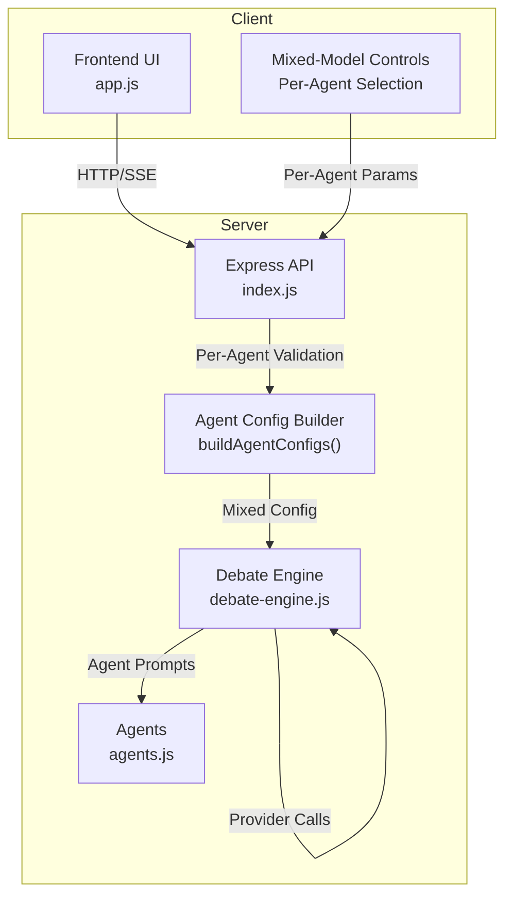
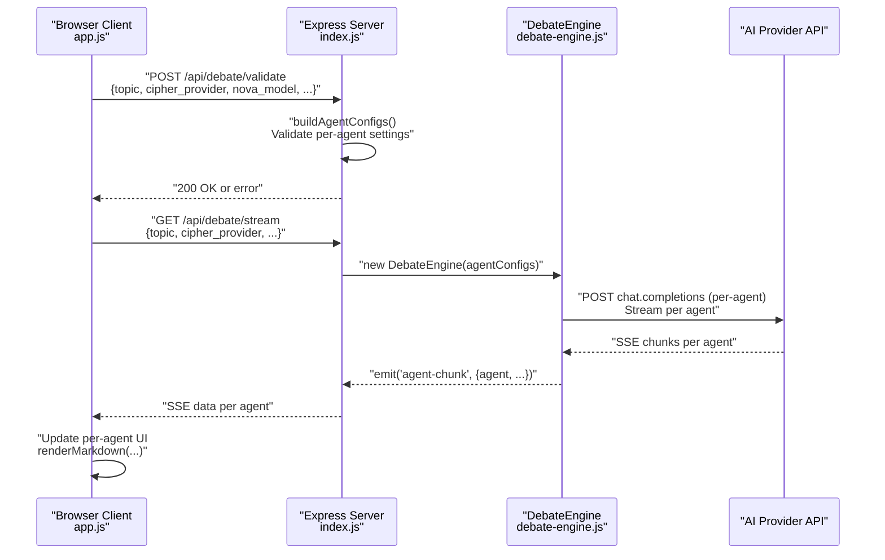
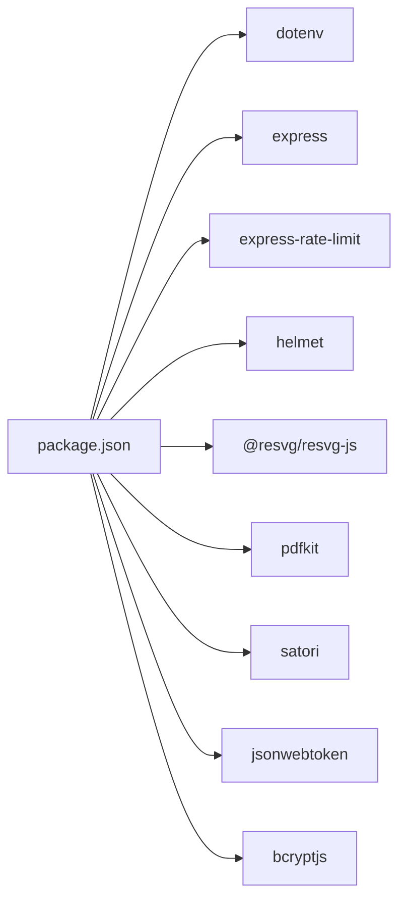

# AI Provider Integration

<cite>
**Referenced Files in This Document**
- [index.js](file://dissensus-engine/server/index.js)
- [debate-engine.js](file://dissensus-engine/server/debate-engine.js)
- [agents.js](file://dissensus-engine/server/agents.js)
- [app.js](file://dissensus-engine/public/js/app.js)
- [README.md](file://dissensus-engine/README.md)
- [package.json](file://dissensus-engine/package.json)
</cite>

## Update Summary
**Changes Made**
- Added comprehensive mixed-model debate capabilities allowing different AI providers/models for each agent (Cipher, Nova, Prism)
- Enhanced provider configuration with individual agent model selection controls and dynamic model dropdowns
- Updated DebateEngine constructor to support both legacy single-provider mode and new per-agent mode
- Implemented dynamic agent configuration building with server-side key validation
- Enhanced frontend UI with per-agent provider selection and mixed-mode toggle functionality

## Table of Contents
1. [Introduction](#introduction)
2. [Project Structure](#project-structure)
3. [Core Components](#core-components)
4. [Architecture Overview](#architecture-overview)
5. [Detailed Component Analysis](#detailed-component-analysis)
6. [Mixed-Model Debate Capabilities](#mixed-model-debate-capabilities)
7. [Dependency Analysis](#dependency-analysis)
8. [Performance Considerations](#performance-considerations)
9. [Troubleshooting Guide](#troubleshooting-guide)
10. [Conclusion](#conclusion)
11. [Appendices](#appendices)

## Introduction
This document explains the AI provider integration system that powers the multi-agent debate engine with advanced mixed-model capabilities. The system now supports assigning different AI providers and models to each of the three agents (Cipher, Nova, Prism) while maintaining backward compatibility with single-provider configurations. It covers the PROVIDERS configuration object, the provider abstraction layer, authentication mechanisms, model configuration, cost calculation features, API integration patterns, request formatting, streaming response handling, and error management. The system includes enhanced provider selection logic with fallback mechanisms and performance considerations for multi-provider deployments.

## Project Structure
The AI provider integration spans the server and client layers with enhanced mixed-model capabilities:
- Server: Express-based API with SSE streaming, provider configuration, debate orchestration, and per-agent model validation
- Client: Browser frontend with per-agent provider/model selection, mixed-mode toggle, dynamic model dropdowns, and real-time debate streaming
- Shared: Agent personalities and debate phases orchestrated by the server

**Diagram sources**
- [index.js:142-167](file://dissensus-engine/server/index.js#L142-L167)
- [debate-engine.js:42-61](file://dissensus-engine/server/debate-engine.js#L42-L61)
- [app.js:88-114](file://dissensus-engine/public/js/app.js#L88-L114)

**Section sources**
- [README.md:103-125](file://dissensus-engine/README.md#L103-L125)
- [package.json:10-20](file://dissensus-engine/package.json#L10-L20)

## Core Components
- PROVIDERS configuration object defines base URLs, supported models, and authentication header builders for OpenAI, DeepSeek, and Google Gemini
- Enhanced DebateEngine with dual-mode support: legacy single-provider and new per-agent mixed-model configurations
- Dynamic agent configuration builder that validates server-side keys and constructs per-agent provider settings
- Server routes with enhanced validation for both global and per-agent provider/model parameters
- Advanced frontend app.js with per-agent provider/model selection, mixed-mode toggle, and dynamic UI updates

Key responsibilities:
- Provider abstraction: Unified interface for OpenAI-compatible chat completions across multiple agents
- Authentication: Bearer token construction per provider with server-side key management
- Mixed-model configuration: Per-agent model selection with dynamic dropdowns and validation
- Streaming: Server-Sent Events with incremental token delivery for each agent
- Error handling: Comprehensive validation, rate limiting, and graceful degradation for mixed configurations

**Section sources**
- [debate-engine.js:42-61](file://dissensus-engine/server/debate-engine.js#L42-L61)
- [index.js:142-167](file://dissensus-engine/server/index.js#L142-L167)
- [index.js:319-428](file://dissensus-engine/server/index.js#L319-L428)
- [app.js:88-114](file://dissensus-engine/public/js/app.js#L88-L114)

## Architecture Overview
The system integrates providers through an enhanced abstraction layer that supports both traditional single-provider configurations and advanced mixed-model setups. The server validates inputs, builds per-agent configurations, and streams real-time debate results via SSE. The client renders provider/model options, handles user preferences, manages per-agent selections, and displays streamed content with dynamic UI updates.

**Diagram sources**
- [index.js:172-218](file://dissensus-engine/server/index.js#L172-L218)
- [index.js:319-428](file://dissensus-engine/server/index.js#L319-L428)
- [debate-engine.js:66-83](file://dissensus-engine/server/debate-engine.js#L66-L83)
- [app.js:334-411](file://dissensus-engine/public/js/app.js#L334-L411)

## Detailed Component Analysis

### PROVIDERS Configuration Object
The PROVIDERS object centralizes provider definitions with enhanced support for mixed-model configurations:
- Base URL: OpenAI-compatible endpoint for each provider
- Models: Map of model IDs to human-readable names and cost-per-1k-in/out
- Auth header: Provider-specific Authorization header builder

Supported providers remain unchanged:
- OpenAI: gpt-4o, gpt-4o-mini
- DeepSeek: deepseek-chat
- Google Gemini: gemini-2.5-flash, gemini-2.0-flash, gemini-2.5-flash-lite

Cost calculation continues to expose pricing for transparency across all configurations.

**Section sources**
- [debate-engine.js:14-39](file://dissensus-engine/server/debate-engine.js#L14-L39)
- [index.js:107-121](file://dissensus-engine/server/index.js#L107-L121)

### Enhanced Provider Abstraction Layer
The DebateEngine now supports dual operational modes with comprehensive per-agent configuration:

**Dual-Mode Constructor:**
- **Legacy Mode**: Single provider for all agents (backward compatible)
- **Mixed Mode**: Per-agent provider/model configurations with dynamic selection

**Per-Agent Call Handling:**
- Dynamic provider/model resolution based on agent ID
- Automatic fallback to global configuration when per-agent settings are unavailable
- Individual timeout management per agent call

**Enhanced Streaming Response Handling:**
- Maintains per-agent streaming with agent-specific chunk routing
- Preserves all existing SSE event types and formatting
- Supports mixed provider streaming within single debate session

**Section sources**
- [debate-engine.js:42-61](file://dissensus-engine/server/debate-engine.js#L42-L61)
- [debate-engine.js:66-83](file://dissensus-engine/server/debate-engine.js#L66-L83)
- [debate-engine.js:127-151](file://dissensus-engine/server/debate-engine.js#L127-L151)

### Authentication Mechanisms
Authentication remains server-side only with enhanced per-agent key management:
- Server-side keys: Stored in environment variables and validated per agent configuration
- Client-side keys: Not used for authentication in mixed-mode configurations
- Authorization header: Built via provider.authHeader(key) using Bearer tokens
- Per-agent key validation: Ensures each agent's provider has a configured server key

**Section sources**
- [index.js:34-38](file://dissensus-engine/server/index.js#L34-L38)
- [index.js:127-131](file://dissensus-engine/server/index.js#L127-L131)
- [index.js:155-156](file://dissensus-engine/server/index.js#L155-L156)

### Model Configuration and Cost Calculation
Model configuration now supports both global and per-agent scenarios:
- Global models: Traditional single-provider model selection
- Per-agent models: Dynamic model selection for each agent
- Cost calculation: Exposed via /api/providers for all configurations
- Dynamic dropdowns: Per-agent model selection with provider-specific options

**Section sources**
- [debate-engine.js:17-38](file://dissensus-engine/server/debate-engine.js#L17-L38)
- [index.js:107-121](file://dissensus-engine/server/index.js#L107-L121)
- [app.js:24-55](file://dissensus-engine/public/js/app.js#L24-L55)

### API Integration Patterns
Enhanced API patterns support mixed-model configurations:
- **Request formatting**: POST to provider base URL with JSON body containing model, messages, stream=true, temperature, max_tokens
- **Per-agent messages**: System prompt from agent plus prior messages with agent-specific context
- **Mixed streaming**: SSE with lines prefixed by "data: "; [DONE] sentinel ends the stream per agent
- **Enhanced validation**: Preflight validation supports both global and per-agent parameters

**Section sources**
- [debate-engine.js:99-113](file://dissensus-engine/server/debate-engine.js#L99-L113)
- [app.js:320-346](file://dissensus-engine/public/js/app.js#L320-L346)
- [index.js:172-218](file://dissensus-engine/server/index.js#L172-L218)

### Provider Selection Logic and Fallbacks
Enhanced selection logic supports mixed configurations:
- **Default provider**: deepseek for legacy mode, mixed mode requires explicit per-agent selection
- **Default model**: Provider-specific defaults or first available model for per-agent configurations
- **Validation**: Enhanced validateModel checks with per-agent parameter detection
- **Fallback**: Automatic server-side key usage when available; per-agent fallback to global configuration

**Section sources**
- [index.js:204-217](file://dissensus-engine/server/index.js#L204-L217)
- [index.js:182-202](file://dissensus-engine/server/index.js#L182-L202)
- [index.js:133-140](file://dissensus-engine/server/index.js#L133-L140)

### Error Management
Enhanced error management for mixed configurations:
- **Validation**: Topic length, model validity, API key presence, per-agent configuration validation
- **Rate limiting**: 10 debates per minute in production with enhanced mixed-mode support
- **SSE error propagation**: Server emits error events with per-agent context; client displays detailed messages
- **Logging**: Enhanced recordError for mixed-mode debugging and card endpoints

**Section sources**
- [index.js:172-218](file://dissensus-engine/server/index.js#L172-L218)
- [index.js:420-427](file://dissensus-engine/server/index.js#L420-L427)
- [app.js:521-525](file://dissensus-engine/public/js/app.js#L521-L525)

### Adding New AI Providers
Follow these steps to integrate a new provider with mixed-model support:
1. Extend PROVIDERS in debate-engine.js with:
   - baseUrl: OpenAI-compatible chat completions endpoint
   - models: map of model IDs to { name, costPer1kIn, costPer1kOut }
   - authHeader: function(key) returning Authorization header value
2. Update frontend provider configuration (PROVIDER_CONFIG) with label, placeholder, key URL, model list, and hint
3. Configure server-side key in .env and ensure it's included in SERVER_KEYS
4. Test validation and streaming via /api/debate/validate and /api/debate/stream with mixed-mode parameters
5. Verify per-agent model dropdowns populate correctly in the UI

**Section sources**
- [debate-engine.js:14-39](file://dissensus-engine/server/debate-engine.js#L14-L39)
- [app.js:24-55](file://dissensus-engine/public/js/app.js#L24-L55)
- [README.md:139-142](file://dissensus-engine/README.md#L139-L142)

## Mixed-Model Debate Capabilities

### Per-Agent Configuration System
The system now supports assigning different AI providers and models to each agent:

**Configuration Parameters:**
- `cipher_provider` / `cipher_model`: Cipher agent's provider and model
- `nova_provider` / `nova_model`: Nova agent's provider and model  
- `prism_provider` / `prism_model`: Prism agent's provider and model

**Dynamic Model Dropdowns:**
- Each agent has dedicated provider and model selectors
- Model options dynamically update based on selected provider
- Provider options filtered by server-side key availability
- Local storage persists per-agent selections

**Mixed-Mode Toggle:**
- Checkbox to enable/disable mixed-mode configuration
- Hides global provider/model controls when mixed mode is active
- Validates that all per-agent providers have server-side keys configured

**Enhanced Validation:**
- Preflight validation checks per-agent provider/model combinations
- Ensures each agent has a valid provider with available server key
- Validates model compatibility with selected provider
- Provides detailed error messages for mixed-mode configuration issues

**Section sources**
- [app.js:88-114](file://dissensus-engine/public/js/app.js#L88-L114)
- [app.js:234-411](file://dissensus-engine/public/js/app.js#L234-L411)
- [index.js:142-167](file://dissensus-engine/server/index.js#L142-L167)
- [index.js:182-202](file://dissensus-engine/server/index.js#L182-L202)

### Server-Side Agent Configuration Builder
The `buildAgentConfigs()` function creates per-agent provider configurations:

**Configuration Building Process:**
1. Iterates through agents (cipher, nova, prism)
2. Resolves provider and model from query parameters or falls back to global values
3. Validates provider existence and model compatibility
4. Retrieves server-side API key for the provider
5. Constructs agent configuration with provider details and authentication

**Validation and Filtering:**
- Skips agents without valid provider configuration
- Ensures provider has server-side key configured
- Validates model against provider's supported models
- Returns only successfully configured agents

**Section sources**
- [index.js:142-167](file://dissensus-engine/server/index.js#L142-L167)
- [index.js:186-201](file://dissensus-engine/server/index.js#L186-L201)

### Frontend Mixed-Model Interface
The client-side interface provides comprehensive per-agent control:

**UI Components:**
- Per-agent provider dropdown with filtered options
- Per-agent model dropdown with dynamic population
- Mixed-mode toggle with conditional UI display
- Real-time provider hint updates based on server key availability
- Local storage integration for persistent preferences

**Dynamic Behavior:**
- Provider selection triggers model dropdown population
- Server key availability determines provider enablement
- Mixed-mode validation prevents submission with unconfigured providers
- Per-agent UI updates during debate streaming

**Section sources**
- [app.js:61-114](file://dissensus-engine/public/js/app.js#L61-L114)
- [app.js:755-764](file://dissensus-engine/public/js/app.js#L755-L764)

## Dependency Analysis
The system relies on a small set of core dependencies with enhanced mixed-model support:
- Express: HTTP server and SSE streaming with enhanced validation middleware
- dotenv: Environment configuration for server-side API keys
- Rate limiting and security middleware: express-rate-limit, helmet
- Client-side rendering: enhanced DOM manipulation and SSE parsing with per-agent updates

**Diagram sources**
- [package.json:10-20](file://dissensus-engine/package.json#L10-L20)

**Section sources**
- [package.json:1-29](file://dissensus-engine/package.json#L1-L29)

## Performance Considerations
Enhanced performance considerations for mixed-model configurations:
- **Streaming latency**: SSE streaming reduces perceived latency; per-agent streaming maintains real-time updates
- **Parallel execution**: Phase 1 runs agents in parallel; mixed-mode adds per-agent provider parallelization
- **Token limits**: max_tokens is set per call; per-agent configurations may require adjusted limits
- **Rate limiting**: Default 10 debates per minute in production; mixed-mode may increase provider usage
- **Server-side keys**: Using server keys avoids client-side retries and reduces load spikes across multiple providers
- **Caching**: Model metadata and provider availability are cached in memory; per-agent caching considerations
- **Network optimization**: Mixed-mode may increase outbound connections; monitor provider rate limits
- **Memory management**: Per-agent configurations add minimal overhead; ensure proper cleanup on errors

## Troubleshooting Guide
Enhanced troubleshooting for mixed-model configurations:
- **Unknown provider or invalid model**: Verify provider and model IDs match PROVIDERS and frontend config for all agents
- **API key errors**: Ensure each agent's provider has a configured server-side key in .env; check per-agent validation
- **Mixed-mode configuration failures**: Verify all per-agent providers have server keys; check provider hint indicators
- **SSE connection failures**: Check CORS, reverse proxy headers, and client-side fetch streaming for per-agent connections
- **Rate limit exceeded**: Wait for cooldown or increase server capacity; mixed-mode may trigger higher usage
- **Validation failures**: Confirm topic length and per-agent parameter combinations; check mixed-mode toggle state
- **Per-agent UI issues**: Verify local storage persistence and dynamic dropdown population; check provider filtering logic

**Section sources**
- [index.js:172-218](file://dissensus-engine/server/index.js#L172-L218)
- [index.js:420-427](file://dissensus-engine/server/index.js#L420-L427)
- [app.js:521-525](file://dissensus-engine/public/js/app.js#L521-L525)

## Conclusion
The AI provider integration system now offers comprehensive mixed-model capabilities while maintaining backward compatibility. The enhanced system supports assigning different AI providers and models to each agent (Cipher, Nova, Prism) through a sophisticated per-agent configuration system. By centralizing provider configuration, enforcing validation, leveraging SSE streaming, and providing dynamic UI controls, it supports flexible provider selection, optional server-side keys, transparent cost presentation, and advanced mixed-model deployments. The system's dual-mode architecture ensures seamless migration from traditional single-provider configurations to advanced mixed-model setups.

## Appendices

### API Endpoints Overview
- GET /api/config: Server configuration including availableProviders and staking enforcement
- GET /api/providers: Provider metadata, model costs, and server key availability for all configurations
- POST /api/debate/validate: Enhanced pre-flight validation supporting both global and per-agent parameters
- GET /api/debate/stream: SSE endpoint for streaming debate results with mixed-model support
- GET /api/metrics and /metrics: Public analytics and dashboard with enhanced mixed-mode tracking

**Section sources**
- [index.js:80-89](file://dissensus-engine/server/index.js#L80-L89)
- [index.js:107-121](file://dissensus-engine/server/index.js#L107-L121)
- [index.js:172-218](file://dissensus-engine/server/index.js#L172-L218)
- [index.js:319-428](file://dissensus-engine/server/index.js#L319-L428)

### Frontend Provider/Model Configuration
- PROVIDER_CONFIG: Defines labels, placeholders, key URLs, model lists, and hints for all providers
- updateModels: Dynamically populates model dropdowns and adjusts UI based on serverKeys
- toggleMixMode: Enables/disables mixed-mode with conditional UI display
- updateAgentModels: Populates per-agent model dropdowns with provider-specific options
- Local storage: Persists per-agent provider, model, and API key preferences

**Section sources**
- [app.js:24-55](file://dissensus-engine/public/js/app.js#L24-L55)
- [app.js:61-114](file://dissensus-engine/public/js/app.js#L61-L114)
- [app.js:755-764](file://dissensus-engine/public/js/app.js#L755-L764)

### Mixed-Model Configuration Parameters
- Global parameters: topic, provider, model (legacy mode)
- Per-agent parameters: `{agent}_{provider|model}` (mixed mode)
- Validation parameters: Automatic detection of per-agent configuration presence
- Server-side keys: Required for all per-agent providers in mixed-mode configurations

**Section sources**
- [index.js:182-202](file://dissensus-engine/server/index.js#L182-L202)
- [app.js:308-345](file://dissensus-engine/public/js/app.js#L308-L345)
- [index.js:340-352](file://dissensus-engine/server/index.js#L340-L352)