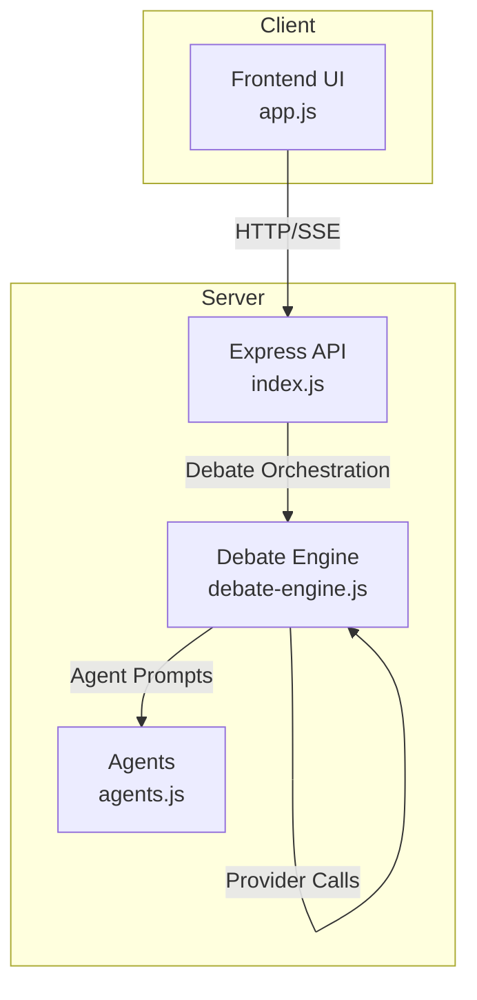
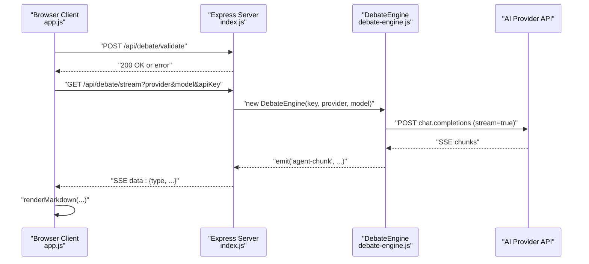
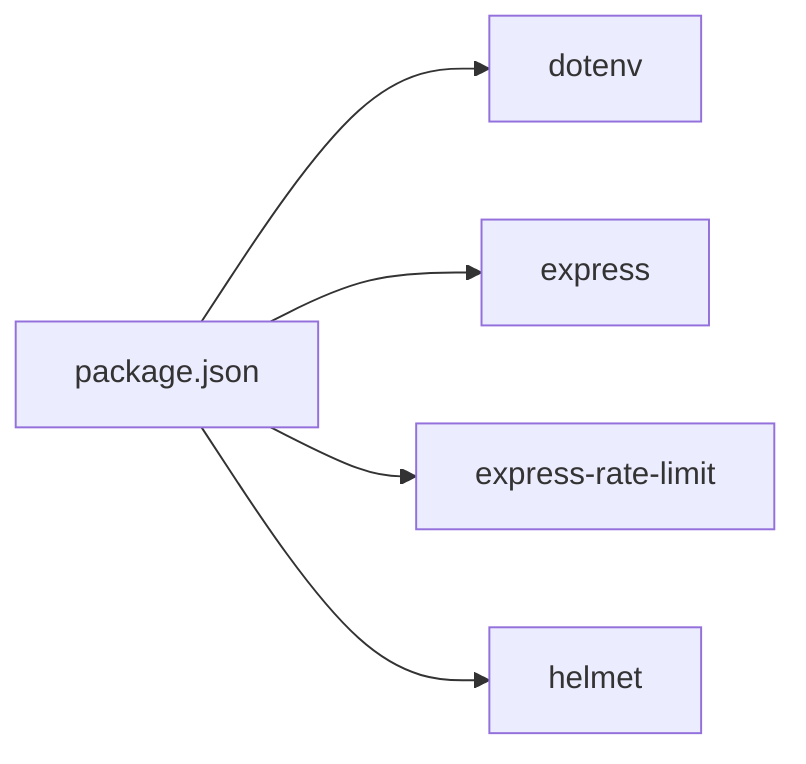

# AI Provider Integration

<cite>
**Referenced Files in This Document**
- [index.js](file://dissensus-engine/server/index.js)
- [debate-engine.js](file://dissensus-engine/server/debate-engine.js)
- [agents.js](file://dissensus-engine/server/agents.js)
- [app.js](file://dissensus-engine/public/js/app.js)
- [README.md](file://dissensus-engine/README.md)
- [package.json](file://dissensus-engine/package.json)
</cite>

## Table of Contents
1. [Introduction](#introduction)
2. [Project Structure](#project-structure)
3. [Core Components](#core-components)
4. [Architecture Overview](#architecture-overview)
5. [Detailed Component Analysis](#detailed-component-analysis)
6. [Dependency Analysis](#dependency-analysis)
7. [Performance Considerations](#performance-considerations)
8. [Troubleshooting Guide](#troubleshooting-guide)
9. [Conclusion](#conclusion)
10. [Appendices](#appendices)

## Introduction
This document explains the AI provider integration system that powers the multi-agent debate engine. It covers the PROVIDERS configuration object, the provider abstraction layer, authentication mechanisms, model configuration, cost calculation features, API integration patterns, request formatting, streaming response handling, and error management. It also provides practical guidance for adding new AI providers, configuring authentication headers, managing provider-specific parameters, selecting providers, implementing fallbacks, and optimizing performance for multi-provider deployments.

## Project Structure
The AI provider integration spans the server and client layers:
- Server: Express-based API with SSE streaming, provider configuration, and debate orchestration
- Client: Browser frontend that renders provider/model selection, streams debate events, and manages user preferences
- Shared: Agent personalities and debate phases orchestrated by the server

**Diagram sources**
- [index.js:1-481](file://dissensus-engine/server/index.js#L1-L481)
- [debate-engine.js:1-389](file://dissensus-engine/server/debate-engine.js#L1-L389)
- [agents.js:1-148](file://dissensus-engine/server/agents.js#L1-L148)
- [app.js:1-674](file://dissensus-engine/public/js/app.js#L1-L674)

**Section sources**
- [README.md:110-134](file://dissensus-engine/README.md#L110-L134)
- [package.json:1-28](file://dissensus-engine/package.json#L1-L28)

## Core Components
- PROVIDERS configuration object defines base URLs, supported models, and authentication header builders for OpenAI, DeepSeek, and Google Gemini.
- DebateEngine encapsulates provider-agnostic calls, streaming, and the 4-phase debate orchestration.
- Server routes expose provider metadata, validate requests, and stream SSE events.
- Frontend app.js manages provider/model selection, API key handling, and SSE consumption.

Key responsibilities:
- Provider abstraction: Unified interface for OpenAI-compatible chat completions
- Authentication: Bearer token construction per provider
- Model configuration: Per-provider model lists and cost-per-1k tokens
- Streaming: Server-Sent Events with incremental token delivery
- Error handling: Validation, rate limiting, and graceful degradation

**Section sources**
- [debate-engine.js:14-39](file://dissensus-engine/server/debate-engine.js#L14-L39)
- [index.js:157-172](file://dissensus-engine/server/index.js#L157-L172)
- [index.js:218-311](file://dissensus-engine/server/index.js#L218-L311)
- [app.js:22-54](file://dissensus-engine/public/js/app.js#L22-L54)

## Architecture Overview
The system integrates providers through a unified abstraction layer. The server validates inputs, selects a provider and model, and streams real-time debate results via SSE. The client renders provider/model options, handles user keys, and displays streamed content.

**Diagram sources**
- [index.js:218-311](file://dissensus-engine/server/index.js#L218-L311)
- [debate-engine.js:58-116](file://dissensus-engine/server/debate-engine.js#L58-L116)
- [app.js:294-347](file://dissensus-engine/public/js/app.js#L294-L347)

## Detailed Component Analysis

### PROVIDERS Configuration Object
The PROVIDERS object centralizes provider definitions:
- Base URL: OpenAI-compatible endpoint for each provider
- Models: Map of model IDs to human-readable names and cost-per-1k-in/out
- Auth header: Provider-specific Authorization header builder

Supported providers:
- OpenAI: gpt-4o, gpt-4o-mini
- DeepSeek: deepseek-chat
- Google Gemini: gemini-2.5-flash, gemini-2.0-flash, gemini-2.5-flash-lite

Cost calculation:
- costPer1kIn and costPer1kOut are exposed via /api/providers for transparency
- The system does not compute total costs per debate in code; it surfaces per-model pricing for visibility

**Section sources**
- [debate-engine.js:14-39](file://dissensus-engine/server/debate-engine.js#L14-L39)
- [index.js:138-152](file://dissensus-engine/server/index.js#L138-L152)

### Provider Abstraction Layer
DebateEngine encapsulates provider-agnostic logic:
- Constructor validates provider and stores base URL and model
- callAgent builds system prompts per agent, sends POST with stream=true, and decodes SSE chunks
- runDebate orchestrates the 4-phase debate, emitting structured events to the server

Provider selection logic:
- Defaults to deepseek if unspecified
- Validates model against provider’s model list
- Uses effective API key (client-provided or server-side)

Streaming response handling:
- Reads response body via getReader and decodes chunks
- Filters lines starting with "data: ", parses JSON, and emits incremental content
- Skips malformed chunks and stops on [DONE]

Error management:
- Throws descriptive errors on unknown provider/model
- Propagates HTTP errors from provider with status and body text
- Server catches and emits SSE error events

**Section sources**
- [debate-engine.js:41-53](file://dissensus-engine/server/debate-engine.js#L41-L53)
- [debate-engine.js:58-116](file://dissensus-engine/server/debate-engine.js#L58-L116)
- [debate-engine.js:121-386](file://dissensus-engine/server/debate-engine.js#L121-L386)
- [index.js:252-267](file://dissensus-engine/server/index.js#L252-L267)

### Authentication Mechanisms
- Server-side keys: Stored in environment variables and exposed to the frontend to enable “server key” mode
- Client-side keys: Optional when server keys are available; required otherwise
- Authorization header: Built via provider.authHeader(key) using Bearer tokens

Server-side key configuration:
- OPENAI_API_KEY, DEEPSEEK_API_KEY, GOOGLE_API_KEY/GEMINI_API_KEY
- /api/config returns serverKeys to inform the UI

Client-side behavior:
- updateModels toggles required field and placeholder based on serverKeys
- startDebate validates presence of API key when server key is not active

**Section sources**
- [index.js:40-45](file://dissensus-engine/server/index.js#L40-L45)
- [index.js:69-85](file://dissensus-engine/server/index.js#L69-L85)
- [app.js:60-101](file://dissensus-engine/public/js/app.js#L60-L101)
- [debate-engine.js:21](file://dissensus-engine/server/debate-engine.js#L21)

### Model Configuration and Cost Calculation
- Models are defined per provider with human-friendly names and cost-per-1k tokens
- /api/providers exposes models and costs for UI rendering and transparency
- Cost calculation is not performed in code; it is presented for user awareness

Frontend model configuration:
- PROVIDER_CONFIG maps provider IDs to labels, placeholders, model lists, and hints
- updateModels populates model dropdown and persists selections in localStorage

**Section sources**
- [debate-engine.js:17-38](file://dissensus-engine/server/debate-engine.js#L17-L38)
- [index.js:138-152](file://dissensus-engine/server/index.js#L138-L152)
- [app.js:22-54](file://dissensus-engine/public/js/app.js#L22-L54)

### API Integration Patterns
- Request formatting: POST to provider base URL with JSON body containing model, messages, stream=true, temperature, max_tokens
- Messages: system prompt from agent plus prior messages
- Streaming: SSE with lines prefixed by "data: "; [DONE] sentinel ends the stream

Frontend SSE consumption:
- Uses fetch with readable streams to parse SSE blocks
- Emits events to UI handlers for real-time rendering

**Section sources**
- [debate-engine.js:67-80](file://dissensus-engine/server/debate-engine.js#L67-L80)
- [debate-engine.js:95-113](file://dissensus-engine/server/debate-engine.js#L95-L113)
- [app.js:307-338](file://dissensus-engine/public/js/app.js#L307-L338)

### Provider Selection Logic and Fallbacks
- Default provider: deepseek
- Default model: provider-specific defaults (deepseek-chat for DeepSeek, gemini-2.0-flash for Gemini, gpt-4o for OpenAI)
- Validation: validateModel checks provider existence and model validity
- Fallback: If user key is empty and server key exists, server uses its key automatically

**Section sources**
- [index.js:252-259](file://dissensus-engine/server/index.js#L252-L259)
- [index.js:165-172](file://dissensus-engine/server/index.js#L165-L172)
- [index.js:157-163](file://dissensus-engine/server/index.js#L157-L163)

### Error Management
- Validation: Topic length, model validity, API key presence
- Rate limiting: 10 debates per minute in production
- SSE error propagation: Server emits error events; client displays messages
- Logging: recordError used for debrief and card endpoints

**Section sources**
- [index.js:177-215](file://dissensus-engine/server/index.js#L177-L215)
- [index.js:288-310](file://dissensus-engine/server/index.js#L288-L310)
- [app.js:340-346](file://dissensus-engine/public/js/app.js#L340-L346)

### Adding New AI Providers
Follow these steps to integrate a new provider:
1. Extend PROVIDERS in debate-engine.js with:
   - baseUrl: OpenAI-compatible chat completions endpoint
   - models: map of model IDs to { name, costPer1kIn, costPer1kOut }
   - authHeader: function(key) returning Authorization header value
2. Update frontend provider configuration (PROVIDER_CONFIG) with label, placeholder, key URL, model list, and hint
3. Optionally configure server-side key in .env and expose it via SERVER_KEYS
4. Test validation and streaming via /api/debate/validate and /api/debate/stream

Reference locations:
- Provider definition site: [README.md:152-155](file://dissensus-engine/README.md#L152-L155)

**Section sources**
- [debate-engine.js:14-39](file://dissensus-engine/server/debate-engine.js#L14-L39)
- [app.js:22-54](file://dissensus-engine/public/js/app.js#L22-L54)
- [README.md:152-155](file://dissensus-engine/README.md#L152-L155)

## Dependency Analysis
The system relies on a small set of core dependencies and clear module boundaries:
- Express: HTTP server and SSE streaming
- dotenv: Environment configuration
- Rate limiting and security middleware: express-rate-limit, helmet
- Client-side rendering: minimal DOM manipulation and SSE parsing

**Diagram sources**
- [package.json:10-19](file://dissensus-engine/package.json#L10-L19)

**Section sources**
- [package.json:1-28](file://dissensus-engine/package.json#L1-L28)

## Performance Considerations
- Streaming latency: SSE streaming reduces perceived latency; ensure network stability and low overhead
- Parallel execution: Phase 1 runs agents in parallel; consider rate limits and provider quotas
- Token limits: max_tokens is set per call; adjust for longer debates if needed
- Rate limiting: Default 10 debates per minute in production; tune based on provider quotas and infrastructure
- Server-side keys: Using server keys avoids client-side retries and reduces load spikes
- Caching: Model metadata and provider availability are cached in memory; refresh via /api/providers

[No sources needed since this section provides general guidance]

## Troubleshooting Guide
Common issues and resolutions:
- Unknown provider or invalid model: Verify provider and model IDs match PROVIDERS and frontend config
- API key errors: Ensure key is present when server key is not configured; confirm authHeader correctness
- SSE connection failures: Check CORS, reverse proxy headers, and client-side fetch streaming
- Rate limit exceeded: Wait for cooldown or increase server capacity
- Validation failures: Confirm topic length and wallet requirements when staking enforcement is enabled

**Section sources**
- [index.js:177-215](file://dissensus-engine/server/index.js#L177-L215)
- [index.js:288-310](file://dissensus-engine/server/index.js#L288-L310)
- [app.js:340-346](file://dissensus-engine/public/js/app.js#L340-L346)

## Conclusion
The AI provider integration system offers a clean, extensible abstraction over multiple LLM providers. By centralizing provider configuration, enforcing validation, and leveraging SSE streaming, it supports flexible provider selection, optional server-side keys, and transparent cost presentation. Extending support to new providers requires minimal changes to the provider configuration and frontend mapping.

[No sources needed since this section summarizes without analyzing specific files]

## Appendices

### API Endpoints Overview
- GET /api/config: Server configuration including serverKeys and staking enforcement
- GET /api/providers: Provider metadata and model costs
- POST /api/debate/validate: Pre-flight validation for debate parameters
- GET /api/debate/stream: SSE endpoint for streaming debate results
- GET /api/metrics and /metrics: Public analytics and dashboard

**Section sources**
- [index.js:69-85](file://dissensus-engine/server/index.js#L69-L85)
- [index.js:138-152](file://dissensus-engine/server/index.js#L138-L152)
- [index.js:177-215](file://dissensus-engine/server/index.js#L177-L215)
- [index.js:220-311](file://dissensus-engine/server/index.js#L220-L311)

### Frontend Provider/Model Configuration
- PROVIDER_CONFIG: Defines labels, placeholders, key URLs, model lists, and hints
- updateModels: Dynamically populates model dropdown and adjusts UI based on serverKeys
- Local storage: Persists provider, model, and optional API key per provider

**Section sources**
- [app.js:22-54](file://dissensus-engine/public/js/app.js#L22-L54)
- [app.js:60-101](file://dissensus-engine/public/js/app.js#L60-L101)