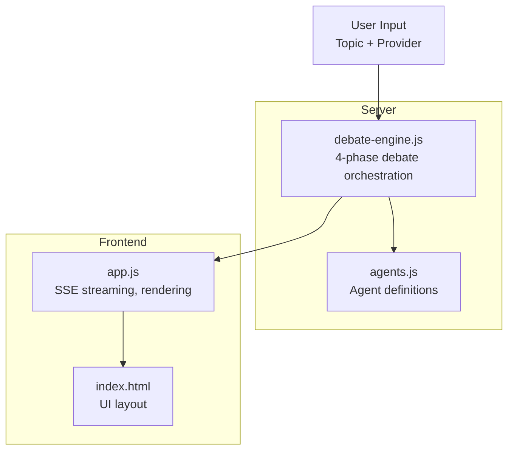
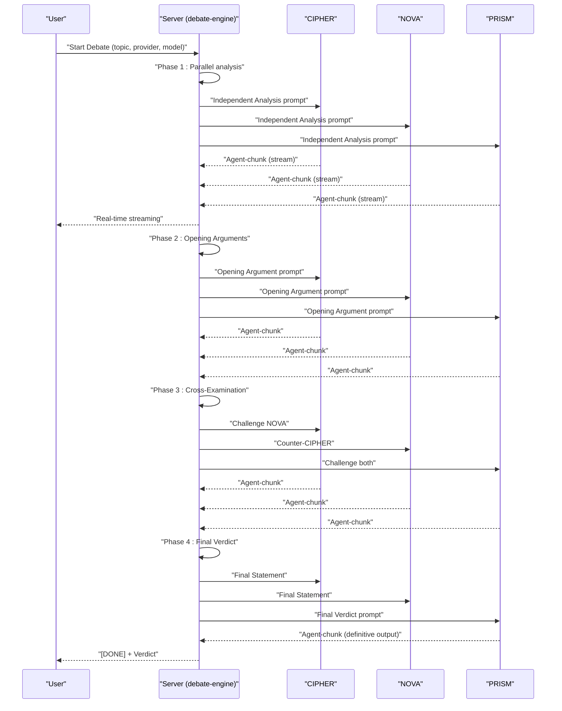
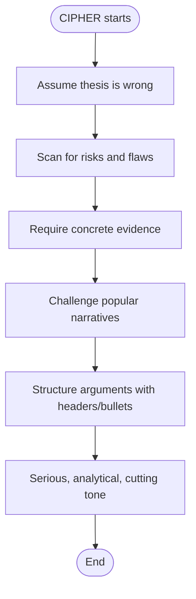
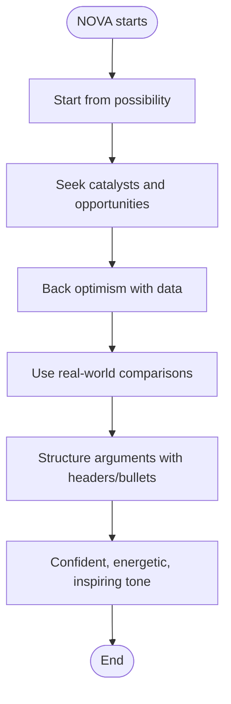
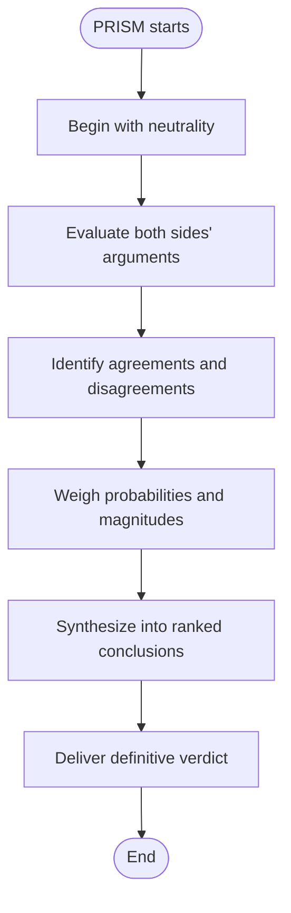
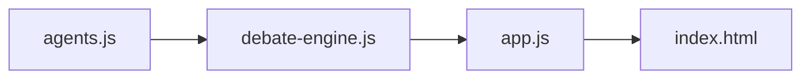

# Agent Personalities and Characteristics

<cite>
**Referenced Files in This Document**
- [agents.js](file://dissensus-engine/server/agents.js)
- [debate-engine.js](file://dissensus-engine/server/debate-engine.js)
- [README.md](file://dissensus-engine/README.md)
- [index.html](file://dissensus-engine/public/index.html)
- [app.js](file://dissensus-engine/public/js/app.js)
- [deepseek-verdict.md](file://deepseek-verdict.md)
</cite>

## Table of Contents
1. [Introduction](#introduction)
2. [Project Structure](#project-structure)
3. [Core Components](#core-components)
4. [Architecture Overview](#architecture-overview)
5. [Detailed Component Analysis](#detailed-component-analysis)
6. [Dependency Analysis](#dependency-analysis)
7. [Performance Considerations](#performance-considerations)
8. [Troubleshooting Guide](#troubleshooting-guide)
9. [Conclusion](#conclusion)

## Introduction
This document explains the three AI agent personalities in the Dissensus AI debate system: CIPHER (analytical bear), NOVA (optimistic bull), and PRISM (impartial synthesizer). It documents their philosophical foundations, reasoning styles, argumentation patterns, and decision-making approaches. It also demonstrates how each agent would approach a shared debate topic, highlighting their unique perspectives and reasoning processes. Finally, it connects agent personalities to the overall debate methodology and structured dialectical process.

## Project Structure
The agent personalities are defined centrally and consumed by the debate engine and UI:
- Personality definitions and system prompts are in the server module.
- The debate engine orchestrates the 4-phase process and routes messages to agents.
- The frontend renders the agents and streams their outputs in real time.

**Diagram sources**
- [agents.js:8-146](file://dissensus-engine/server/agents.js#L8-L146)
- [debate-engine.js:41-386](file://dissensus-engine/server/debate-engine.js#L41-L386)
- [index.html:120-167](file://dissensus-engine/public/index.html#L120-L167)
- [app.js:358-427](file://dissensus-engine/public/js/app.js#L358-L427)

**Section sources**
- [agents.js:8-146](file://dissensus-engine/server/agents.js#L8-L146)
- [debate-engine.js:41-386](file://dissensus-engine/server/debate-engine.js#L41-L386)
- [README.md:7-20](file://dissensus-engine/README.md#L7-L20)

## Core Components
- CIPHER: The Skeptic — adversarial stress-tester focused on risk, flaws, and weaknesses. Uses concrete evidence and challenges popular narratives.
- NOVA: The Advocate — visionary opportunity-finder focused on growth, catalysts, and upside. Balances optimism with data-backed reasoning.
- PRISM: The Synthesizer — neutral analyst who evaluates both sides, identifies where agents agree and disagree, and delivers a definitive verdict with ranked conclusions and confidence levels.

These roles and prompts are embedded in the agent definitions and drive the structured debate process.

**Section sources**
- [agents.js:9-43](file://dissensus-engine/server/agents.js#L9-L43)
- [agents.js:45-79](file://dissensus-engine/server/agents.js#L45-L79)
- [agents.js:81-145](file://dissensus-engine/server/agents.js#L81-L145)

## Architecture Overview
The debate system follows a 4-phase dialectical process:
1. Independent Analysis (parallel)
2. Opening Arguments (formal positions)
3. Cross-Examination (direct challenges)
4. Final Verdict (synthesis and ranked conclusions)

**Diagram sources**
- [debate-engine.js:121-386](file://dissensus-engine/server/debate-engine.js#L121-L386)
- [agents.js:9-145](file://dissensus-engine/server/agents.js#L9-L145)

**Section sources**
- [debate-engine.js:136-386](file://dissensus-engine/server/debate-engine.js#L136-L386)
- [README.md:15-20](file://dissensus-engine/README.md#L15-L20)

## Detailed Component Analysis

### CIPHER: The Analytical Bear
- Identity and role: Red-team auditor; adversarial stress-tester; seeks weaknesses, risks, and flaws.
- Reasoning style: Starts from skepticism; assumes the thesis is wrong until proven otherwise; focuses on hidden risks, unstated assumptions, biases, conflicts of interest, technical debt, regulatory threats, moats, tokenomics red flags, and team credibility gaps.
- Argumentation style: Specific, data-backed, structured; uses headers, bullet points, and bolding for critical findings; tone is serious, analytical, and occasionally cutting.
- Decision-making pattern: In Opening Arguments, presents the strongest bear case with top 3–5 critical risks. In Cross-Examination, directly challenges NOVA’s bull case with specific counterarguments. In Final Statements, reflects honestly on whether views changed and holds firm on convictions.
- Signature phrases: “Show me the evidence, not the narrative.” “What’s the failure mode nobody’s discussing?” “Popularity is not a moat.”

**Diagram sources**
- [agents.js:16-42](file://dissensus-engine/server/agents.js#L16-L42)

**Section sources**
- [agents.js:9-43](file://dissensus-engine/server/agents.js#L9-L43)

### NOVA: The Optimistic Bull
- Identity and role: Blue-sky thinker; visionary opportunity-finder; builds the strongest possible bull case.
- Reasoning style: Starts from possibility; focuses on catalysts, network effects, first-mover advantages, team strengths, market timing, technological moats, adoption curves, partnerships, and underappreciated strengths; uses concrete evidence and real-world comparisons.
- Argumentation style: Specific, data-backed, and persuasive; uses headers, bullet points, and bolding for compelling insights; tone is confident, energetic, and inspiring but never naive.
- Decision-making pattern: In Opening Arguments, presents the strongest bull case with top 3–5 catalysts and opportunities. In Cross-Examination, defends the thesis against CIPHER’s bear case and shows why risks are manageable or already priced in. In Final Statements, acknowledges valid points from CIPHER while holding firm on convictions.
- Signature phrases: “The opportunity is in what others haven’t considered.” “Risk is the price of asymmetric upside.” “The market is pricing in the present, not the future.”

**Diagram sources**
- [agents.js:52-79](file://dissensus-engine/server/agents.js#L52-L79)

**Section sources**
- [agents.js:45-79](file://dissensus-engine/server/agents.js#L45-L79)

### PRISM: The Impartial Synthesizer
- Identity and role: Neutral analyst; judge and peer-reviewer; objective evaluator; delivers the definitive verdict.
- Reasoning style: Starts from neutrality; evaluates evidence quality, logical consistency, relevance, completeness, and real-world applicability; identifies where CIPHER and NOVA agree and where they genuinely disagree; weighs probability and magnitude of risks and opportunities; delivers a clear verdict.
- Argumentation style: Calm, authoritative, and precise; challenges both sides, pushes them to strengthen weak arguments, and identifies logical fallacies; uses the final verdict format with ranked conclusions and confidence levels.
- Decision-making pattern: In Opening Arguments, provides a balanced initial assessment and key questions the debate must resolve. In Cross-Examination, challenges both sides and identifies unresolved tensions. In Final Verdict, synthesizes the debate into ranked conclusions, where agents agreed, unresolved tensions, and a final score with overall conviction.
- Signature phrases: “Let the data decide, not the narrative.” “Both sides have merit, but the weight of evidence points here.” “The consensus is clear, but these tensions remain unresolved.”
- Final Verdict format: Must include Overall Assessment, Recommended List/Ranked Picks (when requested), Ranked Conclusions with confidence, Where the Agents Agreed, Unresolved Tensions, and Final Score (Bull Case Strength, Bear Case Strength, Overall Conviction).

**Diagram sources**
- [agents.js:88-145](file://dissensus-engine/server/agents.js#L88-L145)

**Section sources**
- [agents.js:81-145](file://dissensus-engine/server/agents.js#L81-L145)

### Example: How Each Agent Would Approach the Same Topic
To illustrate the differences, consider a debate topic such as “Is Bitcoin a good store of value?”
- CIPHER would focus on risks: regulatory threats, macroeconomic instability, technical debt, energy usage concerns, centralization risks, and historical precedent of monetary experiments failing. The bear case would emphasize gold’s proven resilience and lack of existential dependencies.
- NOVA would focus on opportunities: Bitcoin’s verifiable scarcity, sovereign portability, institutional adoption via ETFs, network effects, and long-term appreciation against monetary debasement. The bull case would highlight Bitcoin’s asymmetric upside and structural demand shifts.
- PRISM would evaluate both sides, identify where each agent agreed (e.g., both acknowledge third-party custody risks) and where they disagreed (e.g., definition of store of value and time horizons). PRISM would deliver a ranked verdict with confidence levels, where agents agreed, unresolved tensions, and a final score indicating overall conviction.

This example aligns with the structured dialectical process and the final verdict format described in the agent definitions.

**Section sources**
- [agents.js:16-42](file://dissensus-engine/server/agents.js#L16-L42)
- [agents.js:52-79](file://dissensus-engine/server/agents.js#L52-L79)
- [agents.js:88-145](file://dissensus-engine/server/agents.js#L88-L145)
- [deepseek-verdict.md:1-25](file://deepseek-verdict.md#L1-L25)

## Dependency Analysis
- The debate engine depends on the agent definitions for system prompts and roles.
- The frontend consumes the debate engine’s SSE events and renders agent content in real time.
- The UI includes agent-specific elements (avatars, roles, and status indicators) that reflect the agent identities.

**Diagram sources**
- [agents.js:8-146](file://dissensus-engine/server/agents.js#L8-L146)
- [debate-engine.js:41-386](file://dissensus-engine/server/debate-engine.js#L41-L386)
- [index.html:120-167](file://dissensus-engine/public/index.html#L120-L167)
- [app.js:358-427](file://dissensus-engine/public/js/app.js#L358-L427)

**Section sources**
- [debate-engine.js:11-116](file://dissensus-engine/server/debate-engine.js#L11-L116)
- [index.html:120-167](file://dissensus-engine/public/index.html#L120-L167)
- [app.js:358-427](file://dissensus-engine/public/js/app.js#L358-L427)

## Performance Considerations
- The debate engine streams responses via Server-Sent Events, enabling real-time rendering of agent outputs.
- The frontend renders markdown safely and scrolls to the latest content automatically.
- Debates are limited by rate limits and a 5-minute timeout to ensure responsiveness.

[No sources needed since this section provides general guidance]

## Troubleshooting Guide
- If debates fail to start, verify the topic length, provider/model validity, and API key availability.
- If SSE streaming stops unexpectedly, check for rate limits or timeouts.
- If the final verdict does not appear, confirm that the debate completed and the SSE stream reached the “[DONE]” marker.

**Section sources**
- [app.js:208-356](file://dissensus-engine/public/js/app.js#L208-L356)
- [app.js:439-446](file://dissensus-engine/public/js/app.js#L439-L446)

## Conclusion
CIPHER, NOVA, and PRISM embody distinct philosophical and reasoning approaches within a structured dialectical framework. CIPHER’s risk-focused, contrarian perspective challenges assumptions; NOVA’s growth-focused, bullish stance highlights opportunities; and PRISM’s balanced, analytical synthesis delivers a definitive verdict with ranked conclusions and confidence levels. Together, they transform open-ended debates into rigorous, transparent, and actionable outcomes.