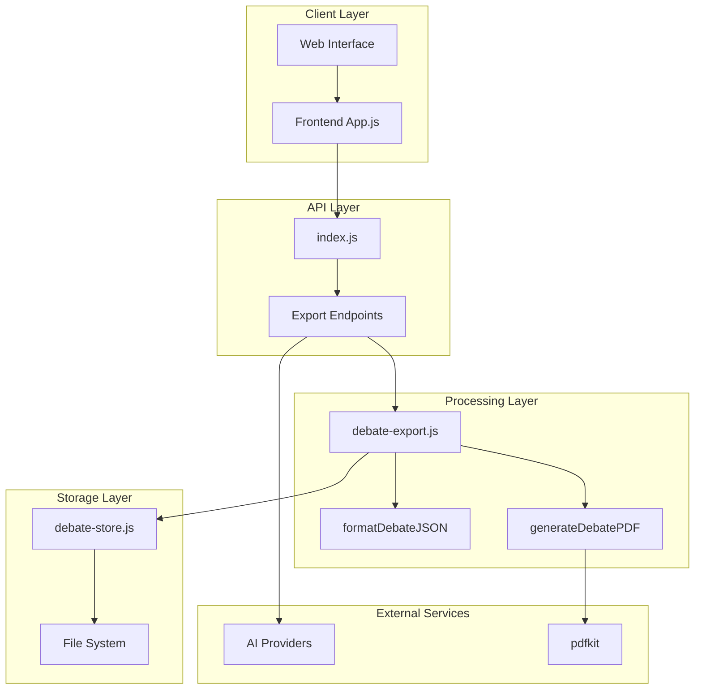
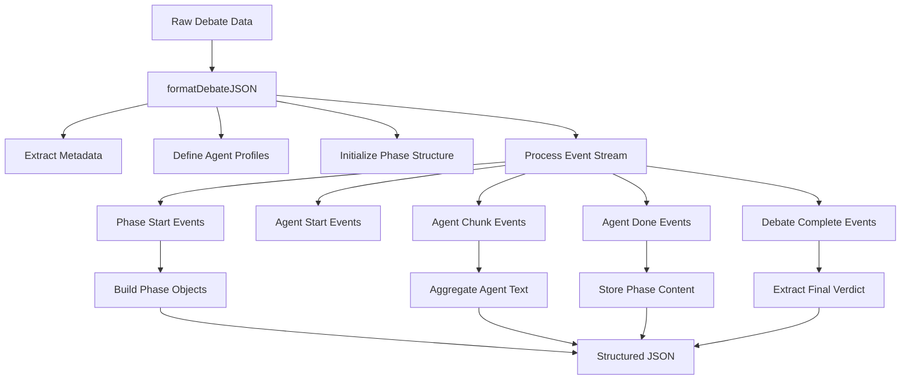
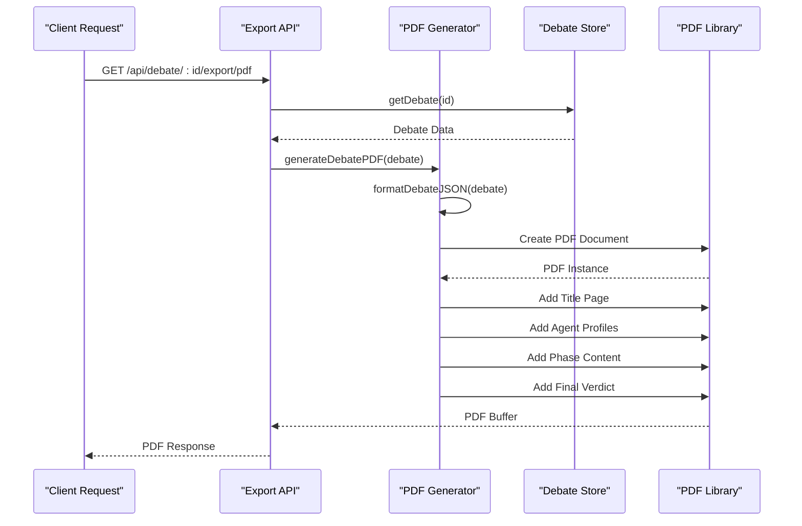
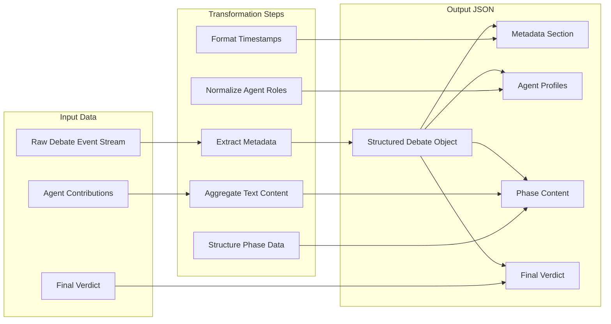
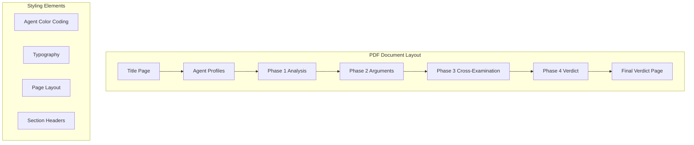
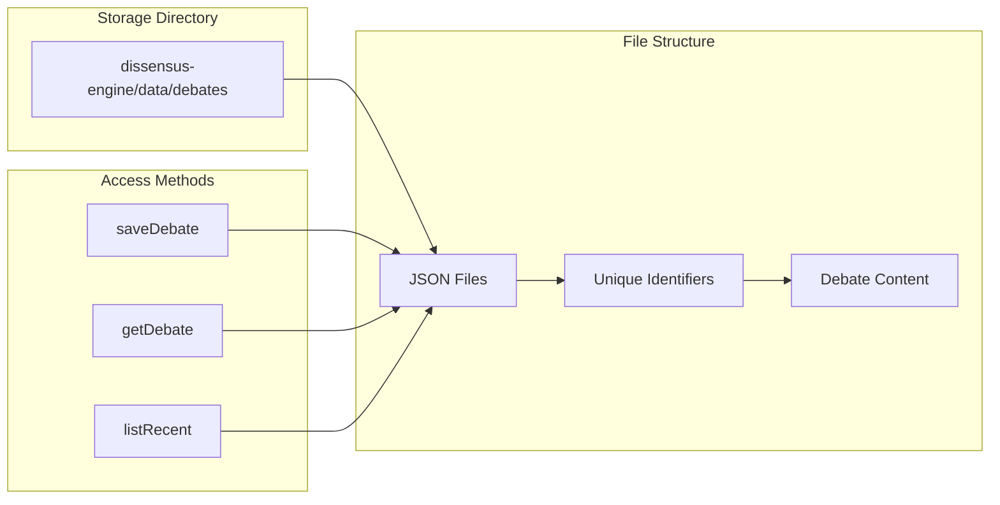
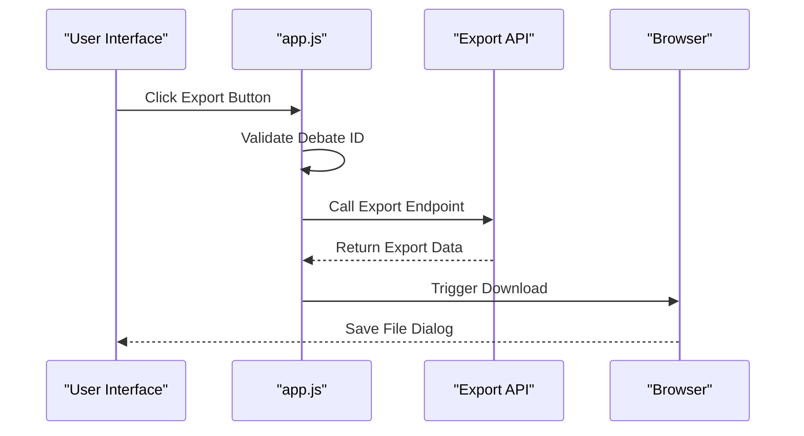
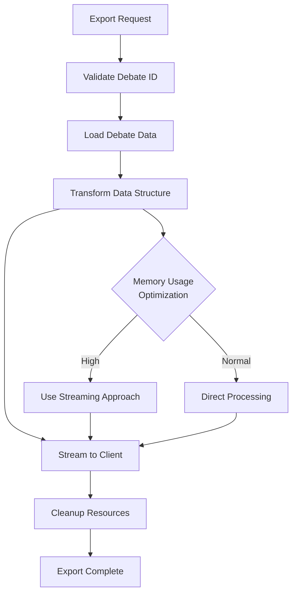
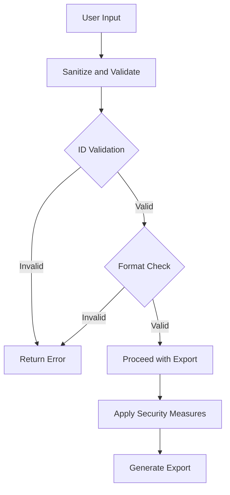

# Debate Export System

<cite>
**Referenced Files in This Document**
- [debate-export.js](file://dissensus-engine/server/debate-export.js)
- [debate-engine.js](file://dissensus-engine/server/debate-engine.js)
- [debate-store.js](file://dissensus-engine/server/debate-store.js)
- [index.js](file://dissensus-engine/server/index.js)
- [package.json](file://dissensus-engine/package.json)
- [agents.js](file://dissensus-engine/server/agents.js)
- [card-generator.js](file://dissensus-engine/server/card-generator.js)
- [metrics.js](file://dissensus-engine/server/metrics.js)
- [app.js](file://dissensus-engine/public/js/app.js)
- [README.md](file://dissensus-engine/README.md)
</cite>

## Table of Contents
1. [Introduction](#introduction)
2. [System Architecture](#system-architecture)
3. [Export System Components](#export-system-components)
4. [JSON Export Workflow](#json-export-workflow)
5. [PDF Export Workflow](#pdf-export-workflow)
6. [Data Storage and Retrieval](#data-storage-and-retrieval)
7. [Integration Points](#integration-points)
8. [Performance Considerations](#performance-considerations)
9. [Security and Validation](#security-and-validation)
10. [Troubleshooting Guide](#troubleshooting-guide)
11. [Conclusion](#conclusion)

## Introduction

The Debate Export System is a comprehensive data export infrastructure within the Dissensus AI platform that enables users to download and share debate transcripts in multiple formats. This system provides two primary export formats: structured JSON for programmatic consumption and printable PDF documents for human-readable presentations.

The system integrates seamlessly with the core debate engine, allowing users to export completed debates immediately after they finish, preserving the complete dialectical process with all agent contributions and final verdicts. The export functionality supports both individual debate exports and bulk operations through the debate store system.

## System Architecture

The Debate Export System operates as a layered architecture built upon the Dissensus AI debate platform:

**Diagram sources**
- [index.js:286-309](file://dissensus-engine/server/index.js#L286-L309)
- [debate-export.js:1-127](file://dissensus-engine/server/debate-export.js#L1-L127)
- [debate-store.js:1-88](file://dissensus-engine/server/debate-store.js#L1-L88)

The architecture follows a clear separation of concerns:
- **Client Layer**: Web interface and frontend JavaScript for user interaction
- **API Layer**: Express.js routes handling export requests
- **Processing Layer**: Dedicated export module with specialized formatting functions
- **Storage Layer**: Persistent debate storage with file-based JSON format
- **External Services**: AI provider integrations and PDF generation libraries

## Export System Components

### Core Export Module

The central export functionality is implemented in the `debate-export.js` module, which provides two primary functions:

#### formatDebateJSON Function
This function transforms raw debate data into a structured, normalized format suitable for programmatic consumption:

**Diagram sources**
- [debate-export.js:7-60](file://dissensus-engine/server/debate-export.js#L7-L60)

#### generateDebatePDF Function
This function creates printable PDF documents with professional formatting:

**Diagram sources**
- [debate-export.js:62-124](file://dissensus-engine/server/debate-export.js#L62-L124)
- [index.js:295-309](file://dissensus-engine/server/index.js#L295-L309)

**Section sources**
- [debate-export.js:1-127](file://dissensus-engine/server/debate-export.js#L1-L127)

### API Endpoints

The export system exposes two primary endpoints through the main server:

#### JSON Export Endpoint
- **Route**: `GET /api/debate/:id/export/json`
- **Purpose**: Returns structured JSON representation of a completed debate
- **Response**: Application/JSON with formatted debate data
- **Headers**: Content-Disposition attachment with filename

#### PDF Export Endpoint
- **Route**: `GET /api/debate/:id/export/pdf`
- **Purpose**: Generates and returns printable PDF document
- **Response**: Application/PDF binary stream
- **Headers**: Content-Disposition attachment with filename

**Section sources**
- [index.js:286-309](file://dissensus-engine/server/index.js#L286-L309)

## JSON Export Workflow

The JSON export process follows a systematic approach to transform raw debate data into a standardized format:

### Data Transformation Process

**Diagram sources**
- [debate-export.js:7-60](file://dissensus-engine/server/debate-export.js#L7-L60)

### JSON Schema Structure

The exported JSON follows a consistent schema:

| Property | Type | Description |
|----------|------|-------------|
| `metadata` | Object | Debate identification and context information |
| `agents` | Object | Agent definitions and roles |
| `phases` | Object | Structured content for each debate phase |
| `verdict` | String | Final synthesized conclusion |

The metadata section includes:
- **id**: Unique debate identifier
- **topic**: Original debate subject
- **provider**: AI provider used
- **model**: Specific model configuration
- **timestamp**: Creation date and time
- **permalink**: Shareable URL reference

**Section sources**
- [debate-export.js:7-30](file://dissensus-engine/server/debate-export.js#L7-L30)

## PDF Export Workflow

The PDF export system creates professionally formatted documents with consistent styling and layout:

### Document Structure

**Diagram sources**
- [debate-export.js:62-124](file://dissensus-engine/server/debate-export.js#L62-L124)

### Formatting Features

The PDF generation includes several sophisticated formatting capabilities:

#### Agent Color Coding
Each agent's content is displayed in distinctive colors:
- **CIPHER**: Red (#ff3b3b) - Skeptic perspective
- **NOVA**: Green (#00cc66) - Advocate perspective  
- **PRISM**: Blue (#0099cc) - Neutral analysis

#### Professional Typography
- **Title**: 24pt Helvetica Bold for "DISSENSUS VERDICT"
- **Topic**: 14pt Helvetica for debate subject
- **Agent Names**: 12pt Bold with colored text
- **Content**: 10pt Helvetica for detailed arguments

#### Page Organization
- **Title Page**: Contains debate metadata and branding
- **Agent Profiles**: Color-coded agent information
- **Phase Pages**: Separate pages for each debate phase
- **Final Verdict**: Dedicated page for synthesized conclusion

**Section sources**
- [debate-export.js:62-124](file://dissensus-engine/server/debate-export.js#L62-L124)

## Data Storage and Retrieval

The export system relies on a robust storage mechanism that preserves debate data for later export:

### Storage Architecture

**Diagram sources**
- [debate-store.js:1-88](file://dissensus-engine/server/debate-store.js#L1-L88)

### Storage Operations

#### saveDebate Function
Creates persistent records with automatic UUID generation and timestamping:

| Operation | Description |
|-----------|-------------|
| **Directory Creation** | Ensures `/data/debates` exists |
| **UUID Generation** | Creates unique identifiers for each debate |
| **Timestamp Recording** | Captures creation date and time |
| **File Writing** | Serializes debate data to JSON format |

#### getDebate Function
Retrieves specific debates by ID with security validation:

| Security Feature | Implementation |
|------------------|----------------|
| **ID Validation** | Regex pattern matching for UUID format |
| **Path Traversal Prevention** | Validates file path components |
| **Error Handling** | Graceful handling of missing or corrupted files |

#### listRecent Function
Provides bulk access to recent debates for administrative purposes:

| Limitation | Value |
|------------|-------|
| **Default Limit** | 20 debates |
| **Maximum Limit** | 50 debates |
| **Content Filtering** | Returns metadata only (no full content) |

**Section sources**
- [debate-store.js:15-85](file://dissensus-engine/server/debate-store.js#L15-L85)

## Integration Points

The export system integrates with multiple components of the Dissensus platform:

### Frontend Integration

The client-side application provides seamless export functionality through dedicated buttons:

**Diagram sources**
- [app.js:726-738](file://dissensus-engine/public/js/app.js#L726-L738)

### Backend Integration

The export system integrates with the core debate engine and authentication system:

#### Debate Engine Integration
- **Event Stream Processing**: Converts raw SSE events to structured format
- **Real-time Access**: Allows export of ongoing debates (subject to completion)
- **Metadata Preservation**: Maintains original debate context and configuration

#### Authentication Integration
- **Protected Access**: Requires valid authentication for workspace-specific exports
- **Workspace Filtering**: Restricts exports to authorized workspaces
- **Audit Trail**: Records export activities for monitoring

**Section sources**
- [app.js:726-738](file://dissensus-engine/public/js/app.js#L726-L738)
- [index.js:286-309](file://dissensus-engine/server/index.js#L286-L309)

## Performance Considerations

The export system is designed with performance optimization in mind:

### Memory Management

**Diagram sources**
- [debate-export.js:62-124](file://dissensus-engine/server/debate-export.js#L62-L124)

### Optimization Strategies

#### Streaming Architecture
- **PDF Generation**: Uses streaming approach to minimize memory footprint
- **Large Debates**: Handles extensive debate content without loading entire documents into memory
- **Progressive Rendering**: Allows immediate response while generating content

#### Caching Mechanisms
- **File System Cache**: Leverages OS-level file caching for frequently accessed debates
- **Compression**: Automatic compression of JSON export files
- **Lazy Loading**: Processes only required debate segments for partial exports

#### Scalability Features
- **Concurrent Processing**: Handles multiple export requests simultaneously
- **Resource Limits**: Implements timeouts and memory limits to prevent resource exhaustion
- **Graceful Degradation**: Continues operation even if individual export fails

**Section sources**
- [debate-export.js:62-124](file://dissensus-engine/server/debate-export.js#L62-L124)

## Security and Validation

The export system implements comprehensive security measures:

### Input Validation

**Diagram sources**
- [index.js:286-309](file://dissensus-engine/server/index.js#L286-L309)

### Security Measures

#### Authentication and Authorization
- **API Key Protection**: Server-side API key management prevents exposure
- **Workspace Validation**: Ensures users can only access their authorized debates
- **Rate Limiting**: Prevents abuse through request throttling

#### Data Integrity
- **ID Validation**: Regex-based UUID validation prevents path traversal attacks
- **File System Security**: Controlled access to debate storage directory
- **Content Sanitization**: Prevents malicious content injection

#### Export Restrictions
- **Workspace Boundaries**: Exports respect workspace membership
- **Audit Logging**: Tracks all export activities for compliance
- **Access Control**: Requires valid authentication for protected exports

**Section sources**
- [index.js:286-309](file://dissensus-engine/server/index.js#L286-L309)

## Troubleshooting Guide

Common issues and their solutions:

### Export Failures

| Issue | Symptoms | Solution |
|-------|----------|----------|
| **PDF Generation Error** | 500 Internal Server Error | Check PDFKit installation and dependencies |
| **JSON Export Timeout** | Slow response or timeout | Verify debate storage accessibility |
| **Authentication Failure** | 401 Unauthorized | Verify user authentication and workspace permissions |
| **File Not Found** | 404 Debate Not Found | Confirm debate ID validity and storage existence |

### Performance Issues

| Problem | Indicators | Resolution |
|---------|------------|------------|
| **Slow Exports** | Long processing times | Check server resources and optimize storage |
| **Memory Exhaustion** | Out of memory errors | Implement streaming for large debates |
| **Timeout Errors** | Request timeouts | Increase timeout limits for large exports |

### Integration Problems

| Issue | Causes | Fixes |
|-------|--------|-------|
| **Missing Content** | Incomplete debate data | Ensure debate completion before export |
| **Formatting Issues** | PDF generation errors | Verify PDFKit dependencies and fonts |
| **Authentication Errors** | Workspace access denied | Check user permissions and workspace membership |

**Section sources**
- [index.js:295-309](file://dissensus-engine/server/index.js#L295-L309)

## Conclusion

The Debate Export System represents a comprehensive solution for preserving and sharing Dissensus AI debate outcomes. Through its dual-format approach (JSON and PDF), the system caters to both programmatic integration and human-readable presentation needs.

The architecture demonstrates strong separation of concerns, with dedicated modules for data transformation, storage, and presentation. The system's integration with the broader Dissensus platform ensures seamless user experience while maintaining security and performance standards.

Key strengths of the system include:
- **Flexibility**: Support for multiple export formats and integration patterns
- **Scalability**: Streaming architecture handles large volumes efficiently
- **Security**: Comprehensive validation and access control mechanisms
- **Maintainability**: Clean modular design facilitates future enhancements

The export system serves as a foundation for advanced use cases including research analysis, educational applications, and commercial integrations, positioning Dissensus AI as a robust platform for AI-powered debate and analysis.