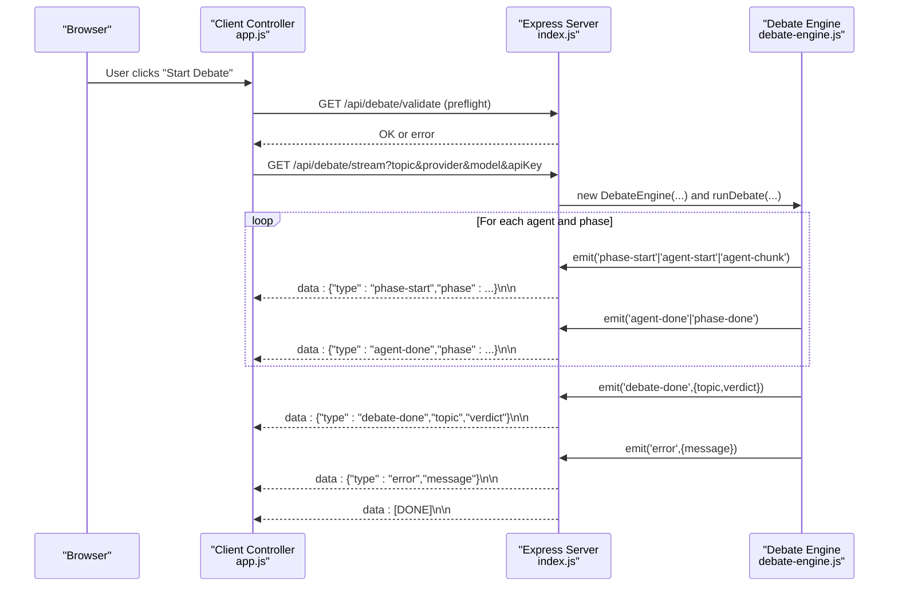
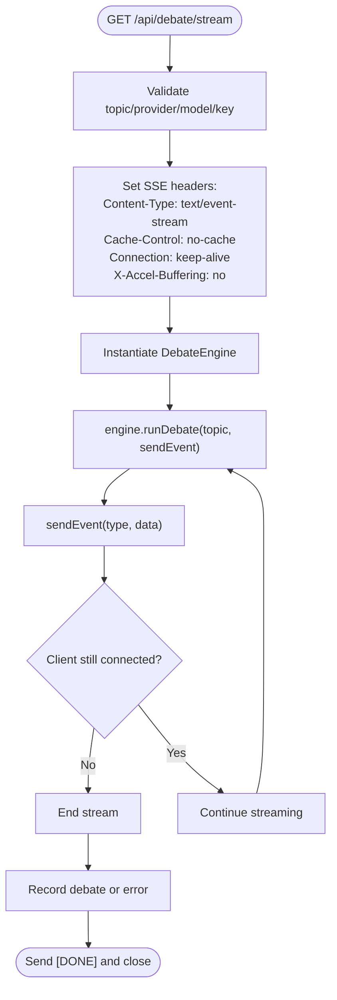
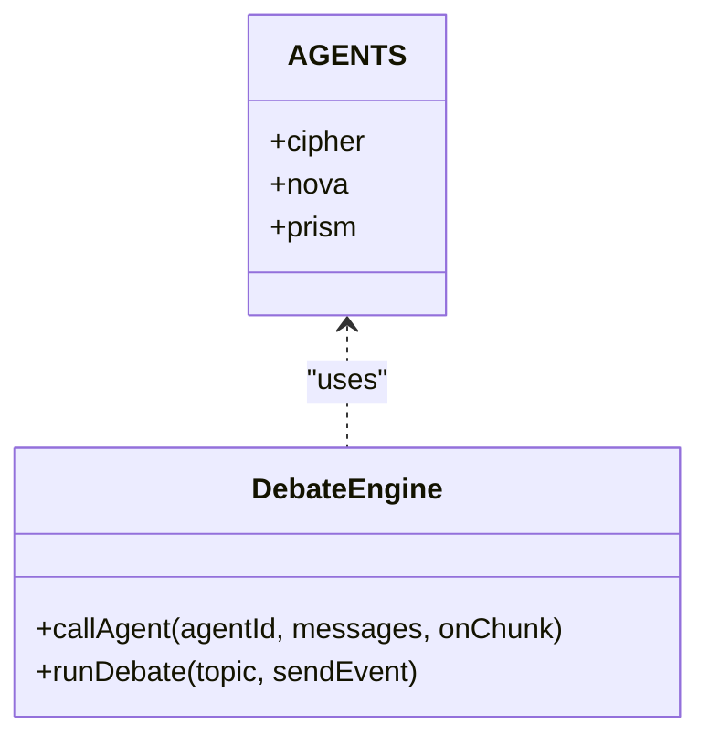
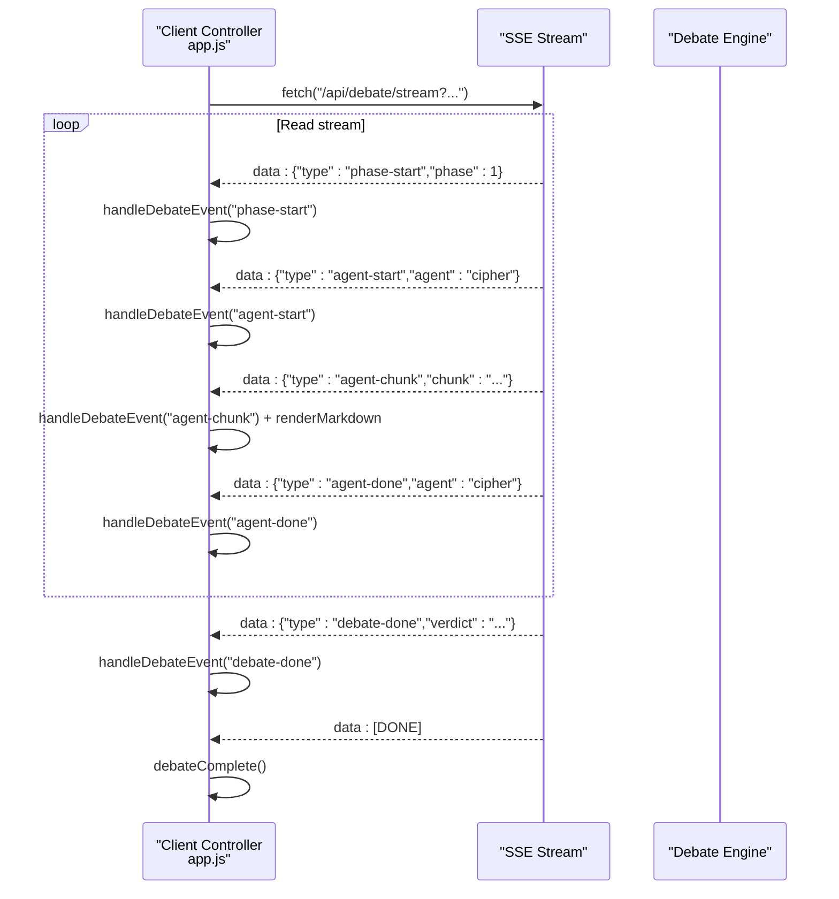
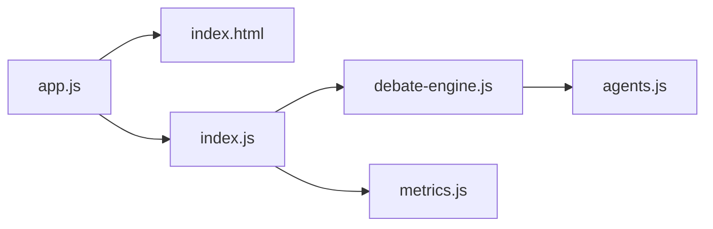

# Real-Time Streaming Architecture

<cite>
**Referenced Files in This Document**
- [index.js](file://dissensus-engine/server/index.js)
- [debate-engine.js](file://dissensus-engine/server/debate-engine.js)
- [agents.js](file://dissensus-engine/server/agents.js)
- [app.js](file://dissensus-engine/public/js/app.js)
- [index.html](file://dissensus-engine/public/index.html)
- [metrics.js](file://dissensus-engine/server/metrics.js)
- [DEPLOY-VPS.md](file://dissensus-engine/docs/DEPLOY-VPS.md)
- [nginx-dissensus.conf](file://dissensus-engine/docs/configs/nginx-dissensus.conf)
</cite>

## Table of Contents
1. [Introduction](#introduction)
2. [Project Structure](#project-structure)
3. [Core Components](#core-components)
4. [Architecture Overview](#architecture-overview)
5. [Detailed Component Analysis](#detailed-component-analysis)
6. [Dependency Analysis](#dependency-analysis)
7. [Performance Considerations](#performance-considerations)
8. [Troubleshooting Guide](#troubleshooting-guide)
9. [Conclusion](#conclusion)

## Introduction
This document explains the real-time streaming architecture powering the debate interface. The system uses Server-Sent Events (SSE) to stream structured debate events from the backend to the browser in near real-time. The debate process is orchestrated by a multi-agent system that executes four distinct phases, emitting typed events that drive the dynamic UI updates. The architecture emphasizes asynchronous execution, parallel agent processing, and robust client-server communication protocols.

## Project Structure
The streaming system spans the backend Express server, the debate engine orchestrator, and the frontend client that renders real-time updates.

```mermaid
graph TB
subgraph "Backend"
S["Express Server<br/>index.js"]
E["Debate Engine<br/>debate-engine.js"]
A["Agents<br/>agents.js"]
M["Metrics<br/>metrics.js"]
end
subgraph "Frontend"
C["Client Controller<br/>app.js"]
UI["UI Markup<br/>index.html"]
end
subgraph "Infrastructure"
NGINX["Nginx Proxy<br/>nginx-dissensus.conf"]
end
UI --> C
C --> |"HTTP GET /api/debate/stream"| S
S --> |"new DebateEngine(...)"| E
E --> |"emit('phase-start'| A
E --> |"emit('agent-chunk'"| A
E --> |"emit('agent-done'"| A
E --> |"emit('debate-done'"| A
E --> |"emit('error'"| S
S --> |"SSE: data: {type, ...}"| C
NGINX --> |"proxy_buffering off"| S
```

**Diagram sources**
- [index.js:156-230](file://dissensus-engine/server/index.js#L156-L230)
- [debate-engine.js:121-386](file://dissensus-engine/server/debate-engine.js#L121-L386)
- [agents.js:8-148](file://dissensus-engine/server/agents.js#L8-L148)
- [app.js:209-356](file://dissensus-engine/public/js/app.js#L209-L356)
- [nginx-dissensus.conf:42-60](file://dissensus-engine/docs/configs/nginx-dissensus.conf#L42-L60)

**Section sources**
- [index.js:156-230](file://dissensus-engine/server/index.js#L156-L230)
- [debate-engine.js:121-386](file://dissensus-engine/server/debate-engine.js#L121-L386)
- [app.js:209-356](file://dissensus-engine/public/js/app.js#L209-L356)
- [index.html:1-187](file://dissensus-engine/public/index.html#L1-L187)

## Core Components
- Backend Express server with SSE endpoint for streaming debate events.
- Debate engine orchestrator that manages four phases and emits typed events.
- Multi-agent personalities that provide distinct reasoning styles and roles.
- Frontend client controller that parses SSE chunks and updates the UI in real-time.
- Infrastructure configuration to support SSE streaming without buffering.

Key streaming event types emitted by the backend:
- debate-start: Initial event with topic, provider, and model.
- phase-start: Marks the beginning of a phase with title and description.
- agent-start: Signals an agent’s turn to speak within a phase.
- agent-chunk: Real-time incremental text chunks streamed from agent responses.
- agent-done: Indicates completion of an agent’s contribution in a phase.
- phase-done: Marks the end of a phase.
- debate-done: Final event containing the synthesized verdict.
- error: Emits error messages when exceptions occur.

**Section sources**
- [index.js:156-230](file://dissensus-engine/server/index.js#L156-L230)
- [debate-engine.js:130-386](file://dissensus-engine/server/debate-engine.js#L130-L386)
- [app.js:359-427](file://dissensus-engine/public/js/app.js#L359-L427)

## Architecture Overview
The streaming architecture follows a producer-consumer pattern:
- Producer: The debate engine emits structured events during each phase.
- Transport: Express server writes SSE-formatted data to the client.
- Consumer: The client reads the stream, parses events, and updates the UI.



**Diagram sources**
- [app.js:209-356](file://dissensus-engine/public/js/app.js#L209-L356)
- [index.js:156-230](file://dissensus-engine/server/index.js#L156-L230)
- [debate-engine.js:121-386](file://dissensus-engine/server/debate-engine.js#L121-L386)

## Detailed Component Analysis

### Backend SSE Endpoint
The SSE endpoint sets appropriate headers, validates inputs, and streams events to clients. It aborts streaming if the client disconnects and records metrics on success or error.



**Diagram sources**
- [index.js:156-230](file://dissensus-engine/server/index.js#L156-L230)

**Section sources**
- [index.js:156-230](file://dissensus-engine/server/index.js#L156-L230)

### Debate Engine Orchestration
The debate engine coordinates four phases and emits typed events. It performs parallel processing for Phase 1 and streams agent responses incrementally.


**Diagram sources**
- [debate-engine.js:121-386](file://dissensus-engine/server/debate-engine.js#L121-L386)

**Section sources**
- [debate-engine.js:121-386](file://dissensus-engine/server/debate-engine.js#L121-L386)

### Agent System
Agents define distinct personalities and system prompts. The engine invokes each agent with tailored prompts per phase and streams incremental chunks.



**Diagram sources**
- [agents.js:8-148](file://dissensus-engine/server/agents.js#L8-L148)
- [debate-engine.js:58-116](file://dissensus-engine/server/debate-engine.js#L58-L116)

**Section sources**
- [agents.js:8-148](file://dissensus-engine/server/agents.js#L8-L148)
- [debate-engine.js:58-116](file://dissensus-engine/server/debate-engine.js#L58-L116)

### Frontend Streaming Controller
The client establishes a streaming connection using fetch with manual parsing of SSE chunks. It handles each event type to update the UI progressively.



**Diagram sources**
- [app.js:209-356](file://dissensus-engine/public/js/app.js#L209-L356)
- [app.js:359-427](file://dissensus-engine/public/js/app.js#L359-L427)

**Section sources**
- [app.js:209-356](file://dissensus-engine/public/js/app.js#L209-L356)
- [app.js:359-427](file://dissensus-engine/public/js/app.js#L359-L427)

### Event Types and Data Flow
- debate-start: Provides topic, provider, and model for context.
- phase-start: Supplies phase metadata (title, description).
- agent-start: Identifies the speaking agent and phase.
- agent-chunk: Streams incremental text deltas; client appends and renders.
- agent-done: Marks agent completion; client stops typing indicator.
- phase-done: Indicates phase completion; client marks step as done.
- debate-done: Delivers the final verdict; client reveals the verdict panel.
- error: Emits server-side errors; client displays user-friendly messages.

**Section sources**
- [debate-engine.js:130-386](file://dissensus-engine/server/debate-engine.js#L130-L386)
- [app.js:359-427](file://dissensus-engine/public/js/app.js#L359-L427)

### Asynchronous Execution and Parallel Processing
- Phase 1: Parallel execution of all three agents using Promise.all to maximize throughput.
- Phase 2: Sequential per-agent execution to preserve argument structure.
- Phase 3: Agent-to-agent challenges with independent streaming per agent.
- Phase 4: Final statements and PRISM’s verdict, streamed incrementally.

**Section sources**
- [debate-engine.js:152-201](file://dissensus-engine/server/debate-engine.js#L152-L201)
- [debate-engine.js:210-284](file://dissensus-engine/server/debate-engine.js#L210-L284)
- [debate-engine.js:293-380](file://dissensus-engine/server/debate-engine.js#L293-L380)

### Real-Time Data Aggregation
- The engine aggregates agent outputs per phase into a debate context object.
- The final verdict synthesizes all prior phases into a structured, confidence-weighted conclusion.

**Section sources**
- [debate-engine.js:122-128](file://dissensus-engine/server/debate-engine.js#L122-L128)
- [debate-engine.js:341-380](file://dissensus-engine/server/debate-engine.js#L341-L380)

### Client-Side Event Handling and UI Updates
- The client maintains per-agent buffers for each phase and renders markdown progressively.
- UI states reflect speaking/waiting/done for agents and active/done for phases.
- The verdict panel appears after receiving the final event.

**Section sources**
- [app.js:164-206](file://dissensus-engine/public/js/app.js#L164-L206)
- [app.js:359-427](file://dissensus-engine/public/js/app.js#L359-L427)

### Example: Client-Side Streaming UI Updates
- On agent-chunk: Append chunk to agent’s phase text and render markdown.
- On agent-start: Mark agent as speaking and initialize phase block.
- On agent-done: Stop typing animation and finalize content.
- On phase-start: Activate current phase and reset agent statuses.
- On phase-done: Mark previous phases as done and clear speaking states.
- On debate-done: Populate verdict panel and scroll into view.

**Section sources**
- [app.js:359-427](file://dissensus-engine/public/js/app.js#L359-L427)

## Dependency Analysis
The streaming pipeline exhibits clear separation of concerns:
- index.js depends on debate-engine.js and metrics.js.
- debate-engine.js depends on agents.js and provider configurations.
- app.js depends on index.html for DOM structure and interacts with index.js endpoints.



**Diagram sources**
- [app.js:209-356](file://dissensus-engine/public/js/app.js#L209-L356)
- [index.js:11-14](file://dissensus-engine/server/index.js#L11-L14)
- [debate-engine.js:11](file://dissensus-engine/server/debate-engine.js#L11)

**Section sources**
- [index.js:11-14](file://dissensus-engine/server/index.js#L11-L14)
- [debate-engine.js:11](file://dissensus-engine/server/debate-engine.js#L11)

## Performance Considerations
- SSE streaming: Nginx disables buffering for the streaming endpoint to ensure low-latency delivery.
- Timeout handling: The client enforces a 5-minute debate timeout to prevent resource exhaustion.
- Chunked decoding: The client decodes stream chunks incrementally and renders markdown progressively.
- Parallelism: Phase 1 runs agents concurrently to reduce total debate time.
- Rate limiting: The server applies rate limits to protect resources.

**Section sources**
- [nginx-dissensus.conf:42-60](file://dissensus-engine/docs/configs/nginx-dissensus.conf#L42-L60)
- [app.js:303-305](file://dissensus-engine/public/js/app.js#L303-L305)
- [index.js:46-53](file://dissensus-engine/server/index.js#L46-L53)

## Troubleshooting Guide
Common issues and resolutions:
- SSE buffering: Ensure Nginx proxy disables buffering for /api/debate/stream.
- Connection timeouts: The client aborts after 5 minutes; shorten topic length or switch providers.
- Validation errors: Use preflight validation to catch missing or invalid parameters.
- API key errors: Verify provider keys or enable server-side keys for production.
- Client disconnections: The server detects closure and stops streaming.

Debugging steps:
- Inspect browser Network tab for SSE stream and status codes.
- Check server logs for error events and rate limit triggers.
- Confirm infrastructure proxy settings for streaming.

**Section sources**
- [DEPLOY-VPS.md:284-366](file://dissensus-engine/docs/DEPLOY-VPS.md#L284-L366)
- [nginx-dissensus.conf:42-60](file://dissensus-engine/docs/configs/nginx-dissensus.conf#L42-L60)
- [app.js:274-292](file://dissensus-engine/public/js/app.js#L274-L292)
- [index.js:222-229](file://dissensus-engine/server/index.js#L222-L229)

## Conclusion
The real-time streaming architecture combines a robust SSE transport with a structured debate orchestration to deliver a responsive, multi-agent debate experience. The system balances parallel processing with ordered event sequencing, enabling granular UI updates and a compelling user experience. Proper infrastructure configuration and client-side handling ensure reliable streaming, while metrics and error handling support operational visibility and resilience.