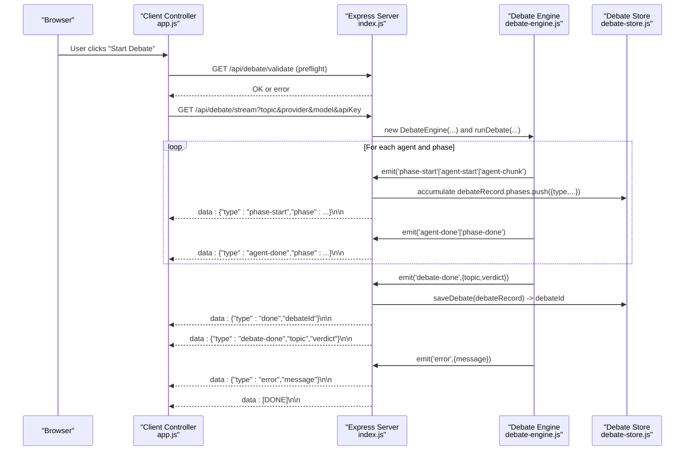
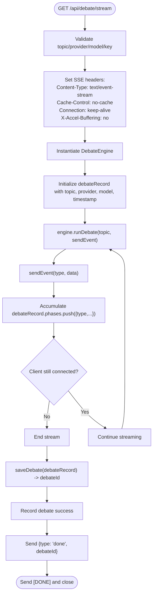
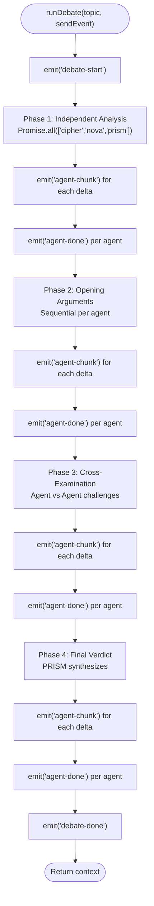
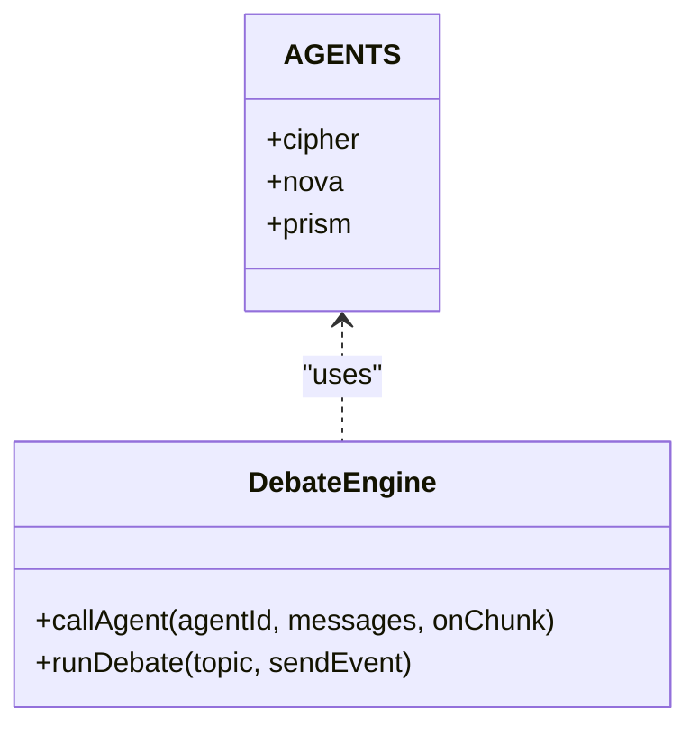
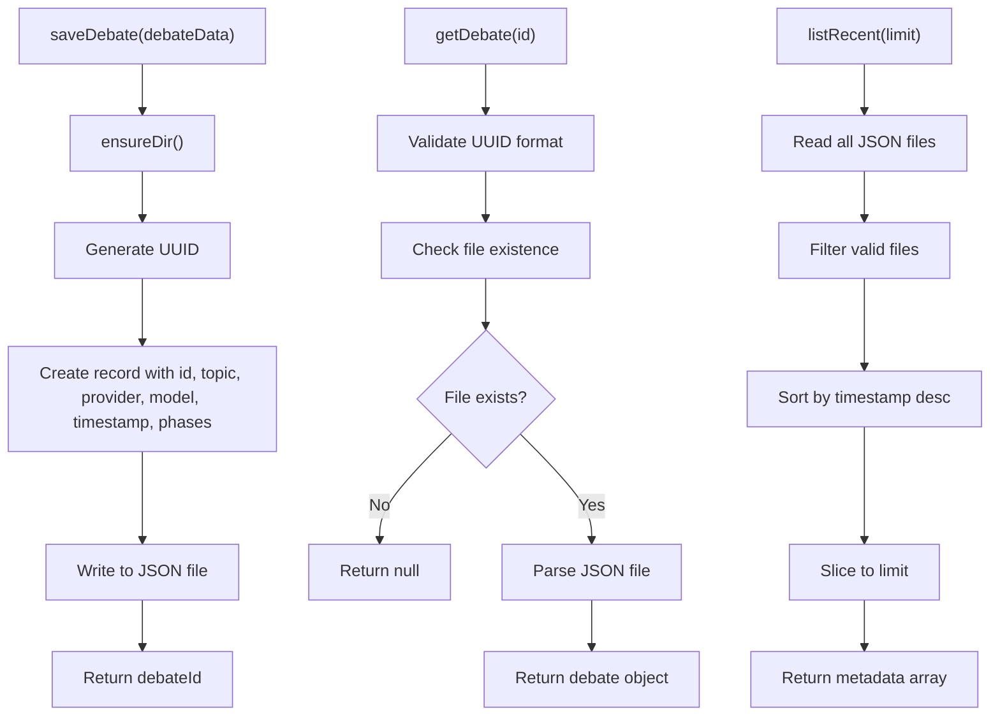
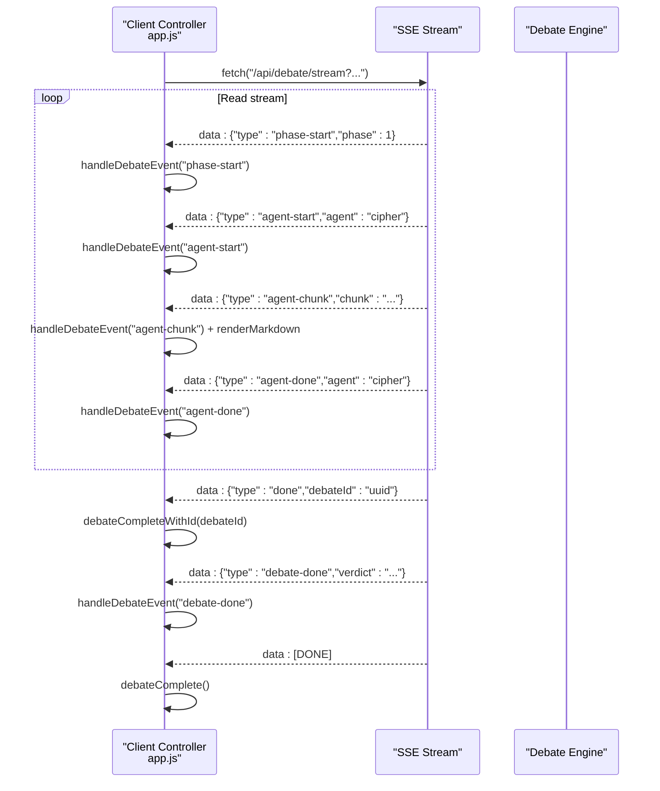
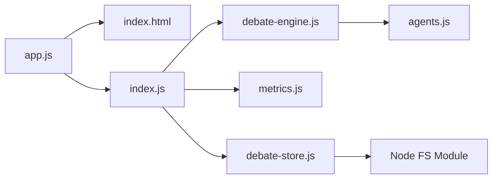

# Real-Time Streaming Architecture

<cite>
**Referenced Files in This Document**
- [index.js](file://dissensus-engine/server/index.js)
- [debate-engine.js](file://dissensus-engine/server/debate-engine.js)
- [agents.js](file://dissensus-engine/server/agents.js)
- [debate-store.js](file://dissensus-engine/server/debate-store.js)
- [metrics.js](file://dissensus-engine/server/metrics.js)
- [app.js](file://dissensus-engine/public/js/app.js)
- [index.html](file://dissensus-engine/public/index.html)
- [DEPLOY-VPS.md](file://dissensus-engine/docs/DEPLOY-VPS.md)
- [nginx-dissensus.conf](file://dissensus-engine/docs/configs/nginx-dissensus.conf)
</cite>

## Update Summary
**Changes Made**
- Added comprehensive debate persistence layer with automatic ID generation
- Enhanced SSE endpoint with real-time debate recording and storage
- Integrated debate retrieval and listing APIs for saved debates
- Improved error handling and client-side debate loading capabilities
- Added debate sharing functionality with persistent URLs

## Table of Contents
1. [Introduction](#introduction)
2. [Project Structure](#project-structure)
3. [Core Components](#core-components)
4. [Architecture Overview](#architecture-overview)
5. [Detailed Component Analysis](#detailed-component-analysis)
6. [Dependency Analysis](#dependency-analysis)
7. [Performance Considerations](#performance-considerations)
8. [Troubleshooting Guide](#troubleshooting-guide)
9. [Conclusion](#conclusion)

## Introduction
This document explains the real-time streaming architecture powering the debate interface. The system uses Server-Sent Events (SSE) to stream structured debate events from the backend to the browser in near real-time. The debate process is orchestrated by a multi-agent system that executes four distinct phases, emitting typed events that drive the dynamic UI updates. The architecture emphasizes asynchronous execution, parallel agent processing, and robust client-server communication protocols. **Updated** with automatic debate persistence, debate ID generation, and improved error handling capabilities.

## Project Structure
The streaming system spans the backend Express server, the debate engine orchestrator, the debate persistence layer, and the frontend client that renders real-time updates.

```mermaid
graph TB
subgraph "Backend"
S["Express Server<br/>index.js"]
E["Debate Engine<br/>debate-engine.js"]
A["Agents<br/>agents.js"]
M["Metrics<br/>metrics.js"]
DS["Debate Store<br/>debate-store.js"]
end
subgraph "Frontend"
C["Client Controller<br/>app.js"]
UI["UI Markup<br/>index.html"]
end
subgraph "Infrastructure"
NGINX["Nginx Proxy<br/>nginx-dissensus.conf"]
end
UI --> C
C --> |"HTTP GET /api/debate/stream"| S
S --> |"new DebateEngine(...)"| E
E --> |"emit('phase-start'| A
E --> |"emit('agent-chunk'"| A
E --> |"emit('agent-done'"| A
E --> |"emit('debate-done'"| A
E --> |"emit('error'"| S
S --> |"SSE: data: {type, ...}"| C
S --> |"saveDebate(debateRecord)"| DS
S --> |"recordDebate()"| M
NGINX --> |"proxy_buffering off"| S
```

**Diagram sources**
- [index.js:156-256](file://dissensus-engine/server/index.js#L156-L256)
- [debate-engine.js:121-399](file://dissensus-engine/server/debate-engine.js#L121-L399)
- [agents.js:8-148](file://dissensus-engine/server/agents.js#L8-L148)
- [debate-store.js:19-33](file://dissensus-engine/server/debate-store.js#L19-L33)
- [metrics.js:32-57](file://dissensus-engine/server/metrics.js#L32-L57)
- [app.js:209-420](file://dissensus-engine/public/js/app.js#L209-L420)
- [nginx-dissensus.conf:42-60](file://dissensus-engine/docs/configs/nginx-dissensus.conf#L42-L60)

**Section sources**
- [index.js:156-256](file://dissensus-engine/server/index.js#L156-L256)
- [debate-engine.js:121-399](file://dissensus-engine/server/debate-engine.js#L121-L399)
- [app.js:209-420](file://dissensus-engine/public/js/app.js#L209-L420)
- [index.html:1-183](file://dissensus-engine/public/index.html#L1-L183)

## Core Components
- Backend Express server with SSE endpoint for streaming debate events and debate persistence APIs.
- Debate engine orchestrator that manages four phases and emits typed events.
- Multi-agent personalities that provide distinct reasoning styles and roles.
- **New** Debate persistence layer that automatically saves completed debates with unique IDs.
- Frontend client controller that parses SSE chunks, updates the UI in real-time, and loads saved debates.
- Infrastructure configuration to support SSE streaming without buffering.

Key streaming event types emitted by the backend:
- debate-start: Initial event with topic, provider, and model.
- phase-start: Marks the beginning of a phase with title and description.
- agent-start: Signals an agent's turn to speak within a phase.
- agent-chunk: Real-time incremental text chunks streamed from agent responses.
- agent-done: Indicates completion of an agent's contribution in a phase.
- phase-done: Marks the end of a phase.
- debate-done: Final event containing the synthesized verdict.
- error: Emits error messages when exceptions occur.
- **New** done: Final event containing the debate ID for sharing and retrieval.

**Section sources**
- [index.js:156-256](file://dissensus-engine/server/index.js#L156-L256)
- [debate-engine.js:130-399](file://dissensus-engine/server/debate-engine.js#L130-L399)
- [app.js:331-399](file://dissensus-engine/public/js/app.js#L331-L399)

## Architecture Overview
The streaming architecture follows a producer-consumer pattern with integrated persistence:
- Producer: The debate engine emits structured events during each phase.
- Transport: Express server writes SSE-formatted data to the client and accumulates debate data for persistence.
- Consumer: The client reads the stream, parses events, updates the UI, and receives the debate ID for sharing.
- Persistence: Completed debates are automatically saved with unique IDs for later retrieval.



**Diagram sources**
- [app.js:209-420](file://dissensus-engine/public/js/app.js#L209-L420)
- [index.js:156-256](file://dissensus-engine/server/index.js#L156-L256)
- [debate-engine.js:121-399](file://dissensus-engine/server/debate-engine.js#L121-L399)
- [debate-store.js:19-33](file://dissensus-engine/server/debate-store.js#L19-L33)

## Detailed Component Analysis

### Backend SSE Endpoint with Persistence
The SSE endpoint sets appropriate headers, validates inputs, streams events to clients, and automatically persists completed debates with unique IDs. It aborts streaming if the client disconnects and records metrics on success or error.



**Diagram sources**
- [index.js:183-256](file://dissensus-engine/server/index.js#L183-L256)

**Section sources**
- [index.js:183-256](file://dissensus-engine/server/index.js#L183-L256)

### Debate Engine Orchestration
The debate engine coordinates four phases and emits typed events. It performs parallel processing for Phase 1 and streams agent responses incrementally.



**Diagram sources**
- [debate-engine.js:131-399](file://dissensus-engine/server/debate-engine.js#L131-L399)

**Section sources**
- [debate-engine.js:131-399](file://dissensus-engine/server/debate-engine.js#L131-L399)

### Agent System
Agents define distinct personalities and system prompts. The engine invokes each agent with tailored prompts per phase and streams incremental chunks.



**Diagram sources**
- [agents.js:8-148](file://dissensus-engine/server/agents.js#L8-L148)
- [debate-engine.js:58-116](file://dissensus-engine/server/debate-engine.js#L58-L116)

**Section sources**
- [agents.js:8-148](file://dissensus-engine/server/agents.js#L8-L148)
- [debate-engine.js:58-116](file://dissensus-engine/server/debate-engine.js#L58-L116)

### Debate Persistence Layer
**New** The debate persistence layer automatically saves completed debates to disk with unique IDs and provides retrieval and listing capabilities.



**Diagram sources**
- [debate-store.js:19-80](file://dissensus-engine/server/debate-store.js#L19-L80)

**Section sources**
- [debate-store.js:19-80](file://dissensus-engine/server/debate-store.js#L19-L80)

### Frontend Streaming Controller with Saved Debate Loading
The client establishes a streaming connection using fetch with manual parsing of SSE chunks. It handles each event type to update the UI progressively and can load saved debates by ID.



**Diagram sources**
- [app.js:209-420](file://dissensus-engine/public/js/app.js#L209-L420)
- [app.js:331-399](file://dissensus-engine/public/js/app.js#L331-L399)

**Section sources**
- [app.js:209-420](file://dissensus-engine/public/js/app.js#L209-L420)
- [app.js:331-399](file://dissensus-engine/public/js/app.js#L331-L399)

### Event Types and Data Flow
- debate-start: Provides topic, provider, and model for context.
- phase-start: Supplies phase metadata (title, description).
- agent-start: Identifies the speaking agent and phase.
- agent-chunk: Streams incremental text deltas; client appends and renders.
- agent-done: Marks agent completion; client stops typing indicator.
- phase-done: Indicates phase completion; client marks step as done.
- debate-done: Delivers the final verdict; client reveals the verdict panel.
- error: Emits server-side errors; client displays user-friendly messages.
- **New** done: Contains the debate ID for sharing and future retrieval.

**Section sources**
- [debate-engine.js:130-399](file://dissensus-engine/server/debate-engine.js#L130-L399)
- [app.js:331-399](file://dissensus-engine/public/js/app.js#L331-L399)

### Asynchronous Execution and Parallel Processing
- Phase 1: Parallel execution of all three agents using Promise.all to maximize throughput.
- Phase 2: Sequential per-agent execution to preserve argument structure.
- Phase 3: Agent-to-agent challenges with independent streaming per agent.
- Phase 4: Final statements and PRISM's verdict, streamed incrementally.

**Section sources**
- [debate-engine.js:162-172](file://dissensus-engine/server/debate-engine.js#L162-L172)
- [debate-engine.js:185-211](file://dissensus-engine/server/debate-engine.js#L185-L211)
- [debate-engine.js:220-294](file://dissensus-engine/server/debate-engine.js#L220-L294)

### Real-Time Data Aggregation with Persistence
- The engine aggregates agent outputs per phase into a debate context object.
- The final verdict synthesizes all prior phases into a structured, confidence-weighted conclusion.
- **New** The server automatically accumulates all events in debateRecord.phases for persistence.
- **New** Completed debates are saved with unique UUIDs for later retrieval and sharing.

**Section sources**
- [debate-engine.js:132-138](file://dissensus-engine/server/debate-engine.js#L132-L138)
- [debate-engine.js:350-390](file://dissensus-engine/server/debate-engine.js#L350-L390)
- [index.js:220-247](file://dissensus-engine/server/index.js#L220-L247)

### Client-Side Event Handling and UI Updates
- The client maintains per-agent buffers for each phase and renders markdown progressively.
- UI states reflect speaking/waiting/done for agents and active/done for phases.
- The verdict panel appears after receiving the final event.
- **New** The client can load saved debates by ID from the URL query parameter.
- **New** The client updates the URL with the debate ID for sharing purposes.

**Section sources**
- [app.js:164-206](file://dissensus-engine/public/js/app.js#L164-L206)
- [app.js:331-399](file://dissensus-engine/public/js/app.js#L331-L399)
- [app.js:434-482](file://dissensus-engine/public/js/app.js#L434-L482)

### Example: Client-Side Streaming UI Updates
- On agent-chunk: Append chunk to agent's phase text and render markdown.
- On agent-start: Mark agent as speaking and initialize phase block.
- On agent-done: Stop typing animation and finalize content.
- On phase-start: Activate current phase and reset agent statuses.
- On phase-done: Mark previous phases as done and clear speaking states.
- On debate-done: Populate verdict panel and scroll into view.
- **New** On done: Store debate ID, update URL, and show share button.
- **New** On saved debate load: Replay all events to reconstruct UI state.

**Section sources**
- [app.js:331-399](file://dissensus-engine/public/js/app.js#L331-L399)
- [app.js:410-420](file://dissensus-engine/public/js/app.js#L410-L420)
- [app.js:434-482](file://dissensus-engine/public/js/app.js#L434-L482)

## Dependency Analysis
The streaming pipeline exhibits clear separation of concerns with integrated persistence:
- index.js depends on debate-engine.js, metrics.js, and debate-store.js.
- debate-engine.js depends on agents.js and provider configurations.
- app.js depends on index.html for DOM structure and interacts with index.js endpoints.
- **New** debate-store.js provides file-based persistence for completed debates.



**Diagram sources**
- [app.js:209-420](file://dissensus-engine/public/js/app.js#L209-L420)
- [index.js:11-15](file://dissensus-engine/server/index.js#L11-L15)
- [debate-engine.js:11](file://dissensus-engine/server/debate-engine.js#L11)
- [debate-store.js:1](file://dissensus-engine/server/debate-store.js#L1)

**Section sources**
- [index.js:11-15](file://dissensus-engine/server/index.js#L11-L15)
- [debate-engine.js:11](file://dissensus-engine/server/debate-engine.js#L11)

## Performance Considerations
- SSE streaming: Nginx disables buffering for the streaming endpoint to ensure low-latency delivery.
- Timeout handling: The client enforces a 5-minute debate timeout to prevent resource exhaustion.
- Chunked decoding: The client decodes stream chunks incrementally and renders markdown progressively.
- Parallelism: Phase 1 runs agents concurrently to reduce total debate time.
- Rate limiting: The server applies rate limits to protect resources.
- **New** Persistence overhead: Debate data is accumulated in memory during streaming and written to disk upon completion.
- **New** File I/O: Debate persistence uses synchronous file operations for simplicity, with automatic directory creation.

**Section sources**
- [nginx-dissensus.conf:42-60](file://dissensus-engine/docs/configs/nginx-dissensus.conf#L42-L60)
- [app.js:312-319](file://dissensus-engine/public/js/app.js#L312-L319)
- [index.js:66-72](file://dissensus-engine/server/index.js#L66-L72)
- [debate-store.js:19-33](file://dissensus-engine/server/debate-store.js#L19-L33)

## Troubleshooting Guide
Common issues and resolutions:
- SSE buffering: Ensure Nginx proxy disables buffering for /api/debate/stream.
- Connection timeouts: The client aborts after 5 minutes; shorten topic length or switch providers.
- Validation errors: Use preflight validation to catch missing or invalid parameters.
- API key errors: Verify provider keys or enable server-side keys for production.
- Client disconnections: The server detects closure and stops streaming.
- **New** Persistence failures: Check that the data directory exists and is writable.
- **New** Debate loading errors: Verify debate ID format and file existence.
- **New** Share URL issues: Ensure the debate ID is properly encoded in the URL.

Debugging steps:
- Inspect browser Network tab for SSE stream and status codes.
- Check server logs for error events and rate limit triggers.
- Confirm infrastructure proxy settings for streaming.
- **New** Verify data directory permissions for debate persistence.
- **New** Check JSON file integrity for saved debates.

**Section sources**
- [DEPLOY-VPS.md:284-366](file://dissensus-engine/docs/DEPLOY-VPS.md#L284-L366)
- [nginx-dissensus.conf:42-60](file://dissensus-engine/docs/configs/nginx-dissensus.conf#L42-L60)
- [app.js:274-292](file://dissensus-engine/public/js/app.js#L274-L292)
- [index.js:248-255](file://dissensus-engine/server/index.js#L248-L255)
- [debate-store.js:40-50](file://dissensus-engine/server/debate-store.js#L40-L50)

## Conclusion
The real-time streaming architecture combines a robust SSE transport with a structured debate orchestration and integrated persistence to deliver a responsive, multi-agent debate experience. The system balances parallel processing with ordered event sequencing, enabling granular UI updates and a compelling user experience. **Updated** with automatic debate persistence, unique ID generation, and improved error handling, the system now supports debate sharing and retrieval capabilities. Proper infrastructure configuration, client-side handling, and persistence layer ensure reliable streaming with the ability to revisit past debates. Metrics and error handling support operational visibility and resilience, while the new persistence layer enables long-term debate archival and sharing.