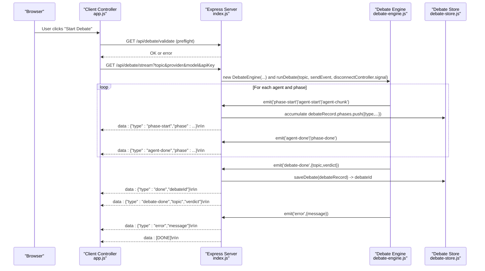
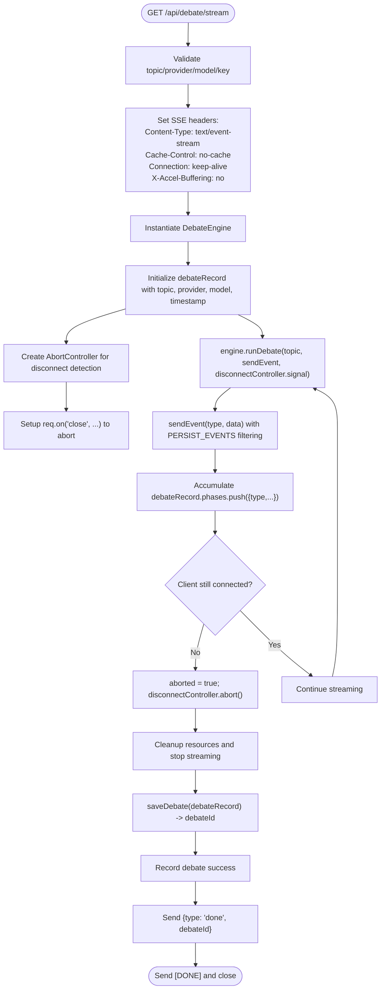
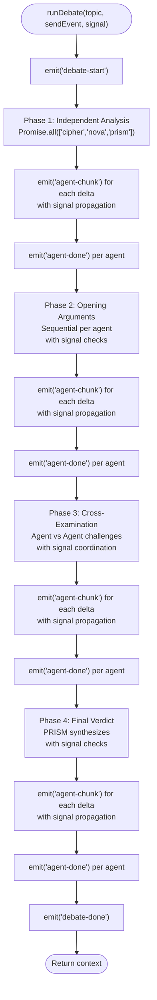
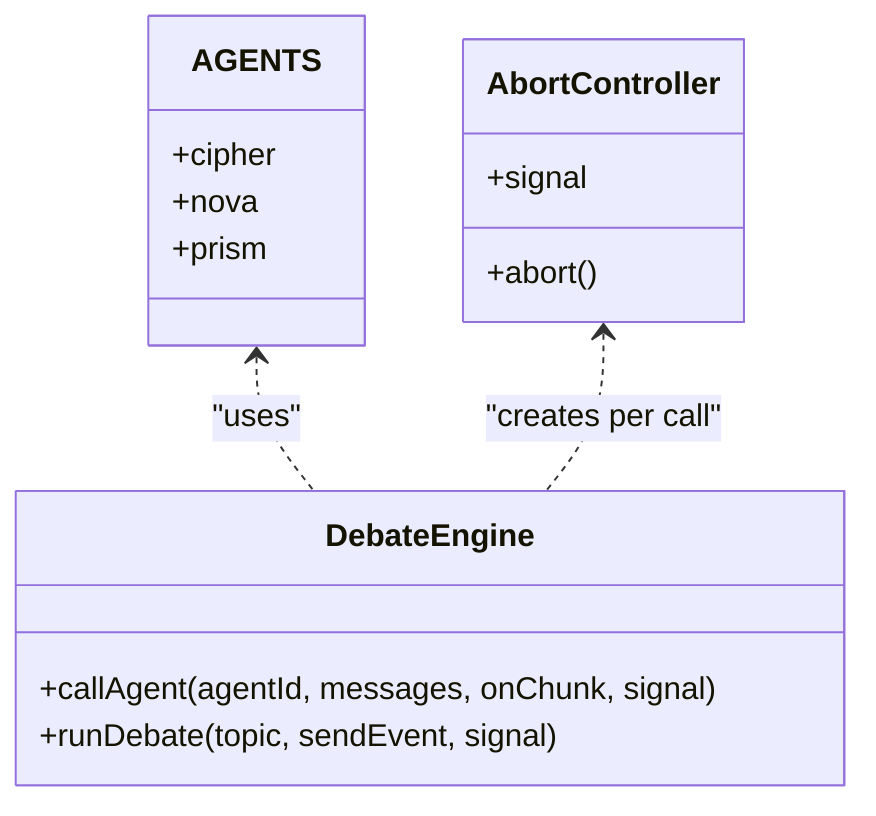
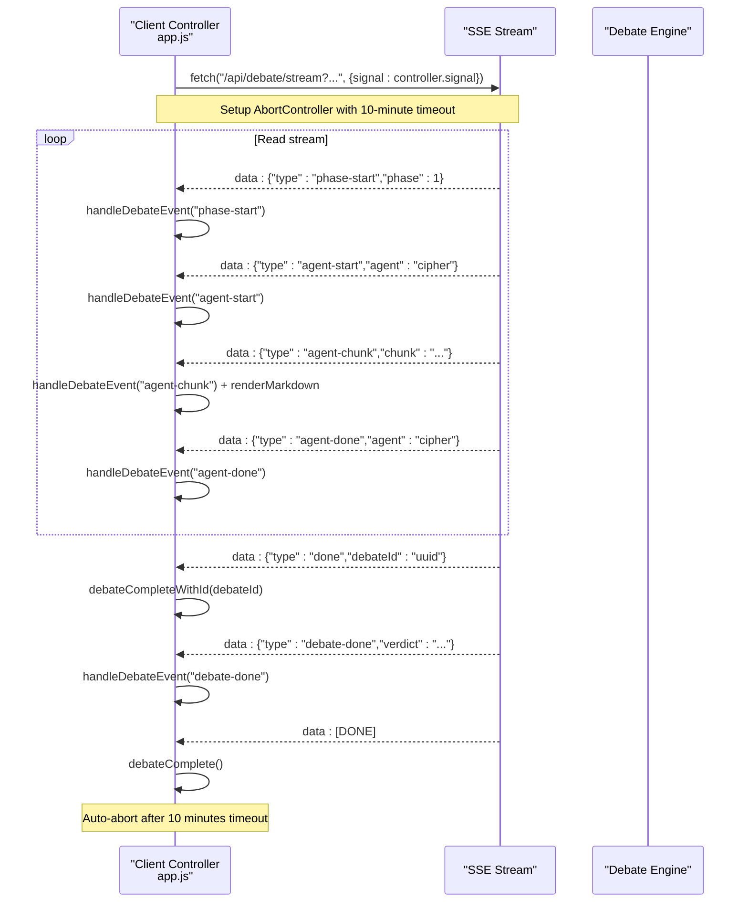
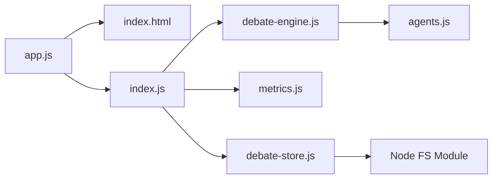

# Real-Time Streaming Architecture

<cite>
**Referenced Files in This Document**
- [index.js](file://dissensus-engine/server/index.js)
- [debate-engine.js](file://dissensus-engine/server/debate-engine.js)
- [agents.js](file://dissensus-engine/server/agents.js)
- [debate-store.js](file://dissensus-engine/server/debate-store.js)
- [metrics.js](file://dissensus-engine/server/metrics.js)
- [app.js](file://dissensus-engine/public/js/app.js)
- [index.html](file://dissensus-engine/public/index.html)
- [DEPLOY-VPS.md](file://dissensus-engine/docs/DEPLOY-VPS.md)
- [nginx-dissensus.conf](file://dissensus-engine/docs/configs/nginx-dissensus.conf)
</cite>

## Update Summary
**Changes Made**
- Enhanced debate streaming with comprehensive abort controller integration for improved connection management
- Implemented bidirectional signal propagation between client and server for graceful cancellation
- Added robust resource cleanup mechanisms for disconnected clients
- Improved error handling and timeout management across streaming endpoints
- Enhanced SSE endpoint with better connection lifecycle management

## Table of Contents
1. [Introduction](#introduction)
2. [Project Structure](#project-structure)
3. [Core Components](#core-components)
4. [Architecture Overview](#architecture-overview)
5. [Detailed Component Analysis](#detailed-component-analysis)
6. [Dependency Analysis](#dependency-analysis)
7. [Performance Considerations](#performance-considerations)
8. [Troubleshooting Guide](#troubleshooting-guide)
9. [Conclusion](#conclusion)

## Introduction
This document explains the real-time streaming architecture powering the debate interface. The system uses Server-Sent Events (SSE) to stream structured debate events from the backend to the browser in near real-time. The debate process is orchestrated by a multi-agent system that executes four distinct phases, emitting typed events that drive the dynamic UI updates. The architecture emphasizes asynchronous execution, parallel agent processing, and robust client-server communication protocols with comprehensive abort controller integration for improved connection management and resource cleanup.

## Project Structure
The streaming system spans the backend Express server, the debate engine orchestrator, the debate persistence layer, and the frontend client that renders real-time updates with enhanced connection management.

```mermaid
graph TB
subgraph "Backend"
S["Express Server<br/>index.js"]
E["Debate Engine<br/>debate-engine.js"]
A["Agents<br/>agents.js"]
M["Metrics<br/>metrics.js"]
DS["Debate Store<br/>debate-store.js"]
end
subgraph "Frontend"
C["Client Controller<br/>app.js"]
UI["UI Markup<br/>index.html"]
end
subgraph "Infrastructure"
NGINX["Nginx Proxy<br/>nginx-dissensus.conf"]
end
UI --> C
C --> |"HTTP GET /api/debate/stream"| S
S --> |"new DebateEngine(...)"| E
E --> |"emit('phase-start'| A
E --> |"emit('agent-chunk'"| A
E --> |"emit('agent-done'"| A
E --> |"emit('debate-done'"| A
E --> |"emit('error'"| S
S --> |"SSE: data: {type, ...}"| C
S --> |"saveDebate(debateRecord)"| DS
S --> |"recordDebate()"| M
NGINX --> |"proxy_buffering off"| S
```

**Diagram sources**
- [index.js:156-256](file://dissensus-engine/server/index.js#L156-L256)
- [debate-engine.js:121-399](file://dissensus-engine/server/debate-engine.js#L121-L399)
- [agents.js:8-148](file://dissensus-engine/server/agents.js#L8-L148)
- [debate-store.js:19-33](file://dissensus-engine/server/debate-store.js#L19-L33)
- [metrics.js:32-57](file://dissensus-engine/server/metrics.js#L32-L57)
- [app.js:209-420](file://dissensus-engine/public/js/app.js#L209-L420)
- [nginx-dissensus.conf:42-60](file://dissensus-engine/docs/configs/nginx-dissensus.conf#L42-L60)

**Section sources**
- [index.js:156-256](file://dissensus-engine/server/index.js#L156-L256)
- [debate-engine.js:121-399](file://dissensus-engine/server/debate-engine.js#L121-L399)
- [app.js:209-420](file://dissensus-engine/public/js/app.js#L209-L420)
- [index.html:1-183](file://dissensus-engine/public/index.html#L1-L183)

## Core Components
- Backend Express server with SSE endpoint for streaming debate events and debate persistence APIs, featuring comprehensive abort controller integration.
- Debate engine orchestrator that manages four phases and emits typed events with bidirectional signal propagation for graceful cancellation.
- Multi-agent personalities that provide distinct reasoning styles and roles, with per-call timeout management and signal coordination.
- Debate persistence layer that automatically saves completed debates with unique IDs for later retrieval.
- Frontend client controller that parses SSE chunks, updates the UI in real-time, loads saved debates, and implements robust connection management.
- Infrastructure configuration to support SSE streaming without buffering and enhanced connection lifecycle management.

Key streaming event types emitted by the backend:
- debate-start: Initial event with topic, provider, and model.
- phase-start: Marks the beginning of a phase with title and description.
- agent-start: Signals an agent's turn to speak within a phase.
- agent-chunk: Real-time incremental text chunks streamed from agent responses.
- agent-done: Indicates completion of an agent's contribution in a phase.
- phase-done: Marks the end of a phase.
- debate-done: Final event containing the synthesized verdict.
- error: Emits error messages when exceptions occur or client disconnects.
- done: Final event containing the debate ID for sharing and retrieval.

**Section sources**
- [index.js:156-256](file://dissensus-engine/server/index.js#L156-L256)
- [debate-engine.js:130-399](file://dissensus-engine/server/debate-engine.js#L130-L399)
- [app.js:331-399](file://dissensus-engine/public/js/app.js#L331-L399)

## Architecture Overview
The streaming architecture follows a producer-consumer pattern with integrated persistence and comprehensive connection management:
- Producer: The debate engine emits structured events during each phase with bidirectional signal propagation.
- Transport: Express server writes SSE-formatted data to the client with enhanced abort controller integration and accumulates debate data for persistence.
- Consumer: The client reads the stream, parses events, updates the UI, receives the debate ID for sharing, and implements robust connection lifecycle management.
- Persistence: Completed debates are automatically saved with unique IDs for later retrieval.



**Diagram sources**
- [app.js:209-420](file://dissensus-engine/public/js/app.js#L209-L420)
- [index.js:183-256](file://dissensus-engine/server/index.js#L183-L256)
- [debate-engine.js:121-399](file://dissensus-engine/server/debate-engine.js#L121-L399)
- [debate-store.js:19-33](file://dissensus-engine/server/debate-store.js#L19-L33)

## Detailed Component Analysis

### Backend SSE Endpoint with Enhanced Abort Controller Integration
The SSE endpoint sets appropriate headers, validates inputs, streams events to clients with comprehensive abort controller integration, and automatically persists completed debates with unique IDs. It implements bidirectional signal propagation for graceful cancellation and improved resource cleanup.



**Diagram sources**
- [index.js:334-445](file://dissensus-engine/server/index.js#L334-L445)

**Section sources**
- [index.js:334-445](file://dissensus-engine/server/index.js#L334-L445)

### Debate Engine Orchestration with Bidirectional Signal Propagation
The debate engine coordinates four phases and emits typed events with comprehensive signal propagation for graceful cancellation. It performs parallel processing for Phase 1 and streams agent responses incrementally with per-call timeout management.



**Diagram sources**
- [debate-engine.js:168-466](file://dissensus-engine/server/debate-engine.js#L168-L466)

**Section sources**
- [debate-engine.js:168-466](file://dissensus-engine/server/debate-engine.js#L168-L466)

### Agent System with Per-Call Timeout Management
Agents define distinct personalities and system prompts with comprehensive timeout management. The engine invokes each agent with tailored prompts per phase, streams incremental chunks, and implements per-call abort controller integration.



**Diagram sources**
- [agents.js:8-148](file://dissensus-engine/server/agents.js#L8-L148)
- [debate-engine.js:66-163](file://dissensus-engine/server/debate-engine.js#L66-L163)

**Section sources**
- [agents.js:8-148](file://dissensus-engine/server/agents.js#L8-L148)
- [debate-engine.js:66-163](file://dissensus-engine/server/debate-engine.js#L66-L163)

### Frontend Streaming Controller with Enhanced Connection Management
The client establishes a streaming connection using fetch with manual parsing of SSE chunks and comprehensive abort controller integration. It handles each event type to update the UI progressively, implements robust timeout management, and can load saved debates by ID.



**Diagram sources**
- [app.js:340-417](file://dissensus-engine/public/js/app.js#L340-L417)
- [app.js:331-399](file://dissensus-engine/public/js/app.js#L331-L399)

**Section sources**
- [app.js:340-417](file://dissensus-engine/public/js/app.js#L340-L417)
- [app.js:331-399](file://dissensus-engine/public/js/app.js#L331-L399)

### Enhanced Event Types and Data Flow
- debate-start: Provides topic, provider, and model for context.
- phase-start: Supplies phase metadata (title, description).
- agent-start: Identifies the speaking agent and phase.
- agent-chunk: Streams incremental text deltas with signal propagation; client appends and renders.
- agent-done: Marks agent completion; client stops typing indicator.
- phase-done: Indicates phase completion; client marks step as done.
- debate-done: Delivers the final verdict; client reveals the verdict panel.
- error: Emits server-side errors or client disconnect notifications; client displays user-friendly messages.
- done: Contains the debate ID for sharing and future retrieval.

**Section sources**
- [debate-engine.js:130-399](file://dissensus-engine/server/debate-engine.js#L130-L399)
- [app.js:331-399](file://dissensus-engine/public/js/app.js#L331-L399)

### Asynchronous Execution and Parallel Processing with Signal Coordination
- Phase 1: Parallel execution of all three agents using Promise.all with comprehensive signal propagation to maximize throughput.
- Phase 2: Sequential per-agent execution with signal checks to preserve argument structure and enable graceful cancellation.
- Phase 3: Agent-to-agent challenges with independent streaming per agent and coordinated signal management.
- Phase 4: Final statements and PRISM's verdict, streamed incrementally with signal propagation for timeout handling.
- Per-call timeout: Each agent call has a 90-second timeout with AbortController integration for resource cleanup.

**Section sources**
- [debate-engine.js:162-172](file://dissensus-engine/server/debate-engine.js#L162-L172)
- [debate-engine.js:185-211](file://dissensus-engine/server/debate-engine.js#L185-L211)
- [debate-engine.js:220-294](file://dissensus-engine/server/debate-engine.js#L220-L294)

### Real-Time Data Aggregation with Enhanced Persistence
- The engine aggregates agent outputs per phase into a debate context object with signal-aware processing.
- The final verdict synthesizes all prior phases into a structured, confidence-weighted conclusion with timeout safety checks.
- The server automatically accumulates all events in debateRecord.phases for persistence with PERSIST_EVENTS filtering.
- Completed debates are saved with unique UUIDs for later retrieval and sharing.

**Section sources**
- [debate-engine.js:132-138](file://dissensus-engine/server/debate-engine.js#L132-L138)
- [debate-engine.js:350-390](file://dissensus-engine/server/debate-engine.js#L350-L390)
- [index.js:410-436](file://dissensus-engine/server/index.js#L410-L436)

### Client-Side Event Handling and UI Updates with Enhanced Connection Management
- The client maintains per-agent buffers for each phase and renders markdown progressively with signal-aware processing.
- UI states reflect speaking/waiting/done for agents and active/done for phases with timeout handling.
- The verdict panel appears after receiving the final event with comprehensive error recovery.
- The client implements robust connection lifecycle management with 10-minute timeout and AbortController integration.
- The client can load saved debates by ID from the URL query parameter with enhanced error handling.

**Section sources**
- [app.js:164-206](file://dissensus-engine/public/js/app.js#L164-L206)
- [app.js:331-399](file://dissensus-engine/public/js/app.js#L331-L399)
- [app.js:434-482](file://dissensus-engine/public/js/app.js#L434-L482)

### Example: Client-Side Streaming UI Updates with Enhanced Error Handling
- On agent-chunk: Append chunk to agent's phase text and render markdown with signal awareness.
- On agent-start: Mark agent as speaking and initialize phase block with timeout protection.
- On agent-done: Stop typing animation and finalize content with resource cleanup.
- On phase-start: Activate current phase and reset agent statuses with error recovery.
- On phase-done: Mark previous phases as done and clear speaking states with timeout handling.
- On debate-done: Populate verdict panel and scroll into view with comprehensive error handling.
- On error: Handle server-side errors or client disconnect notifications with user-friendly messaging.
- On done: Store debate ID, update URL, show share button, and implement timeout cleanup.

**Section sources**
- [app.js:331-399](file://dissensus-engine/public/js/app.js#L331-L399)
- [app.js:410-420](file://dissensus-engine/public/js/app.js#L410-L420)
- [app.js:434-482](file://dissensus-engine/public/js/app.js#L434-L482)

## Dependency Analysis
The streaming pipeline exhibits clear separation of concerns with integrated persistence and comprehensive signal propagation:
- index.js depends on debate-engine.js, metrics.js, and debate-store.js with enhanced abort controller integration.
- debate-engine.js depends on agents.js and provider configurations with bidirectional signal propagation.
- app.js depends on index.html for DOM structure and interacts with index.js endpoints with robust connection management.
- The system implements comprehensive signal coordination between client and server for graceful cancellation.



**Diagram sources**
- [app.js:209-420](file://dissensus-engine/public/js/app.js#L209-L420)
- [index.js:11-15](file://dissensus-engine/server/index.js#L11-L15)
- [debate-engine.js:11](file://dissensus-engine/server/debate-engine.js#L11)
- [debate-store.js:1](file://dissensus-engine/server/debate-store.js#L1)

**Section sources**
- [index.js:11-15](file://dissensus-engine/server/index.js#L11-L15)
- [debate-engine.js:11](file://dissensus-engine/server/debate-engine.js#L11)

## Performance Considerations
- SSE streaming: Nginx disables buffering for the streaming endpoint to ensure low-latency delivery.
- Timeout handling: The client enforces a 10-minute debate timeout and the server implements 90-second per-call timeouts for resource efficiency.
- Chunked decoding: The client decodes stream chunks incrementally and renders markdown progressively with signal awareness.
- Parallelism: Phase 1 runs agents concurrently to reduce total debate time with comprehensive signal coordination.
- Rate limiting: The server applies rate limits to protect resources with enhanced connection management.
- Abort controller integration: Bidirectional signal propagation enables graceful cancellation and resource cleanup.
- Persistence overhead: Debate data is accumulated in memory during streaming and written to disk upon completion.
- File I/O: Debate persistence uses synchronous file operations for simplicity, with automatic directory creation.

**Section sources**
- [nginx-dissensus.conf:42-60](file://dissensus-engine/docs/configs/nginx-dissensus.conf#L42-L60)
- [app.js:312-319](file://dissensus-engine/public/js/app.js#L312-L319)
- [index.js:66-72](file://dissensus-engine/server/index.js#L66-L72)
- [debate-store.js:19-33](file://dissensus-engine/server/debate-store.js#L19-L33)

## Troubleshooting Guide
Common issues and resolutions:
- SSE buffering: Ensure Nginx proxy disables buffering for /api/debate/stream.
- Connection timeouts: The client aborts after 10 minutes; the server implements 90-second per-call timeouts; shorten topic length or switch providers.
- Validation errors: Use preflight validation to catch missing or invalid parameters.
- API key errors: Verify provider keys or enable server-side keys for production.
- Client disconnections: The server detects closure via disconnectController and stops streaming gracefully.
- Signal propagation: Verify bidirectional signal coordination between client and server for proper cancellation.
- Resource cleanup: Monitor for proper cleanup of AbortController instances and timeout handlers.
- Persistence failures: Check that the data directory exists and is writable.
- Debate loading errors: Verify debate ID format and file existence.
- Share URL issues: Ensure the debate ID is properly encoded in the URL.

Debugging steps:
- Inspect browser Network tab for SSE stream and status codes with connection lifecycle monitoring.
- Check server logs for error events, rate limit triggers, and signal propagation issues.
- Confirm infrastructure proxy settings for streaming with enhanced connection management.
- Verify data directory permissions for debate persistence.
- Check JSON file integrity for saved debates.
- Monitor AbortController usage and signal propagation for proper resource cleanup.

**Section sources**
- [DEPLOY-VPS.md:284-366](file://dissensus-engine/docs/DEPLOY-VPS.md#L284-L366)
- [nginx-dissensus.conf:42-60](file://dissensus-engine/docs/configs/nginx-dissensus.conf#L42-L60)
- [app.js:274-292](file://dissensus-engine/public/js/app.js#L274-L292)
- [index.js:248-255](file://dissensus-engine/server/index.js#L248-L255)
- [debate-store.js:40-50](file://dissensus-engine/server/debate-store.js#L40-L50)

## Conclusion
The real-time streaming architecture combines a robust SSE transport with a structured debate orchestration, integrated persistence, and comprehensive abort controller integration to deliver a responsive, multi-agent debate experience. The system balances parallel processing with ordered event sequencing, enabling granular UI updates and a compelling user experience. Enhanced abort controller integration provides improved connection management, bidirectional signal propagation enables graceful cancellation, and comprehensive resource cleanup ensures efficient operation. The system now supports debate sharing and retrieval capabilities with robust error handling and timeout management. Proper infrastructure configuration, client-side handling with enhanced connection lifecycle management, and persistence layer ensure reliable streaming with the ability to revisit past debates. Metrics and error handling support operational visibility and resilience, while the new persistence layer enables long-term debate archival and sharing with comprehensive signal coordination between client and server.