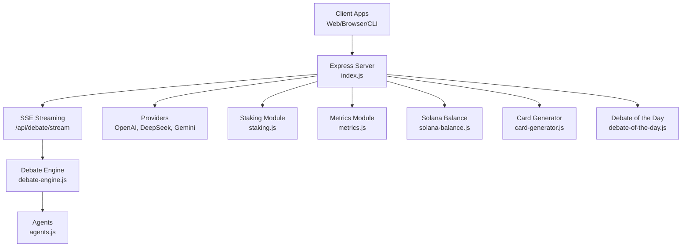
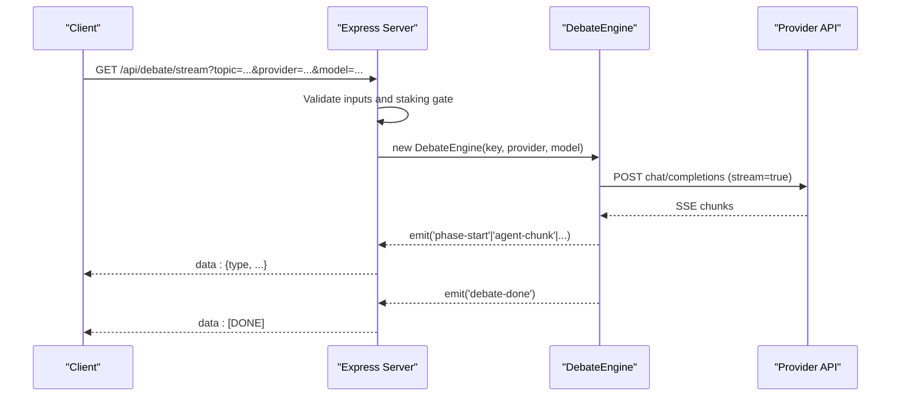
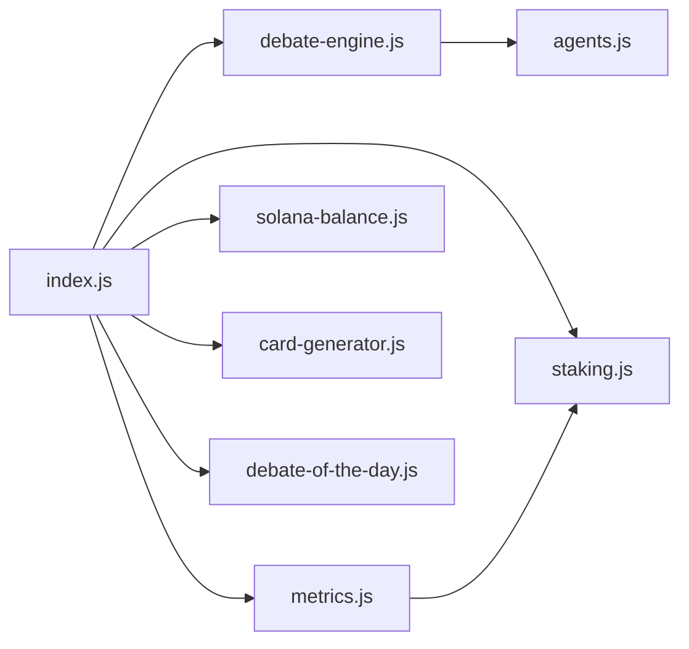

# API Reference

<cite>
**Referenced Files in This Document**
- [index.js](file://dissensus-engine/server/index.js)
- [debate-engine.js](file://dissensus-engine/server/debate-engine.js)
- [staking.js](file://dissensus-engine/server/staking.js)
- [metrics.js](file://dissensus-engine/server/metrics.js)
- [solana-balance.js](file://dissensus-engine/server/solana-balance.js)
- [agents.js](file://dissensus-engine/server/agents.js)
- [card-generator.js](file://dissensus-engine/server/card-generator.js)
- [debate-of-the-day.js](file://dissensus-engine/server/debate-of-the-day.js)
- [package.json](file://dissensus-engine/package.json)
- [test-api.html](file://dissensus-engine/public/test-api.html)
- [README.md](file://dissensus-engine/README.md)
</cite>

## Table of Contents
1. [Introduction](#introduction)
2. [Project Structure](#project-structure)
3. [Core Components](#core-components)
4. [Architecture Overview](#architecture-overview)
5. [Detailed Component Analysis](#detailed-component-analysis)
6. [Dependency Analysis](#dependency-analysis)
7. [Performance Considerations](#performance-considerations)
8. [Troubleshooting Guide](#troubleshooting-guide)
9. [Conclusion](#conclusion)
10. [Appendices](#appendices)

## Introduction
This document provides a comprehensive API reference for the Dissensus Engine backend. It covers all public endpoints and interfaces, including:
- Debate API: initiation, real-time streaming, and parameter validation
- Staking API: tier information, status checking, and wallet verification
- Metrics API: analytics data and transparency reporting
- Solana integration: on-chain balance checks
- Additional utilities: debate-of-the-day and shareable debate cards

It includes endpoint specifications, authentication requirements, request/response schemas, error handling, rate limiting, and integration best practices.

## Project Structure
The server is implemented as a Node.js/Express application with modular components:
- Express server with middleware and route handlers
- Debate orchestration engine with multi-provider support
- Staking module with simulated tiers and daily limits
- Metrics module for analytics and transparency
- Solana integration for on-chain balance checks
- Utilities for debate cards and trending topics

**Diagram sources**
- [index.js:1-481](file://dissensus-engine/server/index.js#L1-L481)
- [debate-engine.js:1-389](file://dissensus-engine/server/debate-engine.js#L1-L389)
- [agents.js:1-148](file://dissensus-engine/server/agents.js#L1-L148)
- [staking.js:1-183](file://dissensus-engine/server/staking.js#L1-L183)
- [metrics.js:1-152](file://dissensus-engine/server/metrics.js#L1-L152)
- [solana-balance.js:1-83](file://dissensus-engine/server/solana-balance.js#L1-L83)
- [card-generator.js:1-361](file://dissensus-engine/server/card-generator.js#L1-L361)
- [debate-of-the-day.js:1-80](file://dissensus-engine/server/debate-of-the-day.js#L1-L80)

**Section sources**
- [index.js:1-481](file://dissensus-engine/server/index.js#L1-L481)
- [package.json:1-28](file://dissensus-engine/package.json#L1-L28)

## Core Components
- Express server with Helmet, rate limiting, and static serving
- Debate engine orchestrating 4-phase dialectical process
- Staking module with tiers and daily debate limits
- Metrics module for analytics and transparency
- Solana integration for on-chain balance checks
- Utilities for debate cards and trending topics

**Section sources**
- [index.js:26-56](file://dissensus-engine/server/index.js#L26-L56)
- [debate-engine.js:41-389](file://dissensus-engine/server/debate-engine.js#L41-L389)
- [staking.js:9-183](file://dissensus-engine/server/staking.js#L9-L183)
- [metrics.js:10-152](file://dissensus-engine/server/metrics.js#L10-L152)
- [solana-balance.js:22-83](file://dissensus-engine/server/solana-balance.js#L22-L83)
- [card-generator.js:1-361](file://dissensus-engine/server/card-generator.js#L1-L361)
- [debate-of-the-day.js:1-80](file://dissensus-engine/server/debate-of-the-day.js#L1-L80)

## Architecture Overview
The server exposes REST endpoints and SSE streams. The debate flow uses Server-Sent Events to stream structured events to clients. Staking enforcement is optional and controlled by environment variables. Metrics are collected in-memory and exposed via public endpoints.

**Diagram sources**
- [index.js:220-311](file://dissensus-engine/server/index.js#L220-L311)
- [debate-engine.js:58-116](file://dissensus-engine/server/debate-engine.js#L58-L116)
- [debate-engine.js:121-386](file://dissensus-engine/server/debate-engine.js#L121-L386)

## Detailed Component Analysis

### Debate API
Endpoints for initiating debates, validating parameters, and streaming results.

- GET /api/debate/stream
  - Purpose: Start a debate and stream results via Server-Sent Events
  - Authentication: API key required (client-provided or server-side)
  - Query parameters:
    - topic (string, required, 3–500 chars)
    - provider (string, optional, default "deepseek")
    - model (string, optional, defaults by provider)
    - wallet (string, optional, required if staking enforced)
  - Rate limit: 10/min in production, higher in development
  - Response: SSE stream of structured events
  - Errors:
    - 400: Missing/invalid topic, invalid provider/model, missing API key
    - 403: Daily debate limit reached (staking enforced)
    - 500: Provider error or internal error
  - Example:
    - curl -N "http://localhost:3000/api/debate/stream?topic=Bitcoin%20value&provider=deepseek&model=deepseek-chat"

- POST /api/debate/validate
  - Purpose: Preflight validation before starting a debate
  - Authentication: None
  - Request body:
    - topic (string, required)
    - apiKey (string, optional)
    - provider (string, optional)
    - model (string, optional)
    - wallet (string, optional)
  - Response: { ok: true } or { error: string }
  - Errors: Same as GET /api/debate/stream for validation failures

- GET /api/debate-of-the-day
  - Purpose: Get a trending topic suggestion
  - Response: { topic: string }
  - Errors: Falls back to curated topics if external API fails

- POST /api/card
  - Purpose: Generate a shareable PNG card for a debate
  - Authentication: None
  - Request body:
    - topic (string, required, ≤200 chars)
    - verdict (string, required)
  - Response: image/png attachment
  - Errors: 400 for invalid inputs, 500 on generation failure

**Section sources**
- [index.js:177-215](file://dissensus-engine/server/index.js#L177-L215)
- [index.js:220-311](file://dissensus-engine/server/index.js#L220-L311)
- [index.js:360-369](file://dissensus-engine/server/index.js#L360-L369)
- [index.js:382-416](file://dissensus-engine/server/index.js#L382-L416)
- [debate-engine.js:14-39](file://dissensus-engine/server/debate-engine.js#L14-L39)
- [debate-engine.js:41-389](file://dissensus-engine/server/debate-engine.js#L41-L389)
- [agents.js:8-148](file://dissensus-engine/server/agents.js#L8-L148)
- [debate-of-the-day.js:66-79](file://dissensus-engine/server/debate-of-the-day.js#L66-L79)
- [card-generator.js:170-361](file://dissensus-engine/server/card-generator.js#L170-L361)

### Staking API
Endpoints for tier information, status checking, and simulated stake/unstake.

- GET /api/staking/tiers
  - Purpose: Retrieve tier thresholds and features
  - Response: { tiers: [...], simulated: boolean, enforce: boolean }
  - Example: curl "http://localhost:3000/api/staking/tiers"

- GET /api/staking/status
  - Purpose: Check tier, staked amount, and daily usage
  - Query parameters:
    - wallet (string, required)
  - Response: { staked, tier, tierBenefits, debatesUsedToday, debatesRemaining, wallet }
  - Errors: 400 for invalid wallet

- POST /api/staking/stake
  - Purpose: Simulate staking for a wallet
  - Request body: { wallet, amount }
  - Response: { ok: true, ...status }
  - Errors: 400 for invalid inputs

- POST /api/staking/unstake
  - Purpose: Reset stake to zero
  - Request body: { wallet }
  - Response: { ok: true, ...status }

- GET /api/solana/token-balance
  - Purpose: Server-side SPL token balance check
  - Query parameters:
    - wallet (string, required)
  - Response: { ok: true, uiAmount, raw, decimals, mint, ata, note? }
  - Errors: 400 for invalid wallet, 500 for provider errors

- GET /api/solana/staking-status
  - Purpose: On-chain staking program status (placeholder)
  - Response: { programId?, onChainStakingLive, message }

**Section sources**
- [index.js:324-355](file://dissensus-engine/server/index.js#L324-L355)
- [index.js:98-122](file://dissensus-engine/server/index.js#L98-L122)
- [staking.js:43-136](file://dissensus-engine/server/staking.js#L43-L136)
- [staking.js:147-154](file://dissensus-engine/server/staking.js#L147-L154)
- [solana-balance.js:26-76](file://dissensus-engine/server/solana-balance.js#L26-L76)

### Metrics API
Public analytics and transparency reporting.

- GET /api/metrics
  - Purpose: Get aggregated metrics and optional recent topics
  - Query parameters:
    - recent (number, optional, default 12, max 50)
  - Response: { totalDebates, uniqueTopics, debatesToday, providerUsage, staking, uptimeSeconds, uptimePercent, debatesLastHour, lastUpdated, serverStartTime, note? }

- GET /api/metrics/topics
  - Purpose: Get recent topics only
  - Query parameters:
    - limit (number, optional, default 10, min 1, max 50)
  - Response: array of topic rows

- GET /metrics
  - Purpose: Serve the public metrics dashboard HTML

**Section sources**
- [index.js:429-445](file://dissensus-engine/server/index.js#L429-L445)
- [metrics.js:100-152](file://dissensus-engine/server/metrics.js#L100-L152)

### Provider and Configuration
- GET /api/config
  - Purpose: Server configuration and capabilities
  - Response: { serverKeys, maxTopicLength, stakingEnforce, stakingSimulated, solana: { cluster, dissTokenMint, balanceCheckUrl } }

- GET /api/providers
  - Purpose: Available providers and models
  - Response: { provider: { hasServerKey, models: [{ id, name, costPer1kIn, costPer1kOut }] } }

**Section sources**
- [index.js:69-85](file://dissensus-engine/server/index.js#L69-L85)
- [index.js:138-152](file://dissensus-engine/server/index.js#L138-L152)
- [debate-engine.js:14-39](file://dissensus-engine/server/debate-engine.js#L14-L39)

### Health and Diagnostics
- GET /api/health
  - Purpose: Basic health check
  - Response: { status: "ok", service, providers }

**Section sources**
- [index.js:127-133](file://dissensus-engine/server/index.js#L127-L133)

## Dependency Analysis
The server composes several modules with clear boundaries:
- index.js orchestrates routes, middleware, and rate limits
- debate-engine.js encapsulates provider-specific calls and SSE streaming
- staking.js manages simulated tiers and daily usage
- metrics.js aggregates analytics and recent topics
- solana-balance.js handles on-chain balance checks
- agents.js defines agent personalities and prompts
- card-generator.js produces shareable images
- debate-of-the-day.js provides trending topics

**Diagram sources**
- [index.js:10-24](file://dissensus-engine/server/index.js#L10-L24)
- [debate-engine.js:11-11](file://dissensus-engine/server/debate-engine.js#L11-L11)
- [metrics.js:8-8](file://dissensus-engine/server/metrics.js#L8-L8)

**Section sources**
- [index.js:10-24](file://dissensus-engine/server/index.js#L10-L24)
- [debate-engine.js:11-11](file://dissensus-engine/server/debate-engine.js#L11-L11)
- [metrics.js:8-8](file://dissensus-engine/server/metrics.js#L8-L8)

## Performance Considerations
- SSE streaming: The debate endpoint streams chunks directly from provider APIs to clients. Ensure clients handle backpressure and disconnects gracefully.
- Rate limiting: Each endpoint has dedicated rate limits to prevent abuse. Tune TRUST_PROXY and TRUST_PROXY_HOPS behind reverse proxies.
- Provider costs: Costs vary by provider and model. Use smaller models for cost-sensitive scenarios.
- In-memory metrics: Resets on restart. For production, persist metrics to a database or time-series store.
- Staking simulation: Daily resets occur at server timezone. Configure DEBATE_OF_THE_DAY_TZ for consistent caching.

[No sources needed since this section provides general guidance]

## Troubleshooting Guide
Common issues and resolutions:
- Invalid wallet address:
  - Symptom: 400 on /api/solana/token-balance or staking endpoints
  - Resolution: Ensure wallet is a valid base58 string of appropriate length
- Missing or invalid API key:
  - Symptom: 400 on /api/debate/stream or /api/debate/validate
  - Resolution: Provide a valid provider API key or configure server-side keys
- Daily debate limit reached:
  - Symptom: 403 on /api/debate/stream when staking enforced
  - Resolution: Stake more $DISS (simulated) or wait until next day
- Provider errors:
  - Symptom: 500 with error event in SSE stream
  - Resolution: Verify provider credentials and quotas
- Rate limit exceeded:
  - Symptom: 429 responses
  - Resolution: Reduce request frequency or adjust rate limits

**Section sources**
- [index.js:98-111](file://dissensus-engine/server/index.js#L98-L111)
- [index.js:220-311](file://dissensus-engine/server/index.js#L220-L311)
- [solana-balance.js:26-76](file://dissensus-engine/server/solana-balance.js#L26-L76)
- [staking.js:110-125](file://dissensus-engine/server/staking.js#L110-L125)

## Conclusion
The Dissensus Engine provides a robust, extensible API for real-time debate orchestration, staking integration, and transparency reporting. By leveraging SSE streaming, multi-provider support, and in-memory analytics, it enables engaging and informative AI debates. For production deployments, consider persistent metrics storage, stricter authentication, and on-chain staking integration.

[No sources needed since this section summarizes without analyzing specific files]

## Appendices

### Endpoint Catalog
- GET /api/config
- GET /api/providers
- POST /api/debate/validate
- GET /api/debate/stream
- GET /api/debate-of-the-day
- POST /api/card
- GET /api/staking/tiers
- GET /api/staking/status
- POST /api/staking/stake
- POST /api/staking/unstake
- GET /api/solana/token-balance
- GET /api/solana/staking-status
- GET /api/metrics
- GET /api/metrics/topics
- GET /metrics
- GET /api/health

**Section sources**
- [index.js:69-152](file://dissensus-engine/server/index.js#L69-L152)
- [index.js:177-311](file://dissensus-engine/server/index.js#L177-L311)
- [index.js:324-445](file://dissensus-engine/server/index.js#L324-L445)

### Request/Response Schemas

- GET /api/debate/stream (SSE)
  - Events:
    - debate-start: { topic, provider, model }
    - phase-start: { phase, title, description }
    - agent-start: { phase, agent }
    - agent-chunk: { phase, agent, chunk }
    - agent-done: { phase, agent }
    - phase-done: { phase }
    - debate-done: { topic, verdict }
    - error: { message }

- GET /api/staking/status
  - Response: { staked, tier, tierBenefits, debatesUsedToday, debatesRemaining, wallet }

- GET /api/metrics
  - Response: { totalDebates, uniqueTopics, debatesToday, providerUsage, staking, uptimeSeconds, uptimePercent, debatesLastHour, lastUpdated, serverStartTime, note? }

- GET /api/solana/token-balance
  - Response: { ok: true, uiAmount, raw, decimals, mint, ata, note? }

**Section sources**
- [index.js:277-302](file://dissensus-engine/server/index.js#L277-L302)
- [staking.js:43-79](file://dissensus-engine/server/staking.js#L43-L79)
- [metrics.js:100-132](file://dissensus-engine/server/metrics.js#L100-L132)
- [solana-balance.js:55-76](file://dissensus-engine/server/solana-balance.js#L55-L76)

### Authentication and Security
- API keys:
  - Client-provided keys are forwarded to provider APIs
  - Server-side keys can be configured for production deployments
- Rate limiting:
  - Configured per endpoint to prevent abuse
- Trust proxy:
  - Configure TRUST_PROXY and TRUST_PROXY_HOPS behind reverse proxies

**Section sources**
- [index.js:40-45](file://dissensus-engine/server/index.js#L40-L45)
- [index.js:35-38](file://dissensus-engine/server/index.js#L35-L38)

### Rate Limiting
- Debate stream: 10/min (prod), higher in dev
- Solana balance: 60/min (prod)
- Staking endpoints: 60/min (prod)
- Card generation: 20/min (prod)
- Metrics: 120/min (prod)

**Section sources**
- [index.js:58-64](file://dissensus-engine/server/index.js#L58-L64)
- [index.js:90-96](file://dissensus-engine/server/index.js#L90-L96)
- [index.js:316-322](file://dissensus-engine/server/index.js#L316-L322)
- [index.js:374-380](file://dissensus-engine/server/index.js#L374-L380)
- [index.js:421-427](file://dissensus-engine/server/index.js#L421-L427)

### Practical Examples
- Validate a debate:
  - curl -X POST "http://localhost:3000/api/debate/validate" -H "Content-Type: application/json" -d '{"topic":"Bitcoin","provider":"deepseek","model":"deepseek-chat"}'
- Start a debate and stream:
  - curl -N "http://localhost:3000/api/debate/stream?topic=Bitcoin&provider=deepseek&model=deepseek-chat"
- Check staking status:
  - curl "http://localhost:3000/api/staking/status?wallet=..."
- Generate a card:
  - curl -X POST "http://localhost:3000/api/card" -H "Content-Type: application/json" -d '{"topic":"Bitcoin","verdict":"..."}'

**Section sources**
- [test-api.html:13-48](file://dissensus-engine/public/test-api.html#L13-L48)
- [README.md:56-64](file://dissensus-engine/README.md#L56-L64)

### API Versioning and Backward Compatibility
- Current version: 1.0.0
- No explicit version header is set; clients should pin to major versions
- Breaking changes will be introduced as new major versions

**Section sources**
- [package.json:3](file://dissensus-engine/package.json#L3)

### Integration Best Practices
- Use /api/debate/validate before starting debates to catch errors early
- Implement exponential backoff for provider API retries
- Cache /api/config and /api/providers on the client
- Respect rate limits and implement client-side throttling
- For production, enable HTTPS and consider API keys or JWT authentication
- Monitor /api/metrics for system health and usage trends

**Section sources**
- [index.js:69-85](file://dissensus-engine/server/index.js#L69-L85)
- [index.js:138-152](file://dissensus-engine/server/index.js#L138-L152)
- [README.md:182-187](file://dissensus-engine/README.md#L182-L187)