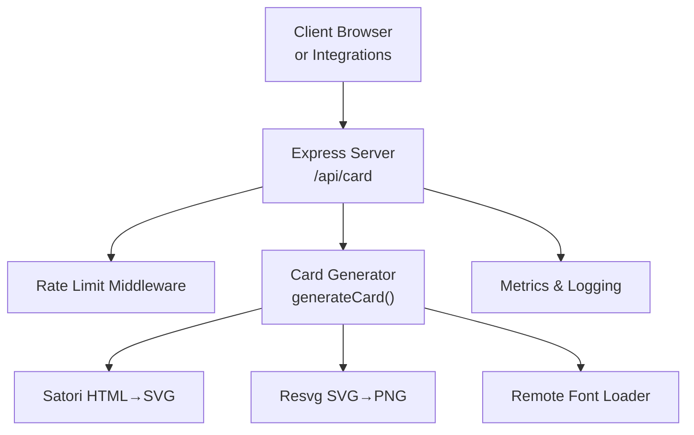
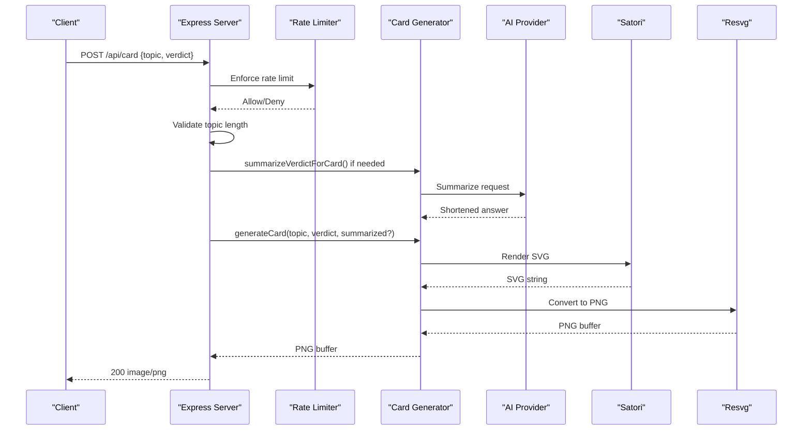
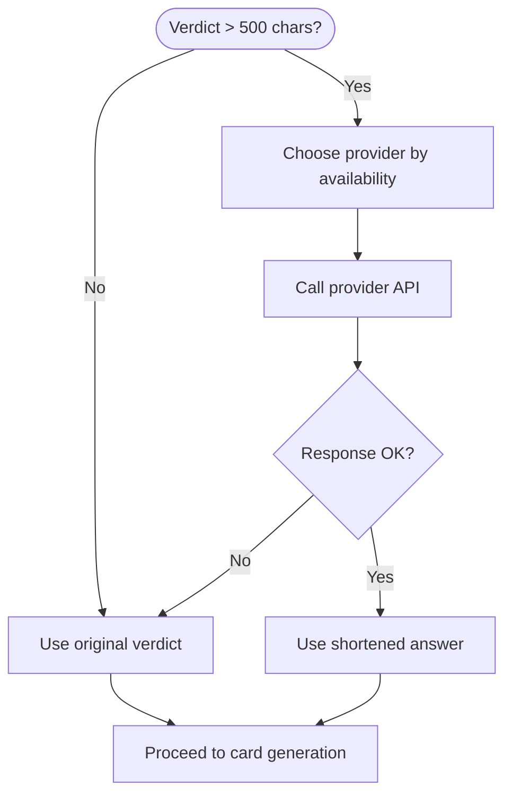
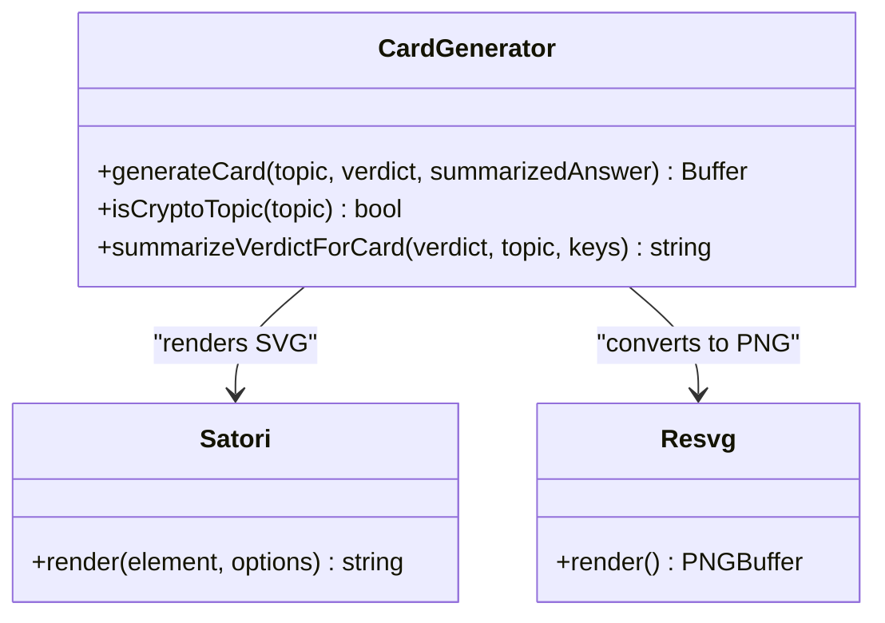
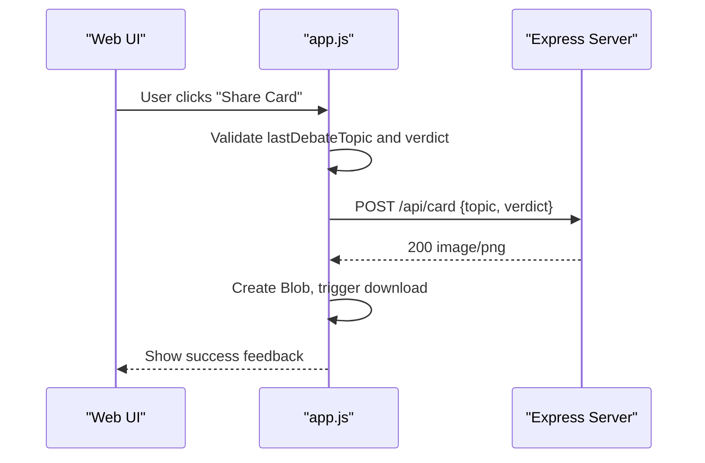
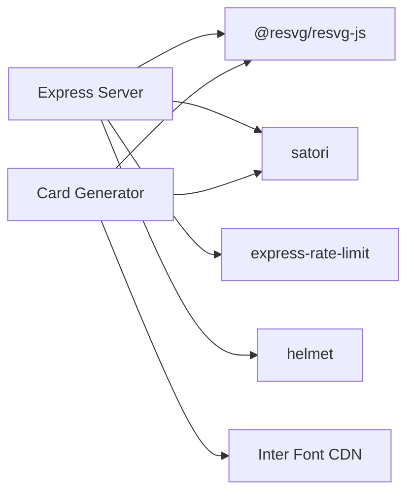

# Card Generation API

<cite>
**Referenced Files in This Document**
- [index.js](file://dissensus-engine/server/index.js)
- [card-generator.js](file://dissensus-engine/server/card-generator.js)
- [debate-engine.js](file://dissensus-engine/server/debate-engine.js)
- [app.js](file://dissensus-engine/public/js/app.js)
- [package.json](file://dissensus-engine/package.json)
- [README.md](file://dissensus-engine/README.md)
</cite>

## Table of Contents
1. [Introduction](#introduction)
2. [Project Structure](#project-structure)
3. [Core Components](#core-components)
4. [Architecture Overview](#architecture-overview)
5. [Detailed Component Analysis](#detailed-component-analysis)
6. [Dependency Analysis](#dependency-analysis)
7. [Performance Considerations](#performance-considerations)
8. [Troubleshooting Guide](#troubleshooting-guide)
9. [Conclusion](#conclusion)
10. [Appendices](#appendices)

## Introduction
This document provides comprehensive API documentation for the debate card generation system. It covers the shareable PNG generation endpoint (/api/card), including request/response schemas, image sizing constraints, server-side summarization, rate limiting, and client integration patterns for social media sharing.

## Project Structure
The card generation feature is implemented within the Dissensus AI debate engine server. The key files involved are:
- Server entry and routing: [index.js](file://dissensus-engine/server/index.js)
- Card generation logic: [card-generator.js](file://dissensus-engine/server/card-generator.js)
- AI provider configuration: [debate-engine.js](file://dissensus-engine/server/debate-engine.js)
- Client integration example: [app.js](file://dissensus-engine/public/js/app.js)
- Dependencies and runtime: [package.json](file://dissensus-engine/package.json)

**Diagram sources**
- [index.js:248-291](file://dissensus-engine/server/index.js#L248-L291)
- [card-generator.js:170-358](file://dissensus-engine/server/card-generator.js#L170-L358)

**Section sources**
- [index.js:16-356](file://dissensus-engine/server/index.js#L16-L356)
- [package.json:10-16](file://dissensus-engine/package.json#L10-L16)

## Core Components
- Endpoint: POST /api/card
- Request body: { topic, verdict }
- Response: image/png binary (PNG buffer)
- Image dimensions: 1200×630 pixels (Twitter/X optimized)
- Rate limiting: 20 requests per minute per IP
- Optional server-side summarization: when verdict length > 500 characters

**Section sources**
- [index.js:257-291](file://dissensus-engine/server/index.js#L257-L291)
- [card-generator.js:11-12](file://dissensus-engine/server/card-generator.js#L11-L12)
- [card-generator.js:41-85](file://dissensus-engine/server/card-generator.js#L41-L85)

## Architecture Overview
The card generation pipeline transforms a debate verdict into a shareable PNG image. The server validates inputs, optionally summarizes long verdicts using an AI provider, renders the card via Satori and Resvg, and returns a PNG buffer.

**Diagram sources**
- [index.js:257-291](file://dissensus-engine/server/index.js#L257-L291)
- [card-generator.js:41-85](file://dissensus-engine/server/card-generator.js#L41-L85)
- [card-generator.js:170-358](file://dissensus-engine/server/card-generator.js#L170-L358)

## Detailed Component Analysis

### Endpoint Definition: POST /api/card
- Method: POST
- Path: /api/card
- Rate limit: 20 requests per minute per IP
- Content-Type: application/json
- Request body:
  - topic: string (required, 1–200 chars)
  - verdict: string (optional but recommended)
- Response:
  - 200 OK with image/png body (PNG buffer)
  - 400 Bad Request on validation failure
  - 500 Internal Server Error on generation failure
- Headers:
  - Content-Type: image/png
  - Content-Disposition: attachment; filename="dissensus-debate-card.png"
  - Cache-Control: no-store

**Section sources**
- [index.js:248-291](file://dissensus-engine/server/index.js#L248-L291)

### Validation and Rate Limiting
- Topic length: 1–200 characters enforced
- Verdict length: >500 triggers server-side summarization
- Rate limiter window: 60 seconds, max 20 per IP
- Trust proxy: configurable via TRUST_PROXY and TRUST_PROXY_HOPS

**Section sources**
- [index.js:248-291](file://dissensus-engine/server/index.js#L248-L291)
- [index.js:24-27](file://dissensus-engine/server/index.js#L24-L27)

### Server-Side Summarization
When the incoming verdict exceeds 500 characters, the server attempts to shorten it using an available AI provider:
- Providers considered (in order): DeepSeek, OpenAI, Google Gemini
- Authentication: uses server-side API keys if configured
- Prompt: instructs to produce a concise answer with optional top picks list
- Output: short answer string suitable for card rendering

**Diagram sources**
- [card-generator.js:41-85](file://dissensus-engine/server/card-generator.js#L41-L85)

**Section sources**
- [card-generator.js:41-85](file://dissensus-engine/server/card-generator.js#L41-L85)

### Card Rendering Pipeline
- Dimensions: 1200×630 pixels (Twitter/X optimized)
- Rendering stack:
  - Satori: converts a React-like element tree to SVG
  - Resvg: rasterizes SVG to PNG with background fill
- Typography: Inter 400 (loaded remotely)
- Content extraction:
  - Summary: first substantive paragraph or overall assessment
  - List: top picks or ranked conclusions (up to 8 items)
  - Conviction: derived from verdict text
- Crypto topic detection: adds footer disclaimer when relevant

**Diagram sources**
- [card-generator.js:170-358](file://dissensus-engine/server/card-generator.js#L170-L358)

**Section sources**
- [card-generator.js:11-12](file://dissensus-engine/server/card-generator.js#L11-L12)
- [card-generator.js:170-358](file://dissensus-engine/server/card-generator.js#L170-L358)

### AI Provider Integration for Summarization
- Providers supported: DeepSeek, OpenAI, Google Gemini
- Authentication:
  - User-provided API key takes precedence
  - Server-side keys are used when available
- Model selection for summarization:
  - DeepSeek: deepseek-chat
  - OpenAI: gpt-4o-mini
  - Gemini: gemini-2.0-flash
- Request format: OpenAI-compatible chat completions

**Section sources**
- [index.js:104-110](file://dissensus-engine/server/index.js#L104-L110)
- [card-generator.js:46-50](file://dissensus-engine/server/card-generator.js#L46-L50)

### Client Integration Patterns
The frontend demonstrates a typical client flow:
- Collects the debate topic and final verdict
- Calls POST /api/card with { topic, verdict }
- Receives a PNG blob and triggers a download

**Diagram sources**
- [app.js:494-527](file://dissensus-engine/public/js/app.js#L494-L527)
- [index.js:257-291](file://dissensus-engine/server/index.js#L257-L291)

**Section sources**
- [app.js:494-527](file://dissensus-engine/public/js/app.js#L494-L527)

## Dependency Analysis
- Runtime dependencies:
  - @resvg/resvg-js: SVG to PNG conversion
  - satori: HTML-like JSX to SVG rendering
  - express-rate-limit: rate limiting
  - helmet: basic security headers
- External resources:
  - Inter font loaded from CDN
  - AI provider APIs for summarization

**Diagram sources**
- [package.json:10-16](file://dissensus-engine/package.json#L10-L16)
- [card-generator.js:7-8](file://dissensus-engine/server/card-generator.js#L7-L8)

**Section sources**
- [package.json:10-16](file://dissensus-engine/package.json#L10-L16)

## Performance Considerations
- Image generation cost:
  - CPU-bound rendering via Satori and Resvg
  - Remote font loading adds latency; consider caching strategies
- Rate limiting:
  - 20 requests/minute per IP to protect server resources
- Network:
  - Summarization calls to AI providers add latency and cost
- Recommendations:
  - Cache font assets locally or via CDN
  - Consider pre-generating popular cards and serving via CDN
  - Batch requests where feasible
  - Monitor provider quotas and costs

[No sources needed since this section provides general guidance]

## Troubleshooting Guide
Common issues and resolutions:
- 400 Bad Request
  - Cause: Missing or invalid topic (length limits)
  - Resolution: Ensure topic is 1–200 characters
- 500 Internal Server Error
  - Causes:
    - Summarization API failure
    - Rendering errors (font load, SVG generation)
  - Resolution: Retry later; check server logs; verify provider keys
- Rate limit exceeded
  - Symptom: Error message indicating too many requests
  - Resolution: Wait 1 minute; reduce client-side polling
- CORS or proxy issues
  - Symptom: ERR_ERL_UNEXPECTED_X_FORWARDED_FOR
  - Resolution: Configure TRUST_PROXY and TRUST_PROXY_HOPS appropriately

**Section sources**
- [index.js:248-291](file://dissensus-engine/server/index.js#L248-L291)
- [index.js:24-27](file://dissensus-engine/server/index.js#L24-L27)

## Conclusion
The /api/card endpoint provides a fast, reliable way to generate shareable PNG cards from debate verdicts. It enforces strict input validation, offers optional server-side summarization, and produces Twitter/X-optimized images. Proper rate limiting and security headers protect the service, while client integrations can leverage the provided frontend example for seamless social media sharing.

[No sources needed since this section summarizes without analyzing specific files]

## Appendices

### API Reference: POST /api/card
- Request body:
  - topic: string (1–200 chars)
  - verdict: string (optional; >500 chars triggers summarization)
- Response:
  - 200 image/png (PNG buffer)
  - 400 Bad Request (validation errors)
  - 500 Internal Server Error (generation errors)
- Headers:
  - Content-Type: image/png
  - Content-Disposition: attachment; filename="dissensus-debate-card.png"
  - Cache-Control: no-store

**Section sources**
- [index.js:257-291](file://dissensus-engine/server/index.js#L257-L291)

### Image Specifications
- Dimensions: 1200×630 pixels
- Background: solid dark (#0a0a0f)
- Typography: Inter 400 (remote CDN)
- Disclaimer: Added for crypto-related topics

**Section sources**
- [card-generator.js:11-12](file://dissensus-engine/server/card-generator.js#L11-L12)
- [card-generator.js:154-168](file://dissensus-engine/server/card-generator.js#L154-L168)

### Rate Limiting Policies
- Window: 60 seconds
- Max: 20 requests per IP
- Standard headers enabled
- Trust proxy configurable via environment variables

**Section sources**
- [index.js:248-255](file://dissensus-engine/server/index.js#L248-L255)
- [index.js:24-27](file://dissensus-engine/server/index.js#L24-L27)

### Client Integration Example
- Frontend flow:
  - Collect topic and verdict
  - POST to /api/card
  - Receive PNG blob and trigger download

**Section sources**
- [app.js:494-527](file://dissensus-engine/public/js/app.js#L494-L527)