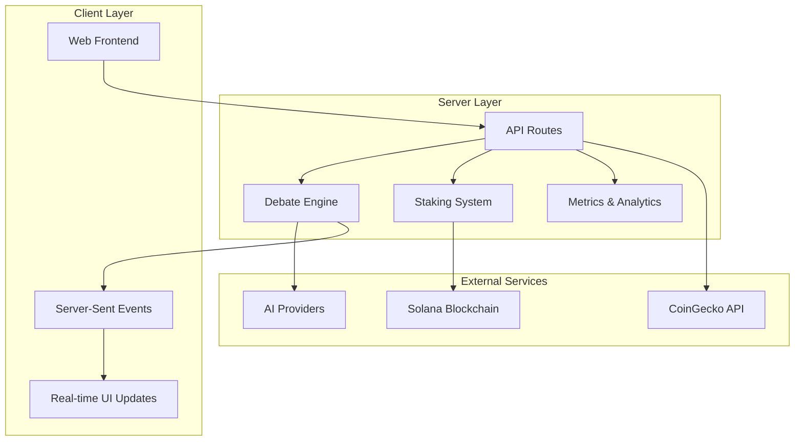
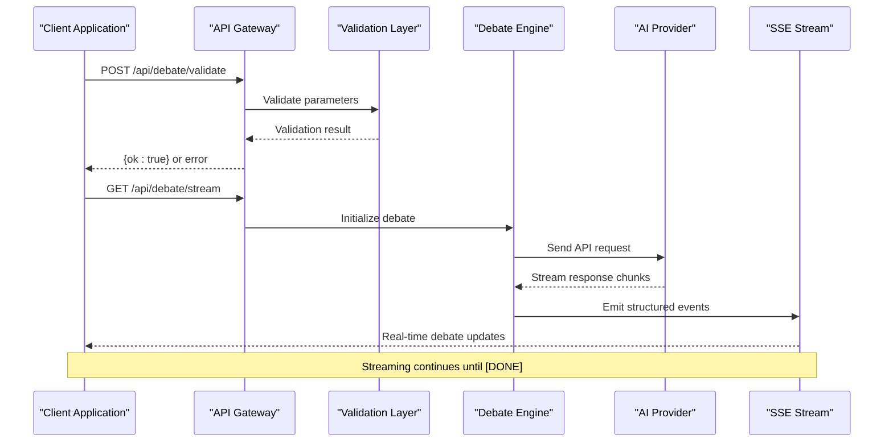
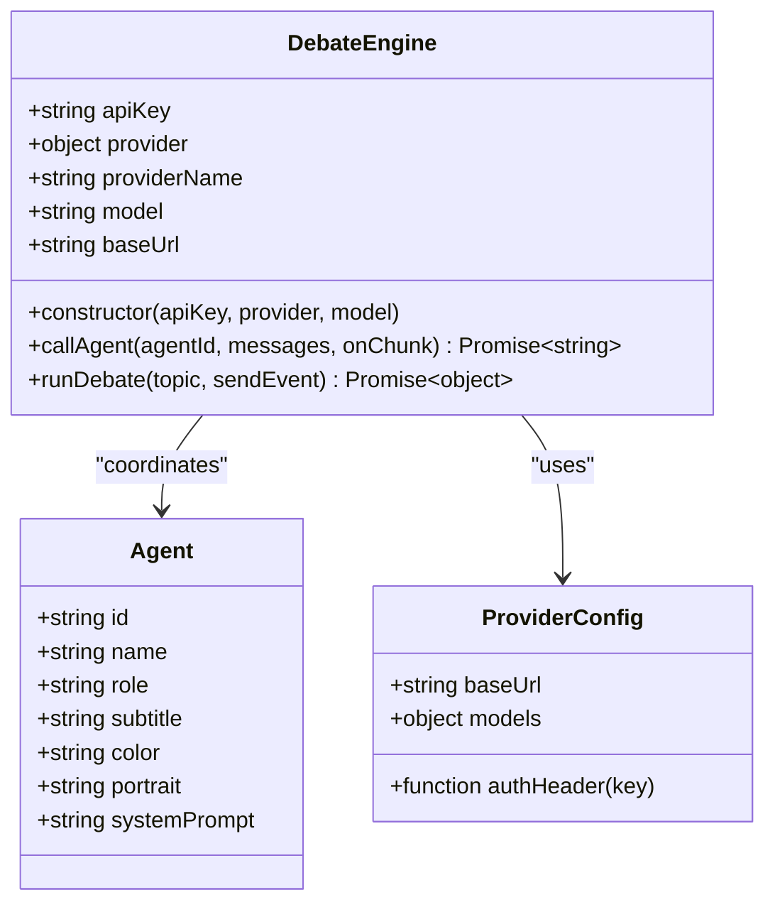
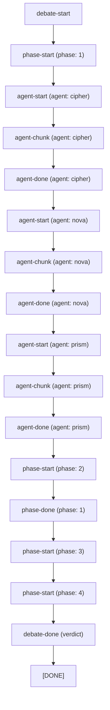
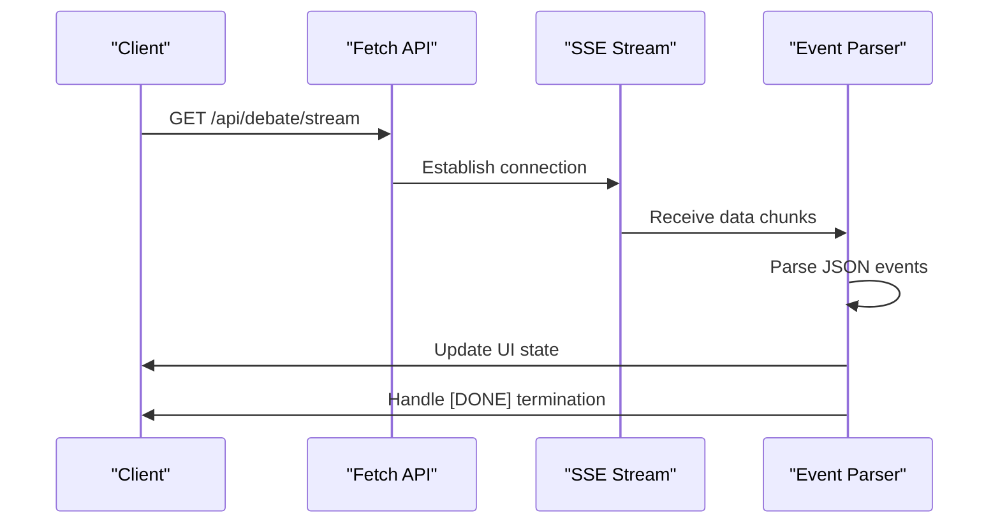

# Debate API

<cite>
**Referenced Files in This Document**
- [index.js](file://dissensus-engine/server/index.js)
- [debate-engine.js](file://dissensus-engine/server/debate-engine.js)
- [staking.js](file://dissensus-engine/server/staking.js)
- [metrics.js](file://dissensus-engine/server/metrics.js)
- [agents.js](file://dissensus-engine/server/agents.js)
- [app.js](file://dissensus-engine/public/js/app.js)
- [nginx-dissensus.conf](file://dissensus-engine/docs/configs/nginx-dissensus.conf)
</cite>

## Table of Contents
1. [Introduction](#introduction)
2. [Project Structure](#project-structure)
3. [Core Components](#core-components)
4. [Architecture Overview](#architecture-overview)
5. [Detailed Component Analysis](#detailed-component-analysis)
6. [API Reference](#api-reference)
7. [Rate Limiting and Policies](#rate-limiting-and-policies)
8. [Input Validation Rules](#input-validation-rules)
9. [Streaming Implementation](#streaming-implementation)
10. [Error Handling](#error-handling)
11. [Integration Patterns](#integration-patterns)
12. [Performance Considerations](#performance-considerations)
13. [Troubleshooting Guide](#troubleshooting-guide)
14. [Conclusion](#conclusion)

## Introduction

The Dissensus AI Debate API provides a sophisticated real-time debate system that simulates structured discussions between three AI agents (CIPHER, NOVA, and PRISM) on any given topic. The system supports multiple AI providers (OpenAI, DeepSeek, Google Gemini) and delivers content through Server-Sent Events (SSE) for seamless real-time streaming.

The debate system follows a four-phase dialectical process: Independent Analysis, Opening Arguments, Cross-Examination, and Final Verdict. Each phase produces structured content that culminates in a comprehensive synthesis delivered by the PRISM agent.

## Project Structure

The debate system is built as a Node.js Express application with the following key components:



**Diagram sources**
- [index.js:1-481](file://dissensus-engine/server/index.js#L1-L481)
- [debate-engine.js:1-389](file://dissensus-engine/server/debate-engine.js#L1-L389)

**Section sources**
- [index.js:1-481](file://dissensus-engine/server/index.js#L1-L481)
- [debate-engine.js:1-389](file://dissensus-engine/server/debate-engine.js#L1-L389)

## Core Components

### Debate Engine
The core debate orchestration system that coordinates the four-phase debate process between three specialized AI agents.

### Provider Configuration
Supports multiple AI providers with their respective API endpoints, authentication methods, and model specifications.

### Staking System
Simulated staking system that enforces usage limits and provides tier-based access control.

### Real-time Streaming
Server-Sent Events implementation that streams debate progress in real-time to clients.

**Section sources**
- [debate-engine.js:41-389](file://dissensus-engine/server/debate-engine.js#L41-L389)
- [index.js:14-85](file://dissensus-engine/server/index.js#L14-L85)
- [staking.js:9-183](file://dissensus-engine/server/staking.js#L9-L183)

## Architecture Overview

The debate system follows a layered architecture with clear separation of concerns:



**Diagram sources**
- [index.js:177-311](file://dissensus-engine/server/index.js#L177-L311)
- [debate-engine.js:121-386](file://dissensus-engine/server/debate-engine.js#L121-L386)

## Detailed Component Analysis

### Debate Engine Implementation

The DebateEngine class orchestrates the complete debate lifecycle through four distinct phases:



**Diagram sources**
- [debate-engine.js:41-53](file://dissensus-engine/server/debate-engine.js#L41-L53)
- [agents.js:8-148](file://dissensus-engine/server/agents.js#L8-L148)

### Four-Phase Debate Process

The system implements a structured dialectical process:

1. **Phase 1: Independent Analysis** - Each agent analyzes the topic privately
2. **Phase 2: Opening Arguments** - Formal positions presented
3. **Phase 3: Cross-Examination** - Agents challenge each other's arguments
4. **Phase 4: Final Verdict** - PRISM delivers synthesized conclusion

**Section sources**
- [debate-engine.js:121-386](file://dissensus-engine/server/debate-engine.js#L121-L386)
- [agents.js:8-148](file://dissensus-engine/server/agents.js#L8-L148)

## API Reference

### Debate Validation Endpoint

**Endpoint**: `POST /api/debate/validate`

**Purpose**: Pre-flight validation to check debate parameters before initiating streaming.

**Request Body**:
```javascript
{
  "topic": "string",           // Required - Debate topic
  "apiKey": "string",          // Optional - User's API key
  "provider": "string",        // Optional - Provider name
  "model": "string",           // Optional - Model identifier
  "wallet": "string"           // Optional - Wallet address for staking
}
```

**Response**:
- Success: `{ "ok": true }`
- Validation Error: `{ "error": "validation message" }`
- Authentication Error: `{ "error": "authentication message" }`

**Section sources**
- [index.js:177-215](file://dissensus-engine/server/index.js#L177-L215)

### Debate Streaming Endpoint

**Endpoint**: `GET /api/debate/stream`

**Purpose**: Initiates real-time debate streaming with structured events.

**Query Parameters**:
- `topic` (required): Debate topic string
- `provider` (optional): AI provider name
- `model` (optional): Model identifier
- `apiKey` (optional): User's API key
- `wallet` (optional): Wallet address for staking

**Response**: Server-Sent Events stream with structured JSON messages.

**Section sources**
- [index.js:220-311](file://dissensus-engine/server/index.js#L220-L311)

## Rate Limiting and Policies

### Debate Rate Limits
- **Production**: 10 debates per minute per IP
- **Development**: 100 debates per minute per IP
- **Error Response**: `{ "error": "Too many debates. Please wait a minute and try again." }`

### Provider-Specific Rate Limits
- **Solana Balance**: 60 requests per minute
- **Staking Operations**: 60-200 requests per minute (varies by endpoint)
- **Metrics Access**: 120-300 requests per minute

### Staking Enforcement
When `STAKING_ENFORCE=true` is configured:
- Wallet address becomes mandatory for all debates
- Daily debate limits enforced based on staking tiers
- Wallet validation performed against Solana address format

**Section sources**
- [index.js:58-64](file://dissensus-engine/server/index.js#L58-L64)
- [index.js:90-96](file://dissensus-engine/server/index.js#L90-L96)
- [index.js:316-322](file://dissensus-engine/server/index.js#L316-L322)
- [index.js:421-427](file://dissensus-engine/server/index.js#L421-L427)

## Input Validation Rules

### Topic Validation
- **Required**: Non-empty string
- **Minimum Length**: 3 characters
- **Maximum Length**: 500 characters
- **Allowed Characters**: All Unicode characters
- **Trimming**: Automatic whitespace removal

### Provider Validation
- **Supported Providers**: `openai`, `deepseek`, `gemini`
- **Default Provider**: `deepseek`
- **Provider Detection**: Case-insensitive with fallback logic

### Model Validation
- **Model Selection Priority**: Explicit model > Provider default > Fallback
- **Provider Defaults**: 
  - DeepSeek: `deepseek-chat`
  - Gemini: `gemini-2.0-flash`
  - OpenAI: `gpt-4o`

### API Key Resolution
- **Priority Order**: User-provided key > Server-side key > Error
- **Server Keys**: Environment variables (`OPENAI_API_KEY`, `DEEPSEEK_API_KEY`, `GOOGLE_API_KEY`)
- **Key Validation**: Required for all provider configurations

### Wallet Validation
- **Format Validation**: 32-48 character Solana address
- **Normalization**: Trimming and validation
- **Staking Integration**: Optional but required when staking enforcement is enabled

**Section sources**
- [index.js:177-215](file://dissensus-engine/server/index.js#L177-L215)
- [index.js:220-267](file://dissensus-engine/server/index.js#L220-L267)
- [index.js:157-172](file://dissensus-engine/server/index.js#L157-L172)

## Streaming Implementation

### SSE Event Types

The debate system emits structured events with the following types:



**Diagram sources**
- [debate-engine.js:130-132](file://dissensus-engine/server/debate-engine.js#L130-L132)

### Event Structure

Each SSE event follows this JSON structure:
```javascript
{
  "type": "event-type",
  "phase": 1,                    // For phase-related events
  "agent": "cipher",             // For agent-specific events
  "chunk": "text content",       // For streaming content
  "topic": "debate topic",       // For debate metadata
  "provider": "openai",          // For provider info
  "model": "gpt-4o",             // For model info
  "message": "error message"     // For error events
}
```

### Client Implementation Pattern

The frontend demonstrates proper SSE handling:



**Diagram sources**
- [app.js:294-347](file://dissensus-engine/public/js/app.js#L294-L347)

**Section sources**
- [debate-engine.js:130-386](file://dissensus-engine/server/debate-engine.js#L130-L386)
- [app.js:358-427](file://dissensus-engine/public/js/app.js#L358-L427)

## Error Handling

### Validation Errors
- **Missing Topic**: `"Missing topic"`
- **Topic Too Short**: `"Topic must be at least 3 characters"`
- **Topic Too Long**: `"Topic must be 500 characters or less"`
- **Invalid Provider**: `"Unknown provider: {provider}"`
- **Invalid Model**: `"Invalid model "{model}" for {provider}"`
- **Missing API Key**: `"API key required. Set {PROVIDER}_API_KEY in .env"`

### Runtime Errors
- **Provider API Errors**: Propagated with provider context
- **Network Issues**: Connection timeouts and retry logic
- **Client Disconnection**: Graceful cleanup and resource release

### Rate Limiting Errors
- **Response**: `{ "error": "Too many debates. Please wait a minute and try again." }`
- **HTTP Status**: 429 Too Many Requests
- **Headers**: Standard rate limit headers included

**Section sources**
- [index.js:194-212](file://dissensus-engine/server/index.js#L194-L212)
- [index.js:303-310](file://dissensus-engine/server/index.js#L303-L310)

## Integration Patterns

### Client-Side Integration

The frontend demonstrates several integration patterns:

1. **Preflight Validation**: Always validate before starting debate
2. **SSE Connection Management**: Proper connection lifecycle handling
3. **Error Recovery**: Graceful error handling and user feedback
4. **State Management**: Real-time UI updates synchronized with events

### Server Configuration Requirements

For production deployment, proper reverse proxy configuration is essential:

```nginx
location /api/debate/stream {
    proxy_pass http://127.0.0.1:3000;
    proxy_http_version 1.1;
    proxy_set_header Host $host;
    proxy_set_header X-Real-IP $remote_addr;
    proxy_set_header X-Forwarded-For $proxy_add_x_forwarded_for;
    proxy_set_header X-Forwarded-Proto $scheme;
    proxy_set_header Connection '';
    
    # CRITICAL for SSE streaming
    proxy_buffering off;
    proxy_cache off;
    chunked_transfer_encoding off;
    
    proxy_read_timeout 600s;
    proxy_send_timeout 600s;
}
```

**Section sources**
- [app.js:209-356](file://dissensus-engine/public/js/app.js#L209-L356)
- [nginx-dissensus.conf:42-60](file://dissensus-engine/docs/configs/nginx-dissensus.conf#L42-L60)

## Performance Considerations

### Streaming Optimization
- **No Buffering**: Proxy configuration disables all buffering for SSE
- **Long Timeout**: 600-second timeout for extended debates
- **Chunked Transfer**: Maintains continuous data flow

### Resource Management
- **Memory Efficiency**: Streaming architecture prevents memory accumulation
- **Connection Limits**: Proper cleanup on client disconnect
- **Provider Throttling**: Respect upstream API rate limits

### Scalability Factors
- **Horizontal Scaling**: Stateless architecture supports multiple instances
- **Load Balancing**: SSE connections should be sticky for optimal performance
- **Caching**: Provider configuration and static assets cached appropriately

## Troubleshooting Guide

### Common Issues and Solutions

**Connection Problems**
- Verify reverse proxy configuration has `proxy_buffering off`
- Check network connectivity to AI provider APIs
- Ensure firewall allows outbound connections

**Rate Limiting Issues**
- Monitor rate limit headers in responses
- Implement exponential backoff for retries
- Consider server-side API key usage to reduce quotas

**Streaming Issues**
- Verify client handles SSE connection properly
- Check browser support for Server-Sent Events
- Ensure network doesn't terminate idle connections

**Debugging Techniques**
- Enable detailed logging in development mode
- Monitor SSE event flow in browser developer tools
- Check server logs for error patterns
- Validate API keys and provider configuration

### Monitoring and Metrics

The system provides comprehensive metrics for monitoring:

- **Debate Statistics**: Total debates, daily counts, provider usage
- **Error Tracking**: Request success/failure rates
- **Staking Metrics**: Tier distribution and usage patterns
- **Real-time Dashboard**: Live metrics for operational visibility

**Section sources**
- [metrics.js:100-132](file://dissensus-engine/server/metrics.js#L100-L132)
- [nginx-dissensus.conf:326-344](file://dissensus-engine/docs/configs/nginx-dissensus.conf#L326-L344)

## Conclusion

The Dissensus AI Debate API provides a robust, scalable solution for real-time structured debate generation. Its modular architecture, comprehensive validation system, and efficient streaming implementation make it suitable for production deployment while maintaining excellent developer experience.

Key strengths include:
- **Real-time Streaming**: Seamless SSE implementation for immediate feedback
- **Multi-provider Support**: Flexible integration with major AI providers
- **Structured Output**: Predictable event-driven interface for reliable client integration
- **Production Ready**: Comprehensive error handling, rate limiting, and monitoring
- **Extensible Design**: Modular components support easy customization and enhancement

The system successfully balances performance, reliability, and developer usability while providing a compelling foundation for AI-powered debate applications.