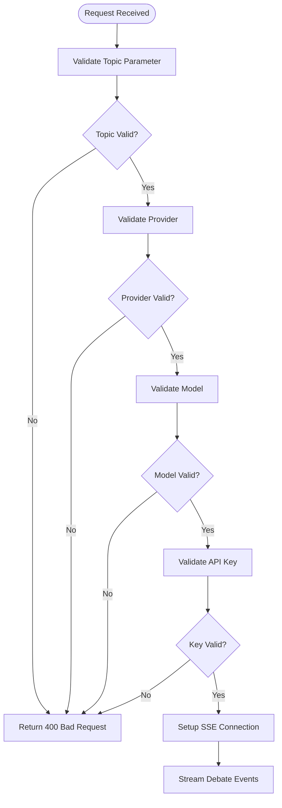
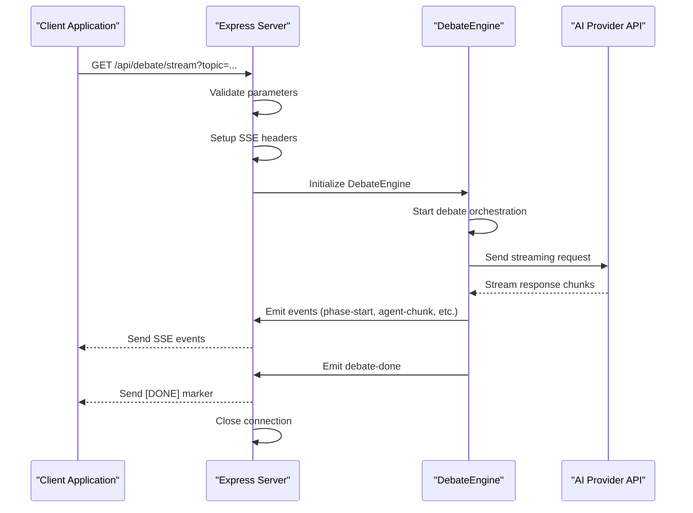
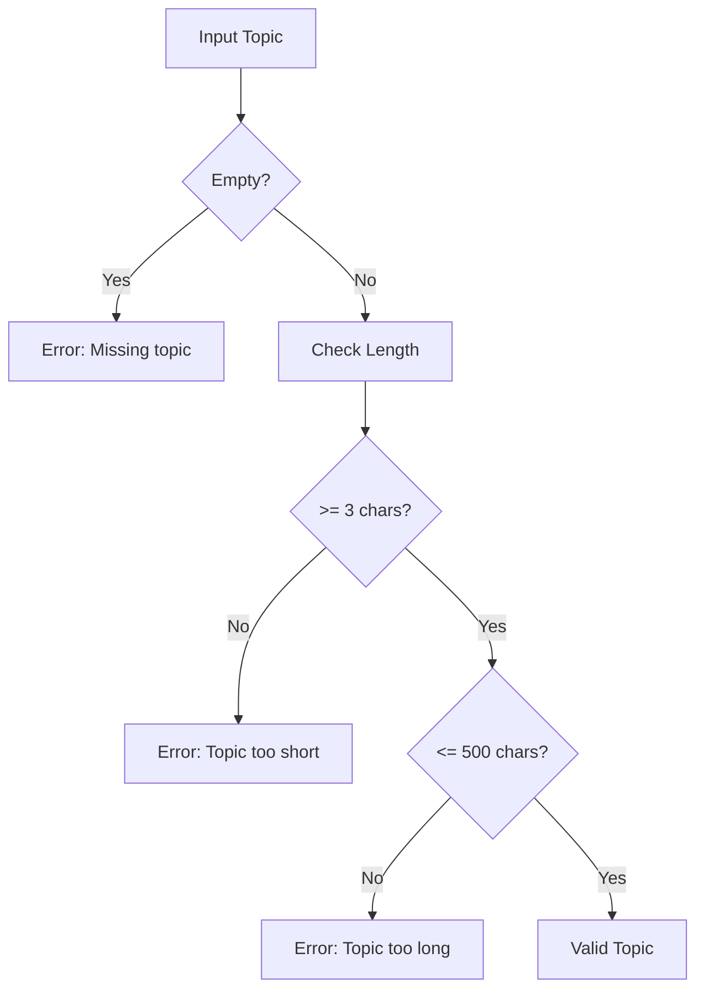
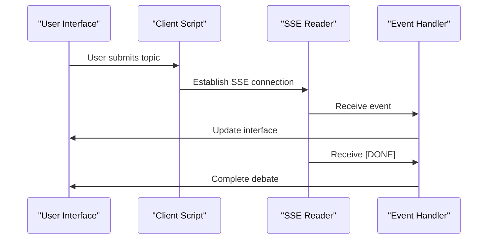
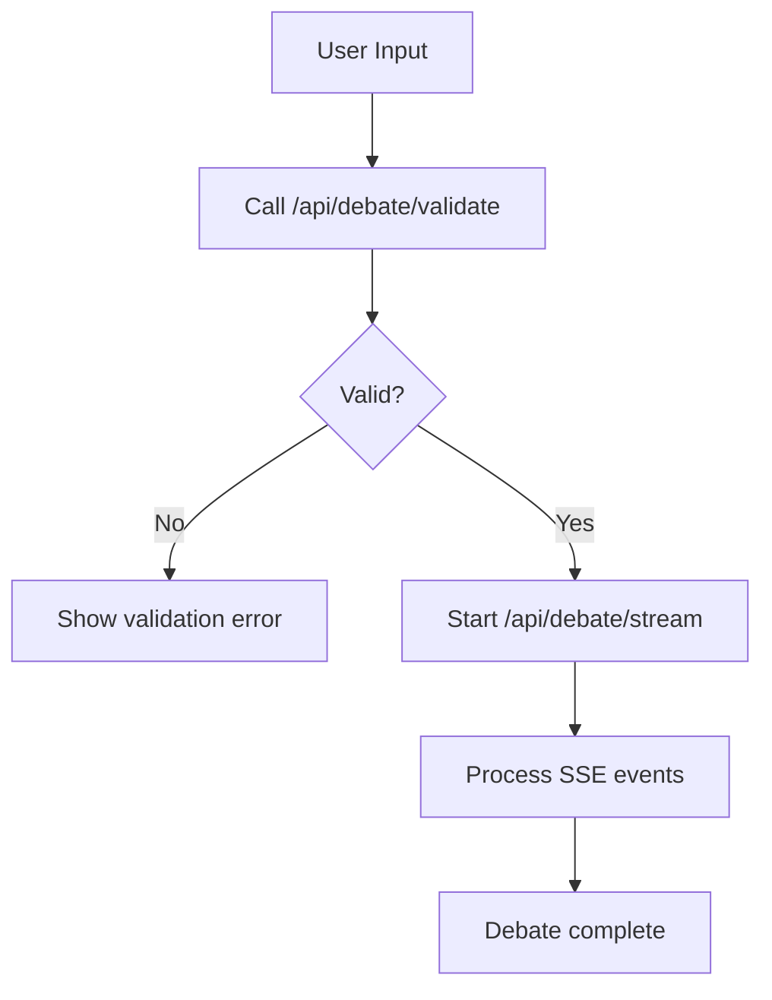
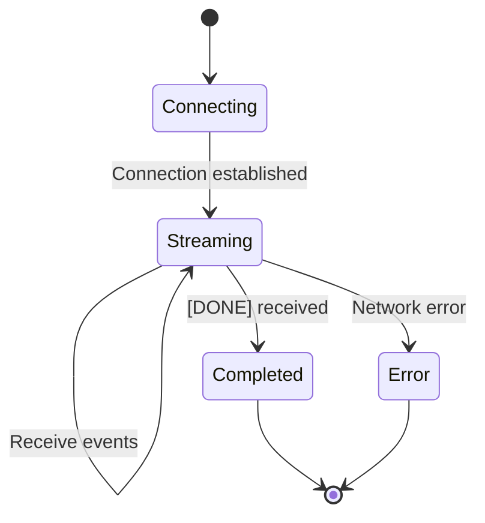
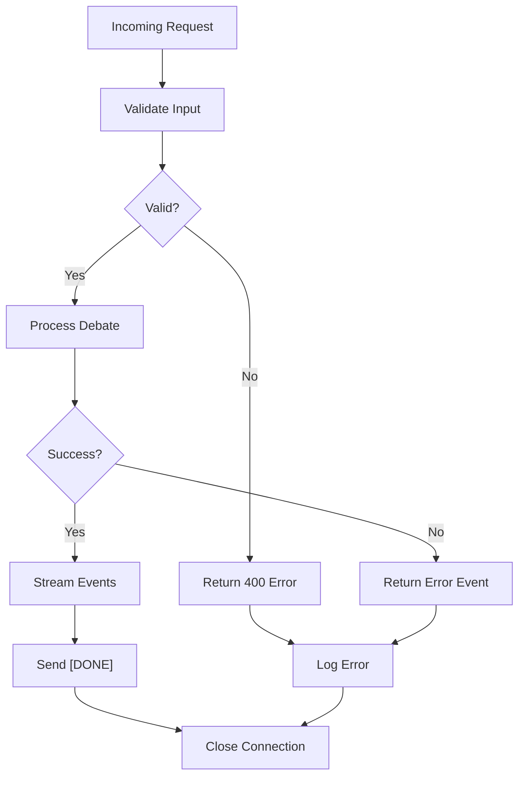

# Debate Streaming Endpoint

<cite>
**Referenced Files in This Document**
- [index.js](file://dissensus-engine/server/index.js)
- [debate-engine.js](file://dissensus-engine/server/debate-engine.js)
- [app.js](file://dissensus-engine/public/js/app.js)
- [test-api.html](file://dissensus-engine/public/test-api.html)
- [dissensus-nginx-ssl.conf](file://dissensus-engine/docs/configs/dissensus-nginx-ssl.conf)
- [DEPLOY-VPS.md](file://dissensus-engine/docs/DEPLOY-VPS.md)
- [QUICK-REFERENCE.md](file://dissensus-engine/docs/QUICK-REFERENCE.md)
</cite>

## Table of Contents
1. [Introduction](#introduction)
2. [Endpoint Specification](#endpoint-specification)
3. [Request Parameters](#request-parameters)
4. [Server-Sent Events Implementation](#server-sent-events-implementation)
5. [Streaming Event Format](#streaming-event-format)
6. [Event Types and Payloads](#event-types-and-payloads)
7. [Rate Limiting Policies](#rate-limiting-policies)
8. [Input Validation Rules](#input-validation-rules)
9. [Integration Patterns](#integration-patterns)
10. [Client Implementation Examples](#client-implementation-examples)
11. [Performance Considerations](#performance-considerations)
12. [Connection Management](#connection-management)
13. [Error Handling](#error-handling)
14. [Debugging Techniques](#debugging-techniques)
15. [Conclusion](#conclusion)

## Introduction

The Dissensus AI Debate Streaming Endpoint provides real-time, multi-agent debate streaming through Server-Sent Events (SSE). This endpoint orchestrates a structured 4-phase dialectical process between three AI agents (Cipher, Nova, and Prism) to analyze any given topic and deliver a comprehensive verdict.

The system supports multiple AI providers including OpenAI, DeepSeek, and Google Gemini, with configurable models and streaming capabilities that deliver content incrementally as it's generated.

## Endpoint Specification

**Endpoint**: `GET /api/debate/stream`

**Method**: GET (with SSE streaming)

**Response Type**: Server-Sent Events (text/event-stream)

**Default Provider**: DeepSeek (default model: `deepseek-chat`)

**Default Model**: Depends on provider:
- DeepSeek: `deepseek-chat`
- Gemini: `gemini-2.0-flash`
- OpenAI: `gpt-4o`

## Request Parameters

### Required Parameters

| Parameter | Type | Description | Default Value |
|-----------|------|-------------|---------------|
| `topic` | string | The debate topic to analyze | None (required) |

### Optional Parameters

| Parameter | Type | Description | Default Value |
|-----------|------|-------------|---------------|
| `apiKey` | string | User's API key (optional) | Uses server-side key if configured |
| `provider` | string | AI provider name | `deepseek` |
| `model` | string | Specific model identifier | Provider-dependent |

### Parameter Validation Rules

The endpoint enforces strict validation for all parameters:



**Diagram sources**
- [index.js:156-230](file://dissensus-engine/server/index.js#L156-L230)

**Section sources**
- [index.js:156-230](file://dissensus-engine/server/index.js#L156-L230)

## Server-Sent Events Implementation

The debate streaming uses native Fetch API with manual SSE parsing for better error handling compared to traditional EventSource:



**Diagram sources**
- [index.js:156-230](file://dissensus-engine/server/index.js#L156-L230)
- [debate-engine.js:121-386](file://dissensus-engine/server/debate-engine.js#L121-L386)

**Section sources**
- [index.js:192-230](file://dissensus-engine/server/index.js#L192-L230)
- [debate-engine.js:58-116](file://dissensus-engine/server/debate-engine.js#L58-L116)

## Streaming Event Format

All events follow the SSE format with JSON-encoded data payloads:

```
data: {"type": "event-type", "payload": {...}}\n\n
```

### Event Structure

| Field | Type | Description |
|-------|------|-------------|
| `type` | string | Event type identifier |
| `payload` | object | Event-specific data payload |

### SSE Headers

The server sets the following headers for proper SSE operation:

- `Content-Type: text/event-stream`
- `Cache-Control: no-cache`
- `Connection: keep-alive`
- `X-Accel-Buffering: no`

**Section sources**
- [index.js:192-206](file://dissensus-engine/server/index.js#L192-L206)

## Event Types and Payloads

### 1. Initial Connection Events

#### `debate-start`
**Purpose**: Signals the beginning of a new debate session

**Payload Fields**:
- `topic`: string - The debate topic
- `provider`: string - Selected AI provider
- `model`: string - Selected model identifier

#### `phase-start`
**Purpose**: Indicates the start of a new debate phase

**Payload Fields**:
- `phase`: integer - Phase number (1-4)
- `title`: string - Phase title
- `description`: string - Phase description

#### `phase-done`
**Purpose**: Signals completion of a debate phase

**Payload Fields**:
- `phase`: integer - Completed phase number

### 2. Agent Interaction Events

#### `agent-start`
**Purpose**: Agent begins generating content

**Payload Fields**:
- `phase`: integer - Current phase
- `agent`: string - Agent identifier (`cipher`, `nova`, or `prism`)

#### `agent-chunk`
**Purpose**: Contains incremental content from an agent

**Payload Fields**:
- `phase`: integer - Current phase
- `agent`: string - Agent identifier
- `chunk`: string - Text chunk generated

#### `agent-done`
**Purpose**: Agent has finished generating content

**Payload Fields**:
- `phase`: integer - Current phase
- `agent`: string - Agent identifier

### 3. Final Events

#### `debate-done`
**Purpose**: Debate session has completed successfully

**Payload Fields**:
- `topic`: string - Original debate topic
- `verdict`: string - Final synthesized verdict

#### `error`
**Purpose**: An error occurred during debate processing

**Payload Fields**:
- `message`: string - Error description

**Section sources**
- [debate-engine.js:134-383](file://dissensus-engine/server/debate-engine.js#L134-L383)

## Rate Limiting Policies

### Global Rate Limits

The debate endpoint implements rate limiting to prevent abuse:

| Environment | Limit | Window |
|-------------|-------|--------|
| Production | 10 debates per minute | 60 seconds |
| Development | 100 debates per minute | 60 seconds |

### Rate Limit Response

When the rate limit is exceeded:
- Status: 429 Too Many Requests
- Body: `{ "error": "Too many debates. Please wait a minute and try again." }`

### Additional Rate Limits

The system includes separate rate limits for other endpoints:
- `/api/card`: 20 requests per minute
- `/api/metrics`: 120 requests per minute

**Section sources**
- [index.js:46-53](file://dissensus-engine/server/index.js#L46-L53)
- [index.js:249-255](file://dissensus-engine/server/index.js#L249-L255)
- [index.js:296-302](file://dissensus-engine/server/index.js#L296-L302)

## Input Validation Rules

### Topic Validation

The system enforces strict topic validation:



**Diagram sources**
- [index.js:159-173](file://dissensus-engine/server/index.js#L159-L173)

### Provider and Model Validation

- **Providers**: `openai`, `deepseek`, `gemini`
- **Models**: Provider-specific model identifiers
- **Validation**: Checks against configured provider registry

### API Key Validation

- **Priority**: User-provided API key takes precedence
- **Fallback**: Server-side configured key if available
- **Requirement**: At least one valid key must be present

**Section sources**
- [index.js:159-190](file://dissensus-engine/server/index.js#L159-L190)
- [debate-engine.js:14-39](file://dissensus-engine/server/debate-engine.js#L14-L39)

## Integration Patterns

### Frontend Integration

The client-side implementation demonstrates proper SSE handling:



**Diagram sources**
- [app.js:280-412](file://dissensus-engine/public/js/app.js#L280-L412)

### Validation Workflow



**Diagram sources**
- [index.js:124-151](file://dissensus-engine/server/index.js#L124-L151)

**Section sources**
- [app.js:280-412](file://dissensus-engine/public/js/app.js#L280-L412)
- [test-api.html:9-48](file://dissensus-engine/public/test-api.html#L9-L48)

## Client Implementation Examples

### JavaScript Implementation (Fetch-based)

The official client implementation uses Fetch API with manual SSE parsing:

```javascript
// Basic implementation outline
const params = new URLSearchParams({ topic, provider, model });
if (apiKey) params.set('apiKey', apiKey);
const streamUrl = `/api/debate/stream?${params.toString()}`;

try {
    const res = await fetch(streamUrl, { signal: controller.signal });
    if (!res.ok) {
        const errBody = await res.json().catch(() => ({}));
        throw new Error(errBody.error || `Server error (${res.status})`);
    }
    
    const reader = res.body.getReader();
    const decoder = new TextDecoder();
    let buffer = '';
    
    while (true) {
        const { done, value } = await reader.read();
        if (done) break;
        
        buffer += decoder.decode(value, { stream: true });
        const lines = buffer.split('\n\n');
        buffer = lines.pop() || '';
        
        for (const block of lines) {
            if (block.startsWith('data: ')) {
                const data = block.replace(/^data: /, '').trim();
                if (data === '[DONE]') {
                    // Handle completion
                    break;
                }
                
                try {
                    const parsed = JSON.parse(data);
                    handleDebateEvent(parsed);
                } catch (e) {
                    // Handle malformed events
                }
            }
        }
    }
} catch (e) {
    // Handle errors (network, rate limit, etc.)
}
```

### Event Handling Pattern

```javascript
function handleDebateEvent(data) {
    switch (data.type) {
        case 'phase-start':
            // Update UI for new phase
            break;
        case 'agent-chunk':
            // Append text to agent's content area
            break;
        case 'agent-done':
            // Remove typing indicators
            break;
        case 'debate-done':
            // Display final verdict
            break;
        case 'error':
            // Show error message
            break;
    }
}
```

**Section sources**
- [app.js:280-412](file://dissensus-engine/public/js/app.js#L280-L412)

## Performance Considerations

### Streaming Architecture

The system is designed for optimal streaming performance:

- **No Buffering**: Nginx configuration disables all buffering for SSE endpoints
- **Long Timeouts**: 600-second read/write timeouts accommodate lengthy debates
- **Chunked Transfer**: Maintains continuous data flow without interruption

### Provider-Specific Optimizations

| Provider | Base URL | Streaming Support | Authentication |
|----------|----------|-------------------|----------------|
| OpenAI | `api.openai.com` | Native SSE | Bearer Token |
| DeepSeek | `api.deepseek.com` | Native SSE | Bearer Token |
| Gemini | `generativelanguage.googleapis.com` | OpenAI-compatible | Bearer Token |

### Cost Considerations

| Provider | Model | Estimated Cost per Debate |
|----------|-------|---------------------------|
| DeepSeek | V3.2 | ~$0.008 |
| Gemini | 2.0 Flash | ~$0.006 |
| Gemini | 2.5 Flash | ~$0.03 |
| OpenAI | GPT-4o-mini | ~$0.02 |
| OpenAI | GPT-4o | ~$0.15 |

**Section sources**
- [debate-engine.js:14-39](file://dissensus-engine/server/debate-engine.js#L14-L39)
- [QUICK-REFERENCE.md:170-178](file://dissensus-engine/docs/QUICK-REFERENCE.md#L170-L178)

## Connection Management

### Connection Lifecycle



### Timeout Management

- **Client Timeout**: 5-minute automatic abort
- **Server Timeout**: 600-second Nginx timeouts
- **Graceful Cleanup**: Proper resource cleanup on disconnect

### Connection Headers

The SSE implementation sets critical headers for proper streaming:

- `Content-Type: text/event-stream`
- `Cache-Control: no-cache`
- `Connection: keep-alive`
- `X-Accel-Buffering: no`

**Section sources**
- [index.js:192-206](file://dissensus-engine/server/index.js#L192-L206)
- [app.js:288-290](file://dissensus-engine/public/js/app.js#L288-L290)

## Error Handling

### Server-Side Error Handling

The server implements comprehensive error handling:



### Client-Side Error Handling

Common error scenarios and handling:

| Error Type | Detection | Handling |
|------------|-----------|----------|
| Network Failure | `AbortError` | Show retry prompt |
| Rate Limit | 429 status | Wait and retry |
| Invalid Topic | 400 status | Show validation error |
| API Key Error | Provider error | Prompt for key |
| Server Error | 5xx status | Show generic error |

**Section sources**
- [index.js:222-229](file://dissensus-engine/server/index.js#L222-L229)
- [app.js:325-332](file://dissensus-engine/public/js/app.js#L325-L332)

## Debugging Techniques

### Local Testing

Use the built-in test page for debugging:

```bash
# Test configuration endpoint
curl http://localhost:3000/api/config

# Test validation endpoint
curl -X POST http://localhost:3000/api/debate/validate \
  -H "Content-Type: application/json" \
  -d '{"topic":"Bitcoin","provider":"deepseek","model":"deepseek-chat"}'

# Test streaming endpoint
curl "http://localhost:3000/api/debate/stream?topic=Bitcoin&provider=deepseek&model=deepseek-chat" | head -10
```

### Monitoring Tools

- **Nginx Logs**: Monitor SSE connection handling
- **Systemd Logs**: Track application health
- **Browser DevTools**: Inspect SSE events and network activity
- **Application Metrics**: Monitor debate completion rates

### Common Issues and Solutions

| Issue | Symptoms | Solution |
|-------|----------|----------|
| No events received | Empty response | Check Nginx SSE configuration |
| Frequent timeouts | Connection drops | Verify proxy_buffering off |
| Rate limit errors | 429 responses | Wait for minute window |
| Invalid provider | Model validation errors | Use supported provider names |

**Section sources**
- [QUICK-REFERENCE.md:75-95](file://dissensus-engine/docs/QUICK-REFERENCE.md#L75-L95)
- [DEPLOY-VPS.md:326-344](file://dissensus-engine/docs/DEPLOY-VPS.md#L326-L344)

## Conclusion

The Dissensus AI Debate Streaming Endpoint provides a robust, production-ready solution for real-time multi-agent debate streaming. With comprehensive validation, rate limiting, and flexible client integration patterns, it offers developers a reliable foundation for building AI-powered debate applications.

Key strengths include:
- **Production-Ready**: Battle-tested in VPS environments with proper SSE configuration
- **Flexible Providers**: Support for multiple AI providers with streaming capabilities  
- **Comprehensive Validation**: Strict input validation prevents abuse and ensures quality
- **Robust Error Handling**: Clear error signaling and graceful degradation
- **Performance Optimized**: Long timeouts and no buffering for smooth streaming

The implementation demonstrates best practices for SSE-based real-time APIs and provides a solid foundation for extending debate functionality or integrating with other systems.