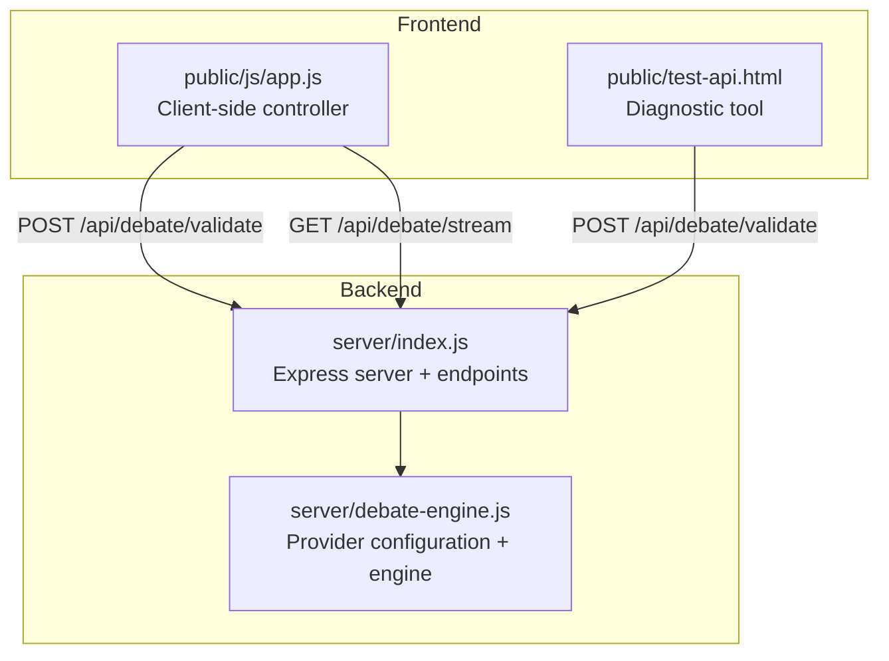
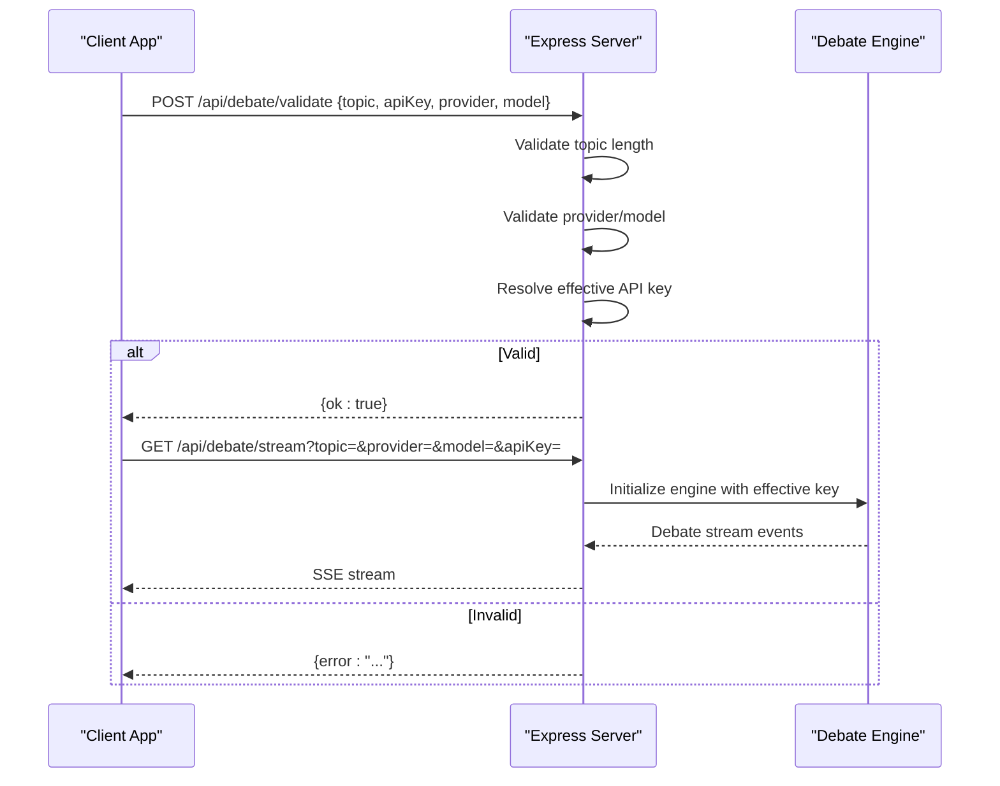
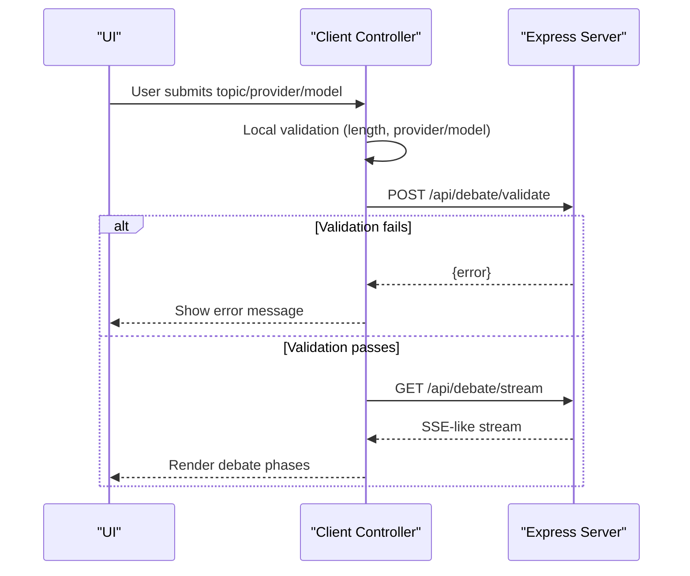
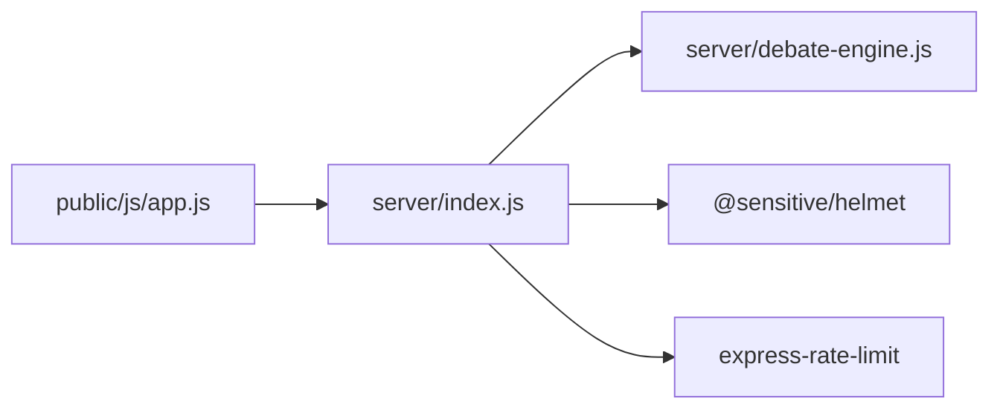

# Debate Validation Endpoint

<cite>
**Referenced Files in This Document**
- [index.js](file://dissensus-engine/server/index.js)
- [debate-engine.js](file://dissensus-engine/server/debate-engine.js)
- [app.js](file://dissensus-engine/public/js/app.js)
- [test-api.html](file://dissensus-engine/public/test-api.html)
- [package.json](file://dissensus-engine/package.json)
- [.env.example](file://dissensus-engine/.env.example)
</cite>

## Table of Contents
1. [Introduction](#introduction)
2. [Project Structure](#project-structure)
3. [Core Components](#core-components)
4. [Architecture Overview](#architecture-overview)
5. [Detailed Component Analysis](#detailed-component-analysis)
6. [Dependency Analysis](#dependency-analysis)
7. [Performance Considerations](#performance-considerations)
8. [Troubleshooting Guide](#troubleshooting-guide)
9. [Conclusion](#conclusion)

## Introduction
This document provides comprehensive API documentation for the debate validation endpoint (/api/debate/validate). It explains the POST request structure, preflight validation workflow, response schemas, client-side integration patterns, and security considerations. The validation endpoint performs essential checks before initiating the main debate streaming endpoint, ensuring robustness and preventing misuse.

## Project Structure
The validation endpoint resides in the backend server module alongside other endpoints. The frontend client integrates with the validation endpoint prior to connecting to the debate streaming endpoint.

**Diagram sources**
- [index.js](file://dissensus-engine/server/index.js)
- [debate-engine.js](file://dissensus-engine/server/debate-engine.js)
- [app.js](file://dissensus-engine/public/js/app.js)
- [test-api.html](file://dissensus-engine/public/test-api.html)

**Section sources**
- [index.js](file://dissensus-engine/server/index.js)
- [debate-engine.js](file://dissensus-engine/server/debate-engine.js)
- [app.js](file://dissensus-engine/public/js/app.js)
- [test-api.html](file://dissensus-engine/public/test-api.html)

## Core Components
- Validation endpoint: Validates topic length, provider/model existence, and API key availability before allowing debate streaming.
- Debate engine: Defines supported providers and models used by validation and streaming.
- Client controller: Performs preflight validation and connects to the streaming endpoint.

Key responsibilities:
- Enforce topic constraints (min/max length).
- Verify provider and model combinations against configuration.
- Determine effective API key (user-provided or server-side).
- Return standardized success/error responses.

**Section sources**
- [index.js](file://dissensus-engine/server/index.js)
- [debate-engine.js](file://dissensus-engine/server/debate-engine.js)
- [app.js](file://dissensus-engine/public/js/app.js)

## Architecture Overview
The validation endpoint acts as a preflight gate for the debate streaming endpoint. It ensures inputs are valid and credentials are available before the client initiates the SSE stream.

**Diagram sources**
- [index.js](file://dissensus-engine/server/index.js)
- [debate-engine.js](file://dissensus-engine/server/debate-engine.js)
- [app.js](file://dissensus-engine/public/js/app.js)

## Detailed Component Analysis

### Validation Endpoint Definition
- Path: POST /api/debate/validate
- Purpose: Preflight validation to prevent invalid requests from reaching the streaming endpoint.
- Request body parameters:
  - topic: string (required)
  - apiKey: string (optional; required if no server-side key)
  - provider: string (optional; defaults to "deepseek")
  - model: string (optional; defaults based on provider)
- Response:
  - Success: { ok: true }
  - Error: { error: string }

Validation steps performed server-side:
1. Topic presence and trimming.
2. Minimum/maximum length checks (3–500 characters).
3. Provider/model existence verification.
4. Effective API key resolution (user key overrides server key).

Rate limiting:
- The validation endpoint itself does not apply dedicated rate limiting; however, the server applies global middleware and other endpoints have rate limits. See Dependency Analysis for details.

Security:
- API keys are resolved server-side; the endpoint returns success/failure without exposing keys.
- Helmet is enabled for basic security headers.

**Section sources**
- [index.js](file://dissensus-engine/server/index.js)

### Provider and Model Configuration
Supported providers and models are centrally defined and used by both validation and streaming endpoints.

- Providers: openai, deepseek, gemini
- Models:
  - openai: gpt-4o, gpt-4o-mini
  - deepseek: deepseek-chat
  - gemini: gemini-2.5-flash, gemini-2.0-flash, gemini-2.5-flash-lite

Default model selection:
- deepseek: deepseek-chat
- gemini: gemini-2.0-flash
- openai: gpt-4o

**Section sources**
- [debate-engine.js](file://dissensus-engine/server/debate-engine.js)
- [index.js](file://dissensus-engine/server/index.js)

### Client-Side Integration Pattern
The frontend performs preflight validation before connecting to the streaming endpoint. It captures user inputs, validates locally for immediate feedback, then calls the validation endpoint. On success, it proceeds to the streaming endpoint.

Key client behaviors:
- Preflight validation: Calls POST /api/debate/validate with topic, apiKey, provider, model.
- Streaming: Uses fetch with manual streaming to handle SSE-like responses.
- Error handling: Displays user-friendly messages based on validation and stream errors.

**Diagram sources**
- [app.js](file://dissensus-engine/public/js/app.js)
- [index.js](file://dissensus-engine/server/index.js)

**Section sources**
- [app.js](file://dissensus-engine/public/js/app.js)
- [index.js](file://dissensus-engine/server/index.js)

### Response Schemas
- Successful validation:
  - Body: { ok: true }
- Error responses:
  - Missing or invalid topic: { error: "Missing topic" } or similar
  - Topic length violations: { error: "Topic must be at least N characters" } or { error: "Topic must be 500 characters or less" }
  - Invalid provider/model: { error: "Invalid model ..." } or { error: "Unknown provider ..." }
  - Missing API key: { error: "API key required. ..." }

These responses are returned directly by the validation endpoint and consumed by the client.

**Section sources**
- [index.js](file://dissensus-engine/server/index.js)

### Practical Examples
- Client-side preflight validation:
  - The frontend constructs a request body with topic, apiKey, provider, model and posts to /api/debate/validate.
  - Example request body path: [app.js](file://dissensus-engine/public/js/app.js)
- Diagnostic testing:
  - The test page demonstrates calling /api/debate/validate and verifying responses.
  - Example usage path: [test-api.html](file://dissensus-engine/public/test-api.html)
- Integration with streaming:
  - After validation succeeds, the client connects to /api/debate/stream with query parameters and processes streamed events.
  - Example streaming path: [app.js](file://dissensus-engine/public/js/app.js)

**Section sources**
- [app.js](file://dissensus-engine/public/js/app.js)
- [test-api.html](file://dissensus-engine/public/test-api.html)

### Rate Limiting and Security Implications
- Rate limiting:
  - The debate streaming endpoint applies rate limiting to prevent abuse.
  - Validation endpoint does not apply dedicated rate limiting; however, the server sets trust-proxy and uses helmet for security.
- Security:
  - API keys are resolved server-side; the validation endpoint does not expose keys.
  - Helmet is enabled to improve security posture.
  - Environment variables for server-side keys are documented in .env.example.

**Section sources**
- [index.js](file://dissensus-engine/server/index.js)
- [package.json](file://dissensus-engine/package.json)
- [.env.example](file://dissensus-engine/.env.example)

## Dependency Analysis
The validation endpoint depends on:
- Provider configuration (PROVIDERS) for model validation.
- Effective API key resolution logic.
- Express server middleware for JSON parsing and security headers.

**Diagram sources**
- [index.js](file://dissensus-engine/server/index.js)
- [debate-engine.js](file://dissensus-engine/server/debate-engine.js)
- [app.js](file://dissensus-engine/public/js/app.js)
- [package.json](file://dissensus-engine/package.json)

**Section sources**
- [index.js](file://dissensus-engine/server/index.js)
- [debate-engine.js](file://dissensus-engine/server/debate-engine.js)
- [package.json](file://dissensus-engine/package.json)

## Performance Considerations
- Validation is lightweight and synchronous, minimizing overhead.
- Streaming endpoint includes rate limiting to protect resources.
- Client-side streaming uses fetch with manual parsing to handle SSE-like responses efficiently.

[No sources needed since this section provides general guidance]

## Troubleshooting Guide
Common issues and resolutions:
- Validation returns "Missing topic" or length errors:
  - Ensure topic is provided and within 3–500 characters.
- Provider/model errors:
  - Confirm provider is one of openai, deepseek, gemini and model matches the provider.
- API key required:
  - Provide apiKey or configure server-side keys for the provider.
- Streaming errors:
  - Check rate limits and network connectivity; the client displays user-friendly messages.

**Section sources**
- [index.js](file://dissensus-engine/server/index.js)
- [app.js](file://dissensus-engine/public/js/app.js)

## Conclusion
The /api/debate/validate endpoint provides essential preflight validation to ensure robust debate initiation. It enforces topic constraints, verifies provider/model combinations, and resolves API keys securely. Combined with client-side integration patterns and rate limiting, it offers a reliable foundation for the debate streaming experience.