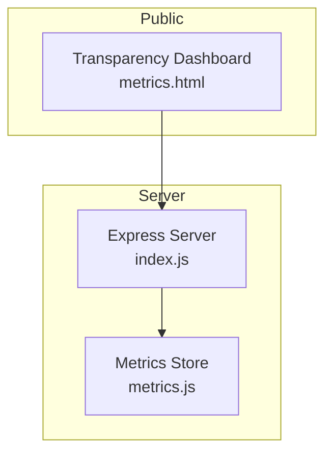
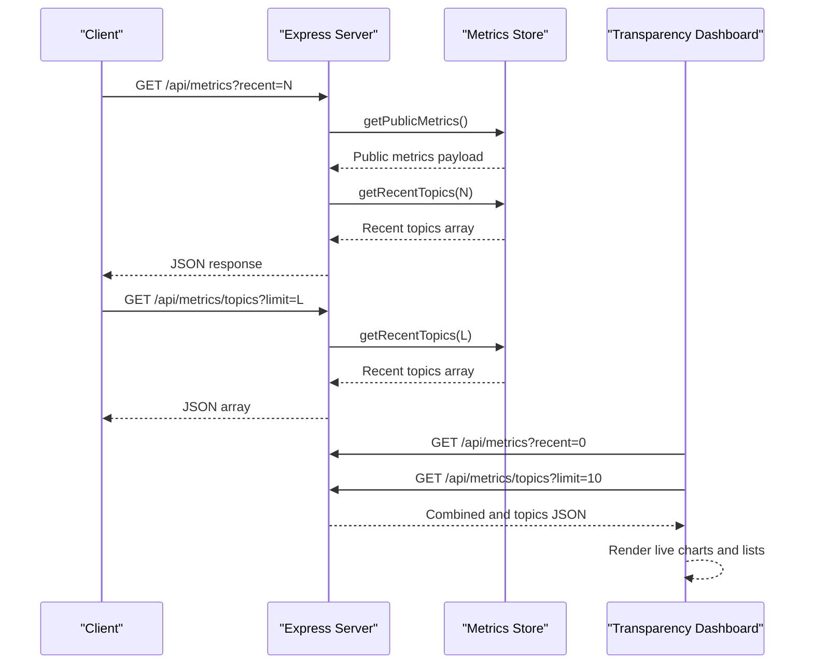
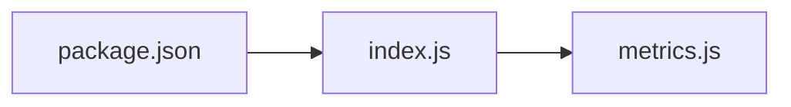

# Metrics & Analytics API

<cite>
**Referenced Files in This Document**
- [metrics.js](file://dissensus-engine/server/metrics.js)
- [index.js](file://dissensus-engine/server/index.js)
- [metrics.html](file://dissensus-engine/public/metrics.html)
- [README.md](file://dissensus-engine/README.md)
- [package.json](file://dissensus-engine/package.json)
</cite>

## Table of Contents
1. [Introduction](#introduction)
2. [Project Structure](#project-structure)
3. [Core Components](#core-components)
4. [Architecture Overview](#architecture-overview)
5. [Detailed Component Analysis](#detailed-component-analysis)
6. [Dependency Analysis](#dependency-analysis)
7. [Performance Considerations](#performance-considerations)
8. [Troubleshooting Guide](#troubleshooting-guide)
9. [Conclusion](#conclusion)
10. [Appendices](#appendices)

## Introduction
This document provides comprehensive API documentation for the metrics and analytics system powering the Dissensus debate engine. It covers:
- Public analytics endpoints for accessing debate statistics, provider utilization, and usage trends
- The recent topics endpoint for topic-based analytics and trending data
- Request parameters, response schemas, and data filtering options
- Integration with the transparency dashboard and real-time analytics capabilities
- Client integration patterns, data visualization approaches, and performance optimization techniques
- Rate limiting, caching strategies, and data privacy considerations
- Guidance for building custom analytics interfaces and monitoring system health

## Project Structure
The metrics and analytics system is implemented as part of the Express server and a lightweight in-memory metrics store. The public dashboard consumes these endpoints to render live analytics.

**Diagram sources**
- [index.js:293-321](file://dissensus-engine/server/index.js#L293-L321)
- [metrics.js:1-112](file://dissensus-engine/server/metrics.js#L1-L112)
- [metrics.html:323-396](file://dissensus-engine/public/metrics.html#L323-L396)

**Section sources**
- [README.md:78-89](file://dissensus-engine/README.md#L78-L89)
- [package.json:10-26](file://dissensus-engine/package.json#L10-L26)

## Core Components
- Metrics store module: maintains in-memory counters and rolling windows for analytics and exposes public getters and recording functions.
- Express endpoints: expose two public endpoints for analytics and a dedicated dashboard route.
- Public dashboard: consumes the endpoints to render live charts and lists.

Key responsibilities:
- Track total debates, unique topics, debates per day, provider usage, recent topics, and hourly activity.
- Expose a combined endpoint with optional recent topics and a separate endpoint for recent topics only.
- Provide uptime percentage and timestamps for last update and server start time.

**Section sources**
- [metrics.js:8-30](file://dissensus-engine/server/metrics.js#L8-L30)
- [metrics.js:77-104](file://dissensus-engine/server/metrics.js#L77-L104)
- [index.js:293-321](file://dissensus-engine/server/index.js#L293-L321)

## Architecture Overview
The metrics system integrates with the debate lifecycle. After a debate completes successfully, the server records a metric event. Errors are recorded separately. The public endpoints serve aggregated stats and recent topics.

**Diagram sources**
- [index.js:304-316](file://dissensus-engine/server/index.js#L304-L316)
- [metrics.js:77-104](file://dissensus-engine/server/metrics.js#L77-L104)
- [metrics.html:324-396](file://dissensus-engine/public/metrics.html#L324-L396)

## Detailed Component Analysis

### Public Metrics Endpoint: GET /api/metrics
Purpose:
- Serve public analytics data including debate totals, provider usage, daily and hourly activity, uptime, and optional recent topics.

Request parameters:
- recent (optional): integer; controls whether recent topics are included in the response. Defaults to 12 if omitted. Clamped between 0 and 50.

Response schema:
- totalDebates: number
- uniqueTopics: number
- debatesToday: number
- providerUsage: object with provider keys and counts
- uptimeSeconds: number
- uptimePercent: string (percentage with two decimals)
- debatesLastHour: number
- lastUpdated: ISO timestamp
- serverStartTime: ISO timestamp
- recentTopics (optional): array of topic entries (only when recent > 0)

Behavior:
- When recent > 0, recentTopics is included; otherwise omitted.
- Provider usage is normalized to lowercase provider names.
- Hourly debates are derived from the current hour index.
- Uptime percent is computed from successful vs total request attempts to the metrics endpoint.

Integration:
- The dashboard calls this endpoint with recent=0 and also calls the topics endpoint to split requests.

**Section sources**
- [index.js:304-310](file://dissensus-engine/server/index.js#L304-L310)
- [metrics.js:77-100](file://dissensus-engine/server/metrics.js#L77-L100)
- [metrics.html:330-340](file://dissensus-engine/public/metrics.html#L330-L340)

### Recent Topics Endpoint: GET /api/metrics/topics
Purpose:
- Serve recent debate topics as a JSON array for dashboards that prefer splitting requests.

Request parameters:
- limit (optional): integer; maximum number of recent topics to return. Defaults to 10 if omitted. Clamped between 1 and 50.

Response schema:
- Array of topic objects with:
  - topic: string (truncated to 100 chars)
  - provider: string (lowercase provider)
  - model: string (truncated to 80 chars)
  - timestamp: ISO timestamp

Behavior:
- Enforces an upper bound of 100 recent topics internally.
- Returns up to the requested limit.

**Section sources**
- [index.js:313-316](file://dissensus-engine/server/index.js#L313-L316)
- [metrics.js:102-104](file://dissensus-engine/server/metrics.js#L102-L104)

### Metrics Recording and Reset Logic
Recording:
- On successful debate completion, the server invokes a recording function to increment counters, update provider usage, append a recent topic entry, and update hourly activity.
- On errors (debate, card generation, debate-of-the-day), the server records failure metrics.

Reset logic:
- Daily and hourly counters reset at midnight local time. This ensures daily and hourly aggregates are accurate per calendar day.

**Section sources**
- [index.js:217-229](file://dissensus-engine/server/index.js#L217-L229)
- [metrics.js:32-73](file://dissensus-engine/server/metrics.js#L32-L73)

### Transparency Dashboard Integration
The public dashboard:
- Calls both endpoints concurrently to minimize latency.
- Renders:
  - Total debates, debates today, unique topics, uptime percentage
  - Provider usage bars with percentages
  - Recent topics list with timestamps
- Auto-refreshes every 30 seconds and displays a “Live” indicator.

**Section sources**
- [metrics.html:324-396](file://dissensus-engine/public/metrics.html#L324-L396)
- [README.md:82-86](file://dissensus-engine/README.md#L82-L86)

## Dependency Analysis
The server depends on:
- express-rate-limit for rate limiting
- helmet for security headers
- dotenv for environment configuration

Endpoints depend on:
- Metrics store module for in-memory analytics
- Debate lifecycle hooks to record successes and failures

**Diagram sources**
- [package.json:10-26](file://dissensus-engine/package.json#L10-L26)
- [index.js:14](file://dissensus-engine/server/index.js#L14)
- [metrics.js:1-112](file://dissensus-engine/server/metrics.js#L1-L112)

**Section sources**
- [package.json:10-26](file://dissensus-engine/package.json#L10-L26)
- [index.js:14](file://dissensus-engine/server/index.js#L14)

## Performance Considerations
- In-memory design: The metrics store uses arrays and sets for O(1) updates and constant-time lookups. This is efficient for small to medium loads typical of a single server instance.
- Rate limiting:
  - Metrics endpoint: 120 requests per minute in production, 300 in development.
  - Other endpoints (debate, card) have stricter limits to protect upstream providers and server resources.
- Client-side batching: The dashboard fetches both metrics and topics concurrently to reduce round trips.
- Auto-refresh cadence: The dashboard refreshes every 30 seconds, balancing freshness with network efficiency.

Recommendations:
- For high-traffic deployments, consider persisting metrics to a database or time-series store and exposing a separate read replica.
- Add server-side caching for the metrics endpoint to reduce CPU usage during spikes.
- Monitor uptimePercent and debatesLastHour to detect anomalies and scale resources accordingly.

**Section sources**
- [index.js:47-53](file://dissensus-engine/server/index.js#L47-L53)
- [index.js:296-302](file://dissensus-engine/server/index.js#L296-L302)
- [metrics.html:394-396](file://dissensus-engine/public/metrics.html#L394-L396)

## Troubleshooting Guide
Common issues and resolutions:
- CORS/Same-origin errors: The dashboard expects to be opened from the same origin as the app. If you see an error banner, open the dashboard from the Dissensus app or ensure same-origin policy is satisfied.
- Rate limiting: If you receive a “Too many metrics requests” error, reduce client polling frequency or cache responses locally.
- Missing recent topics: Ensure the recent parameter is greater than 0 for the combined endpoint, or call the topics endpoint separately.
- Provider usage skew: Provider names are normalized to lowercase. Verify client-side rendering handles unknown providers gracefully.
- Data resets: Uptime and daily counters reset at midnight. If you expect continuous growth, account for daily resets in your dashboards.

Health checks:
- Use the health endpoint to confirm service availability and supported providers.

**Section sources**
- [metrics.html:381-385](file://dissensus-engine/public/metrics.html#L381-L385)
- [index.js:74-80](file://dissensus-engine/server/index.js#L74-L80)
- [metrics.js:66-73](file://dissensus-engine/server/metrics.js#L66-L73)

## Conclusion
The metrics and analytics system provides a lightweight, transparent view of the debate engine’s usage. It offers essential KPIs and recent topics for real-time dashboards, with built-in rate limiting and a simple in-memory store. For production deployments, consider persistence, caching, and enhanced monitoring to support higher loads and long-term trend analysis.

## Appendices

### API Definitions

- GET /api/metrics
  - Query parameters:
    - recent: integer (0–50; default 12)
  - Response fields:
    - totalDebates, uniqueTopics, debatesToday, providerUsage, uptimeSeconds, uptimePercent, debatesLastHour, lastUpdated, serverStartTime
    - recentTopics (optional array when recent > 0)

- GET /api/metrics/topics
  - Query parameters:
    - limit: integer (1–50; default 10)
  - Response fields:
    - Array of topic objects with topic, provider, model, timestamp

- GET /metrics
  - Serves the transparency dashboard HTML.

**Section sources**
- [index.js:304-316](file://dissensus-engine/server/index.js#L304-L316)
- [metrics.js:77-104](file://dissensus-engine/server/metrics.js#L77-L104)
- [metrics.html:324-396](file://dissensus-engine/public/metrics.html#L324-L396)

### Client Integration Patterns
- Concurrent fetching: Fetch both metrics and topics endpoints in parallel to minimize latency.
- Local caching: Cache responses for short intervals (e.g., 10–30 seconds) to reduce load and improve responsiveness.
- Progressive enhancement: Render fallback UI when endpoints are unavailable.
- Filtering: Use recent and limit parameters to tailor data volume to your visualization needs.

**Section sources**
- [metrics.html:330-340](file://dissensus-engine/public/metrics.html#L330-L340)

### Data Privacy and Security
- The metrics store is in-memory and does not persist personal data. No user identifiers are stored.
- Rate limiting protects the server and upstream providers from abuse.
- For production, consider enabling HTTPS and additional authentication if exposing analytics externally.

**Section sources**
- [metrics.js:4-6](file://dissensus-engine/server/metrics.js#L4-L6)
- [index.js:47-53](file://dissensus-engine/server/index.js#L47-L53)