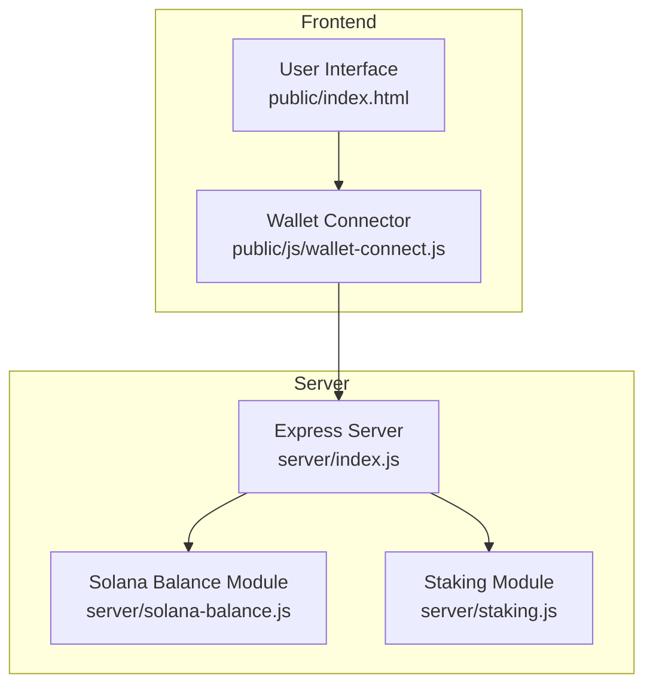
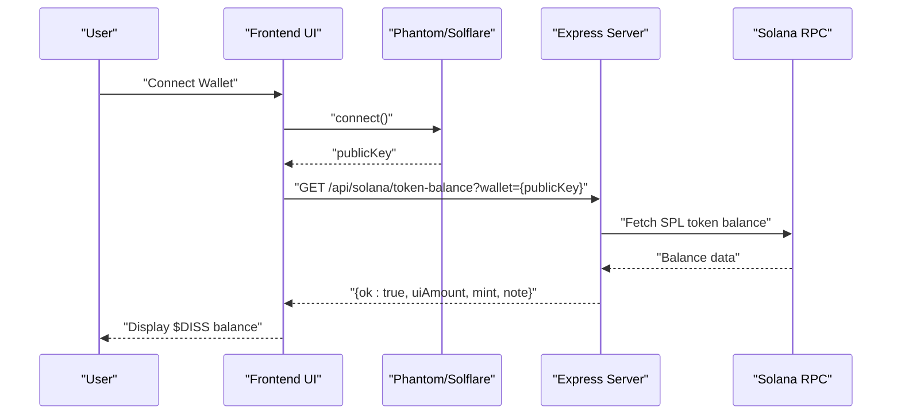

# Solana Integration API

<cite>
**Referenced Files in This Document**
- [index.js](file://dissensus-engine/server/index.js)
- [README.md](file://dissensus-engine/README.md)
- [wallet-connect.js](file://dissensus-engine/public/js/wallet-connect.js)
- [package.json](file://dissensus-engine/package.json)
</cite>

## Table of Contents
1. [Introduction](#introduction)
2. [Project Structure](#project-structure)
3. [Core Components](#core-components)
4. [Architecture Overview](#architecture-overview)
5. [Detailed Component Analysis](#detailed-component-analysis)
6. [Dependency Analysis](#dependency-analysis)
7. [Performance Considerations](#performance-considerations)
8. [Troubleshooting Guide](#troubleshooting-guide)
9. [Conclusion](#conclusion)
10. [Appendices](#appendices)

## Introduction
This document provides comprehensive API documentation for Solana blockchain integration endpoints within the Dissensus AI platform. It focuses on:
- Token balance verification endpoint for on-chain $DISS balance
- Staking status endpoint for future stake program integration
- Configuration parameters, cluster settings, and mint address information
- Server-side architecture that prevents API key exposure to clients
- Request/response schemas, wallet format requirements, and integration examples
- Security considerations, rate limiting policies, and troubleshooting guidance
- Local development setup and production deployment considerations

## Project Structure
The Solana integration is implemented in the server module and consumed by the frontend wallet connector. Key files:
- Server entrypoint and routing: [index.js](file://dissensus-engine/server/index.js)
- Frontend wallet connection and balance fetching: [wallet-connect.js](file://dissensus-engine/public/js/wallet-connect.js)
- Project configuration and dependencies: [README.md](file://dissensus-engine/README.md), [package.json](file://dissensus-engine/package.json)

**Diagram sources**
- [index.js](file://dissensus-engine/server/index.js)
- [wallet-connect.js](file://dissensus-engine/public/js/wallet-connect.js)

**Section sources**
- [index.js](file://dissensus-engine/server/index.js)
- [README.md](file://dissensus-engine/README.md)

## Core Components
- Token Balance Endpoint: GET /api/solana/token-balance
- Staking Status Endpoint: GET /api/solana/staking-status
- Configuration Endpoint: GET /api/config (includes Solana cluster, mint, and balance check URL)
- Wallet Connector: Frontend script that connects Phantom/Solflare and queries the balance endpoint

Key responsibilities:
- Validate wallet parameter and normalize it server-side
- Enforce rate limits for balance checks
- Prevent client exposure to sensitive RPC keys by performing on-chain queries server-side
- Return normalized response with UI-friendly balance formatting

**Section sources**
- [index.js](file://dissensus-engine/server/index.js)
- [README.md](file://dissensus-engine/README.md)

## Architecture Overview
The wallet connector integrates with Phantom or Solflare to obtain the user's public key. It then calls the server-side balance endpoint, which performs the on-chain lookup using a secure RPC URL configured in environment variables. The response is returned to the frontend for display.

**Diagram sources**
- [wallet-connect.js](file://dissensus-engine/public/js/wallet-connect.js)
- [index.js](file://dissensus-engine/server/index.js)

## Detailed Component Analysis

### Token Balance Endpoint: /api/solana/token-balance
Purpose:
- Verify on-chain $DISS token balance for a given wallet address
- Normalize wallet input server-side to prevent errors
- Enforce rate limiting and return structured error responses

Endpoint:
- Method: GET
- Path: /api/solana/token-balance
- Query Parameter:
  - wallet (required): Solana public key (base58 encoded)

Rate Limiting:
- Window: 1 minute
- Requests: 60 in production, 120 in development

Response Schema:
- Success:
  - ok: boolean
  - uiAmount: number (display amount)
  - mint: string (mint address)
  - note: string (contextual note)
- Client Error (400):
  - error: string (validation failure)
- Server Error (500):
  - error: string (internal failure)

Error Handling:
- Catches INVALID_WALLET and returns 400 with error message
- Logs other errors and returns generic 500 message
- Uses centralized error recording utility

Security:
- Wallet normalization occurs server-side
- RPC credentials remain on server (configured via environment variables)

Integration Example (Frontend):
- The frontend wallet connector calls this endpoint after successful wallet connection and displays the formatted balance.

Validation and Normalization:
- Wallet parameter is normalized server-side before processing
- Invalid wallet format triggers immediate 400 response

**Section sources**
- [index.js](file://dissensus-engine/server/index.js)
- [README.md](file://dissensus-engine/README.md)
- [wallet-connect.js](file://dissensus-engine/public/js/wallet-connect.js)

### Staking Status Endpoint: /api/solana/staking-status
Purpose:
- Provide status for future on-chain stake program integration
- Signal whether a staking program ID is configured

Endpoint:
- Method: GET
- Path: /api/solana/staking-status

Response Schema:
- programId: string|null (configured program ID or null)
- onChainStakingLive: boolean (true if program ID is set)
- message: string (status message)

Behavior:
- Returns programId and onChainStakingLive based on DISS_STAKING_PROGRAM_ID environment variable
- Provides guidance for configuring the staking program ID

**Section sources**
- [index.js](file://dissensus-engine/server/index.js)
- [README.md](file://dissensus-engine/README.md)

### Configuration Endpoint: /api/config (Solana Section)
Purpose:
- Expose runtime configuration to clients, including Solana settings

Solana Configuration Fields:
- cluster: string (Solana cluster name)
- dissTokenMint: string (mint address for $DISS)
- balanceCheckUrl: string (relative URL for balance endpoint)

Environment Variables Used:
- SOLANA_CLUSTER: cluster name
- DISS_TOKEN_MINT: mint address for $DISS
- SOLANA_RPC_URL: RPC endpoint used by server-side balance checker

**Section sources**
- [index.js](file://dissensus-engine/server/index.js)
- [README.md](file://dissensus-engine/README.md)

### Wallet Connector Integration
Frontend Responsibilities:
- Detect Phantom or Solflare provider
- Connect wallet and obtain public key
- Call /api/solana/token-balance with the wallet parameter
- Display formatted balance and handle errors

Wallet Format Requirements:
- Base58-encoded Solana public key
- The server normalizes the wallet parameter before processing

Frontend Flow:
- On connect, fetch balance via GET /api/solana/token-balance
- On success, format and display balance with appropriate precision
- On error, show user-friendly message

**Section sources**
- [wallet-connect.js](file://dissensus-engine/public/js/wallet-connect.js)
- [README.md](file://dissensus-engine/README.md)

## Dependency Analysis
External dependencies relevant to Solana integration:
- @solana/web3.js: Solana client library for RPC interactions
- @solana/spl-token: SPL token utilities for token accounts and amounts
- dotenv: Loads environment variables from .env
- express-rate-limit: Rate limiting middleware
- helmet: Security headers middleware

These dependencies enable:
- On-chain balance queries via RPC
- Token mint and amount handling
- Secure server configuration and protection

**Section sources**
- [package.json](file://dissensus-engine/package.json)

## Performance Considerations
- Rate limiting reduces load from excessive balance checks
- Balance endpoint uses minimal processing; most work is off-chain UI formatting
- Consider caching balances per wallet for repeated requests within a short timeframe (not currently implemented)
- Use efficient RPC endpoints and monitor latency in production

## Troubleshooting Guide
Common Issues and Resolutions:
- Invalid wallet format:
  - Symptom: 400 error with validation message
  - Cause: Non-base58 or malformed public key
  - Fix: Ensure wallet is a valid Solana public key
- RPC connectivity errors:
  - Symptom: 500 error indicating failure to fetch token balance
  - Cause: RPC unavailability or misconfiguration
  - Fix: Verify SOLANA_RPC_URL and network health
- Rate limit exceeded:
  - Symptom: 429-like error messages
  - Cause: Too many requests within the rate limit window
  - Fix: Reduce request frequency or increase window/limits
- Staking program not configured:
  - Symptom: onChainStakingLive is false
  - Cause: DISS_STAKING_PROGRAM_ID not set
  - Fix: Set DISS_STAKING_PROGRAM_ID in environment variables

Operational Checks:
- Health endpoint: GET /api/health
- Configuration endpoint: GET /api/config (verify Solana cluster and mint)
- Balance endpoint: GET /api/solana/token-balance?wallet=<valid_key>

**Section sources**
- [index.js](file://dissensus-engine/server/index.js)
- [README.md](file://dissensus-engine/README.md)

## Conclusion
The Solana integration provides a secure, rate-limited mechanism to verify on-chain $DISS balances without exposing RPC keys to clients. The staking status endpoint prepares the system for future on-chain stake program integration. Proper configuration of environment variables and adherence to rate limits ensure reliable operation in both development and production environments.

## Appendices

### Request/Response Schemas

Token Balance Endpoint
- GET /api/solana/token-balance?wallet={publicKey}
- Success Response:
  - ok: boolean
  - uiAmount: number
  - mint: string
  - note: string
- Error Responses:
  - 400: { error: string }
  - 500: { error: string }

Staking Status Endpoint
- GET /api/solana/staking-status
- Response:
  - programId: string|null
  - onChainStakingLive: boolean
  - message: string

Configuration Endpoint (Solana Section)
- GET /api/config
- Response (relevant fields):
  - solana.cluster: string
  - solana.dissTokenMint: string
  - solana.balanceCheckUrl: string

### Environment Variables
- SOLANA_RPC_URL: RPC endpoint for on-chain queries
- DISS_TOKEN_MINT: Mint address for $DISS token
- SOLANA_CLUSTER: Cluster name shown in configuration
- DISS_STAKING_PROGRAM_ID: Program ID for future on-chain staking
- TRUST_PROXY: Trust reverse proxy headers (default enabled)
- TRUST_PROXY_HOPS: Number of trusted proxy hops

### Local Development Setup
- Install dependencies: npm install
- Start server: npm start
- Access UI: http://localhost:3000
- Connect wallet via Phantom or Solflare in the browser
- Verify balance via /api/solana/token-balance

### Production Deployment Considerations
- Set server-side API keys in .env for providers
- Configure SOLANA_RPC_URL and DISS_TOKEN_MINT
- Enable reverse proxy (nginx) and trust proxy settings
- Monitor rate limits and adjust as needed
- Use HTTPS and proper firewall/security configurations

**Section sources**
- [README.md](file://dissensus-engine/README.md)
- [index.js](file://dissensus-engine/server/index.js)