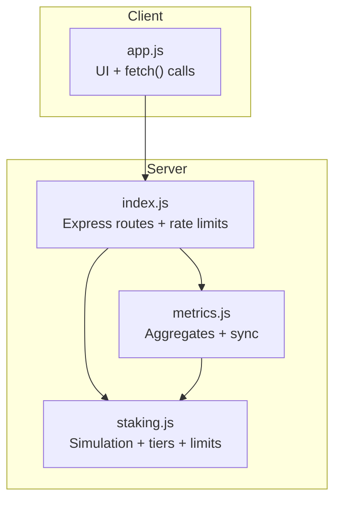
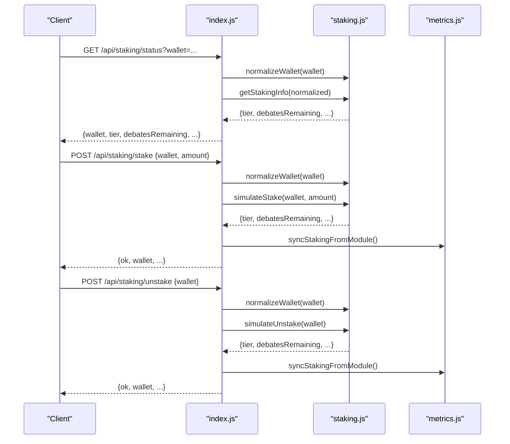
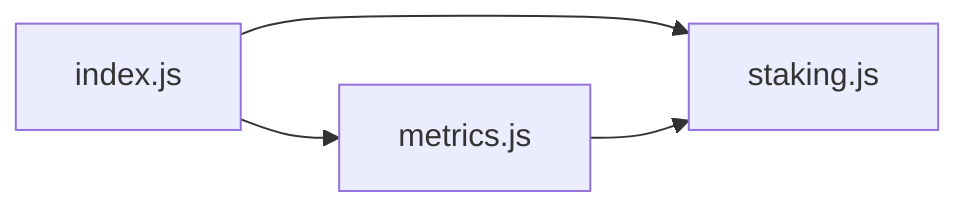

# Staking API

<cite>
**Referenced Files in This Document**
- [index.js](file://dissensus-engine/server/index.js)
- [staking.js](file://dissensus-engine/server/staking.js)
- [metrics.js](file://dissensus-engine/server/metrics.js)
- [app.js](file://dissensus-engine/public/js/app.js)
- [README.md](file://dissensus-engine/README.md)
</cite>

## Table of Contents
1. [Introduction](#introduction)
2. [Project Structure](#project-structure)
3. [Core Components](#core-components)
4. [Architecture Overview](#architecture-overview)
5. [Detailed Component Analysis](#detailed-component-analysis)
6. [Dependency Analysis](#dependency-analysis)
7. [Performance Considerations](#performance-considerations)
8. [Troubleshooting Guide](#troubleshooting-guide)
9. [Conclusion](#conclusion)
10. [Appendices](#appendices)

## Introduction
This document provides comprehensive API documentation for the staking and access control system. It covers:
- Tier information endpoint for retrieving staking requirements and access levels
- Staking status endpoint for wallet verification and tier determination
- Stake/unstake endpoints with parameter validation and simulation logic
- Wallet normalization, daily debate limits, and staking enforcement mechanisms
- Request/response schemas, rate limiting information, and integration examples
- Staking simulation mode, wallet validation requirements, and tier-based access control patterns
- Troubleshooting guidance for common staking issues and client implementation best practices

## Project Structure
The staking system is implemented within the dissensus-engine server module. Key files:
- Server entrypoint and routing: [index.js](file://dissensus-engine/server/index.js)
- Staking logic and simulation: [staking.js](file://dissensus-engine/server/staking.js)
- Metrics integration: [metrics.js](file://dissensus-engine/server/metrics.js)
- Client-side integration examples: [app.js](file://dissensus-engine/public/js/app.js)
- High-level overview and endpoint list: [README.md](file://dissensus-engine/README.md)

**Diagram sources**
- [index.js:324-355](file://dissensus-engine/server/index.js#L324-L355)
- [staking.js:138-182](file://dissensus-engine/server/staking.js#L138-L182)
- [metrics.js:91-98](file://dissensus-engine/server/metrics.js#L91-L98)
- [app.js:500-568](file://dissensus-engine/public/js/app.js#L500-L568)

**Section sources**
- [index.js:324-355](file://dissensus-engine/server/index.js#L324-L355)
- [README.md:82-89](file://dissensus-engine/README.md#L82-L89)

## Core Components
- Tier thresholds and features: defined in [TIERS:13-19](file://dissensus-engine/server/staking.js#L13-L19)
- Wallet normalization: [normalizeWallet:147-154](file://dissensus-engine/server/staking.js#L147-L154)
- Daily reset and usage tracking: [ensureDailyReset:25-33](file://dissensus-engine/server/staking.js#L25-L33), [recordDebateUsage:127-136](file://dissensus-engine/server/staking.js#L127-L136)
- Access control gating: [canDebate:110-125](file://dissensus-engine/server/staking.js#L110-L125)
- Simulation functions: [simulateStake:81-96](file://dissensus-engine/server/staking.js#L81-L96), [simulateUnstake:98-108](file://dissensus-engine/server/staking.js#L98-L108)
- Aggregated metrics: [getStakingAggregateMetrics:156-169](file://dissensus-engine/server/staking.js#L156-L169)

**Section sources**
- [staking.js:13-19](file://dissensus-engine/server/staking.js#L13-L19)
- [staking.js:25-33](file://dissensus-engine/server/staking.js#L25-L33)
- [staking.js:110-125](file://dissensus-engine/server/staking.js#L110-L125)
- [staking.js:81-108](file://dissensus-engine/server/staking.js#L81-L108)
- [staking.js:156-169](file://dissensus-engine/server/staking.js#L156-L169)

## Architecture Overview
The staking system integrates with the debate engine to enforce daily debate limits based on wallet stake. When STAKING_ENFORCE is enabled, the debate endpoints validate the presence of a normalized wallet and check remaining debates for that day.

**Diagram sources**
- [index.js:328-355](file://dissensus-engine/server/index.js#L328-L355)
- [staking.js:43-79](file://dissensus-engine/server/staking.js#L43-L79)
- [metrics.js:91-98](file://dissensus-engine/server/metrics.js#L91-L98)

## Detailed Component Analysis

### Tier Information Endpoint
- Endpoint: GET /api/staking/tiers
- Purpose: Retrieve all tiers, minimum stake thresholds, debates per day, and features
- Response shape:
  - tiers: array of tier objects with fields:
    - name: string (FREE, BRONZE, SILVER, GOLD, WHALE)
    - minStake: number (minimum simulated stake required)
    - debatesPerDay: number or "Unlimited"
    - features: array of feature strings
  - simulated: boolean (always true for this demo)
  - enforce: boolean (from STAKING_ENFORCE env var)

Integration example (client):
- Fetch tiers and render list: [loadStakingTiers:556-568](file://dissensus-engine/public/js/app.js#L556-L568)

**Section sources**
- [index.js:324-326](file://dissensus-engine/server/index.js#L324-L326)
- [staking.js:138-145](file://dissensus-engine/server/staking.js#L138-L145)
- [app.js:556-568](file://dissensus-engine/public/js/app.js#L556-L568)

### Staking Status Endpoint
- Endpoint: GET /api/staking/status?wallet=...
- Purpose: Verify wallet and compute current tier, debates used, and remaining debates for the day
- Query parameters:
  - wallet: string (Solana wallet address)
- Response shape:
  - wallet: string (normalized)
  - staked: number (simulated stake amount)
  - tier: string (tier name)
  - tierBenefits: object (features and debatesPerDay)
  - debatesUsedToday: number
  - debatesRemaining: number or "unlimited"
  - stakedAt: string (ISO date) or null

Validation and rate limiting:
- Rate limit: 60 requests/minute in production, 200 in development
- Validation: rejects missing or invalid wallet

Integration example (client):
- Fetch and display status: [refreshStakingStatus:500-515](file://dissensus-engine/public/js/app.js#L500-L515)

**Section sources**
- [index.js:328-334](file://dissensus-engine/server/index.js#L328-L334)
- [staking.js:43-79](file://dissensus-engine/server/staking.js#L43-L79)
- [app.js:500-515](file://dissensus-engine/public/js/app.js#L500-L515)

### Stake Endpoint
- Endpoint: POST /api/staking/stake
- Purpose: Set or update simulated stake for a wallet
- Request body:
  - wallet: string (Solana wallet address)
  - amount: number (non-negative)
- Response shape:
  - ok: boolean
  - wallet: string (normalized)
  - staked: number
  - tier: string
  - tierBenefits: object
  - debatesUsedToday: number
  - debatesRemaining: number or "unlimited"
  - stakedAt: string or null

Validation and rate limiting:
- Rate limit: 60 requests/minute in production, 200 in development
- Validation: rejects invalid wallet; throws on invalid amount

Simulation logic:
- Creates or updates staking record with normalized wallet
- Persists initial stakedAt timestamp on first stake
- Resets daily debate counter if day changed

Integration example (client):
- Submit stake: [doSimulateStake:517-537](file://dissensus-engine/public/js/app.js#L517-L537)

**Section sources**
- [index.js:336-347](file://dissensus-engine/server/index.js#L336-L347)
- [staking.js:81-96](file://dissensus-engine/server/staking.js#L81-L96)
- [app.js:517-537](file://dissensus-engine/public/js/app.js#L517-L537)

### Unstake Endpoint
- Endpoint: POST /api/staking/unstake
- Purpose: Reset stake to zero for a wallet
- Request body:
  - wallet: string (Solana wallet address)
- Response shape:
  - ok: boolean
  - wallet: string (normalized)
  - staked: number (0)
  - tier: string (FREE)
  - tierBenefits: object
  - debatesUsedToday: number
  - debatesRemaining: number (tier limit)
  - stakedAt: null

Validation and rate limiting:
- Rate limit: 60 requests/minute in production, 200 in development
- Validation: rejects invalid wallet

Integration example (client):
- Submit unstake: [doSimulateUnstake:539-554](file://dissensus-engine/public/js/app.js#L539-L554)

**Section sources**
- [index.js:349-355](file://dissensus-engine/server/index.js#L349-L355)
- [staking.js:98-108](file://dissensus-engine/server/staking.js#L98-L108)
- [app.js:539-554](file://dissensus-engine/public/js/app.js#L539-L554)

### Wallet Normalization
- Purpose: Ensure wallet addresses conform to expected format
- Behavior:
  - Trims whitespace
  - Rejects empty or null values
  - Validates length typical for Solana base58 addresses
- Used by:
  - Staking endpoints
  - Debate validation and stream endpoints

Reference: [normalizeWallet:147-154](file://dissensus-engine/server/staking.js#L147-L154)

**Section sources**
- [staking.js:147-154](file://dissensus-engine/server/staking.js#L147-L154)
- [index.js:182-182](file://dissensus-engine/server/index.js#L182-L182)
- [index.js:222-222](file://dissensus-engine/server/index.js#L222-L222)

### Daily Debate Limits and Enforcement
- Tier thresholds:
  - FREE: 1 debate/day
  - BRONZE: 5 debates/day
  - SILVER: 20 debates/day
  - GOLD: unlimited
  - WHALE: unlimited
- Enforcement:
  - When STAKING_ENFORCE is enabled, debate endpoints require a valid wallet
  - canDebate checks remaining debates for the day
  - recordDebateUsage increments daily counter after successful debates
- Rate limiting:
  - Debate stream endpoint: 10 requests/minute in production, 100 in development
  - Staking endpoints: 60 requests/minute in production, 200 in development

References:
- Tiers: [TIERS:13-19](file://dissensus-engine/server/staking.js#L13-L19)
- Enforcement: [canDebate:110-125](file://dissensus-engine/server/staking.js#L110-L125), [recordDebateUsage:127-136](file://dissensus-engine/server/staking.js#L127-L136)
- Stream gating: [index.js:224-234](file://dissensus-engine/server/index.js#L224-L234), [index.js:184-192](file://dissensus-engine/server/index.js#L184-L192)

**Section sources**
- [staking.js:13-19](file://dissensus-engine/server/staking.js#L13-L19)
- [staking.js:110-125](file://dissensus-engine/server/staking.js#L110-L125)
- [staking.js:127-136](file://dissensus-engine/server/staking.js#L127-L136)
- [index.js:224-234](file://dissensus-engine/server/index.js#L224-L234)
- [index.js:184-192](file://dissensus-engine/server/index.js#L184-L192)

### Staking Simulation Mode
- The system simulates staking in memory for demonstration
- On-chain integration is indicated by environment variables and placeholder endpoints
- Aggregated metrics are computed and synchronized to the public metrics API

References:
- Simulation functions: [simulateStake:81-96](file://dissensus-engine/server/staking.js#L81-L96), [simulateUnstake:98-108](file://dissensus-engine/server/staking.js#L98-L108)
- Aggregation: [getStakingAggregateMetrics:156-169](file://dissensus-engine/server/staking.js#L156-L169)
- Sync hook: [syncStakingFromModule:91-98](file://dissensus-engine/server/metrics.js#L91-L98)

**Section sources**
- [staking.js:81-108](file://dissensus-engine/server/staking.js#L81-L108)
- [staking.js:156-169](file://dissensus-engine/server/staking.js#L156-L169)
- [metrics.js:91-98](file://dissensus-engine/server/metrics.js#L91-L98)

### Request/Response Schemas

#### GET /api/staking/tiers
- Response fields:
  - tiers: array of tier objects
  - simulated: boolean
  - enforce: boolean

#### GET /api/staking/status
- Query parameters:
  - wallet: string
- Response fields:
  - wallet: string
  - staked: number
  - tier: string
  - tierBenefits: object
  - debatesUsedToday: number
  - debatesRemaining: number or "unlimited"
  - stakedAt: string or null

#### POST /api/staking/stake
- Request body:
  - wallet: string
  - amount: number
- Response fields:
  - ok: boolean
  - wallet: string
  - staked: number
  - tier: string
  - tierBenefits: object
  - debatesUsedToday: number
  - debatesRemaining: number or "unlimited"
  - stakedAt: string or null

#### POST /api/staking/unstake
- Request body:
  - wallet: string
- Response fields:
  - ok: boolean
  - wallet: string
  - staked: number
  - tier: string
  - tierBenefits: object
  - debatesUsedToday: number
  - debatesRemaining: number or "unlimited"
  - stakedAt: null

**Section sources**
- [index.js:324-355](file://dissensus-engine/server/index.js#L324-L355)
- [staking.js:43-79](file://dissensus-engine/server/staking.js#L43-L79)
- [staking.js:81-108](file://dissensus-engine/server/staking.js#L81-L108)

### Rate Limiting
- Debate stream: 10/minute (prod), 100/minute (dev)
- Staking endpoints: 60/minute (prod), 200/minute (dev)
- Solana balance: 60/minute (prod), 120/minute (dev)
- Cards: 20/minute (prod), 100/minute (dev)
- Metrics: 120/minute (prod), 300/minute (dev)

References:
- [index.js:58-64](file://dissensus-engine/server/index.js#L58-L64)
- [index.js:316-322](file://dissensus-engine/server/index.js#L316-L322)
- [index.js:90-96](file://dissensus-engine/server/index.js#L90-L96)
- [index.js:374-380](file://dissensus-engine/server/index.js#L374-L380)
- [index.js:421-427](file://dissensus-engine/server/index.js#L421-L427)

**Section sources**
- [index.js:58-64](file://dissensus-engine/server/index.js#L58-L64)
- [index.js:316-322](file://dissensus-engine/server/index.js#L316-L322)
- [index.js:90-96](file://dissensus-engine/server/index.js#L90-L96)
- [index.js:374-380](file://dissensus-engine/server/index.js#L374-L380)
- [index.js:421-427](file://dissensus-engine/server/index.js#L421-L427)

### Integration Examples
- Client-side fetching and rendering:
  - Tiers: [loadStakingTiers:556-568](file://dissensus-engine/public/js/app.js#L556-L568)
  - Status: [refreshStakingStatus:500-515](file://dissensus-engine/public/js/app.js#L500-L515)
  - Stake: [doSimulateStake:517-537](file://dissensus-engine/public/js/app.js#L517-L537)
  - Unstake: [doSimulateUnstake:539-554](file://dissensus-engine/public/js/app.js#L539-L554)

**Section sources**
- [app.js:500-568](file://dissensus-engine/public/js/app.js#L500-L568)

## Dependency Analysis
The staking system depends on:
- Express routes for HTTP endpoints
- In-memory staking data store
- Metrics synchronization for aggregated staking stats

**Diagram sources**
- [index.js:14-22](file://dissensus-engine/server/index.js#L14-L22)
- [metrics.js:8-8](file://dissensus-engine/server/metrics.js#L8-L8)

**Section sources**
- [index.js:14-22](file://dissensus-engine/server/index.js#L14-L22)
- [metrics.js:8-8](file://dissensus-engine/server/metrics.js#L8-L8)

## Performance Considerations
- In-memory simulation: efficient for demos; consider persistence for production
- Daily reset logic: minimal overhead via date comparison
- Aggregation: computed on demand and cached in metrics; invoked during debate completion and metrics retrieval
- Rate limiting: protects against abuse while allowing reasonable throughput

[No sources needed since this section provides general guidance]

## Troubleshooting Guide
Common issues and resolutions:
- Invalid wallet address:
  - Cause: Wallet not normalized or missing
  - Resolution: Ensure wallet is a non-empty string with expected length
  - References: [normalizeWallet:147-154](file://dissensus-engine/server/staking.js#L147-L154), [index.js:330-332](file://dissensus-engine/server/index.js#L330-L332)
- Stake amount validation:
  - Cause: Negative or non-finite amount
  - Resolution: Provide a non-negative numeric amount
  - References: [simulateStake:82-85](file://dissensus-engine/server/staking.js#L82-L85)
- Daily debate limit reached:
  - Cause: Remaining debates equals zero
  - Resolution: Stake more to increase tier and daily allowance
  - References: [canDebate:110-125](file://dissensus-engine/server/staking.js#L110-L125)
- STAKING_ENFORCE enabled:
  - Cause: Missing wallet parameter in debate endpoints
  - Resolution: Provide a valid wallet or disable enforcement
  - References: [index.js:184-186](file://dissensus-engine/server/index.js#L184-L186), [index.js:224-227](file://dissensus-engine/server/index.js#L224-L227)
- Rate limit exceeded:
  - Cause: Too many requests within a minute
  - Resolution: Wait for the next minute or reduce request frequency
  - References: [index.js:58-64](file://dissensus-engine/server/index.js#L58-L64), [index.js:316-322](file://dissensus-engine/server/index.js#L316-L322)

**Section sources**
- [staking.js:147-154](file://dissensus-engine/server/staking.js#L147-L154)
- [index.js:330-332](file://dissensus-engine/server/index.js#L330-L332)
- [staking.js:82-85](file://dissensus-engine/server/staking.js#L82-L85)
- [staking.js:110-125](file://dissensus-engine/server/staking.js#L110-L125)
- [index.js:184-186](file://dissensus-engine/server/index.js#L184-L186)
- [index.js:224-227](file://dissensus-engine/server/index.js#L224-L227)
- [index.js:58-64](file://dissensus-engine/server/index.js#L58-L64)
- [index.js:316-322](file://dissensus-engine/server/index.js#L316-L322)

## Conclusion
The staking API provides a robust, simulated tier-based access control system integrated with the debate engine. It enforces daily debate limits based on stake tiers, supports wallet normalization, and offers comprehensive client integration examples. Production deployments should consider on-chain stake verification, persistent storage, and stricter rate limiting.

[No sources needed since this section summarizes without analyzing specific files]

## Appendices

### Environment Variables
- STAKING_ENFORCE: Enables wallet requirement and daily debate limits
- TRUST_PROXY: Controls trust proxy behavior for rate limiting
- TRUST_PROXY_HOPS: Number of trusted proxy hops

References:
- [index.js:30-38](file://dissensus-engine/server/index.js#L30-L38)
- [README.md:89-89](file://dissensus-engine/README.md#L89-L89)

**Section sources**
- [index.js:30-38](file://dissensus-engine/server/index.js#L30-L38)
- [README.md:89-89](file://dissensus-engine/README.md#L89-L89)