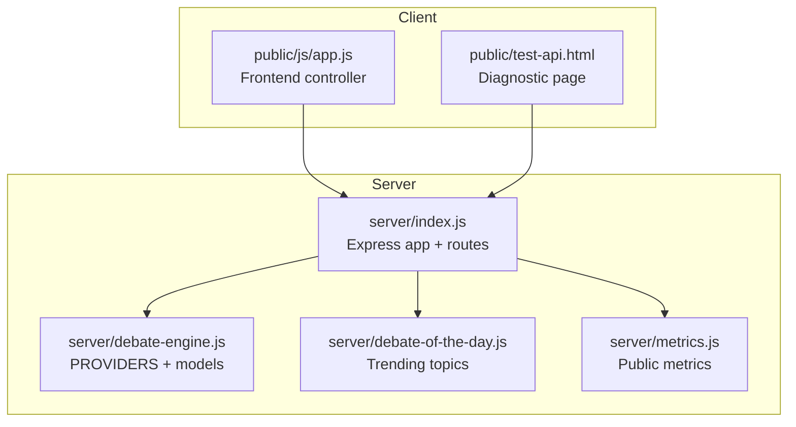
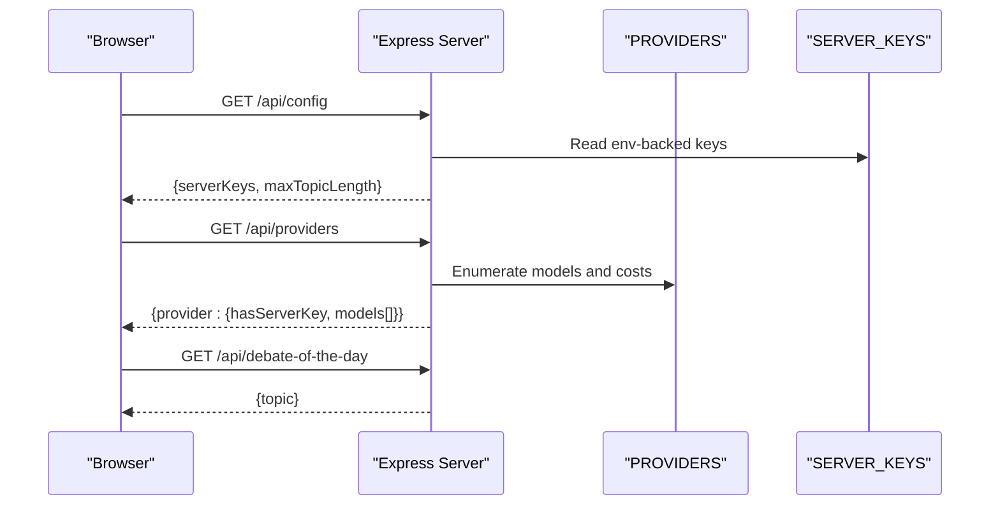
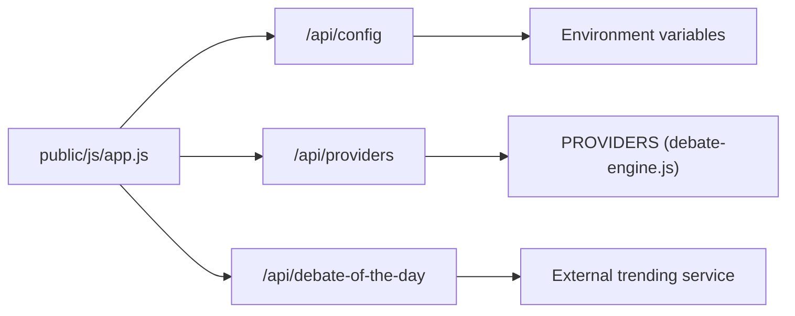

# Utility & Configuration API

<cite>
**Referenced Files in This Document**
- [index.js](file://dissensus-engine/server/index.js)
- [debate-engine.js](file://dissensus-engine/server/debate-engine.js)
- [debate-of-the-day.js](file://dissensus-engine/server/debate-of-the-day.js)
- [metrics.js](file://dissensus-engine/server/metrics.js)
- [app.js](file://dissensus-engine/public/js/app.js)
- [test-api.html](file://dissensus-engine/public/test-api.html)
- [README.md](file://dissensus-engine/README.md)
- [deploy-env-to-vps.ps1](file://dissensus-engine/deploy-env-to-vps.ps1)
</cite>

## Table of Contents
1. [Introduction](#introduction)
2. [Project Structure](#project-structure)
3. [Core Components](#core-components)
4. [Architecture Overview](#architecture-overview)
5. [Detailed Component Analysis](#detailed-component-analysis)
6. [Dependency Analysis](#dependency-analysis)
7. [Performance Considerations](#performance-considerations)
8. [Troubleshooting Guide](#troubleshooting-guide)
9. [Conclusion](#conclusion)
10. [Appendices](#appendices)

## Introduction
This document describes the utility and configuration APIs exposed by the Dissensus engine server. It covers:
- Configuration endpoint for server capabilities and limits
- Providers endpoint for dynamic provider and model discovery
- Health check endpoint for uptime verification
- Debate of the day endpoint for trend-based topic suggestions
It also documents environment variables, server-side key management, client-side configuration patterns, and troubleshooting guidance.

## Project Structure
The server exposes REST endpoints under /api and serves a static frontend under /public. The configuration and provider discovery logic resides in the server entrypoint, while provider metadata and pricing are defined in the debate engine module. The debate-of-the-day logic is encapsulated separately and integrated into the server.

**Diagram sources**
- [index.js:1-356](file://dissensus-engine/server/index.js#L1-L356)
- [debate-engine.js:1-389](file://dissensus-engine/server/debate-engine.js#L1-L389)
- [debate-of-the-day.js:1-80](file://dissensus-engine/server/debate-of-the-day.js#L1-L80)
- [metrics.js:1-112](file://dissensus-engine/server/metrics.js#L1-L112)
- [app.js:1-554](file://dissensus-engine/public/js/app.js#L1-L554)
- [test-api.html:1-52](file://dissensus-engine/public/test-api.html#L1-L52)

**Section sources**
- [index.js:1-356](file://dissensus-engine/server/index.js#L1-L356)
- [README.md:90-112](file://dissensus-engine/README.md#L90-L112)

## Core Components
- Configuration endpoint: GET /api/config
  - Returns server-side key availability per provider and maximum topic length.
- Providers endpoint: GET /api/providers
  - Returns provider metadata and model catalog with pricing.
- Health check endpoint: GET /api/health
  - Returns service status and supported providers.
- Debate of the day endpoint: GET /api/debate-of-the-day
  - Returns a trending topic suggestion or a fallback.

**Section sources**
- [index.js:58-99](file://dissensus-engine/server/index.js#L58-L99)
- [debate-engine.js:14-39](file://dissensus-engine/server/debate-engine.js#L14-L39)
- [debate-of-the-day.js:66-77](file://dissensus-engine/server/debate-of-the-day.js#L66-L77)

## Architecture Overview
The client initializes by fetching /api/config to determine which providers have server-side keys. It then optionally queries /api/providers to populate model choices. The debate-of-the-day endpoint is used to seed topics.

**Diagram sources**
- [index.js:58-99](file://dissensus-engine/server/index.js#L58-L99)
- [debate-engine.js:14-39](file://dissensus-engine/server/debate-engine.js#L14-L39)
- [app.js:530-554](file://dissensus-engine/public/js/app.js#L530-L554)

## Detailed Component Analysis

### Configuration Endpoint: GET /api/config
- Purpose: Inform clients about server-side key availability and configuration limits.
- Behavior:
  - Computes availability per provider from server-side keys.
  - Returns a maximum topic length limit.
- Response schema:
  - serverKeys: object mapping provider identifiers to booleans indicating presence of a server-side key
  - maxTopicLength: integer (fixed value returned by the endpoint)
- Typical response shape:
  - {
    "serverKeys": {
      "openai": boolean,
      "deepseek": boolean,
      "gemini": boolean
    },
    "maxTopicLength": 500
  }
- Notes:
  - Server-side keys are loaded from environment variables and checked for truthiness.
  - The endpoint does not expose the actual keys; it only indicates whether they are configured.

**Section sources**
- [index.js:58-67](file://dissensus-engine/server/index.js#L58-L67)
- [index.js:29-34](file://dissensus-engine/server/index.js#L29-L34)

### Providers Endpoint: GET /api/providers
- Purpose: Provide dynamic discovery of providers and models, including cost information.
- Behavior:
  - Iterates over the provider registry and constructs a response with model metadata.
  - Includes a flag indicating whether the server has a key for each provider.
- Response schema:
  - Top-level keys are provider identifiers (e.g., "openai", "deepseek", "gemini").
  - Each provider object includes:
    - hasServerKey: boolean
    - models: array of objects with:
      - id: string (model identifier)
      - name: string (human-readable model name)
      - costPer1kIn: number (input cost per 1K tokens)
      - costPer1kOut: number (output cost per 1K tokens)
- Notes:
  - The model catalog and pricing are defined in the provider registry.

**Section sources**
- [index.js:85-99](file://dissensus-engine/server/index.js#L85-L99)
- [debate-engine.js:14-39](file://dissensus-engine/server/debate-engine.js#L14-L39)

### Health Check Endpoint: GET /api/health
- Purpose: System monitoring and uptime verification.
- Behavior:
  - Returns a simple status payload listing the service name and supported providers.
- Response schema:
  - status: string ("ok")
  - service: string (service identifier)
  - providers: string (comma-separated list of supported provider identifiers)
- Notes:
  - Useful for load balancers, monitors, and CI checks.

**Section sources**
- [index.js:74-80](file://dissensus-engine/server/index.js#L74-L80)

### Debate of the Day Endpoint: GET /api/debate-of-the-day
- Purpose: Provide a timely, trending topic suggestion.
- Behavior:
  - Attempts to fetch trending data from an external service and formats a debatable question.
  - Falls back to a curated list based on the current calendar day.
  - Results are cached per-calendar-date and timezone-aware.
- Response schema:
  - topic: string (the suggested debate topic)
- Notes:
  - The endpoint is resilient: on failure, it returns a default topic and records the error.

**Section sources**
- [index.js:235-244](file://dissensus-engine/server/index.js#L235-L244)
- [debate-of-the-day.js:66-77](file://dissensus-engine/server/debate-of-the-day.js#L66-L77)

### Client-Side Configuration Patterns
- Initialization flow:
  - On page load, the client fetches /api/config to determine server-side key availability.
  - Based on the response, it adjusts the API key input behavior (optional vs required) and updates UI hints.
  - Optionally, it fetches /api/providers to populate model selections.
- Storage:
  - The client persists provider, model, and API key preferences per provider in local storage for convenience.
- Example integration:
  - The diagnostic page demonstrates fetching /api/config and validating debate preflight.

**Section sources**
- [app.js:530-554](file://dissensus-engine/public/js/app.js#L530-L554)
- [app.js:65-100](file://dissensus-engine/public/js/app.js#L65-L100)
- [test-api.html:9-48](file://dissensus-engine/public/test-api.html#L9-L48)

## Dependency Analysis
- Server depends on:
  - Provider registry for model metadata and pricing
  - Environment variables for server-side keys
  - External services for debate-of-the-day suggestions
- Client depends on:
  - Server configuration endpoints for runtime discovery
  - Local storage for user preferences

**Diagram sources**
- [index.js:58-99](file://dissensus-engine/server/index.js#L58-L99)
- [debate-engine.js:14-39](file://dissensus-engine/server/debate-engine.js#L14-L39)
- [debate-of-the-day.js:37-58](file://dissensus-engine/server/debate-of-the-day.js#L37-L58)
- [app.js:530-554](file://dissensus-engine/public/js/app.js#L530-L554)

**Section sources**
- [index.js:11-13](file://dissensus-engine/server/index.js#L11-L13)
- [debate-engine.js:14-39](file://dissensus-engine/server/debate-engine.js#L14-L39)
- [debate-of-the-day.js:9-18](file://dissensus-engine/server/debate-of-the-day.js#L9-L18)

## Performance Considerations
- Configuration and providers endpoints return small, static-ish payloads suitable for frequent polling.
- The debate-of-the-day endpoint caches results per day and timezone, minimizing repeated external calls.
- Rate limiting is applied to streaming debate endpoints; similar care should be taken when polling utility endpoints.

## Troubleshooting Guide
- Symptom: Client shows “API key required” despite server-side keys being configured
  - Cause: Client did not fetch /api/config or the response was not processed.
  - Action: Ensure the client fetches /api/config on load and respects serverKeys.
- Symptom: Providers list appears empty or missing models
  - Cause: Provider registry mismatch or environment misconfiguration.
  - Action: Verify provider definitions and ensure the server reloads after changes.
- Symptom: Health check fails behind a reverse proxy
  - Cause: Proxy headers not trusted by rate limiter.
  - Action: Configure trust proxy settings as documented.
- Symptom: Debate of the day returns a fallback topic
  - Cause: External service unavailable or response parsing error.
  - Action: Check network connectivity and retry; the endpoint intentionally falls back.

**Section sources**
- [index.js:24-27](file://dissensus-engine/server/index.js#L24-L27)
- [index.js:74-80](file://dissensus-engine/server/index.js#L74-L80)
- [debate-of-the-day.js:66-77](file://dissensus-engine/server/debate-of-the-day.js#L66-L77)
- [app.js:530-554](file://dissensus-engine/public/js/app.js#L530-L554)

## Conclusion
The utility and configuration endpoints enable dynamic, client-driven experiences by exposing server-side key availability, provider catalogs, and operational health signals. Combined with the debate-of-the-day endpoint, they support a responsive and informative user interface while maintaining secure key handling.

## Appendices

### Environment Variables
- Server-side keys (VPS recommended):
  - OPENAI_API_KEY
  - DEEPSEEK_API_KEY
  - GOOGLE_API_KEY or GEMINI_API_KEY
- Operational settings:
  - PORT (default 3000)
  - TRUST_PROXY (default enabled; set to 0/false only if no reverse proxy)
  - TRUST_PROXY_HOPS (default 1)
  - DEBATE_OF_THE_DAY_TZ (default UTC)

**Section sources**
- [index.js:29-34](file://dissensus-engine/server/index.js#L29-L34)
- [index.js:24-27](file://dissensus-engine/server/index.js#L24-L27)
- [debate-of-the-day.js:22-35](file://dissensus-engine/server/debate-of-the-day.js#L22-L35)
- [README.md:116-125](file://dissensus-engine/README.md#L116-L125)

### Server-Side Key Management
- Keys are loaded from environment variables and checked for presence.
- The server does not store keys; it only reports availability to the client.
- For production deployments, keys are typically placed in .env on the server and managed via deployment scripts.

**Section sources**
- [index.js:29-34](file://dissensus-engine/server/index.js#L29-L34)
- [deploy-env-to-vps.ps1:1-50](file://dissensus-engine/deploy-env-to-vps.ps1#L1-L50)

### Client-Side Configuration Patterns
- Fetch /api/config on page load and cache serverKeys.
- Use /api/providers to populate model dropdowns and cost displays.
- Persist user preferences (provider, model, API key) in local storage for convenience.
- Respect maxTopicLength when validating user input.

**Section sources**
- [app.js:530-554](file://dissensus-engine/public/js/app.js#L530-L554)
- [app.js:65-100](file://dissensus-engine/public/js/app.js#L65-L100)
- [index.js:58-67](file://dissensus-engine/server/index.js#L58-L67)