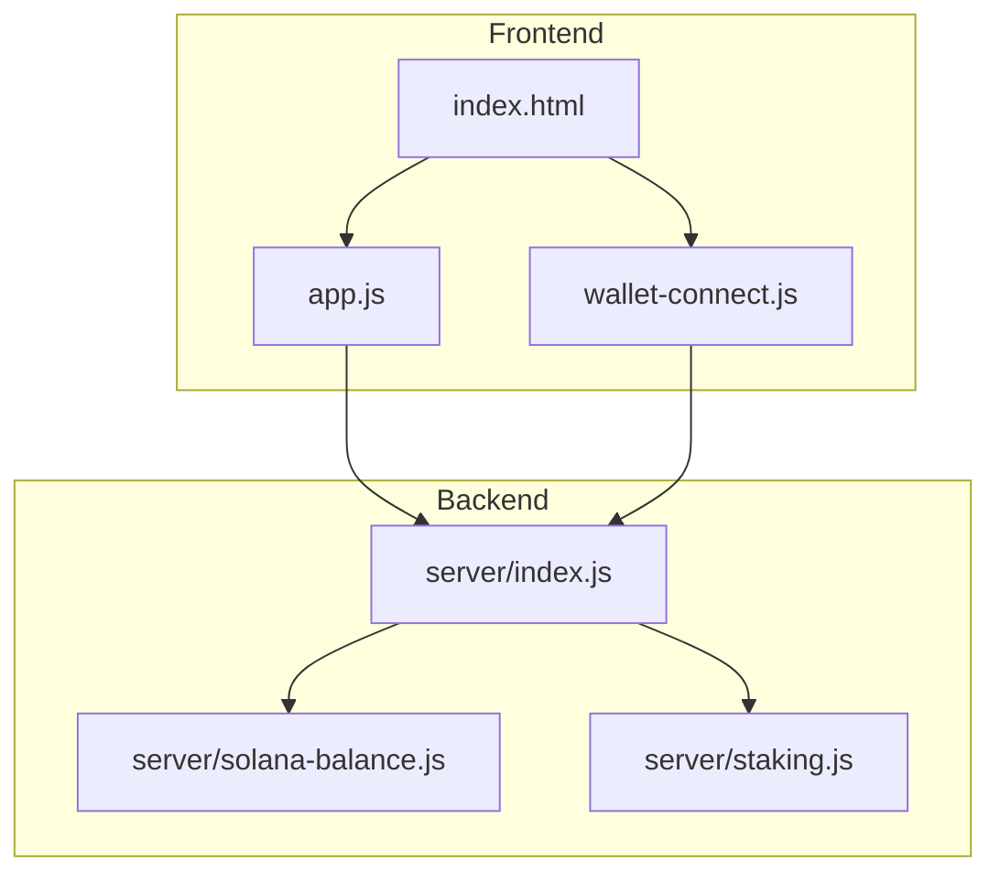
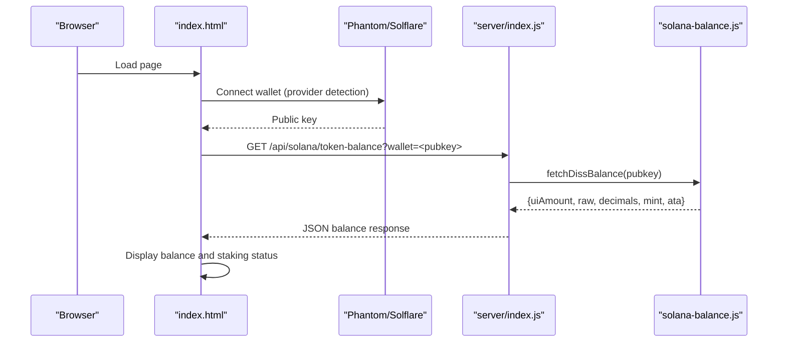
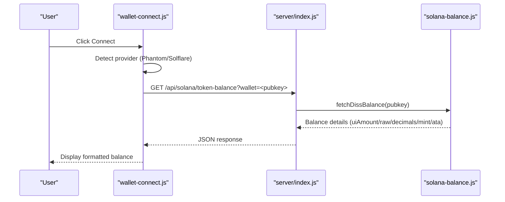
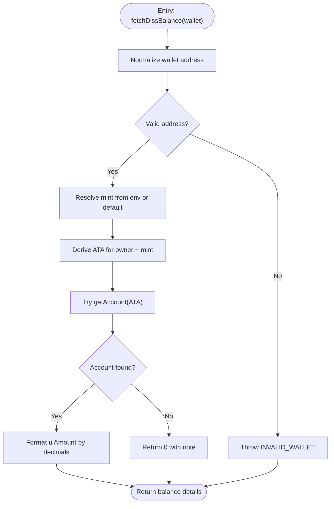
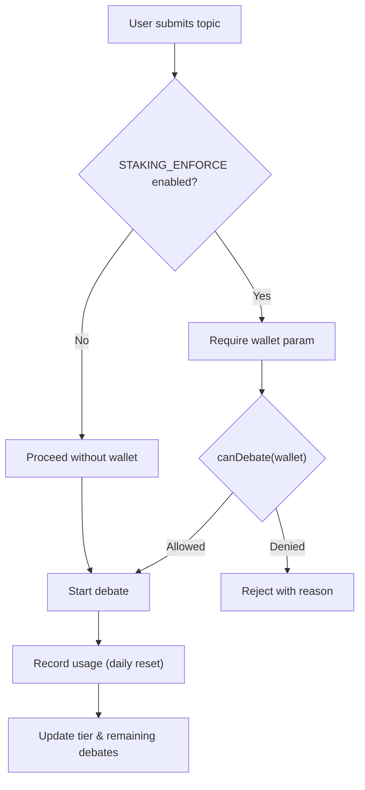
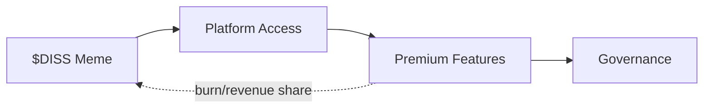
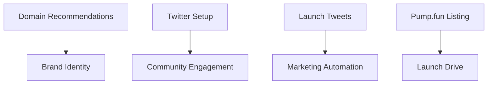
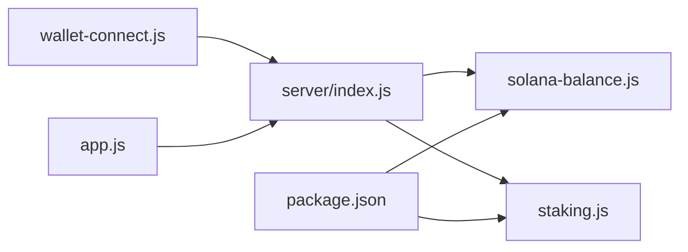

# Blockchain Integration

<cite>
**Referenced Files in This Document**
- [README.md](file://dissensus-engine/README.md)
- [package.json](file://dissensus-engine/package.json)
- [index.js](file://dissensus-engine/server/index.js)
- [solana-balance.js](file://dissensus-engine/server/solana-balance.js)
- [staking.js](file://dissensus-engine/server/staking.js)
- [wallet-connect.js](file://dissensus-engine/public/js/wallet-connect.js)
- [app.js](file://dissensus-engine/public/js/app.js)
- [index.html](file://dissensus-engine/public/index.html)
- [tokenomics.md](file://diss-launch-kit/copy/tokenomics.md)
- [domain-recommendations.md](file://diss-launch-kit/copy/domain-recommendations.md)
- [launch-tweets.md](file://diss-launch-kit/copy/launch-tweets.md)
- [pump-fun-listing.md](file://diss-launch-kit/copy/pump-fun-listing.md)
- [x-twitter-setup.md](file://diss-launch-kit/copy/x-twitter-setup.md)
- [website/index.html](file://diss-launch-kit/website/index.html)
</cite>

## Table of Contents
1. [Introduction](#introduction)
2. [Project Structure](#project-structure)
3. [Core Components](#core-components)
4. [Architecture Overview](#architecture-overview)
5. [Detailed Component Analysis](#detailed-component-analysis)
6. [Dependency Analysis](#dependency-analysis)
7. [Performance Considerations](#performance-considerations)
8. [Troubleshooting Guide](#troubleshooting-guide)
9. [Conclusion](#conclusion)
10. [Appendices](#appendices)

## Introduction
This document explains the blockchain integration for the Solana token system and meme coin infrastructure behind $DISS. It covers SPL token balance verification, simulated staking tiers, and the relationship between on-chain token holdings and platform access control. It also documents tokenomics, supply distribution, and the economic model that underpins the platform’s utility evolution. Finally, it outlines launch kit components for domains, social media, and marketing automation, along with practical examples of wallet integration, balance checking, and stake management workflows.

## Project Structure
The blockchain integration spans two primary areas:
- Frontend UI and wallet integration for Phantom/Solflare
- Backend server exposing Solana balance checks and staking status

**Diagram sources**
- [index.html:1-217](file://dissensus-engine/public/index.html#L1-L217)
- [wallet-connect.js:1-176](file://dissensus-engine/public/js/wallet-connect.js#L1-L176)
- [app.js:1-674](file://dissensus-engine/public/js/app.js#L1-L674)
- [index.js:1-481](file://dissensus-engine/server/index.js#L1-L481)
- [solana-balance.js:1-83](file://dissensus-engine/server/solana-balance.js#L1-L83)
- [staking.js:1-183](file://dissensus-engine/server/staking.js#L1-L183)

**Section sources**
- [README.md:103-109](file://dissensus-engine/README.md#L103-L109)
- [package.json:10-19](file://dissensus-engine/package.json#L10-L19)

## Core Components
- Wallet connector and balance checker: integrates Phantom/Solflare, connects wallets, and fetches $DISS SPL token balance via a server endpoint.
- Server-side balance verification: reads on-chain SPL token balance using Solana web3 and spl-token libraries.
- Simulated staking: demonstrates tiered access and debate limits based on token holdings; designed to evolve into on-chain staking.
- Tokenomics and utility evolution: defines the $DISS token model, burn mechanisms, and platform access tiers.

**Section sources**
- [wallet-connect.js:95-138](file://dissensus-engine/public/js/wallet-connect.js#L95-L138)
- [solana-balance.js:26-76](file://dissensus-engine/server/solana-balance.js#L26-L76)
- [staking.js:12-79](file://dissensus-engine/server/staking.js#L12-L79)
- [tokenomics.md:12-67](file://diss-launch-kit/copy/tokenomics.md#L12-L67)

## Architecture Overview
The system separates concerns between client and server:
- Client handles UI, wallet connection, and user actions.
- Server validates inputs, enforces limits, streams debate results, and performs read-only on-chain balance checks.

**Diagram sources**
- [index.html:1-217](file://dissensus-engine/public/index.html#L1-L217)
- [wallet-connect.js:95-138](file://dissensus-engine/public/js/wallet-connect.js#L95-L138)
- [index.js:98-111](file://dissensus-engine/server/index.js#L98-L111)
- [solana-balance.js:26-76](file://dissensus-engine/server/solana-balance.js#L26-L76)

## Detailed Component Analysis

### Wallet Integration and Balance Verification
- Provider detection supports Phantom and Solflare.
- On successful connect, the UI shortens and displays the wallet address, then calls the server endpoint to fetch the SPL token balance.
- The server validates the wallet address, queries the SPL mint and associated token account, and returns a normalized balance.

**Diagram sources**
- [wallet-connect.js:95-138](file://dissensus-engine/public/js/wallet-connect.js#L95-L138)
- [index.js:98-111](file://dissensus-engine/server/index.js#L98-L111)
- [solana-balance.js:26-76](file://dissensus-engine/server/solana-balance.js#L26-L76)

**Section sources**
- [wallet-connect.js:17-138](file://dissensus-engine/public/js/wallet-connect.js#L17-L138)
- [index.js:98-111](file://dissensus-engine/server/index.js#L98-L111)
- [solana-balance.js:26-76](file://dissensus-engine/server/solana-balance.js#L26-L76)

### Server-Side Balance Verification
- Validates wallet address format and throws a specific error for invalid inputs.
- Resolves mint decimals and derives the associated token account (ATA) for the owner.
- Reads the SPL token account and returns normalized values; on missing accounts, returns zero with a note.

**Diagram sources**
- [solana-balance.js:26-76](file://dissensus-engine/server/solana-balance.js#L26-L76)

**Section sources**
- [solana-balance.js:14-76](file://dissensus-engine/server/solana-balance.js#L14-L76)

### Simulated Staking and Access Control
- Defines tier thresholds and daily debate limits.
- Enforces debate gating when STAKING_ENFORCE is enabled.
- Demonstrates staking simulation for UI and demos; production would integrate on-chain stake programs.

**Diagram sources**
- [index.js:184-192](file://dissensus-engine/server/index.js#L184-L192)
- [app.js:228-236](file://dissensus-engine/public/js/app.js#L228-L236)
- [staking.js:110-125](file://dissensus-engine/server/staking.js#L110-L125)

**Section sources**
- [staking.js:12-79](file://dissensus-engine/server/staking.js#L12-L79)
- [index.js:184-192](file://dissensus-engine/server/index.js#L184-L192)
- [app.js:228-236](file://dissensus-engine/public/js/app.js#L228-L236)

### Tokenomics and Utility Evolution
- $DISS is an SPL token on Solana launched via pump.fun with a fair launch and bonding curve.
- Utility evolves from meme → access → premium features → governance, with burn mechanics and revenue sharing.
- Platform access tiers are defined by minimum $DISS holdings.

**Diagram sources**
- [tokenomics.md:29-53](file://diss-launch-kit/copy/tokenomics.md#L29-L53)
- [tokenomics.md:56-67](file://diss-launch-kit/copy/tokenomics.md#L56-L67)

**Section sources**
- [tokenomics.md:12-67](file://diss-launch-kit/copy/tokenomics.md#L12-L67)

### Launch Kit: Domains, Social, and Automation
- Domain recommendations emphasize .fun/.io/.xyz/.ai for crypto-native branding and availability.
- X/Twitter setup includes profile, pinned tweets, and post-launch content calendar.
- Pump.fun listing details and marketing automation templates support coordinated launches.

**Diagram sources**
- [domain-recommendations.md:1-67](file://diss-launch-kit/copy/domain-recommendations.md#L1-L67)
- [x-twitter-setup.md:1-128](file://diss-launch-kit/copy/x-twitter-setup.md#L1-L128)
- [launch-tweets.md:1-177](file://diss-launch-kit/copy/launch-tweets.md#L1-L177)
- [pump-fun-listing.md:1-36](file://diss-launch-kit/copy/pump-fun-listing.md#L1-L36)

**Section sources**
- [domain-recommendations.md:1-67](file://diss-launch-kit/copy/domain-recommendations.md#L1-L67)
- [x-twitter-setup.md:1-128](file://diss-launch-kit/copy/x-twitter-setup.md#L1-L128)
- [launch-tweets.md:1-177](file://diss-launch-kit/copy/launch-tweets.md#L1-L177)
- [pump-fun-listing.md:1-36](file://diss-launch-kit/copy/pump-fun-listing.md#L1-L36)
- [website/index.html:1-541](file://diss-launch-kit/website/index.html#L1-L541)

## Dependency Analysis
- Client depends on server endpoints for balance and staking status.
- Server depends on Solana web3 and spl-token libraries for read-only balance checks.
- Environment variables configure RPC, mint, and optional staking program ID.

**Diagram sources**
- [wallet-connect.js:1-176](file://dissensus-engine/public/js/wallet-connect.js#L1-L176)
- [app.js:1-674](file://dissensus-engine/public/js/app.js#L1-L674)
- [index.js:1-481](file://dissensus-engine/server/index.js#L1-L481)
- [solana-balance.js:1-83](file://dissensus-engine/server/solana-balance.js#L1-L83)
- [staking.js:1-183](file://dissensus-engine/server/staking.js#L1-L183)
- [package.json:10-19](file://dissensus-engine/package.json#L10-L19)

**Section sources**
- [package.json:10-19](file://dissensus-engine/package.json#L10-L19)
- [index.js:1-481](file://dissensus-engine/server/index.js#L1-L481)

## Performance Considerations
- Rate limiting protects endpoints from abuse; adjust windows and max values per environment.
- Balance and staking endpoints use moderate limits appropriate for demos; scale as traffic increases.
- Client-side balance polling should be throttled; leverage server-provided UI updates and SSE for debate streaming.

[No sources needed since this section provides general guidance]

## Troubleshooting Guide
Common issues and resolutions:
- Invalid wallet address: ensure the address is a valid Solana public key; the server returns a specific error code for invalid inputs.
- Missing token account: when a wallet has no SPL token account yet, the server returns zero with a note; prompt users to receive or fund $DISS first.
- Provider not detected: if Phantom/Solflare is not installed, the client opens a link and instructs the user to install and refresh.
- Rate limits: if receiving “Too many” responses, wait for the rate limit window to reset.

**Section sources**
- [solana-balance.js:28-44](file://dissensus-engine/server/solana-balance.js#L28-L44)
- [solana-balance.js:64-74](file://dissensus-engine/server/solana-balance.js#L64-L74)
- [wallet-connect.js:96-100](file://dissensus-engine/public/js/wallet-connect.js#L96-L100)
- [index.js:90-96](file://dissensus-engine/server/index.js#L90-L96)

## Conclusion
The $DISS blockchain integration combines a secure, read-only SPL token balance check with a simulated staking system that models future on-chain governance and access control. The launch kit provides a complete playbook for domains, social media, and marketing automation. Together, these components enable a seamless user experience from wallet connection to platform access, with clear pathways to evolve into on-chain staking and governance.

[No sources needed since this section summarizes without analyzing specific files]

## Appendices

### Example Workflows

- Wallet integration and balance checking
  - Connect Phantom/Solflare from the header.
  - The UI calls the server endpoint to fetch the SPL balance and displays it.
  - Reference paths:
    - [index.html:30-60](file://dissensus-engine/public/index.html#L30-L60)
    - [wallet-connect.js:95-138](file://dissensus-engine/public/js/wallet-connect.js#L95-L138)
    - [index.js:98-111](file://dissensus-engine/server/index.js#L98-L111)
    - [solana-balance.js:26-76](file://dissensus-engine/server/solana-balance.js#L26-L76)

- Stake management (simulated)
  - Save a wallet, refresh status, simulate stake/unstake, and observe tier benefits.
  - Reference paths:
    - [app.js:492-554](file://dissensus-engine/public/js/app.js#L492-L554)
    - [staking.js:43-79](file://dissensus-engine/server/staking.js#L43-L79)

- Relationship between blockchain activity and platform access
  - When STAKING_ENFORCE is enabled, debates require a valid wallet; daily limits depend on tier.
  - Reference paths:
    - [index.js:184-192](file://dissensus-engine/server/index.js#L184-L192)
    - [app.js:228-236](file://dissensus-engine/public/js/app.js#L228-L236)
    - [staking.js:12-79](file://dissensus-engine/server/staking.js#L12-L79)

- Tokenomics and utility evolution
  - Review supply distribution, burn mechanics, and tiered access.
  - Reference paths:
    - [tokenomics.md:12-67](file://diss-launch-kit/copy/tokenomics.md#L12-L67)

- Launch kit components
  - Domain recommendations, Twitter setup, launch tweets, and pump.fun listing.
  - Reference paths:
    - [domain-recommendations.md:1-67](file://diss-launch-kit/copy/domain-recommendations.md#L1-L67)
    - [x-twitter-setup.md:1-128](file://diss-launch-kit/copy/x-twitter-setup.md#L1-L128)
    - [launch-tweets.md:1-177](file://diss-launch-kit/copy/launch-tweets.md#L1-L177)
    - [pump-fun-listing.md:1-36](file://diss-launch-kit/copy/pump-fun-listing.md#L1-L36)
    - [website/index.html:1-541](file://diss-launch-kit/website/index.html#L1-L541)