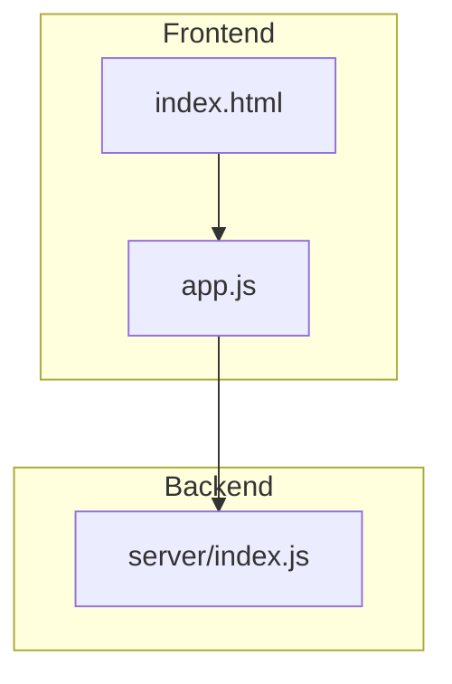
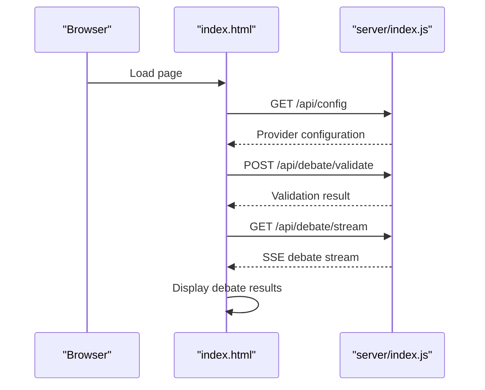
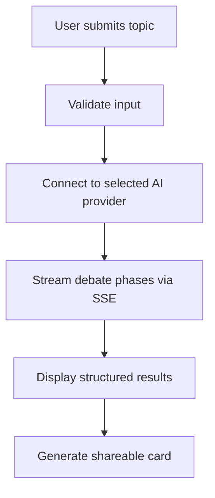
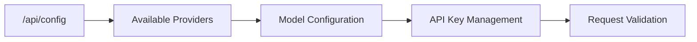
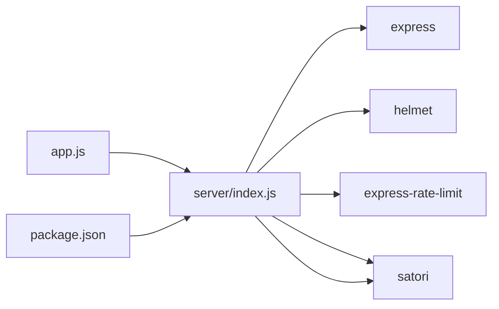

# Blockchain Integration

<cite>
**Referenced Files in This Document**
- [README.md](file://dissensus-engine/README.md)
- [package.json](file://dissensus-engine/package.json)
- [index.js](file://dissensus-engine/server/index.js)
- [app.js](file://dissensus-engine/public/js/app.js)
- [index.html](file://dissensus-engine/public/index.html)
- [website/index.html](file://diss-launch-kit/website/index.html)
</cite>

## Update Summary
**Changes Made**
- Removed all Solana blockchain integration components including wallet connection, balance checking, and staking functionality
- Updated architecture diagrams to reflect the removal of blockchain-dependent features
- Revised launch kit documentation to remove tokenomics and blockchain-specific marketing materials
- Updated troubleshooting guide to remove blockchain-related error scenarios
- Removed all references to SPL token integration, wallet providers, and blockchain-based access control

## Table of Contents
1. [Introduction](#introduction)
2. [Project Structure](#project-structure)
3. [Core Components](#core-components)
4. [Architecture Overview](#architecture-overview)
5. [Detailed Component Analysis](#detailed-component-analysis)
6. [Dependency Analysis](#dependency-analysis)
7. [Performance Considerations](#performance-considerations)
8. [Troubleshooting Guide](#troubleshooting-guide)
9. [Conclusion](#conclusion)
10. [Appendices](#appendices)

## Introduction
This document explains the current state of the Dissensus AI platform, which operates as a pure AI debate engine without blockchain integration. The platform focuses entirely on multi-agent dialectical debate functionality powered by external AI providers (DeepSeek, Gemini, OpenAI). All blockchain-dependent features including wallet connections, token balance verification, staking programs, and SPL token integration have been completely removed from the system.

**Updated** Complete removal of Solana blockchain integration including token balance checking, staking program integration, and wallet connection functionality.

## Project Structure
The platform now consists solely of frontend and backend components for AI-powered debate functionality:

**Diagram sources**
- [index.html:1-186](file://dissensus-engine/public/index.html#L1-L186)
- [app.js:1-554](file://dissensus-engine/public/js/app.js#L1-L554)
- [index.js:1-356](file://dissensus-engine/server/index.js#L1-L356)

**Section sources**
- [README.md:103-109](file://dissensus-engine/README.md#L103-L109)
- [package.json:10-19](file://dissensus-engine/package.json#L10-L19)

## Core Components
- **AI Debate Engine**: Pure AI-powered debate system with three agents (CIPHER, NOVA, PRISM) operating without blockchain dependencies
- **Provider Integration**: Supports DeepSeek, Google Gemini, and OpenAI with configurable API keys
- **Real-time Streaming**: SSE-based debate streaming with four-phase structured debate format
- **Shareable Cards**: PNG generation for social media sharing without blockchain features

**Updated** Removed all blockchain-dependent components including wallet connectors, balance verification, and staking systems.

**Section sources**
- [app.js:22-53](file://dissensus-engine/public/js/app.js#L22-L53)
- [index.js:58-99](file://dissensus-engine/server/index.js#L58-L99)
- [index.js:156-230](file://dissensus-engine/server/index.js#L156-L230)

## Architecture Overview
The system maintains a clean separation between client and server with no blockchain dependencies:

**Diagram sources**
- [index.html:1-186](file://dissensus-engine/public/index.html#L1-L186)
- [app.js:530-554](file://dissensus-engine/public/js/app.js#L530-L554)
- [index.js:124-151](file://dissensus-engine/server/index.js#L124-L151)
- [index.js:156-230](file://dissensus-engine/server/index.js#L156-L230)

## Detailed Component Analysis

### AI Debate System
- **Multi-Agent Architecture**: Three distinct AI agents (CIPHER, NOVA, PRISM) operate independently without blockchain coordination
- **Structured Debate Format**: Four-phase debate progression (Analysis, Arguments, Cross-Examination, Verdict)
- **External Provider Support**: Configurable integration with DeepSeek, Google Gemini, and OpenAI APIs

**Diagram sources**
- [app.js:208-341](file://dissensus-engine/public/js/app.js#L208-L341)
- [index.js:156-230](file://dissensus-engine/server/index.js#L156-L230)

**Section sources**
- [app.js:15-19](file://dissensus-engine/public/js/app.js#L15-L19)
- [app.js:208-341](file://dissensus-engine/public/js/app.js#L208-L341)
- [index.js:156-230](file://dissensus-engine/server/index.js#L156-L230)

### Provider Configuration and API Management
- **Dynamic Provider Selection**: Users can choose between DeepSeek, Gemini, and OpenAI with automatic model configuration
- **API Key Handling**: Supports both user-supplied keys and server-side keys for reduced friction
- **Rate Limiting**: Built-in protection against abuse with configurable limits per provider

**Diagram sources**
- [index.js:58-99](file://dissensus-engine/server/index.js#L58-L99)
- [app.js:59-100](file://dissensus-engine/public/js/app.js#L59-L100)

**Section sources**
- [index.js:58-99](file://dissensus-engine/server/index.js#L58-L99)
- [app.js:59-100](file://dissensus-engine/public/js/app.js#L59-L100)

### Shareable Card Generation
- **Social Media Integration**: Generates PNG cards for Twitter/X sharing with debate results
- **Automatic Summarization**: Optional verdict summarization when server keys are available
- **Direct Download**: One-click card generation and download functionality

**Section sources**
- [index.js:257-291](file://dissensus-engine/server/index.js#L257-L291)
- [app.js:494-527](file://dissensus-engine/public/js/app.js#L494-L527)

## Dependency Analysis
The system maintains minimal dependencies focused purely on AI debate functionality:

**Diagram sources**
- [app.js:1-554](file://dissensus-engine/public/js/app.js#L1-L554)
- [index.js:1-356](file://dissensus-engine/server/index.js#L1-L356)
- [package.json:10-17](file://dissensus-engine/package.json#L10-L17)

**Section sources**
- [package.json:10-17](file://dissensus-engine/package.json#L10-L17)
- [index.js:1-356](file://dissensus-engine/server/index.js#L1-L356)

## Performance Considerations
- **Rate Limiting**: Configured per endpoint to prevent abuse while supporting normal usage patterns
- **Memory Management**: Efficient streaming prevents memory buildup during long debates
- **Client Optimization**: Debates automatically abort after 10 minutes to prevent resource exhaustion

## Troubleshooting Guide
Common issues and resolutions for the current non-blockchain system:
- **API Key Issues**: Ensure valid API keys for chosen provider; server will reject requests without proper authentication
- **Network Connectivity**: Check internet connection and provider service availability
- **Rate Limits**: Wait for rate limit windows to reset if receiving "Too many" responses
- **Timeout Errors**: Debates exceeding 10-minute duration are automatically terminated

**Section sources**
- [index.js:145-148](file://dissensus-engine/server/index.js#L145-L148)
- [app.js:326-329](file://dissensus-engine/public/js/app.js#L326-L329)

## Conclusion
The Dissensus AI platform now operates as a pure AI-powered debate engine without any blockchain dependencies. The system provides a streamlined experience focused entirely on multi-agent debate functionality with external AI provider integration. All blockchain-related features including wallet connections, token balances, and staking have been completely removed, resulting in a simpler, more focused platform.

## Appendices

### Example Workflows

- **Basic Debate Workflow**
  - Select AI provider and model from the interface
  - Enter debate topic and click "Start Debate"
  - View real-time streaming results across four debate phases
  - Generate and download shareable cards for social media

- **Provider Configuration**
  - Choose between DeepSeek, Gemini, or OpenAI
  - Configure API keys or use server-side keys when available
  - Automatic model selection based on provider choice

- **Shareable Card Generation**
  - Create PNG cards from debate results
  - Direct download for social media sharing
  - Automatic verdict summarization when server keys are configured

**Section sources**
- [app.js:208-341](file://dissensus-engine/public/js/app.js#L208-L341)
- [index.js:156-230](file://dissensus-engine/server/index.js#L156-L230)
- [index.js:257-291](file://dissensus-engine/server/index.js#L257-L291)