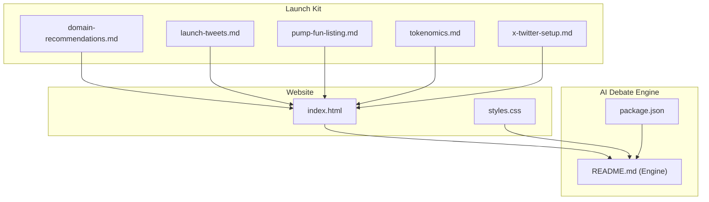
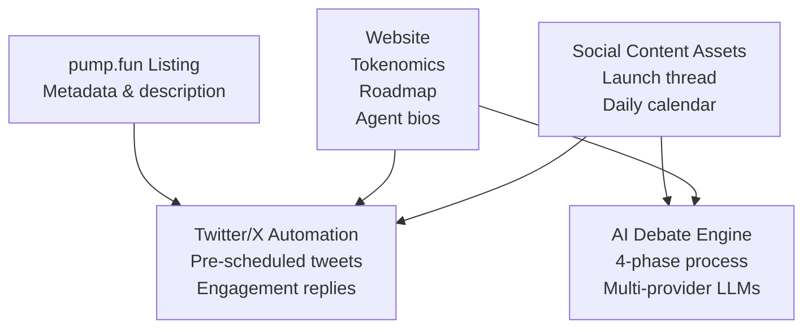
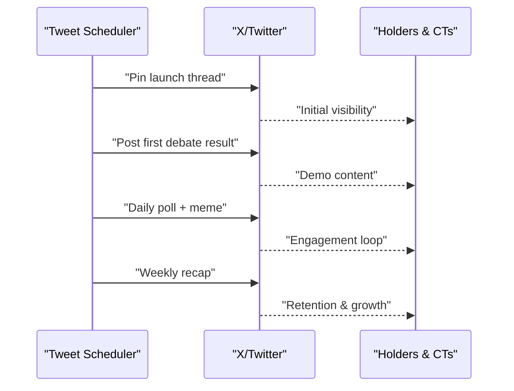
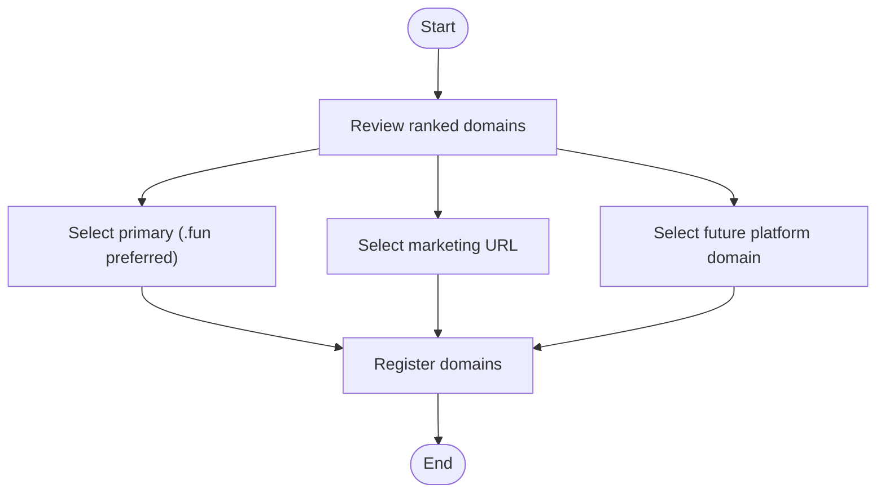
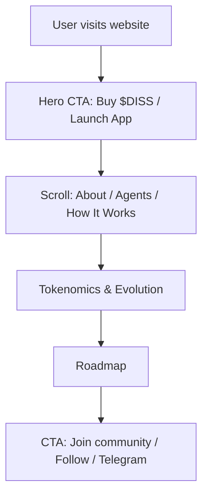
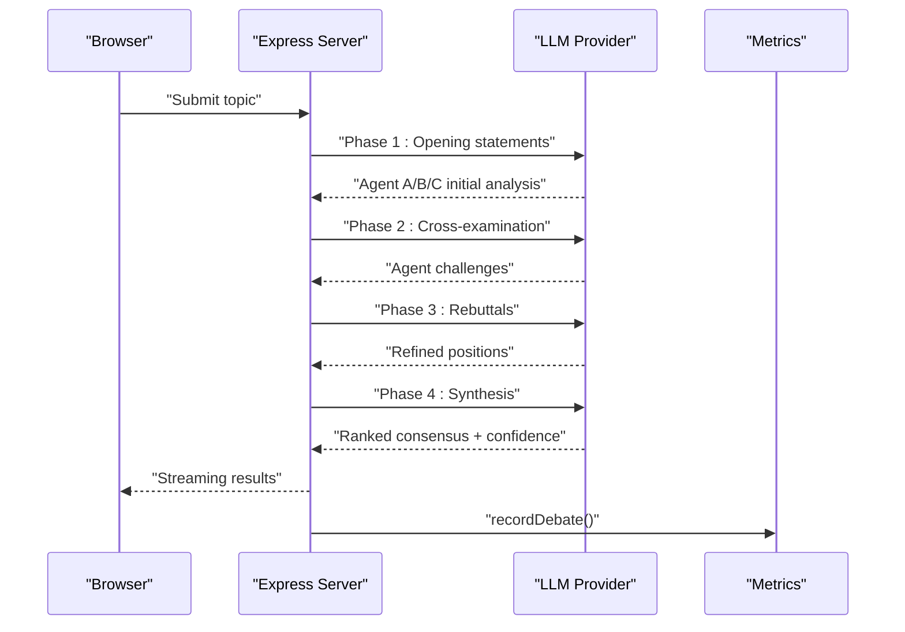
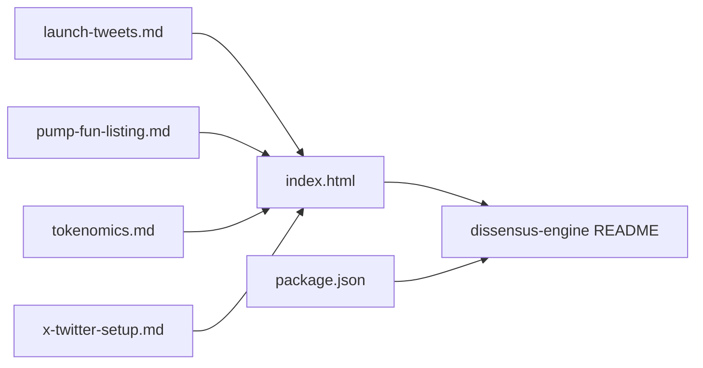

# Meme Coin Infrastructure

<cite>
**Referenced Files in This Document**
- [domain-recommendations.md](file://diss-launch-kit/copy/domain-recommendations.md)
- [launch-tweets.md](file://diss-launch-kit/copy/launch-tweets.md)
- [pump-fun-listing.md](file://diss-launch-kit/copy/pump-fun-listing.md)
- [tokenomics.md](file://diss-launch-kit/copy/tokenomics.md)
- [x-twitter-setup.md](file://diss-launch-kit/copy/x-twitter-setup.md)
- [index.html](file://diss-launch-kit/website/index.html)
- [styles.css](file://diss-launch-kit/website/styles.css)
- [README.md](file://dissensus-engine/README.md)
- [package.json](file://dissensus-engine/package.json)
- [README.md](file://README.md)
</cite>

## Table of Contents
1. [Introduction](#introduction)
2. [Project Structure](#project-structure)
3. [Core Components](#core-components)
4. [Architecture Overview](#architecture-overview)
5. [Detailed Component Analysis](#detailed-component-analysis)
6. [Dependency Analysis](#dependency-analysis)
7. [Performance Considerations](#performance-considerations)
8. [Troubleshooting Guide](#troubleshooting-guide)
9. [Conclusion](#conclusion)
10. [Appendices](#appendices)

## Introduction
This document describes the meme coin launch infrastructure and marketing automation tools for the $DISS project. It covers the launch kit materials (pre-written social content, domain recommendations, pump.fun listing details), the Twitter/X setup and engagement playbook, the website and tokenomics assets, and the AI debate engine that underpins the platform’s utility evolution. It also outlines launch sequences, community workflows, engagement tracking, technical setup requirements, best practices, regulatory considerations, and risk management strategies tailored to volatile meme markets.

## Project Structure
The repository is organized around three pillars:
- Launch kit: prewritten content, domain recommendations, and listing assets for pump.fun
- Website: landing page and marketing site for the token and platform
- AI debate engine: Node.js service that powers the platform’s utility features

**Diagram sources**
- [domain-recommendations.md:1-67](file://diss-launch-kit/copy/domain-recommendations.md#L1-L67)
- [launch-tweets.md:1-177](file://diss-launch-kit/copy/launch-tweets.md#L1-L177)
- [pump-fun-listing.md:1-36](file://diss-launch-kit/copy/pump-fun-listing.md#L1-L36)
- [tokenomics.md:1-112](file://diss-launch-kit/copy/tokenomics.md#L1-L112)
- [x-twitter-setup.md:1-128](file://diss-launch-kit/copy/x-twitter-setup.md#L1-L128)
- [index.html:1-541](file://diss-launch-kit/website/index.html#L1-L541)
- [styles.css:1-800](file://diss-launch-kit/website/styles.css#L1-L800)
- [README.md:1-206](file://dissensus-engine/README.md#L1-L206)
- [package.json:1-28](file://dissensus-engine/package.json#L1-L28)

**Section sources**
- [README.md:20-29](file://README.md#L20-L29)

## Core Components
- Pre-written social media content and calendar for launch day and post-launch engagement
- Domain recommendations optimized for pump.fun ecosystem and brand fit
- pump.fun listing metadata and token description
- Twitter/X profile setup, pinned tweets, and follow-up threads
- Website landing page with tokenomics, agent bios, and roadmap
- AI debate engine backend supporting multi-agent, adversarial debate orchestration

**Section sources**
- [launch-tweets.md:1-177](file://diss-launch-kit/copy/launch-tweets.md#L1-L177)
- [domain-recommendations.md:1-67](file://diss-launch-kit/copy/domain-recommendations.md#L1-L67)
- [pump-fun-listing.md:1-36](file://diss-launch-kit/copy/pump-fun-listing.md#L1-L36)
- [x-twitter-setup.md:1-128](file://diss-launch-kit/copy/x-twitter-setup.md#L1-L128)
- [index.html:1-541](file://diss-launch-kit/website/index.html#L1-L541)
- [README.md:1-206](file://dissensus-engine/README.md#L1-L206)

## Architecture Overview
The launch infrastructure integrates content assets, social automation, and the platform backend:
- Social content assets feed automated posting and engagement workflows
- Website serves as the central hub for token, product, and community information
- AI debate engine provides the utility backbone that transforms $DISS from meme to utility

[No sources needed since this diagram shows conceptual workflow, not actual code structure]

## Detailed Component Analysis

### Launch Kit: Social Media Content and Automation Playbook
- Launch day tweet thread and pinned post
- Daily content calendar covering first week post-launch
- Hashtags and engagement tactics (reply to comments, quote tweets, polls, screenshots)
- Automated scheduling recommendations and engagement reply templates

**Diagram sources**
- [launch-tweets.md:105-177](file://diss-launch-kit/copy/launch-tweets.md#L105-L177)

**Section sources**
- [launch-tweets.md:1-177](file://diss-launch-kit/copy/launch-tweets.md#L1-L177)

### Domain Recommendations and Strategy
- Ranked domain list optimized for pump.fun ecosystem and brand fit
- Recommended registrar list (crypto-friendly)
- Strategic triad: primary website, marketing URL, and future platform domain

**Diagram sources**
- [domain-recommendations.md:20-67](file://diss-launch-kit/copy/domain-recommendations.md#L20-L67)

**Section sources**
- [domain-recommendations.md:1-67](file://diss-launch-kit/copy/domain-recommendations.md#L1-L67)

### pump.fun Listing Metadata and Token Description
- Token name, ticker, image, and description aligned with the brand narrative
- Emphasis on adversarial AI debate and platform roadmap

**Section sources**
- [pump-fun-listing.md:1-36](file://diss-launch-kit/copy/pump-fun-listing.md#L1-L36)

### Twitter/X Setup and Engagement Playbook
- Profile name, handle recommendations, bio options, and visual assets
- Pinned tweet and follow-up threads for launch day
- Engagement tactics: reply to comments, quote tweets, polls, and meme templates

**Section sources**
- [x-twitter-setup.md:1-128](file://diss-launch-kit/copy/x-twitter-setup.md#L1-L128)

### Website: Landing Page, Tokenomics, and Roadmap
- Hero section with CTA buttons to buy on pump.fun and launch the app
- Sections for “What is Dissensus,” “The Agents,” “How It Works,” “Tokenomics,” and “Roadmap”
- Responsive design and interactive elements (navigation, scroll animations, contract copy)

**Diagram sources**
- [index.html:40-415](file://diss-launch-kit/website/index.html#L40-L415)

**Section sources**
- [index.html:1-541](file://diss-launch-kit/website/index.html#L1-L541)
- [styles.css:1-800](file://diss-launch-kit/website/styles.css#L1-L800)

### AI Debate Engine: Backend Orchestration
- Multi-agent, 4-phase debate process with adversarial testing
- Support for multiple providers (DeepSeek, Gemini, OpenAI) with cost and speed trade-offs
- Metrics dashboard and simulated staking for transparency and tiered access
- Solana integration for token balance checks and future on-chain staking

**Diagram sources**
- [README.md:15-21](file://dissensus-engine/README.md#L15-L21)
- [README.md:56-64](file://dissensus-engine/README.md#L56-L64)

**Section sources**
- [README.md:1-206](file://dissensus-engine/README.md#L1-L206)
- [package.json:1-28](file://dissensus-engine/package.json#L1-L28)

### Tokenomics and Utility Evolution
- Fair launch on pump.fun with zero pre-mine and auto LP burn
- Token utility phases: meme → access → premium → governance
- Burn mechanisms and demand drivers tied to platform usage and governance participation

**Section sources**
- [tokenomics.md:1-112](file://diss-launch-kit/copy/tokenomics.md#L1-L112)

## Dependency Analysis
- Website depends on launch kit content assets (images, descriptions) and pump.fun metadata
- AI debate engine supports website’s platform claims and provides transparency via metrics
- Social content assets depend on website copy and token description for consistency

**Diagram sources**
- [launch-tweets.md:1-177](file://diss-launch-kit/copy/launch-tweets.md#L1-L177)
- [pump-fun-listing.md:1-36](file://diss-launch-kit/copy/pump-fun-listing.md#L1-L36)
- [tokenomics.md:1-112](file://diss-launch-kit/copy/tokenomics.md#L1-L112)
- [x-twitter-setup.md:1-128](file://diss-launch-kit/copy/x-twitter-setup.md#L1-L128)
- [index.html:1-541](file://diss-launch-kit/website/index.html#L1-L541)
- [README.md:1-206](file://dissensus-engine/README.md#L1-L206)
- [package.json:1-28](file://dissensus-engine/package.json#L1-L28)

**Section sources**
- [README.md:20-29](file://README.md#L20-L29)

## Performance Considerations
- Optimize image assets (profile pictures, banners, hero visuals) for fast load times on the landing page
- Minimize third-party fonts and ensure efficient CSS delivery
- For the AI debate engine, choose cost-effective providers for demos and reserve higher-tier models for premium tiers
- Use caching and CDN for static assets; leverage browser caching for repeat visitor engagement

[No sources needed since this section provides general guidance]

## Troubleshooting Guide
- Website navigation and animations: verify IntersectionObserver support and mobile menu toggles
- Contract address copy: ensure DOM element exists and clipboard API permissions are granted
- Social automation: confirm scheduled posts align with website content and token description
- AI debate engine: validate API keys, provider quotas, and server-side rate limiting; check metrics dashboard for errors

**Section sources**
- [index.html:436-541](file://diss-launch-kit/website/index.html#L436-L541)
- [README.md:182-187](file://dissensus-engine/README.md#L182-L187)

## Conclusion
The $DISS launch infrastructure combines ready-to-use social content, strategic domain selection, pump.fun listing assets, and a robust website that communicates the meme-to-utility evolution. Behind the scenes, the AI debate engine provides the utility foundation that transforms token speculation into platform access, premium features, and governance. By following the launch sequences, engagement workflows, and technical setup outlined here, teams can maximize visibility, community growth, and long-term platform adoption.

[No sources needed since this section summarizes without analyzing specific files]

## Appendices

### Launch Sequences and Community Workflows
- Pre-launch: finalize domains, schedule launch tweets, prepare daily content calendar
- Launch day: pin thread, post first debate demo, engage with every comment
- Post-launch: daily polls, meme templates, weekly recaps, and CT collaboration
- Ongoing: track holders, debates, burn volume, and API integrations

**Section sources**
- [launch-tweets.md:105-177](file://diss-launch-kit/copy/launch-tweets.md#L105-L177)
- [tokenomics.md:101-107](file://diss-launch-kit/copy/tokenomics.md#L101-L107)

### Technical Setup Requirements
- Social media automation: use a scheduler with API access; align content with website and token description
- Website: host static assets; ensure responsive design and fast load times
- AI debate engine: configure API keys, choose providers, enable metrics, and prepare for VPS deployment

**Section sources**
- [x-twitter-setup.md:1-128](file://diss-launch-kit/copy/x-twitter-setup.md#L1-L128)
- [index.html:1-541](file://diss-launch-kit/website/index.html#L1-L541)
- [README.md:35-77](file://dissensus-engine/README.md#L35-L77)

### Best Practices and Risk Management
- Regulatory disclosures: include disclaimers on the website and social profiles
- Market volatility: avoid FOMO-driven messaging; emphasize long-term utility evolution
- Community safety: moderate engagement, avoid pump-and-dump rhetoric, and promote critical thinking
- Operational resilience: maintain redundant domains, secure API keys, and clear escalation paths

[No sources needed since this section provides general guidance]