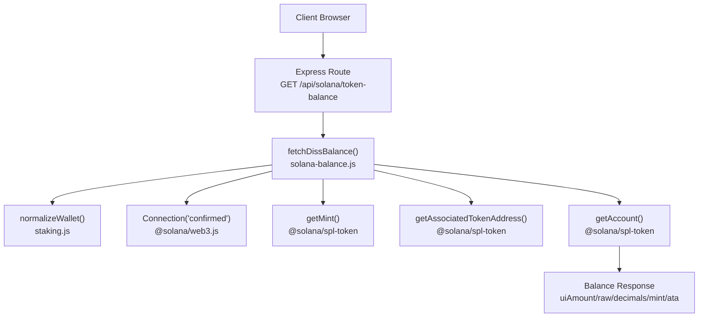
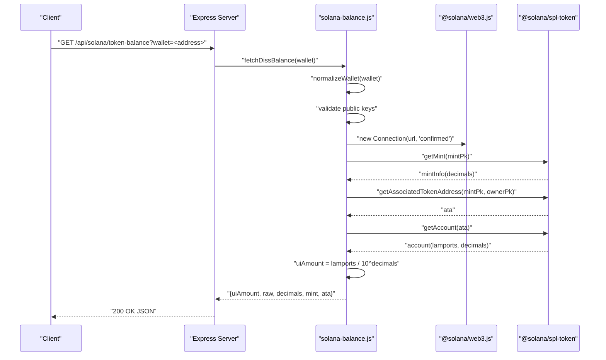
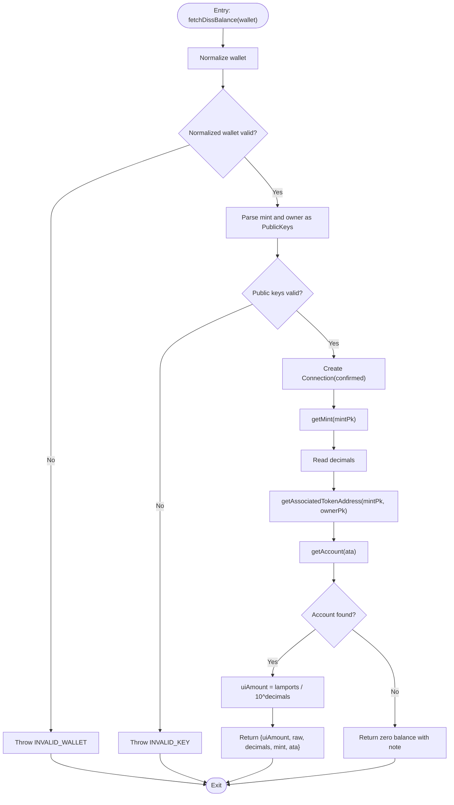
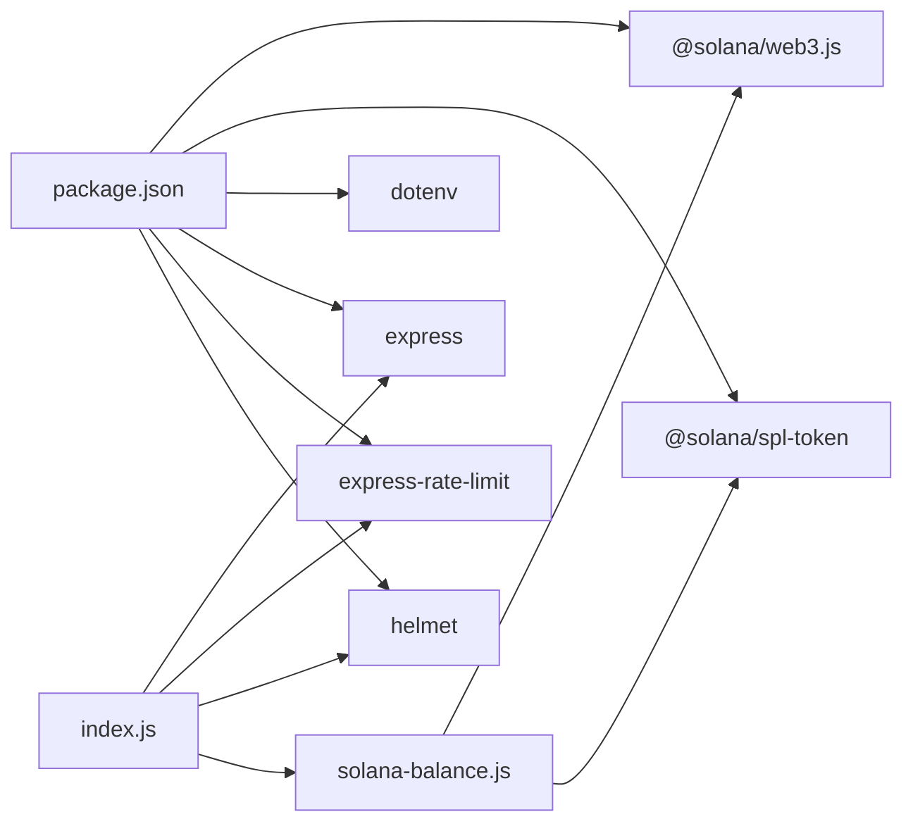

# Solana Token System

<cite>
**Referenced Files in This Document**
- [package.json](file://dissensus-engine/package.json)
- [solana-balance.js](file://dissensus-engine/server/solana-balance.js)
- [index.js](file://dissensus-engine/server/index.js)
- [staking.js](file://dissensus-engine/server/staking.js)
- [README.md](file://dissensus-engine/README.md)
</cite>

## Table of Contents
1. [Introduction](#introduction)
2. [Project Structure](#project-structure)
3. [Core Components](#core-components)
4. [Architecture Overview](#architecture-overview)
5. [Detailed Component Analysis](#detailed-component-analysis)
6. [Dependency Analysis](#dependency-analysis)
7. [Performance Considerations](#performance-considerations)
8. [Troubleshooting Guide](#troubleshooting-guide)
9. [Conclusion](#conclusion)

## Introduction
This document explains the Solana token system integration for the Dissensus AI engine. It focuses on the SPL token implementation using the @solana/spl-token library, covering mint address configuration, associated token account (ATA) creation, balance verification, RPC connection handling, and error management. It also documents wallet address normalization, public key validation, token account lookup procedures, examples of balance retrieval and decimal handling, zero-balance scenarios, security considerations for blockchain interactions, RPC endpoint configuration, environment variable management, and troubleshooting guidance for common issues.

## Project Structure
The Solana token integration resides in the dissensus-engine server module and is composed of:
- A dedicated balance checker that performs SPL token queries server-side
- An Express route that exposes a read-only endpoint for balance retrieval
- Wallet normalization utilities shared across the system
- Environment-driven configuration for RPC endpoints and mint addresses

**Diagram sources**
- [index.js:98-111](file://dissensus-engine/server/index.js#L98-L111)
- [solana-balance.js:26-76](file://dissensus-engine/server/solana-balance.js#L26-L76)
- [staking.js:147-154](file://dissensus-engine/server/staking.js#L147-L154)

**Section sources**
- [README.md:103-108](file://dissensus-engine/README.md#L103-L108)
- [package.json:10-19](file://dissensus-engine/package.json#L10-L19)

## Core Components
- Solana balance endpoint: GET /api/solana/token-balance
  - Validates query parameter wallet
  - Delegates balance retrieval to fetchDissBalance
  - Returns standardized JSON response or appropriate HTTP status codes
- fetchDissBalance(walletAddress): Core function performing:
  - Wallet normalization
  - Public key validation
  - RPC connection setup
  - Mint metadata retrieval (decimals)
  - ATA derivation
  - Token account lookup and balance conversion
  - Zero-balance handling for missing accounts
- Wallet normalization: normalizeWallet(raw)
  - Trims whitespace and validates length range typical for Solana base58 addresses
- Environment configuration:
  - SOLANA_RPC_URL: RPC endpoint for balance checks
  - DISS_TOKEN_MINT: SPL mint address for $DISS
  - SOLANA_CLUSTER: Cluster identifier exposed via /api/config

**Section sources**
- [index.js:98-111](file://dissensus-engine/server/index.js#L98-L111)
- [solana-balance.js:26-82](file://dissensus-engine/server/solana-balance.js#L26-L82)
- [staking.js:147-154](file://dissensus-engine/server/staking.js#L147-L154)
- [README.md:138-148](file://dissensus-engine/README.md#L138-L148)

## Architecture Overview
The system follows a server-side read-only pattern for SPL balances:
- Client requests balance via a protected endpoint
- Server normalizes the wallet address
- Server constructs a confirmed RPC connection
- Server retrieves mint decimals and derives the ATA
- Server reads the token account and converts raw lamports to UI amount using decimals
- Server returns a structured response with both raw and UI amounts

**Diagram sources**
- [index.js:98-111](file://dissensus-engine/server/index.js#L98-L111)
- [solana-balance.js:26-76](file://dissensus-engine/server/solana-balance.js#L26-L76)

## Detailed Component Analysis

### fetchDissBalance Function Workflow
- Input normalization: normalizeWallet(walletAddress) ensures a trimmed, plausible base58 string
- Validation: attempts to construct PublicKey instances for mint and owner
- RPC setup: creates a confirmed Connection using SOLANA_RPC_URL or default
- Mint resolution: retrieves SPL mint metadata to obtain decimals
- ATA derivation: computes associated token account address for the given mint and owner
- Account lookup: fetches the token account; if missing, returns zero-balance with a note
- Output: standardized object containing UI amount, raw lamports, decimals, mint, and ATA

**Diagram sources**
- [solana-balance.js:26-76](file://dissensus-engine/server/solana-balance.js#L26-L76)

**Section sources**
- [solana-balance.js:26-76](file://dissensus-engine/server/solana-balance.js#L26-L76)

### Wallet Address Normalization and Public Key Validation
- normalizeWallet enforces:
  - Non-empty input
  - Trimmed string
  - Length within typical Solana base58 pubkey range
- Public key validation occurs via PublicKey constructor; invalid inputs cause INVALID_KEY error
- These checks occur before RPC calls to fail fast and avoid unnecessary network requests

**Section sources**
- [staking.js:147-154](file://dissensus-engine/server/staking.js#L147-L154)
- [solana-balance.js:27-44](file://dissensus-engine/server/solana-balance.js#L27-L44)

### Associated Token Account (ATA) Creation and Lookup
- ATA is derived deterministically using getAssociatedTokenAddress(mintPk, ownerPk)
- The system does not create ATAs; it only looks up existing ones
- If the ATA does not exist, the function returns zero balance with a note indicating the account is unfunded

**Section sources**
- [solana-balance.js:50-75](file://dissensus-engine/server/solana-balance.js#L50-L75)

### Balance Verification and Decimal Handling
- Raw balance is stored in the SPL token account as lamports
- UI amount is computed by dividing raw by 10^decimals
- The response includes both raw and UI amounts for flexibility

Examples (conceptual):
- Raw balance: 123456789 lamports
- Decimals: 9
- UI amount: 123456789 / 10^9 = 123.456789
- Zero-balance scenario: no account found → uiAmount: 0, raw: "0", note included

**Section sources**
- [solana-balance.js:54-61](file://dissensus-engine/server/solana-balance.js#L54-L61)

### RPC Connection Handling and Environment Configuration
- RPC URL is resolved from SOLANA_RPC_URL with a safe default
- Connection is created with commitment level "confirmed"
- Mint address is resolved from DISS_TOKEN_MINT with a safe default
- Cluster identifier is exposed via /api/config

**Section sources**
- [solana-balance.js:14-20](file://dissensus-engine/server/solana-balance.js#L14-L20)
- [index.js:79-84](file://dissensus-engine/server/index.js#L79-L84)
- [README.md:143-144](file://dissensus-engine/README.md#L143-L144)

### Error Management Strategies
- Invalid wallet: returns 400 with INVALID_WALLET
- Invalid public key: returns 500 with generic message; caller should handle INVALID_KEY
- Missing token account: returns zero balance with explanatory note
- Other RPC/network errors: logged and returned as 500 with generic message

**Section sources**
- [index.js:104-110](file://dissensus-engine/server/index.js#L104-L110)
- [solana-balance.js:28-32](file://dissensus-engine/server/solana-balance.js#L28-L32)
- [solana-balance.js:40-44](file://dissensus-engine/server/solana-balance.js#L40-L44)
- [solana-balance.js:64-74](file://dissensus-engine/server/solana-balance.js#L64-L74)

### Security Considerations
- Private keys are never handled on the server; only public addresses are used
- RPC keys remain on the server; clients do not receive RPC credentials
- Rate limiting protects against abuse
- Helmet middleware is applied for basic web security headers
- Environment variables control sensitive configuration

**Section sources**
- [index.js:50-55](file://dissensus-engine/server/index.js#L50-L55)
- [index.js:90-96](file://dissensus-engine/server/index.js#L90-L96)
- [README.md:182-186](file://dissensus-engine/README.md#L182-L186)

## Dependency Analysis
External libraries and their roles:
- @solana/web3.js: Connection, PublicKey
- @solana/spl-token: getMint, getAssociatedTokenAddress, getAccount, TOKEN_PROGRAM_ID
- dotenv: loads environment variables from .env
- express: HTTP server and routing
- express-rate-limit: rate limiting
- helmet: security headers

**Diagram sources**
- [package.json:10-19](file://dissensus-engine/package.json#L10-L19)
- [solana-balance.js:7-8](file://dissensus-engine/server/solana-balance.js#L7-L8)
- [index.js:6-10](file://dissensus-engine/server/index.js#L6-L10)

**Section sources**
- [package.json:10-19](file://dissensus-engine/package.json#L10-L19)

## Performance Considerations
- Use confirmed commitment for balance checks to reduce reorg risk while maintaining reasonable speed
- Cache frequently accessed mint metadata if scaling horizontally
- Consider connection pooling or reusing a single Connection instance per process
- Monitor RPC latency and availability; configure multiple RPC endpoints behind load balancing for high availability
- Apply rate limiting to protect RPC resources and prevent abuse

## Troubleshooting Guide
Common issues and resolutions:
- Invalid wallet address
  - Cause: Wallet not normalized or outside expected length range
  - Resolution: Ensure the wallet is a valid base58 string within typical Solana pubkey length
  - Reference: [normalizeWallet:147-154](file://dissensus-engine/server/staking.js#L147-L154)
- Invalid mint or wallet public key
  - Cause: Malformed or unsupported public key format
  - Resolution: Verify SOLANA_RPC_URL and DISS_TOKEN_MINT values; confirm they resolve to valid PublicKeys
  - Reference: [PublicKey construction:37-44](file://dissensus-engine/server/solana-balance.js#L37-L44)
- Missing token account (zero balance)
  - Cause: ATA does not exist for the given owner
  - Resolution: Fund the wallet or receive tokens; the endpoint will reflect zero balance with a note
  - Reference: [Zero-balance handling:64-74](file://dissensus-engine/server/solana-balance.js#L64-L74)
- Network connectivity problems
  - Cause: RPC endpoint unreachable or rate-limited
  - Resolution: Check SOLANA_RPC_URL; consider switching to a reliable RPC provider; review rate limits
  - Reference: [RPC URL resolution:14-16](file://dissensus-engine/server/solana-balance.js#L14-L16)
- Excessive requests
  - Cause: Client hitting rate limits
  - Resolution: Reduce polling frequency; implement client-side caching
  - Reference: [Rate limit configuration:90-96](file://dissensus-engine/server/index.js#L90-L96)

**Section sources**
- [solana-balance.js:28-32](file://dissensus-engine/server/solana-balance.js#L28-L32)
- [solana-balance.js:40-44](file://dissensus-engine/server/solana-balance.js#L40-L44)
- [solana-balance.js:64-74](file://dissensus-engine/server/solana-balance.js#L64-L74)
- [index.js:90-96](file://dissensus-engine/server/index.js#L90-L96)

## Conclusion
The Solana token system integration is designed as a secure, server-side read-only balance checker. It leverages @solana/web3.js and @solana/spl-token to derive ATAs, fetch mint metadata, and convert raw balances to UI amounts. Environment variables control RPC endpoints and mint addresses, while robust error handling and rate limiting ensure reliability. By following the documented patterns and troubleshooting steps, developers can integrate and operate the system safely and efficiently.