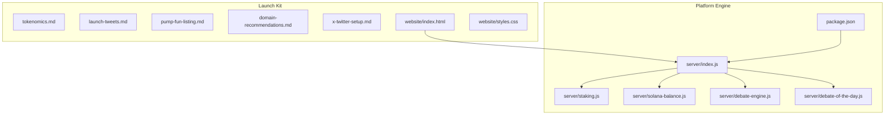
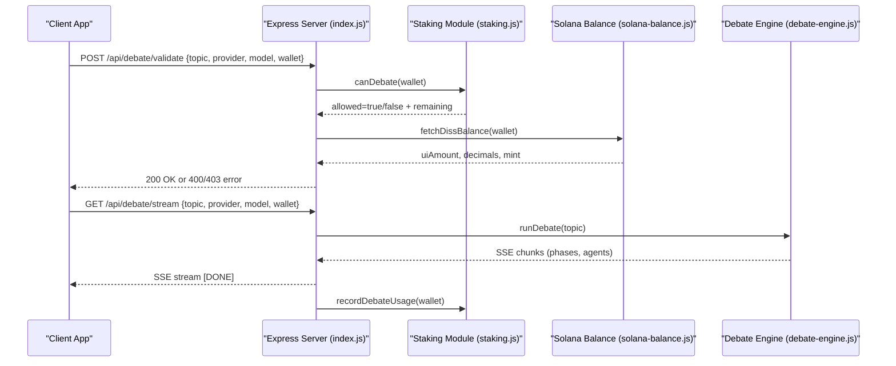
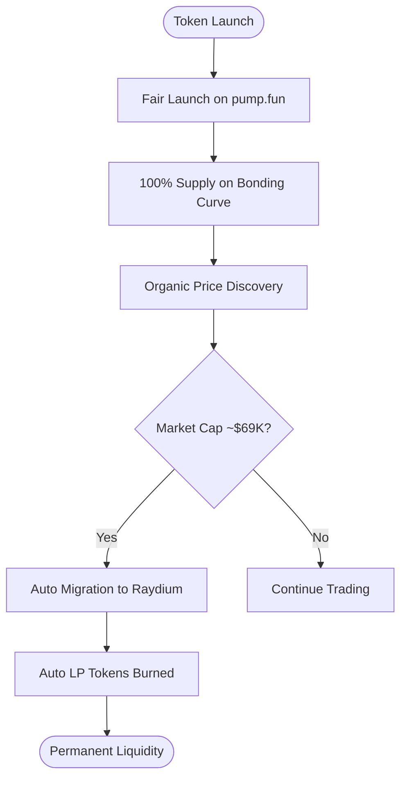
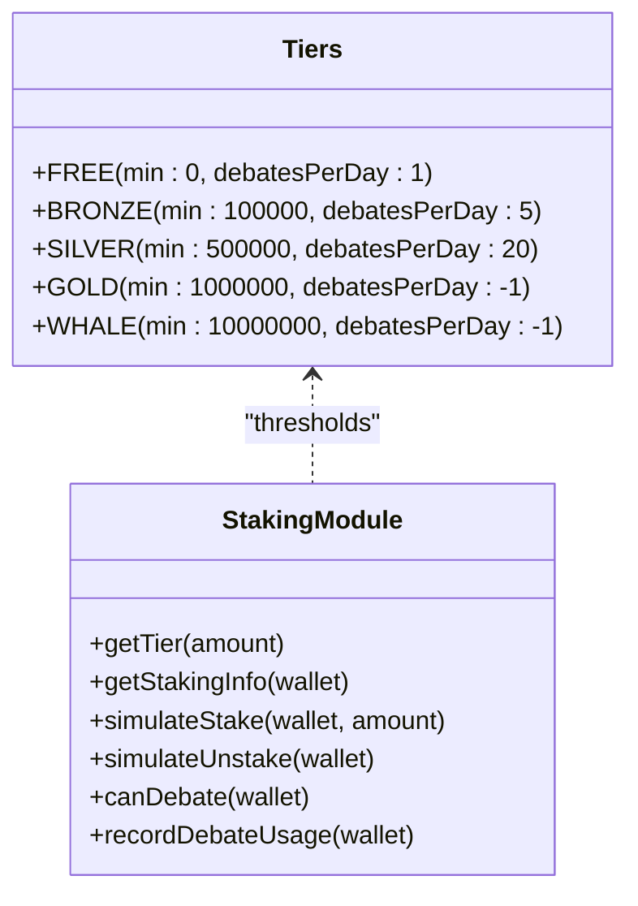
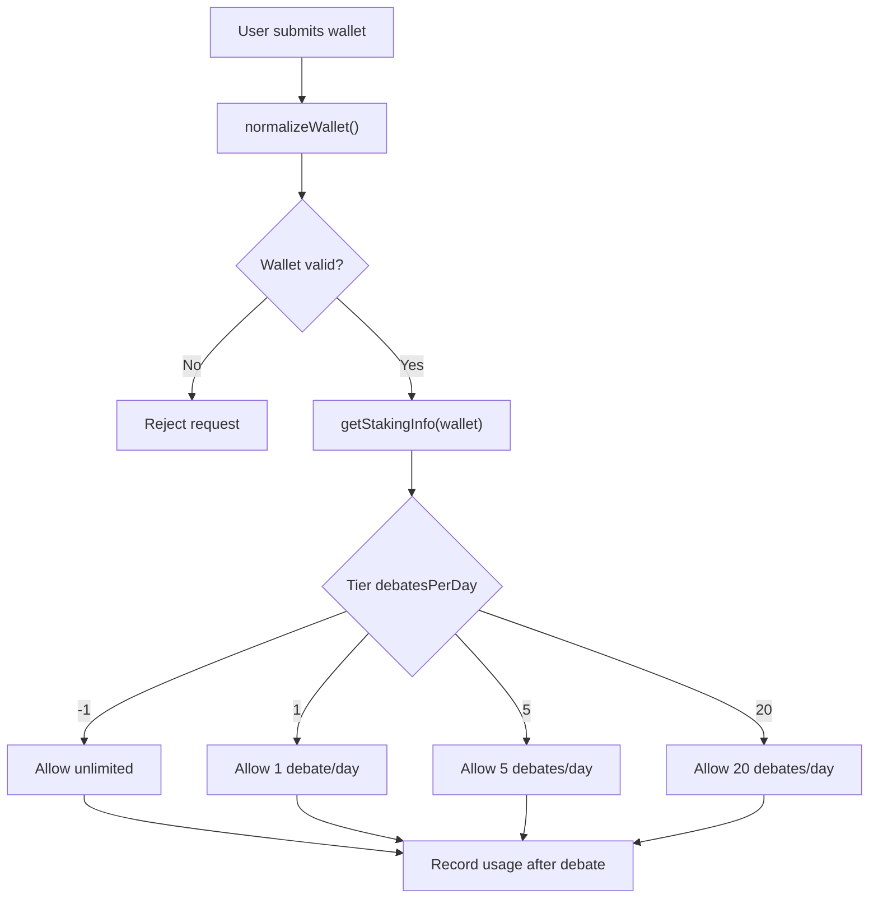
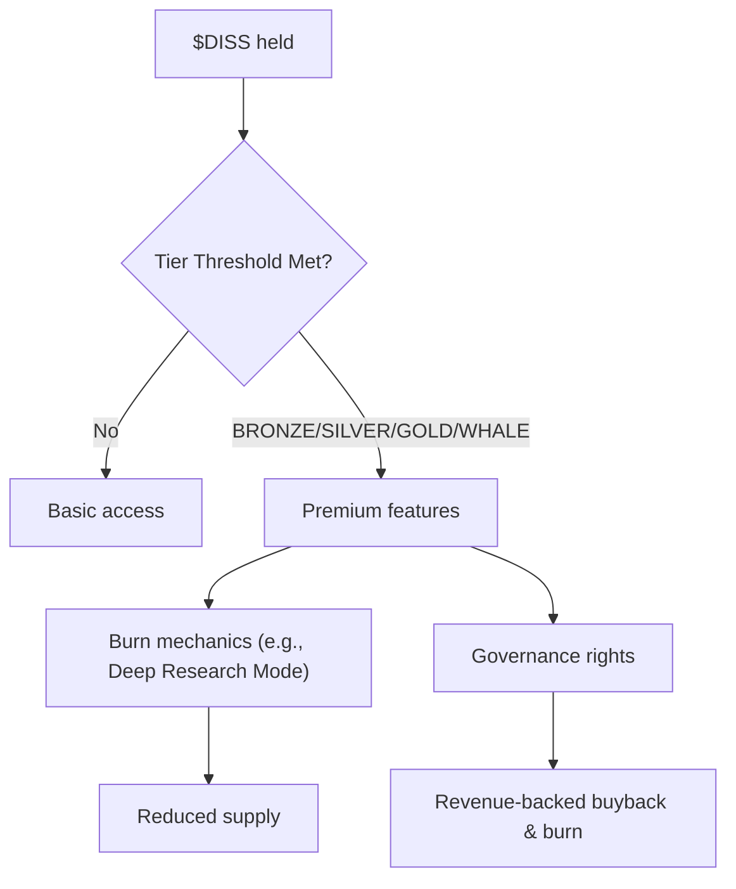
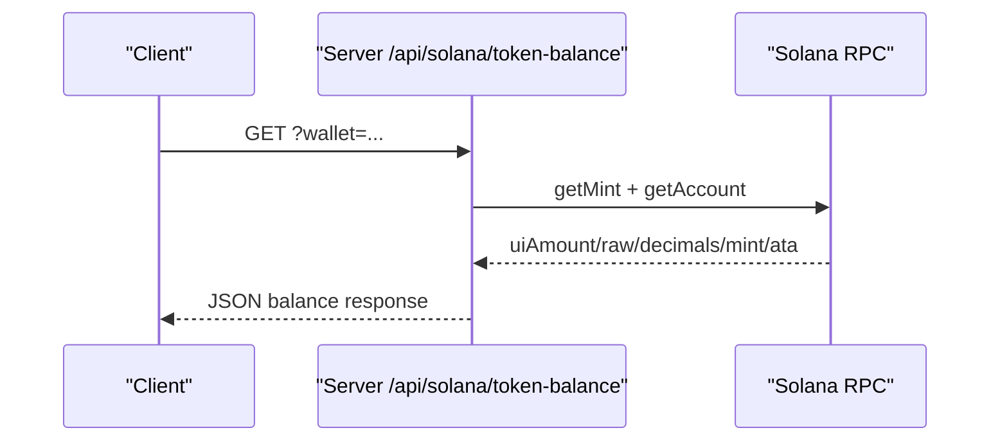
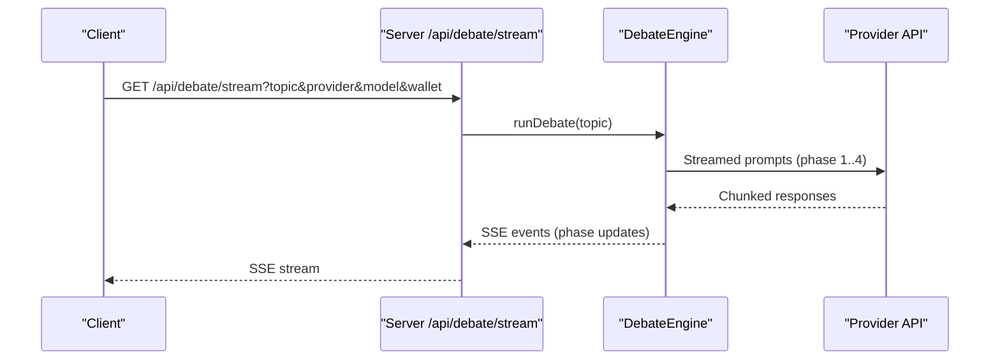
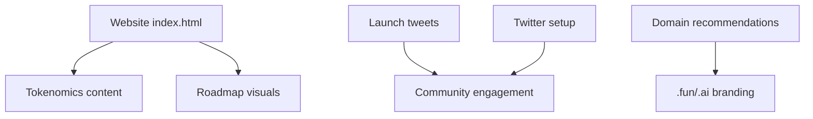
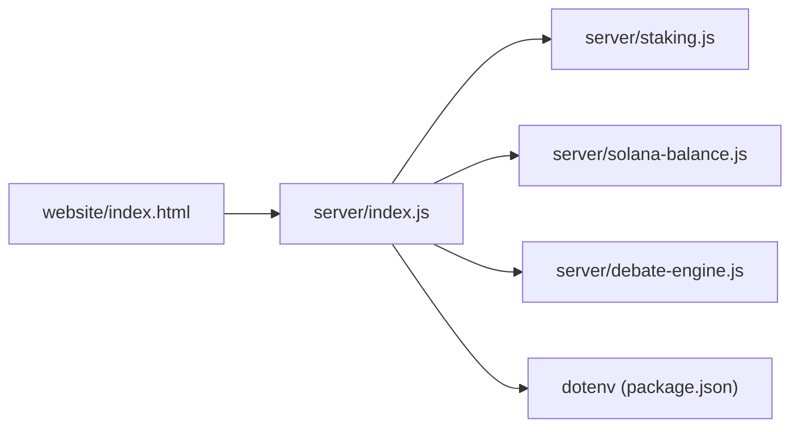

# Tokenomics & Economic Model

<cite>
**Referenced Files in This Document**
- [tokenomics.md](file://diss-launch-kit/copy/tokenomics.md)
- [launch-tweets.md](file://diss-launch-kit/copy/launch-tweets.md)
- [pump-fun-listing.md](file://diss-launch-kit/copy/pump-fun-listing.md)
- [domain-recommendations.md](file://diss-launch-kit/copy/domain-recommendations.md)
- [x-twitter-setup.md](file://diss-launch-kit/copy/x-twitter-setup.md)
- [index.html](file://diss-launch-kit/website/index.html)
- [styles.css](file://diss-launch-kit/website/styles.css)
- [staking.js](file://dissensus-engine/server/staking.js)
- [solana-balance.js](file://dissensus-engine/server/solana-balance.js)
- [debate-engine.js](file://dissensus-engine/server/debate-engine.js)
- [debate-of-the-day.js](file://dissensus-engine/server/debate-of-the-day.js)
- [index.js](file://dissensus-engine/server/index.js)
- [package.json](file://dissensus-engine/package.json)
</cite>

## Table of Contents
1. [Introduction](#introduction)
2. [Project Structure](#project-structure)
3. [Core Components](#core-components)
4. [Architecture Overview](#architecture-overview)
5. [Detailed Component Analysis](#detailed-component-analysis)
6. [Dependency Analysis](#dependency-analysis)
7. [Performance Considerations](#performance-considerations)
8. [Troubleshooting Guide](#troubleshooting-guide)
9. [Conclusion](#conclusion)
10. [Appendices](#appendices)

## Introduction
This document explains the $DISS token economic model and tokenomics as implemented in the repository. It covers the token’s supply and distribution, utility evolution across phases, access tiers driven by token holdings, staking mechanics, daily debate limits, premium feature gating, launch strategy, community incentives, sustainability model, revenue streams, and buyback/burn mechanisms. It also connects blockchain activity (Solana SPL token) to platform monetization and growth.

## Project Structure
The repository organizes tokenomics assets and platform logic into two primary areas:
- Launch kit: marketing, tokenomics copy, and website assets that communicate the token model externally.
- Platform engine: server-side logic that simulates staking, validates access tiers, integrates with Solana for token balance checks, and orchestrates debates.

**Diagram sources**
- [index.html:1-541](file://diss-launch-kit/website/index.html#L1-L541)
- [index.js:1-481](file://dissensus-engine/server/index.js#L1-L481)
- [staking.js:1-183](file://dissensus-engine/server/staking.js#L1-183)
- [solana-balance.js:1-83](file://dissensus-engine/server/solana-balance.js#L1-83)
- [debate-engine.js:1-389](file://dissensus-engine/server/debate-engine.js#L1-389)
- [debate-of-the-day.js:1-80](file://dissensus-engine/server/debate-of-the-day.js#L1-80)
- [package.json:1-28](file://dissensus-engine/package.json#L1-28)

**Section sources**
- [index.html:1-541](file://diss-launch-kit/website/index.html#L1-L541)
- [index.js:1-481](file://dissensus-engine/server/index.js#L1-L481)

## Core Components
- Token supply and distribution: fair launch on pump.fun with bonding curve, auto LP burn, and Raydium migration.
- Token utility phases: meme → platform access → premium features → governance.
- Access tiers: FREE, BRONZE, SILVER, GOLD, WHALE, governed by simulated staking thresholds.
- Daily debate limits: enforced by staking module with per-wallet reset.
- Premium features: custom agents, Deep Research Mode (burn), private debates, API access.
- Sustainability: burn mechanics, governance-driven buybacks, and developer monetization via API.
- Blockchain integration: Solana SPL token balance reads and mint configuration.

**Section sources**
- [tokenomics.md:1-112](file://diss-launch-kit/copy/tokenomics.md#L1-L112)
- [staking.js:12-19](file://dissensus-engine/server/staking.js#L12-L19)
- [index.js:177-215](file://dissensus-engine/server/index.js#L177-L215)

## Architecture Overview
The platform exposes a server API that:
- Validates debate requests and enforces staking-based access gates.
- Reads $DISS token balances from Solana for wallet verification.
- Streams debate results via Server-Sent Events.
- Provides staking status, tiers, and simulated stake/unstake endpoints.
- Exposes metrics and governance-ready endpoints for transparency.

**Diagram sources**
- [index.js:177-311](file://dissensus-engine/server/index.js#L177-L311)
- [staking.js:110-136](file://dissensus-engine/server/staking.js#L110-L136)
- [solana-balance.js:26-76](file://dissensus-engine/server/solana-balance.js#L26-L76)
- [debate-engine.js:121-386](file://dissensus-engine/server/debate-engine.js#L121-L386)

## Detailed Component Analysis

### Token Supply, Distribution, and Launch Strategy
- Total supply: 1 billion $DISS.
- Creator allocation: 0% (fair launch enforced by pump.fun).
- Bonding curve: 100% supply on curve; auto migration to Raydium at ~$69K market cap.
- LP burn: automatic burn of liquidity tokens upon migration.
- Launch platform: pump.fun; branding and listing assets included for visibility.

**Diagram sources**
- [tokenomics.md:14-19](file://diss-launch-kit/copy/tokenomics.md#L14-L19)
- [pump-fun-listing.md:14-35](file://diss-launch-kit/copy/pump-fun-listing.md#L14-L35)

**Section sources**
- [tokenomics.md:14-26](file://diss-launch-kit/copy/tokenomics.md#L14-L26)
- [pump-fun-listing.md:14-35](file://diss-launch-kit/copy/pump-fun-listing.md#L14-L35)

### Token Utility Evolution and Platform Access Tiers
- Phase 1 (meme): community building, social engagement, brand awareness.
- Phase 2 (platform access): hold $DISS for platform access; free tier allows limited debates, higher tiers unlock unlimited debates and premium features.
- Phase 3 (premium): custom agents, Deep Research Mode (burn per query), private debates, API access.
- Phase 4 (governance): voting on agents and features, revenue sharing, buyback & burn program.

Access tiers (simulated):
- FREE: 1 debate/day (default).
- BRONZE: 5 debates/day.
- SILVER: 20 debates/day.
- GOLD: unlimited debates/day.
- WHALE: unlimited debates/day and full feature set.

**Diagram sources**
- [staking.js:12-19](file://dissensus-engine/server/staking.js#L12-L19)
- [staking.js:35-79](file://dissensus-engine/server/staking.js#L35-L79)

**Section sources**
- [tokenomics.md:36-52](file://diss-launch-kit/copy/tokenomics.md#L36-L52)
- [staking.js:12-19](file://dissensus-engine/server/staking.js#L12-L19)

### Staking Mechanics and Daily Debate Limits
- Staking is simulated in the server module; production would integrate with on-chain stake programs.
- Daily debate allowance resets per wallet; usage increments after successful debates.
- Wallet normalization ensures valid Solana addresses.
- Optional enforcement flag enables wallet requirement and daily caps.

**Diagram sources**
- [staking.js:147-154](file://dissensus-engine/server/staking.js#L147-L154)
- [staking.js:43-79](file://dissensus-engine/server/staking.js#L43-L79)
- [staking.js:127-136](file://dissensus-engine/server/staking.js#L127-L136)

**Section sources**
- [staking.js:1-183](file://dissensus-engine/server/staking.js#L1-L183)
- [index.js:177-215](file://dissensus-engine/server/index.js#L177-L215)

### Premium Feature Access and Burn Mechanisms
- Custom agent creation: requires staking $DISS.
- Deep Research Mode: burns $DISS per query; increases demand and reduces supply.
- Private debates: token-gated exclusive sessions.
- API access: developers pay in $DISS to integrate Dissensus.
- Governance: holders vote on new agents and features; revenue shared back to token holders via buybacks and burns.

**Diagram sources**
- [tokenomics.md:42-52](file://diss-launch-kit/copy/tokenomics.md#L42-L52)
- [tokenomics.md:58-67](file://diss-launch-kit/copy/tokenomics.md#L58-L67)

**Section sources**
- [tokenomics.md:42-67](file://diss-launch-kit/copy/tokenomics.md#L42-L67)

### Blockchain Integration and Solana Balance Checks
- Server reads $DISS SPL token balances via Solana RPC using configured mint and wallet.
- Normalizes wallet addresses and handles missing accounts gracefully.
- Exposes endpoint for clients to validate balances without leaking secrets.

**Diagram sources**
- [solana-balance.js:26-76](file://dissensus-engine/server/solana-balance.js#L26-L76)
- [index.js:98-111](file://dissensus-engine/server/index.js#L98-L111)

**Section sources**
- [solana-balance.js:1-83](file://dissensus-engine/server/solana-balance.js#L1-L83)
- [index.js:88-122](file://dissensus-engine/server/index.js#L88-L122)

### Debate Engine and Platform Usage
- Multi-agent debate pipeline with 4 phases: independent analysis, opening arguments, cross-examination, and synthesis.
- Integrates with OpenAI, DeepSeek, and Google Gemini APIs.
- Streams results via Server-Sent Events for real-time user experience.

**Diagram sources**
- [debate-engine.js:121-386](file://dissensus-engine/server/debate-engine.js#L121-L386)
- [index.js:220-311](file://dissensus-engine/server/index.js#L220-L311)

**Section sources**
- [debate-engine.js:1-389](file://dissensus-engine/server/debate-engine.js#L1-L389)
- [index.js:218-311](file://dissensus-engine/server/index.js#L218-L311)

### External Communication and Community Assets
- Website highlights tokenomics, evolution, roadmap, and CT-focused messaging.
- Launch tweets outline problem/solution narrative, token role, roadmap, and call to action.
- X/Twitter setup defines profile, pinned tweet, and follow-up threads.
- Domain recommendations emphasize .fun and .ai domains for branding and utility alignment.

**Diagram sources**
- [index.html:275-355](file://diss-launch-kit/website/index.html#L275-L355)
- [launch-tweets.md:5-102](file://diss-launch-kit/copy/launch-tweets.md#L5-L102)
- [x-twitter-setup.md:3-73](file://diss-launch-kit/copy/x-twitter-setup.md#L3-L73)
- [domain-recommendations.md:20-46](file://diss-launch-kit/copy/domain-recommendations.md#L20-L46)

**Section sources**
- [index.html:275-402](file://diss-launch-kit/website/index.html#L275-L402)
- [launch-tweets.md:1-177](file://diss-launch-kit/copy/launch-tweets.md#L1-L177)
- [x-twitter-setup.md:1-128](file://diss-launch-kit/copy/x-twitter-setup.md#L1-L128)
- [domain-recommendations.md:1-67](file://diss-launch-kit/copy/domain-recommendations.md#L1-L67)

## Dependency Analysis
- Express server orchestrates staking, Solana balance, debate streaming, and metrics.
- Staking module provides tier thresholds and usage tracking.
- Solana balance module abstracts RPC calls and mint configuration.
- Debate engine encapsulates provider integrations and streaming.
- Website assets depend on server-provided configuration and endpoints.

**Diagram sources**
- [index.js:1-481](file://dissensus-engine/server/index.js#L1-L481)
- [package.json:10-19](file://dissensus-engine/package.json#L10-L19)
- [index.html:1-541](file://diss-launch-kit/website/index.html#L1-L541)

**Section sources**
- [index.js:1-481](file://dissensus-engine/server/index.js#L1-L481)
- [package.json:1-28](file://dissensus-engine/package.json#L1-L28)

## Performance Considerations
- Rate limiting protects endpoints from abuse during debate and staking operations.
- SSE streaming avoids polling and reduces latency for real-time debate results.
- Server-side API keys minimize client exposure and enable scalable provider usage.
- Daily reset logic prevents gaming of limits and maintains fairness across tiers.

[No sources needed since this section provides general guidance]

## Troubleshooting Guide
Common issues and mitigations:
- Invalid wallet address: ensure proper Solana address normalization and length checks.
- Missing or invalid API key: configure provider keys in environment or pass user key.
- Daily debate limit reached: increase stake to qualify for higher tiers.
- Balance endpoint failures: verify RPC URL and mint configuration; handle missing accounts gracefully.

**Section sources**
- [solana-balance.js:26-76](file://dissensus-engine/server/solana-balance.js#L26-L76)
- [index.js:177-215](file://dissensus-engine/server/index.js#L177-L215)
- [index.js:220-311](file://dissensus-engine/server/index.js#L220-L311)
- [staking.js:147-154](file://dissensus-engine/server/staking.js#L147-L154)

## Conclusion
The $DISS token model blends a fair, transparent launch with a clear utility progression. The platform uses simulated staking to enforce access tiers and daily debate limits, while integrating Solana for token balance verification. Premium features and governance rights incentivize long-term holding and participation. Burn mechanisms and potential buybacks support deflationary pressure and revenue recycling. External assets reinforce community-building and brand positioning, aligning tokenomics with platform growth and user engagement.

[No sources needed since this section summarizes without analyzing specific files]

## Appendices

### Economic Sustainability and Monetization Highlights
- Revenue streams: API access, premium features, governance participation.
- Sustainability: burn mechanics, buyback & burn program, LP permanence.
- Community incentives: tiered access, governance participation, and viral branding.

**Section sources**
- [tokenomics.md:48-67](file://diss-launch-kit/copy/tokenomics.md#L48-L67)
- [tokenomics.md:101-107](file://diss-launch-kit/copy/tokenomics.md#L101-L107)