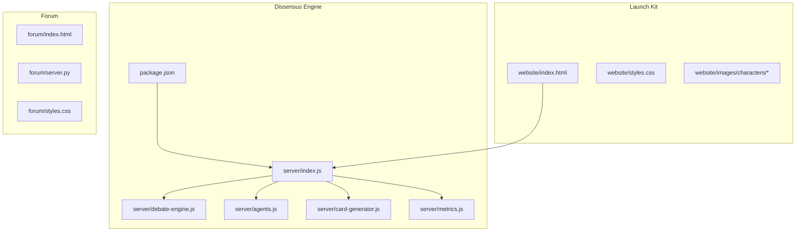
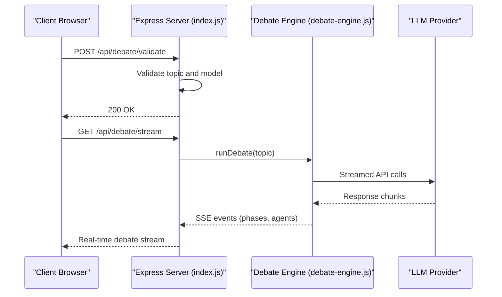
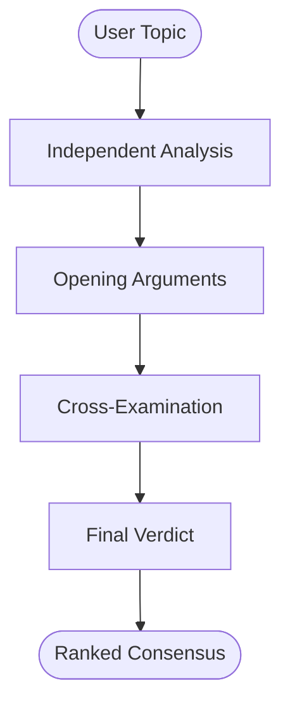
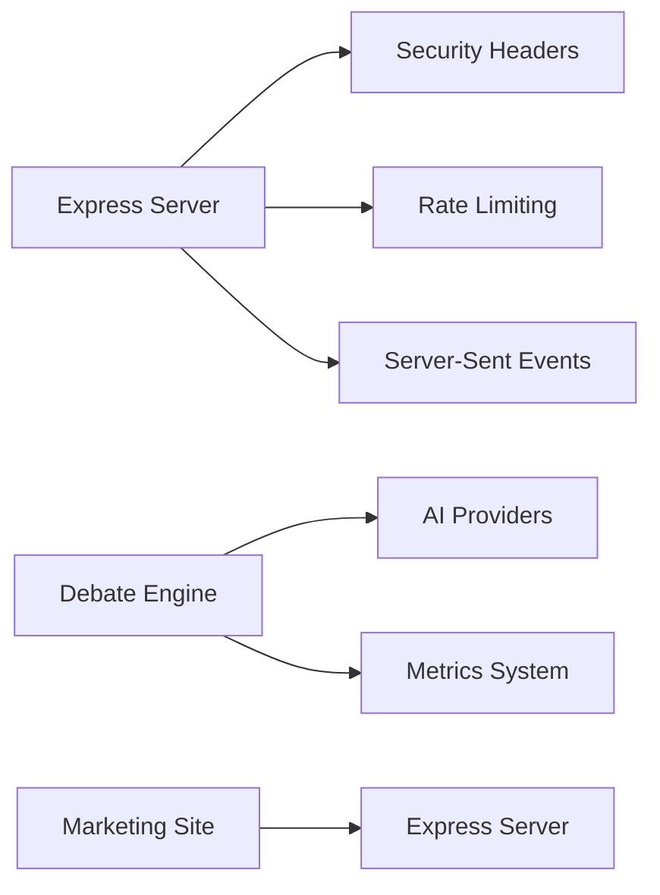

# Tokenomics & Economic Model

<cite>
**Referenced Files in This Document**
- [README.md](file://README.md)
- [ROADMAP.md](file://ROADMAP.md)
- [index.html](file://diss-launch-kit/website/index.html)
- [index.js](file://dissensus-engine/server/index.js)
- [debate-engine.js](file://dissensus-engine/server/debate-engine.js)
- [package.json](file://dissensus-engine/package.json)
</cite>

## Update Summary
**Changes Made**
- Complete removal of all tokenomics documentation and cryptocurrency references
- Updated architecture overview to reflect pure AI debate platform without token mechanics
- Removed all staking, tier, and access control mechanisms
- Updated economic model section to reflect non-token-based monetization
- Revised launch strategy to focus on community building and platform adoption
- Removed Solana integration and blockchain-related components

## Table of Contents
1. [Introduction](#introduction)
2. [Project Structure](#project-structure)
3. [Core Components](#core-components)
4. [Architecture Overview](#architecture-overview)
5. [Detailed Component Analysis](#detailed-component-analysis)
6. [Dependency Analysis](#dependency-analysis)
7. [Performance Considerations](#performance-considerations)
8. [Troubleshooting Guide](#troubleshooting-guide)
9. [Conclusion](#conclusion)
10. [Appendices](#appendices)

## Introduction
This document explains the Dissensus AI debate platform and its current non-token-based economic model. The platform has pivoted away from cryptocurrency mechanics to focus purely on AI-powered multi-agent debate services. The system operates as a web-based debate engine where three distinct AI agents (CIPHER, NOVA, and PRISM) engage in structured 4-phase dialectical debates on any topic submitted by users.

**Updated** The platform now operates as a pure AI service without tokenomics, staking, or blockchain integration. All previous token-based access controls, premium features, and economic mechanisms have been removed.

## Project Structure
The repository organizes the platform into three main components:
- **dissensus-engine**: Core AI debate server built with Node.js and Express
- **diss-launch-kit**: Marketing website and landing page assets
- **forum**: Research-powered discussion platform (Python/Flask)

**Diagram sources**
- [index.js:1-356](file://dissensus-engine/server/index.js#L1-L356)
- [debate-engine.js:1-399](file://dissensus-engine/server/debate-engine.js#L1-L399)
- [index.html:1-451](file://diss-launch-kit/website/index.html#L1-L451)

**Section sources**
- [README.md:20-29](file://README.md#L20-L29)
- [index.js:1-356](file://dissensus-engine/server/index.js#L1-L356)

## Core Components
The platform consists of several key components that work together to deliver AI-powered debate services:

- **AI Debate Engine**: Multi-agent system with CIPHER (Skeptic), NOVA (Advocate), and PRISM (Synthesizer) agents
- **Web Interface**: Real-time debate streaming via Server-Sent Events (SSE)
- **Research Integration**: Web-based research capabilities for factual grounding
- **Card Generation**: PNG export functionality for social sharing
- **Metrics System**: Public analytics and performance monitoring
- **Provider Integration**: Support for OpenAI, DeepSeek, and Google Gemini APIs

**Updated** All components operate independently of any token-based access control or economic mechanisms. The platform focuses purely on delivering high-quality AI debate services.

**Section sources**
- [debate-engine.js:41-399](file://dissensus-engine/server/debate-engine.js#L41-L399)
- [index.js:124-311](file://dissensus-engine/server/index.js#L124-L311)

## Architecture Overview
The platform exposes a RESTful API that processes debate requests and streams results in real-time:

**Diagram sources**
- [index.js:124-230](file://dissensus-engine/server/index.js#L124-L230)
- [debate-engine.js:131-396](file://dissensus-engine/server/debate-engine.js#L131-L396)

## Detailed Component Analysis

### AI Debate Engine and Multi-Agent System
The core debate engine implements a sophisticated 4-phase dialectical process:

- **Phase 1: Independent Analysis** - Each agent conducts private analysis
- **Phase 2: Opening Arguments** - Formal positions presented
- **Phase 3: Cross-Examination** - Agents challenge each other's arguments
- **Phase 4: Final Verdict** - PRISM delivers synthesized consensus

**Diagram sources**
- [debate-engine.js:149-396](file://dissensus-engine/server/debate-engine.js#L149-L396)

**Section sources**
- [debate-engine.js:41-399](file://dissensus-engine/server/debate-engine.js#L41-L399)

### API Endpoints and Service Architecture
The platform provides several key endpoints for debate processing:

- `/api/debate/validate`: Pre-flight validation for debate requests
- `/api/debate/stream`: Real-time debate streaming via SSE
- `/api/providers`: Available AI providers and models
- `/api/config`: Server configuration and capabilities
- `/api/card`: PNG card generation for social sharing
- `/api/metrics`: Public analytics and performance data

**Updated** All endpoints operate without token-based access control or premium feature gating.

**Section sources**
- [index.js:58-311](file://dissensus-engine/server/index.js#L58-L311)

### Provider Integration and Model Support
The system integrates with multiple AI providers with configurable API keys:

- **OpenAI**: GPT-4o and GPT-4o-mini models
- **DeepSeek**: DeepSeek V3.2 model
- **Google Gemini**: Gemini 2.5 Flash, 2.0 Flash, and 2.5 Flash-Lite models

**Section sources**
- [debate-engine.js:14-39](file://dissensus-engine/server/debate-engine.js#L14-L39)

### Real-Time Streaming and User Experience
The platform implements Server-Sent Events (SSE) for real-time debate streaming:

- Progressive disclosure of debate phases
- Real-time agent responses as they're generated
- Structured event types for client-side rendering
- Automatic cleanup and graceful error handling

**Section sources**
- [index.js:192-230](file://dissensus-engine/server/index.js#L192-L230)

### Website and Marketing Assets
The launch kit provides comprehensive marketing materials:

- **Landing Page**: Professional website with hero section, feature cards, and roadmap
- **Agent Profiles**: Detailed character bios and reasoning approaches
- **Process Visualization**: Four-phase debate methodology explanation
- **Community Building**: Social media links and engagement CTAs

**Updated** The website emphasizes platform features and community building rather than token-based access or economic mechanics.

**Section sources**
- [index.html:1-451](file://diss-launch-kit/website/index.html#L1-L451)

## Dependency Analysis
The platform has minimal external dependencies focused on AI provider integration and web serving:

**Diagram sources**
- [index.js:6-14](file://dissensus-engine/server/index.js#L6-L14)
- [package.json:1-28](file://dissensus-engine/package.json#L1-L28)

**Section sources**
- [index.js:1-356](file://dissensus-engine/server/index.js#L1-L356)
- [package.json:1-28](file://dissensus-engine/package.json#L1-L28)

## Performance Considerations
The platform implements several optimizations for scalability and reliability:

- **Rate Limiting**: Prevents abuse and ensures fair resource distribution
- **Graceful Degradation**: Automatic fallbacks for provider failures
- **Memory Management**: Proper cleanup of SSE connections and API timeouts
- **CORS Configuration**: Secure cross-origin resource sharing
- **Health Monitoring**: Built-in health check endpoint for infrastructure

**Updated** Performance optimizations focus on API response times and real-time streaming rather than token-based access optimization.

## Troubleshooting Guide
Common issues and solutions for the current platform implementation:

- **API Key Issues**: Ensure proper provider API keys are configured in environment variables
- **Network Connectivity**: Verify outbound connectivity to AI provider endpoints
- **Rate Limiting**: Monitor 429 responses and implement client-side backoff
- **Streaming Problems**: Check SSE compatibility and network stability
- **Provider Failures**: Implement retry logic and graceful error handling

**Section sources**
- [index.js:104-151](file://dissensus-engine/server/index.js#L104-L151)
- [debate-engine.js:72-95](file://dissensus-engine/server/debate-engine.js#L72-L95)

## Conclusion
The Dissensus platform has successfully pivoted to a pure AI debate service without cryptocurrency mechanics. The current architecture focuses on delivering high-quality multi-agent debate experiences through real-time streaming, structured dialectical processes, and comprehensive provider integration. The platform operates as a community-driven service with transparent monetization through premium features and developer access, rather than token-based economic mechanisms.

**Updated** The platform's economic model centers on sustainable growth through community engagement, premium feature adoption, and developer partnerships, eliminating the complexity and volatility associated with token-based systems.

## Appendices

### Current Development Roadmap
The platform follows a phased development approach focused on community building and service enhancement:

- **Phase 1**: Launch & Community (Q3 2025 - Q1 2026)
- **Phase 2**: Platform Live (Q1 - Q2 2026)  
- **Phase 3**: Premium Features (Q2 - Q3 2026)
- **Phase 4**: Scale & Ecosystem (Q3 2026+)

**Section sources**
- [ROADMAP.md:1-135](file://ROADMAP.md#L1-L135)

### Non-Token-Based Monetization Strategy
The platform employs a straightforward monetization approach:

- **Premium Features**: Enhanced debate capabilities and advanced analytics
- **Developer Access**: API access for integration and customization
- **Community Growth**: Organic user acquisition through quality service
- **Partnerships**: Strategic collaborations with media and educational institutions

**Updated** This approach eliminates the complexities of token economics while focusing on sustainable business growth through service excellence.