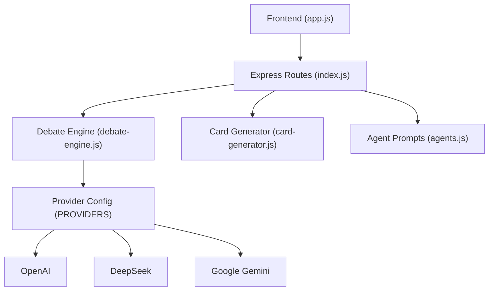
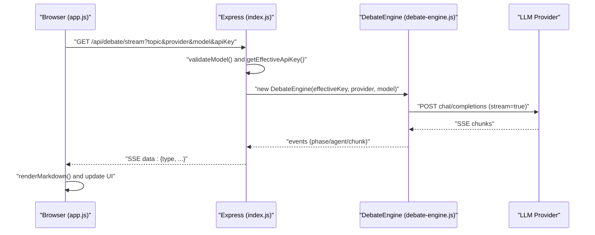
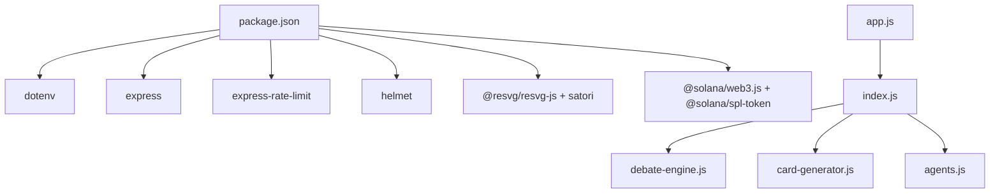

# AI Provider Integration

<cite>
**Referenced Files in This Document**
- [debate-engine.js](file://dissensus-engine/server/debate-engine.js)
- [index.js](file://dissensus-engine/server/index.js)
- [agents.js](file://dissensus-engine/server/agents.js)
- [card-generator.js](file://dissensus-engine/server/card-generator.js)
- [app.js](file://dissensus-engine/public/js/app.js)
- [package.json](file://dissensus-engine/package.json)
- [README.md](file://README.md)
</cite>

## Table of Contents
1. [Introduction](#introduction)
2. [Project Structure](#project-structure)
3. [Core Components](#core-components)
4. [Architecture Overview](#architecture-overview)
5. [Detailed Component Analysis](#detailed-component-analysis)
6. [Dependency Analysis](#dependency-analysis)
7. [Performance Considerations](#performance-considerations)
8. [Troubleshooting Guide](#troubleshooting-guide)
9. [Conclusion](#conclusion)
10. [Appendices](#appendices)

## Introduction
This document explains how to integrate additional AI providers and extend the debate engine’s language model capabilities. It covers the PROVIDERS configuration object, API key configuration, model selection logic, rate limiting, error handling, fallback mechanisms, and cost optimization strategies. It also provides step-by-step instructions for adding providers such as OpenAI, DeepSeek, and Google Gemini, along with guidance for custom provider implementations, authentication methods, parameter tuning, and maintaining consistent output formatting across providers.

## Project Structure
The debate engine is implemented as a Node.js/Express server with a frontend that streams Server-Sent Events (SSE) to render multi-agent debates in real time. The core integration points for AI providers are defined in the server module and consumed by the Express routes.

**Diagram sources**
- [app.js:1-674](file://dissensus-engine/public/js/app.js#L1-L674)
- [index.js:1-481](file://dissensus-engine/server/index.js#L1-L481)
- [debate-engine.js:1-389](file://dissensus-engine/server/debate-engine.js#L1-L389)
- [card-generator.js:1-361](file://dissensus-engine/server/card-generator.js#L1-L361)
- [agents.js:1-148](file://dissensus-engine/server/agents.js#L1-L148)

**Section sources**
- [README.md:1-63](file://README.md#L1-L63)
- [package.json:1-28](file://dissensus-engine/package.json#L1-L28)

## Core Components
- Provider configuration object: Defines base URLs, supported models, and authentication header construction for each provider.
- Debate engine: Orchestrates the four-phase debate, streams model responses, and emits structured events to the client.
- Express routes: Validate inputs, enforce rate limits, select effective API keys, and stream debate results via SSE.
- Frontend: Renders SSE events, manages provider/model selection, and displays debate phases.

Key responsibilities:
- PROVIDERS: Central registry of provider metadata, model capabilities, and auth scheme.
- DebateEngine: Builds messages, invokes provider APIs, parses streaming chunks, and emits events.
- index.js: Validates inputs, selects effective API key (user-provided or server-side), enforces rate limits, and streams results.
- app.js: UI controls, SSE consumption, and user feedback.

**Section sources**
- [debate-engine.js:14-39](file://dissensus-engine/server/debate-engine.js#L14-L39)
- [debate-engine.js:41-116](file://dissensus-engine/server/debate-engine.js#L41-L116)
- [index.js:40-85](file://dissensus-engine/server/index.js#L40-L85)
- [index.js:157-215](file://dissensus-engine/server/index.js#L157-L215)
- [index.js:220-311](file://dissensus-engine/server/index.js#L220-L311)
- [app.js:22-101](file://dissensus-engine/public/js/app.js#L22-L101)

## Architecture Overview
The system integrates multiple AI providers through a unified interface. The frontend triggers debates, the backend validates inputs and selects an API key, the debate engine streams provider responses, and the frontend renders real-time updates.

**Diagram sources**
- [index.js:220-311](file://dissensus-engine/server/index.js#L220-L311)
- [debate-engine.js:58-116](file://dissensus-engine/server/debate-engine.js#L58-L116)
- [app.js:307-347](file://dissensus-engine/public/js/app.js#L307-L347)

## Detailed Component Analysis

### Provider Configuration Object (PROVIDERS)
The PROVIDERS object defines:
- Base URL for the provider’s chat completions endpoint.
- Supported models with human-readable names and cost-per-1K-in/out for cost tracking.
- Authentication header builder function for the provider.

Current providers include OpenAI, DeepSeek, and Google Gemini. Each entry supports multiple models with associated costs.

Implementation pattern:
- Add a new provider entry with baseUrl, models map, and authHeader function.
- Ensure the models map includes at least one model ID used by the debate engine.

**Section sources**
- [debate-engine.js:14-39](file://dissensus-engine/server/debate-engine.js#L14-L39)

### API Key Configuration and Selection
The backend supports two modes:
- Server-side keys: Stored in environment variables and used automatically when available.
- User-provided keys: Sent by the client and take precedence over server-side keys.

Selection logic:
- If a user supplies an API key, it is used.
- Otherwise, if a server-side key exists for the selected provider, it is used.
- If neither is available, the request fails with an error instructing to set the appropriate key.

Environment variables:
- OPENAI_API_KEY
- DEEPSEEK_API_KEY
- GOOGLE_API_KEY or GEMINI_API_KEY

**Section sources**
- [index.js:41-45](file://dissensus-engine/server/index.js#L41-L45)
- [index.js:157-163](file://dissensus-engine/server/index.js#L157-L163)
- [index.js:261-267](file://dissensus-engine/server/index.js#L261-L267)

### Model Selection Logic
Model selection occurs in two places:
- Frontend: Provides a dropdown of models per provider and persists selections in local storage.
- Backend: Validates the chosen model against the provider’s configuration and defaults to a sensible model if none is provided.

Validation:
- The backend checks that the provider exists and the model is valid for that provider.
- Defaults:
  - DeepSeek defaults to its primary model.
  - Gemini defaults to a flash model.
  - OpenAI defaults to a larger model.

**Section sources**
- [app.js:22-54](file://dissensus-engine/public/js/app.js#L22-L54)
- [index.js:177-215](file://dissensus-engine/server/index.js#L177-L215)
- [index.js:252-259](file://dissensus-engine/server/index.js#L252-L259)

### Streaming and Response Parsing
The debate engine streams responses from the provider and parses Server-Sent Events:
- Reads the response body as a stream.
- Splits incoming data into lines and filters lines prefixed with the SSE data marker.
- Parses JSON chunks and extracts incremental content deltas.
- Emits agent-specific chunks to the caller.

Consistency:
- The engine expects a delta-based streaming format and accumulates content for each agent.
- The frontend renders markdown and scrolls to keep the latest content visible.

**Section sources**
- [debate-engine.js:58-116](file://dissensus-engine/server/debate-engine.js#L58-L116)
- [app.js:359-427](file://dissensus-engine/public/js/app.js#L359-L427)

### Four-Phase Debate Orchestration
The debate engine coordinates a structured four-phase process:
- Phase 1: Independent analysis by all agents.
- Phase 2: Opening arguments.
- Phase 3: Cross-examination.
- Phase 4: Final verdict delivered by PRISM.

The engine emits structured events for each phase and agent, enabling the frontend to render progress and content incrementally.

**Section sources**
- [debate-engine.js:121-386](file://dissensus-engine/server/debate-engine.js#L121-L386)

### Frontend Provider/Model Selection and SSE Consumption
The frontend:
- Loads provider hints and model lists from a static configuration.
- Restores previous selections from local storage.
- Preflight validates inputs before connecting to the SSE stream.
- Consumes SSE events and renders markdown output.

**Section sources**
- [app.js:22-101](file://dissensus-engine/public/js/app.js#L22-L101)
- [app.js:209-356](file://dissensus-engine/public/js/app.js#L209-L356)

### Card Generation and Summarization
When generating shareable cards, the backend optionally summarizes long verdicts using a small model from a provider with a server-side key:
- Detects which provider has a server-side key.
- Calls the provider’s chat endpoint with a summarization prompt.
- Extracts a concise answer and top picks for the card.

**Section sources**
- [card-generator.js:41-85](file://dissensus-engine/server/card-generator.js#L41-L85)

## Dependency Analysis
The system relies on a small set of runtime dependencies and integrates providers through a uniform configuration and API surface.

**Diagram sources**
- [package.json:10-19](file://dissensus-engine/package.json#L10-L19)
- [index.js:6-25](file://dissensus-engine/server/index.js#L6-L25)
- [debate-engine.js:11](file://dissensus-engine/server/debate-engine.js#L11)
- [card-generator.js:7-9](file://dissensus-engine/server/card-generator.js#L7-L9)
- [agents.js:8](file://dissensus-engine/server/agents.js#L8)
- [app.js:1-6](file://dissensus-engine/public/js/app.js#L1-L6)

**Section sources**
- [package.json:10-19](file://dissensus-engine/package.json#L10-L19)

## Performance Considerations
- Streaming: The engine streams provider responses to minimize latency and memory usage.
- Rate limiting: Enforced via express-rate-limit to protect resources and ensure fair usage.
- Cost tracking: Costs per 1K input/output tokens are recorded in provider configuration for visibility.
- Frontend rendering: Markdown rendering and scrolling are optimized to handle continuous content updates efficiently.

Recommendations:
- Prefer smaller, faster models for frequent operations.
- Use server-side keys to avoid client bandwidth and reduce latency.
- Monitor provider quotas and tune model parameters (temperature, max_tokens) to balance quality and cost.

**Section sources**
- [debate-engine.js:77-79](file://dissensus-engine/server/debate-engine.js#L77-L79)
- [index.js:58-64](file://dissensus-engine/server/index.js#L58-L64)
- [index.js:165-172](file://dissensus-engine/server/index.js#L165-L172)

## Troubleshooting Guide
Common integration issues and resolutions:
- Unknown provider or invalid model:
  - Ensure the provider exists in PROVIDERS and the model exists under that provider.
  - Use the validation endpoint or UI to confirm available models.
- Missing API key:
  - Set the appropriate server-side key or provide a user key in the request.
  - The backend returns a clear error when no key is available.
- Rate limit exceeded:
  - The backend throttles requests; wait before retrying.
- SSE connection failures:
  - Verify the stream URL parameters and network connectivity.
  - The frontend includes a 5-minute automatic timeout and user-friendly error messages.

Operational tips:
- Use the health endpoint to confirm provider availability.
- Check metrics endpoints for recent topics and provider usage.

**Section sources**
- [index.js:165-172](file://dissensus-engine/server/index.js#L165-L172)
- [index.js:261-267](file://dissensus-engine/server/index.js#L261-L267)
- [index.js:58-64](file://dissensus-engine/server/index.js#L58-L64)
- [app.js:340-347](file://dissensus-engine/public/js/app.js#L340-L347)

## Conclusion
The debate engine provides a flexible, extensible foundation for integrating multiple AI providers. By updating the PROVIDERS configuration, adding server-side keys, and ensuring consistent streaming response parsing, you can onboard new providers while preserving the four-phase debate orchestration and real-time UI rendering. The included rate limiting, validation, and cost-tracking mechanisms help maintain reliability and cost awareness.

## Appendices

### Step-by-Step: Adding a New AI Provider
1. Extend the PROVIDERS object with:
   - baseUrl pointing to the provider’s chat completions endpoint.
   - models map with at least one model ID and cost entries.
   - authHeader function that constructs the Authorization header for the provider.
2. Add server-side key support:
   - Define an environment variable for the provider’s API key.
   - Update the SERVER_KEYS mapping to include the new provider.
3. Update frontend provider configuration:
   - Add provider label, model list, and hint text in the frontend configuration.
   - Persist user preferences in local storage.
4. Test:
   - Validate model selection and streaming behavior.
   - Confirm SSE events render correctly in the UI.
   - Verify rate limiting and error handling.

**Section sources**
- [debate-engine.js:14-39](file://dissensus-engine/server/debate-engine.js#L14-L39)
- [index.js:41-45](file://dissensus-engine/server/index.js#L41-L45)
- [app.js:22-54](file://dissensus-engine/public/js/app.js#L22-L54)

### Example Integrations
- OpenAI:
  - Base URL and model IDs are defined in the PROVIDERS object.
  - Server-side key is configured via environment variable.
  - Default model selection aligns with premium quality.
- DeepSeek:
  - Base URL and model ID are defined in the PROVIDERS object.
  - Server-side key is configured via environment variable.
  - Default model selection emphasizes value.
- Google Gemini:
  - Base URL and model IDs are defined in the PROVIDERS object.
  - Server-side key is configured via environment variable.
  - Default model selection balances speed and cost.

**Section sources**
- [debate-engine.js:14-39](file://dissensus-engine/server/debate-engine.js#L14-L39)
- [index.js:41-45](file://dissensus-engine/server/index.js#L41-L45)

### Authentication Methods and Parameter Tuning
- Authentication:
  - Use the provider’s authHeader function to construct the Authorization header.
  - For providers that require API keys in query strings, adjust the base URL accordingly.
- Parameters:
  - Temperature and max_tokens are set in the engine; tune these to balance creativity and length.
  - Consider adding provider-specific overrides if needed.

**Section sources**
- [debate-engine.js:67-80](file://dissensus-engine/server/debate-engine.js#L67-L80)

### Maintaining Consistent Output Formatting
- The debate engine expects delta-based streaming and emits structured events.
- The frontend renders markdown and handles agent-specific content accumulation.
- Ensure new providers return a compatible streaming format and content delta structure.

**Section sources**
- [debate-engine.js:96-116](file://dissensus-engine/server/debate-engine.js#L96-L116)
- [app.js:104-129](file://dissensus-engine/public/js/app.js#L104-L129)