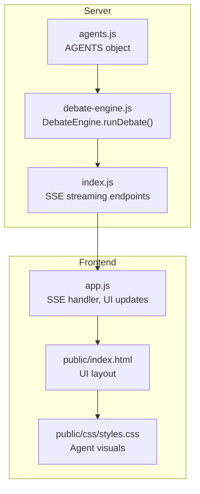
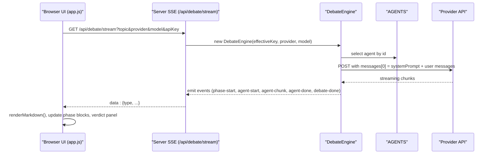
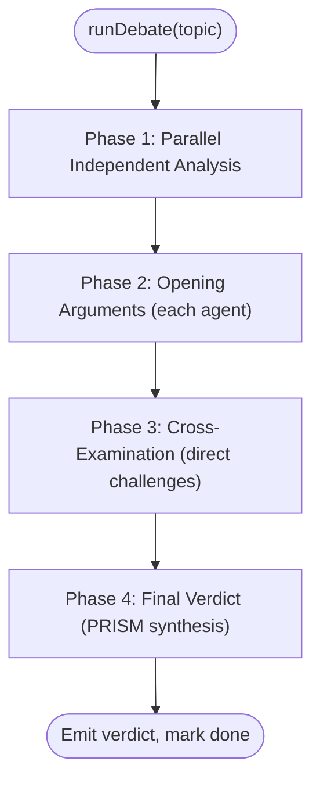
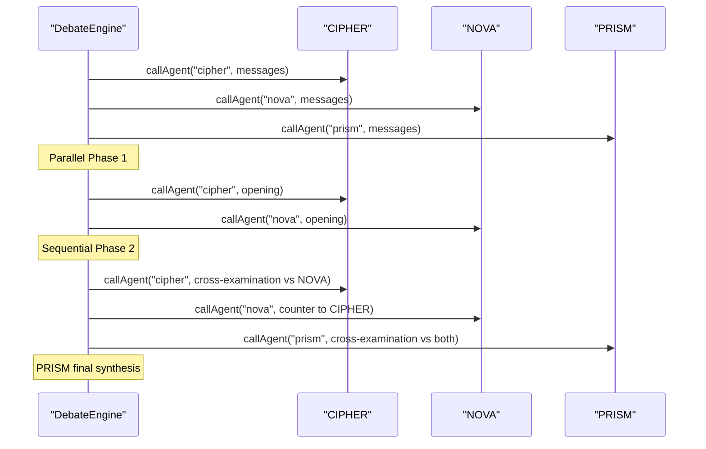
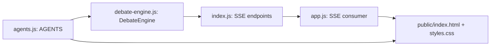

# Agent Customization

<cite>
**Referenced Files in This Document**
- [agents.js](file://dissensus-engine/server/agents.js)
- [debate-engine.js](file://dissensus-engine/server/debate-engine.js)
- [index.js](file://dissensus-engine/server/index.js)
- [app.js](file://dissensus-engine/public/js/app.js)
- [README.md](file://dissensus-engine/README.md)
- [index.html](file://dissensus-engine/public/index.html)
- [styles.css](file://dissensus-engine/public/css/styles.css)
- [index.html](file://webpage/index.html)
- [styles.css](file://webpage/styles.css)
- [index.html](file://diss-launch-kit/website/index.html)
- [index.html](file://dissensus-hostinger/index.html)
- [styles.css](file://dissensus-hostinger/styles.css)
- [index.html](file://hostinger-deploy/index.html)
- [styles.css](file://hostinger-deploy/styles.css)
- [index.html](file://hostinger-deployv2/index.html)
- [index.html](file://hostinger-deployv3/index.html)
</cite>

## Table of Contents
1. [Introduction](#introduction)
2. [Project Structure](#project-structure)
3. [Core Components](#core-components)
4. [Architecture Overview](#architecture-overview)
5. [Detailed Component Analysis](#detailed-component-analysis)
6. [Dependency Analysis](#dependency-analysis)
7. [Performance Considerations](#performance-considerations)
8. [Troubleshooting Guide](#troubleshooting-guide)
9. [Conclusion](#conclusion)
10. [Appendices](#appendices)

## Introduction
This document explains how to customize AI debate agents in the Dissensus platform. It focuses on the AGENTS object structure, personality definitions, system prompts, visual styling, and behavioral patterns. You will learn how to modify existing agents (CIPHER, NOVA, PRISM) and create entirely new agents with custom identities, roles, colors, portraits, and system prompts. It also covers the agent selection mechanism, system prompt injection, integration with the 4-phase debate methodology, and best practices for maintaining debate balance and coherent reasoning.

## Project Structure
The agent customization logic lives in the server module and is consumed by the frontend debate controller. The key files are:
- Agent definitions: [agents.js](file://dissensus-engine/server/agents.js)
- Debate orchestration and system prompt injection: [debate-engine.js](file://dissensus-engine/server/debate-engine.js)
- Server entry and SSE streaming: [index.js](file://dissensus-engine/server/index.js)
- Frontend debate controller and UI rendering: [app.js](file://dissensus-engine/public/js/app.js)
- Public UI pages and styles for agent presentation: [index.html](file://dissensus-engine/public/index.html), [styles.css](file://dissensus-engine/public/css/styles.css), and landing pages in [index.html](file://webpage/index.html), [index.html](file://diss-launch-kit/website/index.html), [index.html](file://dissensus-hostinger/index.html), [index.html](file://hostinger-deploy/index.html), [index.html](file://hostinger-deployv2/index.html), [index.html](file://hostinger-deployv3/index.html), and their respective stylesheets.

**Diagram sources**
- [agents.js:8-146](file://dissensus-engine/server/agents.js#L8-L146)
- [debate-engine.js:41-386](file://dissensus-engine/server/debate-engine.js#L41-L386)
- [index.js:220-311](file://dissensus-engine/server/index.js#L220-L311)
- [app.js:359-427](file://dissensus-engine/public/js/app.js#L359-L427)
- [index.html](file://dissensus-engine/public/index.html)
- [styles.css](file://dissensus-engine/public/css/styles.css)

**Section sources**
- [agents.js:1-148](file://dissensus-engine/server/agents.js#L1-L148)
- [debate-engine.js:1-389](file://dissensus-engine/server/debate-engine.js#L1-L389)
- [index.js:1-481](file://dissensus-engine/server/index.js#L1-L481)
- [app.js:1-674](file://dissensus-engine/public/js/app.js#L1-L674)

## Core Components
- AGENTS object: Defines agent metadata (id, name, role, subtitle, color, portrait) and the systemPrompt injected at runtime for each agent.
- DebateEngine: Orchestrates the 4-phase debate, injects the agent’s systemPrompt as the first message, and streams results via SSE.
- Frontend app: Subscribes to SSE events, renders markdown, and updates the UI per agent and phase.

Key customization points:
- Modify AGENTS entries to change agent identity, appearance, and reasoning style.
- Extend the AGENTS object to add new agents.
- Adjust system prompts to tailor behavior for different domains or use cases.

**Section sources**
- [agents.js:8-146](file://dissensus-engine/server/agents.js#L8-L146)
- [debate-engine.js:58-116](file://dissensus-engine/server/debate-engine.js#L58-L116)
- [app.js:103-129](file://dissensus-engine/public/js/app.js#L103-L129)

## Architecture Overview
The system integrates agent definitions with the debate engine and frontend rendering:

**Diagram sources**
- [index.js:220-311](file://dissensus-engine/server/index.js#L220-L311)
- [debate-engine.js:41-386](file://dissensus-engine/server/debate-engine.js#L41-L386)
- [agents.js:8-146](file://dissensus-engine/server/agents.js#L8-L146)
- [app.js:359-427](file://dissensus-engine/public/js/app.js#L359-L427)

## Detailed Component Analysis

### AGENTS Object Structure and Personality Definitions
The AGENTS object defines three built-in agents with:
- id: internal identifier used to select agents in the debate engine.
- name: display name.
- role: functional role in the debate.
- subtitle: descriptor for the role.
- color: CSS color for UI theming.
- portrait: image path for the agent’s avatar.
- systemPrompt: the full system instruction injected at the start of each agent’s conversation.

Behavioral patterns:
- CIPHER: adversarial, skeptical, risk-focused.
- NOVA: optimistic, opportunity-focused, constructive.
- PRISM: neutral, synthesizing, verdict-oriented.

Signature phrases and formatting preferences are embedded in each systemPrompt to shape tone and structure.

Customization guidance:
- To modify an existing agent, edit its entry in AGENTS (e.g., core identity, reasoning style, debate behavior, signature phrases).
- To add a new agent, append a new entry with a unique id and consistent fields.

**Section sources**
- [agents.js:8-146](file://dissensus-engine/server/agents.js#L8-L146)

### System Prompt Injection and 4-Phase Debate Integration
The debate engine composes messages for each agent call by prepending the agent’s systemPrompt as the first message. The 4-phase process is orchestrated in the DebateEngine:

- Phase 1: Independent Analysis (parallel)
- Phase 2: Opening Arguments (each agent)
- Phase 3: Cross-Examination (direct challenges)
- Phase 4: Final Verdict (PRISM’s definitive synthesis)

The engine emits structured SSE events for each phase and agent, enabling real-time UI updates.

**Diagram sources**
- [debate-engine.js:121-386](file://dissensus-engine/server/debate-engine.js#L121-L386)

**Section sources**
- [debate-engine.js:41-386](file://dissensus-engine/server/debate-engine.js#L41-L386)

### Frontend Rendering and Agent Presentation
The frontend subscribes to SSE events and renders content per agent and phase. It:
- Escapes HTML and renders markdown safely.
- Updates phase progress and agent status.
- Displays the final verdict in a dedicated panel.

Agent visuals (colors, portraits) are styled via CSS and used in both the debate UI and landing pages.

**Section sources**
- [app.js:103-129](file://dissensus-engine/public/js/app.js#L103-L129)
- [app.js:359-427](file://dissensus-engine/public/js/app.js#L359-L427)
- [styles.css](file://dissensus-engine/public/css/styles.css)
- [index.html](file://dissensus-engine/public/index.html)
- [styles.css](file://webpage/styles.css)
- [index.html](file://diss-launch-kit/website/index.html)
- [styles.css](file://dissensus-hostinger/styles.css)
- [index.html](file://hostinger-deploy/index.html)
- [index.html](file://hostinger-deployv2/index.html)
- [index.html](file://hostinger-deployv3/index.html)

### Step-by-Step: Modify Existing Agent Personalities
Follow these steps to adjust an existing agent (e.g., CIPHER):

1. Open [agents.js:8-146](file://dissensus-engine/server/agents.js#L8-L146).
2. Locate the agent entry (e.g., cipher).
3. Update:
   - Core identity statements to reflect desired worldview.
   - Reasoning style to emphasize specific analytical patterns.
   - Debate behavior to change how the agent participates in each phase.
   - Signature phrases and formatting preferences to shape tone.
4. Save the file and restart the server if needed.

Verification:
- Start a debate and observe the agent’s tone and structure in each phase.
- Confirm the agent’s color and portrait appear consistently in the UI.

**Section sources**
- [agents.js:8-146](file://dissensus-engine/server/agents.js#L8-L146)
- [app.js:359-427](file://dissensus-engine/public/js/app.js#L359-L427)

### Step-by-Step: Create a New Agent
To add a new agent (e.g., a domain expert):

1. Define a new entry in [agents.js:8-146](file://dissensus-engine/server/agents.js#L8-L146) with:
   - id: unique lowercase identifier (e.g., 'aurum')
   - name: display name (e.g., 'Aurum')
   - role: role descriptor (e.g., 'The Historian')
   - subtitle: short descriptor (e.g., 'Historical Context Expert')
   - color: hex color for UI
   - portrait: image path (ensure the image exists)
   - systemPrompt: a detailed system instruction tailored to the domain
2. Place the agent’s portrait image in the appropriate folder (e.g., [index.html](file://dissensus-engine/public/images/characters/)).
3. Optionally update the landing page(s) to showcase the new agent (e.g., [index.html](file://webpage/index.html), [index.html](file://diss-launch-kit/website/index.html), [index.html](file://dissensus-hostinger/index.html), [index.html](file://hostinger-deploy/index.html), [index.html](file://hostinger-deployv2/index.html), [index.html](file://hostinger-deployv3/index.html)).
4. Restart the server and test the new agent in a debate.

Note: The debate engine selects agents by id; ensure ids match between AGENTS and the engine’s invocation logic.

**Section sources**
- [agents.js:8-146](file://dissensus-engine/server/agents.js#L8-L146)
- [index.js:289-292](file://dissensus-engine/server/index.js#L289-L292)
- [debate-engine.js:153-162](file://dissensus-engine/server/debate-engine.js#L153-L162)

### Examples of Personality Modifications by Use Case
Below are conceptual examples of how to adapt agent personalities for different contexts. Replace the systemPrompt content in [agents.js:8-146](file://dissensus-engine/server/agents.js#L8-L146) accordingly.

- Educational settings
  - Emphasize clarity, pedagogy, and structured reasoning.
  - Use simpler language, step-by-step breakdowns, and encouraging tone.
  - Include examples and analogies to aid understanding.

- Corporate analysis
  - Focus on financial metrics, competitive positioning, and risk-return profiles.
  - Incorporate industry benchmarks, valuation frameworks, and scenario planning.
  - Maintain balanced assessments and avoid emotional language.

- Specialized domains (e.g., biotech, climate)
  - Embed domain-specific terminology and constraints.
  - Reference peer-reviewed evidence, regulatory landscapes, and technical feasibility.
  - Acknowledge uncertainty and highlight data gaps.

Best practices:
- Keep system prompts concise yet comprehensive.
- Align tone with the intended audience and context.
- Ensure formatting cues (headers, bullet lists) are preserved for readability.

**Section sources**
- [agents.js:8-146](file://dissensus-engine/server/agents.js#L8-L146)

### Agent Selection Mechanism and Behavior in the 4-Phase Debate
- Agent selection: The debate engine iterates over agent ids and calls each agent’s systemPrompt + phase-specific messages.
- Behavior:
  - CIPHER and NOVA present Opening Arguments with structured positions.
  - Cross-Examination involves targeted challenges and rebuttals.
  - PRISM delivers a definitive verdict with ranked conclusions and confidence levels.

**Diagram sources**
- [debate-engine.js:153-284](file://dissensus-engine/server/debate-engine.js#L153-L284)
- [debate-engine.js:341-379](file://dissensus-engine/server/debate-engine.js#L341-L379)

**Section sources**
- [debate-engine.js:121-386](file://dissensus-engine/server/debate-engine.js#L121-L386)

### Visual Styling Options and Portraits
- Colors: Set per agent in AGENTS.color; used in CSS for borders, shadows, and highlights.
- Portraits: Set per agent in AGENTS.portrait; displayed on the debate UI and landing pages.
- Landing page integration: Add agent cards and quotes to the landing page HTML/CSS as needed.

Styling examples:
- Agent portrait wrappers and hover effects are defined in [styles.css](file://dissensus-engine/public/css/styles.css) and replicated across landing pages.

**Section sources**
- [agents.js:8-146](file://dissensus-engine/server/agents.js#L8-L146)
- [styles.css](file://dissensus-engine/public/css/styles.css)
- [index.html](file://dissensus-engine/public/index.html)
- [styles.css](file://webpage/styles.css)
- [index.html](file://diss-launch-kit/website/index.html)
- [styles.css](file://dissensus-hostinger/styles.css)
- [index.html](file://hostinger-deploy/index.html)
- [index.html](file://hostinger-deployv2/index.html)
- [index.html](file://hostinger-deployv3/index.html)

## Dependency Analysis
The agent customization relies on tight coupling between AGENTS and the debate engine, with loose coupling to the frontend via SSE events.

**Diagram sources**
- [agents.js:8-146](file://dissensus-engine/server/agents.js#L8-L146)
- [debate-engine.js:41-386](file://dissensus-engine/server/debate-engine.js#L41-L386)
- [index.js:220-311](file://dissensus-engine/server/index.js#L220-L311)
- [app.js:359-427](file://dissensus-engine/public/js/app.js#L359-L427)
- [index.html](file://dissensus-engine/public/index.html)
- [styles.css](file://dissensus-engine/public/css/styles.css)

**Section sources**
- [agents.js:8-146](file://dissensus-engine/server/agents.js#L8-L146)
- [debate-engine.js:41-386](file://dissensus-engine/server/debate-engine.js#L41-L386)
- [index.js:220-311](file://dissensus-engine/server/index.js#L220-L311)
- [app.js:359-427](file://dissensus-engine/public/js/app.js#L359-L427)

## Performance Considerations
- Token limits: The engine sets max_tokens per call; adjust if debates become truncated or exceed provider quotas.
- Streaming: SSE streaming reduces latency; ensure clients handle partial chunks robustly.
- Provider selection: Choose providers/models aligned with cost and speed targets.
- Parallelization: Phase 1 runs in parallel for all agents; keep the number of agents reasonable to avoid provider throttling.

[No sources needed since this section provides general guidance]

## Troubleshooting Guide
Common issues and resolutions:
- Unknown agent id: Ensure the agent id in the debate engine matches an entry in AGENTS.
- Missing API key: The server validates keys per provider; confirm keys are set or use server-side keys.
- Topic length errors: Topics must be between 3 and 500 characters.
- Rate limits: Debates are rate-limited; wait before retrying.
- SSE connection failures: Verify CORS and proxy settings; check server logs for provider errors.

**Section sources**
- [index.js:177-215](file://dissensus-engine/server/index.js#L177-L215)
- [index.js:236-267](file://dissensus-engine/server/index.js#L236-L267)
- [debate-engine.js:58-116](file://dissensus-engine/server/debate-engine.js#L58-L116)
- [app.js:340-356](file://dissensus-engine/public/js/app.js#L340-L356)

## Conclusion
Agent customization in Dissensus centers on the AGENTS object and the 4-phase debate engine. By adjusting system prompts, roles, colors, and portraits, you can tailor agents for diverse use cases while preserving the structured dialectical process. Follow the step-by-step instructions to modify existing agents or add new ones, and leverage the provided examples to align personalities with educational, corporate, or specialized contexts.

[No sources needed since this section summarizes without analyzing specific files]

## Appendices

### Best Practices for Maintaining Debate Balance and Coherent Reasoning
- Keep system prompts grounded in evidence and structured reasoning.
- Ensure each agent’s role is distinct but complementary.
- Use formatting cues (headers, bullet lists) to maintain readability.
- Test with varied topics to validate balanced behavior.
- Monitor SSE rendering for markdown consistency and safety.

**Section sources**
- [agents.js:8-146](file://dissensus-engine/server/agents.js#L8-L146)
- [app.js:103-129](file://dissensus-engine/public/js/app.js#L103-L129)