# Customization & Extension

<cite>
**Referenced Files in This Document**
- [README.md](file://README.md)
- [dissensus-engine/README.md](file://dissensus-engine/README.md)
- [dissensus-engine/package.json](file://dissensus-engine/package.json)
- [dissensus-engine/public/index.html](file://dissensus-engine/public/index.html)
- [dissensus-engine/public/css/styles.css](file://dissensus-engine/public/css/styles.css)
- [dissensus-engine/public/js/app.js](file://dissensus-engine/public/js/app.js)
- [dissensus-engine/server/index.js](file://dissensus-engine/server/index.js)
- [dissensus-engine/server/agents.js](file://dissensus-engine/server/agents.js)
- [dissensus-engine/server/debate-engine.js](file://dissensus-engine/server/debate-engine.js)
- [dissensus-engine/server/staking.js](file://dissensus-engine/server/staking.js)
- [dissensus-engine/server/metrics.js](file://dissensus-engine/server/metrics.js)
- [dissensus-engine/server/card-generator.js](file://dissensus-engine/server/card-generator.js)
- [dissensus-engine/server/debate-of-the-day.js](file://dissensus-engine/server/debate-of-the-day.js)
- [dissensus-engine/server/solana-balance.js](file://dissensus-engine/server/solana-balance.js)
- [forum/engine.js](file://forum/engine.js)
</cite>

## Table of Contents
1. [Introduction](#introduction)
2. [Project Structure](#project-structure)
3. [Core Components](#core-components)
4. [Architecture Overview](#architecture-overview)
5. [Detailed Component Analysis](#detailed-component-analysis)
6. [Dependency Analysis](#dependency-analysis)
7. [Performance Considerations](#performance-considerations)
8. [Troubleshooting Guide](#troubleshooting-guide)
9. [Conclusion](#conclusion)
10. [Appendices](#appendices)

## Introduction
This document explains how to customize and extend the Dissensus platform. It focuses on:
- Agent customization: personalities, system prompts, and visual styling
- Theme and branding: CSS variables, logos, and color schemes
- Extending AI providers and debate agents
- Enhancing the research engine and sharing cards
- Plugin and API extension points
- Configuration management and environment-specific customizations
- Maintaining compatibility across updates

## Project Structure
The Dissensus platform comprises:
- A Node.js debate engine with Express and SSE streaming
- A frontend app that renders real-time debate phases and integrates with the server
- A research-powered forum module (Python/Flask) that calls the same backend
- Utilities for staking, metrics, shareable cards, debate-of-the-day, and Solana balance checks

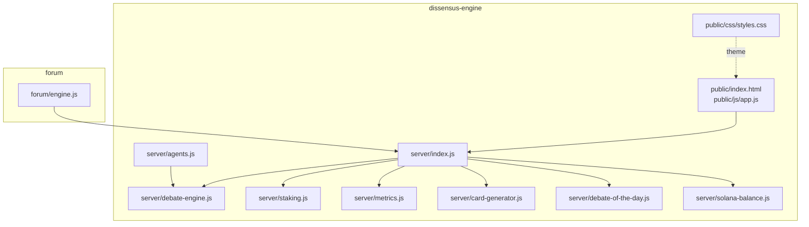

**Diagram sources**
- [dissensus-engine/server/index.js:1-481](file://dissensus-engine/server/index.js#L1-L481)
- [dissensus-engine/server/debate-engine.js:1-389](file://dissensus-engine/server/debate-engine.js#L1-L389)
- [dissensus-engine/server/agents.js:1-148](file://dissensus-engine/server/agents.js#L1-L148)
- [dissensus-engine/server/staking.js:1-183](file://dissensus-engine/server/staking.js#L1-L183)
- [dissensus-engine/server/metrics.js:1-152](file://dissensus-engine/server/metrics.js#L1-L152)
- [dissensus-engine/server/card-generator.js:1-361](file://dissensus-engine/server/card-generator.js#L1-L361)
- [dissensus-engine/server/debate-of-the-day.js:1-80](file://dissensus-engine/server/debate-of-the-day.js#L1-L80)
- [dissensus-engine/server/solana-balance.js:1-83](file://dissensus-engine/server/solana-balance.js#L1-L83)
- [dissensus-engine/public/index.html:1-217](file://dissensus-engine/public/index.html#L1-L217)
- [dissensus-engine/public/js/app.js:1-674](file://dissensus-engine/public/js/app.js#L1-L674)
- [dissensus-engine/public/css/styles.css:1-998](file://dissensus-engine/public/css/styles.css#L1-L998)
- [forum/engine.js:1-323](file://forum/engine.js#L1-L323)

**Section sources**
- [README.md:20-29](file://README.md#L20-L29)
- [dissensus-engine/README.md:110-134](file://dissensus-engine/README.md#L110-L134)

## Core Components
- Server orchestration and endpoints: Express server with SSE, provider/model validation, debate streaming, staking, metrics, cards, and Solana integration
- Debate engine: 4-phase dialectical process with agent orchestration and streaming
- Agent definitions: Personality, roles, system prompts, colors, and portraits
- Frontend controller: SSE handling, markdown rendering, UI state, and shareable card generation
- Theming: CSS variables for colors, typography, and layout
- Research and social features: Debate-of-the-day and shareable cards

**Section sources**
- [dissensus-engine/server/index.js:1-481](file://dissensus-engine/server/index.js#L1-L481)
- [dissensus-engine/server/debate-engine.js:1-389](file://dissensus-engine/server/debate-engine.js#L1-L389)
- [dissensus-engine/server/agents.js:1-148](file://dissensus-engine/server/agents.js#L1-L148)
- [dissensus-engine/public/js/app.js:1-674](file://dissensus-engine/public/js/app.js#L1-L674)
- [dissensus-engine/public/css/styles.css:1-998](file://dissensus-engine/public/css/styles.css#L1-L998)
- [dissensus-engine/server/debate-of-the-day.js:1-80](file://dissensus-engine/server/debate-of-the-day.js#L1-L80)
- [dissensus-engine/server/card-generator.js:1-361](file://dissensus-engine/server/card-generator.js#L1-L361)

## Architecture Overview
The frontend connects to the server via SSE to stream debate phases. The server validates inputs, selects a provider/model, and orchestrates the debate engine. Results are emitted as structured events and rendered in real time.

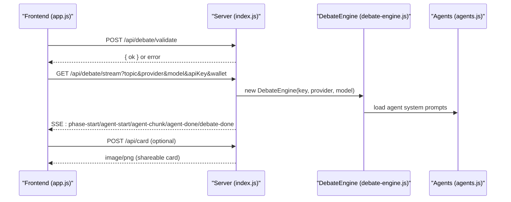

**Diagram sources**
- [dissensus-engine/public/js/app.js:209-356](file://dissensus-engine/public/js/app.js#L209-L356)
- [dissensus-engine/server/index.js:177-311](file://dissensus-engine/server/index.js#L177-L311)
- [dissensus-engine/server/debate-engine.js:121-386](file://dissensus-engine/server/debate-engine.js#L121-L386)
- [dissensus-engine/server/agents.js:8-146](file://dissensus-engine/server/agents.js#L8-L146)
- [dissensus-engine/server/card-generator.js:382-416](file://dissensus-engine/server/card-generator.js#L382-L416)

## Detailed Component Analysis

### Agent Customization System
- Personality definitions: Each agent has an identity, reasoning style, behavior, signature phrases, and a structured system prompt
- Visual styling: Colors and portrait images define agent brand identity
- Extensibility: Add new agents by extending the agent registry and updating the UI columns

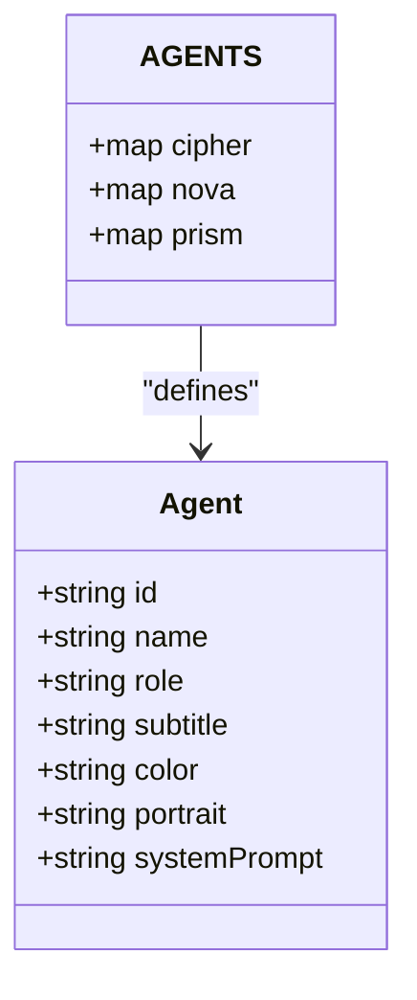

**Diagram sources**
- [dissensus-engine/server/agents.js:8-146](file://dissensus-engine/server/agents.js#L8-L146)

**Section sources**
- [dissensus-engine/server/agents.js:8-146](file://dissensus-engine/server/agents.js#L8-L146)
- [dissensus-engine/public/index.html:150-196](file://dissensus-engine/public/index.html#L150-L196)

### Theme and Branding Customization
- CSS variables: Centralize colors, backgrounds, and typography in the root variables
- Logo and branding: Update the header logo and favicon; adjust card branding in the shareable card generator
- Color scheme changes: Modify CSS variables to re-skin the entire UI
- Fonts: Inter and JetBrains Mono are loaded; adjust or swap as needed

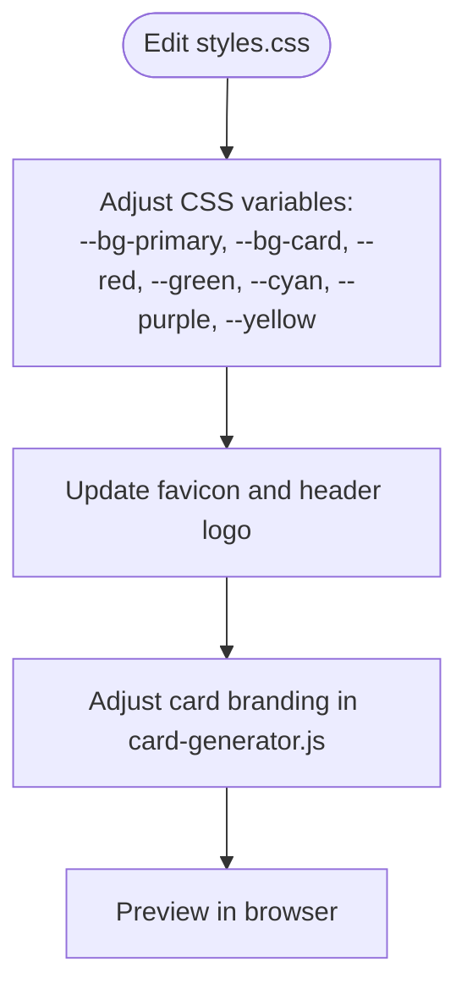

**Diagram sources**
- [dissensus-engine/public/css/styles.css:6-27](file://dissensus-engine/public/css/styles.css#L6-L27)
- [dissensus-engine/public/index.html:25-26](file://dissensus-engine/public/index.html#L25-L26)
- [dissensus-engine/server/card-generator.js:170-358](file://dissensus-engine/server/card-generator.js#L170-L358)

**Section sources**
- [dissensus-engine/public/css/styles.css:6-27](file://dissensus-engine/public/css/styles.css#L6-L27)
- [dissensus-engine/public/index.html:25-26](file://dissensus-engine/public/index.html#L25-L26)
- [dissensus-engine/server/card-generator.js:170-358](file://dissensus-engine/server/card-generator.js#L170-L358)

### Adding New AI Providers
- Extend the provider configuration in the debate engine
- Ensure the provider supports an OpenAI-compatible chat completions endpoint
- Add models and cost metadata; update the frontend provider configuration

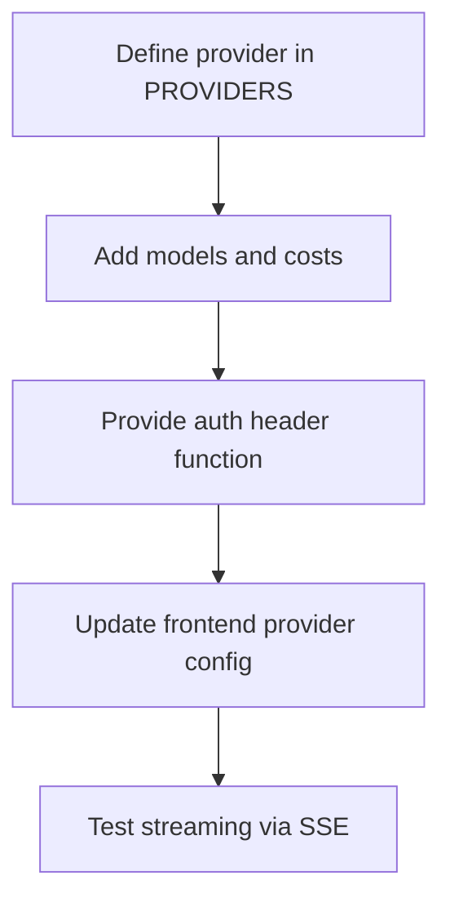

**Diagram sources**
- [dissensus-engine/server/debate-engine.js:14-39](file://dissensus-engine/server/debate-engine.js#L14-L39)
- [dissensus-engine/public/js/app.js:23-54](file://dissensus-engine/public/js/app.js#L23-L54)

**Section sources**
- [dissensus-engine/server/debate-engine.js:14-39](file://dissensus-engine/server/debate-engine.js#L14-L39)
- [dissensus-engine/README.md:152-154](file://dissensus-engine/README.md#L152-L154)
- [dissensus-engine/public/js/app.js:23-54](file://dissensus-engine/public/js/app.js#L23-L54)

### Creating Custom Debate Agents
- Add a new agent definition with personality, role, color, portrait, and system prompt
- Ensure the system prompt enforces the desired reasoning style and output format
- Update the UI columns and status indicators if introducing new agent roles

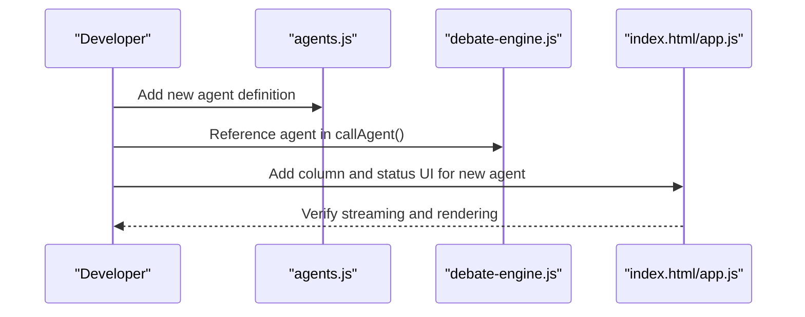

**Diagram sources**
- [dissensus-engine/server/agents.js:8-146](file://dissensus-engine/server/agents.js#L8-L146)
- [dissensus-engine/server/debate-engine.js:58-116](file://dissensus-engine/server/debate-engine.js#L58-L116)
- [dissensus-engine/public/index.html:150-196](file://dissensus-engine/public/index.html#L150-L196)
- [dissensus-engine/public/js/app.js:164-194](file://dissensus-engine/public/js/app.js#L164-L194)

**Section sources**
- [dissensus-engine/server/agents.js:8-146](file://dissensus-engine/server/agents.js#L8-L146)
- [dissensus-engine/server/debate-engine.js:58-116](file://dissensus-engine/server/debate-engine.js#L58-L116)
- [dissensus-engine/public/index.html:150-196](file://dissensus-engine/public/index.html#L150-L196)
- [dissensus-engine/public/js/app.js:164-194](file://dissensus-engine/public/js/app.js#L164-L194)

### Extending the Research Engine and Cards
- Debate-of-the-day: Trending topics from CoinGecko with fallback rotation
- Shareable cards: Automatic truncation and layout for Twitter previews; optional LLM summarization when server keys are available
- Forum integration: The research forum calls the same backend and renders structured phases

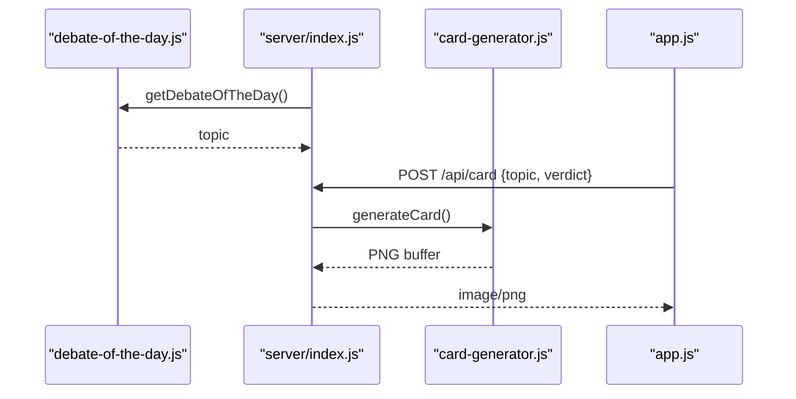

**Diagram sources**
- [dissensus-engine/server/debate-of-the-day.js:66-77](file://dissensus-engine/server/debate-of-the-day.js#L66-L77)
- [dissensus-engine/server/index.js:360-416](file://dissensus-engine/server/index.js#L360-L416)
- [dissensus-engine/server/card-generator.js:170-358](file://dissensus-engine/server/card-generator.js#L170-L358)
- [dissensus-engine/public/js/app.js:606-639](file://dissensus-engine/public/js/app.js#L606-L639)

**Section sources**
- [dissensus-engine/server/debate-of-the-day.js:1-80](file://dissensus-engine/server/debate-of-the-day.js#L1-L80)
- [dissensus-engine/server/card-generator.js:1-361](file://dissensus-engine/server/card-generator.js#L1-L361)
- [dissensus-engine/server/index.js:360-416](file://dissensus-engine/server/index.js#L360-L416)
- [forum/engine.js:62-226](file://forum/engine.js#L62-L226)

### API Extensions and Plugin Development
- Extend the Express server with new routes for plugins or integrations
- Respect rate limits and security middleware
- Keep plugin logic modular and optionally guarded behind environment flags

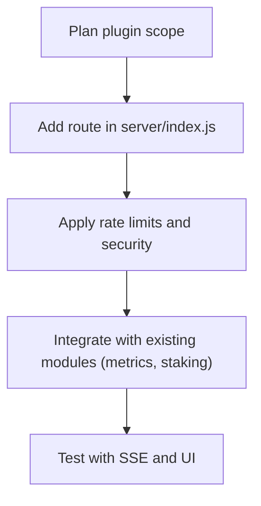

**Diagram sources**
- [dissensus-engine/server/index.js:48-64](file://dissensus-engine/server/index.js#L48-L64)
- [dissensus-engine/server/metrics.js:46-73](file://dissensus-engine/server/metrics.js#L46-L73)

**Section sources**
- [dissensus-engine/server/index.js:48-64](file://dissensus-engine/server/index.js#L48-L64)
- [dissensus-engine/server/metrics.js:1-152](file://dissensus-engine/server/metrics.js#L1-L152)

### Frontend Component Customization
- Modify the debate UI: phase labels, agent columns, and markdown rendering
- Persist user preferences: provider, model, and API key per provider (client-side)
- Wallet and staking panels: keep UX consistent when adding new features

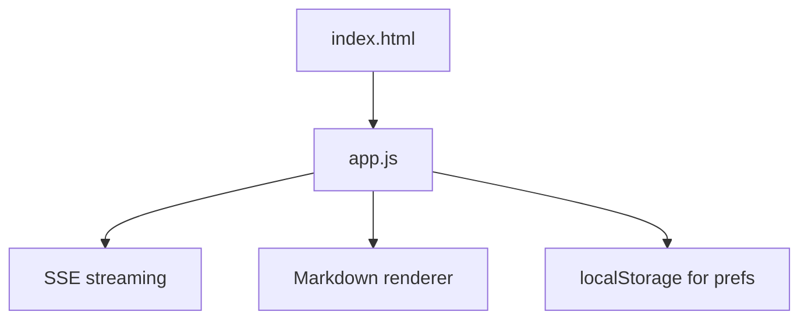

**Diagram sources**
- [dissensus-engine/public/index.html:1-217](file://dissensus-engine/public/index.html#L1-L217)
- [dissensus-engine/public/js/app.js:103-129](file://dissensus-engine/public/js/app.js#L103-L129)
- [dissensus-engine/public/js/app.js:642-674](file://dissensus-engine/public/js/app.js#L642-L674)

**Section sources**
- [dissensus-engine/public/index.html:1-217](file://dissensus-engine/public/index.html#L1-L217)
- [dissensus-engine/public/js/app.js:103-129](file://dissensus-engine/public/js/app.js#L103-L129)
- [dissensus-engine/public/js/app.js:642-674](file://dissensus-engine/public/js/app.js#L642-L674)

### Configuration Management and Environment-Specific Customizations
- Environment variables: API keys, RPC, Solana mint, trust proxy, and debate-of-the-day timezone
- Server-side keys: Configure provider keys in .env for production deployments
- Feature flags: STAKING_ENFORCE toggles wallet requirement and daily debate limits

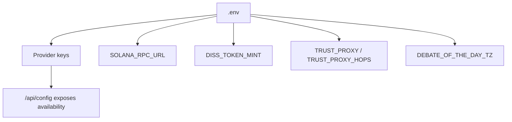

**Diagram sources**
- [dissensus-engine/server/index.js:40-84](file://dissensus-engine/server/index.js#L40-L84)
- [dissensus-engine/server/solana-balance.js:14-20](file://dissensus-engine/server/solana-balance.js#L14-L20)
- [dissensus-engine/server/debate-of-the-day.js:22-35](file://dissensus-engine/server/debate-of-the-day.js#L22-L35)

**Section sources**
- [dissensus-engine/README.md:136-150](file://dissensus-engine/README.md#L136-L150)
- [dissensus-engine/server/index.js:40-84](file://dissensus-engine/server/index.js#L40-L84)
- [dissensus-engine/server/debate-of-the-day.js:22-35](file://dissensus-engine/server/debate-of-the-day.js#L22-L35)
- [dissensus-engine/server/solana-balance.js:14-20](file://dissensus-engine/server/solana-balance.js#L14-L20)

### Maintaining Compatibility During Updates
- Keep agent and provider interfaces stable; add new keys rather than changing existing ones
- Version dependencies in package.json; pin major versions for stability
- Backward-compatible SSE event types and UI column structure
- Use environment variables for feature flags and provider toggles

**Section sources**
- [dissensus-engine/package.json:1-28](file://dissensus-engine/package.json#L1-L28)
- [dissensus-engine/server/debate-engine.js:14-39](file://dissensus-engine/server/debate-engine.js#L14-L39)
- [dissensus-engine/public/js/app.js:358-427](file://dissensus-engine/public/js/app.js#L358-L427)

## Dependency Analysis
- Server depends on Express, rate limiting, and security middleware
- Debate engine depends on agent definitions and provider configuration
- Frontend depends on SSE streaming and local storage for preferences
- Metrics and staking are decoupled modules integrated via server routes

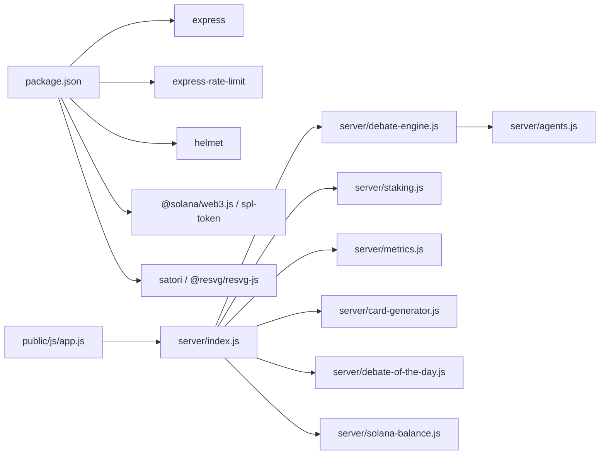

**Diagram sources**
- [dissensus-engine/package.json:10-19](file://dissensus-engine/package.json#L10-L19)
- [dissensus-engine/server/index.js:1-481](file://dissensus-engine/server/index.js#L1-L481)
- [dissensus-engine/server/debate-engine.js:1-389](file://dissensus-engine/server/debate-engine.js#L1-L389)
- [dissensus-engine/server/agents.js:1-148](file://dissensus-engine/server/agents.js#L1-L148)
- [dissensus-engine/server/staking.js:1-183](file://dissensus-engine/server/staking.js#L1-L183)
- [dissensus-engine/server/metrics.js:1-152](file://dissensus-engine/server/metrics.js#L1-L152)
- [dissensus-engine/server/card-generator.js:1-361](file://dissensus-engine/server/card-generator.js#L1-L361)
- [dissensus-engine/server/debate-of-the-day.js:1-80](file://dissensus-engine/server/debate-of-the-day.js#L1-L80)
- [dissensus-engine/server/solana-balance.js:1-83](file://dissensus-engine/server/solana-balance.js#L1-L83)
- [dissensus-engine/public/js/app.js:1-674](file://dissensus-engine/public/js/app.js#L1-L674)

**Section sources**
- [dissensus-engine/package.json:1-28](file://dissensus-engine/package.json#L1-L28)
- [dissensus-engine/server/index.js:1-481](file://dissensus-engine/server/index.js#L1-L481)

## Performance Considerations
- SSE streaming: Keep messages concise; debounce UI updates
- Debates: Limit max tokens and temperature for faster responses
- Rate limiting: Tune per environment; reduce in development
- Card generation: Use server keys to summarize long verdicts and reduce payload sizes

[No sources needed since this section provides general guidance]

## Troubleshooting Guide
- API key issues: Ensure keys are set in .env or entered by the user; server prefers user-provided keys when available
- Rate limits: Reduce frequency or increase allowances in production
- Proxy headers: Configure trust proxy and hops when behind nginx or cloud proxies
- Wallet validation: Ensure Solana wallet addresses meet length constraints
- Metrics and cards: Confirm server keys availability for summarization and card generation

**Section sources**
- [dissensus-engine/server/index.js:57-64](file://dissensus-engine/server/index.js#L57-L64)
- [dissensus-engine/server/index.js:157-215](file://dissensus-engine/server/index.js#L157-L215)
- [dissensus-engine/server/solana-balance.js:26-32](file://dissensus-engine/server/solana-balance.js#L26-L32)
- [dissensus-engine/server/card-generator.js:41-85](file://dissensus-engine/server/card-generator.js#L41-L85)

## Conclusion
Dissensus offers a flexible foundation for customization and extension. By editing agent definitions, CSS variables, and provider configurations, you can tailor personalities, themes, and capabilities. The modular server architecture and SSE-driven frontend enable incremental enhancements while preserving compatibility.

[No sources needed since this section summarizes without analyzing specific files]

## Appendices

### Quick Reference: Where to Customize
- Agent personalities and prompts: [server/agents.js:8-146](file://dissensus-engine/server/agents.js#L8-L146)
- Theme and colors: [public/css/styles.css:6-27](file://dissensus-engine/public/css/styles.css#L6-L27)
- Provider configuration: [server/debate-engine.js:14-39](file://dissensus-engine/server/debate-engine.js#L14-L39)
- Debate UI columns: [public/index.html:150-196](file://dissensus-engine/public/index.html#L150-L196)
- SSE frontend controller: [public/js/app.js:358-427](file://dissensus-engine/public/js/app.js#L358-L427)
- Server endpoints: [server/index.js:138-445](file://dissensus-engine/server/index.js#L138-L445)
- Shareable cards: [server/card-generator.js:170-358](file://dissensus-engine/server/card-generator.js#L170-L358)
- Debate-of-the-day: [server/debate-of-the-day.js:66-77](file://dissensus-engine/server/debate-of-the-day.js#L66-L77)
- Solana balance: [server/solana-balance.js:26-76](file://dissensus-engine/server/solana-balance.js#L26-L76)
- Forum integration: [forum/engine.js:62-226](file://forum/engine.js#L62-L226)