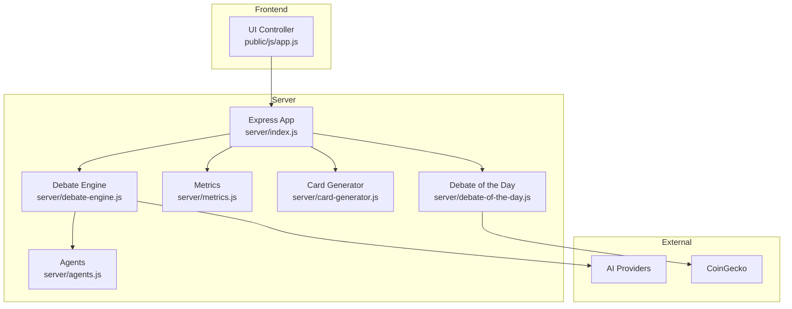
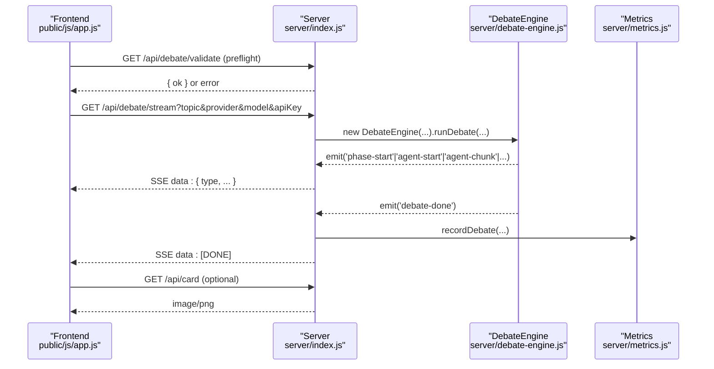
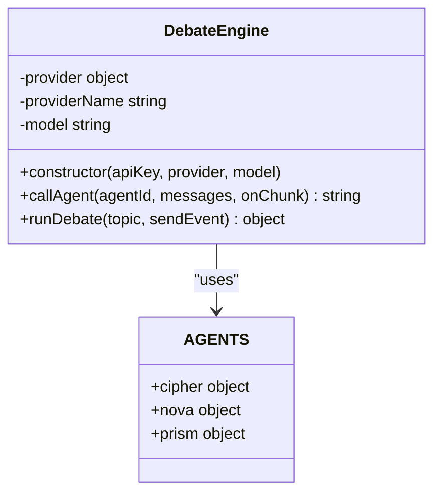
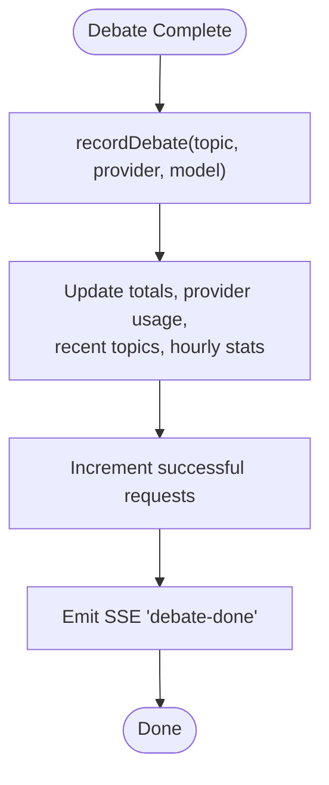
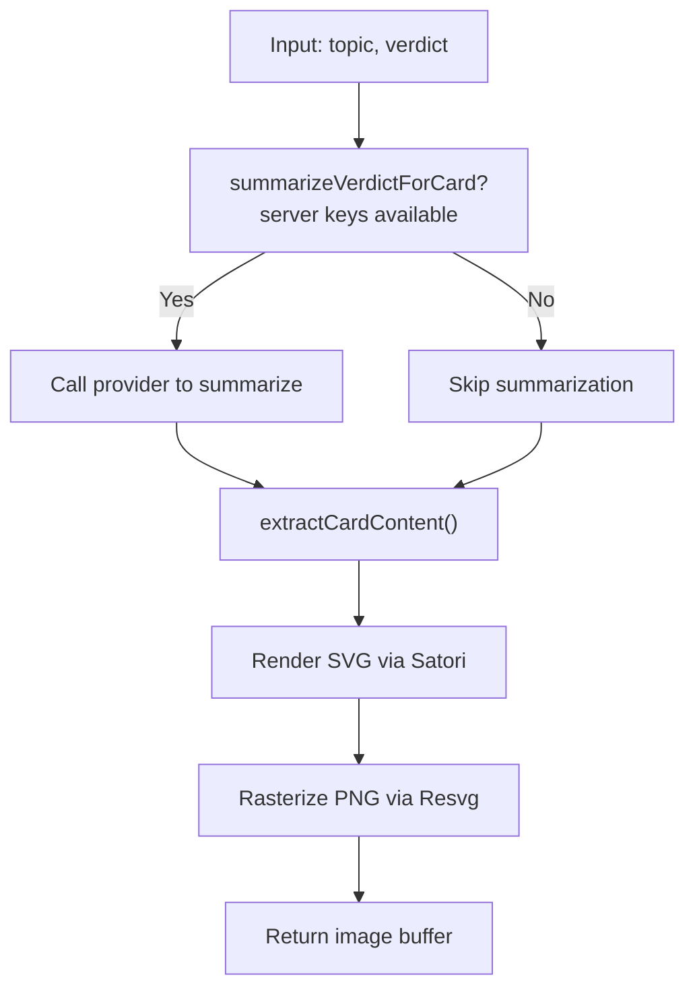
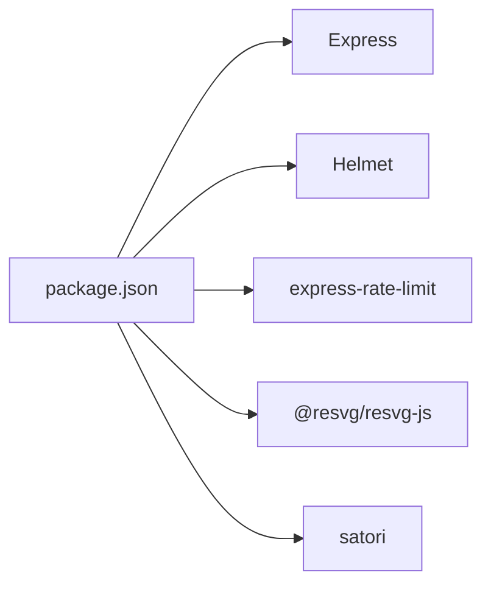

# Plugin Development

<cite>
**Referenced Files in This Document**
- [package.json](file://dissensus-engine/package.json)
- [index.js](file://dissensus-engine/server/index.js)
- [debate-engine.js](file://dissensus-engine/server/debate-engine.js)
- [agents.js](file://dissensus-engine/server/agents.js)
- [metrics.js](file://dissensus-engine/server/metrics.js)
- [card-generator.js](file://dissensus-engine/server/card-generator.js)
- [debate-of-the-day.js](file://dissensus-engine/server/debate-of-the-day.js)
- [app.js](file://dissensus-engine/public/js/app.js)
- [README.md](file://dissensus-engine/README.md)
- [run_all_hooks.py](file://.agent_hooks/run_all_hooks.py)
</cite>

## Table of Contents
1. [Introduction](#introduction)
2. [Project Structure](#project-structure)
3. [Core Components](#core-components)
4. [Architecture Overview](#architecture-overview)
5. [Detailed Component Analysis](#detailed-component-analysis)
6. [Dependency Analysis](#dependency-analysis)
7. [Performance Considerations](#performance-considerations)
8. [Troubleshooting Guide](#troubleshooting-guide)
9. [Conclusion](#conclusion)
10. [Appendices](#appendices)

## Introduction
This document explains how to extend the Dissensus platform through plugin development and API extensions. It focuses on the Express.js server architecture, middleware hooks, and extension points. You will learn how to:
- Add custom middleware for authentication, logging, or analytics
- Extend debate functionality and introduce new debate formats
- Integrate additional AI providers and specialized content generators
- Build custom API endpoints and integrate with external services
- Extend the research engine capabilities
- Manage plugin registration, dependencies, and version compatibility
- Apply security considerations, measure performance impact, and maintain best practices
- Use templates for common plugin types and testing strategies

## Project Structure
The Dissensus engine is an Express.js application with a clear separation between server orchestration, debate orchestration, agent personalities, metrics, and frontend UI. The server exposes REST endpoints and SSE streams, while the frontend consumes these endpoints to render debates in real time.

**Diagram sources**
- [index.js:16-356](file://dissensus-engine/server/index.js#L16-L356)
- [debate-engine.js:11-389](file://dissensus-engine/server/debate-engine.js#L11-L389)
- [agents.js:8-148](file://dissensus-engine/server/agents.js#L8-L148)
- [metrics.js:8-112](file://dissensus-engine/server/metrics.js#L8-L112)
- [card-generator.js:1-361](file://dissensus-engine/server/card-generator.js#L1-L361)
- [debate-of-the-day.js:1-80](file://dissensus-engine/server/debate-of-the-day.js#L1-L80)
- [app.js:1-554](file://dissensus-engine/public/js/app.js#L1-L554)

**Section sources**
- [README.md:90-112](file://dissensus-engine/README.md#L90-L112)
- [index.js:16-356](file://dissensus-engine/server/index.js#L16-L356)

## Core Components
- Express server and middleware stack: Helmet, JSON parsing, static serving, rate limits, and SSE streaming.
- Debate engine orchestrator: multi-phase debate pipeline with agent orchestration and streaming events.
- Agent personalities: distinct roles and prompts for CIPHER, NOVA, PRISM.
- Metrics and analytics: in-memory counters and public endpoints for transparency.
- Card generator: HTML-to-image rendering for shareable debate cards.
- Research engine integration: debate-of-the-day sourcing trending topics from CoinGecko.

Key extension points:
- Middleware registration in the Express app
- Provider configuration in the debate engine
- Agent definitions for new roles or personalities
- Metrics hooks for custom analytics
- SSE event types for UI updates

**Section sources**
- [index.js:38-327](file://dissensus-engine/server/index.js#L38-L327)
- [debate-engine.js:14-389](file://dissensus-engine/server/debate-engine.js#L14-L389)
- [agents.js:8-148](file://dissensus-engine/server/agents.js#L8-L148)
- [metrics.js:32-112](file://dissensus-engine/server/metrics.js#L32-L112)
- [card-generator.js:41-85](file://dissensus-engine/server/card-generator.js#L41-L85)
- [debate-of-the-day.js:66-77](file://dissensus-engine/server/debate-of-the-day.js#L66-L77)

## Architecture Overview
The server initializes middleware, registers routes, and streams debate events via Server-Sent Events. The frontend connects to the SSE endpoint, renders live debate output, and supports additional endpoints for cards and metrics.

**Diagram sources**
- [index.js:156-230](file://dissensus-engine/server/index.js#L156-L230)
- [debate-engine.js:121-386](file://dissensus-engine/server/debate-engine.js#L121-L386)
- [metrics.js:32-57](file://dissensus-engine/server/metrics.js#L32-L57)
- [app.js:264-332](file://dissensus-engine/public/js/app.js#L264-L332)

**Section sources**
- [index.js:156-230](file://dissensus-engine/server/index.js#L156-L230)
- [app.js:208-341](file://dissensus-engine/public/js/app.js#L208-L341)

## Detailed Component Analysis

### Express Server and Middleware Hooks
The Express app sets trust proxy, applies Helmet, parses JSON, serves static assets, and defines rate-limited endpoints. This is the primary extension surface for plugins:
- Authentication middleware: insert before route handlers
- Logging middleware: capture request/response metadata
- Analytics middleware: instrument endpoints and track latency
- CORS and security headers: configure via Helmet and environment

Registration pattern:
- Use app.use(...) to register middleware globally
- Use app.get|post|all(...) to add new endpoints
- Use app.set(...) to configure settings (e.g., trust proxy)

Security and rate limiting are already integrated; consider adding additional middleware for:
- API key enforcement
- IP allowlists/blacklists
- Request size limits
- Audit logging

**Section sources**
- [index.js:24-53](file://dissensus-engine/server/index.js#L24-L53)
- [index.js:38-44](file://dissensus-engine/server/index.js#L38-L44)
- [index.js:57-99](file://dissensus-engine/server/index.js#L57-L99)
- [index.js:156-230](file://dissensus-engine/server/index.js#L156-L230)

### Debate Engine Orchestration and Extension Points
The DebateEngine class encapsulates:
- Provider configuration (base URL, models, auth header)
- Agent calls with streaming
- Four-phase debate pipeline
- SSE event emission

Extension opportunities:
- Add new providers by updating PROVIDERS
- Customize agent prompts in AGENTS
- Modify token limits and temperature
- Introduce new debate phases or formats
- Add pre/post-processing hooks around agent calls

**Diagram sources**
- [debate-engine.js:41-53](file://dissensus-engine/server/debate-engine.js#L41-L53)
- [debate-engine.js:58-116](file://dissensus-engine/server/debate-engine.js#L58-L116)
- [debate-engine.js:121-386](file://dissensus-engine/server/debate-engine.js#L121-L386)
- [agents.js:8-148](file://dissensus-engine/server/agents.js#L8-L148)

**Section sources**
- [debate-engine.js:14-39](file://dissensus-engine/server/debate-engine.js#L14-L39)
- [debate-engine.js:41-53](file://dissensus-engine/server/debate-engine.js#L41-L53)
- [debate-engine.js:58-116](file://dissensus-engine/server/debate-engine.js#L58-L116)
- [debate-engine.js:121-386](file://dissensus-engine/server/debate-engine.js#L121-L386)
- [agents.js:8-148](file://dissensus-engine/server/agents.js#L8-L148)

### Metrics and Analytics Extensions
The metrics module tracks:
- Total debates, unique topics, daily debates
- Provider usage distribution
- Hourly activity and uptime
- Recent topics and request success/failure

Extending metrics:
- Add custom counters and histograms
- Persist metrics to a database or time-series store
- Expose additional endpoints for admin dashboards
- Integrate with external analytics platforms

**Diagram sources**
- [metrics.js:32-57](file://dissensus-engine/server/metrics.js#L32-L57)
- [metrics.js:77-100](file://dissensus-engine/server/metrics.js#L77-L100)

**Section sources**
- [metrics.js:8-30](file://dissensus-engine/server/metrics.js#L8-L30)
- [metrics.js:32-57](file://dissensus-engine/server/metrics.js#L32-L57)
- [metrics.js:77-100](file://dissensus-engine/server/metrics.js#L77-L100)

### Card Generator and Content Extensions
The card generator:
- Summarizes long verdicts when server keys are available
- Parses structured verdicts to extract lists and summaries
- Renders a Twitter-optimized PNG using Satori and Resvg

Extending content:
- Add new content extraction patterns for custom verdict formats
- Integrate external summarization services
- Support additional image formats or branding assets

**Diagram sources**
- [card-generator.js:41-85](file://dissensus-engine/server/card-generator.js#L41-L85)
- [card-generator.js:87-152](file://dissensus-engine/server/card-generator.js#L87-L152)
- [card-generator.js:170-358](file://dissensus-engine/server/card-generator.js#L170-L358)

**Section sources**
- [card-generator.js:41-85](file://dissensus-engine/server/card-generator.js#L41-L85)
- [card-generator.js:87-152](file://dissensus-engine/server/card-generator.js#L87-L152)
- [card-generator.js:170-358](file://dissensus-engine/server/card-generator.js#L170-L358)

### Debate of the Day and External Integrations
The debate-of-the-day feature:
- Fetches trending coins from CoinGecko
- Falls back to curated topics based on the date
- Caches the result per day

Extending integrations:
- Replace or augment the data source
- Add timezone-aware caching
- Introduce A/B topic variants

**Section sources**
- [debate-of-the-day.js:6-18](file://dissensus-engine/server/debate-of-the-day.js#L6-L18)
- [debate-of-the-day.js:66-77](file://dissensus-engine/server/debate-of-the-day.js#L66-L77)

### Agent Personalities and Custom Validators
Agent personalities define:
- Identity, reasoning style, and behavioral prompts
- Can be extended to support new roles or specialized validators

Custom validators:
- Validate debate topics and parameters before streaming
- Enforce content policies or moderation rules
- Integrate with external validation services

**Section sources**
- [agents.js:8-148](file://dissensus-engine/server/agents.js#L8-L148)
- [index.js:124-151](file://dissensus-engine/server/index.js#L124-L151)

### Plugin Registration, Dependencies, and Compatibility
- Dependencies are declared in package.json; ensure compatibility with Node.js runtime and Express ecosystem
- Plugins should be modular and avoid global state
- Use semantic versioning and lockfiles for reproducible builds
- Test plugins against different environments (development, staging, production)

**Section sources**
- [package.json:10-24](file://dissensus-engine/package.json#L10-L24)

### Creating Custom API Endpoints
Add endpoints by registering routes in the Express app:
- Use app.get|post|put|delete to define endpoints
- Apply rate limits and validation middleware
- Stream SSE when appropriate
- Return structured JSON with consistent error handling

**Section sources**
- [index.js:57-99](file://dissensus-engine/server/index.js#L57-L99)
- [index.js:156-230](file://dissensus-engine/server/index.js#L156-L230)
- [index.js:257-291](file://dissensus-engine/server/index.js#L257-L291)

### Extending the Research Engine Capabilities
Research engine extensions:
- Integrate new data sources for debate topics
- Add caching layers and fallback strategies
- Implement A/B testing for topic selection

**Section sources**
- [debate-of-the-day.js:66-77](file://dissensus-engine/server/debate-of-the-day.js#L66-L77)

### Security Considerations
- Helmet is enabled; review CSP and COEP settings for your deployment
- Trust proxy configuration affects rate limiting and client IP resolution
- Prefer server-side API keys for production deployments
- Sanitize user inputs and escape HTML in the frontend
- Apply additional middleware for authentication and authorization

**Section sources**
- [index.js:24-27](file://dissensus-engine/server/index.js#L24-L27)
- [index.js:39-42](file://dissensus-engine/server/index.js#L39-L42)
- [app.js:103-128](file://dissensus-engine/public/js/app.js#L103-L128)

### Performance Impact and Best Practices
- Rate limits protect the server; tune thresholds per environment
- Debates stream incrementally; ensure clients handle timeouts
- Keep agent prompts concise to reduce token usage
- Cache external API calls (e.g., CoinGecko) and use efficient serialization

**Section sources**
- [index.js:47-53](file://dissensus-engine/server/index.js#L47-L53)
- [index.js:296-302](file://dissensus-engine/server/index.js#L296-L302)
- [debate-engine.js:77-78](file://dissensus-engine/server/debate-engine.js#L77-L78)

### Testing Strategies for Plugins
- Unit tests for isolated functions (validation, summarization, content extraction)
- Integration tests for middleware and endpoints
- End-to-end tests for SSE flows and UI interactions
- Mock external services (AI providers, CoinGecko) to isolate plugin logic

[No sources needed since this section provides general guidance]

### Templates for Common Plugin Types
- Custom debate validators: wrap input validation logic and enforce policy rules
- Additional AI providers: add entries to provider configuration and implement auth headers
- Specialized content generators: extend card generation with new extraction patterns

[No sources needed since this section provides general guidance]

## Dependency Analysis
The server relies on Express and several middleware packages. Dependencies are declared in package.json. The Express application composes middleware and routes to provide the debate service.

**Diagram sources**
- [package.json:10-17](file://dissensus-engine/package.json#L10-L17)
- [index.js:7-10](file://dissensus-engine/server/index.js#L7-L10)

**Section sources**
- [package.json:10-24](file://dissensus-engine/package.json#L10-L24)
- [index.js:7-10](file://dissensus-engine/server/index.js#L7-L10)

## Performance Considerations
- Use rate limiting to prevent abuse and protect downstream providers
- Stream SSE responses to minimize latency and memory usage
- Cache external data where feasible
- Monitor request success rates and error traces via metrics

[No sources needed since this section provides general guidance]

## Troubleshooting Guide
Common issues and remedies:
- Validation failures: ensure topic length and model/provider are valid
- Rate limit exceeded: reduce request frequency or increase quotas
- SSE connection drops: handle AbortError and retry with shorter topics
- Missing server keys: configure environment variables for production

**Section sources**
- [index.js:124-151](file://dissensus-engine/server/index.js#L124-L151)
- [index.js:156-230](file://dissensus-engine/server/index.js#L156-L230)
- [app.js:326-330](file://dissensus-engine/public/js/app.js#L326-L330)

## Conclusion
The Dissensus platform offers a robust foundation for extending debate functionality, integrating AI providers, and building custom analytics and content generators. By leveraging the Express middleware stack, SSE streaming, and modular components, you can develop plugins that enhance the system while maintaining security, performance, and reliability.

[No sources needed since this section summarizes without analyzing specific files]

## Appendices

### Agent Hooks System (Python-based)
While not part of the Express server, the agent hooks system demonstrates a pattern for lifecycle hooks that can inspire plugin lifecycle management:
- Startup hooks run when the sandbox starts
- Shutdown hooks run when the sandbox stops
- Hooks are executed sequentially with logging and timeouts

**Section sources**
- [.agent_hooks/run_all_hooks.py:1-98](file://.agent_hooks/run_all_hooks.py#L1-L98)