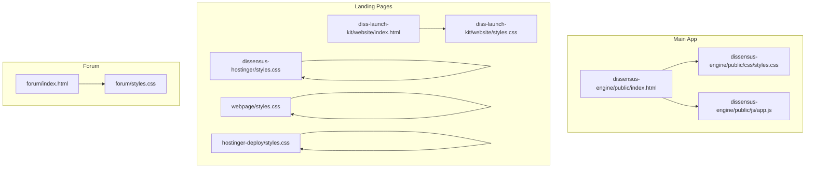
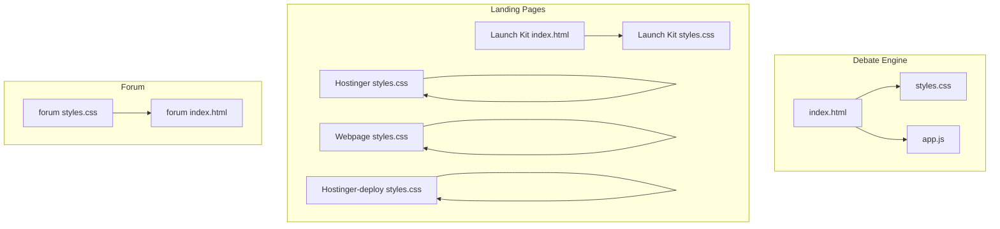
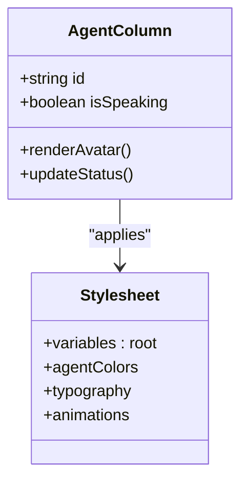
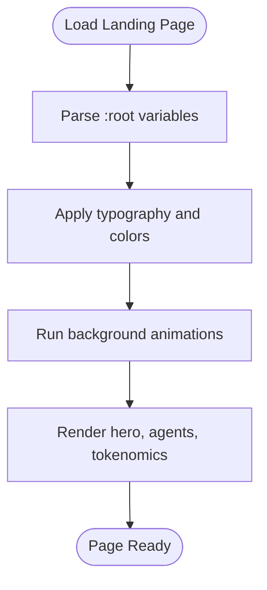
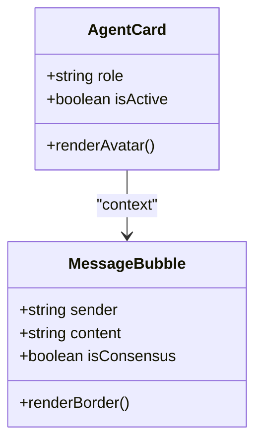
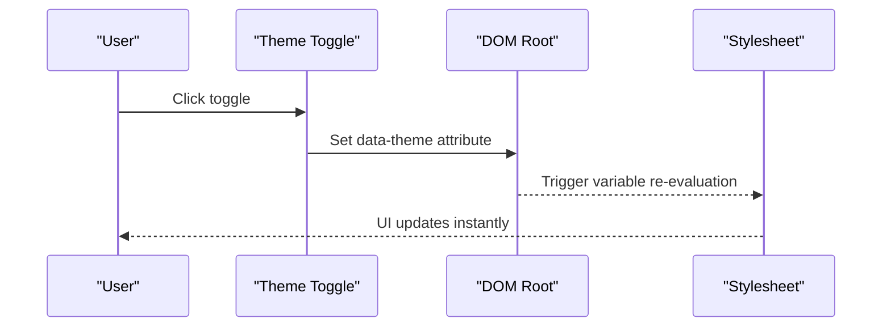
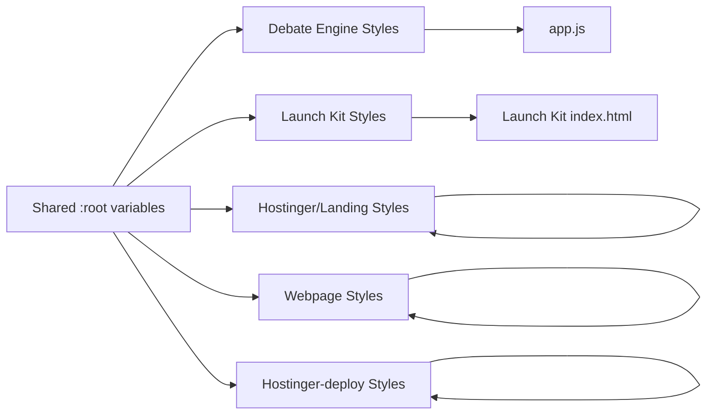

# Theme & Branding

<cite>
**Referenced Files in This Document**
- [dissensus-engine public styles.css](file://dissensus-engine/public/css/styles.css)
- [dissensus-engine public index.html](file://dissensus-engine/public/index.html)
- [dissensus-engine public app.js](file://dissensus-engine/public/js/app.js)
- [dissensus-hostinger styles.css](file://dissensus-hostinger/styles.css)
- [webpage styles.css](file://webpage/styles.css)
- [hostinger-deploy styles.css](file://hostinger-deploy/styles.css)
- [diss-launch-kit website styles.css](file://diss-launch-kit/website/styles.css)
- [diss-launch-kit website index.html](file://diss-launch-kit/website/index.html)
- [forum styles.css](file://forum/styles.css)
- [forum index.html](file://forum/index.html)
</cite>

## Table of Contents
1. [Introduction](#introduction)
2. [Project Structure](#project-structure)
3. [Core Components](#core-components)
4. [Architecture Overview](#architecture-overview)
5. [Detailed Component Analysis](#detailed-component-analysis)
6. [Dependency Analysis](#dependency-analysis)
7. [Performance Considerations](#performance-considerations)
8. [Troubleshooting Guide](#troubleshooting-guide)
9. [Conclusion](#conclusion)
10. [Appendices](#appendices)

## Introduction
This document explains how to customize the visual theme and branding of the Dissensus platform across its multiple deployment targets. It covers the CSS architecture, color schemes, typography, layout, responsive behavior, and agent-specific styling. It also documents how to integrate logos, favicons, and social sharing visuals; how to implement theme switching; and how to align frontend styling with agent visual identities. Guidance is provided for educational, corporate, and community scenarios.

## Project Structure
The Dissensus platform comprises several frontends, each with its own stylesheet and HTML structure:
- Debate engine (main app): styles.css and index.html define the core UI and agent columns.
- Hostinger landing page: styles.css provides a vibrant cyberpunk aesthetic with animated backgrounds.
- Web landing page: styles.css mirrors the Hostinger theme with similar variables and animations.
- Hostinger-deploy landing page: styles.css adds advanced animations and gradients.
- Launch kit website: styles.css and index.html define a full-featured landing page with hero, agents, and tokenomics.
- Forum: styles.css implements a dark theme with agent-specific color palettes and a dialectical discussion UI.

**Diagram sources**
- [dissensus-engine public index.html:1-187](file://dissensus-engine/public/index.html#L1-L187)
- [dissensus-engine public styles.css:1-998](file://dissensus-engine/public/css/styles.css#L1-L998)
- [dissensus-engine public app.js:1-674](file://dissensus-engine/public/js/app.js#L1-L674)
- [dissensus-hostinger styles.css:1-1247](file://dissensus-hostinger/styles.css#L1-L1247)
- [webpage styles.css:1-1247](file://webpage/styles.css#L1-L1247)
- [hostinger-deploy styles.css:1-1327](file://hostinger-deploy/styles.css#L1-L1327)
- [diss-launch-kit website styles.css:1-1185](file://diss-launch-kit/website/styles.css#L1-L1185)
- [diss-launch-kit website index.html:1-541](file://diss-launch-kit/website/index.html#L1-L541)
- [forum styles.css:1-771](file://forum/styles.css#L1-L771)
- [forum index.html:1-108](file://forum/index.html#L1-L108)

**Section sources**
- [dissensus-engine public index.html:1-187](file://dissensus-engine/public/index.html#L1-L187)
- [dissensus-engine public styles.css:1-998](file://dissensus-engine/public/css/styles.css#L1-L998)
- [dissensus-hostinger styles.css:1-1247](file://dissensus-hostinger/styles.css#L1-L1247)
- [webpage styles.css:1-1247](file://webpage/styles.css#L1-L1247)
- [hostinger-deploy styles.css:1-1327](file://hostinger-deploy/styles.css#L1-L1327)
- [diss-launch-kit website styles.css:1-1185](file://diss-launch-kit/website/styles.css#L1-L1185)
- [diss-launch-kit website index.html:1-541](file://diss-launch-kit/website/index.html#L1-L541)
- [forum styles.css:1-771](file://forum/styles.css#L1-L771)
- [forum index.html:1-108](file://forum/index.html#L1-L108)

## Core Components
- CSS variables: Centralized color and typography tokens are defined in :root blocks across stylesheets. These enable consistent theming and easy overrides.
- Typography: Inter and JetBrains Mono are used for body and mono fonts respectively, with clamp-based sizing for responsive headings.
- Layout: Grid-based agent columns, card-based sections, and responsive breakpoints ensure adaptability across devices.
- Animations: Pulse dots, typing indicators, gradient meshes, and floating glows enhance interactivity and visual interest.
- Agent identity: Color accents and borders reflect agent personalities (CIPHER red, NOVA green, PRISM blue) consistently across components.

Key customization touchpoints:
- Modify :root variables to change base colors, gradients, and typography families.
- Adjust component classes (e.g., .agent-column, .agent-card) to alter layout and spacing.
- Override animations and shadows to fit brand tone (e.g., reduce motion for accessibility).
- Integrate logos and favicons via HTML head and CSS background images.

**Section sources**
- [dissensus-engine public styles.css:6-27](file://dissensus-engine/public/css/styles.css#L6-L27)
- [dissensus-hostinger styles.css:12-33](file://dissensus-hostinger/styles.css#L12-L33)
- [webpage styles.css:12-33](file://webpage/styles.css#L12-L33)
- [hostinger-deploy styles.css:12-33](file://hostinger-deploy/styles.css#L12-L33)
- [diss-launch-kit website styles.css:12-33](file://diss-launch-kit/website/styles.css#L12-L33)
- [forum styles.css:5-50](file://forum/styles.css#L5-L50)

## Architecture Overview
The frontend architecture separates concerns across stylesheets and HTML pages. The debate engine’s index.html renders agent columns and content areas styled by styles.css. The landing pages share a cohesive design language with distinct visual treatments. The forum implements a specialized dark theme optimized for readability and agent differentiation.

**Diagram sources**
- [dissensus-engine public index.html:1-187](file://dissensus-engine/public/index.html#L1-L187)
- [dissensus-engine public styles.css:1-998](file://dissensus-engine/public/css/styles.css#L1-L998)
- [dissensus-engine public app.js:1-674](file://dissensus-engine/public/js/app.js#L1-L674)
- [dissensus-hostinger styles.css:1-1247](file://dissensus-hostinger/styles.css#L1-L1247)
- [webpage styles.css:1-1247](file://webpage/styles.css#L1-L1247)
- [hostinger-deploy styles.css:1-1327](file://hostinger-deploy/styles.css#L1-L1327)
- [diss-launch-kit website styles.css:1-1185](file://diss-launch-kit/website/styles.css#L1-L1185)
- [diss-launch-kit website index.html:1-541](file://diss-launch-kit/website/index.html#L1-L541)
- [forum styles.css:1-771](file://forum/styles.css#L1-L771)
- [forum index.html:1-108](file://forum/index.html#L1-L108)

## Detailed Component Analysis

### Debating Arena Styling
The debate arena displays three agent columns with distinct color accents and speaking states. Styling includes:
- Column borders and hover states keyed by agent class (cipher, nova, prism).
- Avatar borders and glow effects synchronized with agent colors.
- Status badges and typing indicators for real-time feedback.
- Scrollable content areas with themed scrollbars.

**Diagram sources**
- [dissensus-engine public styles.css:624-728](file://dissensus-engine/public/css/styles.css#L624-L728)
- [dissensus-engine public app.js:172-194](file://dissensus-engine/public/js/app.js#L172-L194)

**Section sources**
- [dissensus-engine public styles.css:624-728](file://dissensus-engine/public/css/styles.css#L624-L728)
- [dissensus-engine public app.js:172-194](file://dissensus-engine/public/js/app.js#L172-L194)

### Landing Page Themes
The landing pages share a consistent variable-based theme with variations:
- Hostinger and webpage: Dark backgrounds with animated grid and gradient mesh overlays.
- Hostinger-deploy: Enhanced animations including floating glows and gradient shifts.
- Launch kit: Full-page sections with animated hero, SVG icons, and gradient text effects.

**Diagram sources**
- [dissensus-hostinger styles.css:12-33](file://dissensus-hostinger/styles.css#L12-L33)
- [webpage styles.css:12-33](file://webpage/styles.css#L12-L33)
- [hostinger-deploy styles.css:61-105](file://hostinger-deploy/styles.css#L61-L105)
- [diss-launch-kit website styles.css:273-374](file://diss-launch-kit/website/styles.css#L273-L374)

**Section sources**
- [dissensus-hostinger styles.css:12-33](file://dissensus-hostinger/styles.css#L12-L33)
- [webpage styles.css:12-33](file://webpage/styles.css#L12-L33)
- [hostinger-deploy styles.css:61-105](file://hostinger-deploy/styles.css#L61-L105)
- [diss-launch-kit website styles.css:273-374](file://diss-launch-kit/website/styles.css#L273-L374)

### Forum Discussion UI
The forum implements a dark theme with agent-specific color palettes and a structured message bubble system:
- Agent cards with top borders and avatar glows.
- Message bubbles with left borders and background tints per agent.
- Consensus section with gradient accent and disagreement list.
- Responsive adjustments for mobile layouts.

**Diagram sources**
- [forum styles.css:293-392](file://forum/styles.css#L293-L392)
- [forum styles.css:452-544](file://forum/styles.css#L452-L544)
- [forum styles.css:598-644](file://forum/styles.css#L598-L644)

**Section sources**
- [forum styles.css:293-392](file://forum/styles.css#L293-L392)
- [forum styles.css:452-544](file://forum/styles.css#L452-L544)
- [forum styles.css:598-644](file://forum/styles.css#L598-L644)
- [forum index.html:1-108](file://forum/index.html#L1-L108)

### Theme Variables and Customization
Centralized variables enable rapid theme changes:
- Backgrounds: primary, secondary, card, hover variants.
- Agent colors: red (CIPHER), green (NOVA), cyan (PRISM) with glows and tints.
- Typography: Inter for body, JetBrains Mono for code-like elements.
- UI tokens: radii, shadows, transitions.

Examples of variables to modify:
- Replace --bg-primary and --bg-secondary for dark/light modes.
- Swap --red/--green/--cyan with brand-specific hues.
- Adjust --font-main and --font-mono for brand fonts.

**Section sources**
- [dissensus-engine public styles.css:6-27](file://dissensus-engine/public/css/styles.css#L6-L27)
- [dissensus-hostinger styles.css:12-33](file://dissensus-hostinger/styles.css#L12-L33)
- [webpage styles.css:12-33](file://webpage/styles.css#L12-L33)
- [hostinger-deploy styles.css:12-33](file://hostinger-deploy/styles.css#L12-L33)
- [diss-launch-kit website styles.css:12-33](file://diss-launch-kit/website/styles.css#L12-L33)
- [forum styles.css:5-50](file://forum/styles.css#L5-L50)

### Logo, Favicon, and Social Sharing
- Logo integration: The debate engine header logo and the launch kit site logo are defined in HTML and styled via CSS classes.
- Favicon customization: Both the debate engine and forum set favicons via data URLs in the HTML head.
- Social sharing visuals: The launch kit sets Open Graph and Twitter meta tags pointing to banner images.

Recommendations:
- Replace header logo images with brand assets.
- Update favicon PNG/SVG in the launch kit website.
- Use canonical URLs and OG images aligned with brand guidelines.

**Section sources**
- [dissensus-engine public index.html:30-41](file://dissensus-engine/public/index.html#L30-L41)
- [diss-launch-kit website index.html:6-14](file://diss-launch-kit/website/index.html#L6-L14)
- [forum index.html:9-10](file://forum/index.html#L9-L10)

### Theme Switching Implementation
Current state:
- No explicit theme switching logic exists in the referenced files.

Proposed approach:
- Add a toggle element in the header/footer of each page.
- Maintain two sets of :root variables (e.g., dark and light) and switch via a data attribute on the root element.
- Update CSS selectors to read from the active theme variables.
- Persist user preference in localStorage and apply on page load.

[No sources needed since this diagram shows conceptual workflow, not actual code structure]

### Mobile Responsiveness and Accessibility
- Breakpoints: Several stylesheets include media queries for mobile layouts (e.g., forum grid collapses to single column).
- Typography scaling: clamp() ensures readable sizes across viewport widths.
- Motion preferences: Consider reducing animations for users with vestibular disorders.

Recommendations:
- Audit animations and provide reduced-motion alternatives.
- Test contrast ratios against WCAG guidelines.
- Ensure interactive elements meet minimum touch targets.

**Section sources**
- [forum styles.css:726-771](file://forum/styles.css#L726-L771)

### Browser Compatibility
- CSS variables are widely supported in modern browsers.
- Grid and Flexbox are used extensively; ensure vendor prefixes if legacy support is required.
- Animations rely on keyframes and transforms; verify fallbacks for older environments.

[No sources needed since this section provides general guidance]

## Dependency Analysis
The styling architecture relies on shared variables and component classes across pages. The debate engine depends on styles.css for agent visuals and app.js for runtime state updates. Landing pages share common variable definitions, while the forum maintains its own palette for readability and agent differentiation.

**Diagram sources**
- [dissensus-engine public styles.css:6-27](file://dissensus-engine/public/css/styles.css#L6-L27)
- [dissensus-hostinger styles.css:12-33](file://dissensus-hostinger/styles.css#L12-L33)
- [webpage styles.css:12-33](file://webpage/styles.css#L12-L33)
- [hostinger-deploy styles.css:12-33](file://hostinger-deploy/styles.css#L12-L33)
- [diss-launch-kit website styles.css:12-33](file://diss-launch-kit/website/styles.css#L12-L33)
- [diss-launch-kit website index.html:1-541](file://diss-launch-kit/website/index.html#L1-L541)
- [dissensus-engine public app.js:1-674](file://dissensus-engine/public/js/app.js#L1-L674)

**Section sources**
- [dissensus-engine public styles.css:6-27](file://dissensus-engine/public/css/styles.css#L6-L27)
- [dissensus-hostinger styles.css:12-33](file://dissensus-hostinger/styles.css#L12-L33)
- [webpage styles.css:12-33](file://webpage/styles.css#L12-L33)
- [hostinger-deploy styles.css:12-33](file://hostinger-deploy/styles.css#L12-L33)
- [diss-launch-kit website styles.css:12-33](file://diss-launch-kit/website/styles.css#L12-L33)
- [diss-launch-kit website index.html:1-541](file://diss-launch-kit/website/index.html#L1-L541)
- [dissensus-engine public app.js:1-674](file://dissensus-engine/public/js/app.js#L1-L674)

## Performance Considerations
- Prefer CSS variables for colors and typography to minimize repaint costs.
- Use transform and opacity for animations to leverage GPU acceleration.
- Avoid excessive z-index stacking and layered filters on low-power devices.
- Lazy-load non-critical images (e.g., character portraits) to improve initial load.

[No sources needed since this section provides general guidance]

## Troubleshooting Guide
Common issues and resolutions:
- Colors not updating: Verify :root variable overrides are applied before component styles.
- Animations feel heavy: Reduce or disable animations for users with motion sensitivity.
- Mobile layout breaks: Confirm media queries and clamp() usage are intact; test on device emulators.
- Social previews incorrect: Ensure meta tags (OG/Twitter) point to valid, appropriately sized images.

**Section sources**
- [diss-launch-kit website index.html:6-14](file://diss-launch-kit/website/index.html#L6-L14)
- [forum styles.css:726-771](file://forum/styles.css#L726-L771)

## Conclusion
The Dissensus platform offers a flexible, variable-driven CSS architecture suitable for extensive theming and branding customization. By centralizing design tokens, leveraging agent-specific color systems, and maintaining responsive and accessible patterns, teams can tailor the UI for diverse contexts—from educational institutions to corporate environments to community platforms—while preserving the distinctive agent identities and engaging visual language.

## Appendices

### Templates and Examples by Scenario
- Educational institution:
  - Use muted, professional color palettes; emphasize readability and contrast.
  - Keep animations subtle; ensure large text sizes and clear hierarchy.
- Corporate environment:
  - Adopt neutral tones with brand accent colors; maintain strict alignment with brand guidelines.
  - Favor clean grids and minimal motion; prioritize clarity and trust.
- Community platform:
  - Embrace vibrant, dynamic themes with strong agent identity cues.
  - Include playful animations and gradient accents; ensure inclusive contrast.

[No sources needed since this section provides general guidance]