# Deployment & Operations

<cite>
**Referenced Files in This Document**
- [VPS-DEPLOY.md](file://VPS-DEPLOY.md)
- [DEPLOY-VPS.md](file://dissensus-engine/docs/DEPLOY-VPS.md)
- [setup-vps.sh](file://dissensus-engine/docs/configs/setup-vps.sh)
- [dissensus.service](file://dissensus-engine/docs/configs/dissensus.service)
- [nginx-dissensus.conf](file://dissensus-engine/docs/configs/nginx-dissensus.conf)
- [dissensus-nginx-ssl.conf](file://dissensus-engine/docs/configs/dissensus-nginx-ssl.conf)
- [deploy-env-to-vps.ps1](file://dissensus-engine/deploy-env-to-vps.ps1)
- [DEPLOY-GIT.md](file://dissensus-engine/DEPLOY-GIT.md)
- [Dockerfile](file://dissensus-engine/Dockerfile)
- [docker-compose.yml](file://dissensus-engine/docker-compose.yml)
- [.dockerignore](file://dissensus-engine/.dockerignore)
- [index.js](file://dissensus-engine/server/index.js)
- [package.json](file://dissensus-engine/package.json)
- [db.js](file://dissensus-engine/server/db.js)
- [.gitignore](file://.gitignore)
- [README.md](file://dissensus-engine/README.md)
</cite>

## Update Summary
**Changes Made**
- Enhanced Docker deployment support with multi-stage build process for better-sqlite3 native dependencies
- Updated .gitignore to exclude SQLite database file (dissensus.db) and related data files
- Improved containerized deployment reliability for database-dependent applications
- Added comprehensive SQLite database management to deployment documentation

## Table of Contents
1. [Introduction](#introduction)
2. [Project Structure](#project-structure)
3. [Core Components](#core-components)
4. [Architecture Overview](#architecture-overview)
5. [Detailed Component Analysis](#detailed-component-analysis)
6. [Docker Containerization](#docker-containerization)
7. [Database Management](#database-management)
8. [Dependency Analysis](#dependency-analysis)
9. [Performance Considerations](#performance-considerations)
10. [Troubleshooting Guide](#troubleshooting-guide)
11. [Conclusion](#conclusion)
12. [Appendices](#appendices)

## Introduction
This document provides comprehensive deployment and operations guidance for the Dissensus AI Debate Engine across development and production environments. It covers VPS deployment using the included PowerShell automation, nginx reverse proxy configuration, systemd service management, SSL certificate setup with Let's Encrypt, environment variable configuration, reverse proxy and security hardening, automated deployment pipelines, monitoring and log management, performance tuning, scaling, backups, disaster recovery, and troubleshooting. It also explains the relationship between development, staging, and production deployment targets, and now includes comprehensive Docker containerization support for production-ready deployment options with enhanced SQLite database management.

## Project Structure
The deployment-related materials are primarily located under the dissensus-engine module and its docs/configs directory. The key elements include:
- A PowerShell script to upload environment variables to a VPS
- A comprehensive VPS deployment guide with step-by-step instructions
- A quick-setup shell script for automating initial server provisioning
- Nginx configuration templates for reverse proxy and SSL
- A systemd unit file for service lifecycle management
- Git-based deployment instructions for continuous updates
- Docker containerization support with multi-stage Dockerfile, docker-compose.yml, and .dockerignore
- The Node.js server implementation that exposes SSE streaming and API endpoints
- SQLite database management with better-sqlite3 for persistent data storage

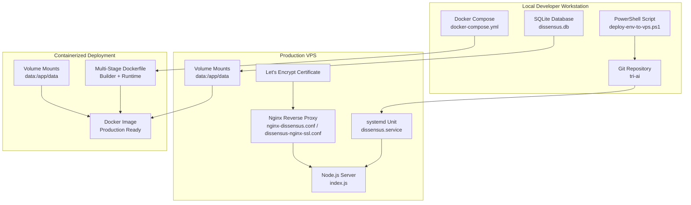

**Diagram sources**
- [deploy-env-to-vps.ps1:1-50](file://dissensus-engine/deploy-env-to-vps.ps1#L1-L50)
- [dissensus.service:1-27](file://dissensus-engine/docs/configs/dissensus.service#L1-L27)
- [index.js:1-481](file://dissensus-engine/server/index.js#L1-L481)
- [nginx-dissensus.conf:1-81](file://dissensus-engine/docs/configs/nginx-dissensus.conf#L1-L81)
- [dissensus-nginx-ssl.conf:1-68](file://dissensus-engine/docs/configs/dissensus-nginx-ssl.conf#L1-L68)
- [Dockerfile:1-26](file://dissensus-engine/Dockerfile#L1-L26)
- [docker-compose.yml:1-12](file://dissensus-engine/docker-compose.yml#L1-L12)
- [.dockerignore:1-8](file://dissensus-engine/.dockerignore#L1-L8)
- [db.js:1-47](file://dissensus-engine/server/db.js#L1-L47)

**Section sources**
- [README.md:110-134](file://dissensus-engine/README.md#L110-L134)
- [DEPLOY-VPS.md:1-25](file://dissensus-engine/docs/DEPLOY-VPS.md#L1-L25)
- [Dockerfile:1-26](file://dissensus-engine/Dockerfile#L1-L26)
- [docker-compose.yml:1-12](file://dissensus-engine/docker-compose.yml#L1-L12)
- [db.js:1-47](file://dissensus-engine/server/db.js#L1-L47)

## Core Components
- Node.js server (Express) with SSE streaming for real-time debates
- Nginx reverse proxy with security headers, gzip compression, static asset caching, and SSE-specific streaming configuration
- systemd service for process management, auto-start, and resilience
- SSL termination via Certbot/Let's Encrypt
- Environment-driven configuration for providers, staking enforcement, and reverse proxy trust
- Automated deployment via PowerShell and Git pull
- **Enhanced**: Docker containerization with multi-stage build process supporting native dependencies for better-sqlite3
- **New**: SQLite database management with persistent volume mounting and WAL mode optimization

**Section sources**
- [index.js:26-56](file://dissensus-engine/server/index.js#L26-L56)
- [index.js:220-311](file://dissensus-engine/server/index.js#L220-L311)
- [nginx-dissensus.conf:11-21](file://dissensus-engine/docs/configs/nginx-dissensus.conf#L11-L21)
- [nginx-dissensus.conf:42-60](file://dissensus-engine/docs/configs/nginx-dissensus.conf#L42-L60)
- [dissensus.service:1-27](file://dissensus-engine/docs/configs/dissensus.service#L1-L27)
- [dissensus-nginx-ssl.conf:21-57](file://dissensus-engine/docs/configs/dissensus-nginx-ssl.conf#L21-L57)
- [README.md:136-151](file://dissensus-engine/README.md#L136-L151)
- [Dockerfile:1-26](file://dissensus-engine/Dockerfile#L1-L26)
- [docker-compose.yml:1-12](file://dissensus-engine/docker-compose.yml#L1-L12)
- [db.js:1-47](file://dissensus-engine/server/db.js#L1-L47)

## Architecture Overview
The production architecture uses Nginx as a reverse proxy terminating TLS, applying security headers, compressing responses, and serving static assets. Nginx forwards API and SSE traffic to the Node.js server on localhost. The systemd service manages the Node.js process, ensuring it starts on boot and restarts on failure. SSL certificates are provisioned and renewed automatically via Certbot. **Enhanced**: Docker containerization provides an alternative deployment model with standardized container images, volume management, and simplified orchestration. The multi-stage build process ensures native dependencies like better-sqlite3 compile correctly in the container environment. **New**: SQLite database management is handled through persistent volume mounts with WAL mode optimization for concurrent read performance.

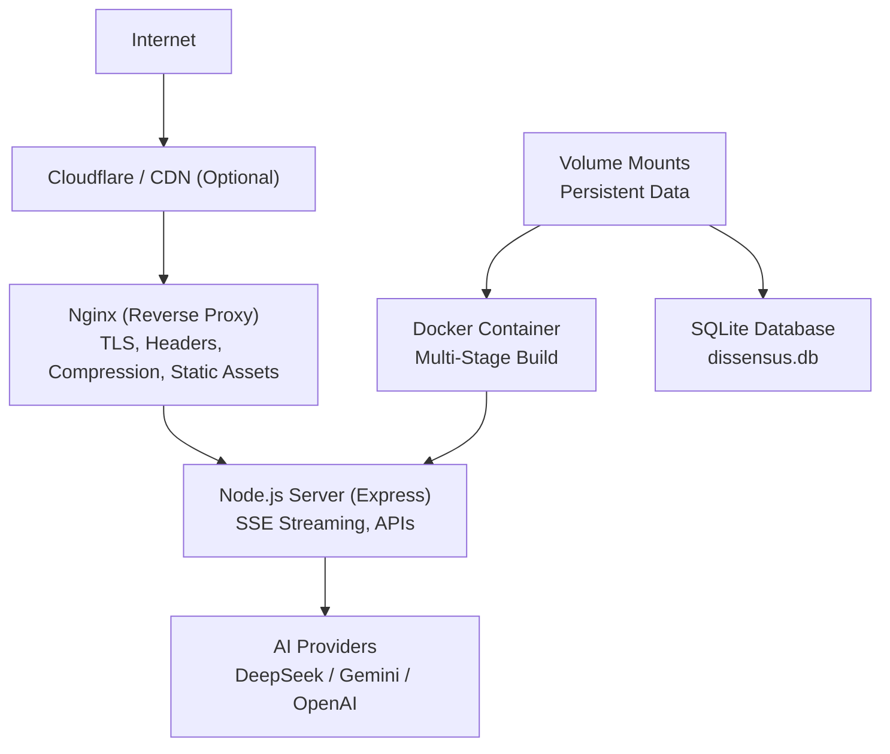

**Diagram sources**
- [DEPLOY-VPS.md:711-740](file://dissensus-engine/docs/DEPLOY-VPS.md#L711-L740)
- [nginx-dissensus.conf:1-81](file://dissensus-engine/docs/configs/nginx-dissensus.conf#L1-L81)
- [dissensus-nginx-ssl.conf:1-68](file://dissensus-engine/docs/configs/dissensus-nginx-ssl.conf#L1-L68)
- [index.js:220-311](file://dissensus-engine/server/index.js#L220-L311)
- [Dockerfile:1-26](file://dissensus-engine/Dockerfile#L1-L26)
- [docker-compose.yml:1-12](file://dissensus-engine/docker-compose.yml#L1-L12)
- [db.js:1-47](file://dissensus-engine/server/db.js#L1-L47)

## Detailed Component Analysis

### VPS Deployment with PowerShell (.env Automation)
- Purpose: Automate uploading a local .env file to a VPS and validate placeholders before transfer.
- Behavior:
  - Creates .env from .env.example if missing locally.
  - Prompts for editing if placeholders are detected.
  - Validates that placeholders are replaced before proceeding.
  - Uses scp to upload .env to the VPS target path.
  - Provides post-upload guidance to restart the service.

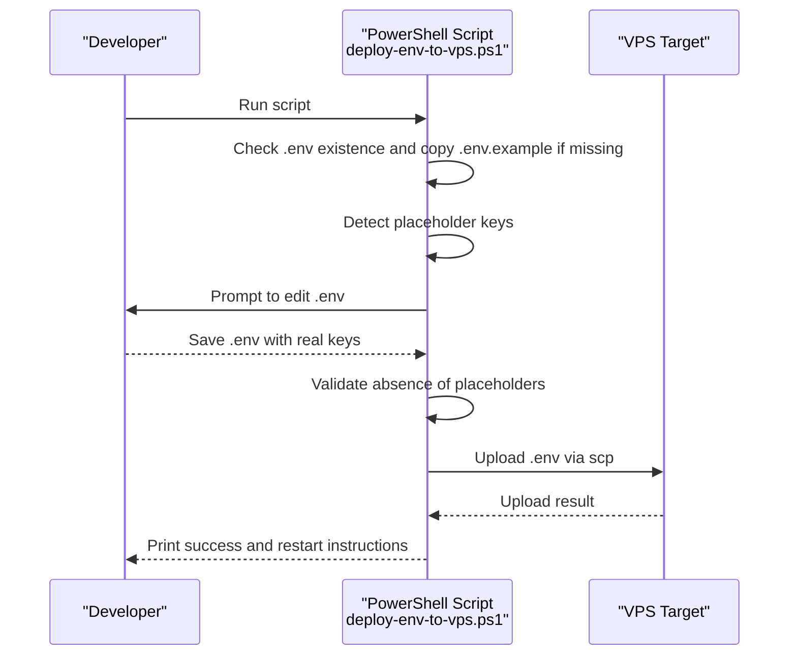

**Diagram sources**
- [deploy-env-to-vps.ps1:1-50](file://dissensus-engine/deploy-env-to-vps.ps1#L1-L50)

**Section sources**
- [deploy-env-to-vps.ps1:1-50](file://dissensus-engine/deploy-env-to-vps.ps1#L1-L50)

### Initial VPS Setup (Automated Shell Script)
- Purpose: Provision a fresh Ubuntu VPS with Node.js, Nginx, Certbot, UFW, and systemd service.
- Behavior:
  - Updates system packages and creates a non-root user with sudo access.
  - Installs Node.js 20 LTS and enables Nginx.
  - Installs Certbot and configures UFW firewall rules for SSH, HTTP, and HTTPS.
  - Writes the systemd unit file and Nginx site configuration.
  - Prints manual next steps for code upload, installation, DNS, and SSL issuance.

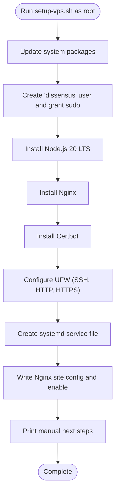

**Diagram sources**
- [setup-vps.sh:1-247](file://dissensus-engine/docs/configs/setup-vps.sh#L1-L247)

**Section sources**
- [setup-vps.sh:1-247](file://dissensus-engine/docs/configs/setup-vps.sh#L1-L247)

### Manual VPS Deployment (Step-by-Step Guide)
- Covers prerequisites, connecting to VPS, initial setup, installing Node.js, deploying the engine, configuring environment variables, creating a systemd service, installing and configuring Nginx, setting up SSL with Let's Encrypt, pointing domains, firewall configuration, verification, maintenance, and troubleshooting.

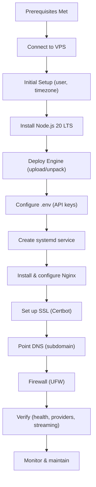

**Diagram sources**
- [DEPLOY-VPS.md:26-523](file://dissensus-engine/docs/DEPLOY-VPS.md#L26-L523)

**Section sources**
- [DEPLOY-VPS.md:26-523](file://dissensus-engine/docs/DEPLOY-VPS.md#L26-L523)

### Nginx Reverse Proxy Configuration
- Purpose: Terminate TLS, apply security headers, compress responses, cache static assets, and proxy API and SSE endpoints to the Node.js server.
- Key elements:
  - Security headers (frame options, content type options, XSS protection, referrer policy).
  - Gzip compression with targeted MIME types.
  - Static asset caching via aliases and expires directives.
  - SSE streaming block disables buffering and sets long timeouts.
  - API and root location blocks forward headers and connection details.

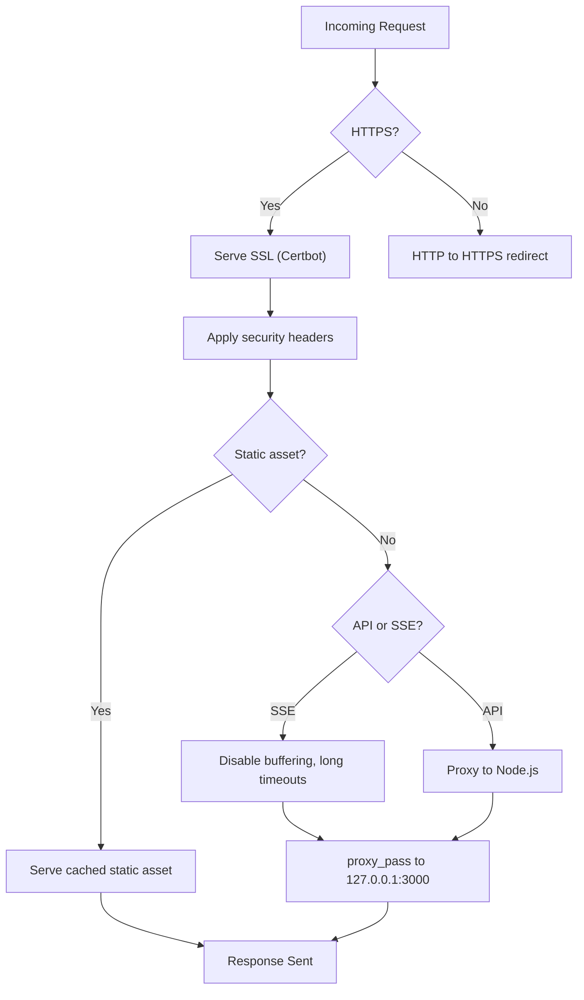

**Diagram sources**
- [nginx-dissensus.conf:11-21](file://dissensus-engine/docs/configs/nginx-dissensus.conf#L11-L21)
- [nginx-dissensus.conf:42-60](file://dissensus-engine/docs/configs/nginx-dissensus.conf#L42-L60)
- [nginx-dissensus.conf:62-81](file://dissensus-engine/docs/configs/nginx-dissensus.conf#L62-L81)
- [dissensus-nginx-ssl.conf:21-57](file://dissensus-engine/docs/configs/dissensus-nginx-ssl.conf#L21-L57)

**Section sources**
- [nginx-dissensus.conf:1-81](file://dissensus-engine/docs/configs/nginx-dissensus.conf#L1-L81)
- [dissensus-nginx-ssl.conf:1-68](file://dissensus-engine/docs/configs/dissensus-nginx-ssl.conf#L1-L68)

### Systemd Service Management
- Purpose: Manage the Node.js process with auto-start, restart on failure, and hardened resource controls.
- Key elements:
  - User/group isolation, working directory, and ExecStart pointing to the server entry.
  - Restart policy and delays.
  - Logging to syslog with a dedicated identifier.
  - Environment variables and EnvironmentFile for .env loading.
  - Security enhancements: NoNewPrivileges, ProtectSystem, ProtectHome, and ReadWritePaths.

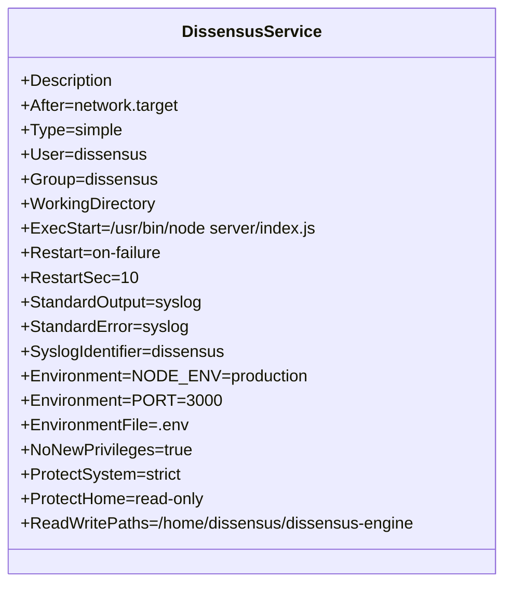

**Diagram sources**
- [dissensus.service:1-27](file://dissensus-engine/docs/configs/dissensus.service#L1-L27)

**Section sources**
- [dissensus.service:1-27](file://dissensus-engine/docs/configs/dissensus.service#L1-L27)

### SSL Certificate Setup with Let's Encrypt
- Purpose: Provision and automate renewal of free TLS certificates for the subdomain.
- Behavior:
  - Install Certbot with Nginx plugin.
  - Obtain certificate for the subdomain.
  - Certbot modifies Nginx configuration and sets up automatic renewal.

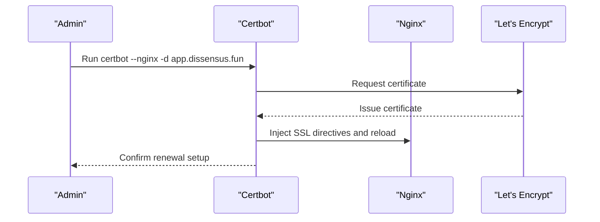

**Diagram sources**
- [DEPLOY-VPS.md:389-412](file://dissensus-engine/docs/DEPLOY-VPS.md#L389-L412)
- [dissensus-nginx-ssl.conf:51-57](file://dissensus-engine/docs/configs/dissensus-nginx-ssl.conf#L51-L57)

**Section sources**
- [DEPLOY-VPS.md:389-412](file://dissensus-engine/docs/DEPLOY-VPS.md#L389-L412)
- [dissensus-nginx-ssl.conf:51-57](file://dissensus-engine/docs/configs/dissensus-nginx-ssl.conf#L51-L57)

### Environment Variable Configuration
- Purpose: Control runtime behavior including provider keys, staking enforcement, reverse proxy trust, and Solana settings.
- Key variables:
  - PORT, SOLANA_RPC_URL, DISS_TOKEN_MINT, SOLANA_CLUSTER, DISS_STAKING_PROGRAM_ID, TRUST_PROXY, TRUST_PROXY_HOPS.
- Server behavior:
  - Loads .env via dotenv.
  - Enables trust proxy based on environment for accurate client IP detection behind Nginx.
  - Exposes provider availability and server-side key presence to clients.

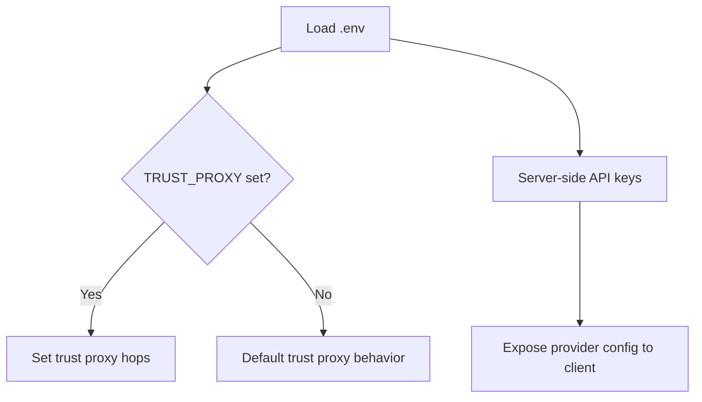

**Diagram sources**
- [index.js:6-45](file://dissensus-engine/server/index.js#L6-L45)
- [index.js:69-85](file://dissensus-engine/server/index.js#L69-L85)
- [README.md:136-151](file://dissensus-engine/README.md#L136-L151)

**Section sources**
- [index.js:6-45](file://dissensus-engine/server/index.js#L6-L45)
- [index.js:69-85](file://dissensus-engine/server/index.js#L69-L85)
- [README.md:136-151](file://dissensus-engine/README.md#L136-L151)

### Reverse Proxy and Security Hardening
- Purpose: Secure and optimize traffic flow to the Node.js server.
- Hardening measures:
  - Security headers in Nginx configuration.
  - Gzip compression for bandwidth savings.
  - static asset caching to reduce origin load.
  - SSE streaming block disables buffering and increases timeouts.
  - Firewall allows only SSH, HTTP, and HTTPS.

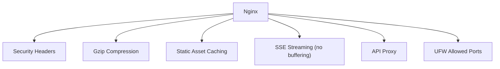

**Diagram sources**
- [nginx-dissensus.conf:11-21](file://dissensus-engine/docs/configs/nginx-dissensus.conf#L11-L21)
- [nginx-dissensus.conf:42-60](file://dissensus-engine/docs/configs/nginx-dissensus.conf#L42-L60)
- [DEPLOY-VPS.md:456-492](file://dissensus-engine/docs/DEPLOY-VPS.md#L456-L492)

**Section sources**
- [nginx-dissensus.conf:11-21](file://dissensus-engine/docs/configs/nginx-dissensus.conf#L11-L21)
- [nginx-dissensus.conf:42-60](file://dissensus-engine/docs/configs/nginx-dissensus.conf#L42-L60)
- [DEPLOY-VPS.md:456-492](file://dissensus-engine/docs/DEPLOY-VPS.md#L456-L492)

### Automated Deployment Pipelines
- Git-based deployment:
  - Clone repository on VPS, install dependencies, copy and edit .env, create systemd service, and manage updates via systemctl.
  - Includes a helper script to automate pull, install, and restart.
- PowerShell-based .env deployment:
  - Local automation to upload .env to VPS and prompt for key replacement.

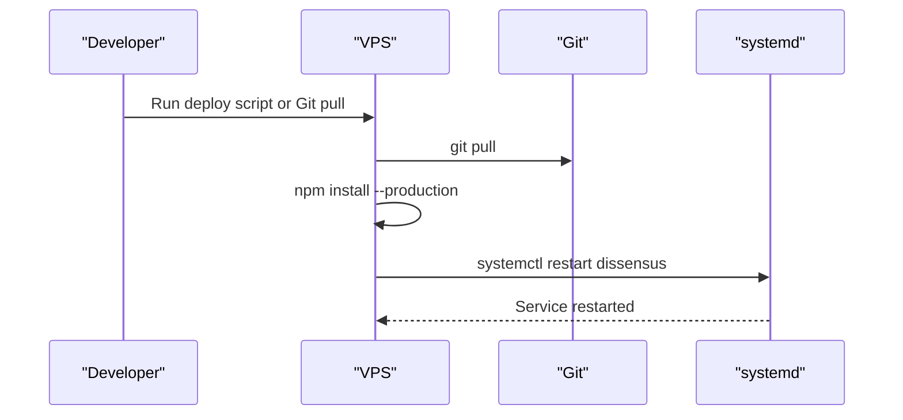

**Diagram sources**
- [DEPLOY-GIT.md:82-116](file://dissensus-engine/DEPLOY-GIT.md#L82-L116)
- [VPS-DEPLOY.md:3-10](file://VPS-DEPLOY.md#L3-L10)

**Section sources**
- [DEPLOY-GIT.md:1-116](file://dissensus-engine/DEPLOY-GIT.md#L1-L116)
- [VPS-DEPLOY.md:3-10](file://VPS-DEPLOY.md#L3-L10)

### Monitoring, Logs, and Verification
- Monitoring:
  - systemd journal for application logs.
  - Nginx access and error logs.
  - System metrics (disk, memory, CPU).
- Verification:
  - Health endpoints for Node.js and provider availability.
  - Live debate testing to confirm SSE streaming.

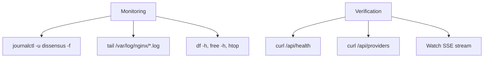

**Diagram sources**
- [DEPLOY-VPS.md:536-598](file://dissensus-engine/docs/DEPLOY-VPS.md#L536-L598)
- [DEPLOY-VPS.md:495-533](file://dissensus-engine/docs/DEPLOY-VPS.md#L495-L533)

**Section sources**
- [DEPLOY-VPS.md:536-598](file://dissensus-engine/docs/DEPLOY-VPS.md#L536-L598)
- [DEPLOY-VPS.md:495-533](file://dissensus-engine/docs/DEPLOY-VPS.md#L495-L533)

### Relationship Between Environments (Development, Staging, Production)
- Development:
  - Local Node.js server with optional .env for API keys.
  - No reverse proxy or SSL required.
- Staging:
  - Similar to production but with reduced scale and possibly self-signed or staging certificates.
- Production:
  - Nginx reverse proxy, systemd service, Let's Encrypt SSL, firewall hardening, and automated deployments.
- **Enhanced**: Containerized deployment:
  - Docker containerization provides standardized production deployment with volume management, multi-stage build process, and orchestration.
  - Native dependencies like better-sqlite3 are properly compiled during the build stage.

## Docker Containerization

### Enhanced Dockerfile Configuration
The Dockerfile now implements a multi-stage build process to properly handle native dependencies for better-sqlite3:

- **Stage 1 (Builder)**: Full Node.js 20 image with build tools for compiling native addons
- **Stage 2 (Runtime)**: Slim Node.js 20 image without build dependencies for production
- **Build Process**: Compiles better-sqlite3 and other native dependencies in builder stage
- **Runtime Optimization**: Copies only compiled node_modules to final image
- **Application Setup**: Complete source copy with debate data directory creation
- **Port Exposure**: Standard 3000 port for the Node.js server
- **Entry Point**: Direct execution of the Node.js server

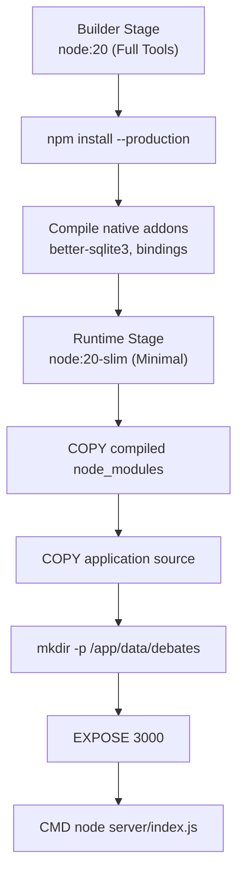

**Diagram sources**
- [Dockerfile:1-26](file://dissensus-engine/Dockerfile#L1-L26)

**Section sources**
- [Dockerfile:1-26](file://dissensus-engine/Dockerfile#L1-L26)

### Docker Compose Orchestration
The docker-compose.yml defines a production-ready service configuration:

- **Service Definition**: dissensus-engine with build context from current directory
- **Port Mapping**: 3000:3000 for container exposure
- **Environment Management**: Uses .env file for configuration
- **Volume Persistence**: Maps ./data to /app/data for persistent storage
- **Container Lifecycle**: Automatic restart policy for reliability

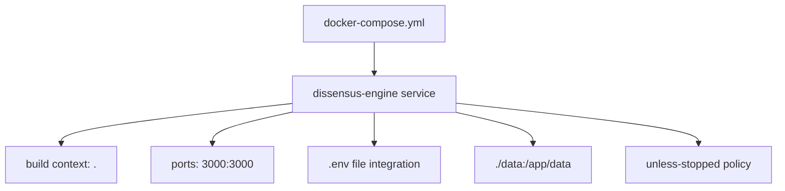

**Diagram sources**
- [docker-compose.yml:1-12](file://dissensus-engine/docker-compose.yml#L1-L12)

**Section sources**
- [docker-compose.yml:1-12](file://dissensus-engine/docker-compose.yml#L1-L12)

### Enhanced Docker Ignore Configuration
The .dockerignore file optimizes build performance and security:

- **Node Modules**: Excludes installed dependencies from build context
- **Environment Files**: Prevents accidental exposure of sensitive configuration
- **Version Control**: Ignores .git metadata and history
- **Documentation**: Excludes README files and documentation directories
- **Archives**: Prevents .zip files from being included
- **Data Directory**: Excludes local data directory for container persistence
- **SQLite Database**: Excludes SQLite database file (dissensus.db) from build context

**Section sources**
- [.dockerignore:1-8](file://dissensus-engine/.dockerignore#L1-L8)

### Containerized Deployment Benefits
- **Consistency**: Standardized environment across development and production
- **Isolation**: Clean separation of application dependencies
- **Scalability**: Easy horizontal scaling with container orchestration platforms
- **Persistence**: Volume mounts ensure data survives container recreation
- **Security**: Reduced attack surface with minimal base image
- **Reliability**: Multi-stage build ensures native dependencies compile correctly
- **Portability**: Self-contained deployment units

### Container Deployment Options
- **Local Development**: docker-compose up for isolated development environment
- **Production Deployment**: Kubernetes, Docker Swarm, or standalone container deployment
- **Volume Management**: Persistent data storage through mounted volumes
- **Environment Configuration**: External .env file integration for sensitive configuration
- **Scaling**: Horizontal scaling through container replicas and load balancing

**Section sources**
- [Dockerfile:1-26](file://dissensus-engine/Dockerfile#L1-L26)
- [docker-compose.yml:1-12](file://dissensus-engine/docker-compose.yml#L1-L12)
- [.dockerignore:1-8](file://dissensus-engine/.dockerignore#L1-L8)

## Database Management

### SQLite Database Architecture
The application uses SQLite with better-sqlite3 for persistent data storage:

- **Database Location**: data/dissensus.db in the application directory
- **WAL Mode**: Enabled for improved concurrent read performance
- **Foreign Keys**: Enabled for data integrity
- **Table Structure**: Users, Workspaces, and Workspace Members tables
- **Indexes**: Optimized indexes for email and membership queries

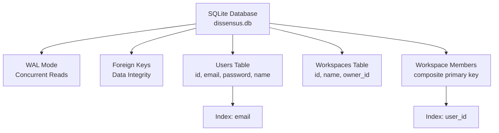

**Diagram sources**
- [db.js:1-47](file://dissensus-engine/server/db.js#L1-L47)

**Section sources**
- [db.js:1-47](file://dissensus-engine/server/db.js#L1-L47)

### Database Initialization and Migration
- **Automatic Creation**: Database file and tables are created on first run
- **Directory Management**: Data directory is created if it doesn't exist
- **Schema Management**: SQL statements handle table creation and indexing
- **Volume Persistence**: Database persists across container restarts

### Git Ignore Configuration for Database Files
The .gitignore file excludes SQLite database files and related data:

- **Database File**: data/dissensus.db (SQLite database file)
- **Debate Data**: data/debates/ (debate content directory)
- **User Data**: data/users.json (user information)
- **Workspace Data**: data/workspaces.json (workspace information)

**Section sources**
- [.gitignore:58-62](file://.gitignore#L58-L62)
- [db.js:1-47](file://dissensus-engine/server/db.js#L1-L47)

### Container Database Management
- **Volume Mounts**: Persistent storage through ./data to /app/data mapping
- **File Permissions**: Database files are writable by the application
- **Backup Strategy**: Volume snapshots for database backup
- **Migration Support**: Schema changes applied on container startup

**Section sources**
- [docker-compose.yml:9-11](file://dissensus-engine/docker-compose.yml#L9-L11)
- [db.js:5-6](file://dissensus-engine/server/db.js#L5-L6)

## Dependency Analysis
- Node.js server depends on:
  - dotenv for environment variables.
  - express for routing and middleware.
  - helmet for security headers.
  - express-rate-limit for abuse prevention.
  - SSE streaming for real-time debate output.
  - **Enhanced**: better-sqlite3 for SQLite database operations.
- Nginx depends on:
  - Correct proxy headers and timeouts for SSE.
  - SSL configuration for HTTPS.
- Systemd depends on:
  - Correct ExecStart path and EnvironmentFile.
  - Proper permissions and working directory.
- **Enhanced**: Docker containerization adds:
  - Multi-stage build dependencies for native addon compilation.
  - Volume mount dependencies for persistent data storage.
  - Network configuration for container communication.
- **New**: SQLite database dependencies:
  - better-sqlite3 native dependencies require build tools.
  - WAL mode and foreign key pragmas for database optimization.

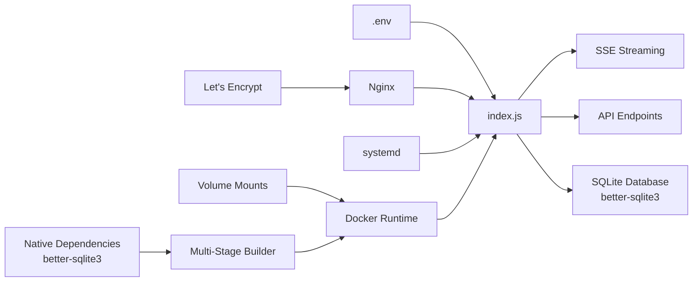

**Diagram sources**
- [index.js:6-28](file://dissensus-engine/server/index.js#L6-L28)
- [nginx-dissensus.conf:42-81](file://dissensus-engine/docs/configs/nginx-dissensus.conf#L42-L81)
- [dissensus.service:10-18](file://dissensus-engine/docs/configs/dissensus.service#L10-L18)
- [Dockerfile:1-26](file://dissensus-engine/Dockerfile#L1-L26)
- [docker-compose.yml:9-11](file://dissensus-engine/docker-compose.yml#L9-L11)
- [db.js:1-47](file://dissensus-engine/server/db.js#L1-L47)
- [package.json:13](file://dissensus-engine/package.json#L13)

**Section sources**
- [package.json:10-27](file://dissensus-engine/package.json#L10-L27)
- [index.js:6-28](file://dissensus-engine/server/index.js#L6-L28)
- [Dockerfile:1-26](file://dissensus-engine/Dockerfile#L1-L26)
- [docker-compose.yml:1-12](file://dissensus-engine/docker-compose.yml#L1-L12)
- [db.js:1-47](file://dissensus-engine/server/db.js#L1-L47)

## Performance Considerations
- SSE streaming:
  - Ensure Nginx disables buffering for the SSE endpoint to avoid client-side delays.
  - Increase proxy timeouts for long debates.
- Compression and caching:
  - Enable gzip and cache static assets to reduce origin load and latency.
- Resource limits:
  - Monitor memory and CPU; add swap if needed on constrained VPS instances.
- Provider selection:
  - Choose providers/models based on cost/performance trade-offs.
- **Enhanced**: Container performance:
  - Optimize container resource limits and memory allocation.
  - Use appropriate container registry and image caching strategies.
  - Implement health checks and graceful shutdown handling.
  - **New**: Multi-stage build reduces final image size and improves startup performance.
- **New**: Database performance:
  - WAL mode improves concurrent read performance.
  - Foreign key constraints ensure data integrity.
  - Proper indexing on frequently queried columns.

## Troubleshooting Guide
Common issues and resolutions:
- 502 Bad Gateway:
  - Check systemd service status and restart if needed; review recent logs.
- Connection refused on port 3000:
  - Verify the service is running and listening; start the service if not.
- SSE streaming not working:
  - Confirm Nginx configuration disables buffering and sets appropriate timeouts; reload Nginx after changes.
- SSL certificate issues:
  - Ensure subdomain points to VPS IP; verify firewall allows HTTP; retry with verbose output.
- Out of memory:
  - Add swap space and monitor memory usage.
- Port changes:
  - Update systemd and Nginx proxy_pass to match the new port.
- **Enhanced**: Docker container issues:
  - Check container logs with docker logs <container-id>.
  - Verify volume mounts are accessible and have proper permissions.
  - Ensure environment variables are properly passed to the container.
  - Confirm network connectivity between containers if using compose services.
  - **New**: Multi-stage build failures indicate missing build dependencies in builder stage.
- **New**: Database issues:
  - Verify SQLite database file permissions in mounted volume.
  - Check WAL mode compatibility with container filesystem.
  - Ensure database directory exists and is writable.

**Section sources**
- [DEPLOY-VPS.md:601-690](file://dissensus-engine/docs/DEPLOY-VPS.md#L601-L690)
- [Dockerfile:1-26](file://dissensus-engine/Dockerfile#L1-L26)
- [docker-compose.yml:1-12](file://dissensus-engine/docker-compose.yml#L1-L12)
- [db.js:1-47](file://dissensus-engine/server/db.js#L1-L47)

## Conclusion
The Dissensus AI Debate Engine is designed for straightforward deployment on a VPS with Nginx, systemd, and SSL automation. The included PowerShell and shell scripts streamline environment configuration and initial provisioning. **Enhanced**: With the addition of comprehensive Docker containerization support featuring multi-stage builds for native dependency compilation, teams now have multiple deployment options including traditional VPS deployment, containerized deployment, and hybrid approaches. The enhanced Dockerfile, docker-compose.yml, and .dockerignore files provide production-ready containerization with optimized build processes, volume management, and orchestration capabilities. **New**: SQLite database management is fully integrated with persistent volume mounting and WAL mode optimization. By following the documented steps for reverse proxy, security hardening, monitoring, troubleshooting, containerized deployment, and database management, teams can operate reliable development, staging, and production environments with predictable upgrades and minimal downtime.

## Appendices

### Appendix A: Quick Reference Commands
- Start/stop/restart service: systemctl start/stop/restart dissensus
- View logs: journalctl -u dissensus -f
- Restart Nginx: systemctl reload nginx
- Test Nginx config: nginx -t
- Renew SSL: certbot renew
- Check firewall: ufw status
- Disk/memory/CPU: df -h, free -h, htop
- **Enhanced**: Docker commands:
  - Build container: docker build -t dissensus-engine .
  - Run container: docker run -p 3000:3000 --env-file .env dissensus-engine
  - Compose up: docker-compose up -d
  - View logs: docker-compose logs -f dissensus-engine
  - Stop containers: docker-compose down
  - **New**: Multi-stage build: docker build --target builder -t dissensus-builder .

**Section sources**
- [DEPLOY-VPS.md:693-708](file://dissensus-engine/docs/DEPLOY-VPS.md#L693-L708)
- [Dockerfile:1-26](file://dissensus-engine/Dockerfile#L1-L26)
- [docker-compose.yml:1-12](file://dissensus-engine/docker-compose.yml#L1-L12)

### Appendix B: Environment Variables Reference
- PORT, SOLANA_RPC_URL, DISS_TOKEN_MINT, SOLANA_CLUSTER, DISS_STAKING_PROGRAM_ID, TRUST_PROXY, TRUST_PROXY_HOPS
- **Enhanced**: Docker-specific considerations:
  - Environment variables can be passed via .env file or docker-compose.yml
  - Volume mounts for persistent data storage
  - Container networking and port mapping configuration
  - **New**: Database configuration through volume-mounted data directory

**Section sources**
- [README.md:136-151](file://dissensus-engine/README.md#L136-L151)
- [docker-compose.yml:7-11](file://dissensus-engine/docker-compose.yml#L7-L11)

### Appendix C: Docker Configuration Reference
- **Dockerfile**: Multi-stage build process with native dependency compilation
- **docker-compose.yml**: Service definition with port mapping, volume mounts, and restart policies
- **.dockerignore**: Build optimization and security configuration excluding SQLite database files
- **Volume Management**: Persistent data storage through mounted volumes
- **Environment Integration**: External .env file support for configuration management
- **Database Integration**: SQLite database management with WAL mode and foreign key constraints

**Section sources**
- [Dockerfile:1-26](file://dissensus-engine/Dockerfile#L1-L26)
- [docker-compose.yml:1-12](file://dissensus-engine/docker-compose.yml#L1-L12)
- [.dockerignore:1-8](file://dissensus-engine/.dockerignore#L1-L8)
- [db.js:1-47](file://dissensus-engine/server/db.js#L1-L47)

### Appendix D: Database Configuration Reference
- **SQLite Database**: data/dissensus.db with WAL mode enabled
- **Table Structure**: Users, Workspaces, Workspace Members with foreign key relationships
- **Indexes**: Optimized for email and membership queries
- **Volume Mounting**: Persistent storage through /app/data directory
- **Git Ignore**: Excludes database files from version control

**Section sources**
- [db.js:1-47](file://dissensus-engine/server/db.js#L1-L47)
- [.gitignore:58-62](file://.gitignore#L58-L62)
- [docker-compose.yml:9-11](file://dissensus-engine/docker-compose.yml#L9-L11)