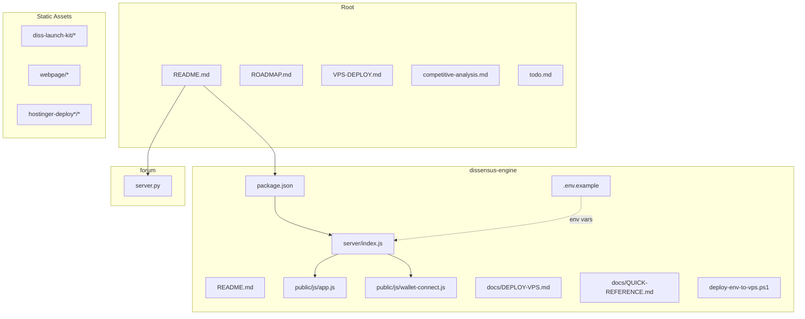
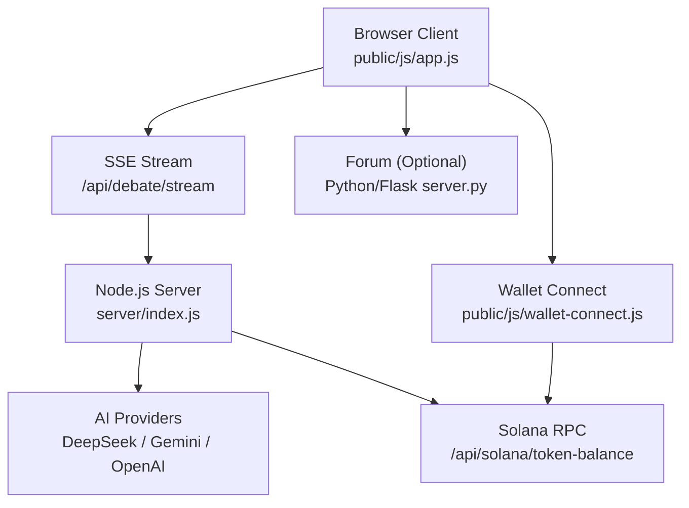
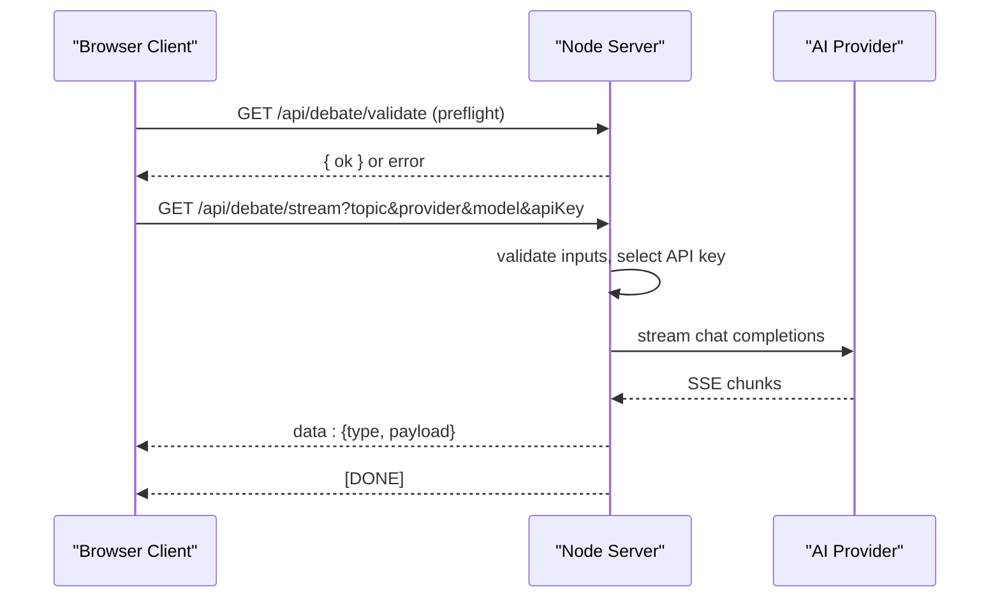
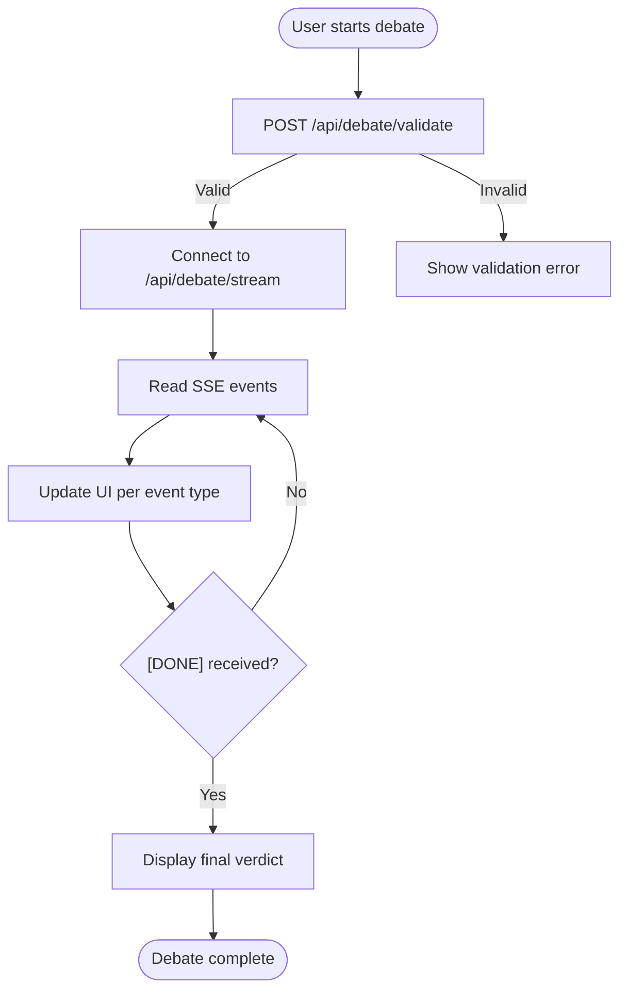
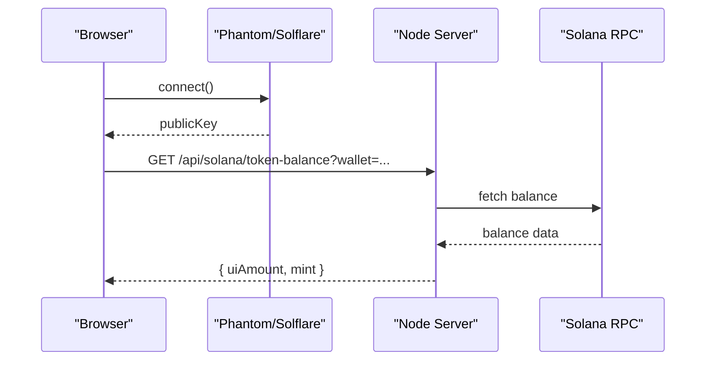
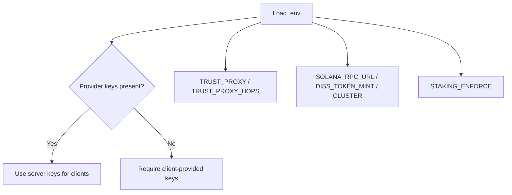
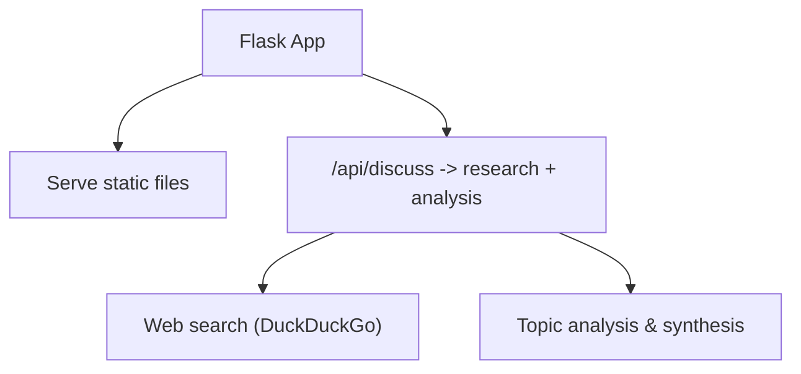
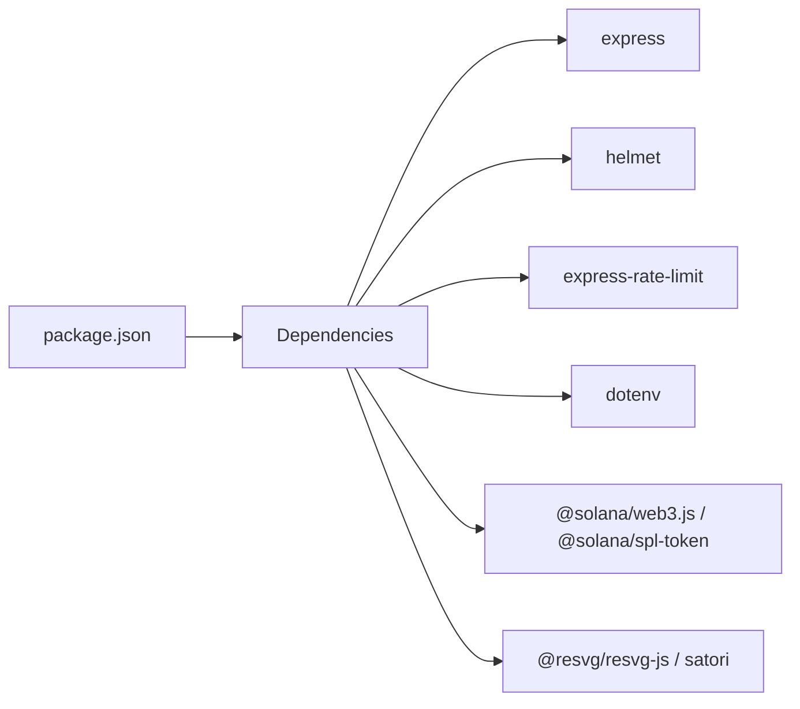

# Development Setup

<cite>
**Referenced Files in This Document**
- [README.md](file://README.md)
- [dissensus-engine/package.json](file://dissensus-engine/package.json)
- [dissensus-engine/README.md](file://dissensus-engine/README.md)
- [dissensus-engine/server/index.js](file://dissensus-engine/server/index.js)
- [dissensus-engine/.env.example](file://dissensus-engine/.env.example)
- [dissensus-engine/public/js/app.js](file://dissensus-engine/public/js/app.js)
- [dissensus-engine/public/js/wallet-connect.js](file://dissensus-engine/public/js/wallet-connect.js)
- [dissensus-engine/docs/DEPLOY-VPS.md](file://dissensus-engine/docs/DEPLOY-VPS.md)
- [dissensus-engine/docs/QUICK-REFERENCE.md](file://dissensus-engine/docs/QUICK-REFERENCE.md)
- [dissensus-engine/deploy-env-to-vps.ps1](file://dissensus-engine/deploy-env-to-vps.ps1)
- [forum/server.py](file://forum/server.py)
</cite>

## Table of Contents
1. [Introduction](#introduction)
2. [Project Structure](#project-structure)
3. [Core Components](#core-components)
4. [Architecture Overview](#architecture-overview)
5. [Detailed Component Analysis](#detailed-component-analysis)
6. [Dependency Analysis](#dependency-analysis)
7. [Performance Considerations](#performance-considerations)
8. [Troubleshooting Guide](#troubleshooting-guide)
9. [Conclusion](#conclusion)
10. [Appendices](#appendices)

## Introduction
This document provides a complete development environment setup guide for the Dissensus AI debate platform. It covers prerequisites, dependency installation, environment configuration, local server startup, API key setup for AI providers, optional database configuration, development server hot-reload capabilities, troubleshooting, IDE recommendations, debugging techniques, and development workflow best practices.

## Project Structure
The repository contains multiple components:
- dissensus-engine: Node.js Express server with SSE streaming for AI debates, frontend assets, and configuration.
- diss-launch-kit: Landing page website assets.
- forum: Python/Flask research forum backend.
- Additional static assets and documentation.

**Diagram sources**
- [README.md](file://README.md)
- [dissensus-engine/package.json](file://dissensus-engine/package.json)
- [dissensus-engine/server/index.js](file://dissensus-engine/server/index.js)
- [dissensus-engine/.env.example](file://dissensus-engine/.env.example)
- [dissensus-engine/public/js/app.js](file://dissensus-engine/public/js/app.js)
- [dissensus-engine/public/js/wallet-connect.js](file://dissensus-engine/public/js/wallet-connect.js)
- [dissensus-engine/docs/DEPLOY-VPS.md](file://dissensus-engine/docs/DEPLOY-VPS.md)
- [dissensus-engine/docs/QUICK-REFERENCE.md](file://dissensus-engine/docs/QUICK-REFERENCE.md)
- [dissensus-engine/deploy-env-to-vps.ps1](file://dissensus-engine/deploy-env-to-vps.ps1)
- [forum/server.py](file://forum/server.py)

**Section sources**
- [README.md](file://README.md)
- [dissensus-engine/package.json](file://dissensus-engine/package.json)
- [dissensus-engine/README.md](file://dissensus-engine/README.md)

## Core Components
- Node.js server with Express and SSE streaming for multi-agent debates.
- Frontend JavaScript controlling debate flow, provider/model selection, and UI rendering.
- Environment-driven configuration for AI providers, staking enforcement, and Solana integration.
- Optional Python/Flask forum backend for research and content.

Key development prerequisites:
- Node.js version requirement is documented in the engine’s README.
- AI provider API keys are required for local development.
- Optional Solana RPC configuration for wallet balance checks.

**Section sources**
- [dissensus-engine/README.md](file://dissensus-engine/README.md)
- [dissensus-engine/server/index.js](file://dissensus-engine/server/index.js)
- [dissensus-engine/.env.example](file://dissensus-engine/.env.example)
- [forum/server.py](file://forum/server.py)

## Architecture Overview
The development stack centers on the Node.js debate engine with a browser-based UI and optional backend services.

**Diagram sources**
- [dissensus-engine/server/index.js](file://dissensus-engine/server/index.js)
- [dissensus-engine/public/js/app.js](file://dissensus-engine/public/js/app.js)
- [dissensus-engine/public/js/wallet-connect.js](file://dissensus-engine/public/js/wallet-connect.js)
- [forum/server.py](file://forum/server.py)

## Detailed Component Analysis

### Node.js Server and SSE Streaming
The server initializes middleware, loads environment variables, exposes configuration endpoints, and streams debate results via Server-Sent Events. It enforces rate limits, validates inputs, and integrates with AI providers and Solana.

**Diagram sources**
- [dissensus-engine/server/index.js](file://dissensus-engine/server/index.js)

**Section sources**
- [dissensus-engine/server/index.js](file://dissensus-engine/server/index.js)

### Frontend Debate Controller
The frontend manages provider/model selection, wallet integration, SSE consumption, and UI updates. It persists preferences in localStorage and handles staking status.

**Diagram sources**
- [dissensus-engine/public/js/app.js](file://dissensus-engine/public/js/app.js)

**Section sources**
- [dissensus-engine/public/js/app.js](file://dissensus-engine/public/js/app.js)

### Solana Wallet Integration
The wallet module connects Phantom or Solflare, retrieves the public key, displays a shortened address, and fetches on-chain $DISS balance via the server.

**Diagram sources**
- [dissensus-engine/public/js/wallet-connect.js](file://dissensus-engine/public/js/wallet-connect.js)
- [dissensus-engine/server/index.js](file://dissensus-engine/server/index.js)

**Section sources**
- [dissensus-engine/public/js/wallet-connect.js](file://dissensus-engine/public/js/wallet-connect.js)
- [dissensus-engine/server/index.js](file://dissensus-engine/server/index.js)

### Environment Variables and Configuration
The server reads environment variables for ports, provider keys, trust proxy settings, Solana RPC, and staking enforcement. The example file documents all keys and options.

**Diagram sources**
- [dissensus-engine/.env.example](file://dissensus-engine/.env.example)
- [dissensus-engine/server/index.js](file://dissensus-engine/server/index.js)

**Section sources**
- [dissensus-engine/.env.example](file://dissensus-engine/.env.example)
- [dissensus-engine/server/index.js](file://dissensus-engine/server/index.js)

### Python/Flask Forum Backend
The forum server serves static assets and provides a unified API for research and content. It includes web search and topic analysis utilities.

**Diagram sources**
- [forum/server.py](file://forum/server.py)

**Section sources**
- [forum/server.py](file://forum/server.py)

## Dependency Analysis
- Node.js application dependencies are declared in package.json, including Express, helmet, rate limiting, dotenv, and Solana SDKs.
- The server script defines start and dev commands; development mode sets NODE_ENV for logging and behavior differences.
- The forum component uses Flask, CORS, and standard libraries for HTTP and SSL handling.

**Diagram sources**
- [dissensus-engine/package.json](file://dissensus-engine/package.json)

**Section sources**
- [dissensus-engine/package.json](file://dissensus-engine/package.json)

## Performance Considerations
- SSE streaming requires careful proxy configuration to avoid buffering; the VPS guide highlights disabling proxy buffering for the debate stream endpoint.
- Rate limiting protects the server from abuse; adjust limits per environment.
- Client-side timeouts and abort controllers prevent hanging debates.
- For production, consider compression, caching static assets, and monitoring resource usage.

[No sources needed since this section provides general guidance]

## Troubleshooting Guide
Common development issues and resolutions:
- SSE streaming not working: Ensure reverse proxy disables buffering for the debate stream route.
- Validation errors: Confirm topic length and provider/model availability; check server logs for detailed messages.
- Wallet connection failures: Verify Phantom/Solflare extension, correct network, and that the server’s Solana RPC is reachable.
- Rate limit exceeded: Reduce request frequency or increase allowances in development.
- Environment variables: Confirm .env is loaded and keys are set appropriately.

**Section sources**
- [dissensus-engine/docs/DEPLOY-VPS.md](file://dissensus-engine/docs/DEPLOY-VPS.md)
- [dissensus-engine/server/index.js](file://dissensus-engine/server/index.js)
- [dissensus-engine/public/js/wallet-connect.js](file://dissensus-engine/public/js/wallet-connect.js)

## Conclusion
This guide consolidates the development setup for the Dissensus AI debate platform. By installing Node.js, configuring environment variables, and starting the server, developers can run the debate engine locally, integrate AI providers, and optionally connect a Solana wallet. The included troubleshooting tips and architecture diagrams help diagnose and resolve typical issues encountered during development.

[No sources needed since this section summarizes without analyzing specific files]

## Appendices

### Local Development Prerequisites
- Node.js version requirement: See the engine README for the recommended version.
- Install dependencies: Run the package manager install command in the engine directory.
- Start the server: Use the start script; development mode can be toggled via environment variables.

**Section sources**
- [dissensus-engine/README.md](file://dissensus-engine/README.md)
- [dissensus-engine/package.json](file://dissensus-engine/package.json)

### Dependency Installation
- Navigate to the engine directory and install dependencies using the package manager.
- For production deployments, use the production install flag to minimize dev dependencies.

**Section sources**
- [dissensus-engine/README.md](file://dissensus-engine/README.md)

### Environment Variable Configuration
- Copy the example environment file to .env and add API keys for desired providers.
- Configure trust proxy settings if behind a reverse proxy.
- Set Solana RPC URL and mint for wallet balance checks.
- Optionally enable staking enforcement for debate limits.

**Section sources**
- [dissensus-engine/.env.example](file://dissensus-engine/.env.example)
- [dissensus-engine/server/index.js](file://dissensus-engine/server/index.js)

### Local Server Startup Procedures
- Start the server using the provided script; confirm it binds to the expected port.
- Access the UI in the browser and validate health endpoints.
- For development, use the development script to enable verbose logging and relaxed limits.

**Section sources**
- [dissensus-engine/README.md](file://dissensus-engine/README.md)
- [dissensus-engine/server/index.js](file://dissensus-engine/server/index.js)

### API Key Setup for AI Providers
- Add keys for DeepSeek, Google Gemini, or OpenAI in the environment file for server-side usage.
- Alternatively, allow clients to provide their own keys; the server prefers user-provided keys when present.
- Verify provider availability and model compatibility via the providers endpoint.

**Section sources**
- [dissensus-engine/.env.example](file://dissensus-engine/.env.example)
- [dissensus-engine/server/index.js](file://dissensus-engine/server/index.js)

### Database Configuration
- The Node.js server does not require a database for core functionality.
- The forum component uses Flask and standard libraries; no database is required for basic operation.

**Section sources**
- [dissensus-engine/server/index.js](file://dissensus-engine/server/index.js)
- [forum/server.py](file://forum/server.py)

### Development Server Hot-Reload Functionality
- The Node.js server does not include a built-in hot-reload mechanism.
- Use the development script and restart the server when code changes are made.
- For rapid iteration, consider external tools or frameworks that support hot reloading if integrating into a larger stack.

**Section sources**
- [dissensus-engine/package.json](file://dissensus-engine/package.json)

### Troubleshooting Steps for Common Development Issues
- Validate environment variables and ensure keys are present.
- Check server logs for detailed error messages.
- Confirm network connectivity to AI providers and Solana RPC endpoints.
- Review proxy configurations for SSE streaming.

**Section sources**
- [dissensus-engine/server/index.js](file://dissensus-engine/server/index.js)
- [dissensus-engine/docs/DEPLOY-VPS.md](file://dissensus-engine/docs/DEPLOY-VPS.md)

### IDE Configuration Recommendations
- Use a modern IDE with JavaScript/Node.js support for syntax highlighting and debugging.
- Configure ESLint/Prettier for consistent formatting and linting.
- Set breakpoints in the frontend and server code for interactive debugging.

[No sources needed since this section provides general guidance]

### Debugging Techniques
- Inspect browser DevTools for SSE events and network requests.
- Monitor server logs for validation errors and runtime exceptions.
- Use curl or Postman to test endpoints directly.

**Section sources**
- [dissensus-engine/server/index.js](file://dissensus-engine/server/index.js)

### Development Workflow Best Practices
- Keep environment secrets out of version control; use the example file as a template.
- Validate inputs and handle errors gracefully on both client and server.
- Maintain clear separation between frontend and backend concerns.

**Section sources**
- [dissensus-engine/.env.example](file://dissensus-engine/.env.example)
- [dissensus-engine/server/index.js](file://dissensus-engine/server/index.js)

### Code Formatting Standards
- Follow consistent indentation and naming conventions.
- Use ESLint and Prettier to enforce formatting across the project.

[No sources needed since this section provides general guidance]

### Contribution Guidelines
- Fork and branch for features; submit pull requests with clear descriptions.
- Include tests and documentation updates when modifying functionality.

[No sources needed since this section provides general guidance]