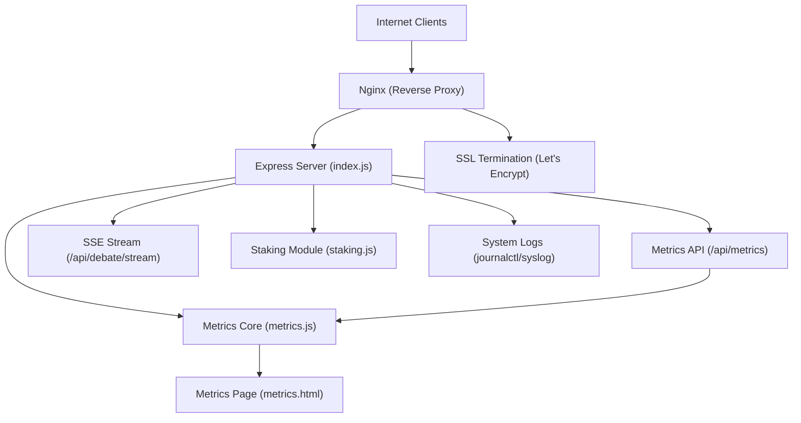
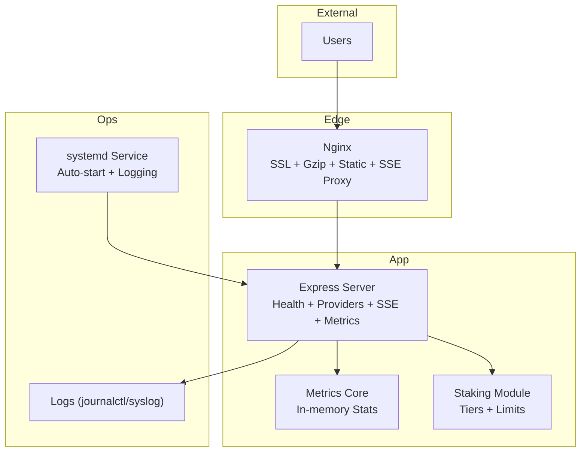
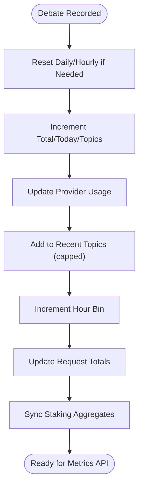
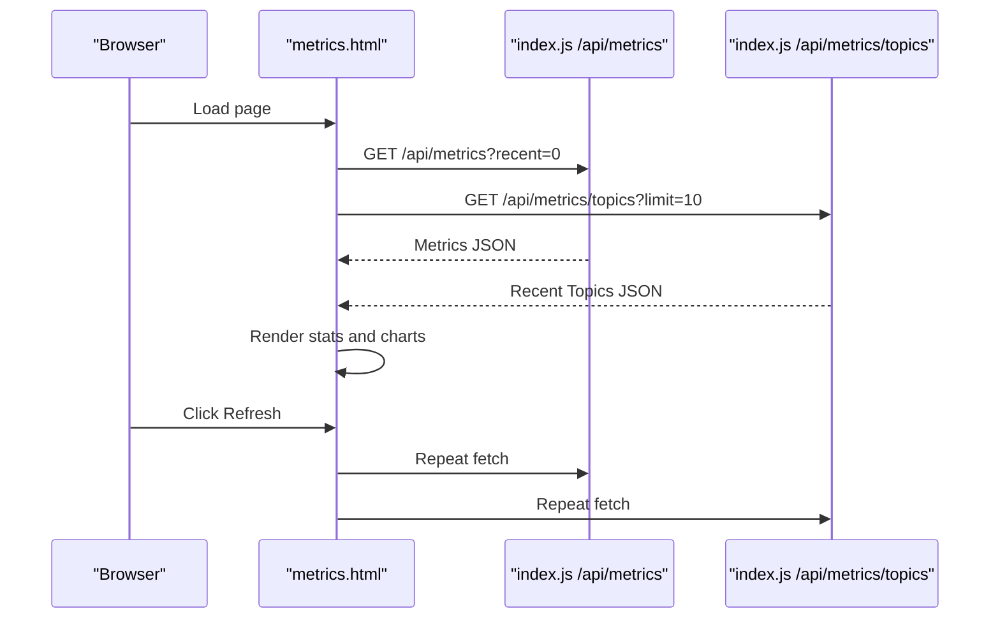
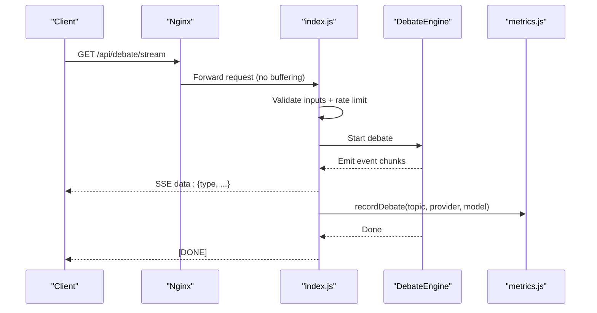
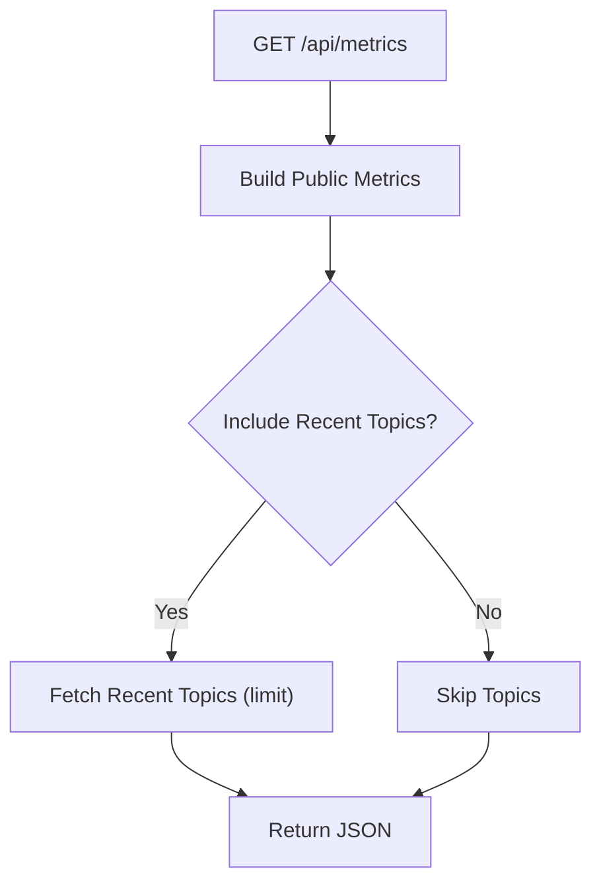
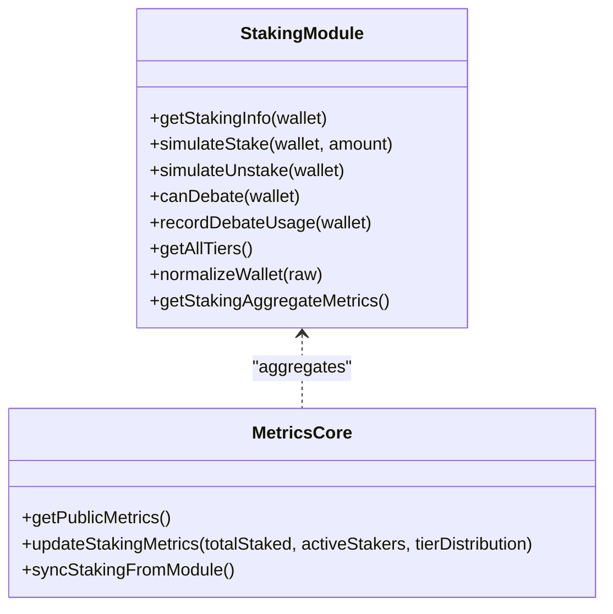
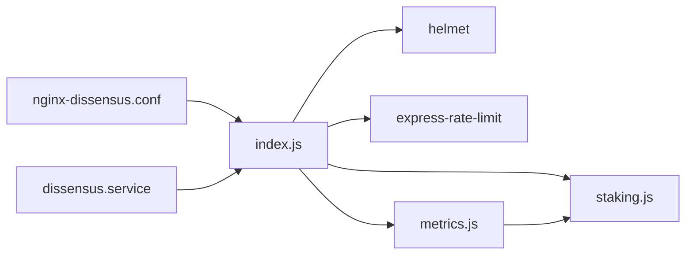

# Monitoring & Maintenance

<cite>
**Referenced Files in This Document**
- [metrics.html](file://dissensus-engine/public/metrics.html)
- [metrics.js](file://dissensus-engine/server/metrics.js)
- [index.js](file://dissensus-engine/server/index.js)
- [staking.js](file://dissensus-engine/server/staking.js)
- [DEPLOY-VPS.md](file://dissensus-engine/docs/DEPLOY-VPS.md)
- [QUICK-REFERENCE.md](file://dissensus-engine/docs/QUICK-REFERENCE.md)
- [dissensus.service](file://dissensus-engine/docs/configs/dissensus.service)
- [nginx-dissensus.conf](file://dissensus-engine/docs/configs/nginx-dissensus.conf)
- [dissensus-nginx-ssl.conf](file://dissensus-engine/docs/configs/dissensus-nginx-ssl.conf)
- [VPS-DEPLOY.md](file://VPS-DEPLOY.md)
- [run_all_hooks.py](file://.agent_hooks/run_all_hooks.py)
</cite>

## Table of Contents
1. [Introduction](#introduction)
2. [Project Structure](#project-structure)
3. [Core Components](#core-components)
4. [Architecture Overview](#architecture-overview)
5. [Detailed Component Analysis](#detailed-component-analysis)
6. [Dependency Analysis](#dependency-analysis)
7. [Performance Considerations](#performance-considerations)
8. [Troubleshooting Guide](#troubleshooting-guide)
9. [Conclusion](#conclusion)
10. [Appendices](#appendices)

## Introduction
This document provides comprehensive monitoring and maintenance guidance for the Dissensus AI Debate Engine. It covers system health monitoring, performance tracking, operational procedures, metrics dashboard functionality, real-time analytics collection, usage statistics tracking, log management, performance optimization, capacity planning, maintenance schedules, backup and disaster recovery, alerting and error tracking, incident response, and troubleshooting for common operational issues.

## Project Structure
The monitoring and maintenance ecosystem centers around:
- An Express server exposing health, metrics, and SSE streaming endpoints
- In-memory metrics and analytics for transparency
- A metrics dashboard HTML page consuming the metrics API
- Nginx as a reverse proxy with strict SSE and SSL configurations
- systemd service for process lifecycle and logging
- Operational guides for deployment, updates, and troubleshooting

**Diagram sources**
- [index.js:26-481](file://dissensus-engine/server/index.js#L26-L481)
- [metrics.js:100-152](file://dissensus-engine/server/metrics.js#L100-L152)
- [metrics.html:323-399](file://dissensus-engine/public/metrics.html#L323-L399)
- [nginx-dissensus.conf:1-81](file://dissensus-engine/docs/configs/nginx-dissensus.conf#L1-L81)
- [dissensus-nginx-ssl.conf:1-68](file://dissensus-engine/docs/configs/dissensus-nginx-ssl.conf#L1-L68)

**Section sources**
- [index.js:26-481](file://dissensus-engine/server/index.js#L26-L481)
- [metrics.js:10-152](file://dissensus-engine/server/metrics.js#L10-L152)
- [metrics.html:1-399](file://dissensus-engine/public/metrics.html#L1-L399)
- [nginx-dissensus.conf:1-81](file://dissensus-engine/docs/configs/nginx-dissensus.conf#L1-L81)
- [dissensus-nginx-ssl.conf:1-68](file://dissensus-engine/docs/configs/dissensus-nginx-ssl.conf#L1-L68)

## Core Components
- Metrics and Analytics Core
  - Tracks total debates, debates today, unique topics, provider usage, hourly breakdown, uptime percentage, recent topics, and request success/failure counts.
  - Provides public metrics and recent topics endpoints for the dashboard.
- Metrics Dashboard
  - Real-time HTML dashboard that fetches metrics and recent topics, displays provider distribution, and shows live updates.
- Express Server
  - Exposes health, providers, SSE debate streaming, metrics, and fallback routes.
  - Implements rate limiting and trust-proxy configuration for reverse proxy environments.
- Staking Module
  - Simulates staking tiers, daily debate limits, and aggregates metrics for the dashboard.
- Nginx Reverse Proxy
  - Handles SSL, Gzip, static assets, and critical SSE streaming settings (no buffering).
- systemd Service
  - Manages process lifecycle, logging to syslog, and security hardening.

**Section sources**
- [metrics.js:10-152](file://dissensus-engine/server/metrics.js#L10-L152)
- [metrics.html:323-399](file://dissensus-engine/public/metrics.html#L323-L399)
- [index.js:429-445](file://dissensus-engine/server/index.js#L429-L445)
- [staking.js:156-183](file://dissensus-engine/server/staking.js#L156-L183)
- [dissensus.service:1-27](file://dissensus-engine/docs/configs/dissensus.service#L1-L27)
- [nginx-dissensus.conf:42-60](file://dissensus-engine/docs/configs/nginx-dissensus.conf#L42-L60)

## Architecture Overview
The system architecture integrates a Node.js server behind Nginx with strict SSE and SSL configurations. Metrics are collected in-memory and exposed via a dedicated API and HTML dashboard. The systemd service ensures reliable operation and centralized logging.

**Diagram sources**
- [index.js:26-481](file://dissensus-engine/server/index.js#L26-L481)
- [metrics.js:10-152](file://dissensus-engine/server/metrics.js#L10-L152)
- [staking.js:1-183](file://dissensus-engine/server/staking.js#L1-L183)
- [dissensus.service:1-27](file://dissensus-engine/docs/configs/dissensus.service#L1-L27)

## Detailed Component Analysis

### Metrics and Analytics Core
- Responsibilities
  - Increment counters for debates, provider usage, and hourly activity.
  - Track unique topics and maintain a bounded list of recent topics.
  - Compute uptime percentage and success rate from request counters.
  - Sync staking aggregates for dashboard visibility.
- Data Structures
  - In-memory counters and sets for totals and uniqueness.
  - Hourly array for last-24-hour activity.
  - Recent topics list capped at 100 entries.
- Complexity
  - O(1) updates per debate; O(n) to compute provider usage percentages; O(1) retrieval of recent topics.

**Diagram sources**
- [metrics.js:46-98](file://dissensus-engine/server/metrics.js#L46-L98)

**Section sources**
- [metrics.js:10-152](file://dissensus-engine/server/metrics.js#L10-L152)

### Metrics Dashboard Functionality
- Real-time Data
  - Fetches metrics and recent topics concurrently.
  - Displays provider distribution bars and recent debate topics.
  - Shows live indicator and last update time.
- Error Handling
  - Displays user-friendly error banners when API calls fail.
  - Relies on same-origin policy for dashboard access.
- Refresh Behavior
  - Manual refresh button and periodic polling every 30 seconds.

**Diagram sources**
- [metrics.html:323-399](file://dissensus-engine/public/metrics.html#L323-L399)
- [index.js:429-445](file://dissensus-engine/server/index.js#L429-L445)

**Section sources**
- [metrics.html:272-399](file://dissensus-engine/public/metrics.html#L272-L399)
- [index.js:429-445](file://dissensus-engine/server/index.js#L429-L445)

### SSE Streaming and Real-time Analytics
- SSE Endpoint
  - Validates inputs, applies rate limits, and streams structured events.
  - Records successful debates and tracks provider/model usage.
- Nginx Streaming Settings
  - Disables buffering and caches for SSE to ensure real-time delivery.
  - Sets extended timeouts for long debates.

**Diagram sources**
- [index.js:220-311](file://dissensus-engine/server/index.js#L220-L311)
- [nginx-dissensus.conf:42-60](file://dissensus-engine/docs/configs/nginx-dissensus.conf#L42-L60)

**Section sources**
- [index.js:220-311](file://dissensus-engine/server/index.js#L220-L311)
- [nginx-dissensus.conf:42-60](file://dissensus-engine/docs/configs/nginx-dissensus.conf#L42-L60)

### Usage Statistics Tracking
- Metrics Exposed
  - Total debates, debates today, unique topics, uptime percentage, provider usage, recent topics, and staking aggregates.
- Access Patterns
  - Public metrics endpoint supports pagination-like recent topic limits.
  - Separate endpoint for recent topics to split dashboard loads.

**Diagram sources**
- [index.js:429-441](file://dissensus-engine/server/index.js#L429-L441)
- [metrics.js:100-152](file://dissensus-engine/server/metrics.js#L100-L152)

**Section sources**
- [index.js:429-445](file://dissensus-engine/server/index.js#L429-L445)
- [metrics.js:100-152](file://dissensus-engine/server/metrics.js#L100-L152)

### Staking Integration for Metrics
- Simulated Tiers and Limits
  - Daily debate caps per tier; unlimited for higher tiers.
- Aggregation for Dashboard
  - Computes total staked, active stakers, and tier distribution.
- Metrics Sync
  - Periodically synced from staking module to metrics store.

**Diagram sources**
- [staking.js:156-183](file://dissensus-engine/server/staking.js#L156-L183)
- [metrics.js:91-98](file://dissensus-engine/server/metrics.js#L91-L98)

**Section sources**
- [staking.js:1-183](file://dissensus-engine/server/staking.js#L1-L183)
- [metrics.js:91-98](file://dissensus-engine/server/metrics.js#L91-L98)

## Dependency Analysis
- Express depends on:
  - Helmet for security headers
  - Rate limiter for abuse protection
  - Environment variables for API keys and runtime behavior
- Metrics module depends on:
  - Staking module for aggregated stats
- Nginx depends on:
  - Correct proxy settings for SSE and SSL
- systemd depends on:
  - Working directory and environment variables
  - Syslog integration for logs

**Diagram sources**
- [index.js:7-30](file://dissensus-engine/server/index.js#L7-L30)
- [metrics.js:8-9](file://dissensus-engine/server/metrics.js#L8-L9)
- [nginx-dissensus.conf:1-81](file://dissensus-engine/docs/configs/nginx-dissensus.conf#L1-L81)
- [dissensus.service:1-27](file://dissensus-engine/docs/configs/dissensus.service#L1-L27)

**Section sources**
- [index.js:7-30](file://dissensus-engine/server/index.js#L7-L30)
- [metrics.js:8-9](file://dissensus-engine/server/metrics.js#L8-L9)
- [nginx-dissensus.conf:1-81](file://dissensus-engine/docs/configs/nginx-dissensus.conf#L1-L81)
- [dissensus.service:1-27](file://dissensus-engine/docs/configs/dissensus.service#L1-L27)

## Performance Considerations
- SSE Streaming
  - Ensure Nginx disables buffering for the SSE location block to avoid client-side delays.
  - Increase proxy timeouts for long debates.
- Rate Limiting
  - Tune rate limits per environment to balance abuse prevention and user experience.
- Static Assets
  - Serve static assets via Nginx with caching headers to reduce server load.
- Memory and CPU
  - Monitor Node.js process memory and overall system resources regularly.
- API Key Management
  - Store keys in environment variables to avoid leaks and reduce client-side overhead.

[No sources needed since this section provides general guidance]

## Troubleshooting Guide
- Application Crashes or Not Responding
  - Check systemd status and logs; restart the service if needed.
  - Verify Node.js is listening on the configured port.
- Nginx 502 or Streaming Issues
  - Confirm the Node.js service is running and reachable on port 3000.
  - Validate Nginx config for SSE-specific directives.
- SSL Certificate Problems
  - Check certificate status and renewals; test dry-run renewals.
- Out of Memory
  - Add swap space temporarily if necessary; review resource limits.
- Rolling Back Changes
  - Keep backups of previous deployments; restore and restart the service.

**Section sources**
- [DEPLOY-VPS.md:601-690](file://dissensus-engine/docs/DEPLOY-VPS.md#L601-L690)
- [QUICK-REFERENCE.md:141-164](file://dissensus-engine/docs/QUICK-REFERENCE.md#L141-L164)

## Conclusion
The Dissensus AI Debate Engine provides a robust foundation for monitoring and maintenance through its in-memory metrics, dedicated dashboard, SSE streaming, and production-grade Nginx and systemd configurations. By following the operational procedures and troubleshooting steps outlined here, operators can maintain system health, track performance, and respond effectively to incidents.

[No sources needed since this section summarizes without analyzing specific files]

## Appendices

### System Health Monitoring
- Health Endpoint
  - Use the health endpoint to verify service availability.
- Logs
  - Tail systemd logs for live insights; review Nginx access and error logs.
- Resource Checks
  - Monitor disk, memory, CPU, and network connections.

**Section sources**
- [index.js:127-133](file://dissensus-engine/server/index.js#L127-L133)
- [DEPLOY-VPS.md:536-589](file://dissensus-engine/docs/DEPLOY-VPS.md#L536-L589)

### Operational Procedures
- Daily Operations
  - Start, stop, restart, and check status of the service.
  - View live logs and recent entries.
- Updates
  - Backup current version, unpack new code, install dependencies, and restart.
- SSL Management
  - Check and renew certificates; test auto-renewals.

**Section sources**
- [QUICK-REFERENCE.md:32-114](file://dissensus-engine/docs/QUICK-REFERENCE.md#L32-L114)

### Maintenance Schedules
- Daily
  - Review logs and resource usage.
- Weekly
  - Capacity planning based on recent topics and provider usage trends.
- Monthly
  - Audit API key usage, certificate renewals, and system updates.

[No sources needed since this section provides general guidance]

### Backup and Disaster Recovery
- Backup Strategy
  - Maintain dated backups of the application directory.
- Recovery Steps
  - Restore backup and restart services; verify health and metrics.

**Section sources**
- [QUICK-REFERENCE.md:47-71](file://dissensus-engine/docs/QUICK-REFERENCE.md#L47-L71)
- [QUICK-REFERENCE.md:160-164](file://dissensus-engine/docs/QUICK-REFERENCE.md#L160-L164)

### Alerting, Error Tracking, and Incident Response
- Alerting
  - Monitor systemd/journald logs for errors and restarts.
- Error Tracking
  - Use logs to correlate SSE failures, provider errors, and rate limit hits.
- Incident Response
  - Follow emergency procedures: check logs, restart services, add swap if needed.

**Section sources**
- [index.js:303-310](file://dissensus-engine/server/index.js#L303-L310)
- [metrics.js:75-80](file://dissensus-engine/server/metrics.js#L75-L80)
- [DEPLOY-VPS.md:601-642](file://dissensus-engine/docs/DEPLOY-VPS.md#L601-L642)

### Routine Maintenance Tasks
- Security Updates
  - Enable automatic security updates where appropriate.
- Capacity Planning
  - Use recent topics and provider usage to estimate API costs and resource needs.
- System Health Checks
  - Verify Nginx config, SSL, and service status regularly.

**Section sources**
- [DEPLOY-VPS.md:574-598](file://dissensus-engine/docs/DEPLOY-VPS.md#L574-L598)
- [QUICK-REFERENCE.md:117-138](file://dissensus-engine/docs/QUICK-REFERENCE.md#L117-L138)

### Security Updates and System Hardening
- Environment
  - Use environment variables for secrets and configuration.
- Service Hardening
  - Restrict privileges and protect system paths via systemd unit.
- Nginx Hardening
  - Apply security headers and disable buffering for SSE.

**Section sources**
- [dissensus.service:20-25](file://dissensus-engine/docs/configs/dissensus.service#L20-L25)
- [nginx-dissensus.conf:11-16](file://dissensus-engine/docs/configs/nginx-dissensus.conf#L11-L16)
- [nginx-dissensus.conf:52-60](file://dissensus-engine/docs/configs/nginx-dissensus.conf#L52-L60)

### Agent Hooks Integration
- Hook Execution
  - Python script runs hooks in ordered sequence and logs outputs.
- Use Cases
  - Automate pre/post deployment tasks and system checks.

**Section sources**
- [.agent_hooks/run_all_hooks.py:1-98](file://.agent_hooks/run_all_hooks.py#L1-L98)