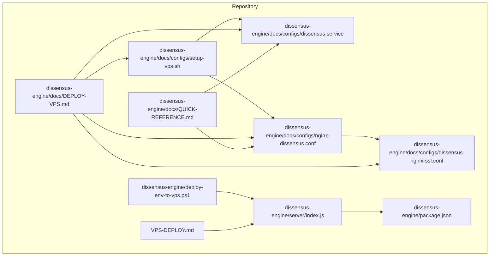
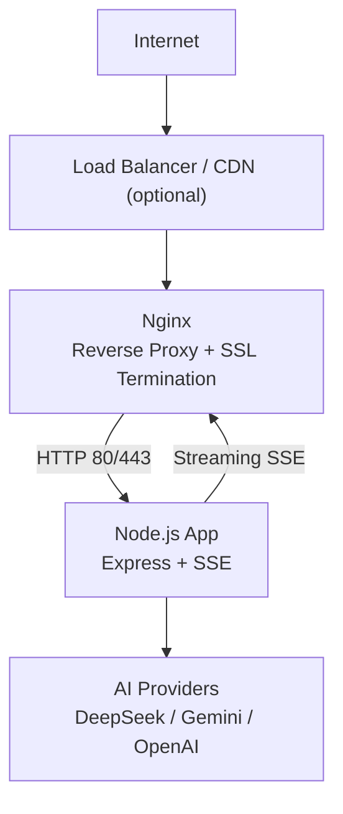
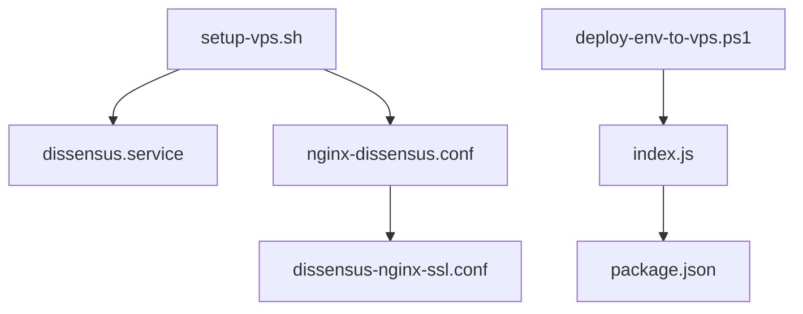
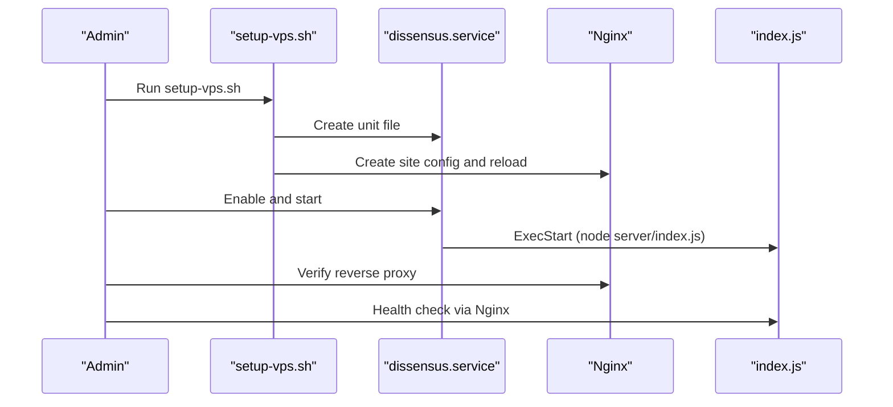

# VPS Deployment

<cite>
**Referenced Files in This Document**
- [VPS-DEPLOY.md](file://VPS-DEPLOY.md)
- [DEPLOY-VPS.md](file://dissensus-engine/docs/DEPLOY-VPS.md)
- [QUICK-REFERENCE.md](file://dissensus-engine/docs/QUICK-REFERENCE.md)
- [setup-vps.sh](file://dissensus-engine/docs/configs/setup-vps.sh)
- [dissensus.service](file://dissensus-engine/docs/configs/dissensus.service)
- [nginx-dissensus.conf](file://dissensus-engine/docs/configs/nginx-dissensus.conf)
- [dissensus-nginx-ssl.conf](file://dissensus-engine/docs/configs/dissensus-nginx-ssl.conf)
- [deploy-env-to-vps.ps1](file://dissensus-engine/deploy-env-to-vps.ps1)
- [index.js](file://dissensus-engine/server/index.js)
- [package.json](file://dissensus-engine/package.json)
</cite>

## Table of Contents
1. [Introduction](#introduction)
2. [Project Structure](#project-structure)
3. [Core Components](#core-components)
4. [Architecture Overview](#architecture-overview)
5. [Detailed Component Analysis](#detailed-component-analysis)
6. [Dependency Analysis](#dependency-analysis)
7. [Performance Considerations](#performance-considerations)
8. [Troubleshooting Guide](#troubleshooting-guide)
9. [Conclusion](#conclusion)
10. [Appendices](#appendices)

## Introduction
This document provides a complete, production-focused VPS deployment guide for the Dissensus AI Debate Engine. It covers the full lifecycle from initial server setup to runtime monitoring, including:
- Initial VPS provisioning and security hardening
- Application packaging and environment configuration
- Reverse proxy and SSL setup
- Process supervision and automatic startup
- Operational procedures for updates, verification, and rollback

The guide references the official deployment documentation and configuration files included in the repository to ensure accuracy and reproducibility.

## Project Structure
The deployment artifacts and documentation are organized as follows:
- Deployment scripts and configurations under the engine’s docs/configs directory
- Operational guides under docs
- Application entrypoint and package metadata
- PowerShell helper for environment deployment

**Diagram sources**
- [setup-vps.sh:1-247](file://dissensus-engine/docs/configs/setup-vps.sh#L1-247)
- [dissensus.service:1-27](file://dissensus-engine/docs/configs/dissensus.service#L1-27)
- [nginx-dissensus.conf:1-81](file://dissensus-engine/docs/configs/nginx-dissensus.conf#L1-81)
- [dissensus-nginx-ssl.conf:1-68](file://dissensus-engine/docs/configs/dissensus-nginx-ssl.conf#L1-68)
- [deploy-env-to-vps.ps1:1-50](file://dissensus-engine/deploy-env-to-vps.ps1#L1-50)
- [index.js:1-481](file://dissensus-engine/server/index.js#L1-481)
- [package.json:1-28](file://dissensus-engine/package.json#L1-28)
- [DEPLOY-VPS.md:1-744](file://dissensus-engine/docs/DEPLOY-VPS.md#L1-744)
- [QUICK-REFERENCE.md:1-182](file://dissensus-engine/docs/QUICK-REFERENCE.md#L1-182)
- [VPS-DEPLOY.md:1-41](file://VPS-DEPLOY.md#L1-41)

**Section sources**
- [DEPLOY-VPS.md:1-744](file://dissensus-engine/docs/DEPLOY-VPS.md#L1-744)
- [QUICK-REFERENCE.md:1-182](file://dissensus-engine/docs/QUICK-REFERENCE.md#L1-182)
- [VPS-DEPLOY.md:1-41](file://VPS-DEPLOY.md#L1-41)

## Core Components
- VPS setup script: automates OS updates, user creation, Node.js installation, Nginx, Certbot, UFW firewall, systemd service creation, and Nginx site configuration.
- Systemd service unit: defines the Node.js process, environment, working directory, restart policy, and security hardening.
- Nginx configuration: reverse proxy, security headers, static asset delivery, SSE streaming without buffering, and optional SSL.
- PowerShell environment deployment helper: creates or copies .env locally, validates API keys, and uploads to the VPS.
- Application entrypoint: Express server with SSE streaming, rate limiting, health checks, and provider configuration.

**Section sources**
- [setup-vps.sh:1-247](file://dissensus-engine/docs/configs/setup-vps.sh#L1-247)
- [dissensus.service:1-27](file://dissensus-engine/docs/configs/dissensus.service#L1-27)
- [nginx-dissensus.conf:1-81](file://dissensus-engine/docs/configs/nginx-dissensus.conf#L1-81)
- [dissensus-nginx-ssl.conf:1-68](file://dissensus-engine/docs/configs/dissensus-nginx-ssl.conf#L1-68)
- [deploy-env-to-vps.ps1:1-50](file://dissensus-engine/deploy-env-to-vps.ps1#L1-50)
- [index.js:1-481](file://dissensus-engine/server/index.js#L1-481)

## Architecture Overview
The system uses Nginx as a reverse proxy terminating TLS and forwarding requests to the Node.js application. The Node.js server exposes SSE endpoints for real-time debate streaming and standard REST endpoints for configuration and metrics.

**Diagram sources**
- [nginx-dissensus.conf:1-81](file://dissensus-engine/docs/configs/nginx-dissensus.conf#L1-81)
- [dissensus-nginx-ssl.conf:1-68](file://dissensus-engine/docs/configs/dissensus-nginx-ssl.conf#L1-68)
- [index.js:220-311](file://dissensus-engine/server/index.js#L220-311)

## Detailed Component Analysis

### VPS Initial Setup and Security Hardening
- OS and packages: updates, Node.js 20 LTS, Nginx, Certbot, UFW.
- User and permissions: creates a non-root application user with sudo access.
- Firewall: allows SSH, HTTP, and HTTPS; denies incoming by default.
- Nginx site: enables the site, removes default, tests config, reloads service.
- systemd service: writes unit file, reloads daemon, enables auto-start.

Operational steps and rationale are documented in the official guide.

**Section sources**
- [setup-vps.sh:1-247](file://dissensus-engine/docs/configs/setup-vps.sh#L1-247)
- [DEPLOY-VPS.md:69-92](file://dissensus-engine/docs/DEPLOY-VPS.md#L69-92)
- [DEPLOY-VPS.md:456-492](file://dissensus-engine/docs/DEPLOY-VPS.md#L456-492)

### Environment Variable Deployment
- Local preparation: creates .env from .env.example if missing.
- Validation: checks for placeholder keys and opens editor for manual input.
- Upload: uses SCP to transfer .env to the VPS application directory.
- Post-upload: instructs restarting the process manager to apply changes.

Notes:
- The PowerShell script targets a specific VPS path and uses root user credentials.
- Ensure the .env contains required API keys for providers to avoid client-side key prompts.

**Section sources**
- [deploy-env-to-vps.ps1:1-50](file://dissensus-engine/deploy-env-to-vps.ps1#L1-50)

### Nginx Reverse Proxy and SSL
- Site configuration: security headers, gzip compression, static asset caching, SSE streaming without buffering, and proxying to Node.js.
- SSL configuration: includes SSL directives and DH parameters; redirects HTTP to HTTPS for the configured hostname.
- Certbot integration: installs Certbot and Nginx plugin, obtains certificate, and sets up auto-renewal.

Key behaviors:
- SSE streaming disables buffering and sets long timeouts to support multi-minute debates.
- Static assets are served directly by Nginx for improved performance.

**Section sources**
- [nginx-dissensus.conf:1-81](file://dissensus-engine/docs/configs/nginx-dissensus.conf#L1-81)
- [dissensus-nginx-ssl.conf:1-68](file://dissensus-engine/docs/configs/dissensus-nginx-ssl.conf#L1-68)
- [DEPLOY-VPS.md:389-413](file://dissensus-engine/docs/DEPLOY-VPS.md#L389-413)

### Systemd Service and Automatic Startup
- Unit definition: sets user/group, working directory, ExecStart, restart policy, syslog output, and environment variables.
- Security enhancements: NoNewPrivileges, ProtectSystem, ProtectHome, and restricted paths.
- Activation: reloads systemd, enables the service, and starts it.

Monitoring:
- Journalctl is used to view live logs and recent entries.
- Status checks confirm active operation.

**Section sources**
- [dissensus.service:1-27](file://dissensus-engine/docs/configs/dissensus.service#L1-27)
- [DEPLOY-VPS.md:190-269](file://dissensus-engine/docs/DEPLOY-VPS.md#L190-269)
- [QUICK-REFERENCE.md:536-552](file://dissensus-engine/docs/QUICK-REFERENCE.md#L536-552)

### Application Entry and Streaming Behavior
- Express server initializes middleware, rate limits, and routes.
- SSE streaming endpoint emits structured events without buffering.
- Health checks and provider configuration endpoints support operational verification.

Operational implications:
- Streaming requires Nginx to forward without buffering.
- Environment variables (including API keys) are loaded via dotenv.

**Section sources**
- [index.js:26-481](file://dissensus-engine/server/index.js#L26-481)
- [package.json:1-28](file://dissensus-engine/package.json#L1-28)

### Process Management Alternatives
While the repository primarily documents systemd, the quick-deploy guide references PM2 for rapid updates. The PowerShell helper also mentions PM2 restart after .env upload.

Recommendation:
- Choose one process manager consistently. If using systemd, rely on systemctl for start/restart/status.
- If using PM2, ensure the PM2 ecosystem aligns with the application’s working directory and environment.

**Section sources**
- [VPS-DEPLOY.md:3-10](file://VPS-DEPLOY.md#L3-10)
- [deploy-env-to-vps.ps1](file://dissensus-engine/deploy-env-to-vps.ps1#L44)

## Dependency Analysis
The deployment pipeline ties together multiple components with clear dependencies.

**Diagram sources**
- [setup-vps.sh:107-141](file://dissensus-engine/docs/configs/setup-vps.sh#L107-141)
- [dissensus.service:1-27](file://dissensus-engine/docs/configs/dissensus.service#L1-27)
- [nginx-dissensus.conf:1-81](file://dissensus-engine/docs/configs/nginx-dissensus.conf#L1-81)
- [dissensus-nginx-ssl.conf:1-68](file://dissensus-engine/docs/configs/dissensus-nginx-ssl.conf#L1-68)
- [deploy-env-to-vps.ps1:1-50](file://dissensus-engine/deploy-env-to-vps.ps1#L1-50)
- [index.js:1-481](file://dissensus-engine/server/index.js#L1-481)
- [package.json:1-28](file://dissensus-engine/package.json#L1-28)

**Section sources**
- [DEPLOY-VPS.md:190-269](file://dissensus-engine/docs/DEPLOY-VPS.md#L190-269)
- [DEPLOY-VPS.md:272-386](file://dissensus-engine/docs/DEPLOY-VPS.md#L272-386)

## Performance Considerations
- Nginx static caching and gzip reduce bandwidth and latency.
- SSE streaming without buffering ensures real-time debate delivery.
- Keep the Node.js process lean; consider adding swap on low-memory VPS instances.
- Monitor resource usage with system tools and adjust capacity accordingly.

[No sources needed since this section provides general guidance]

## Troubleshooting Guide
Common issues and resolutions:
- 502 Bad Gateway: indicates the Node.js service is not running; check status and logs, then restart.
- Connection refused on port 3000: verify the service is started and listening.
- SSE streaming not working: confirm Nginx has disabled buffering for the streaming location block.
- SSL certificate issuance failures: ensure DNS points to the VPS and port 80 is reachable.
- Out of memory: add swap space and monitor usage.
- Changing ports: update both systemd and Nginx configurations, then reload both services.

Emergency rollback:
- Keep a dated backup of the application directory; replace the current directory with the backup and restart services.

**Section sources**
- [DEPLOY-VPS.md:601-690](file://dissensus-engine/docs/DEPLOY-VPS.md#L601-690)
- [QUICK-REFERENCE.md:141-164](file://dissensus-engine/docs/QUICK-REFERENCE.md#L141-164)

## Conclusion
This guide consolidates the repository’s authoritative deployment materials into a single, actionable reference. By following the outlined steps—initial server setup, environment configuration, reverse proxy and SSL, process supervision, and ongoing maintenance—you can reliably operate the Dissensus AI Debate Engine in production.

[No sources needed since this section summarizes without analyzing specific files]

## Appendices

### Step-by-Step Deployment Playbooks

- Initial VPS Setup
  - Run the setup script as root and follow printed next steps.
  - Confirm Nginx and systemd are active and enabled.

  **Section sources**
  - [setup-vps.sh:227-247](file://dissensus-engine/docs/configs/setup-vps.sh#L227-247)

- Environment Variables
  - Prepare .env locally using the helper script, validate keys, and upload to the VPS.
  - Restart the process manager to apply changes.

  **Section sources**
  - [deploy-env-to-vps.ps1:13-44](file://dissensus-engine/deploy-env-to-vps.ps1#L13-44)

- Reverse Proxy and SSL
  - Activate the Nginx site, remove default, test config, and reload Nginx.
  - Obtain and renew SSL certificates via Certbot.

  **Section sources**
  - [nginx-dissensus.conf:368-383](file://dissensus-engine/docs/configs/nginx-dissensus.conf#L368-383)
  - [dissensus-nginx-ssl.conf:51-57](file://dissensus-engine/docs/configs/dissensus-nginx-ssl.conf#L51-57)
  - [DEPLOY-VPS.md:389-413](file://dissensus-engine/docs/DEPLOY-VPS.md#L389-413)

- Process Supervision and Monitoring
  - Use systemd for automatic startup and restart on failure.
  - Monitor logs with journalctl and verify service status.

  **Section sources**
  - [dissensus.service:1-27](file://dissensus-engine/docs/configs/dissensus.service#L1-27)
  - [DEPLOY-VPS.md:254-269](file://dissensus-engine/docs/DEPLOY-VPS.md#L254-269)

- Update and Verification
  - Upload new application files, install dependencies, restart the service, and verify health endpoints.

  **Section sources**
  - [QUICK-REFERENCE.md:47-71](file://dissensus-engine/docs/QUICK-REFERENCE.md#L47-71)
  - [VPS-DEPLOY.md:24-29](file://VPS-DEPLOY.md#L24-29)

### Relationship Between Scripts and Services

**Diagram sources**
- [setup-vps.sh:107-141](file://dissensus-engine/docs/configs/setup-vps.sh#L107-141)
- [dissensus.service:11-12](file://dissensus-engine/docs/configs/dissensus.service#L11-12)
- [nginx-dissensus.conf:1-81](file://dissensus-engine/docs/configs/nginx-dissensus.conf#L1-81)
- [index.js:457-465](file://dissensus-engine/server/index.js#L457-465)