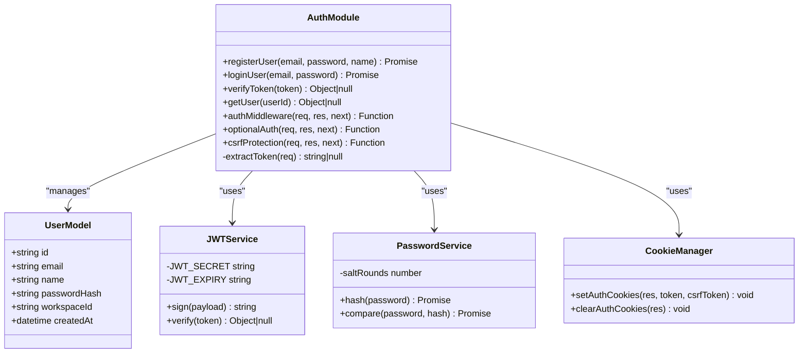
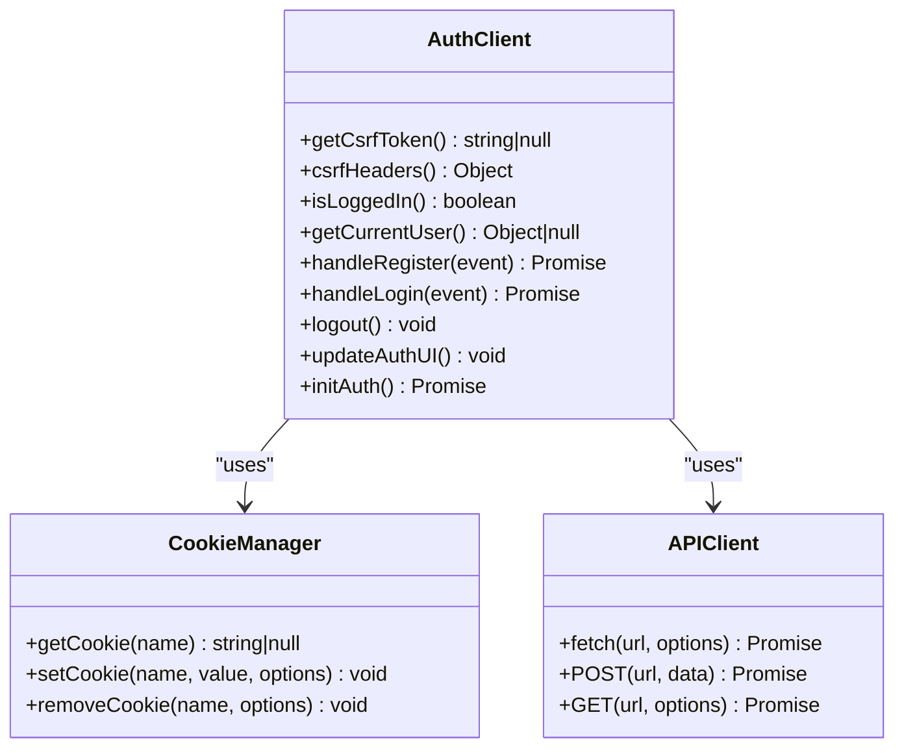
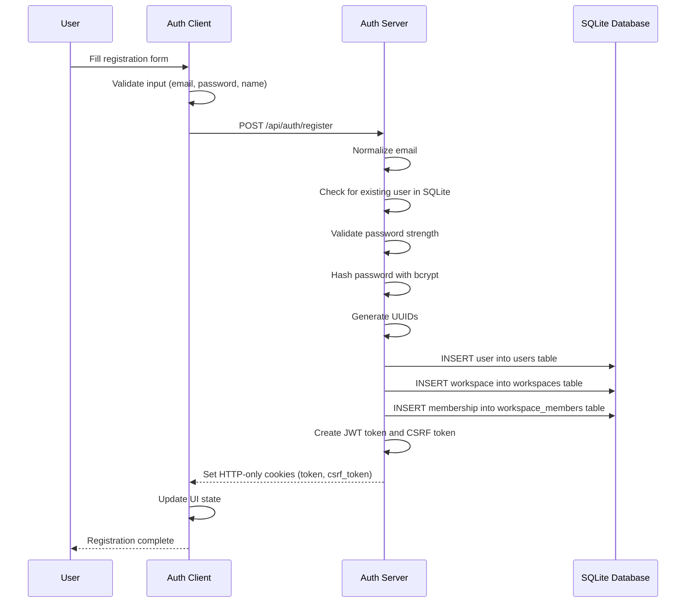
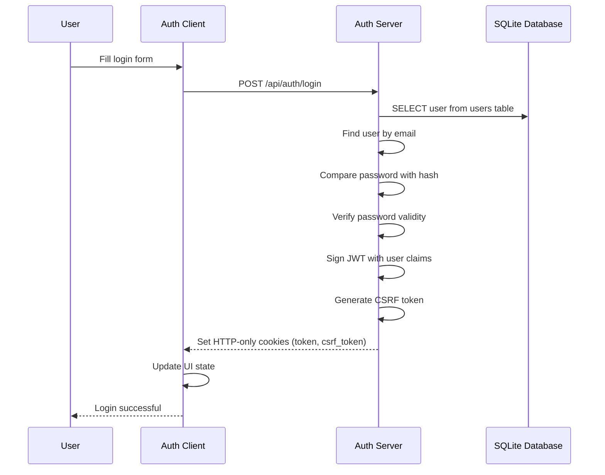
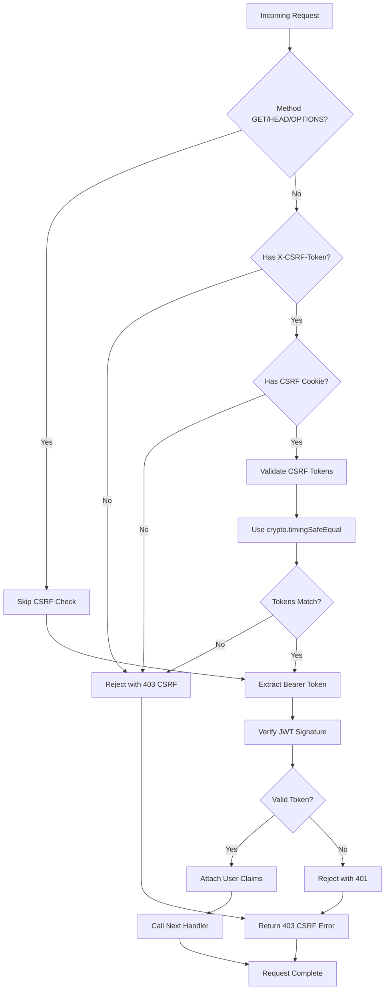
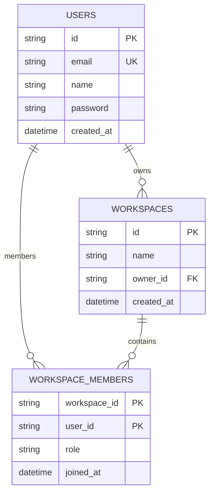
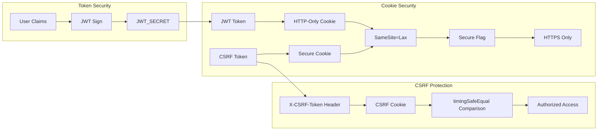
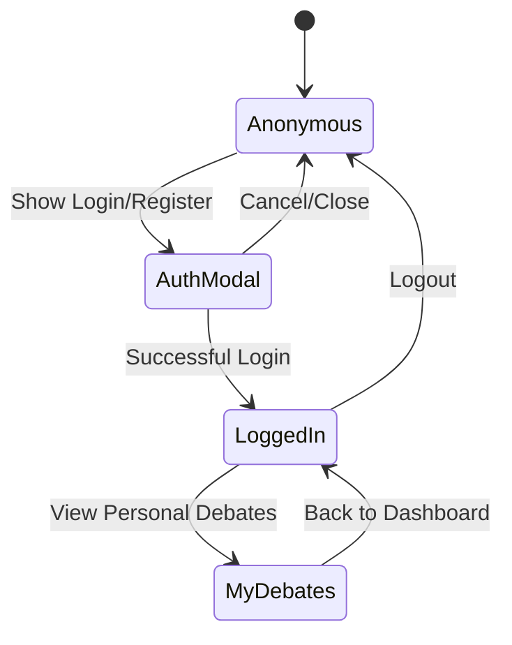
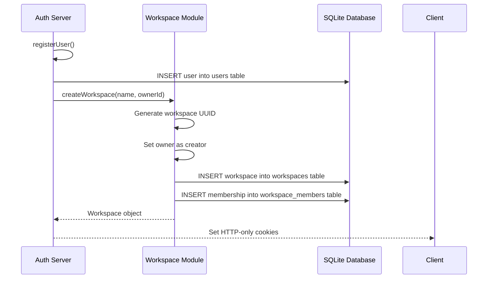

# Authentication System

<cite>
**Referenced Files in This Document**
- [auth.js](file://dissensus-engine/server/auth.js)
- [db.js](file://dissensus-engine/server/db.js)
- [index.js](file://dissensus-engine/server/index.js)
- [auth.js](file://dissensus-engine/public/js/auth.js)
- [index.html](file://dissensus-engine/public/index.html)
- [workspace.js](file://dissensus-engine/server/workspace.js)
- [package.json](file://dissensus-engine/package.json)
</cite>

## Update Summary
**Changes Made**
- Updated security implementation section to reflect enhanced CSRF protection using crypto.timingSafeEqual()
- Revised input validation section to include comprehensive registration validation (email format, password length, name requirements)
- Updated cookie-based authentication section to reflect migration from localStorage to HTTP-only cookies
- Added SQLite database migration details from file-based storage
- Enhanced security features documentation to include timing-safe comparisons and dual-token validation
- Updated frontend authentication integration to use cookie-based storage instead of localStorage

## Table of Contents
1. [Introduction](#introduction)
2. [System Architecture](#system-architecture)
3. [Core Authentication Components](#core-authentication-components)
4. [Authentication Flow Analysis](#authentication-flow-analysis)
5. [Data Storage and Persistence](#data-storage-and-persistence)
6. [Security Implementation](#security-implemented)
7. [Frontend Authentication Integration](#frontend-authentication-integration)
8. [Workspace and User Management](#workspace-and-user-management)
9. [Performance and Scalability](#performance-and-scalability)
10. [Troubleshooting Guide](#troubleshooting-guide)
11. [Conclusion](#conclusion)

## Introduction

The Dissensus AI Debate Engine implements a comprehensive authentication system that provides secure user registration, login, and session management for a multi-agent debate platform. The system has been enhanced with modern security practices including cookie-based authentication with HTTP-only cookies, CSRF protection, and dual-token validation, while migrating from file-based storage to a SQLite database for improved reliability and scalability.

The authentication system is built around JWT (JSON Web Token) technology with bcrypt password hashing, providing both security and seamless user experience. It integrates tightly with the debate engine's workspace functionality, allowing users to organize their debates into personal workspaces while maintaining strict security boundaries through enhanced cookie-based session management.

## System Architecture

The authentication system follows a client-server architecture with clear separation of concerns and enhanced security through cookie-based session management:

```mermaid
graph TB
subgraph "Client-Side"
UI[User Interface]
AuthClient[Auth Client Library]
Cookies[HTTP-Only Cookies]
CSRFCookie[CSRF Cookie]
end
subgraph "Server-Side"
Express[Express Server]
AuthModule[Auth Module]
WorkspaceModule[Workspace Module]
SQLite[SQLite Database]
Crypto[crypto.timingSafeEqual]
end
subgraph "External Services"
JWT[JWT Tokens]
Bcrypt[Bcrypt Hashing]
CSRF[CSRF Protection]
End
UI --> AuthClient
AuthClient --> Express
Express --> AuthModule
Express --> WorkspaceModule
AuthModule --> JWT
AuthModule --> Bcrypt
AuthModule --> SQLite
WorkspaceModule --> SQLite
SQLite --> CSRF
Cookies -.-> AuthClient
CSRFCookie -.-> Crypto
Crypto --> CSRF
```

**Diagram sources**
- [auth.js:1-126](file://dissensus-engine/server/auth.js#L1-L126)
- [index.js:18-18](file://dissensus-engine/server/index.js#L18-L18)
- [auth.js:1-126](file://dissensus-engine/public/js/auth.js#L1-L126)

The architecture ensures that all sensitive operations occur server-side while maintaining responsive client interactions through RESTful APIs and WebSocket connections, with enhanced security through cookie-based session management and CSRF protection.

**Section sources**
- [auth.js:1-126](file://dissensus-engine/server/auth.js#L1-L126)
- [index.js:1-668](file://dissensus-engine/server/index.js#L1-L668)

## Core Authentication Components

### Backend Authentication Module

The server-side authentication module provides comprehensive user management functionality with SQLite database integration:



**Diagram sources**
- [auth.js:18-126](file://dissensus-engine/server/auth.js#L18-L126)

### Frontend Authentication Client

The client-side authentication library handles user interface interactions and cookie-based storage management:



**Diagram sources**
- [auth.js:1-212](file://dissensus-engine/public/js/auth.js#L1-L212)

**Section sources**
- [auth.js:1-126](file://dissensus-engine/server/auth.js#L1-L126)
- [auth.js:1-212](file://dissensus-engine/public/js/auth.js#L1-L212)

## Authentication Flow Analysis

### User Registration Process

The registration flow implements comprehensive validation and security measures with cookie-based session creation:



**Diagram sources**
- [auth.js:18-51](file://dissensus-engine/server/auth.js#L18-L51)
- [index.js:267-273](file://dissensus-engine/server/index.js#L267-L273)
- [workspace.js:4-10](file://dissensus-engine/server/workspace.js#L4-L10)

### User Login Process

The login process validates credentials, issues secure JWT tokens, and sets HTTP-only cookies:



**Diagram sources**
- [auth.js:53-64](file://dissensus-engine/server/auth.js#L53-L64)
- [index.js:275-281](file://dissensus-engine/server/index.js#L275-L281)

### Session Management with CSRF Protection

The system implements robust session management through middleware with dual-token validation:



**Diagram sources**
- [auth.js:114-123](file://dissensus-engine/server/auth.js#L114-L123)
- [auth.js:82-90](file://dissensus-engine/server/auth.js#L82-L90)

**Section sources**
- [auth.js:18-126](file://dissensus-engine/server/auth.js#L18-L126)
- [index.js:267-299](file://dissensus-engine/server/index.js#L267-L299)

## Data Storage and Persistence

### SQLite Database Migration

The authentication system has migrated from file-based storage to a robust SQLite database system:



**Diagram sources**
- [db.js:15-44](file://dissensus-engine/server/db.js#L15-L44)

### Database Schema and Relationships

The SQLite database provides enhanced data integrity and performance:

| Table | Primary Key | Foreign Keys | Indexes | Purpose |
|-------|-------------|--------------|---------|---------|
| users | id | None | idx_users_email | User account management |
| workspaces | id | owner_id → users.id | None | Workspace container |
| workspace_members | (workspace_id, user_id) | workspace_id → workspaces.id<br/>user_id → users.id | idx_workspace_members_user | Workspace membership |

### Data Validation and Security

The system implements multiple layers of data validation and security:

| Validation Point | Implementation | Purpose |
|-----------------|---------------|---------|
| Email Normalization | Lowercase and trim | Prevent duplicates and ensure consistency |
| Password Strength | Minimum 8 characters | Enforce security requirements |
| Input Sanitization | Control character removal | Prevent prompt injection attacks |
| Token Verification | HMAC signature check | Ensure token authenticity |
| Database Constraints | Unique indexes and foreign keys | Prevent data inconsistency |
| SQL Injection Prevention | Parameterized queries | Prevent SQL injection attacks |

**Section sources**
- [db.js:1-47](file://dissensus-engine/server/db.js#L1-L47)
- [auth.js:18-64](file://dissensus-engine/server/auth.js#L18-L64)
- [workspace.js:4-29](file://dissensus-engine/server/workspace.js#L4-L29)

## Security Implementation

### Enhanced Cookie-Based Security

The authentication system employs industry-standard cryptographic practices with enhanced cookie security:



**Diagram sources**
- [auth.js:48-50](file://dissensus-engine/server/auth.js#L48-L50)
- [index.js:250-265](file://dissensus-engine/server/index.js#L250-L265)
- [auth.js:114-123](file://dissensus-engine/server/auth.js#L114-L123)

### Security Features

| Feature | Implementation | Security Benefit |
|---------|---------------|------------------|
| Password Hashing | bcrypt with salt | Protects against rainbow table attacks |
| Token Expiration | 7-day expiry | Limits session lifetime |
| Input Validation | Comprehensive sanitization | Prevents injection attacks |
| Rate Limiting | 10/minute for debates, 5/min for login, 3/hour for register | Prevents abuse |
| CORS Protection | Helmet.js configuration | Mitigates XSS and clickjacking |
| Secure Headers | Content Security Policy | Enhances overall security posture |
| HTTP-Only Cookies | Prevents XSS cookie theft | Eliminates client-side cookie manipulation |
| CSRF Protection | Dual-token validation with timing-safe comparison | Prevents cross-site request forgery |
| Secure Cookie Flags | HTTPS-only and SameSite protection | Prevents cookie hijacking |
| Database Security | Parameterized queries and constraints | Prevents SQL injection and data inconsistency |

**Section sources**
- [auth.js:1-126](file://dissensus-engine/server/auth.js#L1-L126)
- [index.js:62-76](file://dissensus-engine/server/index.js#L62-L76)
- [package.json:10-22](file://dissensus-engine/package.json#L10-L22)

## Frontend Authentication Integration

### Cookie-Based User Interface Components

The frontend authentication system provides seamless user experience with cookie-based state management:



**Diagram sources**
- [auth.js:18-20](file://dissensus-engine/public/js/auth.js#L18-L20)
- [auth.js:105-129](file://dissensus-engine/public/js/auth.js#L105-L129)

### Authentication State Management with Cookies

The client maintains authentication state through HTTP-only cookies:

| Cookie Name | Purpose | Security Level | Expiration |
|-------------|---------|----------------|------------|
| `token` | JWT authentication token | High (HTTP-only) | 7 days |
| `csrf_token` | CSRF protection token | High (HTTP-only) | 7 days |

**Updated** Enhanced security with crypto.timingSafeEqual() for CSRF token validation

### UI Integration Points

The authentication system integrates with multiple UI components:

- **Header Controls**: Login/Logout buttons and user menu
- **Authentication Modal**: Tabbed login/register interface
- **My Debates Panel**: Personal debate history
- **Workspace Navigation**: Access to user workspaces

**Section sources**
- [auth.js:1-212](file://dissensus-engine/public/js/auth.js#L1-L212)
- [index.html:42-49](file://dissensus-engine/public/index.html#L42-L49)
- [index.html:240-282](file://dissensus-engine/public/index.html#L240-L282)

## Workspace and User Management

### Personal Workspace Creation with SQLite

Each registered user automatically receives a personal workspace managed through SQLite:



**Diagram sources**
- [auth.js:41-50](file://dissensus-engine/server/auth.js#L41-L50)
- [workspace.js:4-10](file://dissensus-engine/server/workspace.js#L4-L10)

### Workspace Permissions with Database Integrity

The workspace system implements role-based access control with database constraints:

| Role | Permissions | Database Constraint |
|------|-------------|-------------------|
| Owner | Full control | Direct ownership in workspaces table |
| Member | Limited access | Membership in workspace_members table |
| Guest | Read-only | Not applicable (no guest role) |

**Section sources**
- [workspace.js:4-29](file://dissensus-engine/server/workspace.js#L4-L29)
- [db.js:24-40](file://dissensus-engine/server/db.js#L24-L40)

## Performance and Scalability

### Database Performance Optimizations

The authentication system is optimized for performance with SQLite:

- **SQLite Database**: Efficient local database with WAL mode for concurrent reads
- **Foreign Key Constraints**: Enforced at database level for data integrity
- **Index Optimization**: Email and user membership indexing for fast queries
- **Parameterized Queries**: Prevents SQL injection and improves query planning
- **JWT Verification**: Fast signature verification without database access

### Scalability Considerations

Current limitations and future improvements:

| Aspect | Current Status | Future Improvements |
|--------|----------------|---------------------|
| Storage | SQLite database | Horizontal scaling with connection pooling |
| User Base | Single-node SQLite | Multi-master replication |
| Sessions | HTTP-only cookies | Redis/Memcached support |
| Rate Limiting | Basic rate limiting | Distributed rate limiting |
| Database Size | Growing rapidly | Connection pooling and optimization |

**Section sources**
- [db.js:1-47](file://dissensus-engine/server/db.js#L1-L47)
- [index.js:82-104](file://dissensus-engine/server/index.js#L82-L104)

## Troubleshooting Guide

### Common Authentication Issues

| Issue | Symptoms | Solution |
|-------|----------|----------|
| Invalid email format | Registration fails | Ensure proper email format |
| Password too short | Registration blocked | Use minimum 8 characters |
| Duplicate email | Registration error | Use unique email address |
| Invalid credentials | Login fails | Check email/password combination |
| Token expiration | 401 errors | Re-authenticate user |
| CSRF validation failure | 403 errors on POST | Ensure CSRF token cookie and header match |
| Cookie not set | Login success but no session | Check SameSite and Secure cookie flags |
| Database connection error | Registration/Login fails | Verify SQLite database file permissions |

### Debugging Authentication Problems

1. **Check environment variables**: Verify JWT_SECRET and API keys
2. **Inspect database**: Ensure SQLite database file exists and is accessible
3. **Review server logs**: Look for authentication errors and database connection issues
4. **Test token validation**: Use JWT debugger tools
5. **Clear browser cookies**: Remove stale authentication cookies
6. **Check CSRF tokens**: Verify cookie and header token synchronization

### Security Best Practices

- **Change default secrets**: Update JWT_SECRET immediately
- **Enable HTTPS**: Deploy with SSL certificates for secure cookies
- **Regular audits**: Monitor authentication logs and database performance
- **Input validation**: Continue validating all user inputs
- **Security updates**: Keep dependencies current
- **Database backups**: Regular SQLite database backups

**Section sources**
- [auth.js:6-15](file://dissensus-engine/server/auth.js#L6-L15)
- [auth.js:31-32](file://dissensus-engine/server/auth.js#L31-L32)
- [README.md:1-668](file://dissensus-engine/README.md#L1-L668)

## Conclusion

The Dissensus AI Debate Engine's authentication system provides a robust, secure, and user-friendly foundation for managing user accounts and personal workspaces. The recent migration to SQLite database and implementation of cookie-based authentication with CSRF protection significantly enhances security while maintaining seamless user experience.

Key strengths of the implementation include:

- **Security-first design**: Industry-standard password hashing, HTTP-only cookies, and dual-token CSRF protection with timing-safe comparisons
- **Modern database architecture**: SQLite provides reliable data persistence with better performance than file-based storage
- **User-centric interface**: Seamless authentication flows with intuitive UI components
- **Enhanced security posture**: Comprehensive protection against common web vulnerabilities
- **Scalable architecture**: SQLite foundation supporting future horizontal scaling
- **Production-ready security**: Rate limiting, secure headers, and comprehensive error handling

The system serves as an excellent foundation for the Dissensus platform, enabling users to create meaningful debate experiences while maintaining strict security boundaries and operational reliability through enhanced cookie-based session management and robust database architecture.