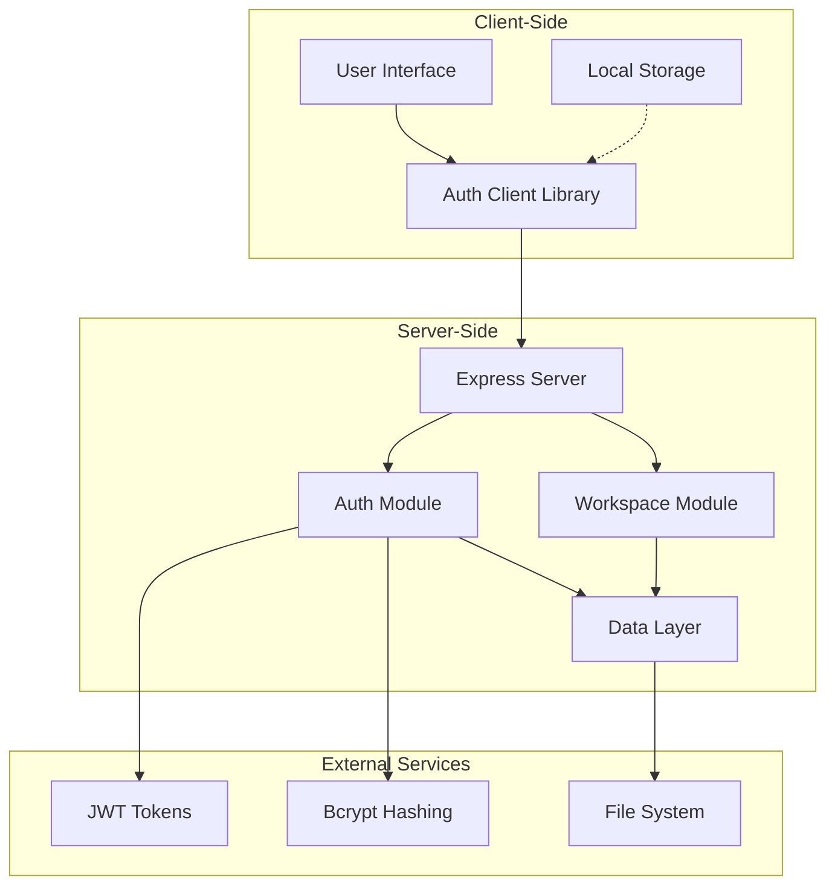
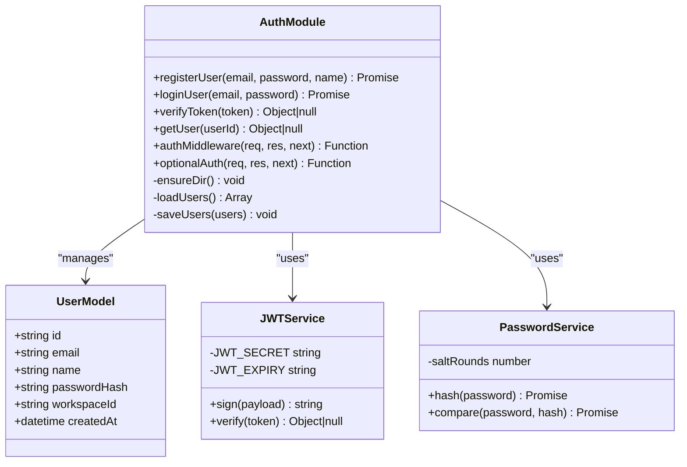
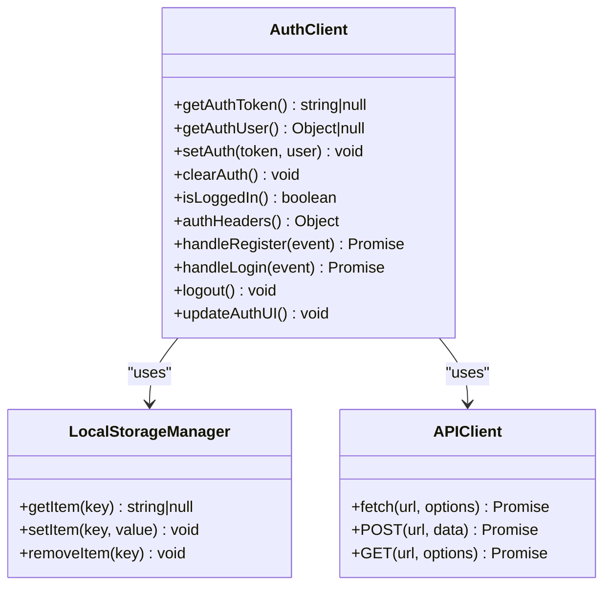
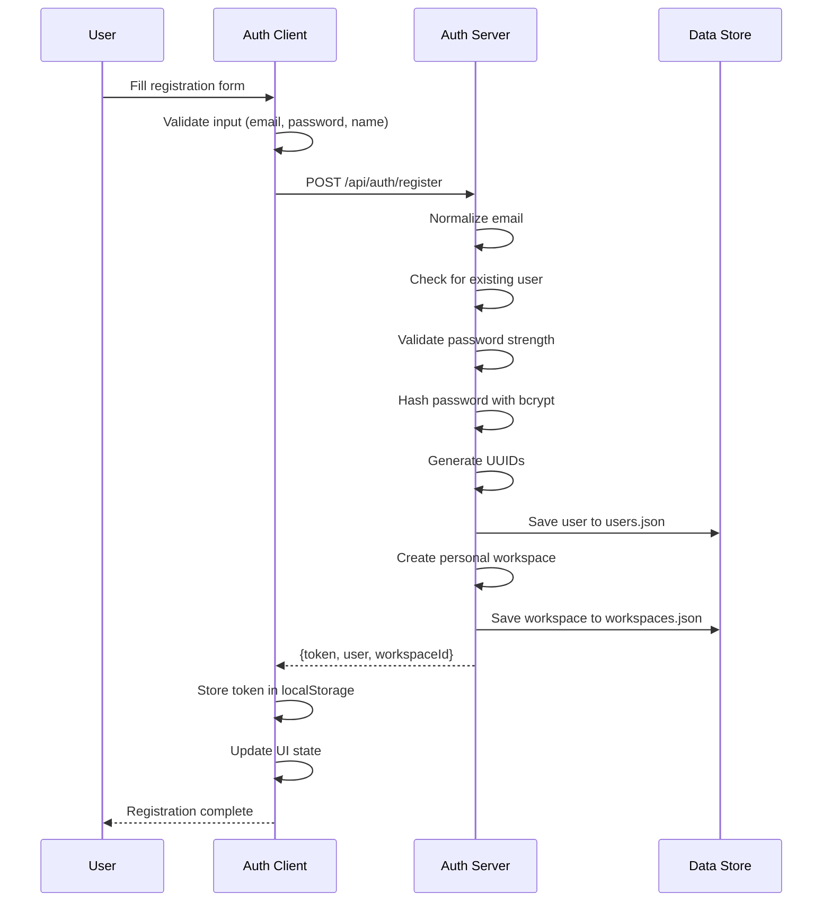
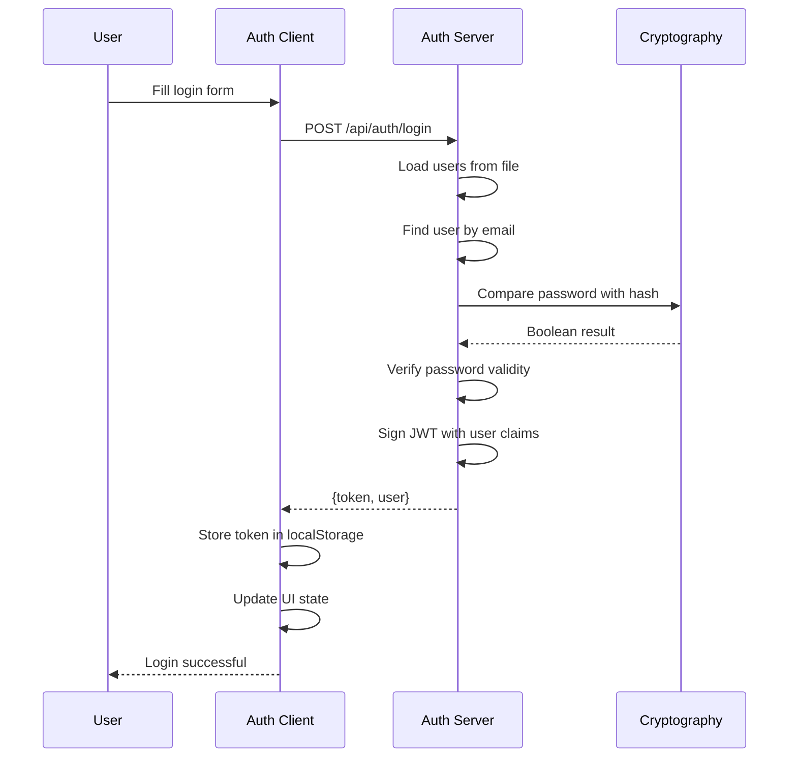
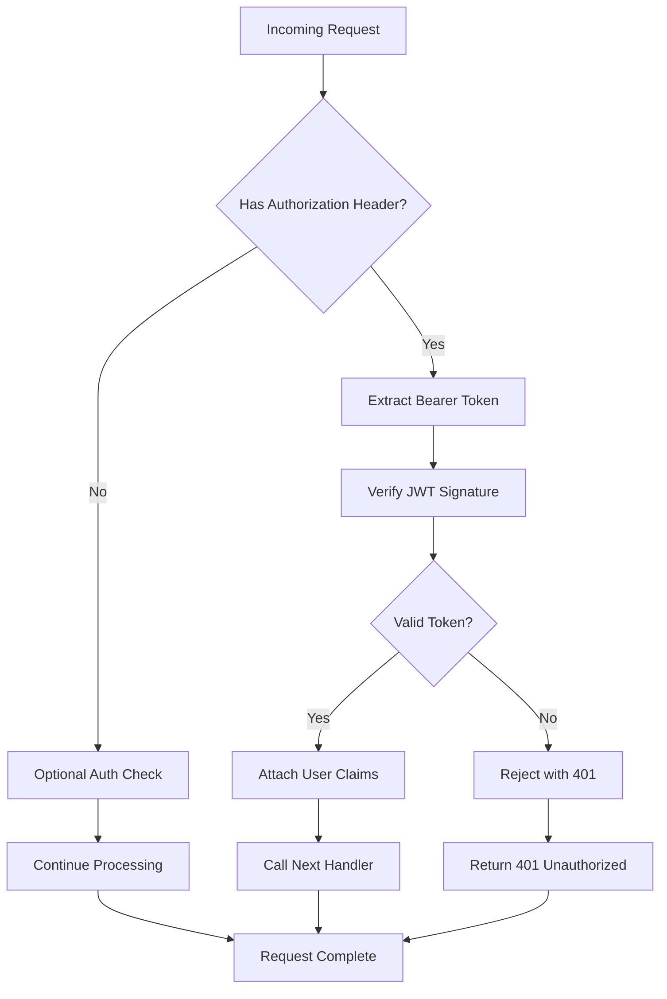
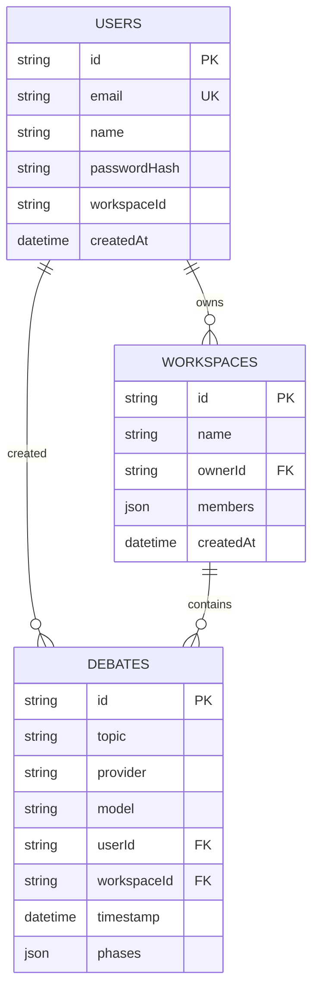
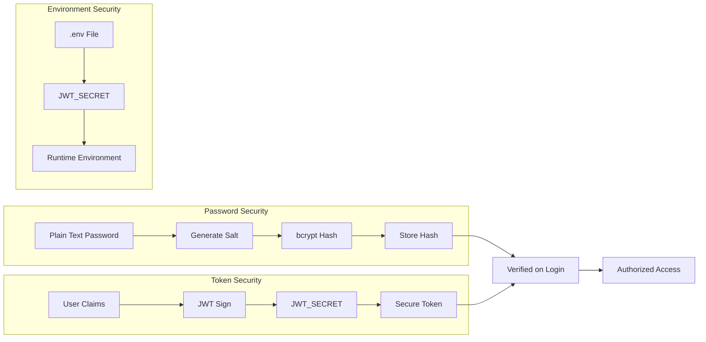
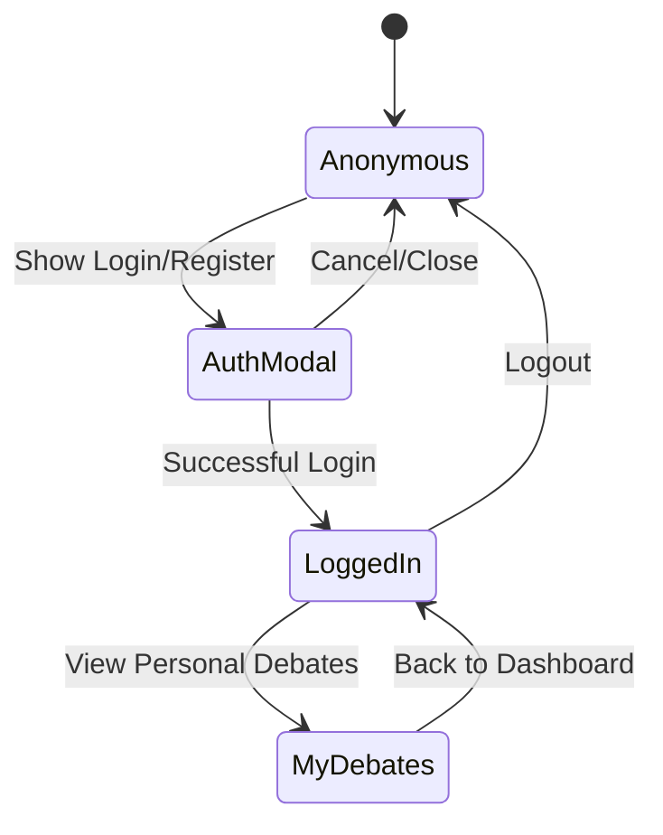
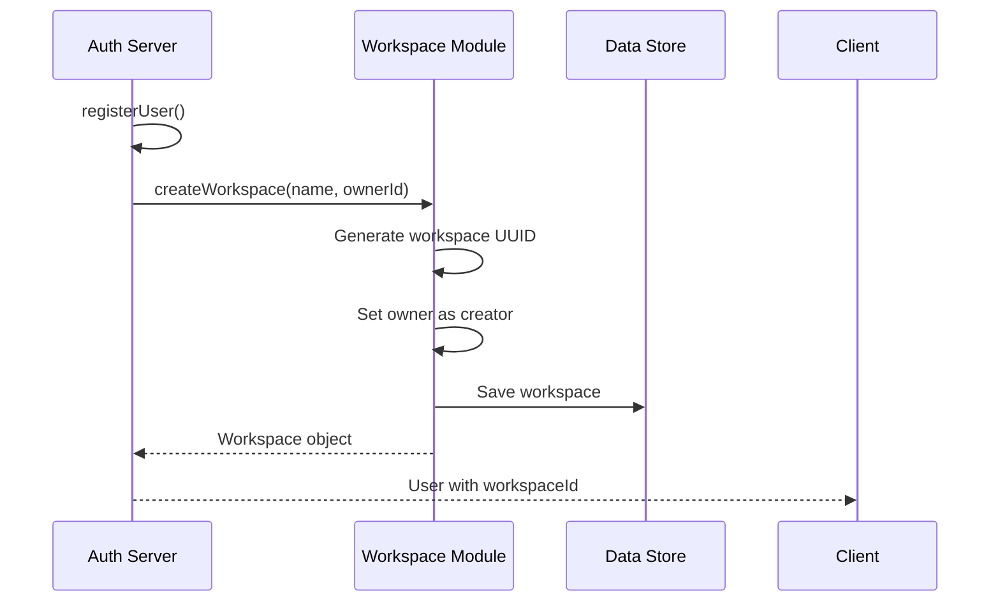

# Authentication System

<cite>
**Referenced Files in This Document**
- [auth.js](file://dissensus-engine/server/auth.js)
- [index.js](file://dissensus-engine/server/index.js)
- [auth.js](file://dissensus-engine/public/js/auth.js)
- [index.html](file://dissensus-engine/public/index.html)
- [workspace.js](file://dissensus-engine/server/workspace.js)
- [debate-store.js](file://dissensus-engine/server/debate-store.js)
- [package.json](file://dissensus-engine/package.json)
- [README.md](file://dissensus-engine/README.md)
</cite>

## Table of Contents
1. [Introduction](#introduction)
2. [System Architecture](#system-architecture)
3. [Core Authentication Components](#core-authentication-components)
4. [Authentication Flow Analysis](#authentication-flow-analysis)
5. [Data Storage and Persistence](#data-storage-and-persistence)
6. [Security Implementation](#security-implementation)
7. [Frontend Authentication Integration](#frontend-authentication-integration)
8. [Workspace and User Management](#workspace-and-user-management)
9. [Performance and Scalability](#performance-and-scalability)
10. [Troubleshooting Guide](#troubleshooting-guide)
11. [Conclusion](#conclusion)

## Introduction

The Dissensus AI Debate Engine implements a comprehensive authentication system that provides secure user registration, login, and session management for a multi-agent debate platform. The system combines modern security practices with user-friendly authentication flows, enabling users to create personalized workspaces and maintain persistent debate sessions.

The authentication system is built around JWT (JSON Web Token) technology with bcrypt password hashing, providing both security and seamless user experience. It integrates tightly with the debate engine's workspace functionality, allowing users to organize their debates into personal workspaces while maintaining strict security boundaries.

## System Architecture

The authentication system follows a client-server architecture with clear separation of concerns:

**Diagram sources**
- [auth.js:1-120](file://dissensus-engine/server/auth.js#L1-L120)
- [index.js:16-18](file://dissensus-engine/server/index.js#L16-L18)
- [auth.js:1-197](file://dissensus-engine/public/js/auth.js#L1-L197)

The architecture ensures that all sensitive operations occur server-side while maintaining responsive client interactions through RESTful APIs and WebSocket connections.

**Section sources**
- [auth.js:1-120](file://dissensus-engine/server/auth.js#L1-L120)
- [index.js:1-554](file://dissensus-engine/server/index.js#L1-L554)

## Core Authentication Components

### Backend Authentication Module

The server-side authentication module provides comprehensive user management functionality:

**Diagram sources**
- [auth.js:27-119](file://dissensus-engine/server/auth.js#L27-L119)

### Frontend Authentication Client

The client-side authentication library handles user interface interactions and local storage management:

**Diagram sources**
- [auth.js:1-197](file://dissensus-engine/public/js/auth.js#L1-L197)

**Section sources**
- [auth.js:1-120](file://dissensus-engine/server/auth.js#L1-L120)
- [auth.js:1-197](file://dissensus-engine/public/js/auth.js#L1-L197)

## Authentication Flow Analysis

### User Registration Process

The registration flow implements comprehensive validation and security measures:

**Diagram sources**
- [auth.js:27-59](file://dissensus-engine/server/auth.js#L27-L59)
- [index.js:221-231](file://dissensus-engine/server/index.js#L221-L231)
- [workspace.js:23-35](file://dissensus-engine/server/workspace.js#L23-L35)

### User Login Process

The login process validates credentials and issues secure JWT tokens:

**Diagram sources**
- [auth.js:61-78](file://dissensus-engine/server/auth.js#L61-L78)
- [index.js:233-241](file://dissensus-engine/server/index.js#L233-L241)

### Session Management

The system implements robust session management through middleware:

**Diagram sources**
- [auth.js:96-117](file://dissensus-engine/server/auth.js#L96-L117)

**Section sources**
- [auth.js:27-119](file://dissensus-engine/server/auth.js#L27-L119)
- [index.js:221-247](file://dissensus-engine/server/index.js#L221-L247)

## Data Storage and Persistence

### User Data Management

The authentication system uses a file-based storage approach for simplicity and reliability:

**Diagram sources**
- [auth.js:46-53](file://dissensus-engine/server/auth.js#L46-L53)
- [workspace.js:25-31](file://dissensus-engine/server/workspace.js#L25-L31)
- [debate-store.js:22-31](file://dissensus-engine/server/debate-store.js#L22-L31)

### Data Validation and Security

The system implements multiple layers of data validation and security:

| Validation Point | Implementation | Purpose |
|-----------------|---------------|---------|
| Email Normalization | Lowercase and trim | Prevent duplicates and ensure consistency |
| Password Strength | Minimum 8 characters | Enforce security requirements |
| Input Sanitization | Control character removal | Prevent prompt injection attacks |
| Token Verification | HMAC signature check | Ensure token authenticity |
| File Access | Existence checks and try-catch | Prevent crashes from missing files |

**Section sources**
- [auth.js:12-25](file://dissensus-engine/server/auth.js#L12-L25)
- [auth.js:27-59](file://dissensus-engine/server/auth.js#L27-L59)
- [debate-store.js:43-52](file://dissensus-engine/server/debate-store.js#L43-L52)

## Security Implementation

### Cryptographic Security

The authentication system employs industry-standard cryptographic practices:

**Diagram sources**
- [auth.js:41-43](file://dissensus-engine/server/auth.js#L41-L43)
- [auth.js:71-75](file://dissensus-engine/server/auth.js#L71-L75)
- [auth.js:9-10](file://dissensus-engine/server/auth.js#L9-L10)

### Security Features

| Feature | Implementation | Security Benefit |
|---------|---------------|------------------|
| Password Hashing | bcrypt with salt | Protects against rainbow table attacks |
| Token Expiration | 7-day expiry | Limits session lifetime |
| Input Validation | Comprehensive sanitization | Prevents injection attacks |
| Rate Limiting | 10/minute for debates | Prevents abuse |
| CORS Protection | Helmet.js configuration | Mitigates XSS and clickjacking |
| Secure Headers | Content Security Policy | Enhances overall security posture |

**Section sources**
- [auth.js:1-120](file://dissensus-engine/server/auth.js#L1-L120)
- [index.js:61-66](file://dissensus-engine/server/index.js#L61-L66)
- [package.json:10-20](file://dissensus-engine/package.json#L10-L20)

## Frontend Authentication Integration

### User Interface Components

The frontend authentication system provides seamless user experience:

**Diagram sources**
- [auth.js:113-129](file://dissensus-engine/public/js/auth.js#L113-L129)
- [auth.js:97-111](file://dissensus-engine/public/js/auth.js#L97-L111)

### Authentication State Management

The client maintains authentication state through localStorage:

| State Key | Purpose | Expiration | Security Level |
|-----------|---------|------------|----------------|
| `dissensus_token` | JWT authentication token | 7 days | High (HTTP-only recommended) |
| `dissensus_user` | User profile data | Same as token | Medium (localStorage) |
| `dissensus_provider` | Last selected provider | Session | Low (non-sensitive) |

### UI Integration Points

The authentication system integrates with multiple UI components:

- **Header Controls**: Login/Logout buttons and user menu
- **Authentication Modal**: Tabbed login/register interface
- **My Debates Panel**: Personal debate history
- **Workspace Navigation**: Access to user workspaces

**Section sources**
- [auth.js:1-197](file://dissensus-engine/public/js/auth.js#L1-L197)
- [index.html:42-49](file://dissensus-engine/public/index.html#L42-L49)
- [index.html:234-282](file://dissensus-engine/public/index.html#L234-L282)

## Workspace and User Management

### Personal Workspace Creation

Each registered user automatically receives a personal workspace:

**Diagram sources**
- [auth.js:44-53](file://dissensus-engine/server/auth.js#L44-L53)
- [index.js:225-227](file://dissensus-engine/server/index.js#L225-L227)
- [workspace.js:23-35](file://dissensus-engine/server/workspace.js#L23-L35)

### Workspace Permissions

The workspace system implements role-based access control:

| Role | Permissions | Actions |
|------|-------------|---------|
| Owner | Full control | Create, edit, delete, manage members |
| Member | Limited access | View, participate in debates |
| Guest | Read-only | View public content |

**Section sources**
- [workspace.js:25-31](file://dissensus-engine/server/workspace.js#L25-L31)
- [workspace.js:47-55](file://dissensus-engine/server/workspace.js#L47-L55)

## Performance and Scalability

### Authentication Performance

The authentication system is optimized for performance:

- **File-based storage**: Minimal overhead for small user bases
- **JWT verification**: Fast signature verification
- **Rate limiting**: Prevents abuse and ensures fair usage
- **Caching**: User data loaded once per request lifecycle

### Scalability Considerations

Current limitations and future improvements:

| Aspect | Current Status | Future Improvements |
|--------|----------------|---------------------|
| Storage | File-based JSON | Database migration |
| User Base | Single-digit thousands | Horizontal scaling |
| Sessions | In-memory | Redis/Memcached support |
| Rate Limiting | Basic | Distributed rate limiting |

**Section sources**
- [auth.js:12-25](file://dissensus-engine/server/auth.js#L12-L25)
- [index.js:68-75](file://dissensus-engine/server/index.js#L68-L75)

## Troubleshooting Guide

### Common Authentication Issues

| Issue | Symptoms | Solution |
|-------|----------|----------|
| Invalid email format | Registration fails | Ensure proper email format |
| Password too short | Registration blocked | Use minimum 8 characters |
| Duplicate email | Registration error | Use unique email address |
| Invalid credentials | Login fails | Check email/password combination |
| Token expiration | 401 errors | Re-authenticate user |
| File permissions | Storage errors | Check data directory permissions |

### Debugging Authentication Problems

1. **Check environment variables**: Verify JWT_SECRET and API keys
2. **Inspect data files**: Ensure users.json and workspaces.json exist
3. **Review server logs**: Look for authentication errors
4. **Test token validation**: Use JWT debugger tools
5. **Clear browser cache**: Remove stale authentication data

### Security Best Practices

- **Change default secrets**: Update JWT_SECRET immediately
- **Enable HTTPS**: Deploy with SSL certificates
- **Regular audits**: Monitor authentication logs
- **Input validation**: Continue validating all user inputs
- **Security updates**: Keep dependencies current

**Section sources**
- [auth.js:8-10](file://dissensus-engine/server/auth.js#L8-L10)
- [auth.js:34-39](file://dissensus-engine/server/auth.js#L34-L39)
- [README.md:169-176](file://dissensus-engine/README.md#L169-L176)

## Conclusion

The Dissensus AI Debate Engine's authentication system provides a robust, secure, and user-friendly foundation for managing user accounts and personal workspaces. By combining modern cryptographic practices with thoughtful user experience design, the system successfully balances security requirements with ease of use.

Key strengths of the implementation include:

- **Security-first design**: Industry-standard password hashing and token-based authentication
- **User-centric interface**: Seamless authentication flows with intuitive UI components
- **Scalable architecture**: Modular design supporting future enhancements
- **Comprehensive validation**: Multi-layered input sanitization and validation
- **Production readiness**: Rate limiting, security headers, and error handling

The system serves as an excellent foundation for the Dissensus platform, enabling users to create meaningful debate experiences while maintaining strict security boundaries and operational reliability.