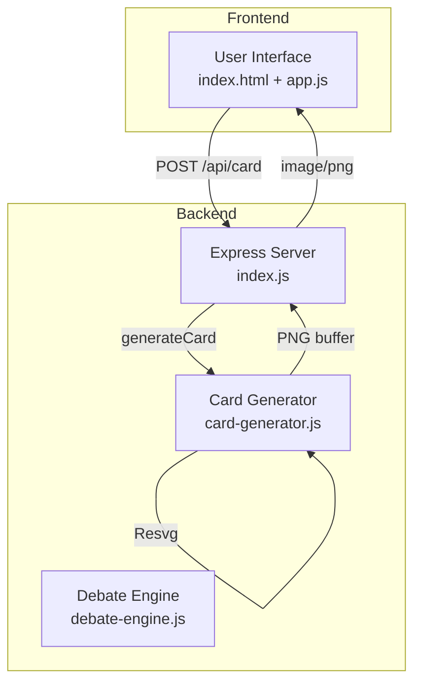
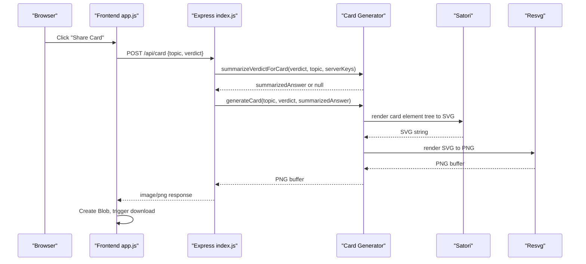
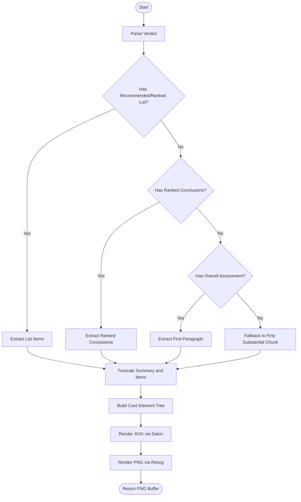
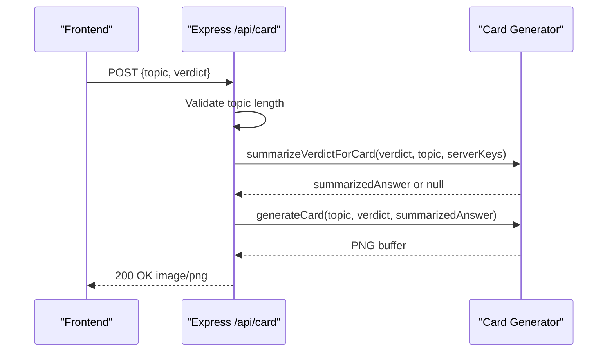
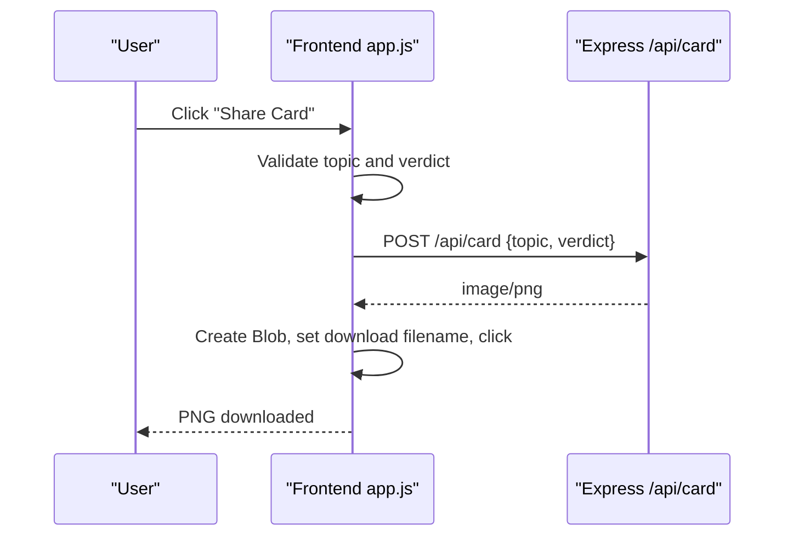
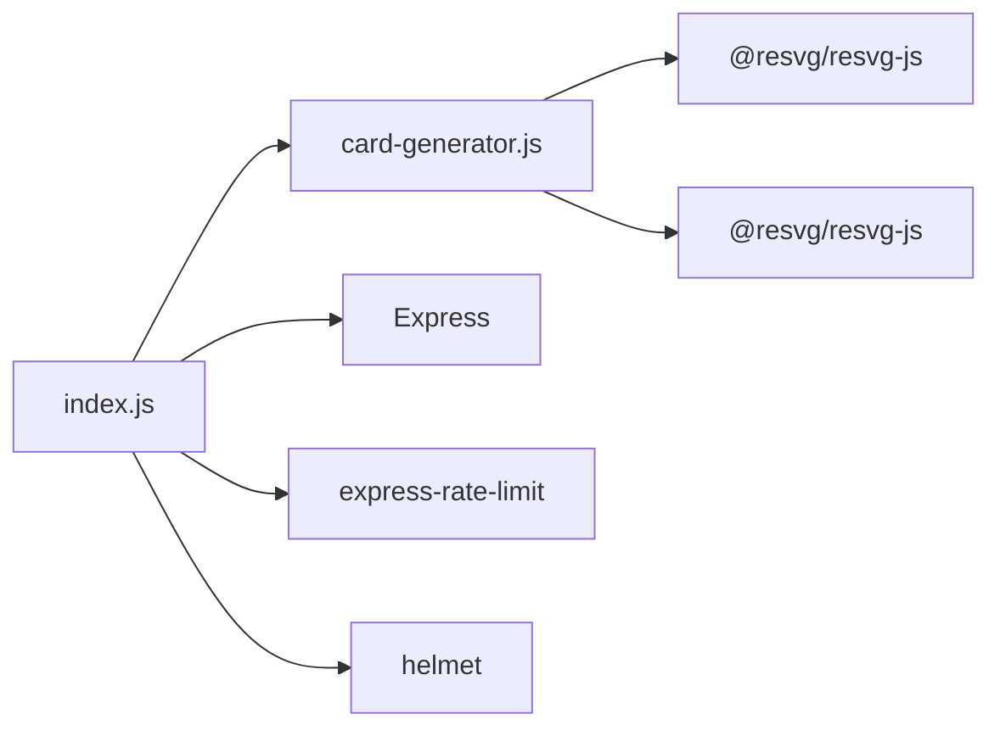

# Card Generator

<cite>
**Referenced Files in This Document**
- [card-generator.js](file://dissensus-engine/server/card-generator.js)
- [index.js](file://dissensus-engine/server/index.js)
- [app.js](file://dissensus-engine/public/js/app.js)
- [index.html](file://dissensus-engine/public/index.html)
- [styles.css](file://dissensus-engine/public/css/styles.css)
- [debate-engine.js](file://dissensus-engine/server/debate-engine.js)
- [package.json](file://dissensus-engine/package.json)
- [README.md](file://dissensus-engine/README.md)
</cite>

## Table of Contents
1. [Introduction](#introduction)
2. [Project Structure](#project-structure)
3. [Core Components](#core-components)
4. [Architecture Overview](#architecture-overview)
5. [Detailed Component Analysis](#detailed-component-analysis)
6. [Dependency Analysis](#dependency-analysis)
7. [Performance Considerations](#performance-considerations)
8. [Troubleshooting Guide](#troubleshooting-guide)
9. [Conclusion](#conclusion)
10. [Appendices](#appendices)

## Introduction
This document explains the social media card generation system that produces shareable debate content. It covers the card creation workflow, SVG-to-PNG conversion, dynamic content extraction from debate results, and the image processing pipeline. It also documents the card template system, agent-specific styling, verdict formatting, and social media optimization. Finally, it describes the integration with the backend card generator service, real-time card preview, download functionality, and sharing capabilities, along with customization guidelines and performance optimization strategies.

## Project Structure
The card generation system spans the frontend and backend:
- Frontend: A button triggers card generation and downloads a PNG.
- Backend: An Express endpoint validates inputs, optionally summarizes long verdicts, constructs a card template, renders SVG, converts to PNG, and returns the image.
- Template engine: Satori renders a React-like element tree to SVG; Resvg rasterizes SVG to PNG.

**Diagram sources**
- [index.js:382-416](file://dissensus-engine/server/index.js#L382-L416)
- [card-generator.js:170-358](file://dissensus-engine/server/card-generator.js#L170-L358)
- [app.js:606-639](file://dissensus-engine/public/js/app.js#L606-L639)

**Section sources**
- [index.js:382-416](file://dissensus-engine/server/index.js#L382-L416)
- [card-generator.js:170-358](file://dissensus-engine/server/card-generator.js#L170-L358)
- [app.js:606-639](file://dissensus-engine/public/js/app.js#L606-L639)

## Core Components
- Card generator module: Parses debate verdicts, extracts summary and ranked items, builds a card template, renders SVG, and produces PNG.
- Backend card endpoint: Validates inputs, optionally summarizes long verdicts, and streams the generated PNG to the client.
- Frontend integration: Provides a “Share Card” action that posts the current debate topic and verdict to the backend and downloads the resulting PNG.

Key responsibilities:
- Dynamic content extraction: Detects “Recommended List”, “Ranked Picks”, “Ranked Conclusions”, and “Overall Assessment” sections; falls back to first substantial paragraph.
- Social media optimization: Produces a 1200×630 PNG suitable for Twitter/X and other platforms.
- Agent-specific styling: The card template uses a dark theme with accent colors aligned to the agents’ identities.

**Section sources**
- [card-generator.js:87-152](file://dissensus-engine/server/card-generator.js#L87-L152)
- [card-generator.js:170-358](file://dissensus-engine/server/card-generator.js#L170-L358)
- [index.js:382-416](file://dissensus-engine/server/index.js#L382-L416)
- [app.js:606-639](file://dissensus-engine/public/js/app.js#L606-L639)

## Architecture Overview
The card generation pipeline is a server-side rendering flow:
1. Frontend collects the debate topic and verdict text.
2. Frontend posts to the backend card endpoint.
3. Backend optionally summarizes long verdicts using an LLM.
4. Backend constructs a card template using Satori and renders SVG.
5. Backend converts SVG to PNG using Resvg.
6. Backend returns the PNG to the client for immediate download.

**Diagram sources**
- [app.js:606-639](file://dissensus-engine/public/js/app.js#L606-L639)
- [index.js:382-416](file://dissensus-engine/server/index.js#L382-L416)
- [card-generator.js:41-85](file://dissensus-engine/server/card-generator.js#L41-L85)
- [card-generator.js:170-358](file://dissensus-engine/server/card-generator.js#L170-L358)

## Detailed Component Analysis

### Card Generator Module
Responsibilities:
- Verdict parsing: Extracts summary and ranked items from structured debate output.
- Content truncation: Ensures text fits within card dimensions.
- Card template construction: Builds a React-like element tree representing the card layout.
- Rendering pipeline: Renders SVG via Satori and PNG via Resvg.
- Crypto topic detection: Adds a disclaimer for crypto-related topics.

Key functions and behaviors:
- Verdict extraction: Searches for “Recommended List”, “Ranked Picks”, “Ranked Conclusions”, and “Overall Assessment” sections; falls back to first substantial paragraph.
- Truncation helpers: Limits summary length and individual list items to prevent overflow.
- Font loading: Downloads Inter font once and caches it.
- Template layout: Uses a dark theme with gradient accents, compact typography, and optional crypto disclaimer.

**Diagram sources**
- [card-generator.js:87-152](file://dissensus-engine/server/card-generator.js#L87-L152)
- [card-generator.js:170-358](file://dissensus-engine/server/card-generator.js#L170-L358)

**Section sources**
- [card-generator.js:21-35](file://dissensus-engine/server/card-generator.js#L21-L35)
- [card-generator.js:87-152](file://dissensus-engine/server/card-generator.js#L87-L152)
- [card-generator.js:154-168](file://dissensus-engine/server/card-generator.js#L154-L168)
- [card-generator.js:170-358](file://dissensus-engine/server/card-generator.js#L170-L358)

### Backend Card Endpoint
Responsibilities:
- Input validation: Ensures topic and verdict are present and within length limits.
- Optional LLM summarization: Summarizes long verdicts when server keys are available.
- Image generation: Calls the card generator and returns the PNG with appropriate headers.
- Rate limiting: Prevents abuse of the card endpoint.

Behavior highlights:
- Topic length limit enforced for card readability.
- Summarization invoked when verdict exceeds a threshold.
- Strict cache-control header to prevent caching of generated images.

**Diagram sources**
- [index.js:382-416](file://dissensus-engine/server/index.js#L382-L416)
- [card-generator.js:41-85](file://dissensus-engine/server/card-generator.js#L41-L85)
- [card-generator.js:170-358](file://dissensus-engine/server/card-generator.js#L170-L358)

**Section sources**
- [index.js:382-416](file://dissensus-engine/server/index.js#L382-L416)

### Frontend Integration and Download
Responsibilities:
- Capture current debate topic and verdict text.
- Send a POST request to the backend card endpoint.
- Receive a PNG blob and trigger a browser download.

User flow:
- After a debate completes, the user clicks “Share Card”.
- The frontend validates presence of topic and verdict.
- The frontend posts to the backend and downloads the returned PNG.

**Diagram sources**
- [app.js:606-639](file://dissensus-engine/public/js/app.js#L606-L639)
- [index.js:382-416](file://dissensus-engine/server/index.js#L382-L416)

**Section sources**
- [app.js:606-639](file://dissensus-engine/public/js/app.js#L606-L639)

### Card Template System and Styling
The card template is a React-like element tree rendered by Satori:
- Dimensions: 1200×630 pixels (Twitter/X optimized).
- Typography: Inter font; truncation ensures readability.
- Layout: Gradient top bar, branding, topic, summary, ranked items, conviction badge, and footer with optional crypto disclaimer.
- Theming: Dark background with accent colors; agent identity colors are used for visual cues in the broader UI.

Agent-specific styling in the broader UI:
- The verdict panel and buttons reflect agent colors and gradients for visual coherence.

**Section sources**
- [card-generator.js:11-12](file://dissensus-engine/server/card-generator.js#L11-L12)
- [card-generator.js:170-358](file://dissensus-engine/server/card-generator.js#L170-L358)
- [styles.css:805-868](file://dissensus-engine/public/css/styles.css#L805-L868)

### Verdict Formatting and Extraction
The system extracts:
- Summary: First substantial paragraph or “Overall Assessment”.
- Ranked items: From “Recommended List”, “Ranked Picks”, or “Ranked Conclusions”.
- Conviction: From “Overall Conviction” or “Lean/Strong Bullish/Bearish/Neutral”.

Fallback logic ensures content is always present even if the verdict format varies.

**Section sources**
- [card-generator.js:87-152](file://dissensus-engine/server/card-generator.js#L87-L152)

### Social Media Optimization
- Image size: 1200×630 pixels for optimal social media previews.
- Headers: Content-Type image/png, Content-Disposition attachment, Cache-Control no-store.
- Platform metadata: The main page sets Open Graph and Twitter meta tags for general sharing; the card endpoint produces platform-specific PNGs.

**Section sources**
- [index.js:406-410](file://dissensus-engine/server/index.js#L406-L410)
- [index.html:13-22](file://dissensus-engine/public/index.html#L13-L22)

## Dependency Analysis
External libraries and their roles:
- Satori: Converts a React-like element tree to SVG.
- @resvg/resvg-js: Rasterizes SVG to PNG.
- Express: Exposes the card generation endpoint.
- Rate limiting and security middleware: Helmet and express-rate-limit protect the server.

**Diagram sources**
- [card-generator.js:7-8](file://dissensus-engine/server/card-generator.js#L7-L8)
- [index.js:26-55](file://dissensus-engine/server/index.js#L26-L55)
- [package.json:10-18](file://dissensus-engine/package.json#L10-L18)

**Section sources**
- [package.json:10-18](file://dissensus-engine/package.json#L10-L18)
- [index.js:26-55](file://dissensus-engine/server/index.js#L26-L55)

## Performance Considerations
- Font caching: Inter font is fetched once and cached to reduce network overhead.
- Truncation: Limits text lengths to prevent layout issues and keep rendering fast.
- Optional summarization: Long verdicts are summarized via an LLM when server keys are available, reducing rendering complexity.
- Rate limiting: Protects the card endpoint from abuse.
- Image optimization: PNG output is produced directly without intermediate steps.

Recommendations:
- Add CDN caching for static assets (already configured in the deployment docs).
- Consider pre-rendering popular cards if traffic spikes are anticipated.
- Monitor SVG rendering time; adjust truncation thresholds if needed.

**Section sources**
- [card-generator.js:154-168](file://dissensus-engine/server/card-generator.js#L154-L168)
- [index.js:374-380](file://dissensus-engine/server/index.js#L374-L380)
- [README.md:156-181](file://dissensus-engine/README.md#L156-L181)

## Troubleshooting Guide
Common issues and resolutions:
- Card generation fails with a 500 error:
  - Verify server keys for LLM summarization if the verdict is long.
  - Check backend logs for detailed error messages.
- Download does not start:
  - Confirm the response is image/png and not HTML error.
  - Ensure the topic and verdict are present and not empty.
- Incorrect or missing content:
  - Ensure the verdict follows the expected structure (sections like “Recommended List”, “Ranked Conclusions”, “Overall Assessment”).
  - If the verdict format is unusual, the fallback logic will still produce a readable summary.

**Section sources**
- [index.js:411-415](file://dissensus-engine/server/index.js#L411-L415)
- [app.js:624-638](file://dissensus-engine/public/js/app.js#L624-L638)

## Conclusion
The card generation system integrates seamlessly with the debate engine to produce shareable, platform-optimized images. It leverages a robust parsing pipeline, efficient rendering stack, and careful content truncation to ensure reliable, high-quality cards. The modular design allows easy customization of templates, content extraction, and styling, while built-in safeguards protect performance and reliability.

## Appendices

### Customizing Card Templates
- Modify the card element tree in the generator to change layout, spacing, or visual elements.
- Adjust typography and colors to align with brand guidelines.
- Add or remove sections (e.g., conviction badge, crypto disclaimer) based on content.

**Section sources**
- [card-generator.js:170-358](file://dissensus-engine/server/card-generator.js#L170-L358)

### Extending for Different Platforms
- Change dimensions in the generator to target other platforms (e.g., LinkedIn, Facebook).
- Update meta tags in the main page for general site sharing.
- Consider adding platform-specific variants behind feature flags.

**Section sources**
- [card-generator.js:11-12](file://dissensus-engine/server/card-generator.js#L11-L12)
- [index.html:13-22](file://dissensus-engine/public/index.html#L13-L22)

### Mobile-Responsive Card Designs
- The card itself is a fixed-size PNG; ensure the UI provides a clear “Share Card” action on mobile.
- The main page styles are responsive; verify the card download UX on small screens.

**Section sources**
- [styles.css:1-200](file://dissensus-engine/public/css/styles.css#L1-L200)