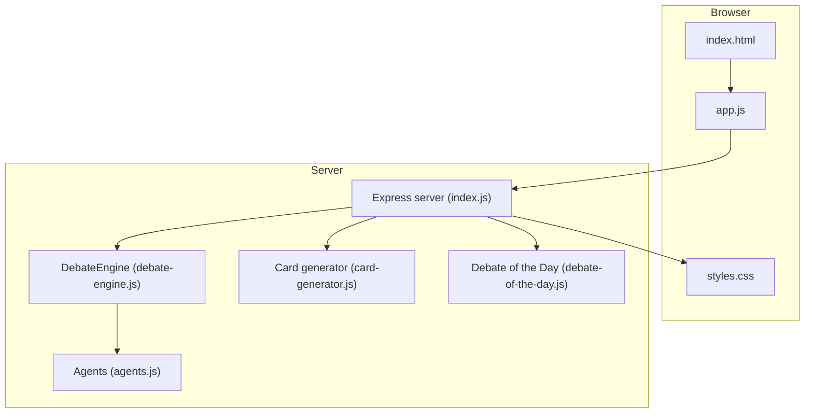
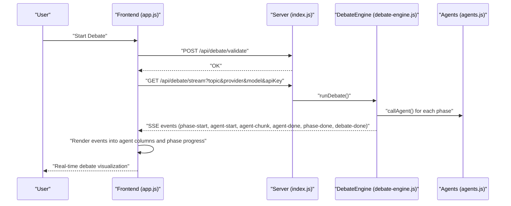
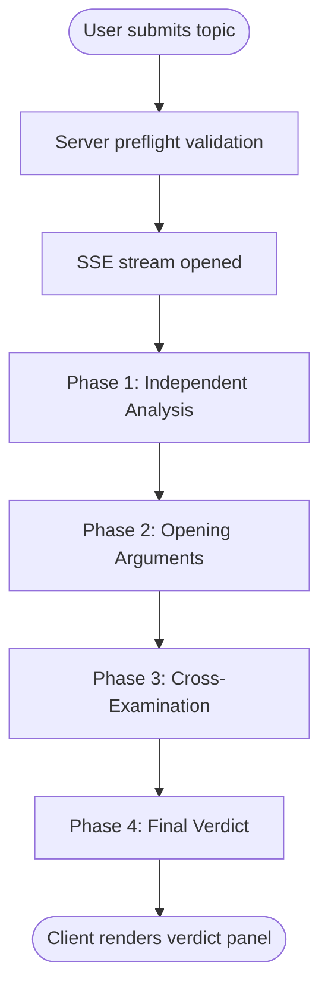
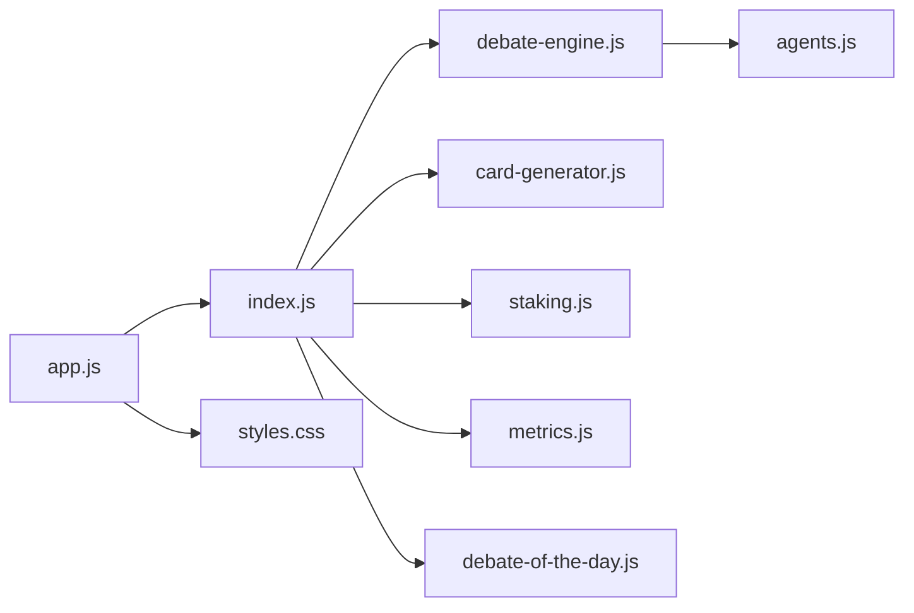
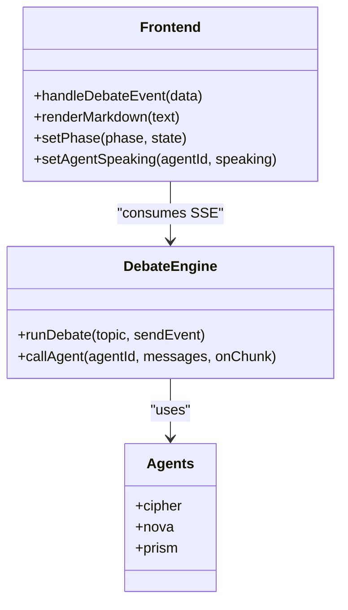

# Debate Interface

<cite>
**Referenced Files in This Document**
- [index.html](file://dissensus-engine/public/index.html)
- [app.js](file://dissensus-engine/public/js/app.js)
- [styles.css](file://dissensus-engine/public/css/styles.css)
- [agents.js](file://dissensus-engine/server/agents.js)
- [debate-engine.js](file://dissensus-engine/server/debate-engine.js)
- [index.js](file://dissensus-engine/server/index.js)
- [card-generator.js](file://dissensus-engine/server/card-generator.js)
- [debate-of-the-day.js](file://dissensus-engine/server/debate-of-the-day.js)
- [README.md](file://dissensus-engine/README.md)
</cite>

## Table of Contents
1. [Introduction](#introduction)
2. [Project Structure](#project-structure)
3. [Core Components](#core-components)
4. [Architecture Overview](#architecture-overview)
5. [Detailed Component Analysis](#detailed-component-analysis)
6. [Dependency Analysis](#dependency-analysis)
7. [Performance Considerations](#performance-considerations)
8. [Troubleshooting Guide](#troubleshooting-guide)
9. [Conclusion](#conclusion)
10. [Appendices](#appendices)

## Introduction
This document explains the real-time debate visualization system that renders three AI agents (CIPHER, NOVA, PRISM) in a structured adversarial dialogue. The interface displays a four-phase debate process with real-time streaming, agent-specific styling and avatars, interactive controls, and a final verdict panel with copy and share capabilities. It also covers the topic input system, provider/model selection, and customization points for agents, phases, and visuals.

## Project Structure
The debate interface is implemented as a frontend application served by an Express server. The frontend handles UI updates, SSE streaming, and user interactions. The backend orchestrates the debate phases, streams events to the client, and supports optional server-side API keys and staking limits.

**Diagram sources**
- [index.html](file://dissensus-engine/public/index.html)
- [app.js](file://dissensus-engine/public/js/app.js)
- [styles.css](file://dissensus-engine/public/css/styles.css)
- [index.js](file://dissensus-engine/server/index.js)
- [debate-engine.js](file://dissensus-engine/server/debate-engine.js)
- [agents.js](file://dissensus-engine/server/agents.js)
- [card-generator.js](file://dissensus-engine/server/card-generator.js)
- [debate-of-the-day.js](file://dissensus-engine/server/debate-of-the-day.js)

**Section sources**
- [README.md](file://dissensus-engine/README.md)
- [index.html](file://dissensus-engine/public/index.html)
- [app.js](file://dissensus-engine/public/js/app.js)
- [styles.css](file://dissensus-engine/public/css/styles.css)
- [index.js](file://dissensus-engine/server/index.js)

## Core Components
- Setup panel: API key/provider/model selection, topic input with suggestions, and “Start Debate” action.
- Phase progress indicator: Four-phase visual steps with active/done states.
- Debate arena: Three agent columns (CIPHER, NOVA, PRISM) with headers, avatars, status indicators, and content areas.
- Verdict panel: Final synthesis with copy and share card actions.

Key behaviors:
- Real-time streaming via Server-Sent Events (SSE) from the server to the client.
- Per-agent content blocks per phase, with markdown-like rendering and a typing cursor effect.
- Agent-specific styling (colors, borders, avatar glow) and status (“Waiting”, “Speaking”, “Done”).
- Verdict panel appears after phase 4 completes, with copy-to-clipboard and shareable card generation.

**Section sources**
- [index.html](file://dissensus-engine/public/index.html)
- [app.js](file://dissensus-engine/public/js/app.js)
- [styles.css](file://dissensus-engine/public/css/styles.css)

## Architecture Overview
The frontend connects to the server’s SSE endpoint and updates the UI in real time. The server runs the DebateEngine, which coordinates the four phases and emits structured events. The client renders each event into the appropriate agent column and updates the phase progress.

**Diagram sources**
- [app.js](file://dissensus-engine/public/js/app.js)
- [index.js](file://dissensus-engine/server/index.js)
- [debate-engine.js](file://dissensus-engine/server/debate-engine.js)
- [agents.js](file://dissensus-engine/server/agents.js)

## Detailed Component Analysis

### Frontend Debate Controller (app.js)
Responsibilities:
- Manages SSE connection and parses events.
- Updates phase progress and agent statuses.
- Renders markdown-like content with safe escaping.
- Handles topic suggestions, provider/model switching, and server key hints.
- Provides copy and share card actions.

Key UI update functions:
- setPhase(phase, state): toggles active/done classes on phase steps.
- setAgentSpeaking(agentId, speaking): toggles “Speaking” state and typing indicator.
- getPhaseBlock(agentId, phase): creates or reuses a phase block container.
- handleDebateEvent(data): dispatches to phase/agent/content handlers.
- renderMarkdown(text): escapes HTML and converts simple markdown to HTML.

Streaming and lifecycle:
- startDebate(): validates inputs, saves preferences, resets UI, connects to SSE, and manages timeouts.
- debateComplete()/debateError(): finalizes UI and status after completion or error.

**Section sources**
- [app.js](file://dissensus-engine/public/js/app.js)

### Debate Arena Layout and Styling
- Arena grid: three equal-width agent columns.
- Agent header: avatar, name, role, and status indicator.
- Status indicator: “Waiting”, “Speaking” with animated dots, “Done”.
- Content area: scrollable, with phase blocks and rendered markdown.
- Verdict panel: appears after phase 4, with copy and share buttons.

Styling highlights:
- Agent-specific borders and glow when speaking.
- Phase step active/done states with colored accents.
- Typing indicator animation for active speakers.
- Scrollbar styling and phase block separators.

**Section sources**
- [index.html](file://dissensus-engine/public/index.html)
- [styles.css](file://dissensus-engine/public/css/styles.css)

### Provider/Model Selection and Topic Input
- Provider options: DeepSeek, Gemini, OpenAI.
- Model options: provider-dependent (e.g., DeepSeek V3.2, Gemini variants, OpenAI GPT-4o series).
- API key handling: optional server-side keys; client can override with personal keys.
- Topic input: with character limit and suggestions (e.g., Bitcoin, AI regulation, ETH vs SOL).
- “Debate of the Day” integration: loads a trending topic and allows quick start.

**Section sources**
- [app.js](file://dissensus-engine/public/js/app.js)
- [index.html](file://dissensus-engine/public/index.html)
- [debate-of-the-day.js](file://dissensus-engine/server/debate-of-the-day.js)

### Backend Debate Orchestration (debate-engine.js)
- Providers: OpenAI, DeepSeek, Google Gemini.
- Four-phase process:
  - Phase 1: Independent Analysis (parallel).
  - Phase 2: Opening Arguments (each agent).
  - Phase 3: Cross-Examination (CIPHER vs NOVA; PRISM challenges both).
  - Phase 4: Final Verdict (PRISM synthesizes with ranked conclusions).
- Streaming: emits structured events for each phase and agent chunk.

**Section sources**
- [debate-engine.js](file://dissensus-engine/server/debate-engine.js)
- [agents.js](file://dissensus-engine/server/agents.js)

### Server Entry Point and SSE Streaming (index.js)
- Validates inputs and keys, enforces optional staking limits.
- Streams debate events via SSE to the client.
- Exposes endpoints for config, providers, metrics, card generation, and debate-of-the-day.

**Section sources**
- [index.js](file://dissensus-engine/server/index.js)

### Verdict Panel and Share Card
- Copy verdict: copies the rendered verdict text to clipboard.
- Share card: posts the topic and verdict to the server, which generates a PNG card optimized for social sharing.
- Card generation extracts a concise summary/list from the verdict when needed.

**Section sources**
- [app.js](file://dissensus-engine/public/js/app.js)
- [card-generator.js](file://dissensus-engine/server/card-generator.js)

### Conceptual Overview
The system implements a structured dialectical process where three agents with distinct roles engage in adversarial reasoning, culminating in a definitive synthesis. The frontend renders this process in real time, providing immediate feedback and a sharable outcome.

[No sources needed since this diagram shows conceptual workflow, not actual code structure]

## Dependency Analysis
- Frontend depends on:
  - Server endpoints for SSE, validation, providers, card generation, and debate-of-the-day.
  - CSS for theming and responsive layout.
- Backend depends on:
  - DebateEngine for orchestration.
  - Agents module for prompts and identities.
  - Card generator for shareable PNG creation.
  - Staking module for optional daily limits.
  - Metrics module for analytics.

**Diagram sources**
- [app.js](file://dissensus-engine/public/js/app.js)
- [index.js](file://dissensus-engine/server/index.js)
- [debate-engine.js](file://dissensus-engine/server/debate-engine.js)
- [agents.js](file://dissensus-engine/server/agents.js)
- [card-generator.js](file://dissensus-engine/server/card-generator.js)
- [debate-of-the-day.js](file://dissensus-engine/server/debate-of-the-day.js)

**Section sources**
- [app.js](file://dissensus-engine/public/js/app.js)
- [index.js](file://dissensus-engine/server/index.js)

## Performance Considerations
- SSE streaming minimizes latency for real-time updates.
- Client-side markdown rendering is lightweight and avoids heavy DOM manipulation by appending incremental chunks.
- Debates are capped at five minutes to prevent long-running connections.
- Server-side rate limiting protects resources.
- Card generation uses server-side summarization when keys are available to keep shareable content concise.

[No sources needed since this section provides general guidance]

## Troubleshooting Guide
Common issues and resolutions:
- API key errors: Ensure a valid key is provided or configure server-side keys. The UI distinguishes between server-key mode and required keys.
- Validation failures: Verify topic length and provider/model correctness before starting.
- SSE connection failures: Check network connectivity and provider rate limits; retry after a short delay.
- Verdict copy/share failures: Confirm the verdict content is present and the server is reachable.

**Section sources**
- [app.js](file://dissensus-engine/public/js/app.js)
- [index.js](file://dissensus-engine/server/index.js)

## Conclusion
The debate interface delivers a compelling, real-time visualization of adversarial AI reasoning. Its modular architecture separates concerns between frontend rendering and backend orchestration, enabling easy customization of agents, phases, and presentation. The system balances performance, security, and user experience to support engaging, shareable debates.

[No sources needed since this section summarizes without analyzing specific files]

## Appendices

### Customizing Agent Appearances
- Modify agent colors, roles, and portraits in the agents module.
- Update CSS variables and agent-specific classes to reflect new themes.
- Adjust avatar styling and status indicators in the stylesheet.

**Section sources**
- [agents.js](file://dissensus-engine/server/agents.js)
- [styles.css](file://dissensus-engine/public/css/styles.css)

### Modifying Phase Indicators
- Update phase labels and titles in the frontend.
- Extend the backend phases in the debate engine and ensure corresponding events are emitted.

**Section sources**
- [app.js](file://dissensus-engine/public/js/app.js)
- [debate-engine.js](file://dissensus-engine/server/debate-engine.js)

### Extending with New Agents or Phases
- Add a new agent definition with a unique id, name, role, color, portrait, and system prompt.
- Update the frontend to render the new agent column and status.
- Extend the backend debate engine to coordinate the new agent across phases and emit events.

**Diagram sources**
- [agents.js](file://dissensus-engine/server/agents.js)
- [debate-engine.js](file://dissensus-engine/server/debate-engine.js)
- [app.js](file://dissensus-engine/public/js/app.js)