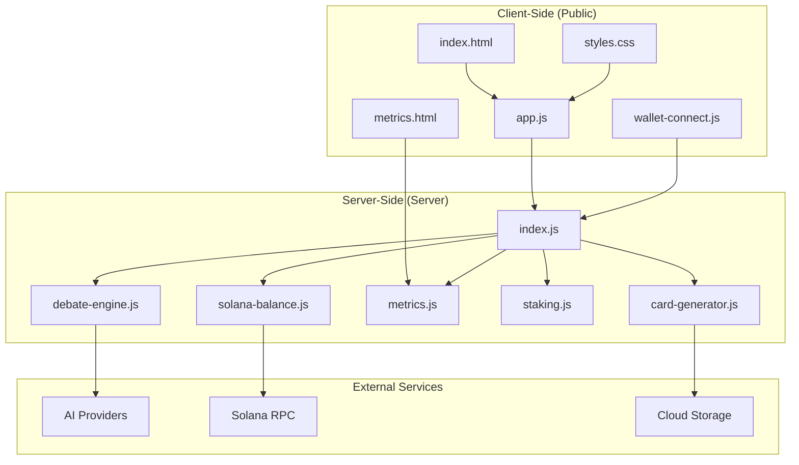
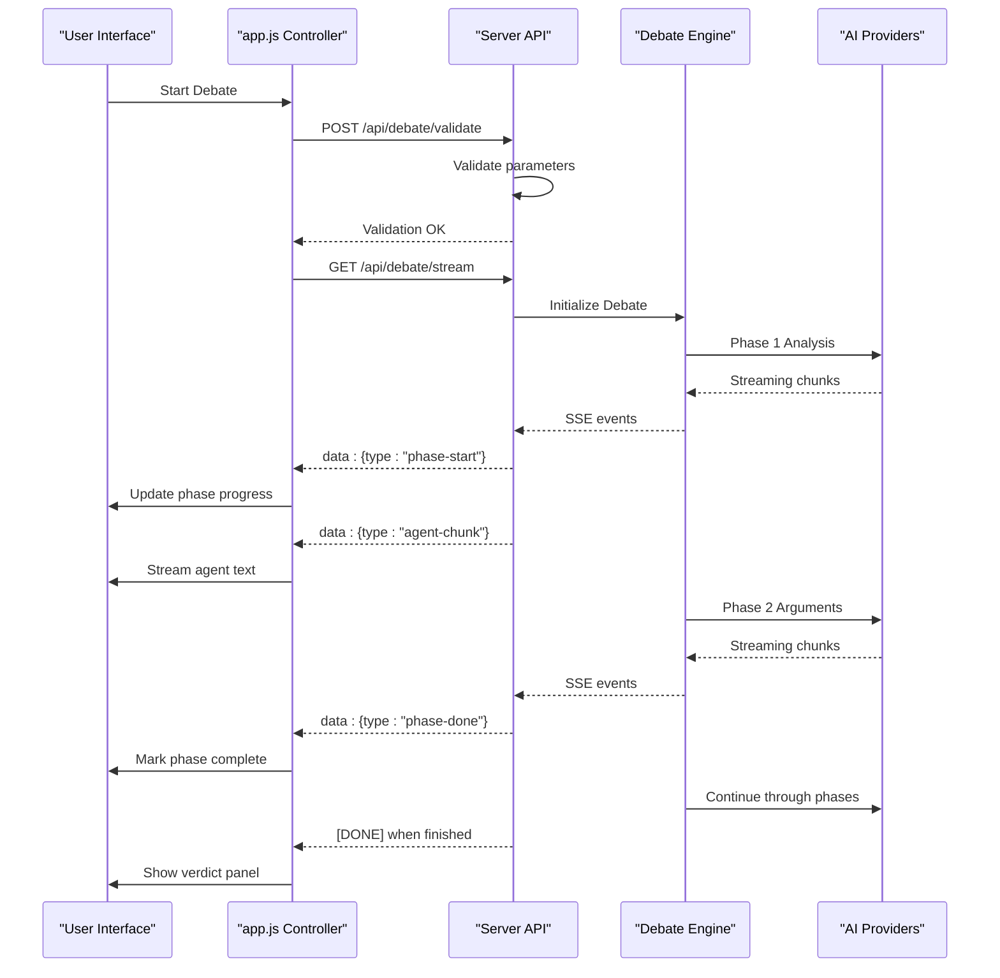
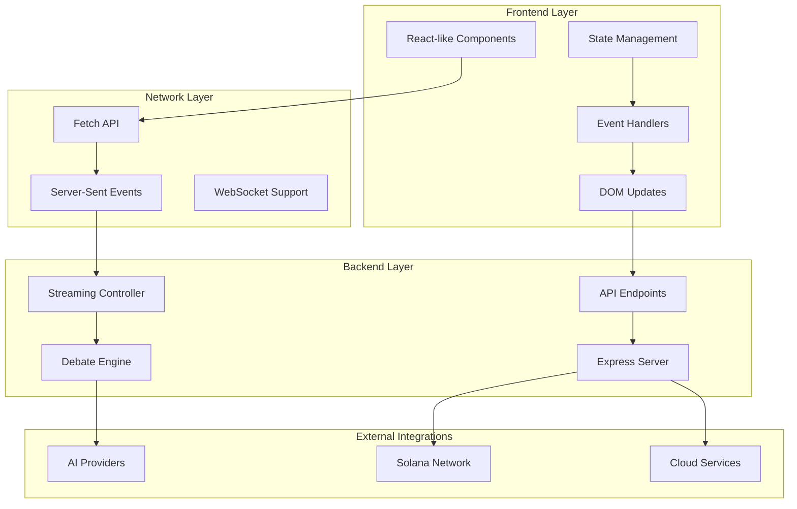
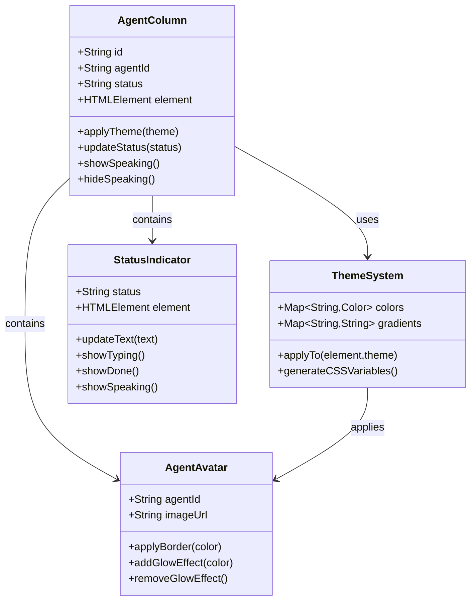
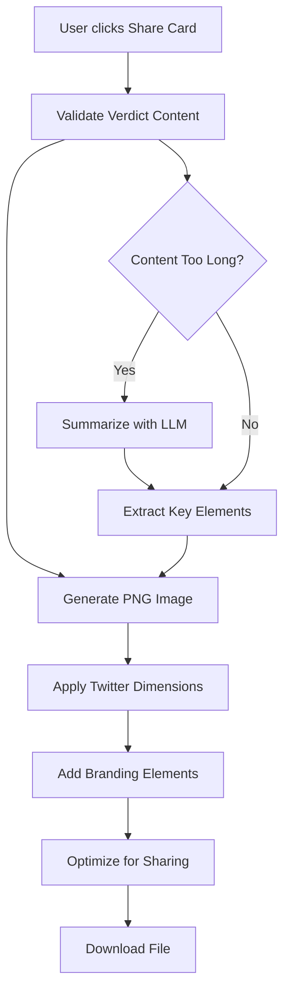

# Frontend Application

<cite>
**Referenced Files in This Document**
- [index.html](file://dissensus-engine/public/index.html)
- [styles.css](file://dissensus-engine/public/css/styles.css)
- [app.js](file://dissensus-engine/public/js/app.js)
- [wallet-connect.js](file://dissensus-engine/public/js/wallet-connect.js)
- [index.js](file://dissensus-engine/server/index.js)
- [card-generator.js](file://dissensus-engine/server/card-generator.js)
- [metrics.js](file://dissensus-engine/server/metrics.js)
- [metrics.html](file://dissensus-engine/public/metrics.html)
- [debate-engine.js](file://dissensus-engine/server/debate-engine.js)
- [staking.js](file://dissensus-engine/server/staking.js)
- [solana-balance.js](file://dissensus-engine/server/solana-balance.js)
- [package.json](file://dissensus-engine/package.json)
- [README.md](file://dissensus-engine/README.md)
</cite>

## Table of Contents
1. [Introduction](#introduction)
2. [Project Structure](#project-structure)
3. [Core Components](#core-components)
4. [Architecture Overview](#architecture-overview)
5. [Detailed Component Analysis](#detailed-component-analysis)
6. [Dependency Analysis](#dependency-analysis)
7. [Performance Considerations](#performance-considerations)
8. [Troubleshooting Guide](#troubleshooting-guide)
9. [Conclusion](#conclusion)
10. [Appendices](#appendices)

## Introduction

The Dissensus AI Debate Engine is a sophisticated frontend application that presents a real-time, multi-agent AI debate interface. The system features three AI agents (CIPHER, NOVA, and PRISM) engaging in a structured 4-phase dialectical process, with real-time streaming visualization, wallet integration, and comprehensive metrics dashboard. The frontend implements a cyberpunk-themed design with responsive layouts, agent-specific styling, and interactive elements for social media sharing.

## Project Structure

The frontend application follows a modular architecture with clear separation between client-side and server-side concerns:



**Diagram sources**
- [index.html:1-217](file://dissensus-engine/public/index.html#L1-L217)
- [styles.css:1-998](file://dissensus-engine/public/css/styles.css#L1-L998)
- [app.js:1-674](file://dissensus-engine/public/js/app.js#L1-L674)
- [index.js:1-481](file://dissensus-engine/server/index.js#L1-L481)

**Section sources**
- [package.json:1-28](file://dissensus-engine/package.json#L1-L28)
- [README.md:110-134](file://dissensus-engine/README.md#L110-L134)

## Core Components

### Debate Interface Design

The main debate interface consists of several interconnected components that work together to provide a seamless user experience:

**Setup Panel**: Contains API key configuration, provider selection, model selection, and topic input with suggestion chips. The panel supports multiple AI providers (DeepSeek, Gemini, OpenAI) with dynamic model switching and API key management.

**Phase Progress Indicator**: A 4-step progress bar that visually tracks the debate phases (Analysis, Arguments, Cross-Examination, Verdict) with active and completed states.

**Agent Arena**: Three-column layout displaying each agent's content with individual status indicators, avatar styling, and real-time text streaming.

**Verdict Panel**: Final synthesis display with copy-to-clipboard functionality and social sharing capabilities.

**Section sources**
- [index.html:46-210](file://dissensus-engine/public/index.html#L46-L210)
- [styles.css:184-800](file://dissensus-engine/public/css/styles.css#L184-L800)

### Real-Time Visualization System

The frontend implements sophisticated real-time visualization through Server-Sent Events (SSE) streaming:



**Diagram sources**
- [app.js:208-427](file://dissensus-engine/public/js/app.js#L208-L427)
- [index.js:220-311](file://dissensus-engine/server/index.js#L220-L311)

**Section sources**
- [app.js:358-427](file://dissensus-engine/public/js/app.js#L358-L427)
- [index.js:277-302](file://dissensus-engine/server/index.js#L277-L302)

### Wallet Connection Integration

The wallet integration system provides seamless Solana wallet connectivity with Phantom and Solflare browsers:

```mermaid
flowchart TD
A[User clicks Connect Wallet] --> B{Wallet Available?}
B --> |Yes| C[Detect Phantom/Solflare]
B --> |No| D[Open Phantom Link]
C --> E[Call provider.connect()]
E --> F[Get public key]
F --> G[Update UI State]
G --> H[Fetch $DISS Balance]
H --> I[Sync to Staking Input]
I --> J[Enable Features]
D --> K[User installs wallet]
K --> L[Refresh Page]
L --> C
```

**Diagram sources**
- [wallet-connect.js:95-130](file://dissensus-engine/public/js/wallet-connect.js#L95-L130)
- [wallet-connect.js:140-174](file://dissensus-engine/public/js/wallet-connect.js#L140-L174)

**Section sources**
- [wallet-connect.js:1-176](file://dissensus-engine/public/js/wallet-connect.js#L1-L176)
- [solana-balance.js:26-76](file://dissensus-engine/server/solana-balance.js#L26-L76)

### Responsive Design Implementation

The application implements a comprehensive responsive design system using CSS Grid and Flexbox:

**Desktop Layout**: Three-column agent arena with sidebar controls and full-width verdict panel
**Tablet Layout**: Adaptive grid that reflows based on screen width
**Mobile Layout**: Single-column design with stacked elements and optimized touch targets

**Section sources**
- [styles.css:244-248](file://dissensus-engine/public/css/styles.css#L244-L248)
- [styles.css:614-629](file://dissensus-engine/public/css/styles.css#L614-L629)

## Architecture Overview

The frontend architecture follows a client-server model with real-time streaming capabilities:



**Diagram sources**
- [app.js:1-674](file://dissensus-engine/public/js/app.js#L1-L674)
- [index.js:1-481](file://dissensus-engine/server/index.js#L1-L481)

**Section sources**
- [app.js:8-14](file://dissensus-engine/public/js/app.js#L8-L14)
- [index.js:26-55](file://dissensus-engine/server/index.js#L26-L55)

## Detailed Component Analysis

### Agent-Specific Styling System

The application implements a sophisticated agent styling system that provides visual differentiation through color coding and thematic elements:



**Diagram sources**
- [styles.css:631-646](file://dissensus-engine/public/css/styles.css#L631-L646)
- [styles.css:656-671](file://dissensus-engine/public/css/styles.css#L656-L671)
- [styles.css:692-706](file://dissensus-engine/public/css/styles.css#L692-L706)

The styling system uses CSS custom properties for theme flexibility:

**Primary Color Scheme**:
- CIPHER (Red): `--red` (#ff3b3b) for bear arguments and risk assessment
- NOVA (Green): `--green` (#00ff88) for bullish optimism and opportunities  
- PRISM (Cyan): `--cyan` (#00d4ff) for neutral synthesis and analysis

**Section sources**
- [styles.css:6-27](file://dissensus-engine/public/css/styles.css#L6-L27)
- [styles.css:639-645](file://dissensus-engine/public/css/styles.css#L639-L645)

### Theme Customization Options

The application provides extensive theming capabilities through CSS custom properties:

**Typography System**:
- Main font: Inter (variable weights 400-900)
- Monospace font: JetBrains Mono for technical content
- Font sizing scales from 0.7rem to 1.5rem with consistent spacing

**Visual Effects**:
- Background grid pattern with subtle purple tint
- Glass-morphism header with backdrop blur
- Animated status indicators with pulse effects
- Gradient accents for interactive elements

**Section sources**
- [styles.css:25-27](file://dissensus-engine/public/css/styles.css#L25-L27)
- [styles.css:41-51](file://dissensus-engine/public/css/styles.css#L41-L51)
- [styles.css:170-173](file://dissensus-engine/public/css/styles.css#L170-L173)

### User Interaction Patterns

The frontend implements several sophisticated interaction patterns:

**Real-Time Text Streaming**: Each agent's content is streamed in real-time with progressive disclosure, allowing users to follow the debate evolution as it happens.

**Progressive Disclosure**: The interface reveals information progressively through the 4-phase debate process, maintaining user engagement throughout the experience.

**Interactive Controls**: Users can copy verdicts, download shareable cards, and adjust settings through intuitive form controls.

**Section sources**
- [app.js:388-400](file://dissensus-engine/public/js/app.js#L388-L400)
- [app.js:597-604](file://dissensus-engine/public/js/app.js#L597-L604)

### Card Generator Functionality

The card generator creates shareable debate summaries optimized for social media platforms:



**Diagram sources**
- [app.js:606-639](file://dissensus-engine/public/js/app.js#L606-L639)
- [card-generator.js:170-358](file://dissensus-engine/server/card-generator.js#L170-L358)

**Section sources**
- [card-generator.js:41-85](file://dissensus-engine/server/card-generator.js#L41-L85)
- [card-generator.js:87-152](file://dissensus-engine/server/card-generator.js#L87-L152)

### Metrics Dashboard Presentation

The metrics dashboard provides comprehensive transparency reporting:

**Live Data Updates**: Automatic refresh every 30 seconds with real-time debate statistics.

**Provider Distribution**: Visual bar charts showing usage patterns across different AI providers.

**Staking Analytics**: Tier distribution and debate limits for simulated staking system.

**Section sources**
- [metrics.html:387-486](file://dissensus-engine/public/metrics.html#L387-L486)
- [metrics.js:100-132](file://dissensus-engine/server/metrics.js#L100-L132)

### Mobile-Responsive Layout

The application implements a comprehensive mobile-first responsive design:

**Breakpoint Strategy**:
- Desktop: 1200px+ with three-column agent layout
- Tablet: 768px-1199px with adaptive grid
- Mobile: 0-767px with single-column optimized layout

**Touch Optimization**: 
- Minimum 44px touch targets for all interactive elements
- Appropriate spacing for thumb-friendly interaction
- Landscape/portrait orientation support

**Section sources**
- [styles.css:244-248](file://dissensus-engine/public/css/styles.css#L244-L248)
- [metrics.html:66-70](file://dissensus-engine/public/metrics.html#L66-L70)

## Dependency Analysis

The frontend application has well-defined dependencies and relationships:

```mermaid
graph LR
subgraph "Core Dependencies"
A[Express Server]
B[Server-Sent Events]
C[AI Provider APIs]
end
subgraph "Frontend Dependencies"
D[Fetch API]
E[EventSource]
F[Local Storage]
end
subgraph "External Dependencies"
G[Solana Web3.js]
H[@resvg/resvg-js]
I[Satori]
end
A --> D
B --> E
C --> D
F --> D
G --> D
H --> I
```

**Diagram sources**
- [package.json:10-19](file://dissensus-engine/package.json#L10-L19)
- [app.js:1-6](file://dissensus-engine/public/js/app.js#L1-L6)

**Section sources**
- [package.json:1-28](file://dissensus-engine/package.json#L1-L28)
- [app.js:22-54](file://dissensus-engine/public/js/app.js#L22-L54)

### Integration Points

**API Integration**: The frontend integrates with multiple backend endpoints for debate orchestration, wallet verification, and metrics reporting.

**Streaming Integration**: Real-time communication through Server-Sent Events provides immediate feedback during debate execution.

**External Service Integration**: Solana blockchain integration for wallet verification and token balance checking.

**Section sources**
- [index.js:69-85](file://dissensus-engine/server/index.js#L69-L85)
- [index.js:220-311](file://dissensus-engine/server/index.js#L220-L311)
- [solana-balance.js:26-76](file://dissensus-engine/server/solana-balance.js#L26-L76)

## Performance Considerations

### Real-Time Streaming Optimization

The application implements several performance optimizations for real-time streaming:

**Efficient DOM Updates**: Minimal DOM manipulation through batched updates and virtual scrolling for long content.

**Memory Management**: Proper cleanup of event listeners and streaming connections to prevent memory leaks.

**Network Optimization**: Efficient SSE handling with automatic retry mechanisms and connection pooling.

### Rendering Performance

**CSS Hardware Acceleration**: Strategic use of transforms and opacity changes that leverage GPU acceleration.

**Lazy Loading**: Images and components loaded on-demand to reduce initial page load time.

**Critical Path Optimization**: Essential CSS and JavaScript prioritized for fastest possible rendering.

### Browser Compatibility

**Modern Browser Support**: Targets Chrome 80+, Firefox 74+, Safari 13+, Edge 80+ with graceful degradation for older browsers.

**Feature Detection**: Runtime detection of SSE support and fallback mechanisms for unsupported environments.

**Polyfill Strategy**: Minimal polyfills for essential features like Promise and fetch.

## Troubleshooting Guide

### Common Issues and Solutions

**Debate Streaming Failures**:
- Verify API key configuration in provider settings
- Check network connectivity and firewall restrictions
- Monitor rate limit quotas for AI providers

**Wallet Connection Problems**:
- Ensure Phantom or Solflare extension is installed and enabled
- Verify wallet is unlocked and connected
- Check Solana network connectivity

**Performance Issues**:
- Clear browser cache and cookies
- Disable ad blockers that may interfere with streaming
- Close unnecessary browser tabs to free memory

**Section sources**
- [app.js:340-347](file://dissensus-engine/public/js/app.js#L340-L347)
- [wallet-connect.js:95-116](file://dissensus-engine/public/js/wallet-connect.js#L95-L116)

### Debugging Tools

**Browser Developer Tools**: Network tab for monitoring SSE connections, Console for error messages, Performance tab for bottleneck identification.

**Server Logs**: Backend logging provides insights into debate execution, error handling, and resource utilization.

**Metrics Dashboard**: Live monitoring of system health, user engagement, and performance metrics.

## Conclusion

The Dissensus AI Debate Engine frontend represents a sophisticated implementation of real-time AI interaction with comprehensive theming, responsive design, and robust integration capabilities. The system successfully combines modern web technologies with advanced streaming protocols to deliver an engaging user experience while maintaining excellent performance and accessibility standards.

The modular architecture allows for easy extension and customization, while the comprehensive theming system provides flexibility for different visual presentations. The integration with external services demonstrates best practices for secure API communication and real-time data synchronization.

## Appendices

### Customization Examples

**Adding New Visual Elements**:
1. Define CSS variables in the root section
2. Create new component classes in styles.css
3. Update JavaScript to handle new DOM elements
4. Test responsiveness across device sizes

**Extending the Interface**:
1. Add new API endpoints in server/index.js
2. Create corresponding frontend handlers in app.js
3. Update HTML templates with new elements
4. Implement proper error handling and loading states

**Browser Compatibility Testing**:
- Chrome Canary for latest features
- Firefox Nightly for experimental support
- Safari Technology Preview for WebKit features
- Automated testing with BrowserStack or Sauce Labs

### Accessibility Considerations

**Keyboard Navigation**: Full keyboard support for all interactive elements with proper focus management.

**Screen Reader Support**: ARIA labels and roles for dynamic content updates.

**Color Contrast**: WCAG-compliant color ratios throughout the interface.

**Alternative Text**: Descriptive alt attributes for all images and icons.

**Section sources**
- [styles.css:1-51](file://dissensus-engine/public/css/styles.css#L1-L51)
- [app.js:103-129](file://dissensus-engine/public/js/app.js#L103-L129)