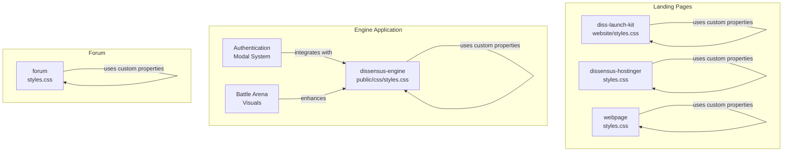
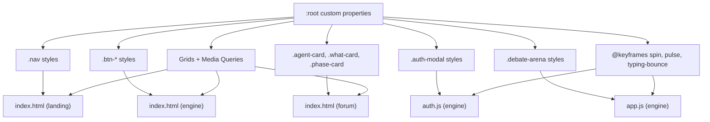
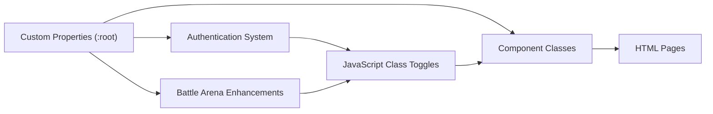

# Theme & Styling System

<cite>
**Referenced Files in This Document**
- [diss-launch-kit website styles.css](file://diss-launch-kit/website/styles.css)
- [dissensus-engine styles.css](file://dissensus-engine/public/css/styles.css)
- [dissensus-hostinger styles.css](file://dissensus-hostinger/styles.css)
- [webpage styles.css](file://webpage/styles.css)
- [forum styles.css](file://forum/styles.css)
- [diss-launch-kit index.html](file://diss-launch-kit/website/index.html)
- [dissensus-engine index.html](file://dissensus-engine/public/index.html)
- [dissensus-hostinger index.html](file://dissensus-hostinger/index.html)
- [webpage index.html](file://webpage/index.html)
- [forum index.html](file://forum/index.html)
- [dissensus-engine app.js](file://dissensus-engine/public/js/app.js)
- [dissensus-engine auth.js](file://dissensus-engine/public/js/auth.js)
- [forum engine.js](file://forum/engine.js)
</cite>

## Update Summary
**Changes Made**
- Added comprehensive documentation for new authentication modal styling system
- Enhanced battle arena visual documentation with conviction meter animations
- Updated responsive design patterns with mobile-first improvements
- Documented new VS indicator system and cross-examination animations
- Added My Debates panel styling and integration patterns

## Table of Contents
1. [Introduction](#introduction)
2. [Project Structure](#project-structure)
3. [Core Components](#core-components)
4. [Architecture Overview](#architecture-overview)
5. [Detailed Component Analysis](#detailed-component-analysis)
6. [Dependency Analysis](#dependency-analysis)
7. [Performance Considerations](#performance-considerations)
8. [Troubleshooting Guide](#troubleshooting-guide)
9. [Conclusion](#conclusion)

## Introduction
This document provides comprehensive documentation for the theme and styling system across the Dissensus project. It explains the CSS architecture built on custom properties for theming, agent-specific color schemes (CIPHER blue, NOVA orange, PRISM purple), responsive design patterns, component styling approaches, animation systems for loading states and transitions, and accessibility features. The system has been enhanced with new authentication modal styling, improved battle arena visuals with conviction meter animations, and responsive design improvements for mobile devices.

## Project Structure
The styling system is distributed across multiple landing pages and the debate engine application, each with its own CSS file and associated HTML. The core theme variables and agent-specific palettes are centralized in each stylesheet, enabling consistent theming across components. Recent enhancements include a dedicated authentication modal system and improved battle arena visual feedback.

**Diagram sources**
- [diss-launch-kit website styles.css:12-33](file://diss-launch-kit/website/styles.css#L12-L33)
- [dissensus-engine styles.css:7-27](file://dissensus-engine/public/css/styles.css#L7-L27)
- [dissensus-engine styles.css:1017-1118](file://dissensus-engine/public/css/styles.css#L1017-L1118)
- [dissensus-engine styles.css:922-970](file://dissensus-engine/public/css/styles.css#L922-L970)

**Section sources**
- [diss-launch-kit website styles.css:1-120](file://diss-launch-kit/website/styles.css#L1-L120)
- [dissensus-engine styles.css:1-60](file://dissensus-engine/public/css/styles.css#L1-L60)
- [dissensus-hostinger styles.css:1-120](file://dissensus-hostinger/styles.css#L1-L120)
- [webpage styles.css:1-120](file://webpage/styles.css#L1-L120)
- [forum styles.css:1-60](file://forum/styles.css#L1-L60)

## Core Components
The theme system centers on CSS custom properties defined in each stylesheet's `:root` block. These variables define:
- Color palette: primary backgrounds, secondary backgrounds, card backgrounds, borders, and accent colors
- Agent-specific colors: CIPHER (red), NOVA (green), PRISM (blue), and consensus accents
- Typography: primary and monospace fonts
- Spacing and radius tokens
- Shadow and transition durations

Recent enhancements include:
- Authentication modal styling with backdrop blur and theme-consistent design
- Battle arena visual feedback with conviction meter animations and VS indicators
- Improved responsive design with mobile-first approach and reduced motion support

These variables are consumed by component classes to maintain visual consistency across sections such as navigation, hero, cards, buttons, and agent columns.

**Section sources**
- [diss-launch-kit website styles.css:12-33](file://diss-launch-kit/website/styles.css#L12-L33)
- [dissensus-engine styles.css:7-27](file://dissensus-engine/public/css/styles.css#L7-L27)
- [dissensus-engine styles.css:1017-1118](file://dissensus-engine/public/css/styles.css#L1017-L1118)
- [dissensus-engine styles.css:922-970](file://dissensus-engine/public/css/styles.css#L922-L970)

## Architecture Overview
The theme architecture follows a modular CSS pattern with:
- Centralized custom properties in `:root`
- Component-specific selectors that consume variables
- Animation keyframes for interactive states
- Responsive grids and media queries for adaptivity
- Accessibility-focused focus styles and contrast considerations
- Authentication modal system with backdrop filtering
- Battle arena visual enhancement system

**Diagram sources**
- [diss-launch-kit website styles.css:12-120](file://diss-launch-kit/website/styles.css#L12-L120)
- [dissensus-engine styles.css:7-120](file://dissensus-engine/public/css/styles.css#L7-L120)
- [dissensus-engine styles.css:1017-1118](file://dissensus-engine/public/css/styles.css#L1017-L1118)
- [dissensus-engine styles.css:922-970](file://dissensus-engine/public/css/styles.css#L922-L970)
- [dissensus-engine app.js:171-193](file://dissensus-engine/public/js/app.js#L171-L193)
- [dissensus-engine auth.js:113-129](file://dissensus-engine/public/js/auth.js#L113-L129)

## Detailed Component Analysis

### Custom Properties and Theming System
The theming system relies on CSS custom properties defined in `:root`. These include:
- Backgrounds: `--bg-primary`, `--bg-secondary`, `--bg-card`, `--bg-card-hover`
- Accents: `--red`, `--green`, `--cyan`, `--purple`, `--white`, `--gray-*`
- Typography: `--font-main`, `--font-mono`
- Agent-specific tokens: `--cipher-*`, `--nova-*`, `--prism-*`, `--consensus-*`
- UI tokens: `--radius-*`, `--shadow-*`, `--transition-*`

These variables are referenced throughout component classes to ensure consistent theming across all pages and components.

**Section sources**
- [diss-launch-kit website styles.css:12-33](file://diss-launch-kit/website/styles.css#L12-L33)
- [dissensus-engine styles.css:7-27](file://dissensus-engine/public/css/styles.css#L7-L27)
- [dissensus-hostinger styles.css:12-33](file://dissensus-hostinger/styles.css#L12-L33)
- [webpage styles.css:12-33](file://webpage/styles.css#L12-L33)
- [forum styles.css:5-50](file://forum/styles.css#L5-L50)

### Agent-Specific Color Schemes
Each agent has dedicated color tokens and hover/focus states:
- CIPHER: red palette (`--red`, `--red-glow`)
- NOVA: green palette (`--green`, `--green-glow`)
- PRISM: cyan/blue palette (`--cyan`, `--cyan-glow`)
- Consensus: purple palette (`--consensus-*`)

These are applied to badges, chips, borders, avatars, and content blocks to visually distinguish agent contributions. Recent enhancements include agent-specific conviction meter gradients and avatar glow effects during cross-examination.

**Section sources**
- [diss-launch-kit website styles.css:413-447](file://diss-launch-kit/website/styles.css#L413-L447)
- [dissensus-engine styles.css:506-512](file://dissensus-engine/public/css/styles.css#L506-L512)
- [dissensus-engine styles.css:947-949](file://dissensus-engine/public/css/styles.css#L947-L949)
- [forum styles.css:18-37](file://forum/styles.css#L18-L37)

### Authentication Modal System
A comprehensive authentication modal system has been implemented with the following features:
- Modal overlay with backdrop blur for focus isolation
- Tabbed interface for login/register forms
- Form validation and error handling
- Theme-consistent styling with purple accent colors
- Responsive design that works on mobile devices
- Integration with the existing theme system

The modal includes:
- `.modal-overlay`: Fixed positioning with backdrop blur
- `.auth-modal`: Card-style container with rounded corners
- `.auth-tabs`: Flex container for tab switching
- `.auth-tab`: Individual tab with active state styling
- Form groups with proper spacing and focus states
- Purple accent color for active states and highlights

**Section sources**
- [dissensus-engine styles.css:1017-1118](file://dissensus-engine/public/css/styles.css#L1017-L1118)
- [dissensus-engine auth.js:113-129](file://dissensus-engine/public/js/auth.js#L113-L129)

### Battle Arena Visual Enhancements
The battle arena has been significantly enhanced with visual feedback systems:
- **Conviction Meter**: Animated progress bars that show agent conviction levels
- **VS Indicator**: Pulsing "VS" display during cross-examination phases
- **Clash Effects**: Visual feedback when agents clash during debates
- **Avatar Glow**: Intensified glow effects during challenging phases

Key components include:
- `.conviction-bar`: Container for conviction meters with gradient backgrounds
- `.conviction-fill`: Animated fill that transitions smoothly
- `.vs-indicator`: Centered pulsing indicator with yellow text shadow
- `.agent-column.clashing`: Clash flash animation for dramatic moments
- `.agent-column.challenging`: Enhanced avatar glow effects

**Section sources**
- [dissensus-engine styles.css:932-970](file://dissensus-engine/public/css/styles.css#L932-L970)
- [dissensus-engine styles.css:923-930](file://dissensus-engine/public/css/styles.css#L923-L930)
- [dissensus-engine styles.css:914-921](file://dissensus-engine/public/css/styles.css#L914-L921)

### Navigation and Header Styling
Navigation bars use backdrop filters, gradient borders, and agent-specific accent colors. Links and buttons adopt theme-aware hover states and transitions. Recent improvements include better mobile navigation with slide-in panels and enhanced authentication controls.

**Section sources**
- [diss-launch-kit website styles.css:108-121](file://diss-launch-kit/website/styles.css#L108-L121)
- [dissensus-hostinger styles.css:79-92](file://dissensus-hostinger/styles.css#L79-L92)
- [webpage styles.css:98-115](file://webpage/styles.css#L98-L115)
- [dissensus-engine styles.css:54-67](file://dissensus-engine/public/css/styles.css#L54-L67)

### Buttons and Interactive Elements
Buttons leverage gradient backgrounds and agent-specific color schemes. Hover states include elevation, glow, and shadow effects. Disabled states and active presses are handled consistently. Recent additions include outline buttons for authentication and smaller button variants.

**Section sources**
- [diss-launch-kit website styles.css:202-240](file://diss-launch-kit/website/styles.css#L202-L240)
- [dissensus-engine styles.css:363-390](file://dissensus-engine/public/css/styles.css#L363-L390)
- [dissensus-engine styles.css:1000-1015](file://dissensus-engine/public/css/styles.css#L1000-L1015)
- [forum styles.css:230-261](file://forum/styles.css#L230-L261)

### Hero and Section Styling
Hero sections use animated glows, gradient overlays, and staggered fade-in animations. Sections apply consistent spacing, typography scaling via `clamp()`, and responsive grids. Mobile improvements include better hero layout and adjusted padding for smaller screens.

**Section sources**
- [diss-launch-kit website styles.css:273-352](file://diss-launch-kit/website/styles.css#L273-L352)
- [dissensus-hostinger styles.css:247-292](file://dissensus-hostinger/styles.css#L247-L292)
- [webpage styles.css:247-292](file://webpage/styles.css#L247-L292)

### Agent Cards and Content Areas
Agent cards use agent-specific borders, hover elevations, and avatar glow effects. Content areas include scrollbars, typography, and markdown-like rendering with agent-specific accents. The My Debates panel provides authenticated users with access to their previous debates.

**Section sources**
- [diss-launch-kit website styles.css:598-743](file://diss-launch-kit/website/styles.css#L598-L743)
- [dissensus-engine styles.css:490-642](file://dissensus-engine/public/css/styles.css#L490-L642)
- [dissensus-engine styles.css:1118-1180](file://dissensus-engine/public/css/styles.css#L1118-L1180)
- [forum styles.css:285-544](file://forum/styles.css#L285-L544)

### Progress Indicators and Loading States
Progress bars, phase steps, and loading spinners use theme-aware colors and transitions. Typing indicators employ bounce animations synchronized with agent activity. Conviction meters now feature smooth gradient animations that respond to agent performance.

**Section sources**
- [dissensus-engine styles.css:405-458](file://dissensus-engine/public/css/styles.css#L405-L458)
- [dissensus-engine styles.css:932-970](file://dissensus-engine/public/css/styles.css#L932-L970)
- [forum styles.css:669-700](file://forum/styles.css#L669-L700)

### Responsive Design Patterns
Responsive grids utilize CSS Grid with `auto-fit/minmax` and `repeat()` for adaptive layouts. Media queries adjust font sizes, layout stacking, and component widths for smaller screens. Recent improvements include:
- Enhanced mobile navigation with slide-in panels
- Better hero layout for small screens
- Optimized button layouts for mobile devices
- Reduced motion support for accessibility

**Section sources**
- [diss-launch-kit website styles.css:538-543](file://diss-launch-kit/website/styles.css#L538-L543)
- [dissensus-engine styles.css:491-496](file://dissensus-engine/public/css/styles.css#L491-L496)
- [dissensus-engine styles.css:1114-1160](file://dissensus-engine/public/css/styles.css#L1114-L1160)
- [forum styles.css:726-759](file://forum/styles.css#L726-L759)

### Animation Systems
Animations include:
- Grid movement and gradient mesh overlays
- Pulse and glow effects for badges and buttons
- Typing indicators with bounce animations
- Fade-in and staggered entrance animations
- Smooth scrolling and header background transitions
- Conviction meter transitions and VS indicator pulses
- Clash flash animations for dramatic moments

**Section sources**
- [diss-launch-kit website styles.css:61-105](file://diss-launch-kit/website/styles.css#L61-L105)
- [dissensus-engine styles.css:927-930](file://dissensus-engine/public/css/styles.css#L927-L930)
- [dissensus-engine styles.css:969-972](file://dissensus-engine/public/css/styles.css#L969-L972)
- [dissensus-engine app.js:171-193](file://dissensus-engine/public/js/app.js#L171-L193)
- [forum engine.js:57-61](file://forum/engine.js#L57-L61)

### Accessibility Features
Accessibility is addressed through:
- Focus-visible outlines for interactive elements
- Sufficient color contrast for text and backgrounds
- Semantic HTML and ARIA attributes in navigation
- Reduced motion considerations via CSS custom properties
- Mobile accessibility with touch-friendly navigation
- Screen reader friendly form labels and error messages

**Section sources**
- [diss-launch-kit website styles.css:58-61](file://diss-launch-kit/website/styles.css#L58-L61)
- [dissensus-hostinger index.html:102-104](file://dissensus-hostinger/index.html#L102-L104)
- [webpage index.html:102-104](file://webpage/index.html#L102-L104)

### Browser Compatibility and Performance
- CSS Grid and Flexbox are widely supported; fallbacks are implicit via semantic markup.
- Animations use hardware-accelerated properties (`transform`, `opacity`) and are scoped to avoid heavy repaints.
- Font loading uses preconnect and external CDN resources.
- Backdrop filter is used for modern browsers with graceful degradation.
- Authentication modal uses CSS transforms for smooth animations.

**Section sources**
- [dissensus-engine index.html:23-26](file://dissensus-engine/public/index.html#L23-L26)
- [diss-launch-kit website styles.css:61-76](file://diss-launch-kit/website/styles.css#L61-L76)

## Dependency Analysis
The styling system exhibits low coupling and high cohesion:
- Each stylesheet defines its own `:root` variables and component styles
- Components reference shared variables rather than duplicating values
- JavaScript toggles classes that modify visual states (e.g., agent speaking, progress steps)
- Authentication system integrates seamlessly with existing theme variables
- Battle arena enhancements build upon existing component architecture

**Diagram sources**
- [dissensus-engine app.js:162-193](file://dissensus-engine/public/js/app.js#L162-L193)
- [dissensus-engine auth.js:113-129](file://dissensus-engine/public/js/auth.js#L113-L129)
- [dissensus-engine styles.css:1017-1118](file://dissensus-engine/public/css/styles.css#L1017-L1118)
- [dissensus-engine styles.css:922-970](file://dissensus-engine/public/css/styles.css#L922-L970)

**Section sources**
- [dissensus-engine app.js:162-200](file://dissensus-engine/public/js/app.js#L162-L200)
- [dissensus-engine auth.js:113-129](file://dissensus-engine/public/js/auth.js#L113-L129)

## Performance Considerations
- Prefer `transform` and `opacity` for animations to leverage GPU acceleration
- Use CSS custom properties to minimize repeated color and sizing declarations
- Keep animations scoped and avoid excessive reflows
- Lazy-load images and defer non-critical resources
- Use backdrop-filter judiciously as it can be expensive on older devices
- Optimize SVG graphics for better performance on mobile devices

## Troubleshooting Guide
Common issues and resolutions:
- Missing fonts: Ensure preconnect and external font URLs are reachable
- Animation stutter: Verify hardware acceleration properties are used and avoid animating layout-affecting properties
- Contrast problems: Adjust `--gray-*` values to meet WCAG contrast guidelines
- Responsive layout shifts: Confirm grid templates and media queries are properly scoped
- Authentication modal not appearing: Check that JavaScript functions are properly linked and modal IDs match CSS selectors
- Conviction meter not animating: Verify that JavaScript updates the width property and CSS transitions are properly defined
- Mobile navigation issues: Ensure media query breakpoints match device screen sizes

**Section sources**
- [dissensus-engine index.html:23-26](file://dissensus-engine/public/index.html#L23-L26)
- [diss-launch-kit website styles.css:61-76](file://diss-launch-kit/website/styles.css#L61-L76)

## Conclusion
The Dissensus theme and styling system leverages a robust, modular CSS architecture centered on custom properties and agent-specific color tokens. Recent enhancements include a comprehensive authentication modal system, improved battle arena visual feedback with conviction meters and VS indicators, and responsive design improvements for mobile devices. The system integrates responsive design, rich animations, and accessibility best practices across landing pages and the debate engine. By centralizing theme variables and applying consistent component patterns, the system supports easy customization, maintainability, and scalability while providing an excellent user experience across all devices and interaction modes.