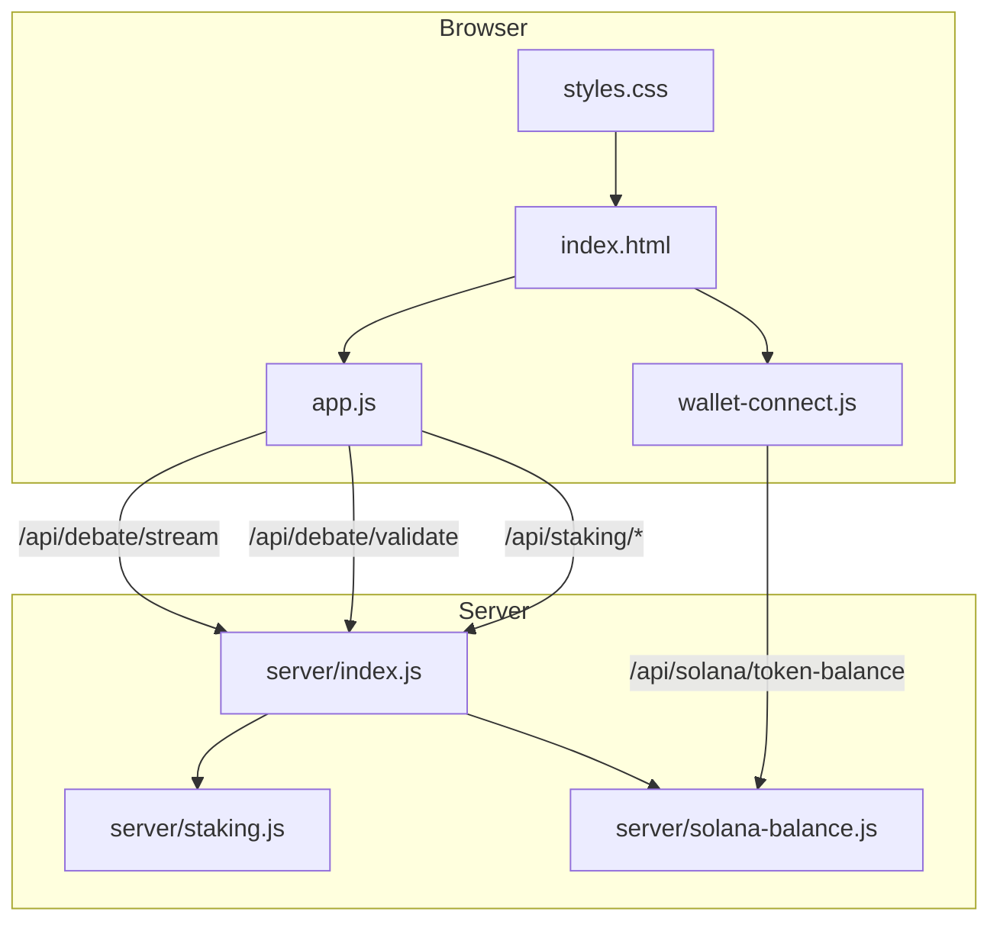
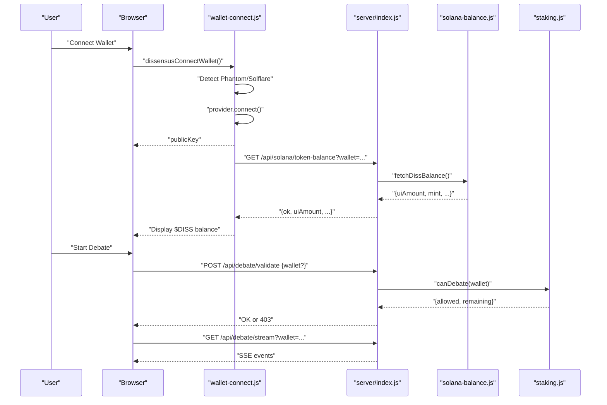
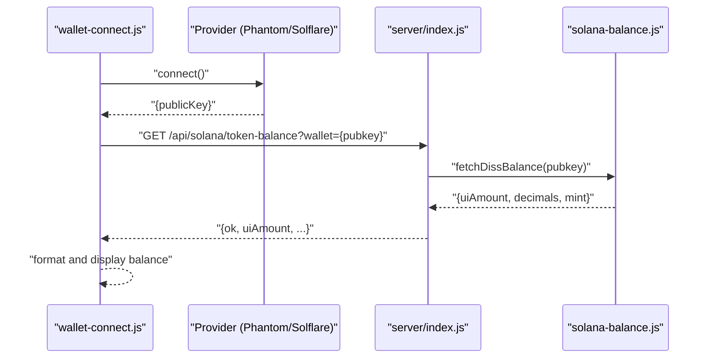
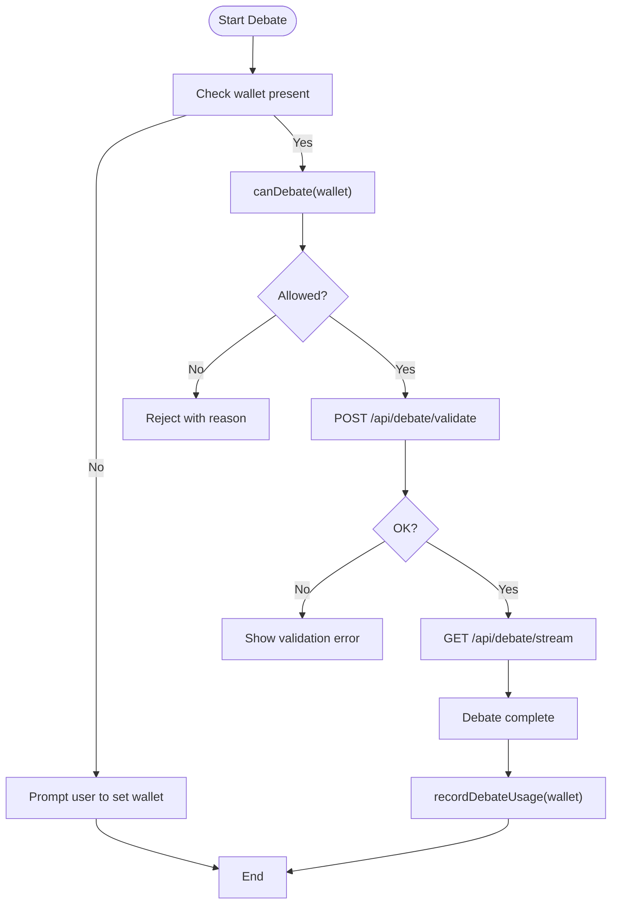
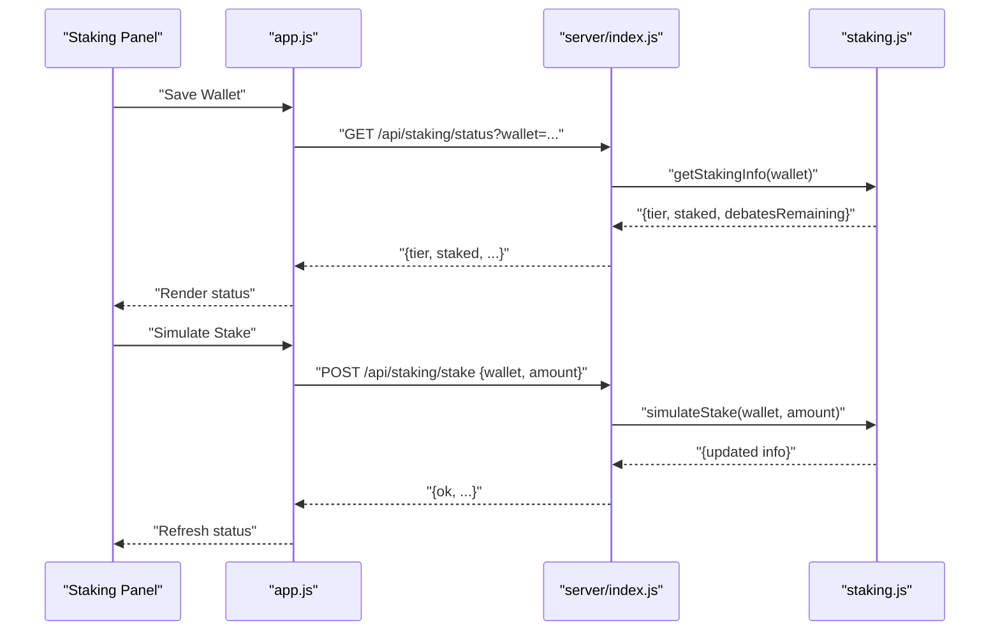
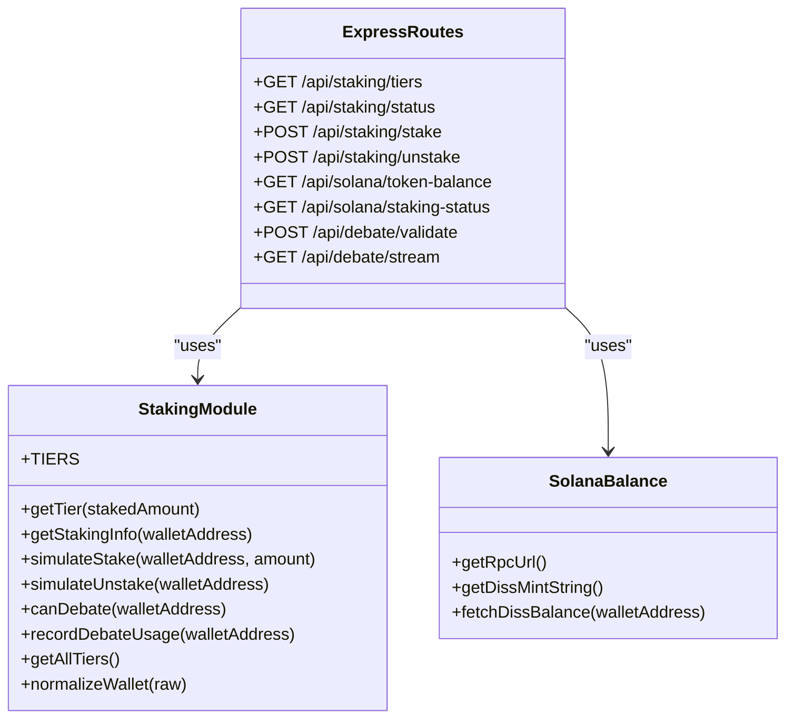
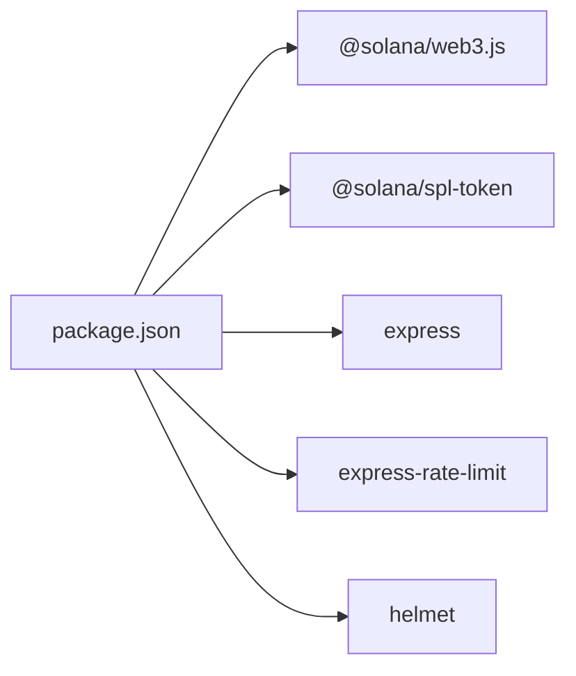

# Wallet Integration

<cite>
**Referenced Files in This Document**
- [wallet-connect.js](file://dissensus-engine/public/js/wallet-connect.js)
- [app.js](file://dissensus-engine/public/js/app.js)
- [index.html](file://dissensus-engine/public/index.html)
- [index.js](file://dissensus-engine/server/index.js)
- [staking.js](file://dissensus-engine/server/staking.js)
- [solana-balance.js](file://dissensus-engine/server/solana-balance.js)
- [styles.css](file://dissensus-engine/public/css/styles.css)
- [README.md](file://dissensus-engine/README.md)
- [package.json](file://dissensus-engine/package.json)
</cite>

## Table of Contents
1. [Introduction](#introduction)
2. [Project Structure](#project-structure)
3. [Core Components](#core-components)
4. [Architecture Overview](#architecture-overview)
5. [Detailed Component Analysis](#detailed-component-analysis)
6. [Dependency Analysis](#dependency-analysis)
7. [Performance Considerations](#performance-considerations)
8. [Troubleshooting Guide](#troubleshooting-guide)
9. [Conclusion](#conclusion)

## Introduction
This document explains the wallet connection and staking integration system for the Dissensus AI platform. It covers:
- Connecting Solana wallets via Phantom and Solflare
- Public key verification against on-chain $DISS balances
- A simulated staking system for demonstration with tier-based access control
- The staking panel UI and status management
- Backend integration with the staking API and wallet status checking
- Security considerations, UX during wallet operations, and fallback mechanisms
- Guidance for extending the system to production on-chain integration

## Project Structure
The wallet and staking system spans client-side JavaScript, server-side APIs, and shared configuration:
- Client-side wallet connector and UI integration
- Frontend debate controller that enforces staking policies
- Server-side staking module and Solana balance checker
- Express routes exposing staking and balance endpoints
- Styling for wallet and staking UI elements

**Diagram sources**
- [wallet-connect.js:1-176](file://dissensus-engine/public/js/wallet-connect.js#L1-L176)
- [app.js:1-674](file://dissensus-engine/public/js/app.js#L1-L674)
- [index.js:1-481](file://dissensus-engine/server/index.js#L1-L481)
- [staking.js:1-183](file://dissensus-engine/server/staking.js#L1-L183)
- [solana-balance.js:1-83](file://dissensus-engine/server/solana-balance.js#L1-L83)
- [index.html:1-187](file://dissensus-engine/public/index.html#L1-L187)
- [styles.css:1-998](file://dissensus-engine/public/css/styles.css#L1-L998)

**Section sources**
- [README.md:103-109](file://dissensus-engine/README.md#L103-L109)
- [package.json:10-19](file://dissensus-engine/package.json#L10-L19)

## Core Components
- Wallet Connector (Phantom/Solflare): Detects providers, connects, reads public key, subscribes to disconnect, and fetches on-chain $DISS balance.
- Staking Module: Simulates tier thresholds, daily debate limits, and usage tracking.
- Backend Routes: Expose staking endpoints, Solana balance endpoint, and debate validation/streaming.
- Frontend Controller: Enforces wallet requirement, displays staking status, and coordinates debate flow.

Key responsibilities:
- Wallet Connector: [wallet-connect.js:17-23](file://dissensus-engine/public/js/wallet-connect.js#L17-L23), [wallet-connect.js:95-116](file://dissensus-engine/public/js/wallet-connect.js#L95-L116)
- Staking Simulation: [staking.js:12-19](file://dissensus-engine/server/staking.js#L12-L19), [staking.js:43-79](file://dissensus-engine/server/staking.js#L43-L79)
- Backend Integration: [index.js:324-355](file://dissensus-engine/server/index.js#L324-L355), [index.js:98-111](file://dissensus-engine/server/index.js#L98-L111)
- Frontend Enforcement: [app.js:228-236](file://dissensus-engine/public/js/app.js#L228-L236), [app.js:492-515](file://dissensus-engine/public/js/app.js#L492-L515)

**Section sources**
- [wallet-connect.js:1-176](file://dissensus-engine/public/js/wallet-connect.js#L1-L176)
- [staking.js:1-183](file://dissensus-engine/server/staking.js#L1-L183)
- [index.js:324-355](file://dissensus-engine/server/index.js#L324-L355)
- [app.js:492-515](file://dissensus-engine/public/js/app.js#L492-L515)

## Architecture Overview
The system integrates wallet providers with a simulated staking layer and on-chain balance verification.

**Diagram sources**
- [wallet-connect.js:95-116](file://dissensus-engine/public/js/wallet-connect.js#L95-L116)
- [index.js:98-111](file://dissensus-engine/server/index.js#L98-L111)
- [solana-balance.js:26-76](file://dissensus-engine/server/solana-balance.js#L26-L76)
- [index.js:177-215](file://dissensus-engine/server/index.js#L177-L215)
- [staking.js:110-125](file://dissensus-engine/server/staking.js#L110-L125)

## Detailed Component Analysis

### Wallet Connection and Public Key Verification
- Provider detection: Supports Phantom and Solflare via global provider objects.
- Auto-connect: Attempts trusted connect on page load.
- Public key synchronization: Updates header UI, balance, and staking input.
- On-chain balance: Calls server endpoint to fetch SPL token balance for $DISS mint.

**Diagram sources**
- [wallet-connect.js:17-23](file://dissensus-engine/public/js/wallet-connect.js#L17-L23)
- [wallet-connect.js:95-116](file://dissensus-engine/public/js/wallet-connect.js#L95-L116)
- [index.js:98-111](file://dissensus-engine/server/index.js#L98-L111)
- [solana-balance.js:26-76](file://dissensus-engine/server/solana-balance.js#L26-L76)

**Section sources**
- [wallet-connect.js:17-23](file://dissensus-engine/public/js/wallet-connect.js#L17-L23)
- [wallet-connect.js:95-116](file://dissensus-engine/public/js/wallet-connect.js#L95-L116)
- [wallet-connect.js:63-80](file://dissensus-engine/public/js/wallet-connect.js#L63-L80)
- [index.js:98-111](file://dissensus-engine/server/index.js#L98-L111)
- [solana-balance.js:26-76](file://dissensus-engine/server/solana-balance.js#L26-L76)

### Simulated Staking System and Tier-Based Access Control
- Tier thresholds define minimum $DISS staked to unlock features and daily debate limits.
- Daily reset logic ensures per-day debate counters are reset at midnight UTC.
- Status queries return tier, staked amount, debates used, and remaining debates.
- Debate gating prevents starting debates when daily limit is reached.

**Diagram sources**
- [app.js:228-236](file://dissensus-engine/public/js/app.js#L228-L236)
- [index.js:177-215](file://dissensus-engine/server/index.js#L177-L215)
- [index.js:220-311](file://dissensus-engine/server/index.js#L220-L311)
- [staking.js:110-125](file://dissensus-engine/server/staking.js#L110-L125)
- [staking.js:25-33](file://dissensus-engine/server/staking.js#L25-L33)

**Section sources**
- [staking.js:12-19](file://dissensus-engine/server/staking.js#L12-L19)
- [staking.js:25-33](file://dissensus-engine/server/staking.js#L25-L33)
- [staking.js:43-79](file://dissensus-engine/server/staking.js#L43-L79)
- [index.js:324-355](file://dissensus-engine/server/index.js#L324-L355)
- [app.js:492-515](file://dissensus-engine/public/js/app.js#L492-L515)

### Staking Panel Functionality
- Wallet input: Stores and validates a Solana address (32–48 characters).
- Stake simulation: Sets or resets simulated stake amount.
- Tier threshold display: Loads and renders tier features and limits.
- Status management: Shows tier badge, staked amount, debates used, and remaining.

**Diagram sources**
- [app.js:481-490](file://dissensus-engine/public/js/app.js#L481-L490)
- [app.js:492-515](file://dissensus-engine/public/js/app.js#L492-L515)
- [app.js:517-537](file://dissensus-engine/public/js/app.js#L517-L537)
- [index.js:324-355](file://dissensus-engine/server/index.js#L324-L355)
- [staking.js:81-96](file://dissensus-engine/server/staking.js#L81-L96)

**Section sources**
- [app.js:481-490](file://dissensus-engine/public/js/app.js#L481-L490)
- [app.js:492-515](file://dissensus-engine/public/js/app.js#L492-L515)
- [app.js:517-537](file://dissensus-engine/public/js/app.js#L517-L537)
- [app.js:556-568](file://dissensus-engine/public/js/app.js#L556-L568)
- [index.js:324-355](file://dissensus-engine/server/index.js#L324-L355)
- [staking.js:81-96](file://dissensus-engine/server/staking.js#L81-L96)

### Backend Integration and Enforcement Mechanisms
- Staking endpoints: Tiers, status, stake, unstake with rate limiting.
- Debate validation: Checks wallet presence and daily limits before streaming.
- Solana balance endpoint: Server-side RPC query to fetch SPL token balance.
- On-chain staking placeholder: Future integration point for stake program.

**Diagram sources**
- [staking.js:171-182](file://dissensus-engine/server/staking.js#L171-L182)
- [solana-balance.js:26-76](file://dissensus-engine/server/solana-balance.js#L26-L76)
- [index.js:324-355](file://dissensus-engine/server/index.js#L324-L355)
- [index.js:98-111](file://dissensus-engine/server/index.js#L98-L111)
- [index.js:177-311](file://dissensus-engine/server/index.js#L177-L311)

**Section sources**
- [index.js:324-355](file://dissensus-engine/server/index.js#L324-L355)
- [index.js:98-111](file://dissensus-engine/server/index.js#L98-L111)
- [index.js:177-311](file://dissensus-engine/server/index.js#L177-L311)
- [solana-balance.js:26-76](file://dissensus-engine/server/solana-balance.js#L26-L76)

### UI Integration and Styling
- Header wallet area shows connect/disconnect actions, short address, and balance.
- Staking panel includes summary, inputs, actions, and tier list.
- Styles support wallet-connected state and staking badges.

**Section sources**
- [index.html:30-41](file://dissensus-engine/public/index.html#L30-L41)
- [styles.css:69-111](file://dissensus-engine/public/css/styles.css#L69-L111)
- [styles.css:363-494](file://dissensus-engine/public/css/styles.css#L363-L494)

## Dependency Analysis
External dependencies relevant to wallet and staking:
- @solana/web3.js and @solana/spl-token for on-chain balance queries
- express, express-rate-limit, helmet for server infrastructure

**Diagram sources**
- [package.json:10-19](file://dissensus-engine/package.json#L10-L19)

**Section sources**
- [package.json:10-19](file://dissensus-engine/package.json#L10-L19)

## Performance Considerations
- Rate limiting: Debates, staking, and balance endpoints use rate limiting to prevent abuse.
- SSE streaming: Debate streaming uses fetch with reader for robustness and controlled timeouts.
- Local caching: Browser stores wallet address locally to avoid repeated inputs.
- Daily reset: Staking module resets daily debate counters to maintain fairness.

[No sources needed since this section provides general guidance]

## Troubleshooting Guide
Common issues and resolutions:
- Wallet provider not detected: Prompt to install Phantom or Solflare; the connector opens the provider link and alerts the user.
- Connection failure: Alert displays error details; verify provider extension and network connectivity.
- Invalid wallet address: Validation enforces 32–48 character length; frontend and backend reject malformed inputs.
- Balance fetch errors: Server returns 400 for invalid wallet and generic 500 for RPC errors; UI shows placeholders and titles with error messages.
- Debate validation failures: Server responds with 400/403 depending on missing API key, invalid model, or daily limit; frontend surfaces user-friendly messages.
- Rate limit exceeded: Servers respond with 429; UI advises waiting or reducing frequency.

**Section sources**
- [wallet-connect.js:97-101](file://dissensus-engine/public/js/wallet-connect.js#L97-L101)
- [wallet-connect.js:113-115](file://dissensus-engine/public/js/wallet-connect.js#L113-L115)
- [app.js:228-236](file://dissensus-engine/public/js/app.js#L228-L236)
- [index.js:104-110](file://dissensus-engine/server/index.js#L104-L110)
- [index.js:184-192](file://dissensus-engine/server/index.js#L184-L192)
- [index.js:316-322](file://dissensus-engine/server/index.js#L316-L322)

## Conclusion
The Dissensus wallet and staking integration provides a robust foundation for identity-driven access control:
- Users connect Phantom or Solflare to verify on-chain $DISS balances.
- A simulated staking system demonstrates tier-based access and daily debate limits.
- The backend enforces wallet presence and limits via debate validation and streaming.
- The system is designed for extensibility toward on-chain staking and includes security and UX best practices.

[No sources needed since this section summarizes without analyzing specific files]