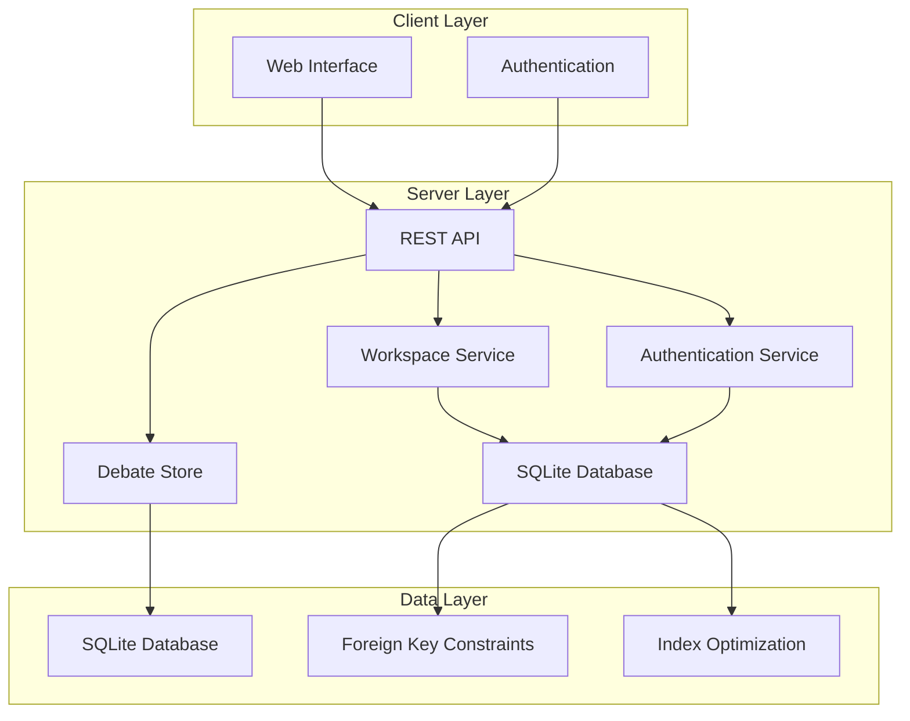
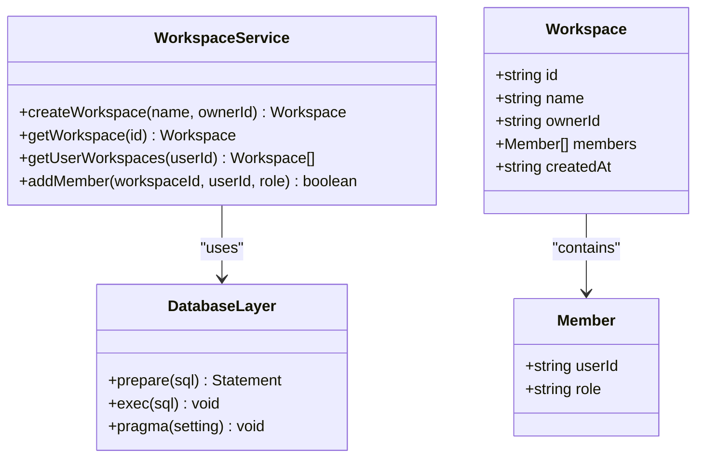
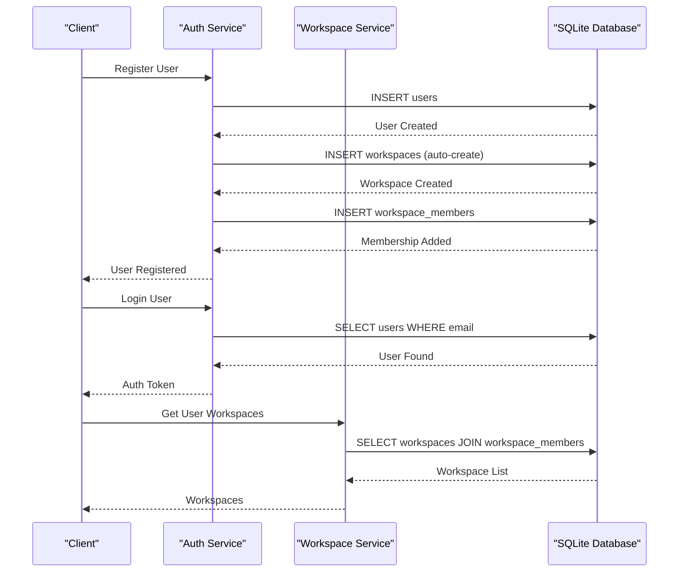
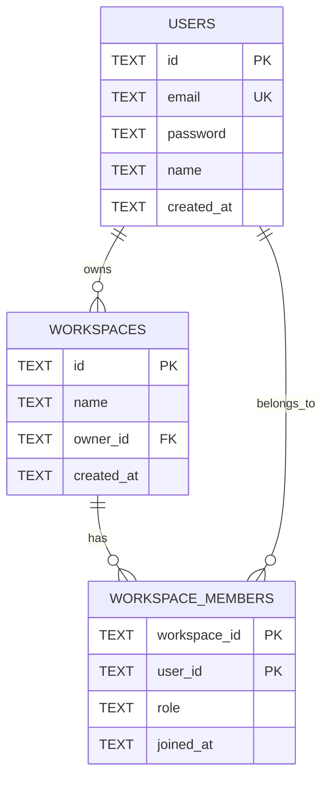
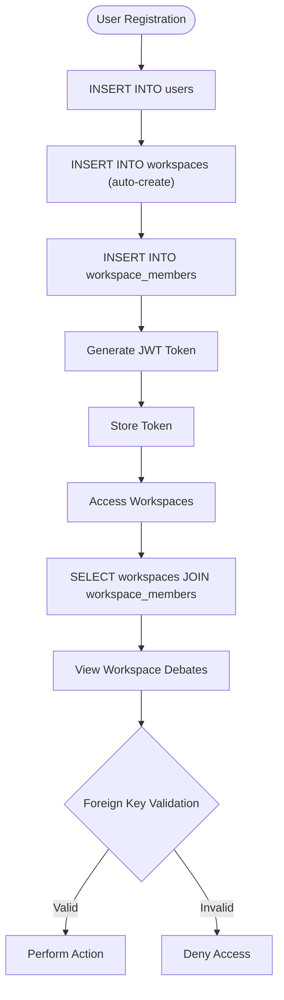
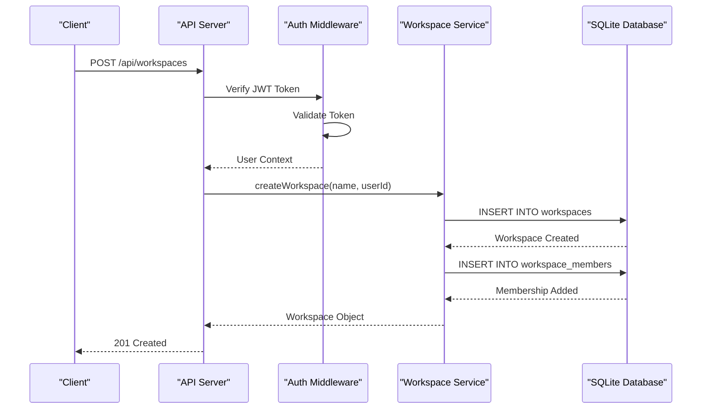
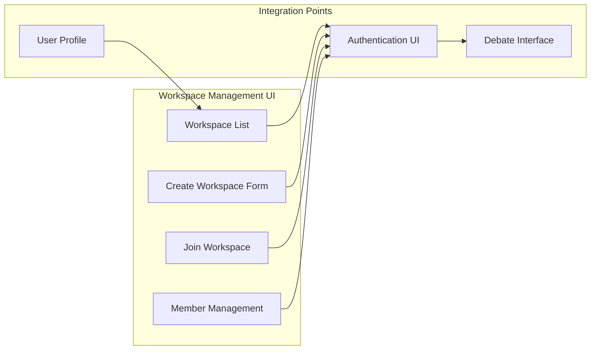
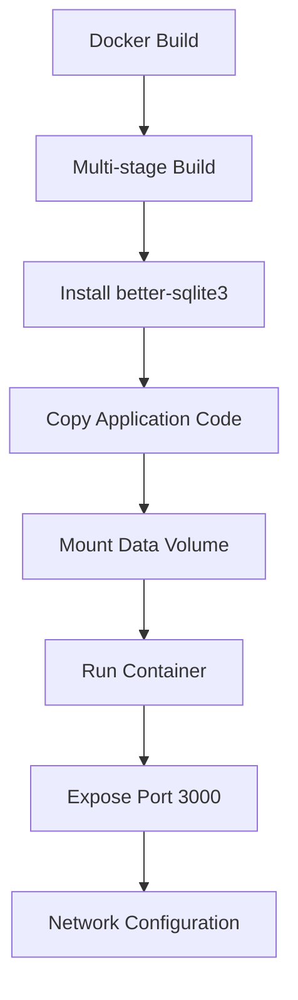

# Workspace Management

<cite>
**Referenced Files in This Document**
- [workspace.js](file://dissensus-engine/server/workspace.js)
- [db.js](file://dissensus-engine/server/db.js)
- [index.js](file://dissensus-engine/server/index.js)
- [auth.js](file://dissensus-engine/server/auth.js)
- [debate-store.js](file://dissensus-engine/server/debate-store.js)
- [package.json](file://dissensus-engine/package.json)
- [Dockerfile](file://dissensus-engine/Dockerfile)
- [docker-compose.yml](file://dissensus-engine/docker-compose.yml)
- [README.md](file://dissensus-engine/README.md)
- [app.js](file://dissensus-engine/public/js/app.js)
- [index.html](file://dissensus-engine/public/index.html)
</cite>

## Update Summary
**Changes Made**
- Updated data storage architecture from file-based JSON to SQLite database with foreign key constraints
- Added comprehensive database schema documentation with table relationships
- Updated system architecture diagrams to reflect database-backed operations
- Enhanced security considerations with database integrity and foreign key enforcement
- Updated troubleshooting guide with database-specific issues and solutions

## Table of Contents
1. [Introduction](#introduction)
2. [System Architecture](#system-architecture)
3. [Workspace Core Components](#workspace-core-components)
4. [Database Schema and Relationships](#database-schema-and-relationships)
5. [Authentication and Authorization](#authentication-and-authorization)
6. [API Endpoints](#api-endpoints)
7. [Frontend Integration](#frontend-integration)
8. [Deployment Configuration](#deployment-configuration)
9. [Security Considerations](#security-considerations)
10. [Troubleshooting Guide](#troubleshooting-guide)
11. [Conclusion](#conclusion)

## Introduction

Workspace Management is a core feature of the Dissensus AI Debate Engine that enables users to organize and manage their debate activities within collaborative environments. This system provides personal workspaces for individual users and shared workspaces for team collaboration, allowing users to categorize debates, track contributions, and maintain organized debate histories.

The workspace management system has been modernized with a database-backed architecture using SQLite with foreign key constraints, providing improved performance, data integrity, and scalability compared to the previous file-based JSON storage system. The system integrates seamlessly with the authentication system, debate persistence layer, and provides a foundation for future collaboration features.

## System Architecture

The workspace management system follows a modular architecture with clear separation of concerns and database-backed operations:

**Diagram sources**
- [index.js:18-18](file://dissensus-engine/server/index.js#L18-L18)
- [workspace.js:1-39](file://dissensus-engine/server/workspace.js#L1-L39)
- [auth.js:1-126](file://dissensus-engine/server/auth.js#L1-L126)
- [db.js:1-47](file://dissensus-engine/server/db.js#L1-L47)

The architecture consists of three main layers:
- **Client Layer**: Web interface with authentication and workspace management capabilities
- **Server Layer**: REST API endpoints, workspace service, authentication service, and debate storage with database integration
- **Data Layer**: SQLite database with foreign key constraints and optimized indexes for performance

## Workspace Core Components

### Workspace Service

The workspace service provides the core functionality for workspace creation, management, and retrieval using database operations:

**Diagram sources**
- [workspace.js:4-38](file://dissensus-engine/server/workspace.js#L4-L38)
- [db.js:15-44](file://dissensus-engine/server/db.js#L15-L44)

**Updated** The workspace service now operates entirely on database queries with automatic transaction handling and foreign key constraint enforcement.

### Database Integration

The workspace system integrates with a centralized SQLite database that manages all user, workspace, and membership data:

**Diagram sources**
- [auth.js:42-46](file://dissensus-engine/server/auth.js#L42-L46)
- [index.js:302-305](file://dissensus-engine/server/index.js#L302-L305)
- [workspace.js:19-29](file://dissensus-engine/server/workspace.js#L19-L29)

**Section sources**
- [workspace.js:1-39](file://dissensus-engine/server/workspace.js#L1-L39)
- [auth.js:1-126](file://dissensus-engine/server/auth.js#L1-L126)

## Database Schema and Relationships

### Database Schema

The workspace management system uses a relational database schema with foreign key constraints to ensure data integrity:

**Diagram sources**
- [db.js:16-40](file://dissensus-engine/server/db.js#L16-L40)

### Table Definitions

**Users Table**: Stores user account information with unique email addresses and timestamps.

**Workspaces Table**: Contains workspace metadata with foreign key references to the owner user.

**Workspace Members Table**: Manages membership relationships with composite primary keys and foreign key constraints.

### Performance Optimizations

The database includes several optimizations for improved performance:

- **WAL Mode**: Write-Ahead Logging for better concurrent read performance
- **Foreign Key Enforcement**: Automatic referential integrity checking
- **Index Creation**: Optimized indexes on frequently queried columns
- **Transaction Support**: Atomic operations for data consistency

**Section sources**
- [db.js:1-47](file://dissensus-engine/server/db.js#L1-L47)

## Authentication and Authorization

### Role-Based Access Control

The workspace system implements a robust role-based access control system with database-backed enforcement:

| Role | Permissions | Database Enforcement |
|------|-------------|---------------------|
| **Owner** | Full access, member management | Foreign key constraints on workspace ownership |
| **Member** | Limited access to workspace debates | Membership verification through JOIN queries |

### Authentication Flow

**Diagram sources**
- [auth.js:42-46](file://dissensus-engine/server/auth.js#L42-L46)
- [index.js:318-329](file://dissensus-engine/server/index.js#L318-L329)
- [workspace.js:19-29](file://dissensus-engine/server/workspace.js#L19-L29)

**Section sources**
- [auth.js:95-126](file://dissensus-engine/server/auth.js#L95-L126)
- [index.js:302-329](file://dissensus-engine/server/index.js#L302-L329)

## API Endpoints

### Workspace Management Endpoints

The workspace system exposes several REST API endpoints for managing workspaces with database-backed operations:

| Endpoint | Method | Description | Authentication Required | Database Operations |
|----------|--------|-------------|------------------------|---------------------|
| `/api/workspaces` | GET | List user's workspaces | Yes | SELECT with JOIN queries |
| `/api/workspaces` | POST | Create new workspace | Yes | INSERT operations |
| `/api/workspaces/:id/debates` | GET | List debates in workspace | Yes | SELECT with workspace filtering |
| `/api/workspaces/:id/members` | POST | Add member to workspace | Yes (Owner) | INSERT with foreign key validation |

### Database Integration

The workspace endpoints integrate with the database layer for secure and efficient operations:

**Diagram sources**
- [index.js:307-316](file://dissensus-engine/server/index.js#L307-L316)
- [auth.js:93-102](file://dissensus-engine/server/auth.js#L93-L102)

**Section sources**
- [index.js:302-329](file://dissensus-engine/server/index.js#L302-L329)

## Frontend Integration

### User Interface Components

The frontend provides intuitive interfaces for workspace management with real-time updates:

**Diagram sources**
- [index.html:42-49](file://dissensus-engine/public/index.html#L42-L49)
- [app.js:231-232](file://dissensus-engine/public/js/app.js#L231-L232)

### Debate Association

Workspaces are integrated with the debate system through automatic association with database-backed metadata:

- **Personal Workspaces**: Automatically created during user registration with foreign key relationships
- **Shared Workspaces**: Manually created and managed by owners with membership validation
- **Debate Tracking**: All debates are associated with user's current workspace through database relationships

**Section sources**
- [index.html:231-232](file://dissensus-engine/public/index.html#L231-L232)
- [app.js:1-200](file://dissensus-engine/public/js/app.js#L1-L200)

## Deployment Configuration

### Docker Configuration

The workspace management system is containerized for easy deployment with database persistence:

**Diagram sources**
- [Dockerfile:1-26](file://dissensus-engine/Dockerfile#L1-L26)
- [docker-compose.yml:1-12](file://dissensus-engine/docker-compose.yml#L1-L12)

### Environment Configuration

The system supports flexible environment configuration with database-specific settings:

| Environment Variable | Description | Default Value |
|---------------------|-------------|---------------|
| `PORT` | Server port | `3000` |
| `JWT_SECRET` | Authentication secret | `dissensus-default-secret-change-me` |
| `TRUST_PROXY` | Reverse proxy support | Enabled |
| `TRUST_PROXY_HOPS` | Proxy hop count | `1` |

**Section sources**
- [Dockerfile:1-26](file://dissensus-engine/Dockerfile#L1-L26)
- [docker-compose.yml:1-12](file://dissensus-engine/docker-compose.yml#L1-L12)
- [auth.js:9-16](file://dissensus-engine/server/auth.js#L9-L16)

## Security Considerations

### Database Security

The workspace management system implements comprehensive security measures at the database level:

1. **Foreign Key Constraints**: Automatic referential integrity prevents orphaned records
2. **SQL Injection Prevention**: Parameterized queries with prepared statements
3. **Data Encryption**: Password hashing with bcrypt, JWT token protection
4. **Access Control**: Role-based permissions enforced through database relationships
5. **Audit Logging**: Transaction logs for compliance and debugging

### Data Integrity

- **Atomic Transactions**: Database operations ensure complete success or failure
- **Constraint Enforcement**: Foreign key constraints maintain referential integrity
- **Index Optimization**: Proper indexing for query performance and security
- **Backup Strategy**: SQLite database files can be easily backed up and restored

### Privacy Considerations

- **Data Minimization**: Only necessary user and workspace data is stored
- **Access Control**: Strict permissions prevent unauthorized access to workspaces
- **Audit Logging**: Activity tracking helps monitor workspace usage
- **CSRF Protection**: Cross-site request forgery protection for sensitive operations

## Troubleshooting Guide

### Database-Related Issues and Solutions

**Issue**: Database connection failures
- **Cause**: SQLite database file corruption or permission issues
- **Solution**: Restart the application to recreate database connections, ensure proper file permissions

**Issue**: Foreign key constraint violations
- **Cause**: Attempting to create workspace members without valid user/workspace IDs
- **Solution**: Verify user and workspace existence before creating memberships

**Issue**: Performance degradation with large datasets
- **Cause**: Missing indexes or inefficient queries
- **Solution**: Database automatically creates indexes, but consider optimizing queries if experiencing slow responses

**Issue**: Authentication failures after workspace creation
- **Cause**: JWT secret mismatch or token expiration
- **Solution**: Regenerate JWT secret and ensure proper token handling

**Issue**: API endpoint errors
- **Cause**: Missing authentication or invalid request format
- **Solution**: Ensure proper JWT token in Authorization header and valid JSON format

### Database Maintenance

The system includes built-in database maintenance features:

- **WAL Mode**: Automatic write-ahead logging for improved concurrency
- **Foreign Key Enforcement**: Automatic constraint checking
- **Index Optimization**: Automatic index creation for performance
- **Transaction Support**: Atomic operations for data consistency

**Section sources**
- [workspace.js:31-36](file://dissensus-engine/server/workspace.js#L31-L36)
- [db.js:10-12](file://dissensus-engine/server/db.js#L10-L12)

## Conclusion

The Workspace Management system in Dissensus AI provides a robust foundation for organizing and collaborating on debate activities. The migration to database-backed operations with foreign key constraints has significantly improved the system's reliability, performance, and scalability compared to the previous file-based approach.

Key strengths of the database-backed system include:
- **Enhanced Reliability**: Foreign key constraints and atomic transactions ensure data integrity
- **Improved Performance**: SQLite with WAL mode and optimized indexes for concurrent access
- **Scalability**: Database operations handle larger datasets more efficiently than file-based storage
- **Security**: Built-in constraint enforcement and SQL injection prevention
- **Maintainability**: Centralized database schema with clear relationships and indexes

The system successfully balances functionality with technical excellence, providing users with powerful workspace management capabilities while leveraging modern database technologies for optimal performance and reliability. The modular architecture, combined with comprehensive security measures and automated maintenance, makes it an essential component of the Dissensus platform.