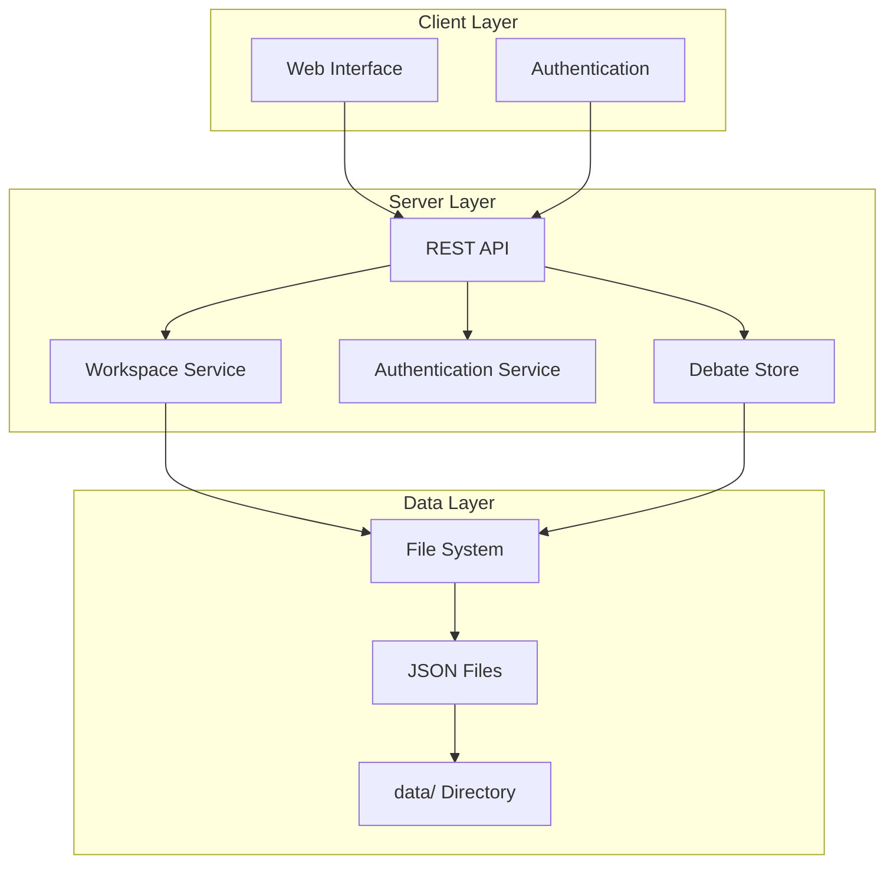
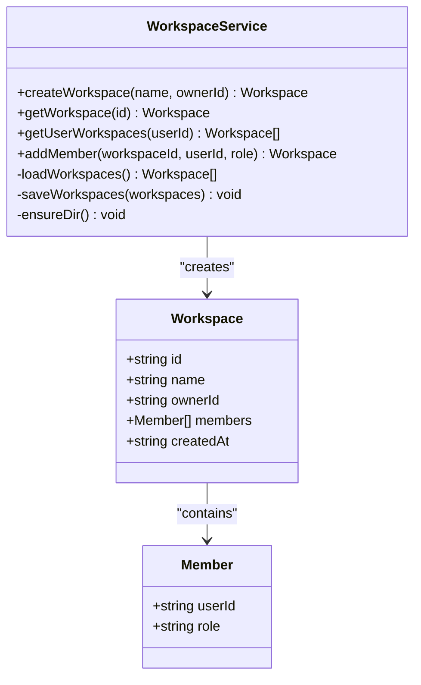
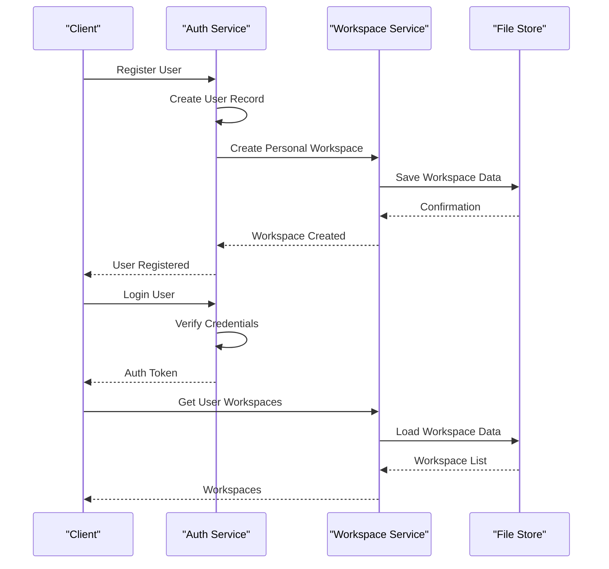
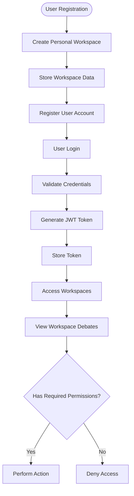
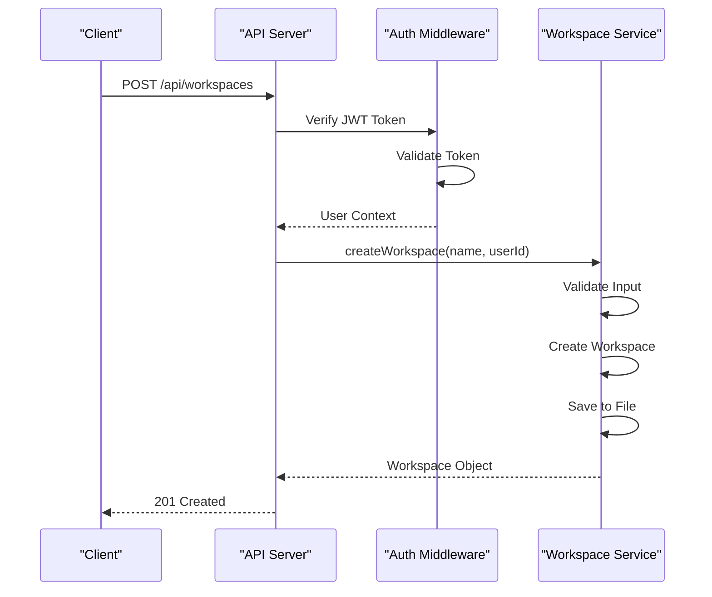
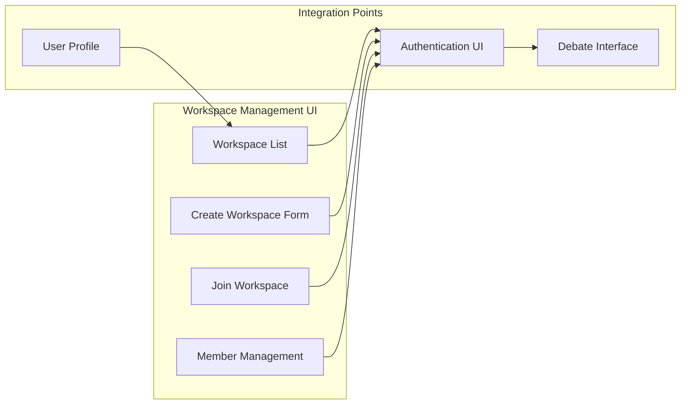
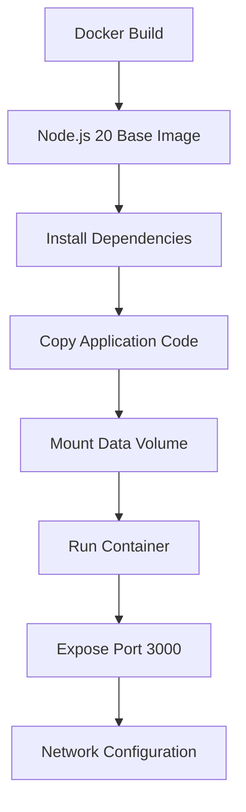

# Workspace Management

<cite>
**Referenced Files in This Document**
- [workspace.js](file://dissensus-engine/server/workspace.js)
- [index.js](file://dissensus-engine/server/index.js)
- [auth.js](file://dissensus-engine/server/auth.js)
- [debate-store.js](file://dissensus-engine/server/debate-store.js)
- [package.json](file://dissensus-engine/package.json)
- [Dockerfile](file://dissensus-engine/Dockerfile)
- [docker-compose.yml](file://dissensus-engine/docker-compose.yml)
- [README.md](file://dissensus-engine/README.md)
- [app.js](file://dissensus-engine/public/js/app.js)
- [index.html](file://dissensus-engine/public/index.html)
</cite>

## Table of Contents
1. [Introduction](#introduction)
2. [System Architecture](#system-architecture)
3. [Workspace Core Components](#workspace-core-components)
4. [Data Storage and Persistence](#data-storage-and-persistence)
5. [Authentication and Authorization](#authentication-and-authorization)
6. [API Endpoints](#api-endpoints)
7. [Frontend Integration](#frontend-integration)
8. [Deployment Configuration](#deployment-configuration)
9. [Security Considerations](#security-considerations)
10. [Troubleshooting Guide](#troubleshooting-guide)
11. [Conclusion](#conclusion)

## Introduction

Workspace Management is a core feature of the Dissensus AI Debate Engine that enables users to organize and manage their debate activities within collaborative environments. This system provides personal workspaces for individual users and shared workspaces for team collaboration, allowing users to categorize debates, track contributions, and maintain organized debate histories.

The workspace management system integrates seamlessly with the authentication system, debate persistence layer, and provides a foundation for future collaboration features. It supports both individual workspaces (personal default) and shared workspaces with role-based access control.

## System Architecture

The workspace management system follows a modular architecture with clear separation of concerns:



**Diagram sources**
- [index.js:18-18](file://dissensus-engine/server/index.js#L18-L18)
- [workspace.js:1-58](file://dissensus-engine/server/workspace.js#L1-L58)
- [auth.js:1-120](file://dissensus-engine/server/auth.js#L1-L120)

The architecture consists of three main layers:
- **Client Layer**: Web interface with authentication and workspace management capabilities
- **Server Layer**: REST API endpoints, workspace service, authentication service, and debate storage
- **Data Layer**: File-based storage using JSON format for persistent data

## Workspace Core Components

### Workspace Service

The workspace service provides the core functionality for workspace creation, management, and retrieval:



**Diagram sources**
- [workspace.js:23-55](file://dissensus-engine/server/workspace.js#L23-L55)

### Authentication Integration

The workspace system integrates tightly with the authentication system to provide secure access control:



**Diagram sources**
- [auth.js:27-59](file://dissensus-engine/server/auth.js#L27-L59)
- [index.js:221-231](file://dissensus-engine/server/index.js#L221-L231)
- [workspace.js:12-21](file://dissensus-engine/server/workspace.js#L12-L21)

**Section sources**
- [workspace.js:1-58](file://dissensus-engine/server/workspace.js#L1-L58)
- [auth.js:1-120](file://dissensus-engine/server/auth.js#L1-L120)

## Data Storage and Persistence

### File Structure Organization

The workspace management system uses a file-based storage approach with a clear directory structure:

```
dissensus-engine/
├── data/
│   ├── users.json          # User account data
│   ├── workspaces.json     # Workspace metadata
│   └── debates/
│       ├── [debate-id].json # Individual debate records
│       └── ...
└── server/
    └── workspace.js        # Workspace service implementation
```

### Data Models

The system maintains several key data structures:

**Workspace Data Model:**
```javascript
{
  id: "uuid-string",
  name: "string",
  ownerId: "uuid-string",
  members: [
    {
      userId: "uuid-string",
      role: "owner|member"
    }
  ],
  createdAt: "iso-date-string"
}
```

**User Data Model:**
```javascript
{
  id: "uuid-string",
  email: "string",
  name: "string",
  passwordHash: "string",
  workspaceId: "uuid-string",
  createdAt: "iso-date-string"
}
```

**Section sources**
- [workspace.js:23-35](file://dissensus-engine/server/workspace.js#L23-L35)
- [auth.js:46-53](file://dissensus-engine/server/auth.js#L46-L53)

## Authentication and Authorization

### Role-Based Access Control

The workspace system implements a simple but effective role-based access control system:

| Role | Permissions | Description |
|------|-------------|-------------|
| **Owner** | Full access | Can manage members, delete workspace, access all debates |
| **Member** | Limited access | Can view and participate in debates within workspace |

### Authentication Flow



**Diagram sources**
- [auth.js:61-78](file://dissensus-engine/server/auth.js#L61-L78)
- [index.js:249-277](file://dissensus-engine/server/index.js#L249-L277)

**Section sources**
- [auth.js:95-117](file://dissensus-engine/server/auth.js#L95-L117)
- [index.js:249-277](file://dissensus-engine/server/index.js#L249-L277)

## API Endpoints

### Workspace Management Endpoints

The workspace system exposes several REST API endpoints for managing workspaces:

| Endpoint | Method | Description | Authentication Required |
|----------|--------|-------------|------------------------|
| `/api/workspaces` | GET | List user's workspaces | Yes |
| `/api/workspaces` | POST | Create new workspace | Yes |
| `/api/workspaces/:id/debates` | GET | List debates in workspace | Yes |
| `/api/workspaces/:id/members` | POST | Add member to workspace | Yes (Owner) |

### Authentication Integration

The workspace endpoints integrate with the authentication middleware:



**Diagram sources**
- [index.js:255-264](file://dissensus-engine/server/index.js#L255-L264)
- [auth.js:95-106](file://dissensus-engine/server/auth.js#L95-L106)

**Section sources**
- [index.js:249-277](file://dissensus-engine/server/index.js#L249-L277)

## Frontend Integration

### User Interface Components

The frontend provides intuitive interfaces for workspace management:



**Diagram sources**
- [index.html:42-49](file://dissensus-engine/public/index.html#L42-L49)
- [app.js:231-232](file://dissensus-engine/public/js/app.js#L231-L232)

### Debate Association

Workspaces are integrated with the debate system through automatic association:

- **Personal Workspaces**: Automatically created during user registration
- **Shared Workspaces**: Manually created and managed by owners
- **Debate Tracking**: All debates are associated with user's current workspace

**Section sources**
- [index.html:231-232](file://dissensus-engine/public/index.html#L231-L232)
- [app.js:1-200](file://dissensus-engine/public/js/app.js#L1-L200)

## Deployment Configuration

### Docker Configuration

The workspace management system is containerized for easy deployment:



**Diagram sources**
- [Dockerfile:1-19](file://dissensus-engine/Dockerfile#L1-L19)
- [docker-compose.yml:1-12](file://dissensus-engine/docker-compose.yml#L1-L12)

### Environment Configuration

The system supports flexible environment configuration:

| Environment Variable | Description | Default Value |
|---------------------|-------------|---------------|
| `PORT` | Server port | `3000` |
| `JWT_SECRET` | Authentication secret | `dissensus-default-secret-change-me` |
| `TRUST_PROXY` | Reverse proxy support | Enabled |
| `TRUST_PROXY_HOPS` | Proxy hop count | `1` |

**Section sources**
- [Dockerfile:1-19](file://dissensus-engine/Dockerfile#L1-L19)
- [docker-compose.yml:1-12](file://dissensus-engine/docker-compose.yml#L1-L12)
- [auth.js:9-10](file://dissensus-engine/server/auth.js#L9-L10)

## Security Considerations

### Data Protection

The workspace management system implements several security measures:

1. **Authentication**: JWT-based authentication with secure token handling
2. **Authorization**: Role-based access control for workspace membership
3. **Input Validation**: Sanitization of workspace names and user inputs
4. **File Permissions**: Secure file system access patterns
5. **Rate Limiting**: Protection against abuse of API endpoints

### Data Integrity

- **Atomic Operations**: Workspace operations are designed to maintain data consistency
- **Error Handling**: Comprehensive error handling prevents data corruption
- **Backup Strategy**: File-based storage allows for easy backup and recovery

### Privacy Considerations

- **Data Minimization**: Only necessary user and workspace data is stored
- **Access Control**: Strict permissions prevent unauthorized access to workspaces
- **Audit Logging**: Activity tracking helps monitor workspace usage

## Troubleshooting Guide

### Common Issues and Solutions

**Issue**: Workspace data not persisting
- **Cause**: File system permission issues
- **Solution**: Ensure the `data/` directory is writable by the Node.js process

**Issue**: Authentication failures after workspace creation
- **Cause**: JWT secret mismatch or token expiration
- **Solution**: Regenerate JWT secret and ensure proper token handling

**Issue**: Unable to join workspace
- **Cause**: Invalid workspace ID or insufficient permissions
- **Solution**: Verify workspace ID format and check owner permissions

**Issue**: API endpoint errors
- **Cause**: Missing authentication or invalid request format
- **Solution**: Ensure proper JWT token in Authorization header and valid JSON format

### Debugging Tools

The system provides several debugging capabilities:

- **Console Logging**: Comprehensive logging of workspace operations
- **Error Tracking**: Centralized error handling with detailed messages
- **Health Checks**: `/api/health` endpoint for system status monitoring

**Section sources**
- [workspace.js:12-21](file://dissensus-engine/server/workspace.js#L12-L21)
- [index.js:96-102](file://dissensus-engine/server/index.js#L96-L102)

## Conclusion

The Workspace Management system in Dissensus AI provides a robust foundation for organizing and collaborating on debate activities. Its modular architecture, secure design, and seamless integration with the authentication and debate systems make it an essential component of the platform.

Key strengths of the system include:
- **Scalable Design**: Modular architecture supports future expansion
- **Security Focus**: Comprehensive authentication and authorization mechanisms
- **User Experience**: Intuitive interfaces for workspace management
- **Persistence Strategy**: Reliable file-based storage with atomic operations
- **Deployment Flexibility**: Containerized deployment with Docker support

The system successfully balances functionality with simplicity, providing users with powerful workspace management capabilities while maintaining the technical excellence expected from the Dissensus platform.