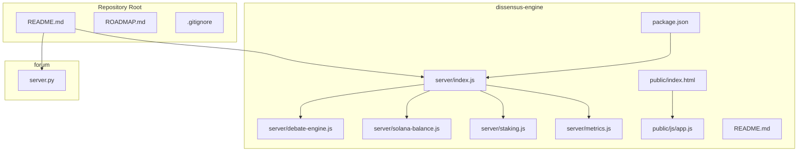
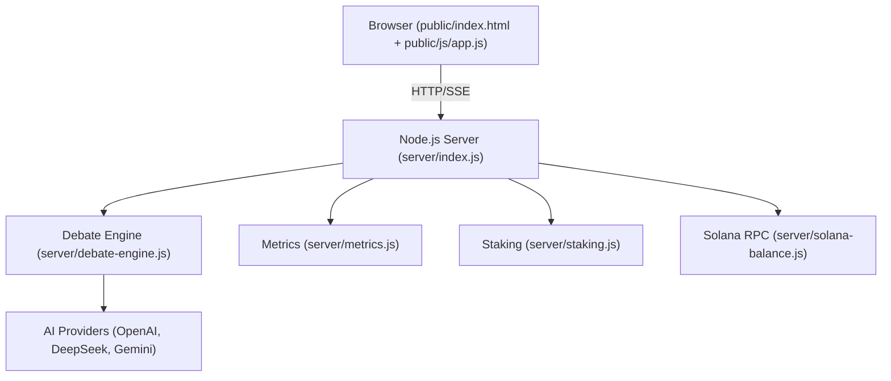
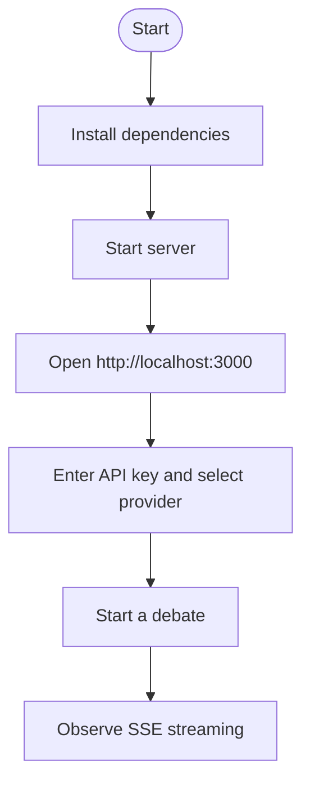
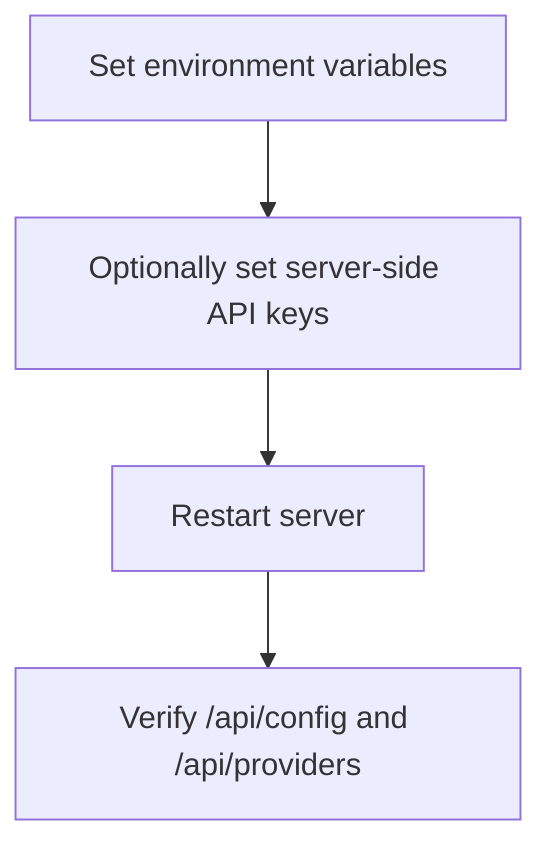
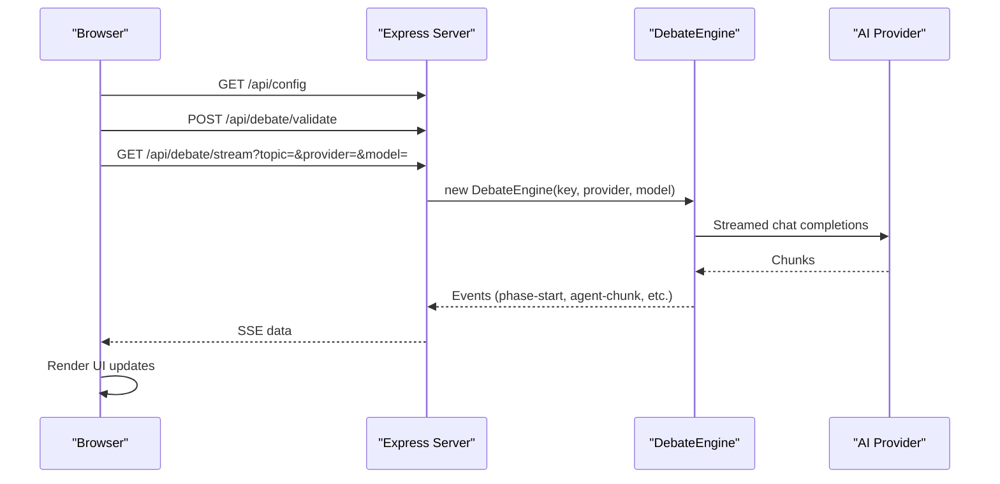
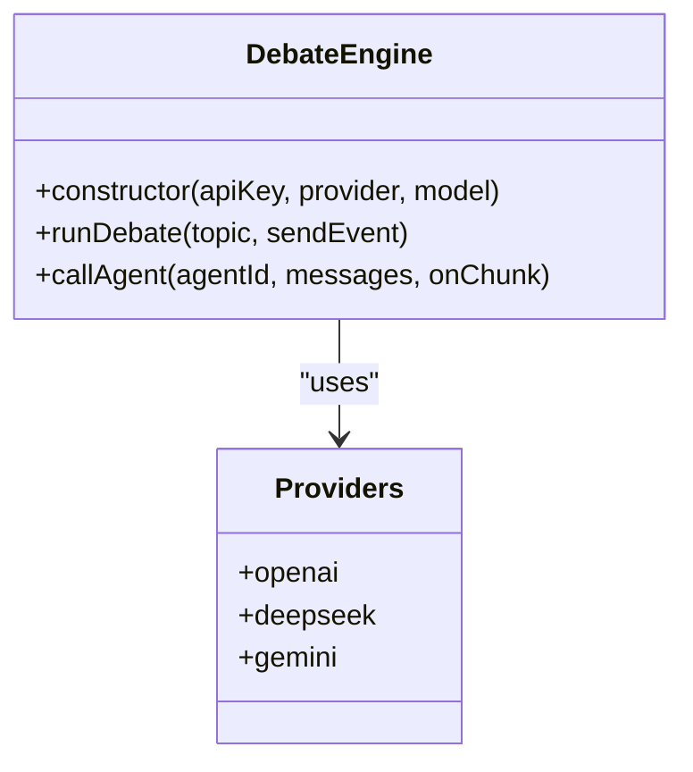
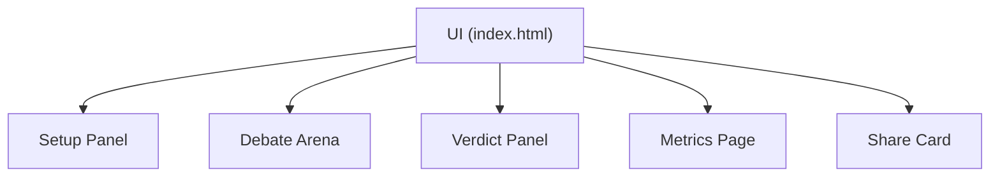
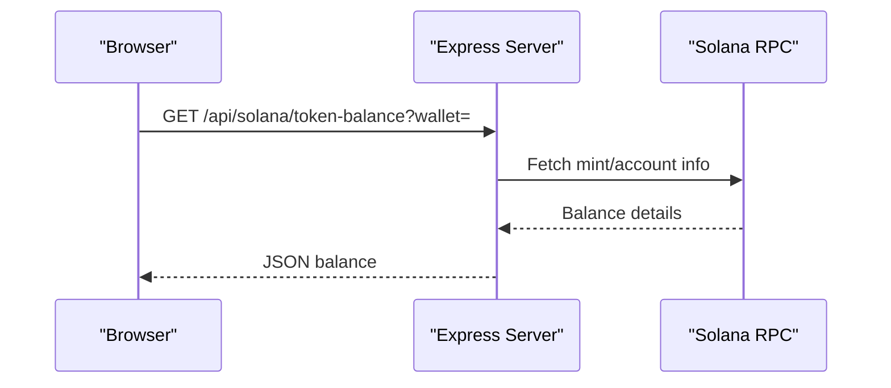
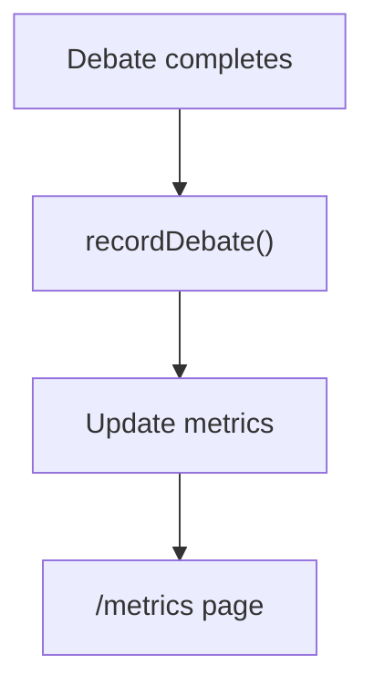
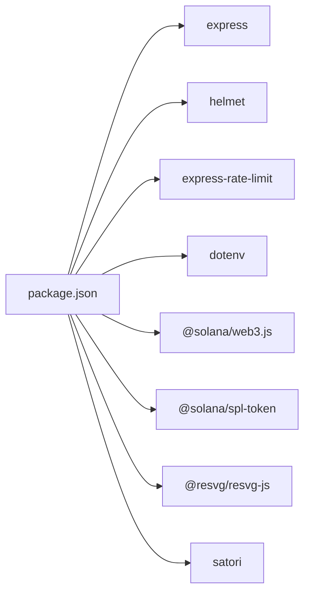

# Getting Started

<cite>
**Referenced Files in This Document**
- [README.md](file://README.md)
- [dissensus-engine/README.md](file://dissensus-engine/README.md)
- [dissensus-engine/package.json](file://dissensus-engine/package.json)
- [dissensus-engine/server/index.js](file://dissensus-engine/server/index.js)
- [dissensus-engine/server/debate-engine.js](file://dissensus-engine/server/debate-engine.js)
- [dissensus-engine/server/solana-balance.js](file://dissensus-engine/server/solana-balance.js)
- [dissensus-engine/server/staking.js](file://dissensus-engine/server/staking.js)
- [dissensus-engine/server/metrics.js](file://dissensus-engine/server/metrics.js)
- [dissensus-engine/public/index.html](file://dissensus-engine/public/index.html)
- [dissensus-engine/public/js/app.js](file://dissensus-engine/public/js/app.js)
- [dissensus-engine/docs/DEPLOY-VPS.md](file://dissensus-engine/docs/DEPLOY-VPS.md)
- [dissensus-engine/DEPLOY-GIT.md](file://dissensus-engine/DEPLOY-GIT.md)
- [forum/server.py](file://forum/server.py)
</cite>

## Table of Contents
1. [Introduction](#introduction)
2. [Project Structure](#project-structure)
3. [Core Components](#core-components)
4. [Architecture Overview](#architecture-overview)
5. [Detailed Component Analysis](#detailed-component-analysis)
6. [Dependency Analysis](#dependency-analysis)
7. [Performance Considerations](#performance-considerations)
8. [Troubleshooting Guide](#troubleshooting-guide)
9. [Conclusion](#conclusion)
10. [Appendices](#appendices)

## Introduction
Dissensus is a multi-agent debate platform where three AI agents — CIPHER (Skeptic), NOVA (Advocate), and PRISM (Synthesizer) — analyze a topic through a 4-phase dialectical process and deliver a ranked consensus. The platform includes:
- A Node.js debate engine that orchestrates AI agents and streams results in real time
- A cyberpunk-themed web UI for initiating debates and viewing results
- Optional Solana integration for simulated staking and $DISS balance checks
- Metrics and transparency dashboards
- A separate Python/Flask-powered research forum

This guide focuses on local development setup, environment configuration, and running the debate engine for the first time.

## Project Structure
The repository is organized into multiple modules:
- dissensus-engine: The main Node.js debate engine with server, client UI, and integrations
- diss-launch-kit: Landing page assets
- forum: Research forum powered by Python/Flask
- webpage/hostinger-deploy: Additional web assets
- Root-level documentation and deployment guides

**Diagram sources**
- [dissensus-engine/server/index.js:1-481](file://dissensus-engine/server/index.js#L1-L481)
- [dissensus-engine/server/debate-engine.js:1-389](file://dissensus-engine/server/debate-engine.js#L1-L389)
- [dissensus-engine/server/solana-balance.js:1-83](file://dissensus-engine/server/solana-balance.js#L1-L83)
- [dissensus-engine/server/staking.js:1-183](file://dissensus-engine/server/staking.js#L1-L183)
- [dissensus-engine/server/metrics.js:1-152](file://dissensus-engine/server/metrics.js#L1-L152)
- [dissensus-engine/public/index.html:1-217](file://dissensus-engine/public/index.html#L1-L217)
- [dissensus-engine/public/js/app.js:1-674](file://dissensus-engine/public/js/app.js#L1-L674)
- [dissensus-engine/package.json:1-28](file://dissensus-engine/package.json#L1-L28)
- [forum/server.py:1-495](file://forum/server.py#L1-L495)

**Section sources**
- [README.md:20-29](file://README.md#L20-L29)
- [dissensus-engine/README.md:110-134](file://dissensus-engine/README.md#L110-L134)

## Core Components
- Server (Express + SSE): Exposes endpoints for configuration, providers, debates, staking, metrics, and Solana balance checks. It streams debate events to the browser using Server-Sent Events.
- Debate Engine: Orchestrates the 4-phase debate across three agents, calling chosen AI providers and emitting structured events.
- Frontend (app.js): Manages UI, SSE consumption, provider/model selection, and simulated staking.
- Solana Integration: Reads $DISS token balances via server-side RPC calls.
- Metrics: Tracks usage and exposes a public dashboard.

**Section sources**
- [dissensus-engine/server/index.js:69-152](file://dissensus-engine/server/index.js#L69-L152)
- [dissensus-engine/server/debate-engine.js:41-387](file://dissensus-engine/server/debate-engine.js#L41-L387)
- [dissensus-engine/public/js/app.js:209-427](file://dissensus-engine/public/js/app.js#L209-L427)
- [dissensus-engine/server/solana-balance.js:26-76](file://dissensus-engine/server/solana-balance.js#L26-L76)
- [dissensus-engine/server/metrics.js:46-132](file://dissensus-engine/server/metrics.js#L46-L132)

## Architecture Overview
The platform uses a thin client that connects to a Node.js server. The server validates inputs, selects an AI provider, streams debate events via SSE, and optionally enforces simulated staking and records metrics.

**Diagram sources**
- [dissensus-engine/server/index.js:218-311](file://dissensus-engine/server/index.js#L218-L311)
- [dissensus-engine/server/debate-engine.js:118-168](file://dissensus-engine/server/debate-engine.js#L118-L168)
- [dissensus-engine/server/metrics.js:46-73](file://dissensus-engine/server/metrics.js#L46-L73)
- [dissensus-engine/server/staking.js:110-125](file://dissensus-engine/server/staking.js#L110-L125)
- [dissensus-engine/server/solana-balance.js:26-76](file://dissensus-engine/server/solana-balance.js#L26-L76)

## Detailed Component Analysis

### Local Installation and Environment Setup
- Prerequisites
  - Node.js 18+ installed on your machine
  - An API key from a supported provider (DeepSeek, Google Gemini, or OpenAI)
- Steps
  - Navigate to the engine directory and install dependencies
  - Start the server
  - Open the UI in your browser

**Diagram sources**
- [dissensus-engine/README.md:35-54](file://dissensus-engine/README.md#L35-L54)
- [dissensus-engine/server/index.js:457-465](file://dissensus-engine/server/index.js#L457-L465)

**Section sources**
- [dissensus-engine/README.md:35-54](file://dissensus-engine/README.md#L35-L54)
- [dissensus-engine/package.json:6-9](file://dissensus-engine/package.json#L6-L9)

### Initial Configuration
- Environment variables
  - PORT: Server port (default 3000)
  - SOLANA_RPC_URL: RPC endpoint for Solana balance checks
  - DISS_TOKEN_MINT: SPL mint for $DISS
  - SOLANA_CLUSTER: Cluster shown in configuration
  - DISS_STAKING_PROGRAM_ID: Future on-chain staking program ID
  - TRUST_PROXY/TRUST_PROXY_HOPS: Reverse proxy trust settings
- Server-side API keys
  - Set in .env to allow visitors to debate without entering keys

**Diagram sources**
- [dissensus-engine/server/index.js:26-84](file://dissensus-engine/server/index.js#L26-L84)
- [dissensus-engine/server/index.js:41-45](file://dissensus-engine/server/index.js#L41-L45)

**Section sources**
- [dissensus-engine/README.md:136-150](file://dissensus-engine/README.md#L136-L150)
- [dissensus-engine/server/index.js:69-85](file://dissensus-engine/server/index.js#L69-L85)

### Running the Debate Engine Locally
- Start the server
- Open the UI at http://localhost:3000
- Choose a provider and model
- Enter a topic and start the debate
- Observe the 4-phase debate stream in real time

**Diagram sources**
- [dissensus-engine/server/index.js:218-311](file://dissensus-engine/server/index.js#L218-L311)
- [dissensus-engine/server/debate-engine.js:118-168](file://dissensus-engine/server/debate-engine.js#L118-L168)
- [dissensus-engine/public/js/app.js:274-356](file://dissensus-engine/public/js/app.js#L274-L356)

**Section sources**
- [dissensus-engine/server/index.js:218-311](file://dissensus-engine/server/index.js#L218-L311)
- [dissensus-engine/public/js/app.js:209-356](file://dissensus-engine/public/js/app.js#L209-L356)

### Connecting to AI Providers
- Supported providers and models are defined in the debate engine configuration
- The UI dynamically updates model options based on the selected provider
- Server-side keys can be configured to avoid prompting users for keys

**Diagram sources**
- [dissensus-engine/server/debate-engine.js:41-53](file://dissensus-engine/server/debate-engine.js#L41-L53)
- [dissensus-engine/server/debate-engine.js:14-39](file://dissensus-engine/server/debate-engine.js#L14-L39)

**Section sources**
- [dissensus-engine/server/debate-engine.js:14-39](file://dissensus-engine/server/debate-engine.js#L14-L39)
- [dissensus-engine/public/js/app.js:23-54](file://dissensus-engine/public/js/app.js#L23-L54)

### Understanding the Interface and Features
- Setup panel: Enter API key, choose provider and model, select a topic
- Debate of the Day: Preselected trending topic
- Simulated staking: Demo-only tier system and daily debate limits
- Metrics dashboard: Public metrics page and recent topics
- Shareable cards: Generate PNG cards for social sharing

**Diagram sources**
- [dissensus-engine/public/index.html:46-127](file://dissensus-engine/public/index.html#L46-L127)
- [dissensus-engine/public/index.html:149-210](file://dissensus-engine/public/index.html#L149-L210)
- [dissensus-engine/public/js/app.js:570-639](file://dissensus-engine/public/js/app.js#L570-L639)

**Section sources**
- [dissensus-engine/public/index.html:46-127](file://dissensus-engine/public/index.html#L46-L127)
- [dissensus-engine/public/index.html:149-210](file://dissensus-engine/public/index.html#L149-L210)
- [dissensus-engine/public/js/app.js:570-639](file://dissensus-engine/public/js/app.js#L570-L639)

### Solana Integration (Simulated)
- Server-side reads $DISS token balance via RPC
- UI shows balance and mint information when connected
- On-chain staking program ID is configurable for future integration

**Diagram sources**
- [dissensus-engine/server/index.js:98-111](file://dissensus-engine/server/index.js#L98-L111)
- [dissensus-engine/server/solana-balance.js:26-76](file://dissensus-engine/server/solana-balance.js#L26-L76)

**Section sources**
- [dissensus-engine/server/index.js:98-122](file://dissensus-engine/server/index.js#L98-L122)
- [dissensus-engine/server/solana-balance.js:26-76](file://dissensus-engine/server/solana-balance.js#L26-L76)

### Metrics and Transparency
- In-memory metrics track debates, provider usage, and staking aggregates
- Public endpoints expose metrics and recent topics
- Metrics dashboard auto-refreshes

**Diagram sources**
- [dissensus-engine/server/index.js:429-445](file://dissensus-engine/server/index.js#L429-L445)
- [dissensus-engine/server/metrics.js:46-73](file://dissensus-engine/server/metrics.js#L46-L73)

**Section sources**
- [dissensus-engine/server/index.js:429-445](file://dissensus-engine/server/index.js#L429-L445)
- [dissensus-engine/server/metrics.js:100-132](file://dissensus-engine/server/metrics.js#L100-L132)

### Research Forum (Python/Flask)
- A separate forum module provides web search and topic analysis
- It serves both static assets and a backend API on a single port
- Useful for research-backed discussions alongside the debate engine

**Section sources**
- [forum/server.py:1-495](file://forum/server.py#L1-L495)

## Dependency Analysis
- Node.js runtime and Express server
- AI provider SDKs via direct HTTP calls
- Solana web3 and SPL-token libraries for balance checks
- Helmet and rate-limit middleware for security and stability
- dotenv for environment variable loading

**Diagram sources**
- [dissensus-engine/package.json:10-19](file://dissensus-engine/package.json#L10-L19)

**Section sources**
- [dissensus-engine/package.json:1-28](file://dissensus-engine/package.json#L1-L28)

## Performance Considerations
- SSE streaming requires careful proxy configuration to avoid buffering
- Rate limiting protects the server from abuse
- Keep debates concise to minimize latency and cost
- Use server-side API keys to avoid client-side overhead

[No sources needed since this section provides general guidance]

## Troubleshooting Guide
Common issues and resolutions:
- Server fails to start
  - Ensure Node.js 18+ is installed and dependencies are installed
- API key errors
  - Verify provider key is correct and model is valid
- SSE not streaming
  - Confirm reverse proxy settings for SSE streaming are configured properly
- Rate limit exceeded
  - Wait for the cooldown period or adjust client-side retry logic
- Solana balance errors
  - Check wallet format and RPC endpoint configuration

**Section sources**
- [dissensus-engine/server/index.js:58-64](file://dissensus-engine/server/index.js#L58-L64)
- [dissensus-engine/server/index.js:218-311](file://dissensus-engine/server/index.js#L218-L311)
- [dissensus-engine/server/solana-balance.js:26-76](file://dissensus-engine/server/solana-balance.js#L26-L76)

## Conclusion
You are now ready to run the Dissensus debate engine locally, connect to AI providers, and explore the interface. For production deployments, follow the VPS and Git-based deployment guides included in the repository.

[No sources needed since this section summarizes without analyzing specific files]

## Appendices

### Quick Start Checklist
- Install Node.js 18+
- Install dependencies in the engine directory
- Start the server
- Open http://localhost:3000
- Enter an API key and start a debate

**Section sources**
- [dissensus-engine/README.md:35-54](file://dissensus-engine/README.md#L35-L54)

### Deployment References
- VPS deployment steps and Nginx configuration
- Git-based deployment workflow

**Section sources**
- [dissensus-engine/docs/DEPLOY-VPS.md:1-744](file://dissensus-engine/docs/DEPLOY-VPS.md#L1-L744)
- [dissensus-engine/DEPLOY-GIT.md:1-116](file://dissensus-engine/DEPLOY-GIT.md#L1-L116)