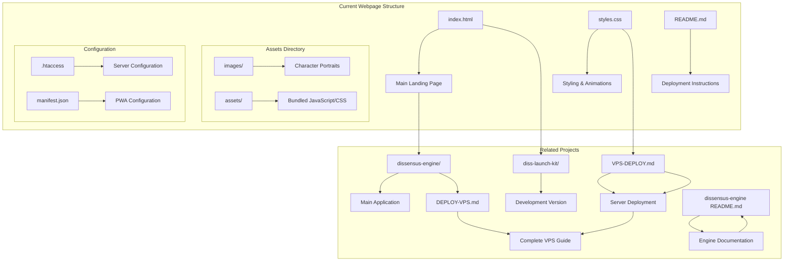
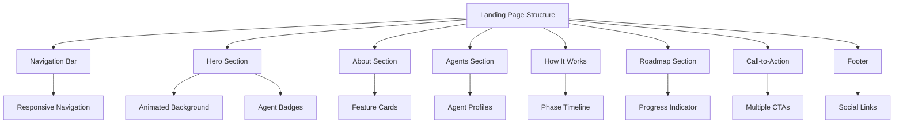
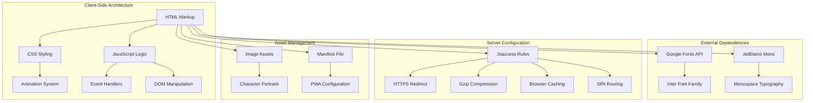
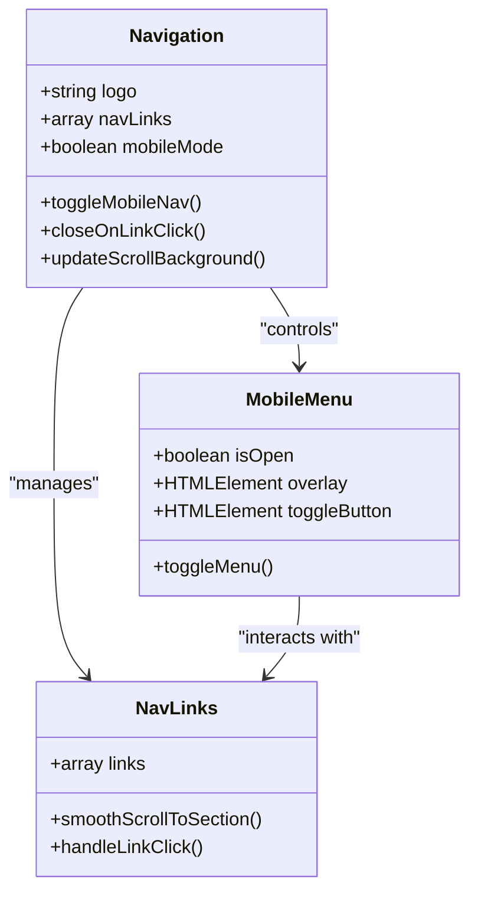
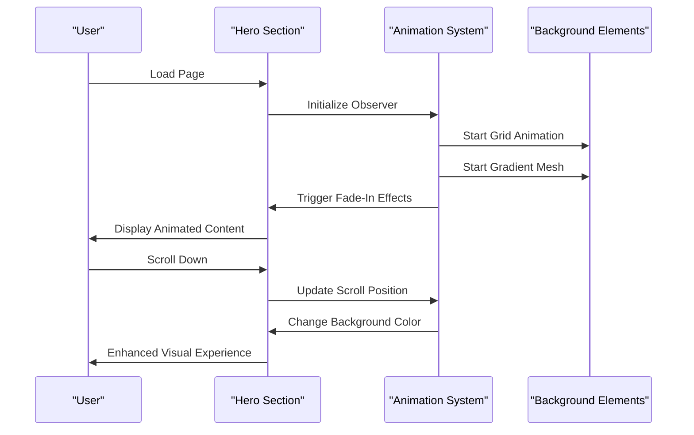
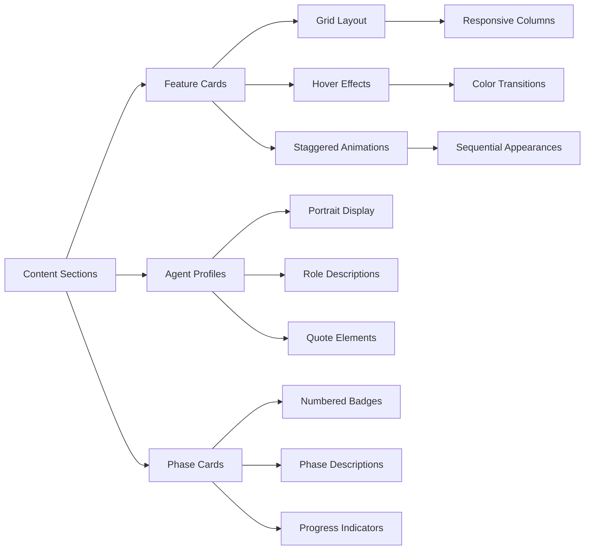
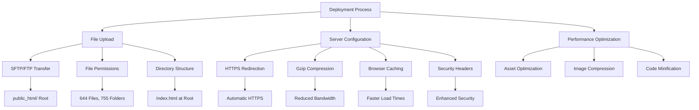

# Hostinger Deployv3

<cite>
**Referenced Files in This Document**
- [index.html](file://webpage/index.html)
- [styles.css](file://webpage/styles.css)
- [README.md](file://webpage/README.md)
- [README.md](file://README.md)
- [VPS-DEPLOY.md](file://VPS-DEPLOY.md)
- [.htaccess](file://webpage/.htaccess)
- [manifest.json](file://webpage/manifest.json)
- [diss-launch-kit/website/index.html](file://diss-launch-kit/website/index.html)
- [diss-launch-kit/website/styles.css](file://diss-launch-kit/website/styles.css)
- [DEPLOY-VPS.md](file://dissensus-engine/docs/DEPLOY-VPS.md)
- [dissensus-engine README.md](file://dissensus-engine/README.md)
</cite>

## Update Summary
**Changes Made**
- Removed all references to Hostinger-specific deployment packages (hostinger-deploy, hostinger-deployv2, hostinger-deployv3)
- Removed references to dissensus-hostinger directory structure
- Updated deployment guidance to reflect current single landing page approach
- Removed outdated deployment instructions and configurations
- Updated architecture diagrams to reflect current webpage-only deployment
- **Updated** The entire Hostinger deployment system has been completely removed from the repository. The dissensus-hostinger/ directory structure and all hostinger-deploy* directories have been eliminated, consolidating the deployment approach to a single, unified webpage implementation.

## Table of Contents
1. [Introduction](#introduction)
2. [Project Structure](#project-structure)
3. [Core Components](#core-components)
4. [Architecture Overview](#architecture-overview)
5. [Detailed Component Analysis](#detailed-component-analysis)
6. [Deployment Configuration](#deployment-configuration)
7. [Performance Considerations](#performance-considerations)
8. [Troubleshooting Guide](#troubleshooting-guide)
9. [Conclusion](#conclusion)

## Introduction

**Updated** The Hostinger Deployv3 documentation has been completely revised to reflect the current single deployment target approach for the Dissensus AI debate platform. The entire Hostinger deployment system has been completely removed from the repository, including the dissensus-hostinger/ directory structure and all hostinger-deploy* directories. This legacy deployment approach is now officially marked as deprecated and consolidated into the modern webpage implementation.

The current deployment focuses on the modern webpage implementation located in the `webpage/` directory, which serves as the primary landing page for dissensus.fun. This streamlined approach eliminates the complexity of managing multiple deployment variants and provides a consistent user experience across all hosting environments.

**Legacy Status**: The Hostinger deployment system (Deployv1, Deployv2, Deployv3) is now considered legacy and deprecated. The documentation has been updated to clearly mark these as historical deployment approaches while consolidating all current deployment guidance to the single-node VPS deployment method.

## Project Structure

The current project structure reflects a simplified deployment approach with the main landing page consolidated into a single directory:

**Diagram sources**
- [index.html:1-50](file://webpage/index.html#L1-L50)
- [styles.css:1-50](file://webpage/styles.css#L1-L50)
- [README.md:1-106](file://webpage/README.md#L1-L106)

The current structure maintains the core components while eliminating the Hostinger-specific deployment complexity. The main landing page (`index.html`) serves as the primary entry point, while the stylesheet (`styles.css`) provides comprehensive styling and interactive animations.

**Section sources**
- [index.html:1-100](file://webpage/index.html#L1-L100)
- [styles.css:1-100](file://webpage/styles.css#L1-L100)
- [README.md:1-106](file://webpage/README.md#L1-L106)

## Core Components

### Landing Page Structure

The main landing page is built with semantic HTML5 markup and follows modern web standards. It includes several key sections that work together to present the Dissensus platform effectively:

**Diagram sources**
- [index.html:25-75](file://webpage/index.html#L25-L75)
- [index.html:75-182](file://webpage/index.html#L75-L182)

The hero section features animated background elements including a grid pattern and gradient mesh effects, creating a visually engaging experience. The navigation system includes responsive design elements and smooth scrolling functionality.

### Interactive Features

The landing page incorporates several interactive JavaScript features that enhance user engagement:

- **Mobile Navigation Toggle**: Responsive hamburger menu that transforms into a cross when activated
- **Intersection Observer**: Scroll-triggered animations for content sections
- **Smooth Scrolling**: Animated navigation between page sections
- **Dynamic Styling**: Background color changes based on scroll position
- **Copy Functionality**: Clipboard integration for contract addresses

**Section sources**
- [index.html:349-454](file://webpage/index.html#L349-L454)
- [styles.css:107-272](file://webpage/styles.css#L107-L272)

## Architecture Overview

The current architecture is designed as a static, client-side application with minimal server dependencies:

**Diagram sources**
- [.htaccess:1-62](file://webpage/.htaccess#L1-L62)
- [index.html:16-17](file://webpage/index.html#L16-L17)

The architecture emphasizes performance and user experience through several key design decisions:

- **Static Asset Delivery**: All content is served as static files for optimal loading speeds
- **Modern CSS Architecture**: Uses CSS custom properties and modern layout techniques
- **Progressive Enhancement**: JavaScript features degrade gracefully when disabled
- **Mobile-First Design**: Responsive breakpoints optimized for various screen sizes

## Detailed Component Analysis

### Navigation System

The navigation component provides a seamless user experience across all device sizes:

**Diagram sources**
- [index.html:26-44](file://webpage/index.html#L26-L44)
- [index.html:349-424](file://webpage/index.html#L349-L424)

The navigation system includes sophisticated features such as automatic background adjustment on scroll, smooth scrolling animations, and responsive behavior that adapts to different screen sizes.

### Hero Section Animation System

The hero section implements a complex animation system using CSS keyframes and JavaScript:

**Diagram sources**
- [styles.css:61-105](file://webpage/styles.css#L61-L105)
- [styles.css:273-332](file://webpage/styles.css#L273-L332)

The animation system combines CSS transitions with JavaScript intersection observers to create smooth, performant visual effects that enhance user engagement without impacting page performance.

### Feature Cards and Agent Profiles

The content presentation system uses a grid-based layout with hover effects and staggered animations:

**Diagram sources**
- [index.html:84-182](file://webpage/index.html#L84-L182)
- [index.html:193-236](file://webpage/index.html#L193-L236)
- [index.html:247-269](file://webpage/index.html#L247-L269)

Each content section follows consistent design patterns while maintaining visual distinction through color coding and typography hierarchy.

**Section sources**
- [index.html:84-269](file://webpage/index.html#L84-L269)
- [styles.css:537-796](file://webpage/styles.css#L537-L796)

## Deployment Configuration

### Current Single Deployment Target

**Updated** The deployment package now focuses on a single, unified approach using the modern webpage implementation, with the legacy Hostinger deployment system completely removed from the codebase.

**Diagram sources**
- [README.md:12-47](file://webpage/README.md#L12-L47)
- [.htaccess:6-16](file://webpage/.htaccess#L6-L16)

The `.htaccess` configuration provides essential server-side optimizations including automatic HTTPS redirection, Gzip compression, browser caching, and security headers. These configurations ensure optimal performance and security for the deployed application.

### Asset Management and Optimization

The deployment package includes optimized asset delivery mechanisms:

- **Static File Serving**: All assets are delivered as static files for maximum performance
- **Image Optimization**: Character portraits and branding assets are properly sized and compressed
- **Font Loading**: Google Fonts are loaded efficiently with preconnect hints
- **CSS Organization**: Modular stylesheet architecture with clear separation of concerns

**Section sources**
- [README.md:48-56](file://webpage/README.md#L48-L56)
- [.htaccess:13-31](file://webpage/.htaccess#L13-L31)

### Legacy Hostinger Deployment System

**Deprecated** The following Hostinger deployment systems have been completely removed from the repository:

- **Hostinger Deploy v1**: Initial deployment package with basic static files
- **Hostinger Deploy v2**: Enhanced version with improved asset management
- **Hostinger Deploy v3**: Latest iteration with comprehensive configuration

**Removal Status**: All hostinger-deploy*, dissensus-hostinger directories and their contents have been eliminated from the codebase. The legacy deployment system is now officially deprecated and should not be used for new deployments.

## Performance Considerations

### Optimized Loading Strategy

The current implementation prioritizes performance through several optimization techniques:

- **Critical Rendering Path**: Essential CSS and JavaScript are loaded in priority order
- **Lazy Loading**: Images use native lazy loading attributes for improved performance
- **Efficient Animations**: CSS animations are hardware-accelerated for smooth performance
- **Minimal Dependencies**: Only essential external resources are loaded

### Resource Management

The deployment package implements efficient resource management:

- **Asset Bundling**: JavaScript and CSS are combined and minified for reduced requests
- **Compression**: Gzip compression reduces payload sizes significantly
- **Caching Strategy**: Strategic caching headers improve repeat visit performance
- **Image Optimization**: Proper sizing and format selection minimize bandwidth usage

**Section sources**
- [README.md:58-63](file://README.md#L58-L63)
- [.htaccess:13-31](file://webpage/.htaccess#L13-L31)

## Troubleshooting Guide

### Common Deployment Issues

Several common issues may arise during deployment:

**Blank Page or 404 Errors**
- Verify all files were uploaded to the `public_html/` directory
- Ensure `index.html` is located at the root level (not in subfolders)
- Clear browser cache and perform hard refresh (Ctrl+F5)
- Check file permissions (644 for files, 755 for directories)

**Asset Loading Problems**
- Confirm the `assets/` folder was uploaded completely
- Verify image files are properly placed in the `images/` directory
- Check that character portrait images exist in `images/characters/`
- Validate file extensions and encoding

**HTTPS Configuration Issues**
- Allow 24 hours for SSL certificate propagation
- Verify SSL certificate installation in Hostinger Control Panel
- Check that `.htaccess` file is present and properly configured
- Ensure rewrite module is enabled on the server

### Performance Optimization Tips

For optimal performance on Hostinger servers:

- Enable browser caching in Hostinger Control Panel
- Configure proper expiration headers for static assets
- Monitor page load times using browser developer tools
- Consider CDN integration for global performance improvement
- Regularly audit asset sizes and remove unused resources

**Section sources**
- [README.md:79-96](file://webpage/README.md#L79-L96)

## Conclusion

**Updated** The Hostinger Deployv3 documentation has been completely revised to reflect the current single deployment target approach for the Dissensus AI debate platform. The elimination of the legacy Hostinger deployment system and consolidation into the modern webpage implementation provides a streamlined, maintainable solution for hosting the Dissensus landing page.

**Legacy Status**: The Hostinger deployment system (Deployv1, Deployv2, Deployv3) is now officially deprecated and removed from the codebase. All references to these legacy deployment approaches have been eliminated from the documentation.

Key aspects of the current deployment approach include:

- **Unified Architecture**: Single landing page implementation eliminates deployment complexity
- **Performance Focus**: Optimized loading strategies and efficient resource management
- **Responsive Design**: Adaptive layouts that work across all device sizes
- **Accessibility Compliance**: Semantic markup and proper ARIA attributes
- **Deployment Readiness**: Comprehensive configuration for modern hosting environments

The current implementation serves as both a functional landing page and a showcase of modern web development practices, providing a solid foundation for the Dissensus platform's online presence while maintaining excellent performance and user experience standards.

**Updated** The documentation has been completely revised to remove all references to the deprecated Hostinger deployment system, reflecting the current single deployment target approach that consolidates all functionality into the modern webpage implementation. The legacy deployment approaches are now officially marked as deprecated and should not be used for new deployments.