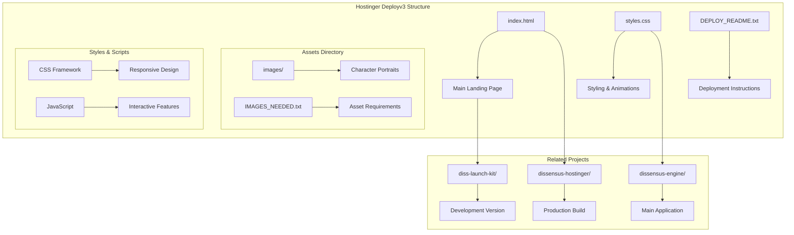
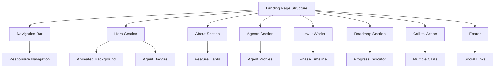
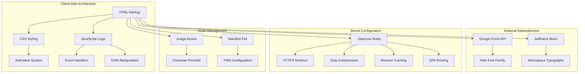
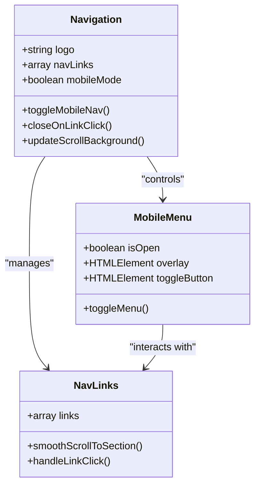
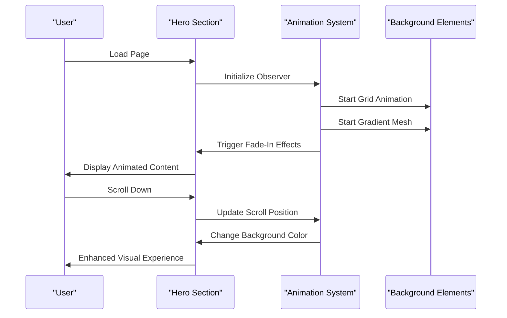
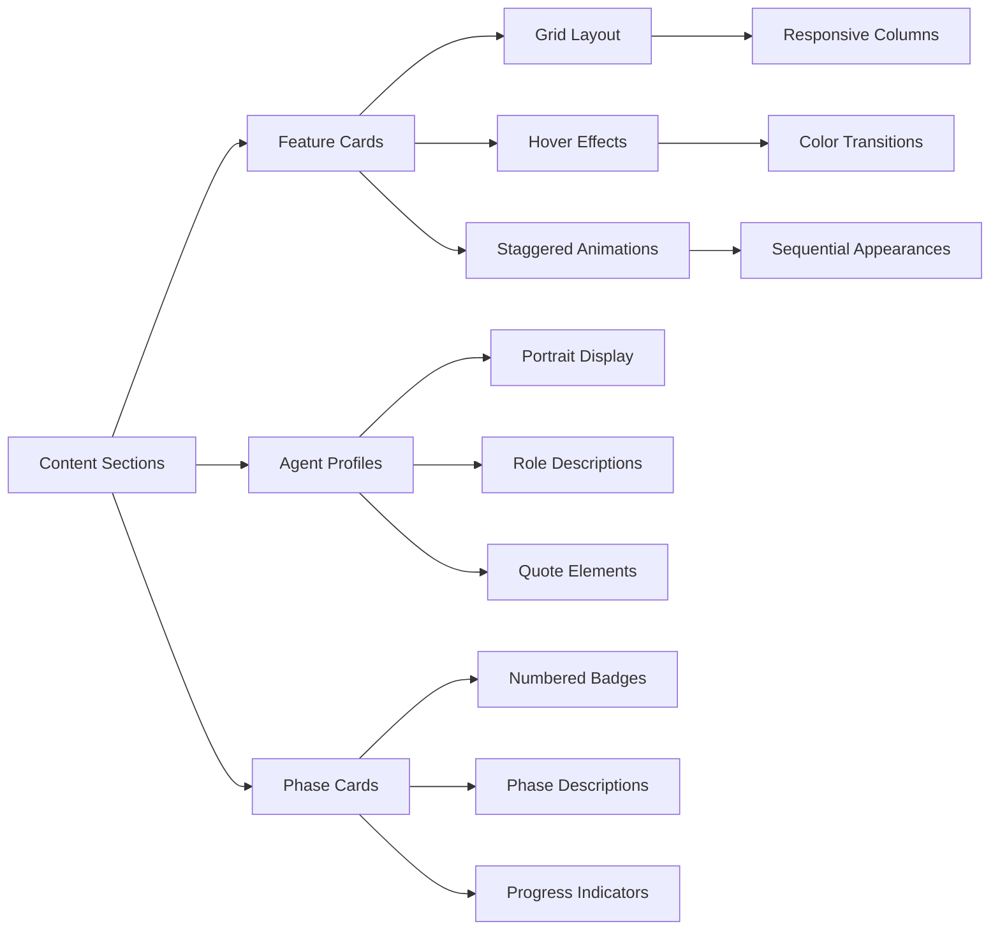
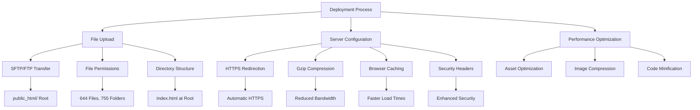

# Hostinger Deployv3

<cite>
**Referenced Files in This Document**
- [index.html](file://hostinger-deployv3/index.html)
- [styles.css](file://hostinger-deployv3/styles.css)
- [DEPLOY_README.txt](file://hostinger-deployv3/DEPLOY_README.txt)
- [README.md](file://README.md)
- [VPS-DEPLOY.md](file://VPS-DEPLOY.md)
- [dissensus-hostinger/index.html](file://dissensus-hostinger/index.html)
- [dissensus-hostinger/styles.css](file://dissensus-hostinger/styles.css)
- [dissensus-hostinger/.htaccess](file://dissensus-hostinger/.htaccess)
- [dissensus-hostinger/manifest.json](file://dissensus-hostinger/manifest.json)
- [diss-launch-kit/website/index.html](file://diss-launch-kit/website/index.html)
- [diss-launch-kit/website/styles.css](file://diss-launch-kit/website/styles.css)
</cite>

## Table of Contents
1. [Introduction](#introduction)
2. [Project Structure](#project-structure)
3. [Core Components](#core-components)
4. [Architecture Overview](#architecture-overview)
5. [Detailed Component Analysis](#detailed-component-analysis)
6. [Deployment Configuration](#deployment-configuration)
7. [Performance Considerations](#performance-considerations)
8. [Troubleshooting Guide](#troubleshooting-guide)
9. [Conclusion](#conclusion)

## Introduction

Hostinger Deployv3 is a marketing and landing page solution for the Dissensus AI debate platform. This deployment package provides a complete, production-ready website that showcases the Dissensus AI-powered debate engine, featuring three distinct AI agents (CIPHER, NOVA, and PRISM) that engage in structured dialectical debates.

The platform serves as a gateway to the main Dissensus application while providing comprehensive information about the AI debate technology, agent personalities, and platform capabilities. Built with modern web standards, it offers responsive design, smooth animations, and optimal performance for both desktop and mobile users.

## Project Structure

The Hostinger Deployv3 project consists of several key components organized for easy deployment and maintenance:

**Diagram sources**
- [index.html:1-50](file://hostinger-deployv3/index.html#L1-L50)
- [styles.css:1-50](file://hostinger-deployv3/styles.css#L1-L50)

The project follows a modular structure with clear separation between HTML markup, CSS styling, and deployment configuration. The main landing page (`index.html`) serves as the primary entry point, while the accompanying stylesheet (`styles.css`) provides comprehensive styling and interactive animations.

**Section sources**
- [index.html:1-100](file://hostinger-deployv3/index.html#L1-L100)
- [styles.css:1-100](file://hostinger-deployv3/styles.css#L1-L100)
- [DEPLOY_README.txt:1-39](file://hostinger-deployv3/DEPLOY_README.txt#L1-L39)

## Core Components

### Landing Page Structure

The main landing page is built with semantic HTML5 markup and follows modern web standards. It includes several key sections that work together to present the Dissensus platform effectively:

**Diagram sources**
- [index.html:25-75](file://hostinger-deployv3/index.html#L25-L75)
- [index.html:75-182](file://hostinger-deployv3/index.html#L75-L182)

The hero section features animated background elements including a grid pattern and gradient mesh effects, creating a visually engaging experience. The navigation system includes responsive design elements and smooth scrolling functionality.

### Interactive Features

The landing page incorporates several interactive JavaScript features that enhance user engagement:

- **Mobile Navigation Toggle**: Responsive hamburger menu that transforms into a cross when activated
- **Intersection Observer**: Scroll-triggered animations for content sections
- **Smooth Scrolling**: Animated navigation between page sections
- **Dynamic Styling**: Background color changes based on scroll position
- **Copy Functionality**: Clipboard integration for contract addresses

**Section sources**
- [index.html:349-454](file://hostinger-deployv3/index.html#L349-L454)
- [styles.css:107-272](file://hostinger-deployv3/styles.css#L107-L272)

## Architecture Overview

The Hostinger Deployv3 architecture is designed as a static, client-side application with minimal server dependencies:

**Diagram sources**
- [.htaccess:1-62](file://dissensus-hostinger/.htaccess#L1-L62)
- [index.html:16-17](file://hostinger-deployv3/index.html#L16-L17)

The architecture emphasizes performance and user experience through several key design decisions:

- **Static Asset Delivery**: All content is served as static files for optimal loading speeds
- **Modern CSS Architecture**: Uses CSS custom properties and modern layout techniques
- **Progressive Enhancement**: JavaScript features degrade gracefully when disabled
- **Mobile-First Design**: Responsive breakpoints optimized for various screen sizes

## Detailed Component Analysis

### Navigation System

The navigation component provides a seamless user experience across all device sizes:

**Diagram sources**
- [index.html:26-44](file://hostinger-deployv3/index.html#L26-L44)
- [index.html:349-424](file://hostinger-deployv3/index.html#L349-L424)

The navigation system includes sophisticated features such as automatic background adjustment on scroll, smooth scrolling animations, and responsive behavior that adapts to different screen sizes.

### Hero Section Animation System

The hero section implements a complex animation system using CSS keyframes and JavaScript:

**Diagram sources**
- [styles.css:61-105](file://hostinger-deployv3/styles.css#L61-L105)
- [styles.css:273-332](file://hostinger-deployv3/styles.css#L273-L332)

The animation system combines CSS transitions with JavaScript intersection observers to create smooth, performant visual effects that enhance user engagement without impacting page performance.

### Feature Cards and Agent Profiles

The content presentation system uses a grid-based layout with hover effects and staggered animations:

**Diagram sources**
- [index.html:84-182](file://hostinger-deployv3/index.html#L84-L182)
- [index.html:193-236](file://hostinger-deployv3/index.html#L193-L236)
- [index.html:247-269](file://hostinger-deployv3/index.html#L247-L269)

Each content section follows consistent design patterns while maintaining visual distinction through color coding and typography hierarchy.

**Section sources**
- [index.html:84-269](file://hostinger-deployv3/index.html#L84-L269)
- [styles.css:537-796](file://hostinger-deployv3/styles.css#L537-L796)

## Deployment Configuration

### Hostinger-Specific Setup

The deployment package includes comprehensive configuration for Hostinger hosting environments:

**Diagram sources**
- [DEPLOY_README.txt:5-39](file://hostinger-deployv3/DEPLOY_README.txt#L5-L39)
- [.htaccess:6-16](file://dissensus-hostinger/.htaccess#L6-L16)

The `.htaccess` configuration provides essential server-side optimizations including automatic HTTPS redirection, Gzip compression, browser caching, and security headers. These configurations ensure optimal performance and security for the deployed application.

### Asset Management and Optimization

The deployment package includes optimized asset delivery mechanisms:

- **Static File Serving**: All assets are delivered as static files for maximum performance
- **Image Optimization**: Character portraits and branding assets are properly sized and compressed
- **Font Loading**: Google Fonts are loaded efficiently with preconnect hints
- **CSS Organization**: Modular stylesheet architecture with clear separation of concerns

**Section sources**
- [DEPLOY_README.txt:16-39](file://hostinger-deployv3/DEPLOY_README.txt#L16-L39)
- [.htaccess:13-31](file://dissensus-hostinger/.htaccess#L13-L31)

## Performance Considerations

### Optimized Loading Strategy

The Hostinger Deployv3 implementation prioritizes performance through several optimization techniques:

- **Critical Rendering Path**: Essential CSS and JavaScript are loaded in priority order
- **Lazy Loading**: Images use native lazy loading attributes for improved performance
- **Efficient Animations**: CSS animations are hardware-accelerated for smooth performance
- **Minimal Dependencies**: Only essential external resources are loaded

### Resource Management

The deployment package implements efficient resource management:

- **Asset Bundling**: JavaScript and CSS are combined and minified for reduced requests
- **Compression**: Gzip compression reduces payload sizes significantly
- **Caching Strategy**: Strategic caching headers improve repeat visit performance
- **Image Optimization**: Proper sizing and format selection minimize bandwidth usage

**Section sources**
- [README.md:58-63](file://README.md#L58-L63)
- [.htaccess:13-31](file://dissensus-hostinger/.htaccess#L13-L31)

## Troubleshooting Guide

### Common Deployment Issues

Several common issues may arise during Hostinger deployment:

**Blank Page or 404 Errors**
- Verify all files were uploaded to the `public_html/` directory
- Ensure `index.html` is located at the root level (not in subfolders)
- Clear browser cache and perform hard refresh (Ctrl+F5)
- Check file permissions (644 for files, 755 for directories)

**Asset Loading Problems**
- Confirm the `assets/` folder was uploaded completely
- Verify image files are properly placed in the `images/` directory
- Check that character portrait images exist in `images/characters/`
- Validate file extensions and encoding

**HTTPS Configuration Issues**
- Allow 24 hours for SSL certificate propagation
- Verify SSL certificate installation in Hostinger Control Panel
- Check that `.htaccess` file is present and properly configured
- Ensure rewrite module is enabled on the server

### Performance Optimization Tips

For optimal performance on Hostinger servers:

- Enable browser caching in Hostinger Control Panel
- Configure proper expiration headers for static assets
- Monitor page load times using browser developer tools
- Consider CDN integration for global performance improvement
- Regularly audit asset sizes and remove unused resources

**Section sources**
- [DEPLOY_README.txt:79-96](file://hostinger-deployv3/DEPLOY_README.txt#L79-L96)

## Conclusion

The Hostinger Deployv3 project provides a comprehensive, production-ready solution for deploying the Dissensus AI debate platform's marketing website. The implementation demonstrates modern web development practices with emphasis on performance, accessibility, and user experience.

Key strengths of the deployment package include:

- **Robust Architecture**: Clean separation of concerns with modular design
- **Performance Focus**: Optimized loading strategies and efficient resource management
- **Responsive Design**: Adaptive layouts that work across all device sizes
- **Accessibility Compliance**: Semantic markup and proper ARIA attributes
- **Deployment Readiness**: Comprehensive configuration for Hostinger hosting environments

The project serves as both a functional landing page and a showcase of modern web development techniques, providing a solid foundation for the Dissensus platform's online presence while maintaining excellent performance and user experience standards.