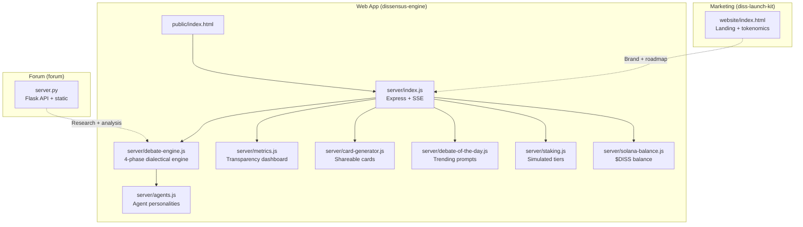
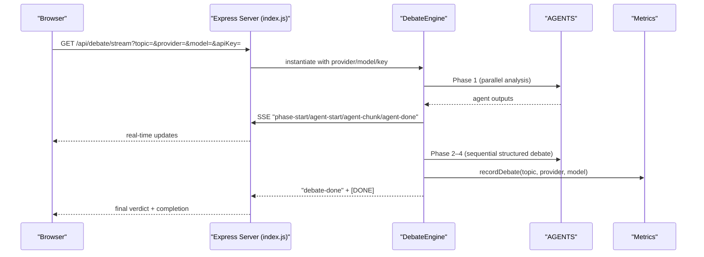
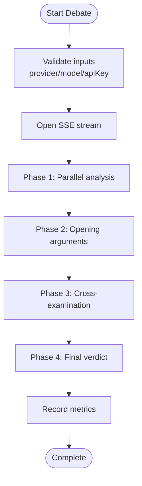
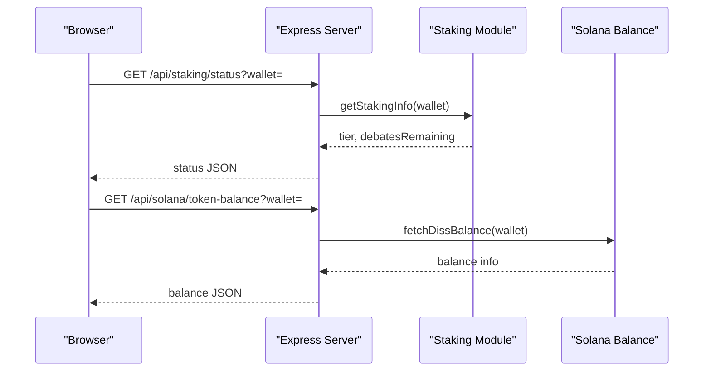
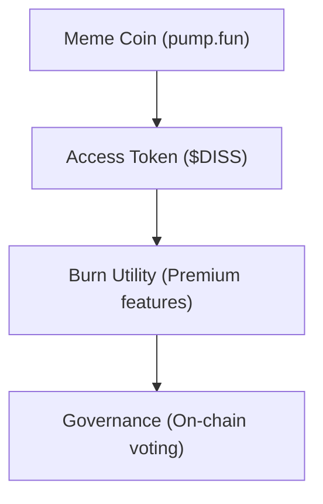
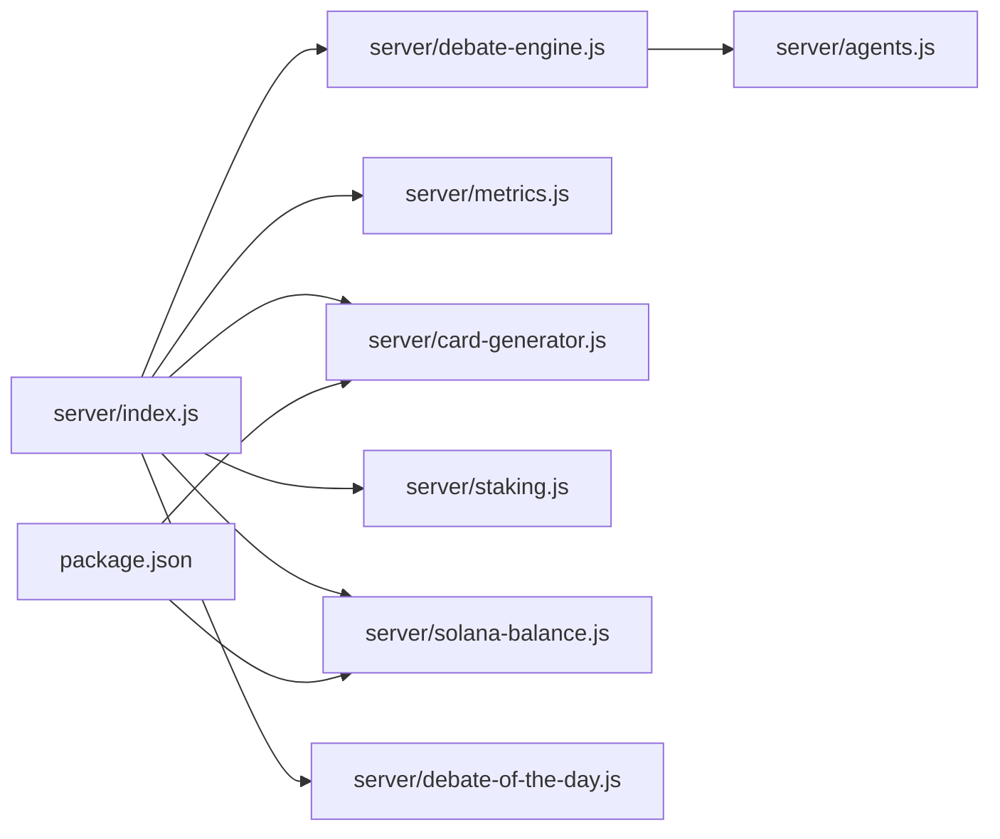

# Competitive Landscape & Positioning

<cite>
**Referenced Files in This Document**
- [competitive-analysis.md](file://competitive-analysis.md)
- [README.md](file://README.md)
- [dissensus-engine/README.md](file://dissensus-engine/README.md)
- [dissensus-engine/package.json](file://dissensus-engine/package.json)
- [dissensus-engine/server/index.js](file://dissensus-engine/server/index.js)
- [dissensus-engine/server/debate-engine.js](file://dissensus-engine/server/debate-engine.js)
- [dissensus-engine/server/agents.js](file://dissensus-engine/server/agents.js)
- [dissensus-engine/server/staking.js](file://dissensus-engine/server/staking.js)
- [dissensus-engine/server/solana-balance.js](file://dissensus-engine/server/solana-balance.js)
- [dissensus-engine/public/index.html](file://dissensus-engine/public/index.html)
- [dissensus-engine/server/debate-of-the-day.js](file://dissensus-engine/server/debate-of-the-day.js)
- [dissensus-engine/server/metrics.js](file://dissensus-engine/server/metrics.js)
- [dissensus-engine/server/card-generator.js](file://dissensus-engine/server/card-generator.js)
- [forum/server.py](file://forum/server.py)
- [diss-launch-kit/website/index.html](file://diss-launch-kit/website/index.html)
- [ROADMAP.md](file://ROADMAP.md)
</cite>

## Table of Contents
1. [Introduction](#introduction)
2. [Project Structure](#project-structure)
3. [Core Components](#core-components)
4. [Architecture Overview](#architecture-overview)
5. [Detailed Component Analysis](#detailed-component-analysis)
6. [Dependency Analysis](#dependency-analysis)
7. [Performance Considerations](#performance-considerations)
8. [Troubleshooting Guide](#troubleshooting-guide)
9. [Conclusion](#conclusion)
10. [Appendices](#appendices)

## Introduction
This document analyzes the Dissensus platform’s competitive positioning in the AI debate and content generation space, with a focus on the AI + blockchain intersection. It documents existing AI debate platforms and content generation tools, highlights Dissensus’s unique advantages (real-time streaming, multi-agent coordination, blockchain integration, dialectical methodology, token-based access control, and social media integration), and outlines a SWOT analysis tailored to the platform’s current and planned capabilities.

## Project Structure
The Dissensus ecosystem comprises:
- A consumer-facing debate engine (Node.js + Express) with real-time streaming and a cyberpunk-themed UI
- A research-backed forum prototype (Python/Flask) that demonstrates web research and structured argument generation
- A landing page and marketing site (static HTML/CSS) for brand awareness and token distribution
- A roadmap that outlines the evolution from meme coin to utility token to governance

**Diagram sources**
- [dissensus-engine/server/index.js:1-481](file://dissensus-engine/server/index.js#L1-L481)
- [dissensus-engine/server/debate-engine.js:1-389](file://dissensus-engine/server/debate-engine.js#L1-L389)
- [dissensus-engine/server/agents.js:1-148](file://dissensus-engine/server/agents.js#L1-L148)
- [dissensus-engine/server/metrics.js:1-152](file://dissensus-engine/server/metrics.js#L1-L152)
- [dissensus-engine/server/card-generator.js:1-361](file://dissensus-engine/server/card-generator.js#L1-L361)
- [dissensus-engine/server/debate-of-the-day.js:1-80](file://dissensus-engine/server/debate-of-the-day.js#L1-L80)
- [dissensus-engine/server/staking.js:1-183](file://dissensus-engine/server/staking.js#L1-L183)
- [dissensus-engine/server/solana-balance.js:1-83](file://dissensus-engine/server/solana-balance.js#L1-L83)
- [dissensus-engine/public/index.html:1-187](file://dissensus-engine/public/index.html#L1-L187)
- [forum/server.py:1-495](file://forum/server.py#L1-L495)
- [diss-launch-kit/website/index.html:1-541](file://diss-launch-kit/website/index.html#L1-L541)

**Section sources**
- [README.md:20-29](file://README.md#L20-L29)
- [dissensus-engine/README.md:110-134](file://dissensus-engine/README.md#L110-L134)

## Core Components
- Debate Engine: Implements a 4-phase dialectical process (Independent Analysis → Opening Arguments → Cross-Examination → Final Verdict) with real-time streaming via Server-Sent Events.
- Agent System: Three named agents (CIPHER, NOVA, PRISM) with distinct reasoning styles and roles.
- Token Integration: Simulated staking tiers and Solana $DISS balance checks; placeholders for on-chain staking program integration.
- Social Sharing: Automated generation of shareable PNG cards optimized for Twitter/X.
- Transparency Dashboard: In-memory metrics for debates, provider usage, and staking aggregates.
- Research Prototype: Python/Flask forum module that performs web research and generates structured argument content.

**Section sources**
- [dissensus-engine/server/debate-engine.js:41-387](file://dissensus-engine/server/debate-engine.js#L41-L387)
- [dissensus-engine/server/agents.js:8-146](file://dissensus-engine/server/agents.js#L8-L146)
- [dissensus-engine/server/staking.js:9-183](file://dissensus-engine/server/staking.js#L9-L183)
- [dissensus-engine/server/solana-balance.js:26-76](file://dissensus-engine/server/solana-balance.js#L26-L76)
- [dissensus-engine/server/card-generator.js:170-361](file://dissensus-engine/server/card-generator.js#L170-L361)
- [dissensus-engine/server/metrics.js:10-152](file://dissensus-engine/server/metrics.js#L10-L152)
- [forum/server.py:69-495](file://forum/server.py#L69-L495)

## Architecture Overview
The platform combines a real-time debate engine with blockchain and social integrations:
- Real-time streaming: SSE endpoints stream debate phases and agent outputs to the browser.
- Multi-agent orchestration: The engine coordinates three agents in parallel during Phase 1 and sequentially for structured phases 2–4.
- Token gating: Simulated staking enforces daily debate limits; Solana balance endpoint reads token holdings.
- Social sharing: Cards are generated server-side and served as downloadable PNGs.
- Transparency: Metrics endpoints expose usage statistics and recent topics.

**Diagram sources**
- [dissensus-engine/server/index.js:220-311](file://dissensus-engine/server/index.js#L220-L311)
- [dissensus-engine/server/debate-engine.js:121-386](file://dissensus-engine/server/debate-engine.js#L121-L386)
- [dissensus-engine/server/metrics.js:46-73](file://dissensus-engine/server/metrics.js#L46-L73)

**Section sources**
- [dissensus-engine/server/index.js:217-311](file://dissensus-engine/server/index.js#L217-L311)
- [dissensus-engine/server/debate-engine.js:121-386](file://dissensus-engine/server/debate-engine.js#L121-L386)

## Detailed Component Analysis

### Competitive Landscape
- Academic and research frameworks dominate theory but are not consumer products.
- Developer-focused frameworks (e.g., AutoGen) require coding and are not consumer-first.
- Consumer products include multi-agent debate councils and debate simulators, but few offer a structured dialectical process, named agents, ranked consensus, or real research integration.
- The market lacks a polished, web-based product enabling users to submit any topic and watch three distinct AI agents debate through a structured dialectical process with ranked consensus output.

**Section sources**
- [competitive-analysis.md:6-34](file://competitive-analysis.md#L6-L34)

### Differentiation Factors
- Consumer-first design: No coding required; users simply enter a topic and watch the debate unfold.
- Structured dialectical methodology: 4-phase process mirroring academic/legal debate structure.
- Named agents with distinct personalities and reasoning approaches.
- Ranked consensus with confidence levels and transparent remaining disagreements.
- Real research integration and transparency of process.
- Domain awareness (crypto/Web3) integrated into agent reasoning.

**Section sources**
- [competitive-analysis.md:95-130](file://competitive-analysis.md#L95-L130)

### Technology Stack and User Experience
- Backend: Node.js + Express with SSE for real-time streaming.
- Frontend: Static HTML/CSS/JS with a cyberpunk theme; integrates wallet connect and debate controls.
- Providers: OpenAI, DeepSeek, Google Gemini; server-side keys optional for production.
- Blockchain: Solana $DISS balance checks; staking module simulates tiers; on-chain staking program ID placeholder for future integration.
- Social integration: Shareable PNG cards for Twitter/X.

**Section sources**
- [dissensus-engine/package.json:10-19](file://dissensus-engine/package.json#L10-L19)
- [dissensus-engine/README.md:22-34](file://dissensus-engine/README.md#L22-L34)
- [dissensus-engine/server/index.js:69-85](file://dissensus-engine/server/index.js#L69-L85)
- [dissensus-engine/public/index.html:44-97](file://dissensus-engine/public/index.html#L44-L97)

### Real-Time Streaming and Multi-Agent Coordination
- SSE endpoints stream structured debate phases and agent outputs in real time.
- Parallel processing in Phase 1; sequential structured phases 2–4 ensure coherent narrative and synthesis.
- Frontend renders agent-specific columns and a shared verdict panel.

**Diagram sources**
- [dissensus-engine/server/debate-engine.js:121-386](file://dissensus-engine/server/debate-engine.js#L121-L386)
- [dissensus-engine/server/index.js:220-311](file://dissensus-engine/server/index.js#L220-L311)

**Section sources**
- [dissensus-engine/server/debate-engine.js:121-386](file://dissensus-engine/server/debate-engine.js#L121-L386)
- [dissensus-engine/public/index.html:119-180](file://dissensus-engine/public/index.html#L119-L180)

### Token-Based Access Control and Blockchain Integration
- Simulated staking tiers with daily debate limits; wallet normalization and enforcement configurable via environment variable.
- Solana $DISS balance endpoint reads SPL token balances server-side to avoid leaking RPC keys.
- On-chain staking program ID placeholder indicates future integration.

**Diagram sources**
- [dissensus-engine/server/staking.js:43-79](file://dissensus-engine/server/staking.js#L43-L79)
- [dissensus-engine/server/solana-balance.js:26-76](file://dissensus-engine/server/solana-balance.js#L26-L76)
- [dissensus-engine/server/index.js:328-355](file://dissensus-engine/server/index.js#L328-L355)
- [dissensus-engine/server/index.js:98-111](file://dissensus-engine/server/index.js#L98-L111)

**Section sources**
- [dissensus-engine/server/staking.js:9-183](file://dissensus-engine/server/staking.js#L9-L183)
- [dissensus-engine/server/solana-balance.js:26-76](file://dissensus-engine/server/solana-balance.js#L26-L76)
- [dissensus-engine/server/index.js:324-355](file://dissensus-engine/server/index.js#L324-L355)

### Social Media Integration
- Shareable PNG cards generated server-side using Satori and Resvg, optimized for Twitter/X.
- Cards include topic, summary, top picks (if any), conviction label, and optional crypto disclaimer.

**Section sources**
- [dissensus-engine/server/card-generator.js:170-361](file://dissensus-engine/server/card-generator.js#L170-L361)
- [dissensus-engine/server/index.js:382-416](file://dissensus-engine/server/index.js#L382-L416)

### Research and Content Generation
- The forum prototype demonstrates web research, topic analysis, and structured argument generation aligned with agent roles.
- This complements the debate engine by providing a research foundation for agent reasoning.

**Section sources**
- [forum/server.py:69-495](file://forum/server.py#L69-L495)

### Transparency and Metrics
- Public metrics dashboard exposes debate counts, provider usage, and staking aggregates.
- Recent topics endpoint supports dashboards and analytics.

**Section sources**
- [dissensus-engine/server/metrics.js:100-152](file://dissensus-engine/server/metrics.js#L100-L152)
- [dissensus-engine/server/index.js:429-445](file://dissensus-engine/server/index.js#L429-L445)

### Conceptual Overview
The platform’s vision is to evolve from a meme coin to an access token, then to a governance token, while delivering real utility through AI-powered debate and analysis.

[No sources needed since this diagram shows conceptual workflow, not actual code structure]

**Section sources**
- [diss-launch-kit/website/index.html:307-354](file://diss-launch-kit/website/index.html#L307-L354)
- [ROADMAP.md:1-156](file://ROADMAP.md#L1-L156)

## Dependency Analysis
- External providers: OpenAI, DeepSeek, Google Gemini; configurable via environment variables.
- Blockchain: Solana web3.js and spl-token libraries for balance queries.
- Rendering: Satori and Resvg for server-side card generation.
- Security: Helmet and rate limiting middleware; trust-proxy configuration for reverse proxies.

**Diagram sources**
- [dissensus-engine/server/index.js:1-481](file://dissensus-engine/server/index.js#L1-L481)
- [dissensus-engine/server/debate-engine.js:1-389](file://dissensus-engine/server/debate-engine.js#L1-L389)
- [dissensus-engine/server/agents.js:1-148](file://dissensus-engine/server/agents.js#L1-L148)
- [dissensus-engine/server/metrics.js:1-152](file://dissensus-engine/server/metrics.js#L1-L152)
- [dissensus-engine/server/card-generator.js:1-361](file://dissensus-engine/server/card-generator.js#L1-L361)
- [dissensus-engine/server/staking.js:1-183](file://dissensus-engine/server/staking.js#L1-L183)
- [dissensus-engine/server/solana-balance.js:1-83](file://dissensus-engine/server/solana-balance.js#L1-L83)
- [dissensus-engine/server/debate-of-the-day.js:1-80](file://dissensus-engine/server/debate-of-the-day.js#L1-L80)
- [dissensus-engine/package.json:10-19](file://dissensus-engine/package.json#L10-L19)

**Section sources**
- [dissensus-engine/package.json:10-19](file://dissensus-engine/package.json#L10-L19)
- [dissensus-engine/server/index.js:49-56](file://dissensus-engine/server/index.js#L49-L56)

## Performance Considerations
- SSE streaming: Efficient for real-time updates; ensure client-side buffering and error handling.
- Provider latency and cost: Choose providers/models based on cost/performance trade-offs; server-side keys reduce client overhead.
- Rate limiting: Prevents abuse; tune thresholds per environment.
- Rendering: Card generation uses CPU-intensive SVG→PNG conversion; consider caching or CDN for frequently shared cards.
- Blockchain queries: Balance frequency of $DISS balance checks; cache where appropriate.

[No sources needed since this section provides general guidance]

## Troubleshooting Guide
Common issues and mitigations:
- Invalid wallet or key errors: Validate inputs and handle INVALID_WALLET/INVALID_KEY codes from Solana balance endpoint.
- API key configuration: Ensure server-side keys are set in .env for production; otherwise clients must provide keys.
- Rate limiting: If encountering Too Many Requests, reduce request frequency or adjust limits.
- Trust proxy: Misconfiguration can cause unexpected X-Forwarded-For errors; verify TRUST_PROXY and TRUST_PROXY_HOPS.

**Section sources**
- [dissensus-engine/server/index.js:98-111](file://dissensus-engine/server/index.js#L98-L111)
- [dissensus-engine/server/index.js:157-215](file://dissensus-engine/server/index.js#L157-L215)
- [dissensus-engine/server/solana-balance.js:28-44](file://dissensus-engine/server/solana-balance.js#L28-L44)

## Conclusion
Dissensus occupies a unique niche at the intersection of AI debate, blockchain, and social media. Its structured dialectical methodology, real-time streaming, named agents, ranked consensus, and token-based access control differentiate it from academic frameworks, developer tools, and simple debate scripts. The platform’s roadmap aligns token utility with platform access and governance, positioning $DISS as more than a meme coin. While competition remains nascent in the consumer space, Dissensus’s combination of innovation and practical utility creates a strong foundation for market leadership.

[No sources needed since this section summarizes without analyzing specific files]

## Appendices

### SWOT Analysis: AI + Blockchain Intersection
- Strengths
  - Unique 4-phase dialectical process with named agents and ranked consensus
  - Real-time streaming and transparent reasoning chain
  - Token-based access control and Solana integration
  - Social sharing via shareable cards
- Weaknesses
  - Simulated staking and Solana integration placeholders
  - Reliance on external AI providers and associated costs
  - Limited to web-based deployment; mobile UX still evolving
- Opportunities
  - Expand provider integrations and model choices
  - Introduce on-chain staking program and governance
  - Develop premium features with burn mechanics
  - Broaden domain expertise beyond crypto/Web3
- Threats
  - Emerging AI debate tools and frameworks
  - Provider API changes and cost increases
  - Regulatory shifts affecting token/utility evolution

**Section sources**
- [competitive-analysis.md:95-130](file://competitive-analysis.md#L95-L130)
- [dissensus-engine/README.md:22-34](file://dissensus-engine/README.md#L22-L34)
- [diss-launch-kit/website/index.html:307-354](file://diss-launch-kit/website/index.html#L307-L354)
- [ROADMAP.md:1-156](file://ROADMAP.md#L1-L156)