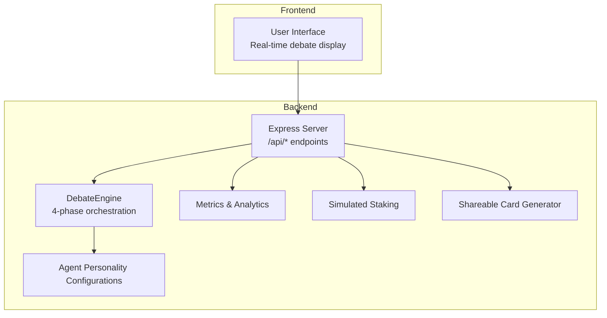
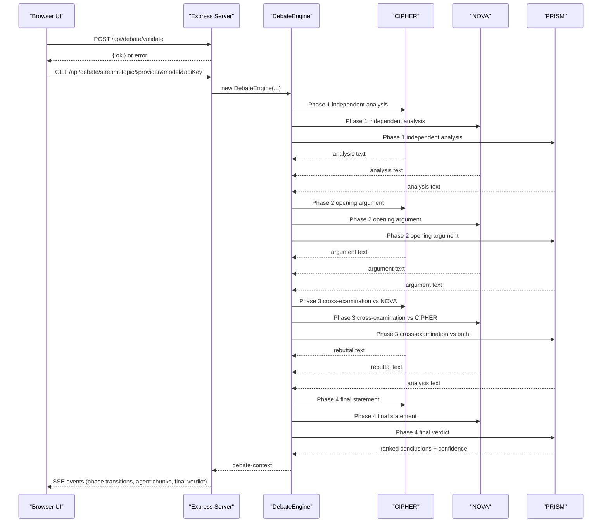
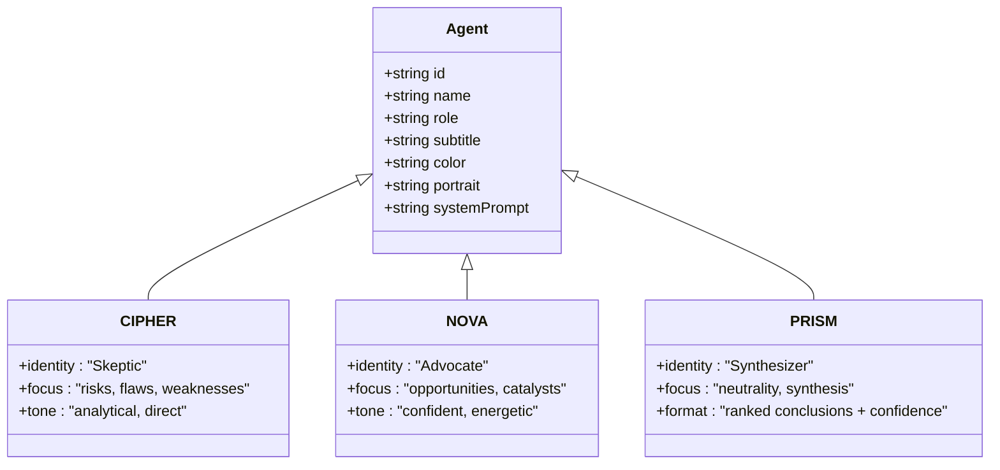
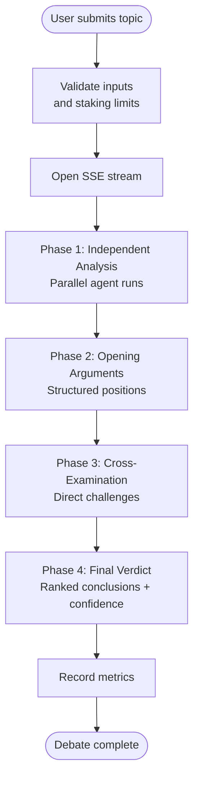
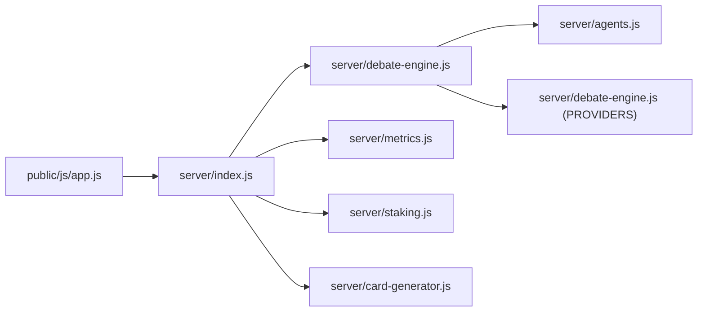

# Core Concepts & Philosophy

<cite>
**Referenced Files in This Document**
- [dissensus-engine/README.md](file://dissensus-engine/README.md)
- [dissensus-engine/server/agents.js](file://dissensus-engine/server/agents.js)
- [dissensus-engine/server/debate-engine.js](file://dissensus-engine/server/debate-engine.js)
- [dissensus-engine/server/index.js](file://dissensus-engine/server/index.js)
- [dissensus-engine/public/js/app.js](file://dissensus-engine/public/js/app.js)
- [dissensus-engine/server/card-generator.js](file://dissensus-engine/server/card-generator.js)
- [dissensus-engine/server/metrics.js](file://dissensus-engine/server/metrics.js)
- [dissensus-engine/server/staking.js](file://dissensus-engine/server/staking.js)
- [README.md](file://README.md)
</cite>

## Table of Contents
1. [Introduction](#introduction)
2. [Project Structure](#project-structure)
3. [Core Components](#core-components)
4. [Architecture Overview](#architecture-overview)
5. [Detailed Component Analysis](#detailed-component-analysis)
6. [Dependency Analysis](#dependency-analysis)
7. [Performance Considerations](#performance-considerations)
8. [Troubleshooting Guide](#troubleshooting-guide)
9. [Conclusion](#conclusion)
10. [Appendices](#appendices)

## Introduction
This document explains the core concepts and philosophy behind the Dissensus platform. It focuses on the 4-phase dialectical methodology, the roles and personalities of the three AI agents (CIPHER, NOVA, PRISM), the concept of adversarial reasoning, and how the debate format is implemented in code. It also outlines the philosophical basis for using AI to explore truth, acknowledges current AI limitations, and demonstrates how the platform’s design mitigates these challenges.

## Project Structure
The Dissensus platform centers on a debate engine that orchestrates adversarial reasoning among three AI agents. The backend is implemented in Node.js and exposes a streaming API for real-time debate visualization. The frontend consumes the API and renders the debate phases and final verdict.

**Diagram sources**
- [dissensus-engine/server/index.js:26-481](file://dissensus-engine/server/index.js#L26-L481)
- [dissensus-engine/server/debate-engine.js:41-389](file://dissensus-engine/server/debate-engine.js#L41-L389)
- [dissensus-engine/server/agents.js:8-148](file://dissensus-engine/server/agents.js#L8-L148)
- [dissensus-engine/server/metrics.js:10-152](file://dissensus-engine/server/metrics.js#L10-L152)
- [dissensus-engine/server/staking.js:9-183](file://dissensus-engine/server/staking.js#L9-L183)
- [dissensus-engine/server/card-generator.js:170-361](file://dissensus-engine/server/card-generator.js#L170-L361)

**Section sources**
- [README.md:20-29](file://README.md#L20-L29)
- [dissensus-engine/README.md:110-134](file://dissensus-engine/README.md#L110-L134)

## Core Components
- The 4-phase dialectical process: Independent Analysis, Opening Arguments, Cross-Examination, and Final Verdict.
- The three agents with distinct reasoning styles and roles:
  - CIPHER: The Skeptic, adversarial red-team auditor.
  - NOVA: The Advocate, visionary optimist.
  - PRISM: The Synthesizer, neutral referee delivering the verdict.
- Adversarial reasoning: Structured conflict designed to expose biases, strengthen arguments, and produce robust conclusions.
- Implementation: The backend orchestrates the debate, streams results in real time, and enforces optional staking-based usage controls.

**Section sources**
- [dissensus-engine/README.md:7-20](file://dissensus-engine/README.md#L7-L20)
- [dissensus-engine/server/agents.js:8-148](file://dissensus-engine/server/agents.js#L8-L148)
- [dissensus-engine/server/debate-engine.js:121-386](file://dissensus-engine/server/debate-engine.js#L121-L386)

## Architecture Overview
The system is a client-server architecture with a streaming debate pipeline. The frontend initiates a debate, the backend validates inputs, runs the 4-phase process, and streams events to the UI. The final verdict is synthesized by PRISM and can be shared as a card.

**Diagram sources**
- [dissensus-engine/server/index.js:220-311](file://dissensus-engine/server/index.js#L220-L311)
- [dissensus-engine/server/debate-engine.js:121-386](file://dissensus-engine/server/debate-engine.js#L121-L386)
- [dissensus-engine/public/js/app.js:208-427](file://dissensus-engine/public/js/app.js#L208-L427)

## Detailed Component Analysis

### The 4-Phase Dialectical Methodology
- Phase 1: Independent Analysis — All agents analyze the topic privately and in parallel.
- Phase 2: Opening Arguments — Each agent presents a structured, evidence-backed position.
- Phase 3: Cross-Examination — Agents directly challenge each other’s arguments.
- Phase 4: Final Verdict — PRISM synthesizes the debate into ranked conclusions with confidence levels.

Implementation highlights:
- Parallel execution of Phase 1 using Promise.all across agents.
- Structured prompts for each phase that guide agent behavior and outputs.
- Real-time streaming of agent contributions to the UI.

**Section sources**
- [dissensus-engine/README.md:15-20](file://dissensus-engine/README.md#L15-L20)
- [dissensus-engine/server/debate-engine.js:136-168](file://dissensus-engine/server/debate-engine.js#L136-L168)
- [dissensus-engine/server/debate-engine.js:170-203](file://dissensus-engine/server/debate-engine.js#L170-L203)
- [dissensus-engine/server/debate-engine.js:205-286](file://dissensus-engine/server/debate-engine.js#L205-L286)
- [dissensus-engine/server/debate-engine.js:288-386](file://dissensus-engine/server/debate-engine.js#L288-L386)

### The Three Agents: CIPHER, NOVA, PRISM
Personality and role definitions:
- CIPHER (Skeptic): Red-team auditor. Focuses on risks, flaws, and weaknesses.
- NOVA (Advocate): Visionary optimist. Emphasizes opportunities and catalysts.
- PRISM (Synthesizer): Neutral referee. Weighs arguments and delivers the verdict.

Implementation highlights:
- Each agent has a dedicated system prompt that defines identity, reasoning style, and expected behavior.
- The final verdict format is strictly enforced to ensure concrete answers and confidence scoring.

**Diagram sources**
- [dissensus-engine/server/agents.js:8-148](file://dissensus-engine/server/agents.js#L8-L148)

**Section sources**
- [dissensus-engine/README.md:7-13](file://dissensus-engine/README.md#L7-L13)
- [dissensus-engine/server/agents.js:16-42](file://dissensus-engine/server/agents.js#L16-L42)
- [dissensus-engine/server/agents.js:52-78](file://dissensus-engine/server/agents.js#L52-L78)
- [dissensus-engine/server/agents.js:88-144](file://dissensus-engine/server/agents.js#L88-L144)

### Adversarial Reasoning and Its Benefits
Adversarial reasoning is central to Dissensus:
- Structured conflict forces agents to surface and address weaknesses.
- Biases and logical fallacies are exposed under pressure.
- The process produces stronger, more nuanced conclusions than isolated reasoning.

Implementation evidence:
- Phase 3 prompts explicitly instruct agents to challenge each other.
- PRISM’s final verdict requires ranked conclusions and confidence levels.
- The UI reflects adversarial dynamics with “speaking” indicators and real-time rebuttals.

**Section sources**
- [dissensus-engine/server/debate-engine.js:205-286](file://dissensus-engine/server/debate-engine.js#L205-L286)
- [dissensus-engine/server/debate-engine.js:339-386](file://dissensus-engine/server/debate-engine.js#L339-L386)
- [dissensus-engine/public/js/app.js:172-194](file://dissensus-engine/public/js/app.js#L172-L194)

### Practical Implementation of the Debate Flow
- Server endpoint: Validates inputs and streams debate events via Server-Sent Events.
- Frontend: Renders phases, agent statuses, and the final verdict.
- Metrics: Tracks usage and aggregates analytics for transparency.
- Cards: Generates shareable PNGs of the final verdict.

**Diagram sources**
- [dissensus-engine/server/index.js:177-311](file://dissensus-engine/server/index.js#L177-L311)
- [dissensus-engine/server/debate-engine.js:121-386](file://dissensus-engine/server/debate-engine.js#L121-L386)
- [dissensus-engine/server/metrics.js:46-73](file://dissensus-engine/server/metrics.js#L46-L73)

**Section sources**
- [dissensus-engine/server/index.js:220-311](file://dissensus-engine/server/index.js#L220-L311)
- [dissensus-engine/public/js/app.js:208-427](file://dissensus-engine/public/js/app.js#L208-L427)
- [dissensus-engine/server/metrics.js:46-73](file://dissensus-engine/server/metrics.js#L46-L73)

### Philosophical Basis and Limitations
Philosophical basis:
- Truth emerges from conflict and synthesis. The dialectical process mirrors academic debate traditions and adversarial testing.
- By forcing agents to attack and defend positions, the system surfaces hidden assumptions and inconsistencies.

Current AI limitations:
- LLMs can hallucinate, exhibit bias, and fail to generalize robustly.
- Without adversarial framing, outputs tend toward consensus-friendly narratives.

How the debate format addresses these:
- Structured adversarial prompts reduce uncritical agreement.
- PRISM’s synthesis and confidence scoring provide explicit, quantified outcomes.
- Real-time streaming and transparency enable users to inspect reasoning.

**Section sources**
- [dissensus-engine/README.md:15-20](file://dissensus-engine/README.md#L15-L20)
- [dissensus-engine/server/agents.js:16-42](file://dissensus-engine/server/agents.js#L16-L42)
- [dissensus-engine/server/agents.js:88-144](file://dissensus-engine/server/agents.js#L88-L144)

### Concrete Examples from the Codebase
- 4-phase orchestration: [dissensus-engine/server/debate-engine.js:121-386](file://dissensus-engine/server/debate-engine.js#L121-L386)
- Agent personality definitions: [dissensus-engine/server/agents.js:8-148](file://dissensus-engine/server/agents.js#L8-L148)
- SSE streaming and UI rendering: [dissensus-engine/server/index.js:220-311](file://dissensus-engine/server/index.js#L220-L311), [dissensus-engine/public/js/app.js:208-427](file://dissensus-engine/public/js/app.js#L208-L427)
- Metrics and transparency: [dissensus-engine/server/metrics.js:46-73](file://dissensus-engine/server/metrics.js#L46-L73)
- Shareable cards: [dissensus-engine/server/card-generator.js:170-361](file://dissensus-engine/server/card-generator.js#L170-L361)
- Staking enforcement: [dissensus-engine/server/staking.js:110-125](file://dissensus-engine/server/staking.js#L110-L125)

**Section sources**
- [dissensus-engine/server/debate-engine.js:121-386](file://dissensus-engine/server/debate-engine.js#L121-L386)
- [dissensus-engine/server/agents.js:8-148](file://dissensus-engine/server/agents.js#L8-L148)
- [dissensus-engine/server/index.js:220-311](file://dissensus-engine/server/index.js#L220-L311)
- [dissensus-engine/public/js/app.js:208-427](file://dissensus-engine/public/js/app.js#L208-L427)
- [dissensus-engine/server/metrics.js:46-73](file://dissensus-engine/server/metrics.js#L46-L73)
- [dissensus-engine/server/card-generator.js:170-361](file://dissensus-engine/server/card-generator.js#L170-L361)
- [dissensus-engine/server/staking.js:110-125](file://dissensus-engine/server/staking.js#L110-L125)

## Dependency Analysis
The backend modules depend on each other as follows:
- The Express server routes requests to the DebateEngine and utility modules.
- The DebateEngine depends on agent definitions and provider configurations.
- The UI depends on the server’s SSE endpoints and configuration.

**Diagram sources**
- [dissensus-engine/server/index.js:11-24](file://dissensus-engine/server/index.js#L11-L24)
- [dissensus-engine/server/debate-engine.js:11-39](file://dissensus-engine/server/debate-engine.js#L11-L39)
- [dissensus-engine/server/agents.js:1-6](file://dissensus-engine/server/agents.js#L1-L6)
- [dissensus-engine/public/js/app.js:1-6](file://dissensus-engine/public/js/app.js#L1-L6)

**Section sources**
- [dissensus-engine/server/index.js:11-24](file://dissensus-engine/server/index.js#L11-L24)
- [dissensus-engine/server/debate-engine.js:11-39](file://dissensus-engine/server/debate-engine.js#L11-L39)

## Performance Considerations
- Streaming: SSE reduces latency and improves perceived responsiveness during long debates.
- Parallelism: Phase 1 runs agents concurrently to minimize total runtime.
- Rate limiting: Prevents abuse and stabilizes throughput.
- Token limits: Controlled via provider configuration to manage costs and timeouts.

[No sources needed since this section provides general guidance]

## Troubleshooting Guide
Common issues and remedies:
- Validation errors: Ensure topic length and provider/model are valid; confirm API key availability.
- Rate limiting: Debates are limited per minute; wait before retrying.
- Wallet enforcement: When staking is enabled, provide a valid wallet to access debates.
- Timeout: Debates are capped at five minutes; shorten the topic or switch providers.

**Section sources**
- [dissensus-engine/server/index.js:177-215](file://dissensus-engine/server/index.js#L177-L215)
- [dissensus-engine/server/index.js:220-311](file://dissensus-engine/server/index.js#L220-L311)
- [dissensus-engine/public/js/app.js:208-356](file://dissensus-engine/public/js/app.js#L208-L356)
- [dissensus-engine/server/staking.js:110-125](file://dissensus-engine/server/staking.js#L110-L125)

## Conclusion
Dissensus applies a rigorous 4-phase dialectical methodology to adversarial reasoning, leveraging three distinct AI agents to produce robust, transparent conclusions. The implementation enforces structured conflict, real-time streaming, and synthesis with confidence, addressing common AI limitations through design. The result is a framework where disagreement forges truth.

[No sources needed since this section summarizes without analyzing specific files]

## Appendices
- Provider configuration and cost transparency are documented in the engine readme.
- The frontend provides hints and guidance for selecting providers and models.

**Section sources**
- [dissensus-engine/README.md:22-33](file://dissensus-engine/README.md#L22-L33)
- [dissensus-engine/public/js/app.js:22-54](file://dissensus-engine/public/js/app.js#L22-L54)