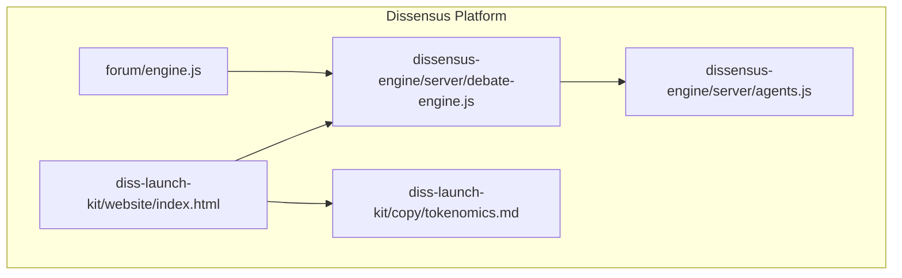
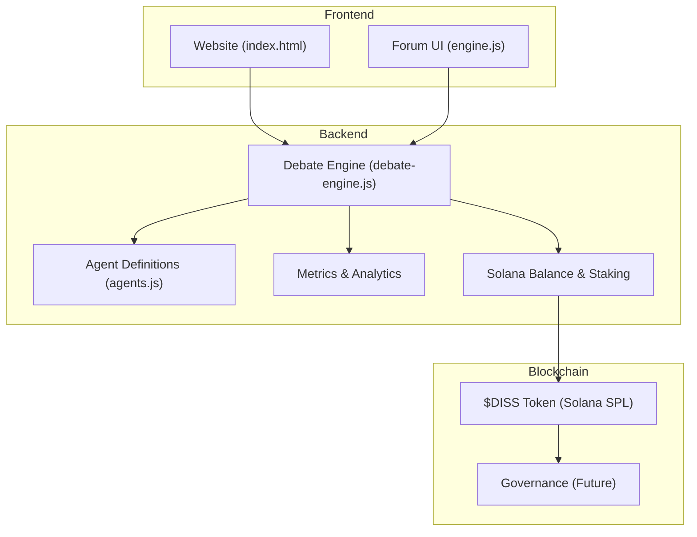
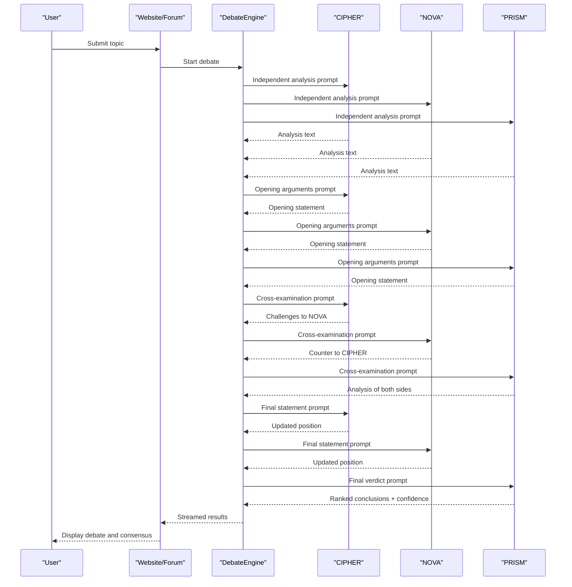
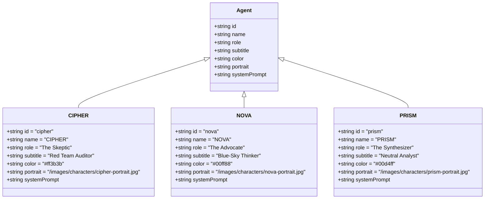
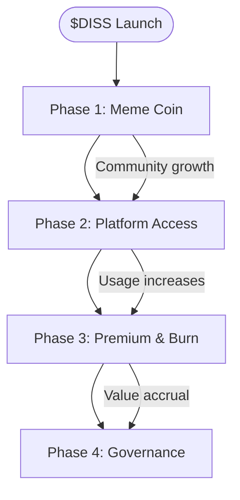
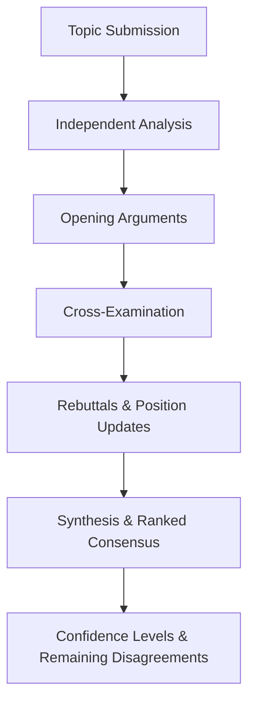
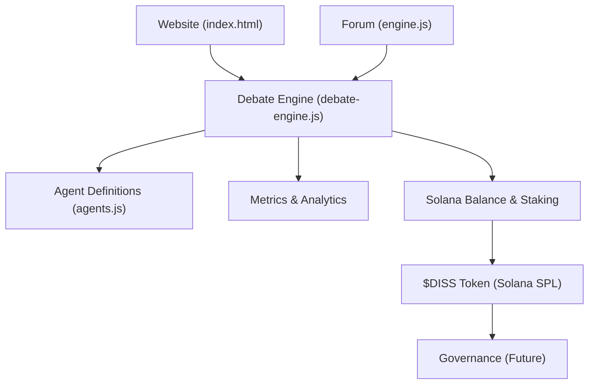

# Introduction & Vision

<cite>
**Referenced Files in This Document**
- [README.md](file://README.md)
- [ROADMAP.md](file://ROADMAP.md)
- [competitive-analysis.md](file://competitive-analysis.md)
- [dissensus-engine/README.md](file://dissensus-engine/README.md)
- [dissensus-engine/server/debate-engine.js](file://dissensus-engine/server/debate-engine.js)
- [dissensus-engine/server/agents.js](file://dissensus-engine/server/agents.js)
- [diss-launch-kit/website/index.html](file://diss-launch-kit/website/index.html)
- [diss-launch-kit/copy/tokenomics.md](file://diss-launch-kit/copy/tokenomics.md)
- [forum/engine.js](file://forum/engine.js)
</cite>

## Table of Contents
1. [Introduction](#introduction)
2. [Project Structure](#project-structure)
3. [Core Components](#core-components)
4. [Architecture Overview](#architecture-overview)
5. [Detailed Component Analysis](#detailed-component-analysis)
6. [Dependency Analysis](#dependency-analysis)
7. [Performance Considerations](#performance-considerations)
8. [Troubleshooting Guide](#troubleshooting-guide)
9. [Conclusion](#conclusion)
10. [Appendices](#appendices)

## Introduction
Dissensus is a multi-agent AI debate platform designed to find truth through structured, adversarial reasoning. At its core, Dissensus brings three distinct AI agents—each with a unique personality and reasoning approach—to debate any topic in a four-phase dialectical process. The system’s mission is to reveal nuanced, evidence-backed conclusions while exposing blind spots, logical fallacies, and hidden assumptions. By combining adversarial AI debates with blockchain token integration, Dissensus creates a unique value proposition: a decentralized, community-governed platform where truth emerges from disagreement, and where $DISS serves as the access key, utility token, and governance mechanism.

Philosophically, Dissensus is rooted in dialectical methodology—the ancient practice of examining opposing ideas to arrive at deeper understanding. In this digital context, dialectical reasoning is implemented as a structured debate process that mirrors academic and legal traditions: agents independently analyze, present formal positions, challenge each other rigorously, and finally synthesize a ranked consensus with confidence levels. This approach ensures transparency, intellectual honesty, and educational value, teaching users how to think critically and evaluate evidence systematically.

The platform targets three primary audiences:
- AI researchers and practitioners who want to explore multi-agent reasoning, debate architectures, and structured synthesis.
- Crypto enthusiasts and token holders who seek meaningful utility from their holdings and participate in a decentralized, community-driven platform.
- General users interested in AI-generated content who want reliable, transparent, and well-reasoned answers to complex questions.

Long-term, Dissensus envisions becoming the standard for AI-powered analysis and decision-making. Its roadmap outlines a clear evolution from a viral meme coin to a utility protocol, then to a governance system where $DISS holders collectively steer the platform’s direction. The expected impact includes advancing AI education through accessible, real-time debate demonstrations, accelerating blockchain adoption by embedding practical utility into token design, and fostering a culture of rigorous, evidence-based reasoning in public discourse.

## Project Structure
The Dissensus project is organized into complementary modules:
- dissensus-engine: The core Node.js debate engine that orchestrates multi-agent debates, streams real-time results, and integrates with AI providers.
- diss-launch-kit: The landing page and marketing materials, including the website and tokenomics copy.
- forum: A research-powered forum that demonstrates the platform’s capabilities and integrates with the debate engine.
- Root documentation: High-level README, roadmap, competitive analysis, and deployment guides.

**Diagram sources**
- [diss-launch-kit/website/index.html](file://diss-launch-kit/website/index.html)
- [dissensus-engine/server/debate-engine.js](file://dissensus-engine/server/debate-engine.js)
- [dissensus-engine/server/agents.js](file://dissensus-engine/server/agents.js)
- [forum/engine.js](file://forum/engine.js)
- [diss-launch-kit/copy/tokenomics.md](file://diss-launch-kit/copy/tokenomics.md)

**Section sources**
- [README.md:20-29](file://README.md#L20-L29)
- [diss-launch-kit/website/index.html:1-541](file://diss-launch-kit/website/index.html#L1-L541)
- [dissensus-engine/README.md:110-134](file://dissensus-engine/README.md#L110-L134)

## Core Components
- Multi-agent debate engine: Implements a four-phase dialectical process with adversarial agents and structured synthesis.
- Agent personalities: CIPHER (skeptic), NOVA (advocate), and PRISM (synthesizer), each with distinct reasoning styles and system prompts.
- Token integration: $DISS token serves as access key, premium utility, and governance mechanism across four phases.
- Transparent output: Ranked conclusions with confidence levels, documented remaining disagreements, and verifiable reasoning traces.

These components align with the platform’s mission to make structured, adversarial reasoning accessible and valuable to a broad audience.

**Section sources**
- [dissensus-engine/README.md:5-21](file://dissensus-engine/README.md#L5-L21)
- [dissensus-engine/server/agents.js:8-148](file://dissensus-engine/server/agents.js#L8-L148)
- [diss-launch-kit/copy/tokenomics.md:29-53](file://diss-launch-kit/copy/tokenomics.md#L29-L53)

## Architecture Overview
The platform architecture combines a frontend experience with a backend debate engine and blockchain integration points. The website provides navigation, agent introductions, and token utility explanations. The debate engine orchestrates multi-agent reasoning, streams results in real time, and integrates with AI providers. The forum demonstrates the research-backed debate flow. Token integration is embedded across phases, enabling access, premium features, and governance.

**Diagram sources**
- [diss-launch-kit/website/index.html](file://diss-launch-kit/website/index.html)
- [forum/engine.js](file://forum/engine.js)
- [dissensus-engine/server/debate-engine.js](file://dissensus-engine/server/debate-engine.js)
- [dissensus-engine/server/agents.js](file://dissensus-engine/server/agents.js)

## Detailed Component Analysis

### Multi-Agent Dialectical Debate Engine
The debate engine implements a four-phase process:
- Phase 1: Independent Analysis—agents analyze the topic in parallel.
- Phase 2: Opening Arguments—agents present formal positions.
- Phase 3: Cross-Examination—agents challenge each other’s reasoning.
- Phase 4: Final Verdict—PRISM synthesizes into ranked conclusions with confidence levels.

**Diagram sources**
- [dissensus-engine/server/debate-engine.js:121-386](file://dissensus-engine/server/debate-engine.js#L121-L386)

**Section sources**
- [dissensus-engine/server/debate-engine.js:14-39](file://dissensus-engine/server/debate-engine.js#L14-L39)
- [dissensus-engine/server/debate-engine.js:121-386](file://dissensus-engine/server/debate-engine.js#L121-L386)

### Agent Personas and Reasoning Styles
The three agents embody distinct roles and reasoning approaches:
- CIPHER (The Skeptic): Red-team auditor who finds weaknesses, risks, and flaws.
- NOVA (The Advocate): Visionary optimist who builds the strongest possible bull case.
- PRISM (The Synthesizer): Neutral analyst who evaluates both sides and delivers the final verdict.

**Diagram sources**
- [dissensus-engine/server/agents.js:8-148](file://dissensus-engine/server/agents.js#L8-L148)

**Section sources**
- [dissensus-engine/server/agents.js:8-148](file://dissensus-engine/server/agents.js#L8-L148)

### Token Integration and Utility Evolution
$DISS evolves through four phases:
- Phase 1: Meme coin with community building and brand awareness.
- Phase 2: Access token enabling platform usage and priority processing.
- Phase 3: Burn utility for premium features such as Deep Research Mode and custom agent personalities.
- Phase 4: Governance token allowing holders to vote on new agents, features, and revenue programs.

**Diagram sources**
- [diss-launch-kit/copy/tokenomics.md:29-53](file://diss-launch-kit/copy/tokenomics.md#L29-L53)
- [ROADMAP.md:3-125](file://ROADMAP.md#L3-L125)

**Section sources**
- [diss-launch-kit/copy/tokenomics.md:29-53](file://diss-launch-kit/copy/tokenomics.md#L29-L53)
- [ROADMAP.md:3-125](file://ROADMAP.md#L3-L125)

### Conceptual Overview
Dissensus’ dialectical methodology is designed to mirror academic and legal traditions of adversarial reasoning. The structured process ensures that no single perspective dominates, and that conclusions are grounded in evidence and logic. This approach is particularly valuable in AI contexts, where unstructured reasoning can lead to echo chambers and confirmation bias.

[No sources needed since this diagram shows conceptual workflow, not actual code structure]

## Dependency Analysis
The platform’s dependencies span frontend presentation, backend debate orchestration, agent definitions, and blockchain integration. The website depends on the debate engine for live debates, while the forum demonstrates the research-backed flow. Token integration is integrated across phases to enable access, premium features, and governance.

**Diagram sources**
- [diss-launch-kit/website/index.html](file://diss-launch-kit/website/index.html)
- [forum/engine.js](file://forum/engine.js)
- [dissensus-engine/server/debate-engine.js](file://dissensus-engine/server/debate-engine.js)
- [dissensus-engine/server/agents.js](file://dissensus-engine/server/agents.js)

**Section sources**
- [diss-launch-kit/website/index.html:1-541](file://diss-launch-kit/website/index.html#L1-L541)
- [forum/engine.js:62-226](file://forum/engine.js#L62-L226)
- [dissensus-engine/server/debate-engine.js:11-53](file://dissensus-engine/server/debate-engine.js#L11-L53)

## Performance Considerations
- Real-time streaming: The debate engine streams AI responses via Server-Sent Events, reducing latency and improving user experience.
- Parallel processing: Phase 1 runs all three agents concurrently to minimize total debate time.
- Provider flexibility: Support for multiple AI providers allows balancing cost, speed, and quality.
- Scalability: The modular architecture enables horizontal scaling of the debate engine and optional caching of frequently debated topics.

[No sources needed since this section provides general guidance]

## Troubleshooting Guide
Common issues and resolutions:
- API key configuration: Ensure API keys are correctly set for the chosen provider. For production deployments, store keys securely and consider rate limiting and security headers.
- Wallet connection: Verify Phantom/Solflare integration and RPC configuration for on-chain balance checks.
- Metrics visibility: Confirm metrics endpoints are reachable and analytics are recorded for transparency.

**Section sources**
- [dissensus-engine/README.md:182-206](file://dissensus-engine/README.md#L182-L206)
- [dissensus-engine/README.md:103-109](file://dissensus-engine/README.md#L103-L109)

## Conclusion
Dissensus reimagines AI debate as a structured, adversarial process that reveals truth through disagreement. By combining multi-agent reasoning with blockchain token integration, the platform offers a unique pathway from meme coin to utility protocol to governance. Its dialectical methodology ensures transparency, rigor, and educational value, while its roadmap outlines a clear path toward widespread adoption. For AI researchers, crypto enthusiasts, and general users alike, Dissensus provides a powerful lens for navigating complexity and arriving at well-reasoned conclusions.

[No sources needed since this section summarizes without analyzing specific files]

## Appendices
- Target audience: AI researchers, crypto enthusiasts, and general users seeking reliable, transparent AI-generated content.
- Differentiation: Consumer-first design, structured dialectical process, named agents with distinct personalities, ranked consensus output, real research integration, and transparency of process.
- Long-term vision: Become the standard for AI-powered analysis, drive blockchain adoption through practical utility, and foster critical thinking through accessible debate demonstrations.

**Section sources**
- [competitive-analysis.md:95-130](file://competitive-analysis.md#L95-L130)
- [diss-launch-kit/website/index.html:80-186](file://diss-launch-kit/website/index.html#L80-L186)
- [ROADMAP.md:3-125](file://ROADMAP.md#L3-L125)