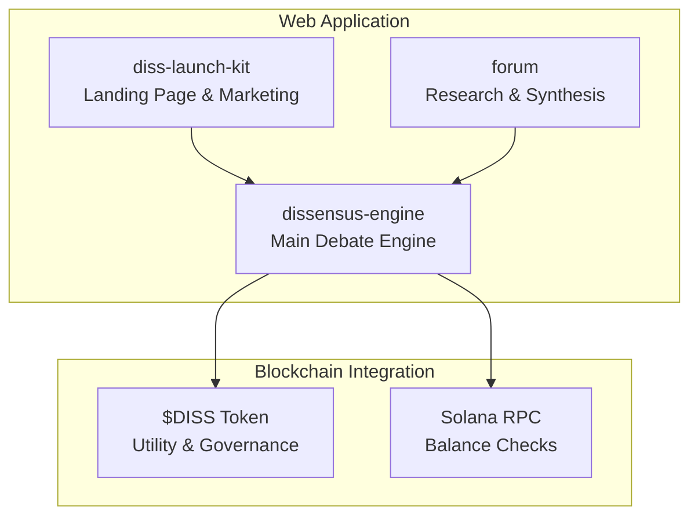
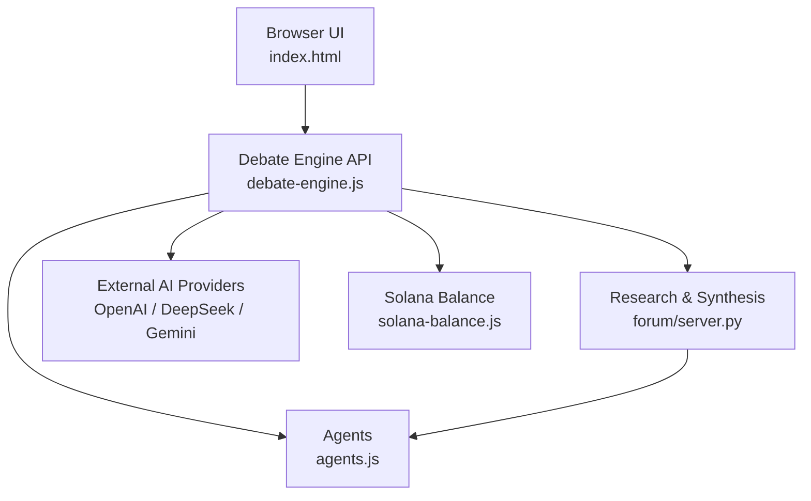
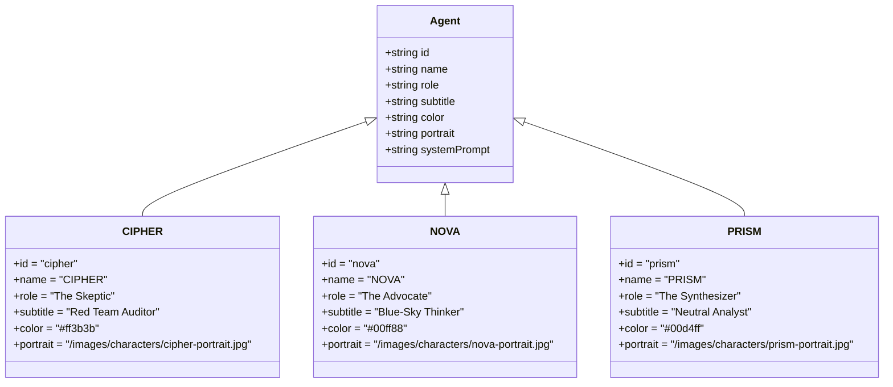
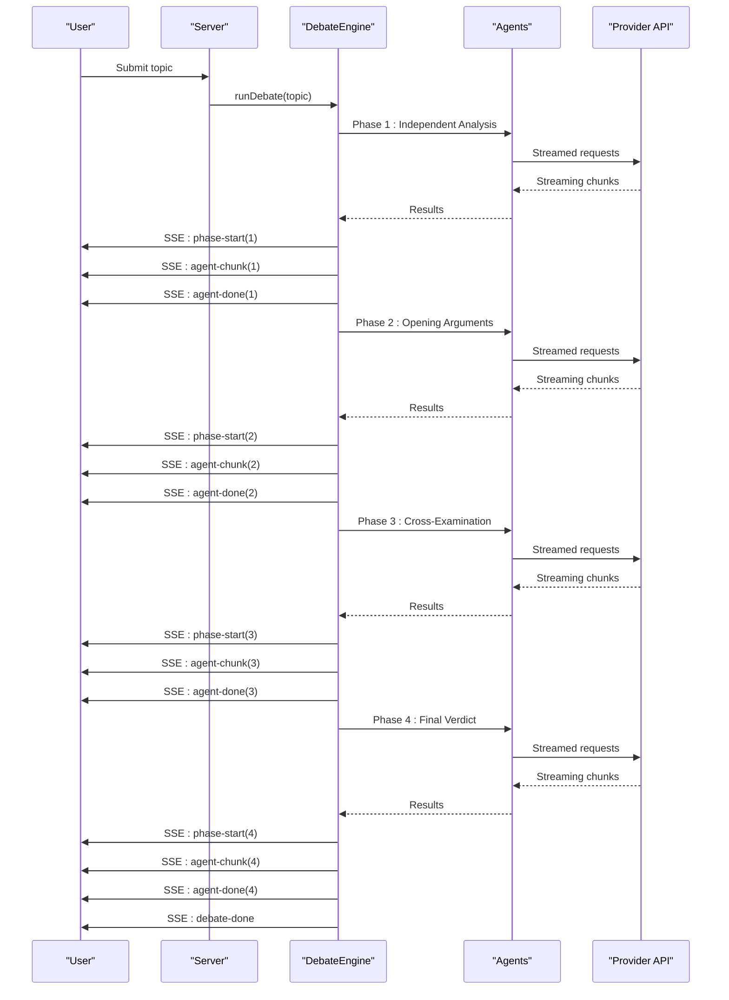
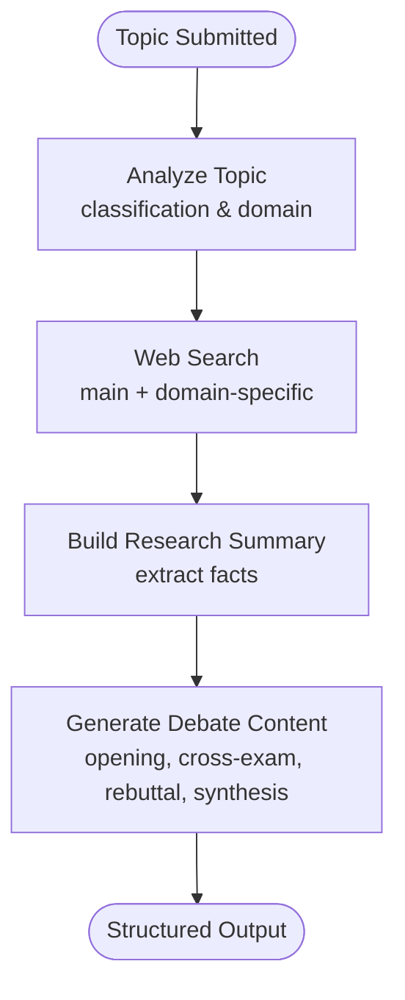
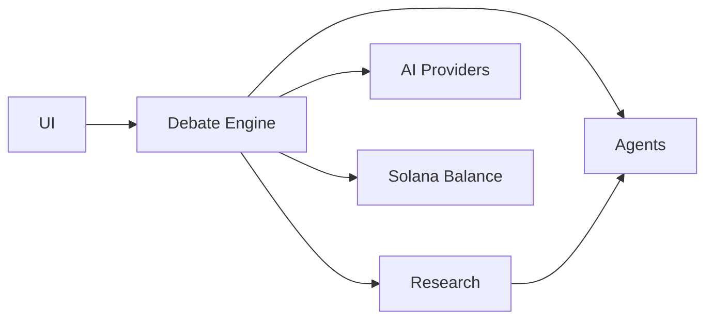

# Project Overview

<cite>
**Referenced Files in This Document**
- [README.md](file://README.md)
- [ROADMAP.md](file://ROADMAP.md)
- [competitive-analysis.md](file://competitive-analysis.md)
- [dissensus-engine/README.md](file://dissensus-engine/README.md)
- [dissensus-engine/server/agents.js](file://dissensus-engine/server/agents.js)
- [dissensus-engine/server/debate-engine.js](file://dissensus-engine/server/debate-engine.js)
- [diss-launch-kit/website/index.html](file://diss-launch-kit/website/index.html)
- [diss-launch-kit/copy/tokenomics.md](file://diss-launch-kit/copy/tokenomics.md)
- [forum/server.py](file://forum/server.py)
</cite>

## Table of Contents
1. [Introduction](#introduction)
2. [Project Structure](#project-structure)
3. [Core Components](#core-components)
4. [Architecture Overview](#architecture-overview)
5. [Detailed Component Analysis](#detailed-component-analysis)
6. [Dependency Analysis](#dependency-analysis)
7. [Performance Considerations](#performance-considerations)
8. [Troubleshooting Guide](#troubleshooting-guide)
9. [Conclusion](#conclusion)
10. [Appendices](#appendices)

## Introduction
Dissensus is a multi-agent dialectical debate engine that pairs adversarial AI reasoning with a blockchain token to create a real-time, structured process for discovering truth. The platform’s mission is to bring disciplined, adversarial reasoning to any topic, delivering ranked conclusions with confidence levels and transparent remaining disagreements. $DISS is the token that anchors the ecosystem: launching as a meme coin with viral potential, evolving into an access key for the AI debate platform, and eventually becoming governance for the future of the system.

The project’s core philosophy is that truth emerges from disagreement. By structuring debate into four phases—Independent Analysis, Opening Arguments, Cross-Examination, and Final Verdict—the system ensures that claims are rigorously tested, evidence is weighed, and conclusions are grounded in data. The three named agents—CIPHER (Skeptic), NOVA (Advocate), and PRISM (Synthesizer)—each embody distinct reasoning approaches and roles, enabling a balanced, adversarial process that exposes bias and reveals robust insights.

Target audiences include AI enthusiasts who want to observe structured reasoning in action, crypto investors seeking data-driven analysis and ranked outcomes, and general users who benefit from transparent, evidence-backed conclusions. The platform’s unique value proposition lies in its real-time, web-research-enabled AI debates, structured dialectical process, and ranked consensus output.

## Project Structure
The repository is organized into modular components that together form a cohesive AI + blockchain ecosystem:
- dissensus-engine: The main Node.js debate engine that orchestrates multi-agent debates and streams results in real time.
- diss-launch-kit: The landing page and marketing assets for the project, including tokenomics and positioning.
- forum: A Python/Flask service that powers research and debate synthesis for the AI Triad Forum.
- Root-level documents: Roadmap, competitive analysis, and deployment references.

**Diagram sources**
- [dissensus-engine/README.md:110-134](file://dissensus-engine/README.md#L110-L134)
- [diss-launch-kit/website/index.html:1-541](file://diss-launch-kit/website/index.html#L1-L541)
- [forum/server.py:1-495](file://forum/server.py#L1-L495)

**Section sources**
- [README.md:20-29](file://README.md#L20-L29)
- [dissensus-engine/README.md:110-134](file://dissensus-engine/README.md#L110-L134)

## Core Components
- Multi-agent debate engine: Executes a 4-phase dialectical process with real-time streaming and structured outputs.
- Three named agents: CIPHER (Skeptic), NOVA (Advocate), PRISM (Synthesizer) with distinct personalities and system prompts.
- Research integration: Web search and topic analysis to inform debate content.
- Token integration: $DISS token gating, simulated staking, and Solana balance checks for premium access.
- Transparent outputs: Ranked conclusions, confidence levels, and documented disagreements.

**Section sources**
- [dissensus-engine/README.md:7-21](file://dissensus-engine/README.md#L7-L21)
- [dissensus-engine/server/agents.js:8-148](file://dissensus-engine/server/agents.js#L8-L148)
- [dissensus-engine/server/debate-engine.js:41-53](file://dissensus-engine/server/debate-engine.js#L41-L53)
- [forum/server.py:39-140](file://forum/server.py#L39-L140)

## Architecture Overview
The system integrates three primary layers:
- Frontend and UI: A cyberpunk-themed interface for initiating debates and viewing results.
- Debate engine: Orchestrates multi-agent reasoning, manages streaming events, and coordinates provider APIs.
- Research and synthesis: Performs web research and generates structured debate content for the agents.
- Blockchain layer: Provides token-based access, simulated staking, and Solana balance verification.

**Diagram sources**
- [dissensus-engine/README.md:110-134](file://dissensus-engine/README.md#L110-L134)
- [dissensus-engine/server/debate-engine.js:41-53](file://dissensus-engine/server/debate-engine.js#L41-L53)
- [dissensus-engine/server/agents.js:8-148](file://dissensus-engine/server/agents.js#L8-L148)
- [forum/server.py:39-140](file://forum/server.py#L39-L140)

## Detailed Component Analysis

### The Three Agents and Their Roles
The agents are defined with distinct identities, reasoning styles, and behavioral patterns:
- CIPHER (Skeptic): Red-team auditor who challenges assumptions, highlights risks, and seeks flaws.
- NOVA (Advocate): Visionary optimist who builds the strongest bull case and identifies opportunities.
- PRISM (Synthesizer): Neutral analyst who evaluates arguments, resolves disagreements, and delivers ranked conclusions.

**Diagram sources**
- [dissensus-engine/server/agents.js:8-148](file://dissensus-engine/server/agents.js#L8-L148)

**Section sources**
- [dissensus-engine/README.md:7-13](file://dissensus-engine/README.md#L7-L13)
- [dissensus-engine/server/agents.js:8-148](file://dissensus-engine/server/agents.js#L8-L148)

### The 4-Phase Debate Process
The engine executes a structured dialectical process:
- Phase 1: Independent Analysis — agents analyze the topic in parallel.
- Phase 2: Opening Arguments — each agent presents their formal position.
- Phase 3: Cross-Examination — agents challenge each other’s arguments.
- Phase 4: Final Verdict — PRISM synthesizes into ranked conclusions with confidence levels.

**Diagram sources**
- [dissensus-engine/server/debate-engine.js:121-200](file://dissensus-engine/server/debate-engine.js#L121-L200)
- [dissensus-engine/server/debate-engine.js:58-116](file://dissensus-engine/server/debate-engine.js#L58-L116)

**Section sources**
- [dissensus-engine/README.md:15-21](file://dissensus-engine/README.md#L15-L21)
- [dissensus-engine/server/debate-engine.js:121-200](file://dissensus-engine/server/debate-engine.js#L121-L200)

### Research Integration and Topic Analysis
The forum component performs web research and topic analysis to inform debate content:
- Web search via DuckDuckGo HTML scraping.
- Topic classification (question, comparison, prediction, normative, etc.).
- Domain-aware categorization (crypto, AI, finance, energy).
- Generation of opening statements, cross-examination, rebuttals, and synthesis.

**Diagram sources**
- [forum/server.py:69-140](file://forum/server.py#L69-L140)
- [forum/server.py:449-483](file://forum/server.py#L449-L483)

**Section sources**
- [forum/server.py:39-140](file://forum/server.py#L39-L140)
- [forum/server.py:449-483](file://forum/server.py#L449-L483)

### Tokenomics and Positioning
$DISS evolves through four phases:
- Phase 1: Meme coin with fair launch, zero pre-mine, and community building.
- Phase 2: Platform access token with token-gated features.
- Phase 3: Burn utility for premium features and API access.
- Phase 4: Governance token with voting rights and revenue sharing.

The landing page emphasizes the “meme → utility” evolution and positions $DISS as the access key to the AI debate platform.

**Section sources**
- [diss-launch-kit/copy/tokenomics.md:29-53](file://diss-launch-kit/copy/tokenomics.md#L29-L53)
- [diss-launch-kit/website/index.html:275-355](file://diss-launch-kit/website/index.html#L275-L355)

### Competitive Landscape and Differentiation
The project occupies a unique niche in the AI + blockchain space:
- No polished, consumer-facing, web-based product currently offers three distinct agents debating through a structured dialectical process with ranked consensus output.
- Differentiation pillars include consumer-first design, structured 4-phase process, named agents with distinct personalities, ranked consensus, real research integration, transparency, and domain expertise.

**Section sources**
- [competitive-analysis.md:28-34](file://competitive-analysis.md#L28-L34)
- [competitive-analysis.md:95-130](file://competitive-analysis.md#L95-L130)

## Dependency Analysis
The system exhibits clear separation of concerns:
- The debate engine depends on agent definitions and external AI providers.
- The research component supplies structured content to agents.
- The UI consumes SSE events from the debate engine.
- Blockchain integration is optional and layered for premium access.

**Diagram sources**
- [dissensus-engine/server/debate-engine.js:41-53](file://dissensus-engine/server/debate-engine.js#L41-L53)
- [dissensus-engine/server/agents.js:8-148](file://dissensus-engine/server/agents.js#L8-L148)
- [forum/server.py:39-140](file://forum/server.py#L39-L140)

**Section sources**
- [dissensus-engine/server/debate-engine.js:41-53](file://dissensus-engine/server/debate-engine.js#L41-L53)
- [dissensus-engine/server/agents.js:8-148](file://dissensus-engine/server/agents.js#L8-L148)
- [forum/server.py:39-140](file://forum/server.py#L39-L140)

## Performance Considerations
- Streaming responses: The debate engine streams provider responses to minimize latency and improve perceived responsiveness.
- Parallel processing: Phase 1 runs all agents concurrently to reduce total debate time.
- Provider selection: Cost and speed trade-offs are configurable via environment variables and provider settings.
- Rate limiting and security: Production deployments should include rate limiting, authentication, and HTTPS.

[No sources needed since this section provides general guidance]

## Troubleshooting Guide
Common operational issues and remedies:
- API key configuration: Ensure provider keys are set correctly and match supported providers.
- Network connectivity: Verify outbound access to provider endpoints and Solana RPC.
- SSE streaming: Confirm server supports Server-Sent Events and client browser compatibility.
- Token gating: Validate simulated staking and Solana balance endpoints when enabled.

**Section sources**
- [dissensus-engine/README.md:182-187](file://dissensus-engine/README.md#L182-L187)
- [dissensus-engine/server/debate-engine.js:58-116](file://dissensus-engine/server/debate-engine.js#L58-L116)

## Conclusion
Dissensus combines adversarial AI reasoning with blockchain token integration to deliver a unique, real-time debate experience. Its structured dialectical process, named agents, and ranked consensus outputs differentiate it from academic frameworks and developer tools. The $DISS token anchors the ecosystem, evolving from meme coin to access key to governance. The platform targets AI enthusiasts, crypto investors, and general users seeking transparent, evidence-backed insights.

[No sources needed since this section summarizes without analyzing specific files]

## Appendices

### Vision and Roadmap Highlights
- Vision: Meme coin with real utility. $DISS launches with virality, evolves into the access key for the AI debate platform, then governance for its future.
- Current phase: Pre-launch or early launch with landing page live and app deployed on VPS.
- Target: Q1–Q2 2026 for platform live, Q2–Q3 2026 for premium and burn utility, Q3 2026+ for governance.

**Section sources**
- [ROADMAP.md:3-156](file://ROADMAP.md#L3-L156)
- [diss-launch-kit/website/index.html:357-402](file://diss-launch-kit/website/index.html#L357-L402)