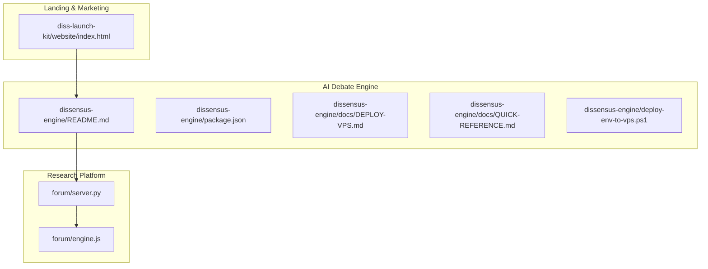
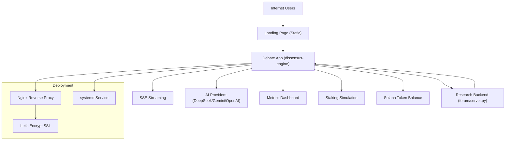
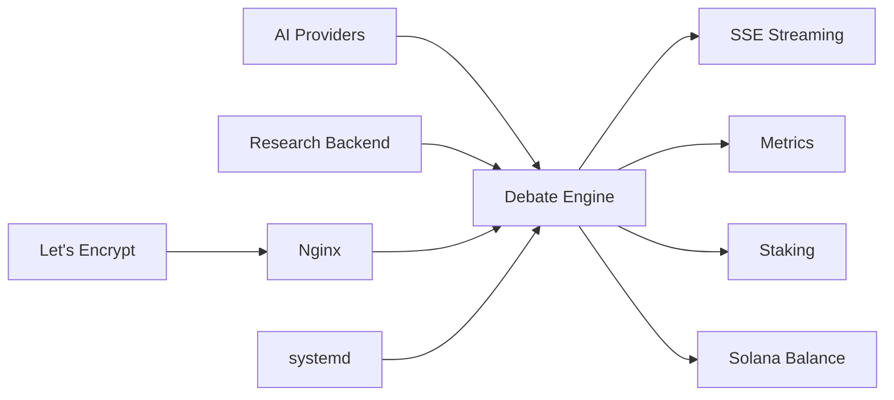

# Roadmap & Key Milestones

<cite>
**Referenced Files in This Document**
- [ROADMAP.md](file://ROADMAP.md)
- [README.md](file://README.md)
- [todo.md](file://todo.md)
- [competitive-analysis.md](file://competitive-analysis.md)
- [dissensus-engine README.md](file://dissensus-engine/README.md)
- [dissensus-engine package.json](file://dissensus-engine/package.json)
- [dissensus-engine deploy-env-to-vps.ps1](file://dissensus-engine/deploy-env-to-vps.ps1)
- [dissensus-engine docs DEPLOY-VPS.md](file://dissensus-engine/docs/DEPLOY-VPS.md)
- [dissensus-engine docs QUICK-REFERENCE.md](file://dissensus-engine/docs/QUICK-REFERENCE.md)
- [diss-launch-kit website index.html](file://diss-launch-kit/website/index.html)
- [forum server.py](file://forum/server.py)
- [forum engine.js](file://forum/engine.js)
</cite>

## Table of Contents
1. [Introduction](#introduction)
2. [Project Structure](#project-structure)
3. [Core Components](#core-components)
4. [Architecture Overview](#architecture-overview)
5. [Detailed Component Analysis](#detailed-component-analysis)
6. [Dependency Analysis](#dependency-analysis)
7. [Performance Considerations](#performance-considerations)
8. [Troubleshooting Guide](#troubleshooting-guide)
9. [Conclusion](#conclusion)
10. [Appendices](#appendices)

## Introduction
This document outlines the product roadmap and key milestones for the Dissensus AI debate platform. It documents completed milestones, current status, upcoming features, timeline expectations, resource allocation, dependencies, risks, mitigations, and success indicators aligned with the platform’s vision of “3 AI Minds. 1 Truth.” The roadmap spans five phases: Launch & Community, Platform Live, Premium Features, Scale & Ecosystem, and a technical milestone list that tracks platform readiness and operational capabilities.

## Project Structure
The repository organizes the platform across:
- A main AI debate engine (Node.js) powering the live app
- A landing page website (multiple variants) and marketing materials
- A research-powered forum (Python/Flask) that integrates web research into the debate pipeline
- Deployment and operational documentation for VPS hosting and SSL

**Diagram sources**
- [diss-launch-kit website index.html](file://diss-launch-kit/website/index.html)
- [dissensus-engine README.md](file://dissensus-engine/README.md)
- [dissensus-engine package.json](file://dissensus-engine/package.json)
- [dissensus-engine docs DEPLOY-VPS.md](file://dissensus-engine/docs/DEPLOY-VPS.md)
- [dissensus-engine docs QUICK-REFERENCE.md](file://dissensus-engine/docs/QUICK-REFERENCE.md)
- [dissensus-engine deploy-env-to-vps.ps1](file://dissensus-engine/deploy-env-to-vps.ps1)
- [forum server.py](file://forum/server.py)
- [forum engine.js](file://forum/engine.js)

**Section sources**
- [README.md:20-29](file://README.md#L20-L29)

## Core Components
- AI Debate Engine (dissensus-engine): Multi-agent dialectical debate system with 4-phase process, provider integrations (DeepSeek, Gemini, OpenAI), SSE streaming, metrics, staking simulation, and Solana token balance integration.
- Landing Page (diss-launch-kit): Marketing website with token utility evolution, roadmap, and CTA to the live app.
- Research Platform (forum): Python/Flask backend that performs web research and generates structured debate content for the frontend.
- Deployment & Ops: Comprehensive VPS deployment guide, systemd service, Nginx reverse proxy, SSL, and quick-reference commands.

**Section sources**
- [dissensus-engine README.md:1-206](file://dissensus-engine/README.md#L1-L206)
- [diss-launch-kit website index.html:357-402](file://diss-launch-kit/website/index.html#L357-L402)
- [forum server.py:1-495](file://forum/server.py#L1-L495)
- [dissensus-engine docs DEPLOY-VPS.md:1-744](file://dissensus-engine/docs/DEPLOY-VPS.md#L1-L744)

## Architecture Overview
The platform architecture combines a landing page, a live debate engine, and a research pipeline. The engine streams debate results via SSE and integrates with AI providers. The research platform augments debate content with real-time web research.

**Diagram sources**
- [dissensus-engine README.md:110-134](file://dissensus-engine/README.md#L110-L134)
- [dissensus-engine docs DEPLOY-VPS.md:272-383](file://dissensus-engine/docs/DEPLOY-VPS.md#L272-L383)
- [forum server.py:449-489](file://forum/server.py#L449-L489)

## Detailed Component Analysis

### Phase 1 — Launch & Community (Q3 2025 → Q1 2026)
- Goal: Brand awareness, community growth, platform beta.
- Completed:
  - Landing page live on dissensus.fun
  - App deployed on VPS (app.dissensus.fun)
  - DeepSeek integration (server-side API key)
  - Production hardening (rate limiting, security headers)
- In Progress:
  - Final social links
  - DNS and SSL for app subdomain pending
  - Dissensus branding in app UI pending
  - User accounts and session management pending
- Current Status: Landing page ready; app live; branding and user features targeted for Q1–Q2 2026.

Success Indicators:
- Website traffic growth and social engagement
- App availability and stability metrics
- Community sign-ups and retention

Risks & Mitigations:
- Risk: Slow community traction
  - Mitigation: Accelerate social campaigns and influencer partnerships
- Risk: DNS/SSL delays
  - Mitigation: Pre-configure DNS records and automate SSL renewal

**Section sources**
- [ROADMAP.md:18-36](file://ROADMAP.md#L18-L36)
- [ROADMAP.md:111-123](file://ROADMAP.md#L111-L123)
- [diss-launch-kit website index.html:404-415](file://diss-launch-kit/website/index.html#L404-L415)

### Phase 2 — Platform Live (Q1–Q2 2026)
- Goal: Fully operational AI debate engine with named agents and end-to-end 4-phase process.
- Completed:
  - VPS deployment and DeepSeek integration
  - Production hardening (security, rate limiting)
- In Progress:
  - Dissensus branding in app UI
  - User accounts and session management
  - Three agents live (CIPHER, NOVA, PRISM)
  - 4-phase debate working end-to-end
  - First community debates
- Target: Q1–Q2 2026; app deployable with branding and user features.

Success Indicators:
- Live debates with named agents
- End-to-end 4-phase process functioning
- Community showcase debates published

Risks & Mitigations:
- Risk: Provider latency or quota issues
  - Mitigation: Add Gemini/OpenAI fallback and monitoring
- Risk: UI branding delays
  - Mitigation: Parallelize frontend and backend tasks

**Section sources**
- [ROADMAP.md:39-66](file://ROADMAP.md#L39-L66)
- [dissensus-engine README.md:78-109](file://dissensus-engine/README.md#L78-L109)

### Phase 3 — Premium Features (Q2–Q3 2026)
- Goal: Advanced features for power users.
- Planned:
  - Deep Research Mode (web search + debate)
  - Custom agent personalities (user-defined roles)
  - Private debate sessions (save/share)
  - API access for developers
  - Mobile-optimized UI
  - Partnerships and integrations
  - Developer documentation

Success Indicators:
- Premium features shipped and discoverable
- Developer onboarding materials available
- Mobile UI responsive and functional

Risks & Mitigations:
- Risk: Research backend overload
  - Mitigation: Rate-limit and cache research queries
- Risk: API security gaps
  - Mitigation: Enforce rate limits and authentication

**Section sources**
- [ROADMAP.md:69-86](file://ROADMAP.md#L69-L86)
- [diss-launch-kit website index.html:307-354](file://diss-launch-kit/website/index.html#L307-L354)

### Phase 4 — Scale & Ecosystem (Q3 2026+)
- Goal: Platform maturity and ecosystem expansion.
- Planned:
  - Community voting on new agent personalities
  - Community voting on platform features
  - Community voting on provider/model additions
  - Sustainable revenue model
  - Developer incentive program
  - Becoming the standard for AI-powered analysis
  - B2B/white-label potential

Success Indicators:
- On-chain governance live and functional
- Revenue streams established
- White-label inquiries and contracts signed

Risks & Mitigations:
- Risk: Governance complexity
  - Mitigation: Start with simple yes/no votes and expand gradually
- Risk: Revenue model misalignment
  - Mitigation: Pilot premium tiers and iterate based on usage

**Section sources**
- [ROADMAP.md:89-108](file://ROADMAP.md#L89-L108)
- [competitive-analysis.md:94-129](file://competitive-analysis.md#L94-L129)

### Technical Milestones
Track of operational readiness and platform capabilities:
- Landing page live (Hostinger): Ready
- App on VPS (app.dissensus.fun): Ready
- DNS + SSL for app subdomain: Pending
- Server-side DeepSeek API key: Ready
- Rate limiting, security headers: Done
- Dissensus branding in app: Pending
- User accounts: Phase 2
- Premium features: Phase 3

Operational Tasks:
- Set DNS: app.dissensus.fun → VPS IP
- Add Dissensus branding to dissensus-engine
- Go live and start community growth

**Section sources**
- [ROADMAP.md:111-135](file://ROADMAP.md#L111-L135)
- [todo.md:1-23](file://todo.md#L1-L23)

## Dependency Analysis
Key dependencies and relationships:
- App depends on AI providers (DeepSeek, Gemini, OpenAI) for debate generation
- Research backend feeds the debate engine with real-time web data
- Nginx and systemd manage app exposure and reliability
- SSL certificates enable HTTPS for the app
- Staking and Solana integration provide token-gated access and analytics

**Diagram sources**
- [dissensus-engine README.md:110-134](file://dissensus-engine/README.md#L110-L134)
- [dissensus-engine docs DEPLOY-VPS.md:272-383](file://dissensus-engine/docs/DEPLOY-VPS.md#L272-L383)
- [forum server.py:449-489](file://forum/server.py#L449-L489)

**Section sources**
- [dissensus-engine README.md:136-151](file://dissensus-engine/README.md#L136-L151)
- [dissensus-engine docs DEPLOY-VPS.md:389-413](file://dissensus-engine/docs/DEPLOY-VPS.md#L389-L413)

## Performance Considerations
- SSE streaming requires Nginx to disable buffering for real-time debate output
- Provider latency and quotas influence throughput; implement fallbacks and monitoring
- Rate limiting and security headers protect the app under load
- Operational costs depend on provider pricing; budget for sustained usage

[No sources needed since this section provides general guidance]

## Troubleshooting Guide
Common operational issues and resolutions:
- 502 Bad Gateway: Verify the Node.js service is running and healthy
- SSE streaming not working: Confirm Nginx streaming configuration disables buffering
- SSL certificate issues: Validate DNS propagation and firewall rules for ports 80/433
- Out of memory: Add swap space and monitor memory usage

**Section sources**
- [dissensus-engine docs DEPLOY-VPS.md:601-690](file://dissensus-engine/docs/DEPLOY-VPS.md#L601-L690)
- [dissensus-engine docs QUICK-REFERENCE.md:75-164](file://dissensus-engine/docs/QUICK-REFERENCE.md#L75-L164)

## Conclusion
The roadmap aligns product evolution with technical readiness and community growth. By completing Phase 1 (Launch & Community), advancing to Phase 2 (Platform Live), introducing premium features in Phase 3, and scaling into an ecosystem-driven platform in Phase 4, Dissensus will deliver on its vision of adversarial truth-finding powered by AI. Operational milestones, provider diversification, and robust deployment practices will ensure reliable delivery and scalability.

[No sources needed since this section summarizes without analyzing specific files]

## Appendices

### Upcoming Features and Integrations
- Enhanced AI models: Expand provider options and model selection
- Expanded token utilities: Access tokens, burn utility, governance participation
- Research platform integration: Real-time web research embedded in debates
- Mobile deployment: Responsive UI and native app exploration

**Section sources**
- [ROADMAP.md:69-108](file://ROADMAP.md#L69-L108)
- [diss-launch-kit website index.html:307-354](file://diss-launch-kit/website/index.html#L307-L354)

### Timeline Expectations
- Q3 2025 → Q1 2026: Launch & Community
- Q1–Q2 2026: Platform Live
- Q2–Q3 2026: Premium Features
- Q3 2026+: Scale & Ecosystem

**Section sources**
- [ROADMAP.md:9-14](file://ROADMAP.md#L9-L14)

### Resource Allocation
- Development: Core engine, UI, research pipeline
- Operations: VPS hosting, SSL, monitoring, CI/CD
- Marketing: Social channels, community growth, partnerships
- Legal/Compliance: Token disclosure, regulatory considerations

[No sources needed since this section provides general guidance]

### Risk Register
- Provider dependency risk: Mitigate by adding Gemini/OpenAI and monitoring SLAs
- Community adoption risk: Mitigate by accelerating outreach and engagement
- Operational risk: Mitigate by automating deployments, backups, and monitoring
- Governance complexity risk: Mitigate by starting simple and iterating

**Section sources**
- [competitive-analysis.md:28-34](file://competitive-analysis.md#L28-L34)
- [dissensus-engine docs DEPLOY-VPS.md:601-690](file://dissensus-engine/docs/DEPLOY-VPS.md#L601-L690)